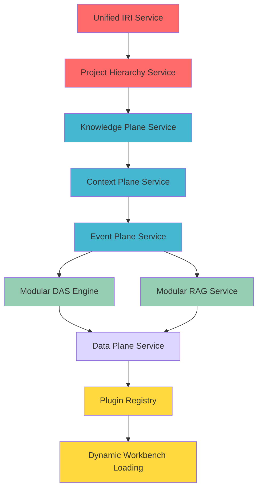

<!-- b8c9d5e2-4f3a-4d2e-b5c8-7e9f1a2b3c4d mvp-foundation-decoupling -->
# MVP Foundation Decoupling Plan

## Goal

Transform ODRAS from a monolithic application into a modular, plugin-based architecture with decoupled DAS/RAG systems, unified data/event planes, and pluggable workbenches. Establish the foundational patterns that enable unlimited growth and flexibility.

## Executive Summary

This plan addresses the **foundational architectural concerns** that must be solved before workbench modularization can succeed. The current monolithic design has deep coupling between DAS, RAG, workbenches, and core systems that would break during plugin migration without careful decoupling.

## Critical Issues Identified

### 1. **DAS Application Awareness Crisis**

- **Problem**: DAS has hardcoded knowledge of specific workbenches
- **Impact**: New workbenches won't be discoverable by DAS
- **Risk**: DAS context awareness breaks during modularization

### 2. **RAG Storage Coupling**  

- **Problem**: RAG directly accesses storage systems with hardcoded collection names
- **Impact**: Workbench storage isolation impossible
- **Risk**: Knowledge access breaks when workbenches become plugins

### 3. **Event Plane Missing**

- **Problem**: Workbenches use direct coupling instead of event-driven communication
- **Impact**: No decoupled communication mechanism
- **Risk**: Plugin workbenches can't communicate

### 4. **IRI Minting Chaos**

- **Problem**: Multiple competing IRI services with no integration
- **Impact**: Namespace conflicts and inconsistent resource identification
- **Risk**: Resource identification breaks across modular workbenches

### 5. **Project Hierarchy Fragmentation**

- **Problem**: L0/L1/L2 hierarchy designed but implementation scattered
- **Impact**: Parent-child cascading doesn't work properly
- **Risk**: Multi-level project operations fail

## Target Architecture

### **Knowledge Plane** (NEW)

```typescript
interface KnowledgePlane {
  // Domain-agnostic knowledge access
  queryKnowledge(query: KnowledgeQuery): Promise<KnowledgeResults>
  storeKnowledge(domain: string, knowledge: KnowledgeItem): Promise<void>
  registerKnowledgeDomain(domain: string, provider: KnowledgeProvider): void
  
  // Context-aware retrieval
  getProjectContext(projectId: string): Promise<ProjectKnowledgeContext>
  getWorkbenchContext(workbenchId: string): Promise<WorkbenchKnowledgeContext>
}
```

### **Context Plane** (NEW)

```typescript
interface ContextPlane {
  // Dynamic context discovery
  getActiveContexts(): Promise<ContextInfo[]>
  subscribeToContextChanges(handler: ContextChangeHandler): void
  
  // Abstract context access
  getContext(type: string, id: string): Promise<any>
  setContext(type: string, id: string, context: any): Promise<void>
}
```

### **Event Plane** (IMPLEMENTATION REQUIRED)

```typescript
interface EventPlane {
  // Semantic event publishing
  publishEvent(event: SemanticEvent): Promise<void>
  subscribeToEvents(pattern: EventPattern, handler: EventHandler): void
  
  // Event semantics registration
  registerEventSemantics(eventType: string, semantics: EventSemantics): void
  getEventSemantics(eventType: string): Promise<EventSemantics>
}
```

### **Data Plane** (NEW)

```typescript
interface DataPlane {
  // Workbench data pipeline
  exportFromWorkbench(workbenchId: string, format: DataFormat): Promise<WorkbenchData>
  importToWorkbench(workbenchId: string, data: WorkbenchData): Promise<void>
  
  // Cross-workbench data flow
  createDataPipeline(source: string, target: string, transform?: DataTransform): Promise<Pipeline>
  getDataSchema(workbenchId: string): Promise<DataSchema>
}
```

## Implementation Plan

### **Phase 1: Foundation Infrastructure** (Week 1-2)

#### **1.1 Unified IRI Service** (2-3 days)

```python
# Create: backend/services/unified_iri_service.py
class UnifiedIRIService:
    def __init__(self, installation_service, namespace_service, project_service):
        # Consolidate all IRI minting
        pass
    
    def mint_project_resource_iri(
        self, 
        project_id: str, 
        workbench_id: str, 
        resource_type: str, 
        resource_name: str
    ) -> str:
        # Integrate project hierarchy (L0/L1/L2)
        # Use installation configuration  
        # Ensure global uniqueness
        pass
```

**Files to Create/Modify:**

- `backend/services/unified_iri_service.py` (NEW)
- `backend/api/iri.py` (NEW - unified IRI endpoints)
- Update `backend/services/ontology_manager.py` to use unified service
- Update `backend/api/namespace.py` to use unified service

#### **1.2 Project Hierarchy Service** (3-4 days)

```python
# Create: backend/services/project_hierarchy_service.py
class ProjectHierarchyService:
    async def get_project_hierarchy(self, project_id: str) -> ProjectHierarchy
    async def get_cascade_rules(self, project_id: str) -> List[CascadeRule]
    async def cascade_knowledge_to_children(self, parent_id: str, knowledge: Any): Promise<void>
    async def bubble_results_to_parents(self, child_id: str, results: Any): Promise<void>
```

**Files to Create/Modify:**

- `backend/services/project_hierarchy_service.py` (NEW)
- `backend/schemas/project_hierarchy.py` (NEW - Pydantic models)
- `backend/api/projects.py` (ADD hierarchy endpoints)
- Update database schema for proper L0/L1/L2 implementation

#### **1.3 Knowledge Plane Service** (4-5 days)

```python
# Create: backend/services/knowledge_plane_service.py
class KnowledgePlaneService:
    def __init__(self):
        self.knowledge_domains = {}  # Dynamic domain registry
        self.storage_providers = {}  # Pluggable storage providers
    
    async def register_knowledge_domain(self, domain: str, provider: KnowledgeProvider):
        # Allow workbenches to register their knowledge domains
        pass
    
    async def query_knowledge(self, query: KnowledgeQuery) -> KnowledgeResults:
        # Query across registered domains
        # Route to appropriate storage providers
        pass
```

**Files to Create/Modify:**

- `backend/services/knowledge_plane_service.py` (NEW)
- `backend/interfaces/knowledge_provider.py` (NEW - abstract interface)
- `backend/schemas/knowledge_plane.py` (NEW - Pydantic models)
- `backend/api/knowledge_plane.py` (NEW - unified knowledge endpoints)

### **Phase 2: DAS/RAG Decoupling** (Week 2-3)

#### **2.1 Context Plane Service** (3-4 days)

```python
# Create: backend/services/context_plane_service.py
class ContextPlaneService:
    def __init__(self):
        self.context_providers = {}  # Dynamic context provider registry
    
    async def register_context_provider(self, type: str, provider: ContextProvider):
        # Allow workbenches to register context providers
        pass
    
    async def get_active_contexts(self) -> List[ContextInfo]:
        # Discover contexts from all registered providers
        pass
```

**Files to Create/Modify:**

- `backend/services/context_plane_service.py` (NEW)
- `backend/interfaces/context_provider.py` (NEW - abstract interface)
- `frontend/js/core/context-plane.js` (NEW - frontend context abstraction)

#### **2.2 Event Plane Implementation** (3-4 days)

```python
# Create: backend/services/event_plane_service.py
class EventPlaneService:
    def __init__(self, redis_client):
        self.redis = redis_client
        self.event_semantics = {}  # Semantic event registry
        self.subscribers = {}      # Event subscribers
    
    async def register_event_semantics(self, event_type: str, semantics: EventSemantics):
        # Allow workbenches to define their event semantics
        pass
    
    async def publish_semantic_event(self, event: SemanticEvent):
        # Publish with semantic understanding
        pass
```

**Files to Create/Modify:**

- `backend/services/event_plane_service.py` (NEW)
- `backend/schemas/semantic_events.py` (NEW - event models)
- `frontend/js/core/event-plane.js` (NEW - frontend event abstraction)

#### **2.3 Modular DAS Engine** (4-5 days)

```python
# Modify: backend/services/das_core_engine.py
class ModularDASCoreEngine:
    def __init__(
        self, 
        knowledge_plane: KnowledgePlaneService,
        context_plane: ContextPlaneService,
        event_plane: EventPlaneService
    ):
        # DAS no longer has hardcoded workbench knowledge
        # All awareness through abstract planes
        pass
    
    async def get_application_context(self) -> ApplicationContext:
        # Discover contexts dynamically
        contexts = await self.context_plane.get_active_contexts()
        # Build comprehensive context without hardcoded assumptions
        pass
```

#### **2.4 Modular RAG Service** (4-5 days)

```python
# Modify: backend/rag/core/modular_rag_service.py
class TrulyModularRAGService:
    def __init__(self, knowledge_plane: KnowledgePlaneService):
        # RAG accesses knowledge through abstraction only
        self.knowledge_plane = knowledge_plane
    
    async def query_knowledge_base(self, query: RAGQuery) -> RAGResponse:
        # Query through knowledge plane (no direct storage access)
        knowledge_query = self._translate_to_knowledge_query(query)
        return await self.knowledge_plane.query_knowledge(knowledge_query)
    
    async def _translate_to_knowledge_query(self, rag_query: RAGQuery) -> KnowledgeQuery:
        # Translate RAG-specific query to generic knowledge query
        pass
```

### **Phase 3: Data Plane Implementation** (Week 3-4)

#### **3.1 Data Manager Workbench** (5-6 days)

```typescript
// Create: frontend/js/workbenches/data-manager/
class DataManagerWorkbench {
  // Visual data pipeline builder
  // Import/export between workbenches
  // Data transformation engine
  // Pipeline monitoring
}
```

#### **3.2 Workbench Data Connectors** (3-4 days)

```python
# Create: backend/interfaces/workbench_data_connector.py
class WorkbenchDataConnector(ABC):
    @abstractmethod
    async def export_data(self, format: DataFormat, filter: DataFilter) -> WorkbenchData:
        pass
    
    @abstractmethod
    async def import_data(self, data: WorkbenchData) -> ImportResult:
        pass
    
    @abstractmethod
    def get_data_schema(self) -> DataSchema:
        pass
```

### **Phase 4: Plugin Architecture Foundation** (Week 4-5)

#### **4.1 Plugin Registry Service** (3-4 days)

```python
# Create: backend/services/plugin_registry_service.py
class PluginRegistryService:
    async def register_workbench_plugin(self, plugin: WorkbenchPlugin):
        # Register plugin with all planes (knowledge, context, event, data)
        await self.knowledge_plane.register_knowledge_domain(plugin.domain, plugin.knowledge_provider)
        await self.context_plane.register_context_provider(plugin.context_type, plugin.context_provider)
        await self.event_plane.register_event_semantics(plugin.event_types, plugin.event_semantics)
        pass
```

#### **4.2 Dynamic Workbench Loading** (4-5 days)

```typescript
// Modify: frontend/index.html
// Remove hardcoded workbench imports
// Replace with dynamic plugin discovery and loading
class PluginLoader {
  async loadWorkbenchPlugins(): Promise<WorkbenchPlugin[]>
  async initializeWorkbench(plugin: WorkbenchPlugin): Promise<void>
}
```

## Implementation Sequence

### **Critical Path Dependencies**



### **Week-by-Week Breakdown**

#### **Week 1: Foundation Services**

- **Day 1-2**: Unified IRI Service (consolidate all IRI minting)
- **Day 3-4**: Project Hierarchy Service (L0/L1/L2 implementation)
- **Day 5**: Testing and validation

#### **Week 2: Knowledge & Context Abstraction**

- **Day 1-3**: Knowledge Plane Service (abstract knowledge access)
- **Day 4-5**: Context Plane Service (dynamic context discovery)

#### **Week 3: Event System & DAS Decoupling**

- **Day 1-2**: Event Plane Implementation (semantic events)
- **Day 3-5**: Modular DAS Engine (remove hardcoded workbench knowledge)

#### **Week 4: RAG Decoupling & Data Plane**

- **Day 1-2**: Modular RAG Service (use knowledge plane)
- **Day 3-5**: Data Plane Service (workbench data pipelines)

#### **Week 5: Plugin Foundation**

- **Day 1-2**: Plugin Registry Service
- **Day 3-5**: Dynamic Workbench Loading

## Migration Strategy

### **Backward Compatibility Pattern**

```python
# Pattern: Maintain old interfaces during migration
class LegacyCompatibilityWrapper:
    def __init__(self, new_service, old_interface):
        self.new_service = new_service
        self.old_interface = old_interface
    
    async def legacy_method(self, *args, **kwargs):
        # Translate old calls to new service
        return await self.new_service.modern_method(*args, **kwargs)
```

### **Progressive Migration Steps**

1. **Create new services alongside old ones**
2. **Add compatibility wrappers**
3. **Migrate one component at a time**
4. **Remove old services after validation**

## Testing Strategy

### **Foundation Testing**

```python
# Test each foundational service independently
class TestUnifiedIRIService:
    async def test_project_hierarchy_integration()
    async def test_namespace_collision_prevention()
    async def test_installation_specific_patterns()

class TestKnowledgePlaneService:
    async def test_domain_registration()
    async def test_cross_domain_queries()
    async def test_workbench_isolation()
```

### **Integration Testing**

```python
# Test service integration
class TestFoundationIntegration:
    async def test_das_context_discovery()
    async def test_rag_knowledge_access()
    async def test_event_flow_end_to_end()
    async def test_data_pipeline_flow()
```

### **Migration Safety Testing**

```python
# Test backward compatibility
class TestMigrationSafety:
    async def test_existing_workbench_functionality()
    async def test_api_backward_compatibility()
    async def test_data_migration_integrity()
```

## Success Criteria

### **Foundation Services**

1. **✅ Unified IRI Management**: Single authority for all IRI generation
2. **✅ Project Hierarchy**: L0/L1/L2 properly implemented and tested
3. **✅ Knowledge Plane**: Workbench-agnostic knowledge access working
4. **✅ Context Plane**: Dynamic context discovery functional
5. **✅ Event Plane**: Semantic event system operational

### **DAS Decoupling**

1. **✅ No Hardcoded Workbench Knowledge**: DAS discovers workbenches dynamically
2. **✅ Context Awareness Maintained**: DAS understands application state through abstractions
3. **✅ Event Monitoring**: DAS receives semantic events from all sources
4. **✅ Knowledge Access**: DAS queries knowledge through knowledge plane

### **RAG Decoupling**  

1. **✅ Storage Abstraction**: RAG accesses knowledge through knowledge plane only
2. **✅ Dynamic Collections**: RAG works with collections discovered at runtime
3. **✅ Domain Isolation**: Different workbenches can have isolated knowledge domains
4. **✅ Multi-Storage Support**: Different storage strategies per domain

### **Plugin Readiness**

1. **✅ Dynamic Registration**: New workbenches can register with all planes
2. **✅ Hot Loading**: Workbenches can be loaded/unloaded at runtime  
3. **✅ Isolation**: Workbench failures don't affect other workbenches
4. **✅ Communication**: Workbenches communicate only through abstract planes

## File Organization

### **New Services Directory Structure**

```
backend/services/
├── foundation/
│   ├── unified_iri_service.py           # IRI minting consolidation
│   ├── project_hierarchy_service.py     # L0/L1/L2 implementation
│   ├── knowledge_plane_service.py       # Abstract knowledge access
│   ├── context_plane_service.py         # Dynamic context discovery
│   ├── event_plane_service.py           # Semantic event system
│   └── data_plane_service.py            # Workbench data pipelines
│
├── interfaces/
│   ├── knowledge_provider.py            # Knowledge provider interface
│   ├── context_provider.py              # Context provider interface
│   ├── event_provider.py                # Event provider interface
│   └── data_connector.py                # Data connector interface
│
└── plugins/
    ├── plugin_registry_service.py       # Plugin management
    └── workbench_plugin_loader.py       # Dynamic loading
```

### **Frontend Infrastructure**

```
frontend/js/core/
├── foundation/
│   ├── knowledge-plane.js               # Knowledge plane client
│   ├── context-plane.js                 # Context plane client
│   ├── event-plane.js                   # Event plane client
│   └── data-plane.js                    # Data plane client
│
├── plugin-loader.js                     # Dynamic workbench loading
└── workbench-registry.js                # Frontend plugin registry
```

## Risk Mitigation

### **High-Risk Areas**

1. **DAS Context Loss**: Risk of DAS losing application awareness during migration

   - **Mitigation**: Comprehensive testing of context discovery
   - **Fallback**: Maintain compatibility wrappers during transition

2. **RAG Knowledge Access Breaks**: Risk of RAG losing knowledge access

   - **Mitigation**: Progressive migration with validation at each step
   - **Fallback**: Keep old storage access until new system proven

3. **Event System Performance**: Risk of event plane being too slow

   - **Mitigation**: Performance benchmarks and optimization
   - **Fallback**: Direct coupling fallback for critical paths

### **Breaking Change Management**

```python
# Pattern: Feature flags for safe migration
class FeatureFlags:
    USE_UNIFIED_IRI_SERVICE = True
    USE_KNOWLEDGE_PLANE = True
    USE_CONTEXT_PLANE = True
    USE_EVENT_PLANE = True
    USE_PLUGIN_LOADING = False  # Last to enable
```

## Estimated Timeline

### **Week 1-2: Foundation** (10 days)

- Unified IRI Service
- Project Hierarchy Service  
- Knowledge Plane Service
- Context Plane Service

### **Week 3: DAS Decoupling** (5 days)

- Event Plane Service
- Modular DAS Engine

### **Week 4: RAG & Data** (5 days)  

- Modular RAG Service
- Data Plane Service

### **Week 5: Plugin Foundation** (5 days)

- Plugin Registry
- Dynamic Loading

**Total: 25 development days (5 weeks)**

## Success Validation

### **Foundation Validation**

```bash
# Test foundational services
pytest tests/foundation/ -v

# Test service integration
pytest tests/integration/test_foundation_integration.py -v

# Test existing functionality still works
pytest tests/api/test_full_use_case.py -v
```

### **DAS/RAG Validation**

```bash
# Test DAS context awareness
pytest tests/das/test_context_discovery.py -v

# Test RAG knowledge access
pytest tests/rag/test_knowledge_plane_access.py -v

# Test end-to-end DAS functionality
pytest tests/integration/test_das_end_to_end.py -v
```

### **Plugin Readiness Validation**

```bash
# Test plugin loading
pytest tests/plugins/test_plugin_loading.py -v

# Test workbench isolation
pytest tests/plugins/test_workbench_isolation.py -v
```

## Post-Implementation Plan

After this foundation is complete:

1. **Ontology Workbench Pluginification** (separate branch)
2. **Requirements Workbench Pluginification** (separate branch)
3. **Knowledge Workbench Pluginification** (separate branch)
4. **Data Manager Workbench Implementation** (separate branch)

Each workbench migration will use the patterns established in this foundation plan.

## Estimated Impact

### **Files Created**: ~35 new foundational files

### **Files Modified**: ~15 existing integration points

### **Breaking Changes**: Minimal (compatibility wrappers)

### **Performance Impact**: Expected improvement (better caching, event efficiency)

### **Development Velocity**: Major improvement after migration (plugin-based development)

---

**This plan establishes the architectural foundation that enables unlimited ODRAS growth through pluggable, decoupled components while maintaining DAS intelligence and RAG knowledge access.**