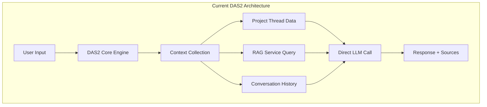
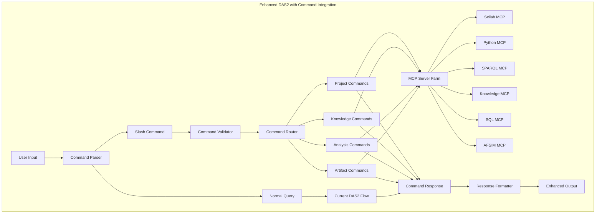

# Integrating Command Execution and MCP Server Capabilities into ODRAS Digital Assistant System (DAS): A Strategic Research Analysis

**Author:** AI Research Assistant
**Date:** September 27, 2025
**Document Type:** Research Whitepaper
**Classification:** Technical Architecture
**Target Audience:** ODRAS Development Team, Systems Architects, Project Management Stakeholders

## Executive Summary

This whitepaper presents a comprehensive analysis of integrating command execution capabilities and Model Context Protocol (MCP) server functionality into the ODRAS Digital Assistant System (DAS). Based on current industry best practices and the existing ODRAS architecture, we propose a strategic approach to enhance DAS with structured slash commands (e.g., `/assumption`, `/knowledge`, `/whitepaper`, `/project_goals`, `/requirement`) that enable seamless interaction with external tools, data sources, and project management workflows.

The integration will transform DAS from a conversational assistant into a comprehensive project management command center, capable of capturing assumptions, managing knowledge artifacts, generating documentation, and executing complex analytical workflows through MCP server integration.

## 1. Introduction

### 1.1 Background

The ODRAS (Ontological Design and Requirements Analysis System) platform currently implements DAS2, a simplified digital assistant that processes user queries by gathering project context, RAG-based knowledge, and conversation history to provide contextual responses. While effective for conversational interactions, the current system lacks structured command execution capabilities and direct integration with external analytical tools.

Modern LLM-based digital assistants are increasingly adopting command-based interaction patterns that provide:

- **Structured Data Capture**: Systematic collection of project assumptions, requirements, and knowledge snippets
- **Workflow Automation**: Direct execution of complex analytical and simulation tasks
- **Tool Orchestration**: Seamless integration with external systems through standardized protocols
- **Artifact Generation**: Automated creation of project documentation and reports

### 1.2 Scope and Objectives

This research addresses the following key objectives:

1. **Architecture Analysis**: Examine current DAS2 implementation for command integration extension points
2. **Best Practices Research**: Analyze industry-leading approaches to LLM command integration and MCP server implementation
3. **Command Taxonomy**: Develop a comprehensive set of project management commands for ODRAS DAS
4. **Integration Strategy**: Define technical approach for MCP server integration with existing ODRAS workflows
5. **Implementation Roadmap**: Provide phased implementation plan with risk mitigation strategies

## 2. Current State Analysis

### 2.1 ODRAS DAS2 Architecture

The current DAS2 implementation follows a simplified architecture:



**Key Characteristics:**
- **Simplicity**: Direct context + LLM approach without complex intelligence layers
- **Performance**: Streamlined processing with minimal overhead
- **Maintainability**: Easy to debug and extend
- **Context Awareness**: Comprehensive project and conversation context

**Current Limitations:**
- No structured command processing
- Limited external tool integration
- Manual workflow initiation
- No systematic artifact management

### 2.2 Existing Integration Patterns

ODRAS currently implements several integration patterns that provide foundation for command enhancement:

**External Task Workers**: The `ExternalTaskWorker` class demonstrates task-based processing:

```python
self.task_handlers = {
    "validate-document": self.handle_validate_document,
    "parse-document": self.handle_parse_document,
    "chunk-document": self.handle_chunk_document,
    "generate-embeddings": self.handle_generate_embeddings,
    "store-vector-rag": self.handle_store_vector_rag,
    # ... additional handlers
}
```

**BPMN Workflow Integration**: Advanced features specification indicates planned MCP server integration through DADMS BPMN workflows for:
- Scilab MCP Server (mathematical computing)
- AFSIM MCP Server (simulation framework)
- Python Execution MCP (scientific computing)
- SQL MCP Server (data operations)
- SPARQL MCP Server (ontological data)
- Knowledge Creation MCP (knowledge management)

## 3. Industry Best Practices Analysis

### 3.1 Command-Based LLM Integration Patterns

Research indicates several proven approaches for LLM command integration:

#### 3.1.1 Slash Command Architecture

Leading platforms implement slash commands with:
- **Standardized Syntax**: `/command [parameters]` format for consistency
- **Command Discovery**: Built-in help and autocomplete systems
- **Parameter Validation**: Type checking and required parameter enforcement
- **Contextual Execution**: Commands inherit current project/session context
- **Response Integration**: Command outputs integrated with conversational flow

#### 3.1.2 Multi-Agent System Design

Advanced implementations utilize multi-agent architectures where:
- **Primary Agent**: Coordinates operations and manages user interaction
- **Specialized Agents**: Handle specific domains (database, simulation, document generation)
- **Context Sharing**: Agents maintain shared understanding of project state
- **Tool Orchestration**: Agents can invoke external tools and APIs seamlessly

#### 3.1.3 Context Engineering

Effective command systems implement sophisticated context management:
- **Intent Translation**: Convert natural language to structured commands
- **Semantic Literature Retrieval**: Context-aware document and knowledge access
- **Document Synthesis**: Automated generation of comprehensive project artifacts

### 3.2 Model Context Protocol (MCP) Implementation Strategies

MCP provides a standardized framework for AI-tool integration with key benefits:

#### 3.2.1 Universal Interface Standard

MCP enables standardized communication between AI models and external tools:
- **Bidirectional Connections**: Secure data exchange with external systems
- **Dynamic Tool Invocation**: Real-time API calls and function execution
- **Contextual Metadata**: Rich context passing for informed decision-making

#### 3.2.2 Security and Compliance

MCP implementations require robust security measures:
- **Authentication Protocols**: Strong verification for external system access
- **Authorization Controls**: Fine-grained permissions for tool usage
- **Data Governance**: Transparent policies for data handling and privacy

#### 3.2.3 Monitoring and Reliability

Production MCP systems implement:
- **Continuous Monitoring**: Real-time performance and health tracking
- **Feedback Loops**: Automated error detection and correction
- **Failure Recovery**: Graceful degradation and retry mechanisms

## 4. Proposed Command Integration Architecture

### 4.1 Enhanced DAS2 Command Architecture



### 4.2 Command Processing Pipeline

#### 4.2.1 Command Detection and Parsing

```python
class DASCommandProcessor:
    def __init__(self):
        self.command_patterns = {
            r'^/assumption\s+(.+)$': self.handle_assumption,
            r'^/knowledge\s+(.+)$': self.handle_knowledge,
            r'^/whitepaper\s+(.+)$': self.handle_whitepaper,
            r'^/project_goals\s+(.+)$': self.handle_project_goals,
            r'^/requirement\s+(.+)$': self.handle_requirement,
            r'^/analyze\s+(\w+)\s+(.+)$': self.handle_analysis,
            r'^/query\s+(\w+)\s+(.+)$': self.handle_query,
            r'^/generate\s+(\w+)\s+(.+)$': self.handle_generation
        }

    async def process_message(self, message: str, context: Dict) -> DAS2Response:
        # Check if message is a command
        for pattern, handler in self.command_patterns.items():
            match = re.match(pattern, message)
            if match:
                return await handler(match.groups(), context)

        # Fall back to normal DAS2 processing
        return await self.normal_das_processing(message, context)
```

#### 4.2.2 Command Execution Framework

```python
class CommandExecutor:
    def __init__(self, mcp_registry: MCPServerRegistry):
        self.mcp_registry = mcp_registry

    async def execute_command(self, command: Command, context: ProjectContext) -> CommandResult:
        # Validate command parameters
        validation_result = await self.validate_command(command)
        if not validation_result.is_valid:
            return CommandResult(error=validation_result.errors)

        # Route to appropriate MCP server
        mcp_server = self.mcp_registry.get_server(command.domain)

        # Execute with full project context
        result = await mcp_server.execute(command, context)

        # Log and persist results
        await self.log_command_execution(command, result, context)

        return result
```

### 4.3 MCP Server Integration Layer

#### 4.3.1 MCP Server Registry

```python
class MCPServerRegistry:
    def __init__(self):
        self.servers = {
            'scilab': ScilabMCPServer(),
            'python': PythonExecutionMCP(),
            'sparql': SPARQLMCPServer(),
            'knowledge': KnowledgeCreationMCP(),
            'sql': SQLMCPServer(),
            'afsim': AFSIMMCPServer()
        }

    def get_server(self, domain: str) -> MCPServer:
        return self.servers.get(domain)

    async def health_check(self) -> Dict[str, bool]:
        results = {}
        for name, server in self.servers.items():
            try:
                results[name] = await server.ping()
            except Exception:
                results[name] = False
        return results
```

#### 4.3.2 Universal MCP Interface

```python
class MCPServer(ABC):
    @abstractmethod
    async def execute(self, command: Command, context: ProjectContext) -> CommandResult:
        pass

    @abstractmethod
    async def ping(self) -> bool:
        pass

    @abstractmethod
    def get_capabilities(self) -> List[str]:
        pass
```

## 5. Strategic Command Taxonomy

### 5.1 Core Project Management Commands

#### 5.1.1 Assumption Management
- **`/assumption [description]`**: Capture and validate project assumptions
- **`/assumption_list`**: Retrieve all project assumptions with metadata
- **`/assumption_update [id] [description]`**: Modify existing assumptions
- **`/assumption_validate [id]`**: Check assumption against current project state

#### 5.1.2 Knowledge Management
- **`/knowledge [description]`**: Store knowledge snippets with automatic categorization
- **`/knowledge_search [query]`**: Semantic search across project knowledge base
- **`/knowledge_synthesize [topics]`**: Generate comprehensive knowledge synthesis
- **`/knowledge_gaps`**: Identify missing knowledge areas

#### 5.1.3 Requirements Engineering
- **`/requirement [description]`**: Add structured requirements with traceability
- **`/requirement_trace [id]`**: Generate requirement traceability matrix
- **`/requirement_validate [id]`**: Validate requirement against system constraints
- **`/requirement_impact [id]`**: Analyze requirement change impacts

### 5.2 Advanced Analytical Commands

#### 5.2.1 Scientific Computing Integration
- **`/analyze_control [system_model]`**: Execute control system analysis via Scilab
- **`/simulate_mission [scenario]`**: Run AFSIM mission simulations
- **`/execute_python [script]`**: Execute scientific Python computations
- **`/optimize [parameters]`**: Run optimization algorithms

#### 5.2.2 Data Operations
- **`/query_sql [query]`**: Execute database queries with results visualization
- **`/query_sparql [query]`**: Perform ontological queries and reasoning
- **`/data_transform [pipeline]`**: Execute data transformation workflows
- **`/generate_report [type] [parameters]`**: Automated report generation

### 5.3 Artifact Generation Commands

#### 5.3.1 Documentation Generation
- **`/whitepaper [title]`**: Generate comprehensive project whitepapers
- **`/technical_spec [component]`**: Create technical specifications
- **`/user_manual [system]`**: Generate user documentation
- **`/api_docs [endpoints]`**: Create API documentation

#### 5.3.2 Visual Artifacts
- **`/generate_diagram [type] [data]`**: Create system diagrams and visualizations
- **`/flowchart [process]`**: Generate process flowcharts
- **`/gantt_chart [timeline]`**: Create project timeline visualizations
- **`/dashboard [metrics]`**: Generate project dashboards

### 5.4 Collaboration and Communication Commands

#### 5.4.1 Team Coordination
- **`/meeting_schedule [datetime] [participants] [agenda]`**: Schedule and prepare meetings
- **`/action_items [meeting_id]`**: Extract and assign action items
- **`/stakeholder_update [message]`**: Generate stakeholder communications
- **`/status_report [period]`**: Create automated status reports

#### 5.4.2 Quality Assurance
- **`/review_checklist [artifact]`**: Generate QA checklists
- **`/compliance_check [standard]`**: Verify compliance against standards
- **`/risk_assessment [component]`**: Perform risk analysis
- **`/test_plan [requirements]`**: Generate testing strategies

## 6. Implementation Strategy

### 6.1 Phased Rollout Plan

#### Phase 1: Foundation (Weeks 1-4)
**Objectives**: Establish command processing infrastructure
**Deliverables**:
- Command parser and validator
- Basic MCP server interface
- Core project management commands (`/assumption`, `/knowledge`, `/project_goals`)
- Integration with existing DAS2 flow

**Success Criteria**:
- Commands processed without system disruption
- Project context maintained across command execution
- User feedback indicates improved workflow efficiency

#### Phase 2: MCP Integration (Weeks 5-8)
**Objectives**: Implement first wave of MCP servers
**Deliverables**:
- Python Execution MCP server
- SQL MCP server for database operations
- SPARQL MCP server for ontological queries
- Knowledge Creation MCP server
- Requirements management commands (`/requirement`, `/requirement_trace`)

**Success Criteria**:
- External tool integration functioning reliably
- Command execution performance meets user expectations
- Error handling and recovery mechanisms proven

#### Phase 3: Advanced Analytics (Weeks 9-12)
**Objectives**: Deploy scientific computing capabilities
**Deliverables**:
- Scilab MCP server integration
- AFSIM simulation capabilities
- Advanced analytical commands (`/analyze_control`, `/simulate_mission`)
- Performance optimization and caching

**Success Criteria**:
- Complex simulations execute successfully
- Results integrated seamlessly into project context
- Scientific computing workflows demonstrate value

#### Phase 4: Artifact Generation (Weeks 13-16)
**Objectives**: Automated documentation and artifact creation
**Deliverables**:
- Document generation MCP servers
- Visualization and diagram creation
- White paper and report automation (`/whitepaper`, `/generate_report`)
- Template and style management

**Success Criteria**:
- Generated artifacts meet quality standards
- Documentation workflow acceleration demonstrated
- User adoption rates indicate success

### 6.2 Risk Mitigation Strategies

#### 6.2.1 Technical Risks

**Performance Degradation**: Command processing may impact response times
- *Mitigation*: Implement asynchronous processing and progress indicators
- *Monitoring*: Track response times and user satisfaction metrics

**External System Dependencies**: MCP server failures could disrupt workflows
- *Mitigation*: Implement fallback mechanisms and graceful degradation
- *Monitoring*: Continuous health monitoring with automated alerts

**Security Vulnerabilities**: External tool integration may introduce attack vectors
- *Mitigation*: Comprehensive security audit and penetration testing
- *Monitoring*: Continuous security scanning and access logging

#### 6.2.2 User Adoption Risks

**Learning Curve**: Users may struggle with command syntax
- *Mitigation*: Comprehensive documentation, examples, and training materials
- *Support*: Built-in help system and command suggestions

**Workflow Disruption**: Changes may disrupt established user patterns
- *Mitigation*: Gradual rollout with opt-in features and feedback collection
- *Support*: User champions and dedicated support during transition

### 6.3 Success Metrics

#### 6.3.1 Technical Metrics
- **Response Time**: <2 seconds for simple commands, <30 seconds for complex analysis
- **Availability**: 99.5% uptime for command processing system
- **Error Rate**: <1% command execution failures
- **Scalability**: Support for 100+ concurrent command executions

#### 6.3.2 User Experience Metrics
- **Adoption Rate**: 70% of active users utilizing commands within 3 months
- **Efficiency Gain**: 25% reduction in time for common project tasks
- **Satisfaction Score**: >4.0/5.0 user rating for command functionality
- **Support Requests**: <5% of command usage requiring support intervention

## 7. Technical Considerations

### 7.1 Performance Optimization

#### 7.1.1 Caching Strategies
- **Command Result Caching**: Store frequently requested analysis results
- **Context Caching**: Cache project context for rapid command execution
- **MCP Server Connection Pooling**: Maintain persistent connections to external tools

#### 7.1.2 Asynchronous Processing
- **Long-Running Commands**: Execute complex simulations asynchronously with progress tracking
- **Background Tasks**: Process artifact generation without blocking user interaction
- **Queue Management**: Prioritize commands based on user requirements and system load

### 7.2 Scalability Architecture

#### 7.2.1 Microservices Design
- **Command Processing Service**: Dedicated service for command parsing and routing
- **MCP Server Farm**: Scalable deployment of specialized MCP servers
- **Load Balancing**: Distribute command processing across multiple instances

#### 7.2.2 Resource Management
- **Compute Resource Allocation**: Dynamic scaling based on command complexity
- **Memory Management**: Efficient handling of large datasets and results
- **Storage Optimization**: Intelligent caching and archival of command outputs

### 7.3 Security Framework

#### 7.3.1 Authentication and Authorization
- **Command-Level Permissions**: Fine-grained access control for sensitive operations
- **MCP Server Security**: Encrypted communication and credential management
- **Audit Logging**: Comprehensive logging of all command executions

#### 7.3.2 Data Protection
- **Sensitive Data Handling**: Encryption of project data in transit and at rest
- **Privacy Compliance**: GDPR and other regulatory compliance measures
- **Data Retention**: Automated cleanup of temporary command data

## 8. Conclusion and Recommendations

### 8.1 Strategic Benefits

The integration of command execution and MCP server capabilities into ODRAS DAS will deliver significant strategic advantages:

**Enhanced Productivity**: Structured commands will streamline project management workflows, reducing manual effort and improving consistency in project artifact creation.

**Improved Decision Making**: Direct access to analytical tools and comprehensive data querying will enable data-driven project decisions with reduced latency.

**Workflow Automation**: MCP server integration will enable end-to-end automation of complex analytical workflows, from requirements analysis through simulation and documentation.

**Scalable Architecture**: The proposed command framework provides a foundation for continuous expansion of DAS capabilities as new tools and requirements emerge.

### 8.2 Implementation Recommendations

1. **Start with High-Impact Commands**: Prioritize `/assumption`, `/knowledge`, `/requirement`, and `/whitepaper` commands that address immediate user pain points.

2. **Maintain DAS2 Simplicity**: Preserve the current DAS2 architecture's simplicity while adding command capabilities as an optional enhancement layer.

3. **User-Centric Design**: Involve end users in command syntax design and workflow optimization to ensure practical utility.

4. **Comprehensive Testing**: Implement thorough testing protocols for each MCP server integration to ensure reliability in production environments.

5. **Documentation Excellence**: Develop comprehensive user guides, examples, and troubleshooting documentation to support user adoption.

### 8.3 Future Considerations

**AI-Powered Command Suggestion**: Future enhancements could include AI-powered analysis of user behavior to suggest relevant commands and parameters.

**Natural Language Command Translation**: Advanced natural language processing could enable users to express commands in conversational language that gets translated to structured syntax.

**Cross-Project Analytics**: Commands could be extended to enable analysis and comparison across multiple ODRAS projects and installations.

**Integration with External PM Tools**: MCP servers could be developed to integrate with external project management tools (Jira, Microsoft Project, etc.).

The proposed command integration represents a significant evolution in ODRAS DAS capabilities, positioning the platform as a comprehensive project management and analysis environment that combines the flexibility of conversational AI with the power of structured tool integration.

---

*This whitepaper provides the foundational research and strategic direction for implementing command execution and MCP server integration in ODRAS DAS. The detailed appendix that follows contains a comprehensive catalog of potential commands organized by functional domain.*
