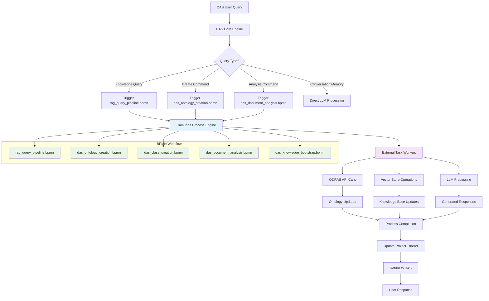
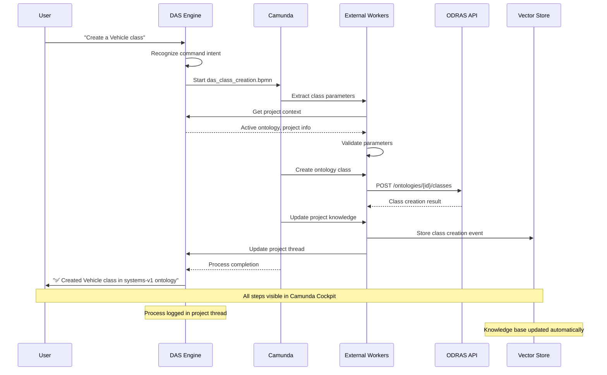
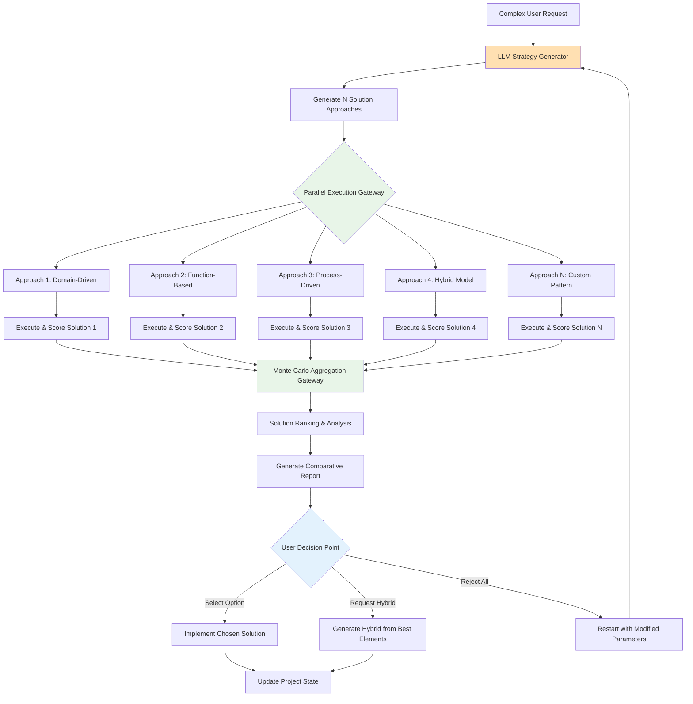

# DAS Tomorrow Goals: Knowledge Preloading & API Execution

## 🎯 **Tomorrow's Objectives**

**Date:** September 17, 2025  
**Phase:** Advanced DAS Capabilities  
**Foundation:** ✅ Project Thread Intelligence System (Complete)

---

## 🧠 **Goal 1: DAS Knowledge Preloading System**

### **Vision:**
Bootstrap DAS with comprehensive foundational knowledge so it becomes an expert assistant from day one, leveraging the existing BPMN RAG process for extensible, visual knowledge management.

### **Integration with BPMN RAG Process:**
✅ **Existing Asset:** `rag_query_pipeline.bpmn` - Visual, extensible RAG workflow  
✅ **Camunda Integration:** Process orchestration with external task workers  
✅ **Visual Management:** Non-technical stakeholders can understand and modify  
🎯 **DAS Enhancement:** DAS will use and help expand BPMN workflows  

### **Implementation Plan:**

#### **1.1 Create DAS Foundation Knowledge Collection**
```yaml
knowledge_domains:
  systems_engineering:
    - Ontology design principles and best practices
    - Requirements analysis methodologies  
    - Systems architecture patterns
    - Verification & validation processes
    
  odras_expertise:
    - Complete ODRAS API documentation with examples
    - Workflow patterns and usage scenarios
    - Common user tasks and solutions
    - Troubleshooting guides and error resolution
    
  domain_knowledge:
    - Defense systems terminology and concepts
    - UAS/UAV specifications and requirements
    - Naval systems engineering standards
    - Industry best practices and standards
```

#### **1.2 Knowledge Asset Types**
```python
class DASKnowledgeAsset:
    foundational_knowledge = [
        "How to create effective ontology hierarchies",
        "Best practices for requirements traceability", 
        "Common ontology design patterns",
        "ODRAS workflow optimization techniques"
    ]
    
    procedural_knowledge = [
        "Step-by-step ontology creation process",
        "Document analysis and requirement extraction workflow",
        "Project setup and initialization procedures",
        "Quality assurance and validation checklists"
    ]
    
    api_knowledge = [
        "Complete ODRAS API reference with examples",
        "Authentication and authorization patterns",
        "Error handling and recovery procedures", 
        "Performance optimization techniques"
    ]
```

#### **1.3 BPMN RAG Integration Tasks**
- [ ] **Enhance existing `rag_query_pipeline.bpmn`** with DAS knowledge preloading
- [ ] **Create `das_knowledge_bootstrap.bpmn`** workflow for initial knowledge loading
- [ ] **Extend external task workers** to handle DAS-specific knowledge processing
- [ ] **Add DAS knowledge validation** steps to BPMN workflow
- [ ] **Enable DAS to trigger and monitor** BPMN RAG processes
- [ ] **Test BPMN-driven knowledge responses** vs direct RAG calls

#### **1.4 DAS-BPMN Workflow Integration**
```yaml
bpmn_workflows:
  rag_query_pipeline:
    current_state: "✅ Implemented and working"
    das_enhancements:
      - Add DAS context injection to query processing
      - Include project thread context in RAG workflow
      - Enable DAS to modify workflow parameters dynamically
      
  das_knowledge_bootstrap:
    purpose: "Initialize DAS with foundational knowledge"
    trigger: "New project creation or DAS first-time setup"
    workflow_steps:
      - Load domain-specific knowledge templates
      - Populate DAS instruction collection
      - Initialize project-specific knowledge context
      - Validate knowledge completeness
      
  knowledge_enhancement:
    purpose: "DAS-driven knowledge base improvement"
    trigger: "DAS identifies knowledge gaps during conversations"
    workflow_steps:
      - Analyze conversation patterns for missing knowledge
      - Suggest knowledge assets to create or import
      - Validate proposed knowledge additions
      - Update knowledge base with DAS-identified improvements
```

---

## 🤖 **Goal 2: DAS Autonomous API Execution via BPMN**

### **Vision:**
Enable DAS to execute ODRAS API calls autonomously through BPMN workflows, transforming it from a conversational assistant into an active agent that can perform tasks using visual, extensible processes.

### **BPMN-Driven API Execution:**
Instead of hardcoded API calls, DAS will **trigger and orchestrate BPMN workflows** for all operations:
- ✅ **Visual Process Management** - All DAS actions visible in Camunda Cockpit
- ✅ **Extensible Workflows** - Easy to modify and expand without code changes  
- ✅ **Error Handling** - BPMN error boundaries and compensation
- ✅ **Audit Trail** - Complete execution history and monitoring

### **Migration Strategy: Direct RAG → BPMN RAG**

#### **Phase 1: Hybrid Approach (Tomorrow)**
```python
class DASQueryRouter:
    """
    Route queries to appropriate processing method
    """
    
    async def process_query(self, user_message: str, project_context: dict):
        intent = self.analyze_intent(user_message)
        
        if intent == "KNOWLEDGE_QUERY":
            # Use BPMN RAG process for knowledge queries
            return await self.trigger_bpmn_workflow(
                workflow_key="rag_query_pipeline",
                variables={
                    "query": user_message,
                    "project_context": project_context,
                    "user_id": project_context["user_id"]
                }
            )
            
        elif intent == "CONVERSATION_MEMORY":
            # Keep direct LLM processing for conversation memory
            return await self.handle_conversation_memory(user_message, project_context)
            
        elif intent == "COMMAND":
            # Use BPMN workflows for commands
            return await self.trigger_command_workflow(user_message, project_context)
```

#### **Phase 2: Full BPMN Integration (Future)**
- All DAS processing through BPMN workflows
- DAS becomes pure workflow orchestrator
- Visual process management for all capabilities

### **API Execution Framework:**

#### **2.1 Command Recognition & Intent Analysis**
```python
class DASCommandEngine:
    """
    Recognizes user intents and maps to executable API commands
    """
    
    command_patterns = {
        "create_ontology_class": {
            "patterns": ["create a class", "add a class", "new class"],
            "api_endpoint": "POST /api/ontologies/{ontology_id}/classes",
            "required_params": ["class_name", "ontology_id"],
            "optional_params": ["class_type", "properties", "description"]
        },
        
        "create_ontology": {
            "patterns": ["create ontology", "new ontology", "build ontology"],
            "api_endpoint": "POST /api/ontologies",
            "required_params": ["name", "project_id"],
            "optional_params": ["description", "base_ontology"]
        },
        
        "upload_document": {
            "patterns": ["upload document", "add document", "process file"],
            "api_endpoint": "POST /api/files/upload",
            "required_params": ["file_data"],
            "optional_params": ["document_type", "tags"]
        },
        
        "run_analysis": {
            "patterns": ["analyze", "run analysis", "extract requirements"],
            "api_endpoint": "POST /api/workflows/start",
            "required_params": ["document_id", "analysis_type"],
            "optional_params": ["workflow_params"]
        }
    }
```

#### **2.2 Parameter Extraction & Validation**
```python
class DASParameterExtractor:
    """
    Extracts API parameters from natural language using LLM
    """
    
    async def extract_parameters(self, user_intent: str, command_schema: dict, project_context: dict):
        """
        Use LLM to extract parameters from natural language
        
        Example:
        Input: "Create a Vehicle class in my systems ontology"
        Output: {
            "class_name": "Vehicle",
            "ontology_id": "systems-v1",  # From project context
            "class_type": "PhysicalEntity"  # Default
        }
        """
        
    async def validate_parameters(self, params: dict, schema: dict, project_context: dict):
        """
        Validate extracted parameters and fill in defaults from project context
        """
```

#### **2.3 Safe API Execution**
```python
class DASAPIExecutor:
    """
    Safely executes API commands with validation and rollback
    """
    
    async def execute_command(self, command: str, params: dict, project_context: dict):
        """
        Execute API command with full safety and transparency
        """
        # 1. Validate preconditions
        validation = await self.validate_preconditions(command, params)
        if not validation.is_safe:
            return ExecutionResult(
                success=False,
                message=f"Cannot execute: {validation.reason}",
                safety_check="failed"
            )
        
        # 2. Show user what will be executed
        execution_plan = self.build_execution_plan(command, params)
        
        # 3. Execute with error handling
        try:
            api_response = await self.call_odras_api(command, params)
            
            # 4. Validate results
            if api_response.success:
                return ExecutionResult(
                    success=True,
                    message=f"✅ Successfully {command}",
                    api_response=api_response.data,
                    execution_log=execution_plan
                )
            else:
                return ExecutionResult(
                    success=False,
                    message=f"❌ API call failed: {api_response.error}",
                    execution_log=execution_plan
                )
                
        except Exception as e:
            # 5. Handle errors gracefully
            return ExecutionResult(
                success=False,
                message=f"❌ Execution error: {str(e)}",
                execution_log=execution_plan,
                error_details=str(e)
            )
```

### **2.4 BPMN Workflow Implementation Tasks**
- [ ] **Create `das_ontology_creation.bpmn`** workflow for autonomous ontology creation
- [ ] **Create `das_class_creation.bpmn`** workflow for ontology class creation
- [ ] **Create `das_document_analysis.bpmn`** workflow for document processing
- [ ] **Enhance external task workers** to handle DAS-triggered workflows
- [ ] **Integrate DAS with Camunda API** for workflow triggering and monitoring
- [ ] **Add workflow status reporting** to DAS responses
- [ ] **Test DAS workflow orchestration** end-to-end

#### **2.5 DAS-BPMN Workflow Examples**
```yaml
das_workflows:
  ontology_creation:
    bpmn_file: "das_ontology_creation.bpmn"
    trigger_phrase: "Create an ontology for..."
    workflow_steps:
      - Extract ontology requirements from user input
      - Validate project permissions
      - Generate ontology structure suggestions
      - Create ontology via ODRAS API
      - Populate with foundational classes
      - Update project thread with results
      
  class_creation:
    bpmn_file: "das_class_creation.bpmn" 
    trigger_phrase: "Create a class called..."
    workflow_steps:
      - Extract class details from natural language
      - Resolve ontology context from project thread
      - Validate class name and properties
      - Create class via ODRAS API
      - Update ontology structure
      - Log creation in project events
      
  document_analysis:
    bpmn_file: "das_document_analysis.bpmn"
    trigger_phrase: "Analyze this document..."
    workflow_steps:
      - Trigger existing rag_query_pipeline.bpmn
      - Extract requirements and concepts
      - Suggest ontology classes from analysis
      - Offer to create classes automatically
      - Update project knowledge base
```

---

## 🎛️ **Goal 3: Ontology Intelligence & Management**

### **Vision:**
DAS becomes an ontology expert that can create, modify, and optimize ontologies based on requirements and best practices.

### **Ontology Intelligence Capabilities:**

#### **3.1 Ontology Creation Assistant**
```python
class DASOntoloogy Assistant:
    """
    Intelligent ontology creation and management
    """
    
    async def suggest_ontology_structure(self, requirements: List[str], domain: str):
        """
        Analyze requirements and suggest optimal ontology structure
        """
        
    async def create_foundational_classes(self, ontology_id: str, domain: str):
        """
        Create standard foundational classes for a domain
        
        Example domains:
        - systems_engineering → Component, Function, Requirement, Interface
        - defense_systems → Platform, Sensor, Weapon, Mission
        - naval_systems → Vessel, Subsystem, Capability, Threat
        """
        
    async def suggest_relationships(self, existing_classes: List[str], domain: str):
        """
        Suggest logical relationships between ontology classes
        """
        
    async def validate_ontology_design(self, ontology_structure: dict):
        """
        Check ontology for completeness, consistency, and best practices
        """
```

#### **3.2 Natural Language Ontology Commands**
```yaml
ontology_commands:
  creation:
    - "Create a systems engineering ontology for this project"
    - "Build an ontology for naval platform requirements"
    - "Set up a foundational ontology with standard classes"
    
  modification:
    - "Add a Sensor class to the current ontology"
    - "Create a relationship between Component and Function"
    - "Modify the Vehicle class to include speed property"
    
  analysis:
    - "Analyze the ontology structure for completeness"
    - "Check if the ontology covers all requirements"
    - "Suggest improvements to the current ontology design"
    
  population:
    - "Populate the ontology with classes from the requirements document"
    - "Extract concepts from uploaded specifications and create classes"
    - "Build ontology structure based on the project requirements"
```

### **3.3 Implementation Tasks**
- [ ] **Create ontology design knowledge base** with best practices
- [ ] **Implement ontology analysis and suggestion engine**
- [ ] **Build natural language → ontology command mapping**
- [ ] **Create ontology validation and quality checking**
- [ ] **Add ontology population from requirements documents**

---

## 📋 **Tomorrow's Development Roadmap**

### **Morning (9 AM - 12 PM): BPMN RAG Enhancement**
1. **Enhance existing `rag_query_pipeline.bpmn`** with DAS context injection
2. **Create `das_knowledge_bootstrap.bpmn`** for knowledge preloading
3. **Extend external task workers** for DAS-specific processing
4. **Test BPMN-driven knowledge responses**

### **Afternoon (1 PM - 4 PM): DAS Workflow Orchestration**
1. **Integrate DAS with Camunda API** for workflow triggering
2. **Create `das_ontology_creation.bpmn`** workflow
3. **Implement DAS command → BPMN workflow mapping**
4. **Test autonomous workflow execution**

### **Evening (4 PM - 6 PM): Ontology Intelligence via BPMN**
1. **Create `das_class_creation.bpmn`** workflow
2. **Implement ontology analysis and suggestion workflows**
3. **Test end-to-end: "Create a Vehicle class" → BPMN execution → Class created**
4. **Document BPMN-driven DAS capabilities**

### **Key Advantage: Visual Process Management**
- ✅ **All DAS actions visible** in Camunda Cockpit
- ✅ **Non-technical users** can understand and modify workflows
- ✅ **Easy debugging** - see exactly where processes succeed/fail
- ✅ **Extensible** - add new capabilities by creating new BPMN workflows

### **Future BPMN RAG Process Architecture**



### **BPMN Process Integration Flow**



### **Current vs Future Architecture Comparison**

```mermaid
graph TD
    subgraph "Current Architecture (Working Today)"
        A1[User Query] --> B1[DAS Core Engine]
        B1 --> C1[Direct RAG Service]
        C1 --> D1[Vector Store Search]
        D1 --> E1[LLM Response Generation]
        E1 --> F1[Return Response]
    end
    
    subgraph "Tomorrow's BPMN Architecture"
        A2[User Query] --> B2[DAS Core Engine]
        B2 --> C2[Intent Analysis]
        C2 --> D2{Command Type?}
        
        D2 -->|Knowledge| E2[rag_query_pipeline.bpmn]
        D2 -->|Create| F2[das_ontology_creation.bpmn]
        D2 -->|Analyze| G2[das_document_analysis.bpmn]
        
        E2 --> H2[Camunda Engine]
        F2 --> H2
        G2 --> H2
        
        H2 --> I2[External Task Workers]
        I2 --> J2[ODRAS API Execution]
        I2 --> K2[Vector Store Updates]
        I2 --> L2[LLM Processing]
        
        J2 --> M2[Project Updates]
        K2 --> M2
        L2 --> M2
        
        M2 --> N2[Update Project Thread]
        N2 --> O2[Return Enhanced Response]
    end
    
    style B1 fill:#ffebee
    style B2 fill:#e8f5e8
    style H2 fill:#e3f2fd
    style I2 fill:#f3e5f5
```



### **Benefits of BPMN Integration:**
- 🎯 **Visual Process Design** - Workflows visible and editable in Camunda Modeler
- 🔧 **Easy Modification** - Change DAS behavior by updating BPMN diagrams
- 📊 **Process Monitoring** - Real-time execution tracking in Camunda Cockpit
- 🛡️ **Error Handling** - BPMN error boundaries and compensation events
- 🔄 **Reusable Components** - Workflows can call other workflows as subprocesses
- 📈 **Scalability** - Camunda handles process orchestration and scaling

### **Advanced BPMN Capabilities: Non-Deterministic Decision Making**

#### **LLM-Driven Decision Gateways**
```mermaid
graph TD
    A[User Request: "Design optimal ontology for requirements"] --> B[LLM Analysis Gateway]
    
    B --> C{LLM Decision Point}
    C -->|Approach 1: Domain-Driven| D[Generate Domain-Specific Classes]
    C -->|Approach 2: Function-Based| E[Generate Function-Based Classes]
    C -->|Approach 3: Hybrid| F[Generate Hybrid Structure]
    
    D --> G[Parallel Execution Branch 1]
    E --> H[Parallel Execution Branch 2] 
    F --> I[Parallel Execution Branch 3]
    
    G --> J[Monte Carlo Validation]
    H --> J
    I --> J
    
    J --> K[Solution Scoring & Ranking]
    K --> L[Present Multiple Options to User]
    
    subgraph "Probabilistic Exploration"
        M[LLM generates N different approaches]
        N[Each approach executed in parallel]
        O[Results scored against requirements]
        P[Best options presented as choices]
    end
    
    style C fill:#ffe0b2
    style J fill:#e8f5e8
    style L fill:#e3f2fd
```

#### **Monte Carlo Solution Exploration**
```yaml
advanced_bpmn_patterns:
  probabilistic_ontology_design:
    description: "Generate multiple ontology approaches and test them"
    llm_decision_points:
      - "What ontology pattern best fits these requirements?"
      - "Should we prioritize depth or breadth in class hierarchy?"
      - "Which foundational classes are most critical?"
    
    parallel_execution:
      - Generate 3-5 different ontology structures
      - Create each structure in temporary workspace
      - Test each against requirements via LLM evaluation
      - Score solutions on completeness, clarity, extensibility
    
    monte_carlo_validation:
      - Run requirements validation against each solution
      - Test edge cases and corner scenarios
      - Evaluate maintainability and evolution potential
      - Generate confidence scores for each approach
    
    user_choice_presentation:
      - Present top 2-3 solutions with pros/cons
      - Show visual comparisons and trade-offs
      - Allow user to select or request hybrid approach
      - Implement chosen solution automatically
```

#### **Non-Deterministic BPMN Workflow Example**
```python
class AdvancedBPMNWorkflow:
    """
    BPMN workflow with LLM decision points and probabilistic exploration
    """
    
    async def execute_ontology_design_workflow(self, requirements: str, project_context: dict):
        """
        Advanced ontology design with multiple solution exploration
        """
        
        # 1. LLM Analysis Gateway - Non-deterministic decision
        analysis_result = await self.llm_analysis_gateway(
            requirements=requirements,
            context=project_context,
            decision_prompt="""
            Analyze these requirements and suggest 3-5 different ontology approaches:
            1. Domain-driven design (organize by subject domains)
            2. Function-based design (organize by system functions)  
            3. Layer-based design (organize by abstraction levels)
            4. Process-driven design (organize by workflows)
            5. Hybrid approaches combining multiple patterns
            
            For each approach, provide:
            - Core design philosophy
            - Foundational class suggestions
            - Relationship patterns
            - Pros and cons for this specific use case
            """
        )
        
        # 2. Parallel Execution - Probabilistic exploration
        solution_candidates = []
        for approach in analysis_result.suggested_approaches:
            # Execute each approach in parallel subprocess
            candidate_solution = await self.execute_parallel_branch(
                workflow_key="ontology_generation_branch",
                variables={
                    "approach": approach,
                    "requirements": requirements,
                    "project_context": project_context
                }
            )
            solution_candidates.append(candidate_solution)
        
        # 3. Monte Carlo Validation - Test each solution
        validated_solutions = []
        for candidate in solution_candidates:
            validation_score = await self.monte_carlo_validation(
                solution=candidate,
                requirements=requirements,
                test_scenarios=self.generate_test_scenarios(requirements)
            )
            validated_solutions.append({
                "solution": candidate,
                "score": validation_score,
                "confidence": validation_score.confidence,
                "trade_offs": validation_score.trade_offs
            })
        
        # 4. Solution Ranking and Presentation
        ranked_solutions = sorted(validated_solutions, key=lambda x: x["score"], reverse=True)
        
        return {
            "solution_options": ranked_solutions[:3],  # Top 3 solutions
            "recommendation": ranked_solutions[0],     # Best solution
            "decision_rationale": self.generate_decision_explanation(ranked_solutions),
            "user_choice_required": True
        }
```

### **Probabilistic BPMN Decision Architecture**

#### **Multi-Path Exploration Workflow**


#### **Advanced Decision Making Framework**
```python
class ProbabilisticBPMNEngine:
    """
    Advanced BPMN engine supporting non-deterministic decisions and Monte Carlo exploration
    """
    
    async def execute_probabilistic_workflow(
        self, 
        workflow_key: str, 
        user_request: str, 
        exploration_depth: int = 5
    ):
        """
        Execute workflow with probabilistic solution exploration
        """
        
        # 1. LLM Strategy Generation - Non-deterministic
        strategies = await self.generate_solution_strategies(
            user_request=user_request,
            num_strategies=exploration_depth,
            creativity_level=0.8  # High creativity for diverse approaches
        )
        
        # 2. Parallel Execution - Multiple solution paths
        solution_futures = []
        for strategy in strategies:
            future = self.execute_solution_branch(
                workflow_key=f"{workflow_key}_branch",
                strategy=strategy,
                variables={"original_request": user_request}
            )
            solution_futures.append(future)
        
        # 3. Monte Carlo Validation - Test all solutions
        solutions = await asyncio.gather(*solution_futures)
        validated_solutions = []
        
        for solution in solutions:
            # Run multiple validation scenarios
            validation_results = await self.monte_carlo_validation(
                solution=solution,
                test_scenarios=self.generate_test_scenarios(user_request),
                iterations=10  # Monte Carlo iterations per solution
            )
            
            validated_solutions.append({
                "solution": solution,
                "validation_score": validation_results.average_score,
                "confidence_interval": validation_results.confidence_interval,
                "edge_case_performance": validation_results.edge_cases,
                "pros_and_cons": validation_results.trade_offs
            })
        
        # 4. Solution Ranking and Presentation
        ranked_solutions = self.rank_solutions(validated_solutions)
        
        return ProbabilisticResult(
            top_solutions=ranked_solutions[:3],
            comparative_analysis=self.generate_comparison_matrix(ranked_solutions),
            decision_recommendation=self.generate_decision_guidance(ranked_solutions),
            execution_options=[
                "Implement recommended solution",
                "Create hybrid from best elements", 
                "Explore additional approaches",
                "Modify requirements and restart"
            ]
        )
    
    async def generate_solution_strategies(self, user_request: str, num_strategies: int, creativity_level: float):
        """
        Use LLM to generate diverse solution approaches
        """
        strategy_prompt = f"""
        Generate {num_strategies} fundamentally different approaches to: {user_request}
        
        Creativity level: {creativity_level} (0.0 = conservative, 1.0 = highly creative)
        
        For each approach, provide:
        1. Core strategy name and philosophy
        2. Key implementation steps
        3. Expected strengths and weaknesses
        4. Risk factors and mitigation strategies
        5. Success criteria and validation methods
        
        Ensure approaches are genuinely different, not minor variations.
        """
        
        llm_response = await self.llm_team.generate_strategies(strategy_prompt)
        return self.parse_strategy_response(llm_response)
    
    async def monte_carlo_validation(self, solution, test_scenarios, iterations: int):
        """
        Validate solution using Monte Carlo simulation
        """
        validation_results = []
        
        for i in range(iterations):
            # Randomly vary test parameters
            test_params = self.generate_random_test_parameters(test_scenarios)
            
            # Test solution against varied parameters
            test_result = await self.validate_solution(solution, test_params)
            validation_results.append(test_result)
        
        # Aggregate results
        return ValidationSummary(
            average_score=sum(r.score for r in validation_results) / len(validation_results),
            confidence_interval=self.calculate_confidence_interval(validation_results),
            edge_cases=self.identify_edge_cases(validation_results),
            trade_offs=self.analyze_trade_offs(validation_results)
        )
```

#### **Real-World Example: Ontology Design Exploration**
```yaml
user_request: "Design an ontology for autonomous vehicle requirements"

llm_generated_approaches:
  approach_1:
    name: "Vehicle-Centric Design"
    philosophy: "Organize around vehicle types and their characteristics"
    classes: ["AutonomousVehicle", "Sensor", "Algorithm", "Environment"]
    
  approach_2:
    name: "Function-Based Design" 
    philosophy: "Organize around autonomous driving functions"
    classes: ["Perception", "Planning", "Control", "Safety", "Navigation"]
    
  approach_3:
    name: "Layer-Based Design"
    philosophy: "Organize by abstraction levels"
    classes: ["Hardware", "Software", "Interface", "Application", "Mission"]

monte_carlo_testing:
  test_scenarios:
    - "Urban driving requirements coverage"
    - "Highway driving requirements coverage"
    - "Emergency scenario handling"
    - "Sensor failure resilience"
    - "Regulatory compliance mapping"
  
  iterations_per_approach: 10
  
validation_results:
  approach_1: 
    score: 0.85
    strengths: ["Clear vehicle focus", "Easy to understand"]
    weaknesses: ["Limited functional modeling"]
    
  approach_2:
    score: 0.92  
    strengths: ["Complete functional coverage", "Excellent traceability"]
    weaknesses: ["More complex hierarchy"]
    
  approach_3:
    score: 0.78
    strengths: ["Clean abstraction layers"]
    weaknesses: ["Requirements mapping challenges"]

user_presentation:
  recommendation: "Function-Based Design (Score: 0.92)"
  alternatives: ["Vehicle-Centric (0.85)", "Hybrid Function-Vehicle (0.89)"]
  decision_support: "Detailed comparison matrix with pros/cons"
```

---

## 🎯 **Success Criteria for Tomorrow**

### **Knowledge Preloading Success:**
- [ ] DAS provides expert-level guidance on ontology design
- [ ] Responses include best practices and methodology advice
- [ ] Knowledge-enhanced responses score >0.9 quality rating

### **API Execution Success:**
- [ ] DAS can create ontology classes from natural language
- [ ] "Create a Vehicle class" → Actual class created in ontology
- [ ] Safe execution with validation and error handling

### **Ontology Intelligence Success:**
- [ ] DAS can suggest optimal ontology structure for requirements
- [ ] Autonomous creation of foundational ontology for new projects
- [ ] Intelligent class and relationship suggestions

---

## 🔮 **Future Roadmap (Week 2+)**

### **Advanced Capabilities:**
- **Cross-Project Learning:** DAS learns patterns from all projects
- **Workflow Automation:** Complete BPMN workflow execution
- **Artifact Generation:** Auto-generate specifications, reports, documentation
- **Team Collaboration:** Multi-user project intelligence
- **Predictive Assistance:** Anticipate user needs and suggest actions

### **Integration Opportunities:**
- **MCP Server Integration:** Deterministic tools and external services
- **SPARQL Query Generation:** Advanced ontology querying
- **Visualization Creation:** Auto-generate project diagrams and charts
- **Quality Assurance:** Automated validation and verification workflows

---

## 📚 **Resources for Tomorrow**

### **Knowledge Sources to Integrate:**
1. **Systems Engineering Body of Knowledge (SEBOK)**
2. **Ontology Design Patterns (ODP)**
3. **ODRAS User Documentation and API Reference**
4. **Defense Systems Engineering Standards**
5. **Naval Systems Architecture Guidelines**

### **API Documentation to Study:**
1. **Complete ODRAS API endpoints** with parameter schemas
2. **Authentication and authorization patterns**
3. **Error codes and recovery procedures**
4. **Workflow integration points**

---

**Ready to transform DAS from a conversational assistant into an intelligent autonomous agent!** 🚀
