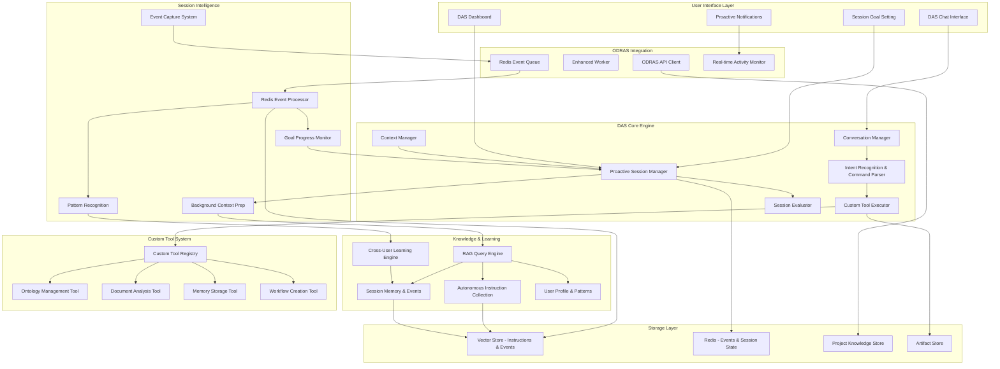

# Digital Assistance System (DAS) MVP Specification

**Authors:** [User's Name], with AI-assisted drafting based on ODRAS architecture  
**Date:** January 2025  
**Document Type:** Technical Specification  
**Version:** 1.0  
**Status:** Initial Specification  

---

## Executive Summary

The Digital Assistance System (DAS) is an intelligent autonomous agent designed to work with the Ontology-Driven Requirements Analysis System (ODRAS). DAS transcends traditional chatbot functionality by executing complex tasks autonomously on behalf of users, while maintaining comprehensive session intelligence that learns from every user interaction.

DAS serves as a proactive session partner that begins each interaction by understanding user goals, prepares relevant context in the background, monitors progress in real-time, and provides autonomous execution of complex workflows. The system captures every user action as session events, building collective intelligence that enables it to bootstrap new users and projects with proven patterns from successful sessions.

Key innovations include: real-time event streaming via Redis queues, session goal setting and monitoring, autonomous command execution using custom-built tool systems, and comprehensive session evaluation that identifies ODRAS feature gaps and process improvement opportunities.

---

## 1. System Architecture Overview

### 1.1 DAS Core Architecture



### 1.2 DAS Capability Evolution with Session Intelligence

**Phase 1 - Session-Aware Assistant (Current MVP)**:
- Session goal setting: "What do you want to accomplish today?"
- Real-time event capture and Redis-based processing
- Answer questions using RAG knowledge enhanced with session context
- Basic autonomous commands: "Create a class called AirVehicle"
- Live session monitoring and proactive observations

**Phase 2 - Autonomous Session Partner**:
- Background context preparation based on stated goals
- Complex multi-tool autonomous execution
- Cross-user learning and pattern recognition
- Session progress monitoring and intervention
- Comprehensive session evaluation and feedback

**Phase 3 - Intelligent Session Orchestrator**:
- Predictive session planning and optimization
- Autonomous workflow creation and execution
- System improvement recommendations based on session analysis
- Full project lifecycle management
- Collective intelligence leveraging all user sessions

---

## 2. Session Intelligence Integration

### 2.1 Proactive Session Lifecycle Management

```python
class DASSessionLifecycle:
    """
    Complete session lifecycle management with intelligence
    """
    
    # 1. SESSION INITIALIZATION
    async def start_session(self, user_id: str) -> SessionStart:
        """
        Proactive session start with goal setting
        """
        session_id = self._generate_session_id()
        
        # Get user patterns for personalized greeting
        user_patterns = await self._get_user_patterns(user_id)
        
        # Create goal setting prompt
        goal_prompt = await self._create_goal_setting_prompt(user_patterns)
        
        # Initialize event capture
        await self.event_system.initialize_session_capture(session_id)
        
        return SessionStart(
            session_id=session_id,
            goal_setting_prompt=goal_prompt,
            background_preparation_started=True
        )
    
    # 2. GOAL PROCESSING AND PREPARATION
    async def process_session_goals(self, session_id: str, user_goals: str) -> GoalProcessing:
        """
        Process goals and prepare session context
        """
        # Parse goals using our custom LLM prompting
        parsed_goals = await self._parse_goals_with_custom_llm(user_goals)
        
        # Start background preparation tasks
        preparation_tasks = [
            self._prepare_domain_knowledge(goal) for goal in parsed_goals
        ]
        
        # Start session monitoring
        asyncio.create_task(self._monitor_session_progress(session_id, parsed_goals))
        
        # Start event processing
        asyncio.create_task(self._process_session_events(session_id))
        
        return GoalProcessing(
            parsed_goals=parsed_goals,
            preparation_status="running",
            monitoring_enabled=True,
            das_response=f"Perfect! I'm preparing context for: {', '.join(parsed_goals)}. I'll watch your progress and offer assistance."
        )
    
    # 3. REAL-TIME SESSION MONITORING  
    async def monitor_session_activities(self, session_id: str):
        """
        Monitor session in real-time and provide proactive assistance
        """
        session_goals = await self._get_session_goals(session_id)
        
        # Subscribe to session events via Redis
        async for event in self.redis.subscribe(f"session:{session_id}:events"):
            # Process event immediately
            await self._process_session_event(event, session_goals)
            
            # Check for proactive assistance opportunities
            assistance_opportunities = await self._check_assistance_opportunities(event, session_goals)
            
            for opportunity in assistance_opportunities:
                if opportunity.confidence > 0.8:
                    await self._provide_proactive_assistance(session_id, opportunity)
    
    # 4. SESSION EVALUATION AND FEEDBACK
    async def evaluate_session(self, session_id: str) -> SessionEvaluation:
        """
        Comprehensive session evaluation with system improvement insights
        """
        session_data = await self._get_complete_session_data(session_id)
        
        # Evaluate against stated goals
        goal_evaluation = await self._evaluate_goal_achievement(session_data)
        
        # Identify system gaps and improvements
        system_feedback = await self._analyze_system_performance(session_data)
        
        return SessionEvaluation(
            goal_achievement=goal_evaluation,
            odras_feature_gaps=system_feedback.feature_gaps,
            process_improvement_opportunities=system_feedback.process_gaps,
            user_experience_insights=system_feedback.ux_insights,
            recommendations_for_odras_team=system_feedback.dev_recommendations
        )
```

### 2.2 Event-Driven Session Intelligence

```python
class SessionEventSystem:
    """
    Simple Redis-based event system for session intelligence
    """
    
    def __init__(self, redis_client):
        self.redis = redis_client
        self.event_queue = "session_events"
    
    # Capture any user action as an event
    async def capture_event(self, session_id: str, event_type: str, event_data: dict):
        """
        Capture user actions as session events
        """
        event = {
            "session_id": session_id,
            "timestamp": datetime.now().isoformat(),
            "type": event_type,
            "data": event_data
        }
        
        # Add to processing queue
        await self.redis.lpush(self.event_queue, json.dumps(event))
        
        # Notify DAS immediately for real-time response
        await self.redis.publish(f"das_watch:{session_id}", json.dumps(event))
    
    # Process events one at a time
    async def process_events(self):
        """
        Simple event processor - handles events sequentially
        """
        while True:
            event_data = await self.redis.brpop(self.event_queue, timeout=1)
            if event_data:
                event = json.loads(event_data[1])
                await self._process_single_event(event)
    
    async def _process_single_event(self, event):
        """
        Process individual event - update session state and check for DAS actions
        """
        session_id = event["session_id"]
        
        # Update session activity log
        await self.redis.lpush(f"session:{session_id}:activity", json.dumps(event))
        
        # Check if DAS should provide proactive assistance
        await self._check_proactive_assistance(session_id, event)
        
        # Store for future learning (background)
        asyncio.create_task(self._store_for_learning(event))

# Example events that get captured:
session_events_examples = [
    {"type": "document_upload", "data": {"filename": "requirements.pdf", "size": 1024}},
    {"type": "ontology_create", "data": {"ontology_name": "seov1", "base_classes": 3}},
    {"type": "class_create", "data": {"class_name": "AirVehicle", "ontology": "seov1"}},
    {"type": "analysis_run", "data": {"analysis_type": "requirements", "document_count": 2}},
    {"type": "das_question", "data": {"question": "How do I create relationships?", "response_time": 2.3}},
    {"type": "das_command", "data": {"command": "create class AirVehicle", "executed": True}}
]
```

---

## 3. Core Components Specification

### 2.1 RAG Knowledge Integration

**2.1.1 Shared RAG Capabilities**
DAS leverages the same RAG query engine as the Knowledge Management Workbench:

```python
class DASRAGService:
    def __init__(self, rag_service, instruction_collection):
        self.rag_service = rag_service  # Shared with Knowledge Workbench
        self.instruction_collection = instruction_collection
        
    async def query_das_knowledge(self, question: str, context: dict = None):
        """
        Query both general knowledge and DAS-specific instructions
        """
        # Query general ODRAS knowledge
        general_results = await self.rag_service.query(question, context)
        
        # Query DAS instruction collection
        instruction_results = await self.instruction_collection.query(question)
        
        # Combine and rank results
        combined_results = self.combine_knowledge_sources(
            general_results, instruction_results
        )
        
        return combined_results
```

**2.1.2 Enhanced Instruction Collection Schema**
```python
class DASInstruction:
    instruction_id: str
    category: str  # "api_orchestration", "ontology_automation", etc.
    title: str
    description: str
    steps: List[str]  # Steps for user guidance
    examples: List[dict]
    prerequisites: List[str]
    related_commands: List[str]
    confidence_level: str  # "beginner", "intermediate", "advanced"
    last_updated: datetime
    
    # Autonomous execution capabilities
    executable: bool  # Can DAS execute this autonomously?
    api_endpoints: List[dict]  # API calls DAS can make
    required_permissions: List[str]  # Permissions needed for execution
    execution_template: dict  # Template for autonomous execution
    validation_rules: List[str]  # Rules for validating execution
    
class ExecutionTemplate:
    """Template for autonomous DAS execution"""
    endpoint: str  # "/api/ontologies/{ontology_id}/classes"
    method: str    # "POST", "GET", "PUT", "DELETE"
    payload_template: dict  # Template for request payload
    parameter_mapping: dict  # How to extract params from user input
    success_criteria: dict   # How to validate successful execution
    rollback_instructions: List[str]  # How to undo if needed
```

### 2.2 Instruction Collection System

**2.2.1 Autonomous DAS Instruction Categories**

DAS instructions serve two purposes:
1. **User Guidance**: Teaching users how to perform tasks
2. **Autonomous Execution**: Enabling DAS to execute tasks on behalf of users

```yaml
instruction_categories:
  api_orchestration:
    # DAS can execute these API calls autonomously
    - "Retrieve ontology data via GET /api/ontologies/{id}"
    - "Create ontology classes via POST /api/ontologies/{id}/classes"
    - "Add relationships via POST /api/ontologies/{id}/relationships"
    - "Upload documents via POST /api/files/upload"
    - "Trigger analysis via POST /api/analysis/run"
    - "Query knowledge base via POST /api/knowledge/query"
    
  ontology_automation:
    # DAS can perform ontology operations autonomously
    - "Auto-generate foundational ontology structure"
    - "Create class hierarchies from requirements"
    - "Establish semantic relationships between concepts"
    - "Validate ontology consistency and completeness"
    - "Generate SPARQL queries for data extraction"
    
  document_processing:
    # DAS can process documents autonomously
    - "Upload and analyze requirements documents"
    - "Extract key concepts and relationships"
    - "Generate document summaries and insights"
    - "Cross-reference document content with knowledge base"
    - "Create structured data from unstructured text"
    
  workflow_execution:
    # DAS can execute complex workflows autonomously
    - "Run complete requirements analysis pipeline"
    - "Generate conceptual models from specifications"
    - "Perform sensitivity analysis on system parameters"
    - "Create impact assessments and recommendations"
    - "Execute validation and verification workflows"
    
  knowledge_synthesis:
    # DAS can synthesize information autonomously
    - "Query multiple knowledge sources and synthesize insights"
    - "Generate comprehensive project summaries"
    - "Create cross-domain analysis reports"
    - "Identify knowledge gaps and recommend actions"
    - "Produce executive briefings and technical reports"
    
  process_management:
    # DAS can manage BPMN processes autonomously
    - "Create BPMN process definitions from requirements"
    - "Modify existing workflows based on feedback"
    - "Deploy processes to Camunda engine"
    - "Monitor process execution and performance"
    - "Optimize workflows based on usage patterns"
```

**2.2.2 Autonomous Execution Examples**

```yaml
example_autonomous_instructions:
  create_ontology_class:
    user_request: "Add a new class called 'Sensor' to my ontology"
    das_execution:
      - "I'll create the Sensor class for you"
      - "Calling POST /api/ontologies/{ontology_id}/classes"
      - "Payload: {name: 'Sensor', type: 'PhysicalEntity', properties: {...}}"
      - "✅ Sensor class created successfully"
      - "Would you like me to add any specific properties or relationships?"
      
  document_analysis:
    user_request: "Review the disaster response requirements document and summarize it"
    das_execution:
      - "I'll analyze that document for you"
      - "Calling GET /api/files/{file_id}/content"
      - "Calling POST /api/analysis/run with document content"
      - "Processing requirements extraction..."
      - "✅ Analysis complete. Here's the summary: [detailed summary]"
      - "Key requirements identified: [list]"
      
  knowledge_query:
    user_request: "What do we know about missile guidance systems?"
    das_execution:
      - "I'll search our knowledge base for missile guidance information"
      - "Calling POST /api/knowledge/query with semantic search"
      - "Synthesizing information from multiple sources..."
      - "✅ Found 15 relevant documents. Here's what we know: [synthesis]"
      - "Sources: [document references]"
      
  process_creation:
    user_request: "Create a workflow for requirements validation"
    das_execution:
      - "I'll create a BPMN workflow for requirements validation"
      - "Generating process definition based on best practices..."
      - "Calling POST /api/workflows/create"
      - "Deploying to Camunda engine..."
      - "✅ Workflow created and deployed: 'Requirements Validation v1.0'"
      - "Process ID: req_validation_001"
```

**2.2.3 Instruction Population Script**
```python
class InstructionPopulator:
    def __init__(self, vector_store, instruction_templates):
        self.vector_store = vector_store
        self.templates = instruction_templates
        
    async def populate_instruction_collection(self):
        """
        Populate vector store with comprehensive instruction set
        """
        instructions = []
        
        # Load instruction templates
        for category, templates in self.templates.items():
            for template in templates:
                instruction = await self.create_instruction_from_template(
                    category, template
                )
                instructions.append(instruction)
        
        # Generate embeddings and store
        await self.vector_store.batch_upsert(instructions)
        
        return len(instructions)
    
    async def create_instruction_from_template(self, category: str, template: dict):
        """
        Create detailed instruction from template
        """
        return DASInstruction(
            instruction_id=f"{category}_{template['id']}",
            category=category,
            title=template['title'],
            description=template['description'],
            steps=template['steps'],
            examples=template['examples'],
            prerequisites=template.get('prerequisites', []),
            related_commands=template.get('related_commands', []),
            confidence_level=template.get('level', 'beginner'),
            last_updated=datetime.now()
        )
```

### 2.3 Session Management System

**2.3.1 Session Architecture**
```python
class DASSession:
    session_id: str
    user_id: str
    start_time: datetime
    last_activity: datetime
    current_context: dict
    activity_log: List[ActivityEvent]
    session_summary: str
    user_preferences: dict
    active_project: str
    permissions: dict
```

**2.3.2 Activity Monitoring**
```python
class ActivityMonitor:
    def __init__(self, redis_client, session_store):
        self.redis = redis_client
        self.session_store = session_store
        
    async def log_activity(self, session_id: str, activity: ActivityEvent):
        """
        Log user activity for session awareness
        """
        # Store in Redis for real-time access
        await self.redis.lpush(f"session:{session_id}:activities", activity.to_json())
        
        # Update session summary periodically
        if self.should_update_summary(session_id):
            await self.update_session_summary(session_id)
    
    async def update_session_summary(self, session_id: str):
        """
        Generate AI-powered session summary
        """
        activities = await self.get_recent_activities(session_id)
        
        # Use LLM to generate summary
        summary = await self.generate_activity_summary(activities)
        
        # Store in vector store for DAS context
        await self.session_store.store_summary(session_id, summary)
        
        return summary
```

**2.3.3 Session-Aware Context**
```python
class SessionContextManager:
    def __init__(self, session_store, rag_service):
        self.session_store = session_store
        self.rag_service = rag_service
        
    async def get_contextual_response(self, question: str, session_id: str):
        """
        Provide response with full session context
        """
        # Get session context
        session_context = await self.session_store.get_session_context(session_id)
        
        # Get recent activities
        recent_activities = await self.session_store.get_recent_activities(session_id)
        
        # Build context for RAG query
        context = {
            "session_context": session_context,
            "recent_activities": recent_activities,
            "user_preferences": session_context.get("preferences", {}),
            "active_project": session_context.get("active_project")
        }
        
        # Query with context
        response = await self.rag_service.query_das_knowledge(question, context)
        
        return response
```

### 2.4 Command Execution Framework

**2.4.1 Enhanced Worker Integration**
```python
class DASCommandExecutor:
    def __init__(self, api_client, worker_client, permission_manager):
        self.api_client = api_client
        self.worker_client = worker_client
        self.permissions = permission_manager
        
    async def execute_command(self, command: dict, session_id: str, user_id: str):
        """
        Execute ODRAS command with proper authorization
        """
        # Check permissions
        if not await self.permissions.can_execute(user_id, command):
            raise PermissionError("User not authorized for this command")
        
        # Determine execution method
        if command["type"] == "api_call":
            return await self.execute_api_command(command)
        elif command["type"] == "workflow":
            return await self.execute_workflow_command(command)
        elif command["type"] == "analysis":
            return await self.execute_analysis_command(command)
        else:
            raise ValueError(f"Unknown command type: {command['type']}")
    
    async def execute_api_command(self, command: dict):
        """
        Execute direct API command
        """
        endpoint = command["endpoint"]
        method = command["method"]
        params = command.get("params", {})
        
        response = await self.api_client.request(method, endpoint, params)
        return response
    
    async def execute_workflow_command(self, command: dict):
        """
        Execute BPMN workflow command
        """
        workflow_id = command["workflow_id"]
        variables = command.get("variables", {})
        
        # Start workflow via worker
        result = await self.worker_client.start_workflow(workflow_id, variables)
        return result
```

**2.4.2 Command Templates**
```python
COMMAND_TEMPLATES = {
    "retrieve_ontology": {
        "type": "api_call",
        "endpoint": "/api/ontologies/{ontology_id}",
        "method": "GET",
        "description": "Retrieve ontology by ID",
        "examples": [
            {
                "ontology_id": "foundational_se_ontology",
                "expected_result": "Ontology object with classes and relationships"
            }
        ]
    },
    
    "create_ontology_class": {
        "type": "api_call", 
        "endpoint": "/api/ontologies/{ontology_id}/classes",
        "method": "POST",
        "description": "Create new class in ontology",
        "required_params": ["class_name", "class_type", "properties"],
        "examples": [
            {
                "ontology_id": "foundational_se_ontology",
                "class_name": "SystemComponent",
                "class_type": "PhysicalEntity",
                "properties": {"hasFunction": "string", "hasInterface": "string"}
            }
        ]
    },
    
    "run_analysis": {
        "type": "workflow",
        "workflow_id": "requirements_analysis_workflow",
        "description": "Run full requirements analysis on document",
        "required_params": ["document_id", "analysis_type"],
        "examples": [
            {
                "document_id": "cdd_001",
                "analysis_type": "full",
                "questions": ["What are the key capabilities?", "What are the performance requirements?"]
            }
        ]
    }
}
```

### 2.5 Proactive Monitoring and Suggestions

**2.5.1 Activity Queue System**
```python
class DASActivityQueue:
    def __init__(self, redis_client, das_engine):
        self.redis = redis_client
        self.das_engine = das_engine
        
    async def monitor_user_activities(self):
        """
        Monitor user activities and generate suggestions
        """
        while True:
            # Get activities from queue
            activities = await self.redis.brpop("user_activities", timeout=1)
            
            if activities:
                activity = json.loads(activities[1])
                await self.process_activity(activity)
    
    async def process_activity(self, activity: dict):
        """
        Process activity and generate suggestions
        """
        session_id = activity["session_id"]
        activity_type = activity["type"]
        
        # Analyze activity pattern
        suggestions = await self.analyze_activity_pattern(session_id, activity)
        
        # Store suggestions for DAS to present
        if suggestions:
            await self.redis.lpush(f"das:suggestions:{session_id}", suggestions)
    
    async def analyze_activity_pattern(self, session_id: str, activity: dict):
        """
        Use AI to analyze activity and suggest next steps
        """
        # Get session history
        history = await self.get_session_history(session_id)
        
        # Use LLM to analyze patterns and suggest actions
        suggestions = await self.das_engine.generate_suggestions(history, activity)
        
        return suggestions
```

**2.5.2 Suggestion Generation**
```python
class DASSuggestionEngine:
    def __init__(self, llm_client, knowledge_base):
        self.llm = llm_client
        self.knowledge = knowledge_base
        
    async def generate_suggestions(self, session_history: list, current_activity: dict):
        """
        Generate contextual suggestions based on user activity
        """
        # Build context from session history
        context = self.build_suggestion_context(session_history, current_activity)
        
        # Query LLM for suggestions
        prompt = self.build_suggestion_prompt(context)
        response = await self.llm.generate(prompt)
        
        # Parse and structure suggestions
        suggestions = self.parse_suggestions(response)
        
        return suggestions
    
    def build_suggestion_context(self, history: list, activity: dict):
        """
        Build context for suggestion generation
        """
        return {
            "recent_activities": history[-10:],  # Last 10 activities
            "current_activity": activity,
            "user_patterns": self.analyze_user_patterns(history),
            "project_context": self.extract_project_context(history),
            "available_actions": self.get_available_actions(activity)
        }
```

---

## 3. API Integration and Worker Enhancement

### 3.1 Enhanced Worker for DAS Commands

**3.1.1 DAS-Aware Worker**
```python
class DASEnhancedWorker:
    def __init__(self, base_worker, das_client):
        self.base_worker = base_worker
        self.das_client = das_client
        
    async def handle_das_command(self, task_id: str, variables: dict):
        """
        Handle DAS-initiated commands
        """
        command_type = variables.get("command_type")
        command_data = variables.get("command_data", {})
        session_id = variables.get("session_id")
        
        try:
            if command_type == "retrieve_ontology":
                result = await self.retrieve_ontology(command_data)
            elif command_type == "create_class":
                result = await self.create_ontology_class(command_data)
            elif command_type == "run_analysis":
                result = await self.run_analysis_workflow(command_data)
            elif command_type == "generate_artifact":
                result = await self.generate_project_artifact(command_data)
            else:
                raise ValueError(f"Unknown DAS command: {command_type}")
            
            # Log successful execution
            await self.das_client.log_command_execution(session_id, command_type, result)
            
            return {
                "status": "success",
                "result": result,
                "command_type": command_type
            }
            
        except Exception as e:
            # Log error for DAS learning
            await self.das_client.log_command_error(session_id, command_type, str(e))
            raise
    
    async def retrieve_ontology(self, command_data: dict):
        """
        Retrieve ontology with DAS context
        """
        ontology_id = command_data["ontology_id"]
        
        # Get ontology from API
        ontology = await self.api_client.get_ontology(ontology_id)
        
        # Add DAS-specific metadata
        ontology["das_metadata"] = {
            "retrieved_at": datetime.now(),
            "retrieval_context": command_data.get("context", "user_request"),
            "suggested_actions": await self.suggest_ontology_actions(ontology)
        }
        
        return ontology
    
    async def suggest_ontology_actions(self, ontology: dict):
        """
        Suggest actions user can take with retrieved ontology
        """
        suggestions = []
        
        if ontology.get("classes"):
            suggestions.append({
                "action": "create_class",
                "description": "Add a new class to this ontology",
                "confidence": "high"
            })
        
        if ontology.get("relationships"):
            suggestions.append({
                "action": "add_relationship", 
                "description": "Add relationships between classes",
                "confidence": "medium"
            })
        
        return suggestions
```

### 3.2 Redis Queue Integration

**3.2.1 Activity Queue Implementation**
```python
class DASQueueManager:
    def __init__(self, redis_client):
        self.redis = redis_client
        
    async def publish_activity(self, activity: dict):
        """
        Publish user activity to queue for DAS processing
        """
        await self.redis.lpush("user_activities", json.dumps(activity))
    
    async def publish_suggestion(self, session_id: str, suggestion: dict):
        """
        Publish suggestion to session-specific queue
        """
        await self.redis.lpush(f"das:suggestions:{session_id}", json.dumps(suggestion))
    
    async def get_suggestions(self, session_id: str):
        """
        Get pending suggestions for session
        """
        suggestions = await self.redis.lrange(f"das:suggestions:{session_id}", 0, -1)
        return [json.loads(s) for s in suggestions]
    
    async def clear_suggestions(self, session_id: str):
        """
        Clear processed suggestions
        """
        await self.redis.delete(f"das:suggestions:{session_id}")
```

---

## 4. Project Knowledge and Artifact Generation

### 4.1 Project Knowledge Integration

**4.1.1 Project Context Manager**
```python
class ProjectKnowledgeManager:
    def __init__(self, vector_store, api_client):
        self.vector_store = vector_store
        self.api_client = api_client
        
    async def get_project_context(self, project_id: str):
        """
        Get comprehensive project context for DAS
        """
        # Get project metadata
        project_info = await self.api_client.get_project(project_id)
        
        # Get project documents
        documents = await self.api_client.get_project_documents(project_id)
        
        # Get analysis results
        analyses = await self.api_client.get_project_analyses(project_id)
        
        # Get ontology mappings
        ontologies = await self.api_client.get_project_ontologies(project_id)
        
        return {
            "project_info": project_info,
            "documents": documents,
            "analyses": analyses,
            "ontologies": ontologies,
            "knowledge_summary": await self.generate_project_summary(project_id)
        }
    
    async def generate_project_summary(self, project_id: str):
        """
        Generate AI-powered project summary
        """
        context = await self.get_project_context(project_id)
        
        # Use LLM to generate comprehensive summary
        summary_prompt = self.build_project_summary_prompt(context)
        summary = await self.llm_client.generate(summary_prompt)
        
        return summary
```

### 4.2 Artifact Generation System

**4.2.1 Artifact Generator**
```python
class DASArtifactGenerator:
    def __init__(self, llm_client, template_engine):
        self.llm = llm_client
        self.templates = template_engine
        
    async def generate_artifact(self, artifact_type: str, project_context: dict, requirements: dict):
        """
        Generate project artifacts using AI
        """
        if artifact_type == "white_paper":
            return await self.generate_white_paper(project_context, requirements)
        elif artifact_type == "specification":
            return await self.generate_specification(project_context, requirements)
        elif artifact_type == "requirements_summary":
            return await self.generate_requirements_summary(project_context, requirements)
        else:
            raise ValueError(f"Unknown artifact type: {artifact_type}")
    
    async def generate_white_paper(self, project_context: dict, requirements: dict):
        """
        Generate comprehensive white paper
        """
        # Build context for white paper generation
        context = {
            "project_summary": project_context["knowledge_summary"],
            "key_findings": project_context["analyses"],
            "requirements": requirements,
            "recommendations": await self.extract_recommendations(project_context)
        }
        
        # Generate white paper using LLM
        white_paper = await self.llm.generate_white_paper(context)
        
        # Format and structure
        formatted_paper = self.templates.format_white_paper(white_paper)
        
        return {
            "type": "white_paper",
            "content": formatted_paper,
            "metadata": {
                "generated_at": datetime.now(),
                "project_id": project_context["project_info"]["id"],
                "sections": self.extract_sections(formatted_paper)
            }
        }
    
    async def generate_specification(self, project_context: dict, requirements: dict):
        """
        Generate technical specification document
        """
        # Extract technical requirements
        technical_reqs = await self.extract_technical_requirements(project_context)
        
        # Generate specification
        spec = await self.llm.generate_specification(technical_reqs, requirements)
        
        return {
            "type": "specification",
            "content": spec,
            "metadata": {
                "generated_at": datetime.now(),
                "project_id": project_context["project_info"]["id"],
                "requirements_covered": len(technical_reqs)
            }
        }
```

---

## 5. User Interface and Interaction Design

### 5.1 DAS Chat Interface

**5.1.1 Chat Interface Components**
```typescript
interface DASChatInterface {
  // Core chat functionality
  sendMessage(message: string): Promise<DASResponse>;
  getSessionHistory(): Promise<ChatMessage[]>;
  
  // DAS-specific features
  getSuggestions(): Promise<Suggestion[]>;
  executeCommand(command: DASCommand): Promise<CommandResult>;
  getContextualHelp(): Promise<HelpContent>;
}

interface DASResponse {
  message: string;
  confidence: 'high' | 'medium' | 'low';
  suggestions?: Suggestion[];
  commands?: DASCommand[];
  artifacts?: Artifact[];
  metadata: {
    sources: string[];
    processing_time: number;
    session_context: boolean;
  };
}

interface Suggestion {
  id: string;
  title: string;
  description: string;
  action: string;
  confidence: 'high' | 'medium' | 'low';
  category: 'workflow' | 'analysis' | 'ontology' | 'file_management';
}
```

**5.1.2 Proactive Notification System**
```typescript
interface DASNotificationSystem {
  // Notification types
  showSuggestion(suggestion: Suggestion): void;
  showProgressUpdate(update: ProgressUpdate): void;
  showError(error: DASError): void;
  showSuccess(action: string, result: any): void;
  
  // Notification management
  dismissNotification(id: string): void;
  getActiveNotifications(): Notification[];
  clearAllNotifications(): void;
}
```

### 5.2 DAS Dashboard

**5.2.1 Dashboard Components**
```typescript
interface DASDashboard {
  // Session overview
  sessionSummary: SessionSummary;
  recentActivities: Activity[];
  activeProject: ProjectInfo;
  
  // Quick actions
  quickActions: QuickAction[];
  suggestedWorkflows: WorkflowSuggestion[];
  
  // Knowledge access
  knowledgeSearch: KnowledgeSearch;
  instructionLibrary: Instruction[];
  
  // Project artifacts
  generatedArtifacts: Artifact[];
  projectProgress: ProjectProgress;
}
```

---

## 6. Implementation Roadmap

### 6.1 Phase 1: Session Intelligence Foundation (Weeks 1-4)

**Week 1: Session Lifecycle Management**
- Implement proactive session initialization with goal setting
- Create Redis-based event capture system
- Build simple event processing pipeline
- Integrate session goal parsing with custom LLM prompts

**Week 2: Custom Command System**
- Build custom command recognition (no external frameworks)
- Implement basic tool registry system
- Create ontology management tool
- Add memory storage tool

**Week 3: Real-time Session Monitoring**
- Implement Redis pub/sub for live event streaming
- Build proactive assistance detection
- Create session progress monitoring
- Add background context preparation

**Week 4: Session Evaluation System**
- Implement session completion evaluation
- Build ODRAS feature gap identification
- Create process improvement detection
- Add user experience feedback generation

### 6.2 Phase 2: Intelligence (Weeks 5-8)

**Week 5: Session Awareness**
- Implement activity monitoring
- Create session summarization
- Add contextual responses

**Week 6: Proactive Features**
- Implement suggestion engine
- Create activity queue system
- Add progress monitoring

**Week 7: Project Integration**
- Implement project knowledge manager
- Create artifact generation
- Add project context awareness

**Week 8: Advanced Features**
- Implement autonomous command execution
- Create workflow suggestions
- Add predictive assistance

### 6.3 Phase 3: Optimization (Weeks 9-12)

**Week 9: Performance Optimization**
- Optimize RAG queries
- Improve response times
- Add caching strategies

**Week 10: User Experience**
- Refine chat interface
- Improve suggestion quality
- Add user preference learning

**Week 11: Integration Testing**
- End-to-end testing
- Performance validation
- User acceptance testing

**Week 12: Deployment**
- Production deployment
- User training
- Documentation completion

---

## 7. Technical Specifications

### 7.1 Technology Stack

**Core Technologies**:
```python
# DAS Core
fastapi>=0.100.0          # API framework
uvicorn>=0.22.0           # ASGI server
pydantic>=2.0.0           # Data validation

# AI/ML
openai>=0.27.0            # LLM integration
sentence-transformers>=2.2.0  # Embeddings
transformers>=4.30.0      # NLP models

# Storage
redis>=4.5.0              # Session and queue storage
qdrant-client>=1.3.0      # Vector storage
neo4j>=5.8.0              # Graph storage

# Async Processing
celery>=5.3.0             # Task queue
asyncio                   # Async operations
aiohttp>=3.8.0            # HTTP client

# UI Framework
react>=18.0.0             # Frontend framework
typescript>=5.0.0         # Type safety
tailwindcss>=3.3.0        # Styling
```

### 7.2 API Endpoints

**DAS Core API**:
```python
# Chat and conversation
POST /api/das/chat
GET  /api/das/chat/history
POST /api/das/chat/context

# Commands and execution
POST /api/das/commands/execute
GET  /api/das/commands/templates
POST /api/das/commands/validate

# Session management
GET  /api/das/session/current
POST /api/das/session/update
GET  /api/das/session/summary

# Suggestions and monitoring
GET  /api/das/suggestions
POST /api/das/suggestions/dismiss
GET  /api/das/notifications

# Project integration
GET  /api/das/projects/{project_id}/context
POST /api/das/projects/{project_id}/artifacts
GET  /api/das/projects/{project_id}/progress
```

### 7.3 Configuration Schema

```python
class DASConfig(BaseSettings):
    # DAS Core Configuration
    das_enabled: bool = True
    max_conversation_history: int = 100
    session_timeout: int = 3600  # 1 hour
    
    # RAG Integration
    rag_service_url: str = "http://localhost:8000"
    instruction_collection_name: str = "das_instructions"
    
    # Redis Configuration
    redis_url: str = "redis://localhost:6379"
    activity_queue_name: str = "user_activities"
    
    # LLM Configuration
    llm_provider: str = "openai"
    llm_model: str = "gpt-4"
    max_tokens: int = 4096
    temperature: float = 0.1
    
    # Command Execution
    auto_execute_commands: bool = False
    require_confirmation: bool = True
    max_command_timeout: int = 300
    
    # Notification Settings
    enable_proactive_suggestions: bool = True
    suggestion_frequency: int = 300  # 5 minutes
    max_suggestions_per_session: int = 10
    
    class Config:
        env_file = '.env'
        case_sensitive = False
```

---

## 8. Security and Permissions

### 8.1 Permission System

**8.1.1 Command Permissions**
```python
class DASPermissionManager:
    def __init__(self, user_service, role_service):
        self.user_service = user_service
        self.role_service = role_service
        
    async def can_execute_command(self, user_id: str, command: dict) -> bool:
        """
        Check if user can execute specific command
        """
        user_roles = await self.user_service.get_user_roles(user_id)
        command_permissions = command.get("required_permissions", [])
        
        for permission in command_permissions:
            if not await self.role_service.has_permission(user_roles, permission):
                return False
        
        return True
    
    async def get_available_commands(self, user_id: str) -> List[dict]:
        """
        Get list of commands user can execute
        """
        user_roles = await self.user_service.get_user_roles(user_id)
        all_commands = await self.get_all_commands()
        
        available_commands = []
        for command in all_commands:
            if await self.can_execute_command(user_id, command):
                available_commands.append(command)
        
        return available_commands
```

### 8.2 Data Privacy and Security

**8.2.1 Session Data Protection**
- Encrypt sensitive session data
- Implement data retention policies
- Provide data export/deletion capabilities
- Audit all command executions

**8.2.2 API Security**
- Implement rate limiting
- Use JWT authentication
- Validate all input parameters
- Log all API access

---

## 9. Monitoring and Analytics

### 9.1 DAS Performance Metrics

**9.1.1 Key Performance Indicators**
```python
class DASMetrics:
    # Response Quality
    response_accuracy: float
    user_satisfaction: float
    suggestion_acceptance_rate: float
    
    # Performance
    average_response_time: float
    command_execution_success_rate: float
    system_uptime: float
    
    # Usage Patterns
    daily_active_users: int
    commands_executed_per_day: int
    artifacts_generated_per_week: int
    
    # Learning Progress
    instruction_usage_frequency: dict
    user_preference_accuracy: float
    autonomous_execution_rate: float
```

### 9.2 Analytics Dashboard

**9.2.1 DAS Analytics Interface**
- Real-time performance metrics
- User behavior analytics
- Command execution statistics
- Suggestion effectiveness tracking
- System health monitoring

---

## 10. Future Expansion

### 10.1 Advanced AI Capabilities

**10.1.1 Predictive Assistance**
- Anticipate user needs based on patterns
- Proactive workflow suggestions
- Intelligent error prevention
- Automated optimization recommendations

**10.1.2 Domain Expertise**
- Specialized knowledge for different domains
- Custom instruction sets per industry
- Advanced ontology reasoning
- Expert-level analysis capabilities

### 10.2 Integration Expansion

**10.2.1 External Tool Integration**
- DOORS integration for requirements management
- Cameo integration for system modeling
- MATLAB integration for analysis
- Enterprise system connectors

**10.2.2 Multi-User Collaboration**
- Team-based DAS sessions
- Shared knowledge bases
- Collaborative artifact generation
- Cross-user learning and adaptation

---

## 11. Conclusion

The Digital Assistance System (DAS) MVP with Session Intelligence represents a paradigm shift toward truly intelligent, autonomous assistance within the ODRAS ecosystem. By combining proactive session management, real-time event capture, and custom-built autonomous execution capabilities, DAS transforms from a reactive assistant to a proactive session partner.

**Key Innovations:**

1. **Proactive Session Management**: DAS asks "What do you want to accomplish today?" and then prepares context, monitors progress, and evaluates results
2. **Real-time Event Intelligence**: Simple Redis-based event streaming captures every user action for immediate analysis and future learning
3. **Custom Autonomous Execution**: No external frameworks - we build our own command recognition and tool execution systems
4. **Collective Learning**: Session patterns from all users inform assistance for new users and projects
5. **System Improvement Feedback**: DAS identifies ODRAS feature gaps and process improvement opportunities based on actual usage

**Transformative Capabilities:**
- **Session Start**: "I notice you often work on ontology creation. What are today's goals?"
- **Background Preparation**: DAS prepares relevant knowledge while user gets started
- **Live Monitoring**: "I see you've created 5 classes. Should I help organize them into a hierarchy?"
- **Autonomous Execution**: "Create a class called AirVehicle" → DAS executes the API call
- **Session Evaluation**: "You achieved 3 of 4 goals. I noticed ODRAS could benefit from automated relationship detection."

This approach ensures DAS becomes an indispensable partner that not only assists users but actively contributes to ODRAS system evolution through continuous learning and feedback.

---

## References

1. ODRAS Comprehensive Specification (Prerequisite)
2. BPMN LLM Integration Guide (Implementation reference)
3. RAG Query Process Implementation (Technical foundation)
4. DADMS BPMN Workflow Engine (Orchestration platform)

---

*This specification provides the blueprint for implementing an intelligent digital assistant that enhances user productivity while maintaining the rigor and quality of the ODRAS analysis framework.*
