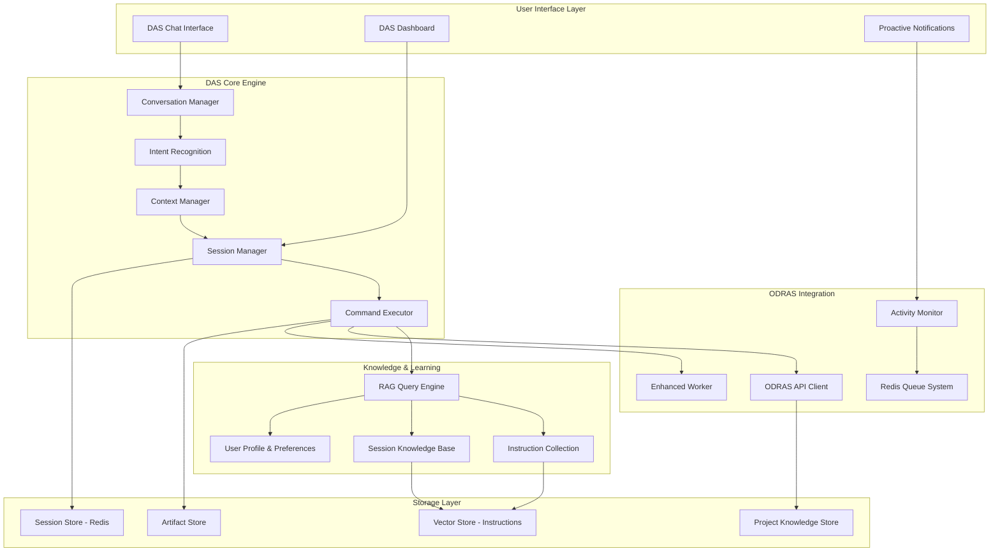

# Digital Assistance System (DAS) MVP Specification

**Authors:** [User's Name], with AI-assisted drafting based on ODRAS architecture  
**Date:** January 2025  
**Document Type:** Technical Specification  
**Version:** 1.0  
**Status:** Initial Specification  

---

## Executive Summary

The Digital Assistance System (DAS) is an intelligent assistant designed to help users work with the Ontology-Driven Requirements Analysis System (ODRAS). DAS provides contextual guidance, automated task execution, and proactive assistance by leveraging the same RAG capabilities as the Knowledge Management Workbench, combined with API access to perform actions on behalf of users.

DAS serves as an intelligent interface layer that learns from user interactions, maintains session awareness, and can execute ODRAS operations autonomously after appropriate training and user authorization. The system is designed to evolve from a helpful assistant to an autonomous agent capable of performing complex analysis workflows.

---

## 1. System Architecture Overview

### 1.1 DAS Core Architecture


```mermaid
graph TD
    subgraph "User Interface Layer"
        CHAT[DAS Chat Interface]
        DASHBOARD[DAS Dashboard]
        NOTIFICATIONS[Proactive Notifications]
    end
    
    subgraph "DAS Core Engine"
        CONVERSATION[Conversation Manager]
        INTENT[Intent Recognition]
        CONTEXT[Context Manager]
        SESSION[Session Manager]
        COMMAND[Command Executor]
    end
    
    subgraph "Knowledge & Learning"
        RAG[RAG Query Engine]
        INSTRUCTIONS[Instruction Collection]
        SESSION_KNOWLEDGE[Session Knowledge Base]
        USER_PROFILE[User Profile & Preferences]
    end
    
    subgraph "ODRAS Integration"
        API_CLIENT[ODRAS API Client]
        WORKER[Enhanced Worker]
        QUEUE[Redis Queue System]
        MONITOR[Activity Monitor]
    end
    
    subgraph "Storage Layer"
        VECTOR_STORE[Vector Store - Instructions]
        SESSION_STORE[Session Store - Redis]
        PROJECT_STORE[Project Knowledge Store]
        ARTIFACT_STORE[Artifact Store]
    end
    
    CHAT --> CONVERSATION
    DASHBOARD --> SESSION
    NOTIFICATIONS --> MONITOR
    
    CONVERSATION --> INTENT
    INTENT --> CONTEXT
    CONTEXT --> SESSION
    SESSION --> COMMAND
    
    COMMAND --> RAG
    COMMAND --> API_CLIENT
    COMMAND --> WORKER
    
    RAG --> INSTRUCTIONS
    RAG --> SESSION_KNOWLEDGE
    RAG --> USER_PROFILE
    
    SESSION --> SESSION_STORE
    MONITOR --> QUEUE
    API_CLIENT --> PROJECT_STORE
    COMMAND --> ARTIFACT_STORE
    
    INSTRUCTIONS --> VECTOR_STORE
    SESSION_KNOWLEDGE --> VECTOR_STORE
```

### 1.2 DAS Capability Evolution

**Phase 1 - Assistant (MVP)**:
- Answer questions using RAG knowledge
- Provide step-by-step guidance
- Execute simple API commands with user confirmation

**Phase 2 - Autonomous Agent**:
- Perform complex workflows autonomously
- Proactive suggestions and monitoring
- Advanced artifact generation

**Phase 3 - Expert System**:
- Domain-specific expertise
- Predictive assistance
- Full workflow automation

---

## 2. Core Components Specification

### 2.1 RAG Knowledge Integration

**2.1.1 Shared RAG Capabilities**
DAS leverages the same RAG query engine as the Knowledge Management Workbench:

```python
class DASRAGService:
    def __init__(self, rag_service, instruction_collection):
        self.rag_service = rag_service  # Shared with Knowledge Workbench
        self.instruction_collection = instruction_collection
        
    async def query_das_knowledge(self, question: str, context: dict = None):
        """
        Query both general knowledge and DAS-specific instructions
        """
        # Query general ODRAS knowledge
        general_results = await self.rag_service.query(question, context)
        
        # Query DAS instruction collection
        instruction_results = await self.instruction_collection.query(question)
        
        # Combine and rank results
        combined_results = self.combine_knowledge_sources(
            general_results, instruction_results
        )
        
        return combined_results
```

**2.1.2 Instruction Collection Schema**
```python
class DASInstruction:
    instruction_id: str
    category: str  # "api_usage", "ontology_creation", "file_management", etc.
    title: str
    description: str
    steps: List[str]
    examples: List[dict]
    prerequisites: List[str]
    related_commands: List[str]
    confidence_level: str  # "beginner", "intermediate", "advanced"
    last_updated: datetime
```

### 2.2 Instruction Collection System

**2.2.1 Pre-populated Instruction Categories**

```yaml
instruction_categories:
  api_usage:
    - "How to retrieve an ontology from the API"
    - "How to create a new class in an ontology"
    - "How to upload and process documents"
    - "How to run requirements analysis"
    
  ontology_management:
    - "Creating foundational ontologies"
    - "Adding first-order relationships"
    - "Implementing probabilistic models"
    - "Validating ontology consistency"
    
  file_operations:
    - "Uploading CDDs and requirements documents"
    - "Managing document versions"
    - "Exporting analysis results"
    - "Organizing project files"
    
  analysis_workflows:
    - "Running sensitivity analysis"
    - "Generating conceptual models"
    - "Creating impact assessments"
    - "Producing recommendations"
    
  troubleshooting:
    - "Common error resolution"
    - "Performance optimization"
    - "Data quality issues"
    - "Integration problems"
```

**2.2.2 Instruction Population Script**
```python
class InstructionPopulator:
    def __init__(self, vector_store, instruction_templates):
        self.vector_store = vector_store
        self.templates = instruction_templates
        
    async def populate_instruction_collection(self):
        """
        Populate vector store with comprehensive instruction set
        """
        instructions = []
        
        # Load instruction templates
        for category, templates in self.templates.items():
            for template in templates:
                instruction = await self.create_instruction_from_template(
                    category, template
                )
                instructions.append(instruction)
        
        # Generate embeddings and store
        await self.vector_store.batch_upsert(instructions)
        
        return len(instructions)
    
    async def create_instruction_from_template(self, category: str, template: dict):
        """
        Create detailed instruction from template
        """
        return DASInstruction(
            instruction_id=f"{category}_{template['id']}",
            category=category,
            title=template['title'],
            description=template['description'],
            steps=template['steps'],
            examples=template['examples'],
            prerequisites=template.get('prerequisites', []),
            related_commands=template.get('related_commands', []),
            confidence_level=template.get('level', 'beginner'),
            last_updated=datetime.now()
        )
```

### 2.3 Session Management System

**2.3.1 Session Architecture**
```python
class DASSession:
    session_id: str
    user_id: str
    start_time: datetime
    last_activity: datetime
    current_context: dict
    activity_log: List[ActivityEvent]
    session_summary: str
    user_preferences: dict
    active_project: str
    permissions: dict
```

**2.3.2 Activity Monitoring**
```python
class ActivityMonitor:
    def __init__(self, redis_client, session_store):
        self.redis = redis_client
        self.session_store = session_store
        
    async def log_activity(self, session_id: str, activity: ActivityEvent):
        """
        Log user activity for session awareness
        """
        # Store in Redis for real-time access
        await self.redis.lpush(f"session:{session_id}:activities", activity.to_json())
        
        # Update session summary periodically
        if self.should_update_summary(session_id):
            await self.update_session_summary(session_id)
    
    async def update_session_summary(self, session_id: str):
        """
        Generate AI-powered session summary
        """
        activities = await self.get_recent_activities(session_id)
        
        # Use LLM to generate summary
        summary = await self.generate_activity_summary(activities)
        
        # Store in vector store for DAS context
        await self.session_store.store_summary(session_id, summary)
        
        return summary
```

**2.3.3 Session-Aware Context**
```python
class SessionContextManager:
    def __init__(self, session_store, rag_service):
        self.session_store = session_store
        self.rag_service = rag_service
        
    async def get_contextual_response(self, question: str, session_id: str):
        """
        Provide response with full session context
        """
        # Get session context
        session_context = await self.session_store.get_session_context(session_id)
        
        # Get recent activities
        recent_activities = await self.session_store.get_recent_activities(session_id)
        
        # Build context for RAG query
        context = {
            "session_context": session_context,
            "recent_activities": recent_activities,
            "user_preferences": session_context.get("preferences", {}),
            "active_project": session_context.get("active_project")
        }
        
        # Query with context
        response = await self.rag_service.query_das_knowledge(question, context)
        
        return response
```

### 2.4 Command Execution Framework

**2.4.1 Enhanced Worker Integration**
```python
class DASCommandExecutor:
    def __init__(self, api_client, worker_client, permission_manager):
        self.api_client = api_client
        self.worker_client = worker_client
        self.permissions = permission_manager
        
    async def execute_command(self, command: dict, session_id: str, user_id: str):
        """
        Execute ODRAS command with proper authorization
        """
        # Check permissions
        if not await self.permissions.can_execute(user_id, command):
            raise PermissionError("User not authorized for this command")
        
        # Determine execution method
        if command["type"] == "api_call":
            return await self.execute_api_command(command)
        elif command["type"] == "workflow":
            return await self.execute_workflow_command(command)
        elif command["type"] == "analysis":
            return await self.execute_analysis_command(command)
        else:
            raise ValueError(f"Unknown command type: {command['type']}")
    
    async def execute_api_command(self, command: dict):
        """
        Execute direct API command
        """
        endpoint = command["endpoint"]
        method = command["method"]
        params = command.get("params", {})
        
        response = await self.api_client.request(method, endpoint, params)
        return response
    
    async def execute_workflow_command(self, command: dict):
        """
        Execute BPMN workflow command
        """
        workflow_id = command["workflow_id"]
        variables = command.get("variables", {})
        
        # Start workflow via worker
        result = await self.worker_client.start_workflow(workflow_id, variables)
        return result
```

**2.4.2 Command Templates**
```python
COMMAND_TEMPLATES = {
    "retrieve_ontology": {
        "type": "api_call",
        "endpoint": "/api/ontologies/{ontology_id}",
        "method": "GET",
        "description": "Retrieve ontology by ID",
        "examples": [
            {
                "ontology_id": "foundational_se_ontology",
                "expected_result": "Ontology object with classes and relationships"
            }
        ]
    },
    
    "create_ontology_class": {
        "type": "api_call", 
        "endpoint": "/api/ontologies/{ontology_id}/classes",
        "method": "POST",
        "description": "Create new class in ontology",
        "required_params": ["class_name", "class_type", "properties"],
        "examples": [
            {
                "ontology_id": "foundational_se_ontology",
                "class_name": "SystemComponent",
                "class_type": "PhysicalEntity",
                "properties": {"hasFunction": "string", "hasInterface": "string"}
            }
        ]
    },
    
    "run_analysis": {
        "type": "workflow",
        "workflow_id": "requirements_analysis_workflow",
        "description": "Run full requirements analysis on document",
        "required_params": ["document_id", "analysis_type"],
        "examples": [
            {
                "document_id": "cdd_001",
                "analysis_type": "full",
                "questions": ["What are the key capabilities?", "What are the performance requirements?"]
            }
        ]
    }
}
```

### 2.5 Proactive Monitoring and Suggestions

**2.5.1 Activity Queue System**
```python
class DASActivityQueue:
    def __init__(self, redis_client, das_engine):
        self.redis = redis_client
        self.das_engine = das_engine
        
    async def monitor_user_activities(self):
        """
        Monitor user activities and generate suggestions
        """
        while True:
            # Get activities from queue
            activities = await self.redis.brpop("user_activities", timeout=1)
            
            if activities:
                activity = json.loads(activities[1])
                await self.process_activity(activity)
    
    async def process_activity(self, activity: dict):
        """
        Process activity and generate suggestions
        """
        session_id = activity["session_id"]
        activity_type = activity["type"]
        
        # Analyze activity pattern
        suggestions = await self.analyze_activity_pattern(session_id, activity)
        
        # Store suggestions for DAS to present
        if suggestions:
            await self.redis.lpush(f"das:suggestions:{session_id}", suggestions)
    
    async def analyze_activity_pattern(self, session_id: str, activity: dict):
        """
        Use AI to analyze activity and suggest next steps
        """
        # Get session history
        history = await self.get_session_history(session_id)
        
        # Use LLM to analyze patterns and suggest actions
        suggestions = await self.das_engine.generate_suggestions(history, activity)
        
        return suggestions
```

**2.5.2 Suggestion Generation**
```python
class DASSuggestionEngine:
    def __init__(self, llm_client, knowledge_base):
        self.llm = llm_client
        self.knowledge = knowledge_base
        
    async def generate_suggestions(self, session_history: list, current_activity: dict):
        """
        Generate contextual suggestions based on user activity
        """
        # Build context from session history
        context = self.build_suggestion_context(session_history, current_activity)
        
        # Query LLM for suggestions
        prompt = self.build_suggestion_prompt(context)
        response = await self.llm.generate(prompt)
        
        # Parse and structure suggestions
        suggestions = self.parse_suggestions(response)
        
        return suggestions
    
    def build_suggestion_context(self, history: list, activity: dict):
        """
        Build context for suggestion generation
        """
        return {
            "recent_activities": history[-10:],  # Last 10 activities
            "current_activity": activity,
            "user_patterns": self.analyze_user_patterns(history),
            "project_context": self.extract_project_context(history),
            "available_actions": self.get_available_actions(activity)
        }
```

---

## 3. API Integration and Worker Enhancement

### 3.1 Enhanced Worker for DAS Commands

**3.1.1 DAS-Aware Worker**
```python
class DASEnhancedWorker:
    def __init__(self, base_worker, das_client):
        self.base_worker = base_worker
        self.das_client = das_client
        
    async def handle_das_command(self, task_id: str, variables: dict):
        """
        Handle DAS-initiated commands
        """
        command_type = variables.get("command_type")
        command_data = variables.get("command_data", {})
        session_id = variables.get("session_id")
        
        try:
            if command_type == "retrieve_ontology":
                result = await self.retrieve_ontology(command_data)
            elif command_type == "create_class":
                result = await self.create_ontology_class(command_data)
            elif command_type == "run_analysis":
                result = await self.run_analysis_workflow(command_data)
            elif command_type == "generate_artifact":
                result = await self.generate_project_artifact(command_data)
            else:
                raise ValueError(f"Unknown DAS command: {command_type}")
            
            # Log successful execution
            await self.das_client.log_command_execution(session_id, command_type, result)
            
            return {
                "status": "success",
                "result": result,
                "command_type": command_type
            }
            
        except Exception as e:
            # Log error for DAS learning
            await self.das_client.log_command_error(session_id, command_type, str(e))
            raise
    
    async def retrieve_ontology(self, command_data: dict):
        """
        Retrieve ontology with DAS context
        """
        ontology_id = command_data["ontology_id"]
        
        # Get ontology from API
        ontology = await self.api_client.get_ontology(ontology_id)
        
        # Add DAS-specific metadata
        ontology["das_metadata"] = {
            "retrieved_at": datetime.now(),
            "retrieval_context": command_data.get("context", "user_request"),
            "suggested_actions": await self.suggest_ontology_actions(ontology)
        }
        
        return ontology
    
    async def suggest_ontology_actions(self, ontology: dict):
        """
        Suggest actions user can take with retrieved ontology
        """
        suggestions = []
        
        if ontology.get("classes"):
            suggestions.append({
                "action": "create_class",
                "description": "Add a new class to this ontology",
                "confidence": "high"
            })
        
        if ontology.get("relationships"):
            suggestions.append({
                "action": "add_relationship", 
                "description": "Add relationships between classes",
                "confidence": "medium"
            })
        
        return suggestions
```

### 3.2 Redis Queue Integration

**3.2.1 Activity Queue Implementation**
```python
class DASQueueManager:
    def __init__(self, redis_client):
        self.redis = redis_client
        
    async def publish_activity(self, activity: dict):
        """
        Publish user activity to queue for DAS processing
        """
        await self.redis.lpush("user_activities", json.dumps(activity))
    
    async def publish_suggestion(self, session_id: str, suggestion: dict):
        """
        Publish suggestion to session-specific queue
        """
        await self.redis.lpush(f"das:suggestions:{session_id}", json.dumps(suggestion))
    
    async def get_suggestions(self, session_id: str):
        """
        Get pending suggestions for session
        """
        suggestions = await self.redis.lrange(f"das:suggestions:{session_id}", 0, -1)
        return [json.loads(s) for s in suggestions]
    
    async def clear_suggestions(self, session_id: str):
        """
        Clear processed suggestions
        """
        await self.redis.delete(f"das:suggestions:{session_id}")
```

---

## 4. Project Knowledge and Artifact Generation

### 4.1 Project Knowledge Integration

**4.1.1 Project Context Manager**
```python
class ProjectKnowledgeManager:
    def __init__(self, vector_store, api_client):
        self.vector_store = vector_store
        self.api_client = api_client
        
    async def get_project_context(self, project_id: str):
        """
        Get comprehensive project context for DAS
        """
        # Get project metadata
        project_info = await self.api_client.get_project(project_id)
        
        # Get project documents
        documents = await self.api_client.get_project_documents(project_id)
        
        # Get analysis results
        analyses = await self.api_client.get_project_analyses(project_id)
        
        # Get ontology mappings
        ontologies = await self.api_client.get_project_ontologies(project_id)
        
        return {
            "project_info": project_info,
            "documents": documents,
            "analyses": analyses,
            "ontologies": ontologies,
            "knowledge_summary": await self.generate_project_summary(project_id)
        }
    
    async def generate_project_summary(self, project_id: str):
        """
        Generate AI-powered project summary
        """
        context = await self.get_project_context(project_id)
        
        # Use LLM to generate comprehensive summary
        summary_prompt = self.build_project_summary_prompt(context)
        summary = await self.llm_client.generate(summary_prompt)
        
        return summary
```

### 4.2 Artifact Generation System

**4.2.1 Artifact Generator**
```python
class DASArtifactGenerator:
    def __init__(self, llm_client, template_engine):
        self.llm = llm_client
        self.templates = template_engine
        
    async def generate_artifact(self, artifact_type: str, project_context: dict, requirements: dict):
        """
        Generate project artifacts using AI
        """
        if artifact_type == "white_paper":
            return await self.generate_white_paper(project_context, requirements)
        elif artifact_type == "specification":
            return await self.generate_specification(project_context, requirements)
        elif artifact_type == "requirements_summary":
            return await self.generate_requirements_summary(project_context, requirements)
        else:
            raise ValueError(f"Unknown artifact type: {artifact_type}")
    
    async def generate_white_paper(self, project_context: dict, requirements: dict):
        """
        Generate comprehensive white paper
        """
        # Build context for white paper generation
        context = {
            "project_summary": project_context["knowledge_summary"],
            "key_findings": project_context["analyses"],
            "requirements": requirements,
            "recommendations": await self.extract_recommendations(project_context)
        }
        
        # Generate white paper using LLM
        white_paper = await self.llm.generate_white_paper(context)
        
        # Format and structure
        formatted_paper = self.templates.format_white_paper(white_paper)
        
        return {
            "type": "white_paper",
            "content": formatted_paper,
            "metadata": {
                "generated_at": datetime.now(),
                "project_id": project_context["project_info"]["id"],
                "sections": self.extract_sections(formatted_paper)
            }
        }
    
    async def generate_specification(self, project_context: dict, requirements: dict):
        """
        Generate technical specification document
        """
        # Extract technical requirements
        technical_reqs = await self.extract_technical_requirements(project_context)
        
        # Generate specification
        spec = await self.llm.generate_specification(technical_reqs, requirements)
        
        return {
            "type": "specification",
            "content": spec,
            "metadata": {
                "generated_at": datetime.now(),
                "project_id": project_context["project_info"]["id"],
                "requirements_covered": len(technical_reqs)
            }
        }
```

---

## 5. User Interface and Interaction Design

### 5.1 DAS Chat Interface

**5.1.1 Chat Interface Components**
```typescript
interface DASChatInterface {
  // Core chat functionality
  sendMessage(message: string): Promise<DASResponse>;
  getSessionHistory(): Promise<ChatMessage[]>;
  
  // DAS-specific features
  getSuggestions(): Promise<Suggestion[]>;
  executeCommand(command: DASCommand): Promise<CommandResult>;
  getContextualHelp(): Promise<HelpContent>;
}

interface DASResponse {
  message: string;
  confidence: 'high' | 'medium' | 'low';
  suggestions?: Suggestion[];
  commands?: DASCommand[];
  artifacts?: Artifact[];
  metadata: {
    sources: string[];
    processing_time: number;
    session_context: boolean;
  };
}

interface Suggestion {
  id: string;
  title: string;
  description: string;
  action: string;
  confidence: 'high' | 'medium' | 'low';
  category: 'workflow' | 'analysis' | 'ontology' | 'file_management';
}
```

**5.1.2 Proactive Notification System**
```typescript
interface DASNotificationSystem {
  // Notification types
  showSuggestion(suggestion: Suggestion): void;
  showProgressUpdate(update: ProgressUpdate): void;
  showError(error: DASError): void;
  showSuccess(action: string, result: any): void;
  
  // Notification management
  dismissNotification(id: string): void;
  getActiveNotifications(): Notification[];
  clearAllNotifications(): void;
}
```

### 5.2 DAS Dashboard

**5.2.1 Dashboard Components**
```typescript
interface DASDashboard {
  // Session overview
  sessionSummary: SessionSummary;
  recentActivities: Activity[];
  activeProject: ProjectInfo;
  
  // Quick actions
  quickActions: QuickAction[];
  suggestedWorkflows: WorkflowSuggestion[];
  
  // Knowledge access
  knowledgeSearch: KnowledgeSearch;
  instructionLibrary: Instruction[];
  
  // Project artifacts
  generatedArtifacts: Artifact[];
  projectProgress: ProjectProgress;
}
```

---

## 6. Implementation Roadmap

### 6.1 Phase 1: Foundation (Weeks 1-4)

**Week 1: Core DAS Engine**
- Implement DAS conversation manager
- Integrate with existing RAG service
- Create basic session management

**Week 2: Instruction Collection**
- Develop instruction population script
- Create instruction templates
- Implement instruction query system

**Week 3: Command Execution**
- Enhance worker for DAS commands
- Implement command templates
- Create permission system

**Week 4: Basic UI**
- Implement chat interface
- Create DAS dashboard
- Add notification system

### 6.2 Phase 2: Intelligence (Weeks 5-8)

**Week 5: Session Awareness**
- Implement activity monitoring
- Create session summarization
- Add contextual responses

**Week 6: Proactive Features**
- Implement suggestion engine
- Create activity queue system
- Add progress monitoring

**Week 7: Project Integration**
- Implement project knowledge manager
- Create artifact generation
- Add project context awareness

**Week 8: Advanced Features**
- Implement autonomous command execution
- Create workflow suggestions
- Add predictive assistance

### 6.3 Phase 3: Optimization (Weeks 9-12)

**Week 9: Performance Optimization**
- Optimize RAG queries
- Improve response times
- Add caching strategies

**Week 10: User Experience**
- Refine chat interface
- Improve suggestion quality
- Add user preference learning

**Week 11: Integration Testing**
- End-to-end testing
- Performance validation
- User acceptance testing

**Week 12: Deployment**
- Production deployment
- User training
- Documentation completion

---

## 7. Technical Specifications

### 7.1 Technology Stack

**Core Technologies**:
```python
# DAS Core
fastapi>=0.100.0          # API framework
uvicorn>=0.22.0           # ASGI server
pydantic>=2.0.0           # Data validation

# AI/ML
openai>=0.27.0            # LLM integration
sentence-transformers>=2.2.0  # Embeddings
transformers>=4.30.0      # NLP models

# Storage
redis>=4.5.0              # Session and queue storage
qdrant-client>=1.3.0      # Vector storage
neo4j>=5.8.0              # Graph storage

# Async Processing
celery>=5.3.0             # Task queue
asyncio                   # Async operations
aiohttp>=3.8.0            # HTTP client

# UI Framework
react>=18.0.0             # Frontend framework
typescript>=5.0.0         # Type safety
tailwindcss>=3.3.0        # Styling
```

### 7.2 API Endpoints

**DAS Core API**:
```python
# Chat and conversation
POST /api/das/chat/send
GET  /api/das/chat/history
POST /api/das/chat/context

# Commands and execution
POST /api/das/commands/execute
GET  /api/das/commands/templates
POST /api/das/commands/validate

# Session management
GET  /api/das/session/current
POST /api/das/session/update
GET  /api/das/session/summary

# Suggestions and monitoring
GET  /api/das/suggestions
POST /api/das/suggestions/dismiss
GET  /api/das/notifications

# Project integration
GET  /api/das/projects/{project_id}/context
POST /api/das/projects/{project_id}/artifacts
GET  /api/das/projects/{project_id}/progress
```

### 7.3 Configuration Schema

```python
class DASConfig(BaseSettings):
    # DAS Core Configuration
    das_enabled: bool = True
    max_conversation_history: int = 100
    session_timeout: int = 3600  # 1 hour
    
    # RAG Integration
    rag_service_url: str = "http://localhost:8000"
    instruction_collection_name: str = "das_instructions"
    
    # Redis Configuration
    redis_url: str = "redis://localhost:6379"
    activity_queue_name: str = "user_activities"
    
    # LLM Configuration
    llm_provider: str = "openai"
    llm_model: str = "gpt-4"
    max_tokens: int = 4096
    temperature: float = 0.1
    
    # Command Execution
    auto_execute_commands: bool = False
    require_confirmation: bool = True
    max_command_timeout: int = 300
    
    # Notification Settings
    enable_proactive_suggestions: bool = True
    suggestion_frequency: int = 300  # 5 minutes
    max_suggestions_per_session: int = 10
    
    class Config:
        env_file = '.env'
        case_sensitive = False
```

---

## 8. Security and Permissions

### 8.1 Permission System

**8.1.1 Command Permissions**
```python
class DASPermissionManager:
    def __init__(self, user_service, role_service):
        self.user_service = user_service
        self.role_service = role_service
        
    async def can_execute_command(self, user_id: str, command: dict) -> bool:
        """
        Check if user can execute specific command
        """
        user_roles = await self.user_service.get_user_roles(user_id)
        command_permissions = command.get("required_permissions", [])
        
        for permission in command_permissions:
            if not await self.role_service.has_permission(user_roles, permission):
                return False
        
        return True
    
    async def get_available_commands(self, user_id: str) -> List[dict]:
        """
        Get list of commands user can execute
        """
        user_roles = await self.user_service.get_user_roles(user_id)
        all_commands = await self.get_all_commands()
        
        available_commands = []
        for command in all_commands:
            if await self.can_execute_command(user_id, command):
                available_commands.append(command)
        
        return available_commands
```

### 8.2 Data Privacy and Security

**8.2.1 Session Data Protection**
- Encrypt sensitive session data
- Implement data retention policies
- Provide data export/deletion capabilities
- Audit all command executions

**8.2.2 API Security**
- Implement rate limiting
- Use JWT authentication
- Validate all input parameters
- Log all API access

---

## 9. Monitoring and Analytics

### 9.1 DAS Performance Metrics

**9.1.1 Key Performance Indicators**
```python
class DASMetrics:
    # Response Quality
    response_accuracy: float
    user_satisfaction: float
    suggestion_acceptance_rate: float
    
    # Performance
    average_response_time: float
    command_execution_success_rate: float
    system_uptime: float
    
    # Usage Patterns
    daily_active_users: int
    commands_executed_per_day: int
    artifacts_generated_per_week: int
    
    # Learning Progress
    instruction_usage_frequency: dict
    user_preference_accuracy: float
    autonomous_execution_rate: float
```

### 9.2 Analytics Dashboard

**9.2.1 DAS Analytics Interface**
- Real-time performance metrics
- User behavior analytics
- Command execution statistics
- Suggestion effectiveness tracking
- System health monitoring

---

## 10. Future Expansion

### 10.1 Advanced AI Capabilities

**10.1.1 Predictive Assistance**
- Anticipate user needs based on patterns
- Proactive workflow suggestions
- Intelligent error prevention
- Automated optimization recommendations

**10.1.2 Domain Expertise**
- Specialized knowledge for different domains
- Custom instruction sets per industry
- Advanced ontology reasoning
- Expert-level analysis capabilities

### 10.2 Integration Expansion

**10.2.1 External Tool Integration**
- DOORS integration for requirements management
- Cameo integration for system modeling
- MATLAB integration for analysis
- Enterprise system connectors

**10.2.2 Multi-User Collaboration**
- Team-based DAS sessions
- Shared knowledge bases
- Collaborative artifact generation
- Cross-user learning and adaptation

---

## 11. Conclusion

The Digital Assistance System (DAS) MVP represents a significant step toward intelligent, autonomous assistance within the ODRAS ecosystem. By leveraging existing RAG capabilities, implementing comprehensive session awareness, and providing proactive assistance, DAS will transform how users interact with complex requirements analysis workflows.

The system's modular architecture ensures scalability and maintainability, while the phased implementation approach allows for iterative improvement based on user feedback and system performance. The integration with existing ODRAS components ensures seamless operation while adding powerful new capabilities.

**Key Innovation**: DAS combines conversational AI with autonomous command execution, creating an intelligent assistant that can both guide users and perform complex tasks on their behalf, ultimately evolving into an expert system capable of independent analysis and artifact generation.

---

## References

1. ODRAS Comprehensive Specification (Prerequisite)
2. BPMN LLM Integration Guide (Implementation reference)
3. RAG Query Process Implementation (Technical foundation)
4. DADMS BPMN Workflow Engine (Orchestration platform)

---

*This specification provides the blueprint for implementing an intelligent digital assistant that enhances user productivity while maintaining the rigor and quality of the ODRAS analysis framework.*
