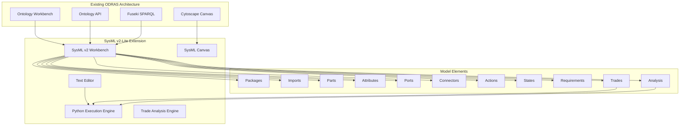
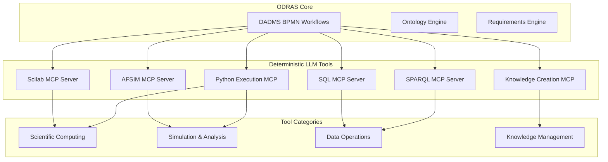
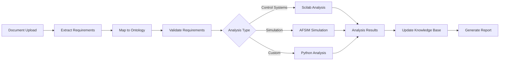
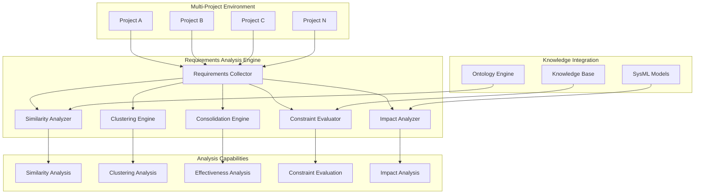
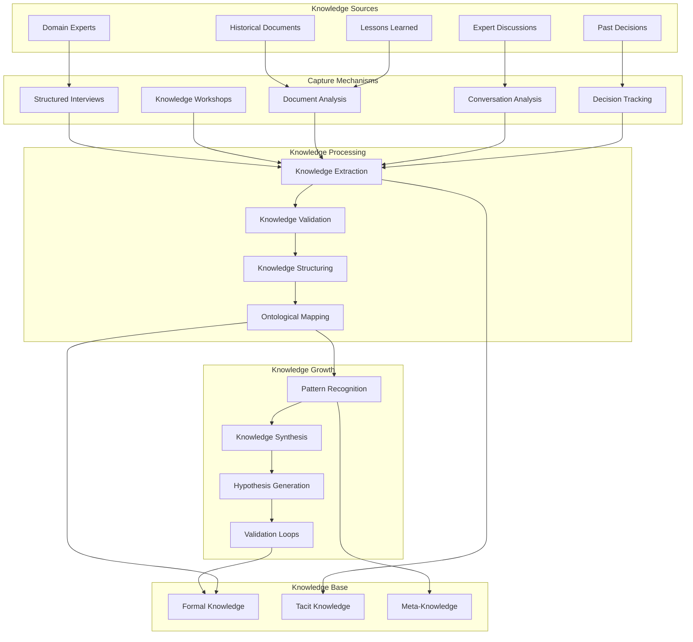
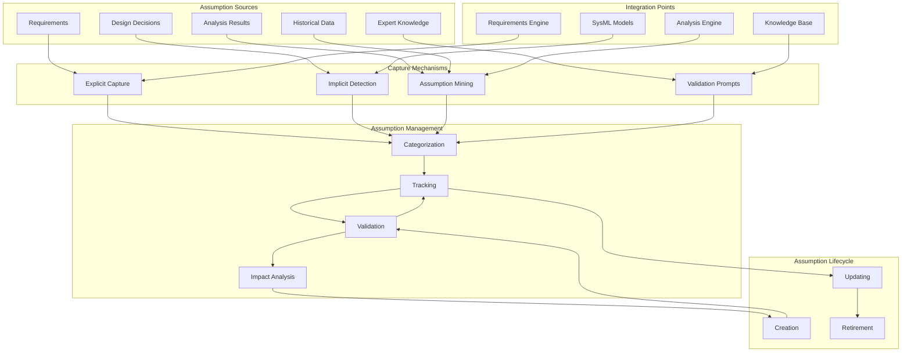
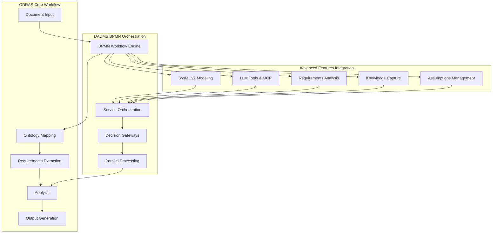

# ODRAS Advanced Features Specification

**Authors:** System Engineering Team  
**Date:** January 2025  
**Document Type:** Advanced Features Technical Specification  
**Version:** 1.0  
**Status:** Future State Specification  

---

## Executive Summary

This document outlines advanced features for the Ontology-Driven Requirements Analysis System (ODRAS) that will significantly enhance its capabilities in systems engineering, modeling, simulation, and analysis. These features build upon the existing ontology workbench and cytoscape-based visualization architecture to provide comprehensive SysML v2 modeling, deterministic LLM tool integration, advanced requirements analysis, and knowledge capture capabilities.

The advanced features are designed to support complex aircraft and missile system synthesis, controls system design, and modeling & simulation workflows while maintaining the ontological foundation that makes ODRAS unique in the requirements analysis domain.

---

## 1. SysML v2-Lite Integration

### 1.1 Overview

The SysML v2-Lite integration will provide a comprehensive modeling environment that leverages the existing ontology cytoscape tool architecture while adding native SysML v2 capabilities. This feature will enable users to create system models using both visual canvas-based editing and native SysML v2 text syntax.

### 1.2 Architecture Integration

Building on the existing ontology workbench architecture:



### 1.3 Core Capabilities

#### 1.3.1 Ontology-Driven Modeling
- **Ontology Integration**: All SysML models must reference and utilize concepts from the project-defined or imported ontologies
- **Semantic Validation**: Models are validated against ontological constraints and relationships
- **Concept Mapping**: Automatic mapping between ontology concepts and SysML model elements
- **Consistency Checking**: Continuous validation of model consistency with underlying ontologies

#### 1.3.2 Dual Interface Design
- **Visual Canvas**: Extend the existing cytoscape-based ontology workbench to support SysML diagram types
- **Text Editor**: Native SysML v2 syntax editor with syntax highlighting, auto-completion, and validation
- **Synchronization**: Real-time synchronization between visual and text representations
- **Import/Export**: Support for standard SysML v2 file formats

#### 1.3.3 Model Elements Support
- **Packages**: Hierarchical organization of model elements
- **Imports**: Cross-package and cross-ontology imports
- **Parts**: System components with ontological grounding
- **Attributes**: Properties with type constraints from ontologies
- **Ports**: Interface definitions with behavioral specifications
- **Connectors**: Relationships between parts with semantic meaning
- **Actions**: Behavioral specifications with ontological context
- **States**: State machine definitions with ontology-based transitions
- **Requirements**: Requirements traceability with ontological validation
- **Analysis**: Analysis definitions with parameter constraints
- **Trades**: Trade study definitions with evaluation criteria

#### 1.3.4 Python Execution Engine
- **Trade Analysis**: Execute trade studies using Python-based analysis tools
- **Model Validation**: Runtime validation of model constraints
- **Simulation Integration**: Interface with external simulation tools
- **Parameter Sweeps**: Automated parameter variation studies
- **Optimization**: Integration with optimization algorithms

### 1.4 Implementation Approach

#### 1.4.1 Frontend Extensions
```typescript
// Extend existing ontology workbench
interface SysMLWorkbench extends OntologyWorkbench {
  sysmlCanvas: SysMLCanvas;
  textEditor: SysMLEditor;
  modelValidator: ModelValidator;
  tradeAnalyzer: TradeAnalyzer;
}

// SysML-specific node types
interface SysMLNode extends OntologyNode {
  sysmlType: 'package' | 'part' | 'port' | 'action' | 'state' | 'requirement';
  ontologicalGrounding: string; // Reference to ontology concept
  constraints: Constraint[];
  analysis: AnalysisDefinition[];
}
```

#### 1.4.2 Backend Services
```python
class SysMLModelManager:
    def __init__(self, ontology_manager: OntologyManager):
        self.ontology_manager = ontology_manager
        self.python_engine = PythonExecutionEngine()
        self.model_validator = SysMLValidator()
    
    def create_model(self, model_definition: SysMLModel) -> ModelResult:
        # Validate against ontologies
        validation_result = self.model_validator.validate(model_definition)
        if not validation_result.is_valid:
            return ModelResult(error=validation_result.errors)
        
        # Store in Fuseki with ontological grounding
        return self._store_model(model_definition)
    
    def execute_trade_analysis(self, trade_definition: TradeDefinition) -> AnalysisResult:
        # Execute Python-based trade analysis
        return self.python_engine.execute_trade(trade_definition)
```

---

## 2. Deterministic API-Accessible LLM Tools

### 2.1 Overview

Integration of deterministic, API-accessible LLM tools and MCP (Model Context Protocol) servers to provide reliable, reproducible operations for scientific computing, simulation, and knowledge management within the ODRAS workflow.

### 2.2 Architecture



### 2.3 Tool Specifications

#### 2.3.1 Scilab MCP Server
- **Purpose**: Mathematical computing and control system analysis
- **Capabilities**:
  - Control system design and analysis
  - Signal processing operations
  - Optimization algorithms
  - Matrix operations and linear algebra
  - Plotting and visualization
- **Integration**: Called from DADMS workflows for control system requirements analysis

#### 2.3.2 AFSIM MCP Server
- **Purpose**: Air Force Simulation Framework integration
- **Capabilities**:
  - Mission scenario simulation
  - Performance analysis
  - Threat assessment
  - Operational effectiveness evaluation
- **Integration**: Automated simulation runs triggered by requirements analysis workflows

#### 2.3.3 Python Execution MCP
- **Purpose**: General-purpose scientific computing
- **Capabilities**:
  - NumPy/SciPy operations
  - Machine learning algorithms
  - Data analysis and visualization
  - Custom algorithm execution
  - Integration with external libraries
- **Integration**: Flexible execution environment for custom analysis workflows

#### 2.3.4 SQL MCP Server
- **Purpose**: Structured data operations
- **Capabilities**:
  - Database queries and updates
  - Data transformation
  - Reporting and analytics
  - Data validation
- **Integration**: Data operations within requirements analysis workflows

#### 2.3.5 SPARQL MCP Server
- **Purpose**: Ontological data operations
- **Capabilities**:
  - Ontology queries
  - Knowledge graph traversal
  - Semantic reasoning
  - Ontology updates
- **Integration**: Direct integration with ODRAS ontology engine

#### 2.3.6 Knowledge Creation MCP
- **Purpose**: Knowledge management and creation
- **Capabilities**:
  - Knowledge extraction from documents
  - Knowledge graph construction
  - Knowledge validation and quality assessment
  - Knowledge persistence and retrieval
- **Integration**: Automated knowledge creation from requirements analysis

### 2.4 Workflow Integration

#### 2.4.1 DADMS BPMN Integration


#### 2.4.2 MCP Server Implementation
```python
class ScilabMCPServer:
    def __init__(self):
        self.scilab_engine = ScilabEngine()
        self.odras_context = ODRASContext()
    
    async def execute_control_analysis(self, 
                                     system_model: str, 
                                     requirements: List[Requirement]) -> AnalysisResult:
        # Execute deterministic Scilab analysis
        result = self.scilab_engine.analyze_control_system(
            model=system_model,
            requirements=requirements
        )
        
        # Update ODRAS knowledge base
        await self.odras_context.update_analysis_results(result)
        
        return result

class KnowledgeCreationMCP:
    def __init__(self, ontology_manager: OntologyManager):
        self.ontology_manager = ontology_manager
        self.knowledge_extractor = KnowledgeExtractor()
    
    async def create_knowledge_from_analysis(self, 
                                           analysis_result: AnalysisResult) -> KnowledgeGraph:
        # Extract knowledge from analysis results
        knowledge = self.knowledge_extractor.extract(analysis_result)
        
        # Validate against ontologies
        validated_knowledge = self.ontology_manager.validate_knowledge(knowledge)
        
        # Store in knowledge base
        return await self.ontology_manager.store_knowledge(validated_knowledge)
```

---

## 3. Integrated Requirements Analysis

### 3.1 Overview

Advanced requirements analysis capabilities that operate across multiple installations and projects, providing comprehensive requirements study, similarity analysis, consolidation recommendations, and impact assessment.

### 3.2 Architecture



### 3.3 Core Capabilities

#### 3.3.1 Cross-Project Requirements Collection
- **Multi-Source Integration**: Collect requirements from multiple project installations
- **Standardization**: Normalize requirements across different formats and sources
- **Versioning**: Track requirements versions and changes across projects
- **Provenance**: Maintain traceability to source documents and projects

#### 3.3.2 Similarity Analysis
- **Semantic Similarity**: Use ontological relationships to identify similar requirements
- **Structural Similarity**: Analyze requirement structure and patterns
- **Functional Similarity**: Identify functionally equivalent requirements
- **Constraint Similarity**: Find requirements with similar constraints

#### 3.3.3 Clustering and Consolidation
- **Automatic Clustering**: Group similar requirements using machine learning
- **Consolidation Recommendations**: Suggest requirements that can be merged
- **Conflict Detection**: Identify conflicting or contradictory requirements
- **Gap Analysis**: Find missing requirements across projects

#### 3.3.4 Effectiveness Analysis
- **Requirement Quality**: Assess requirement clarity, completeness, and testability
- **Coverage Analysis**: Evaluate requirement coverage of system capabilities
- **Redundancy Analysis**: Identify redundant or overlapping requirements
- **Optimization Suggestions**: Recommend requirement improvements

#### 3.3.5 Constraint Evaluation
- **Ontological Validation**: Validate requirements against ontological constraints
- **SysML Model Validation**: Check requirements against system models
- **Consistency Checking**: Ensure requirement consistency across projects
- **Feasibility Assessment**: Evaluate requirement feasibility

#### 3.3.6 Impact Analysis
- **Change Impact**: Analyze impact of requirement changes across projects
- **Dependency Analysis**: Identify requirement dependencies and relationships
- **Risk Assessment**: Evaluate risks associated with requirement changes
- **Cost-Benefit Analysis**: Assess costs and benefits of requirement modifications

### 3.4 Implementation

#### 3.4.1 Requirements Analysis Service
```python
class RequirementsAnalysisService:
    def __init__(self, ontology_manager: OntologyManager, 
                 sysml_manager: SysMLModelManager):
        self.ontology_manager = ontology_manager
        self.sysml_manager = sysml_manager
        self.similarity_analyzer = SimilarityAnalyzer()
        self.clustering_engine = ClusteringEngine()
        self.impact_analyzer = ImpactAnalyzer()
    
    async def analyze_cross_project_requirements(self, 
                                               project_ids: List[str]) -> AnalysisResult:
        # Collect requirements from multiple projects
        requirements = await self._collect_requirements(project_ids)
        
        # Perform similarity analysis
        similarity_results = await self.similarity_analyzer.analyze(requirements)
        
        # Perform clustering analysis
        clusters = await self.clustering_engine.cluster(requirements)
        
        # Evaluate constraints against ontologies and SysML models
        constraint_evaluation = await self._evaluate_constraints(requirements)
        
        # Perform impact analysis
        impact_analysis = await self.impact_analyzer.analyze(requirements)
        
        return AnalysisResult(
            similarity=similarity_results,
            clusters=clusters,
            constraints=constraint_evaluation,
            impact=impact_analysis
        )
    
    async def _evaluate_constraints(self, requirements: List[Requirement]) -> ConstraintEvaluation:
        # Validate against ontological constraints
        ontological_validation = await self.ontology_manager.validate_requirements(requirements)
        
        # Validate against SysML models
        sysml_validation = await self.sysml_manager.validate_requirements(requirements)
        
        return ConstraintEvaluation(
            ontological=ontological_validation,
            sysml=sysml_validation
        )
```

---

## 4. Tribal Knowledge Capture and Growth

### 4.1 Overview

Systematic capture, organization, and growth of tribal knowledge (tacit knowledge held by domain experts) into formal knowledge structures that can be leveraged by the ODRAS system.

### 4.2 Architecture



### 4.3 Core Capabilities

#### 4.3.1 Knowledge Capture
- **Structured Interviews**: Systematic capture of expert knowledge through guided interviews
- **Workshop Facilitation**: Group knowledge capture sessions with domain experts
- **Document Analysis**: Extraction of knowledge from historical documents and reports
- **Conversation Analysis**: Analysis of expert discussions and decision-making processes
- **Decision Tracking**: Capture of decision rationale and context

#### 4.3.2 Knowledge Processing
- **Extraction**: Use LLM and NLP techniques to extract knowledge from captured content
- **Validation**: Validate extracted knowledge against existing knowledge and expert review
- **Structuring**: Organize knowledge into formal structures compatible with ontologies
- **Ontological Mapping**: Map extracted knowledge to existing ontological concepts

#### 4.3.3 Knowledge Growth
- **Pattern Recognition**: Identify patterns in captured knowledge across different sources
- **Knowledge Synthesis**: Combine knowledge from multiple sources to create new insights
- **Hypothesis Generation**: Generate hypotheses based on patterns and gaps in knowledge
- **Validation Loops**: Continuous validation and refinement of knowledge through expert feedback

### 4.4 Implementation

#### 4.4.1 Knowledge Capture Service
```python
class TribalKnowledgeCaptureService:
    def __init__(self, ontology_manager: OntologyManager, 
                 llm_service: LLMService):
        self.ontology_manager = ontology_manager
        self.llm_service = llm_service
        self.knowledge_extractor = KnowledgeExtractor()
        self.pattern_recognizer = PatternRecognizer()
    
    async def capture_expert_knowledge(self, 
                                     expert_id: str, 
                                     interview_data: InterviewData) -> KnowledgeCapture:
        # Extract knowledge from interview
        extracted_knowledge = await self.knowledge_extractor.extract_from_interview(interview_data)
        
        # Validate against existing knowledge
        validation_result = await self._validate_knowledge(extracted_knowledge)
        
        # Map to ontological concepts
        ontological_mapping = await self.ontology_manager.map_to_ontology(extracted_knowledge)
        
        # Store in knowledge base
        knowledge_id = await self._store_knowledge(extracted_knowledge, ontological_mapping)
        
        return KnowledgeCapture(
            id=knowledge_id,
            expert_id=expert_id,
            knowledge=extracted_knowledge,
            validation=validation_result,
            mapping=ontological_mapping
        )
    
    async def grow_knowledge(self, knowledge_base: KnowledgeBase) -> KnowledgeGrowth:
        # Recognize patterns in existing knowledge
        patterns = await self.pattern_recognizer.recognize_patterns(knowledge_base)
        
        # Synthesize new knowledge from patterns
        synthesized_knowledge = await self._synthesize_knowledge(patterns)
        
        # Generate hypotheses for validation
        hypotheses = await self._generate_hypotheses(synthesized_knowledge)
        
        return KnowledgeGrowth(
            patterns=patterns,
            synthesized=synthesized_knowledge,
            hypotheses=hypotheses
        )
```

---

## 5. Assumptions Capture

### 5.1 Overview

Systematic capture, tracking, and management of assumptions that underlie requirements, designs, and analyses within the ODRAS system.

### 5.2 Architecture



### 5.3 Core Capabilities

#### 5.3.1 Assumption Capture
- **Explicit Capture**: Direct capture of assumptions during requirements and design processes
- **Implicit Detection**: Automatic detection of implicit assumptions in documents and models
- **Assumption Mining**: Extraction of assumptions from historical data and expert knowledge
- **Validation Prompts**: Systematic prompting for assumption identification and validation

#### 5.3.2 Assumption Management
- **Categorization**: Organize assumptions by type, domain, and impact
- **Tracking**: Track assumption lifecycle, changes, and dependencies
- **Validation**: Validate assumptions against evidence and expert knowledge
- **Impact Analysis**: Analyze impact of assumption changes on system design and requirements

#### 5.3.3 Assumption Lifecycle
- **Creation**: Formal creation and documentation of assumptions
- **Validation**: Validation against evidence and expert review
- **Tracking**: Continuous tracking of assumption status and changes
- **Updating**: Systematic updating based on new evidence or changes
- **Retirement**: Formal retirement of outdated or invalid assumptions

### 5.4 Implementation

#### 5.4.1 Assumptions Management Service
```python
class AssumptionsManagementService:
    def __init__(self, ontology_manager: OntologyManager, 
                 knowledge_base: KnowledgeBase):
        self.ontology_manager = ontology_manager
        self.knowledge_base = knowledge_base
        self.assumption_detector = AssumptionDetector()
        self.impact_analyzer = AssumptionImpactAnalyzer()
    
    async def capture_assumption(self, 
                               assumption_data: AssumptionData,
                               source: AssumptionSource) -> Assumption:
        # Validate assumption against ontological constraints
        validation = await self.ontology_manager.validate_assumption(assumption_data)
        
        # Create formal assumption object
        assumption = Assumption(
            id=generate_id(),
            content=assumption_data.content,
            category=assumption_data.category,
            source=source,
            validation=validation,
            created_at=datetime.now()
        )
        
        # Store in knowledge base
        await self.knowledge_base.store_assumption(assumption)
        
        return assumption
    
    async def analyze_assumption_impact(self, 
                                      assumption_id: str,
                                      change_type: ChangeType) -> ImpactAnalysis:
        # Get assumption and related elements
        assumption = await self.knowledge_base.get_assumption(assumption_id)
        related_elements = await self._get_related_elements(assumption)
        
        # Analyze impact of assumption change
        impact = await self.impact_analyzer.analyze(assumption, change_type, related_elements)
        
        return impact
    
    async def detect_implicit_assumptions(self, 
                                        document: Document) -> List[Assumption]:
        # Use LLM to detect implicit assumptions
        detected_assumptions = await self.assumption_detector.detect_implicit(document)
        
        # Validate and categorize detected assumptions
        validated_assumptions = []
        for assumption_data in detected_assumptions:
            assumption = await self.capture_assumption(assumption_data, AssumptionSource.IMPLICIT_DETECTION)
            validated_assumptions.append(assumption)
        
        return validated_assumptions
```

---

## 6. Integration and Workflow

### 6.1 Overall System Integration

The advanced features integrate seamlessly with the existing ODRAS architecture through the DADMS BPMN workflow engine:



### 6.2 Implementation Roadmap

#### Phase 1: SysML v2-Lite Foundation
- Extend existing ontology workbench with SysML v2 capabilities
- Implement basic SysML model elements (packages, parts, attributes)
- Integrate Python execution engine for trade analysis
- Develop ontology-driven model validation

#### Phase 2: LLM Tools Integration
- Implement MCP servers for Scilab, AFSIM, and Python execution
- Integrate SQL and SPARQL MCP servers
- Develop knowledge creation MCP server
- Create DADMS BPMN workflows for tool orchestration

#### Phase 3: Advanced Requirements Analysis
- Implement cross-project requirements collection
- Develop similarity and clustering analysis capabilities
- Create constraint evaluation against ontologies and SysML models
- Build impact analysis and effectiveness assessment tools

#### Phase 4: Knowledge and Assumptions Management
- Implement tribal knowledge capture mechanisms
- Develop knowledge growth and synthesis capabilities
- Create assumptions capture and management system
- Integrate with existing knowledge base and ontology engine

### 6.3 Technical Considerations

#### 6.3.1 Performance
- Implement caching strategies for frequently accessed data
- Use parallel processing for computationally intensive operations
- Optimize database queries and SPARQL operations
- Implement incremental processing for large datasets

#### 6.3.2 Scalability
- Design microservices architecture for independent scaling
- Implement load balancing for high-traffic operations
- Use distributed computing for large-scale analysis
- Design for horizontal scaling of storage and compute resources

#### 6.3.3 Security
- Implement authentication and authorization for all services
- Encrypt sensitive data in transit and at rest
- Implement audit logging for all operations
- Ensure compliance with security standards and regulations

#### 6.3.4 Maintainability
- Use modular, well-documented code architecture
- Implement comprehensive testing strategies
- Provide clear APIs and service interfaces
- Maintain backward compatibility with existing ODRAS features

---

## 7. Conclusion

The advanced features outlined in this specification will significantly enhance the ODRAS system's capabilities in systems engineering, modeling, simulation, and analysis. By building upon the existing ontology-driven architecture and integrating with the DADMS BPMN workflow engine, these features will provide:

1. **Comprehensive SysML v2 modeling** with ontological grounding and Python-based trade analysis
2. **Deterministic LLM tool integration** for reliable scientific computing and simulation
3. **Advanced requirements analysis** across multiple projects with similarity, clustering, and impact analysis
4. **Systematic knowledge capture** and growth from tribal knowledge sources
5. **Assumptions management** with lifecycle tracking and impact analysis

These capabilities will position ODRAS as a leading-edge system for ontology-driven requirements analysis, supporting complex aircraft and missile system synthesis, controls system design, and modeling & simulation workflows.

The implementation approach leverages existing ODRAS infrastructure while adding powerful new capabilities through well-defined service interfaces and BPMN workflow orchestration, ensuring maintainability, scalability, and extensibility for future enhancements.

---

## Appendix A: Future Enhancement Opportunities

This appendix outlines additional potential features and capabilities that could be incorporated into the ODRAS system in future development phases. These enhancements would further strengthen ODRAS's position as a comprehensive systems engineering platform.

### A.1 Digital Twin Integration

**Concept**: Integration with digital twin technologies to create living, real-time models of systems that evolve with operational data.

**Capabilities**:
- Real-time synchronization with operational systems
- Predictive maintenance and failure analysis
- Performance monitoring and optimization
- Virtual testing and validation environments
- Continuous requirements validation against operational reality

**Technical Approach**:
- Integration with IoT data streams and sensor networks
- Real-time data processing and analytics
- Machine learning models for predictive analysis
- Virtual reality (VR) and augmented reality (AR) interfaces for immersive system interaction

### A.2 AI-Powered Requirements Generation

**Concept**: Advanced AI systems that can automatically generate requirements based on mission objectives, constraints, and historical data.

**Capabilities**:
- Automatic requirement generation from mission statements
- Requirements optimization using genetic algorithms
- Conflict resolution and requirement harmonization
- Requirements completeness analysis and gap identification
- Natural language generation of requirement specifications

**Technical Approach**:
- Large language models fine-tuned on systems engineering domain knowledge
- Reinforcement learning for requirement optimization
- Knowledge graphs for requirement relationship modeling
- Automated testing and validation of generated requirements

### A.3 Collaborative Virtual Engineering Environment

**Concept**: A virtual workspace where geographically distributed teams can collaborate on system design and analysis in real-time.

**Capabilities**:
- Real-time collaborative modeling and editing
- Virtual whiteboarding and brainstorming sessions
- Shared 3D visualization of system models
- Voice and video integration for team communication
- Version control and change tracking for collaborative work

**Technical Approach**:
- WebRTC for real-time communication
- Operational transformation for conflict-free collaborative editing
- 3D rendering engines for immersive visualization
- Cloud-based infrastructure for global accessibility

### A.4 Automated Test Case Generation

**Concept**: AI-driven generation of comprehensive test cases from requirements and system models.

**Capabilities**:
- Automatic test case generation from requirements
- Boundary value analysis and edge case identification
- Test case optimization and prioritization
- Integration with automated testing frameworks
- Test coverage analysis and reporting

**Technical Approach**:
- Model-based testing techniques
- Symbolic execution for path coverage
- Machine learning for test case optimization
- Integration with CI/CD pipelines

### A.5 Multi-Physics Simulation Integration

**Concept**: Integration with advanced multi-physics simulation tools for comprehensive system analysis.

**Capabilities**:
- Fluid dynamics, structural, thermal, and electromagnetic analysis
- Multi-scale simulation from component to system level
- Uncertainty quantification in simulation results
- Optimization-driven design exploration
- Real-time simulation for interactive design

**Technical Approach**:
- Integration with COMSOL, ANSYS, and other simulation platforms
- High-performance computing (HPC) integration
- Surrogate modeling for rapid analysis
- Cloud-based simulation services

### A.6 Blockchain-Based Requirements Traceability

**Concept**: Use blockchain technology to ensure immutable traceability of requirements changes and decisions.

**Capabilities**:
- Immutable audit trail of all requirements changes
- Smart contracts for automated compliance checking
- Decentralized verification of requirements integrity
- Cryptographic proof of requirement ownership and approval
- Integration with regulatory compliance frameworks

**Technical Approach**:
- Private blockchain networks for enterprise use
- Smart contracts for automated workflow execution
- Cryptographic hashing for data integrity
- Integration with existing identity management systems

### A.7 Augmented Reality Requirements Visualization

**Concept**: AR interfaces that overlay requirements and system information onto physical prototypes or environments.

**Capabilities**:
- Real-time requirements overlay on physical systems
- Interactive requirement validation in physical space
- Spatial requirements mapping and visualization
- Mobile AR applications for field validation
- Integration with CAD models and system documentation

**Technical Approach**:
- ARKit/ARCore for mobile AR applications
- HoloLens and similar devices for enterprise AR
- Computer vision for object recognition and tracking
- Cloud-based AR content delivery

### A.8 Quantum Computing Integration

**Concept**: Leverage quantum computing for complex optimization problems in systems engineering.

**Capabilities**:
- Quantum optimization for system design trade-offs
- Quantum machine learning for pattern recognition
- Quantum simulation for complex system behaviors
- Quantum cryptography for secure requirements management
- Quantum annealing for constraint satisfaction problems

**Technical Approach**:
- Integration with quantum computing cloud services (IBM Q, Google Quantum AI)
- Quantum algorithm development for systems engineering problems
- Hybrid classical-quantum computing approaches
- Quantum error correction and noise mitigation

### A.9 Federated Learning for Cross-Organization Knowledge

**Concept**: Enable knowledge sharing across organizations while maintaining data privacy and security.

**Capabilities**:
- Cross-organization knowledge sharing without data exposure
- Federated learning for improved AI models
- Privacy-preserving analytics across multiple organizations
- Collaborative ontology development
- Shared best practices and lessons learned

**Technical Approach**:
- Federated learning frameworks (TensorFlow Federated, PySyft)
- Differential privacy techniques
- Secure multi-party computation
- Blockchain-based knowledge sharing protocols

### A.10 Autonomous System Design Optimization

**Concept**: AI systems that can autonomously explore design spaces and optimize system configurations.

**Capabilities**:
- Autonomous design space exploration
- Multi-objective optimization with conflicting requirements
- Automated design iteration and refinement
- Self-improving design algorithms
- Integration with manufacturing and production constraints

**Technical Approach**:
- Reinforcement learning for design optimization
- Evolutionary algorithms and genetic programming
- Multi-agent systems for distributed optimization
- Integration with CAD and manufacturing systems

### A.11 Natural Language Processing for Technical Documentation

**Concept**: Advanced NLP capabilities for processing and understanding technical documentation across multiple languages and formats.

**Capabilities**:
- Multi-language technical document processing
- Automatic translation of technical specifications
- Semantic search across large document repositories
- Automatic summarization of complex technical documents
- Cross-reference and citation analysis

**Technical Approach**:
- Transformer-based language models for technical domains
- Cross-lingual embedding models
- Document understanding and information extraction
- Knowledge graph construction from unstructured text

### A.12 Edge Computing for Real-Time Analysis

**Concept**: Deploy analysis capabilities at the edge for real-time system monitoring and decision-making.

**Capabilities**:
- Real-time requirements validation at system interfaces
- Edge-based anomaly detection and alerting
- Local processing for sensitive or classified data
- Reduced latency for critical decision-making
- Offline operation capabilities

**Technical Approach**:
- Edge computing frameworks (Kubernetes Edge, K3s)
- Lightweight machine learning models for edge deployment
- Edge-to-cloud synchronization and data management
- Real-time streaming analytics

### A.13 Integration with Model-Based Systems Engineering (MBSE) Tools

**Concept**: Deep integration with existing MBSE tools and frameworks for seamless workflow integration.

**Capabilities**:
- Integration with Cameo Systems Modeler, MagicDraw, and other MBSE tools
- Bi-directional synchronization of models and requirements
- Automated model generation from requirements
- Requirements validation against system models
- Traceability between MBSE models and ODRAS ontologies

**Technical Approach**:
- Standard MBSE interfaces (SysML, UAF, AP233)
- Model transformation and synchronization services
- API integration with commercial MBSE tools
- Standardized data exchange formats

### A.14 Advanced Visualization and Analytics

**Concept**: Next-generation visualization and analytics capabilities for complex system data.

**Capabilities**:
- Interactive 3D visualization of system architectures
- Advanced analytics dashboards with real-time updates
- Machine learning-powered insights and recommendations
- Immersive data exploration using VR/AR
- Collaborative visualization for team decision-making

**Technical Approach**:
- WebGL and Three.js for 3D visualization
- D3.js and similar libraries for advanced analytics
- Real-time data streaming and visualization
- VR/AR frameworks for immersive experiences

### A.15 Cybersecurity and Threat Analysis Integration

**Concept**: Integration of cybersecurity considerations and threat analysis into the requirements and design process.

**Capabilities**:
- Automated threat modeling and risk assessment
- Security requirements generation and validation
- Vulnerability analysis and mitigation planning
- Compliance checking against security standards
- Integration with cybersecurity frameworks (NIST, ISO 27001)

**Technical Approach**:
- Threat modeling tools and frameworks
- Security analysis and vulnerability assessment tools
- Integration with security information and event management (SIEM) systems
- Automated security testing and validation

### A.16 Sustainability and Environmental Impact Analysis

**Concept**: Integration of sustainability and environmental impact considerations into system design and requirements.

**Capabilities**:
- Life cycle assessment (LCA) integration
- Carbon footprint analysis and optimization
- Environmental impact modeling and prediction
- Sustainability requirements generation and validation
- Green design optimization and recommendations

**Technical Approach**:
- LCA databases and calculation engines
- Environmental impact modeling tools
- Integration with sustainability frameworks and standards
- Machine learning for environmental impact prediction

### A.17 Implementation Priority Framework

**High Priority (Near-term)**:
- Digital Twin Integration
- AI-Powered Requirements Generation
- Automated Test Case Generation
- Advanced Visualization and Analytics

**Medium Priority (Mid-term)**:
- Collaborative Virtual Engineering Environment
- Multi-Physics Simulation Integration
- Natural Language Processing for Technical Documentation
- Integration with MBSE Tools

**Long-term (Future)**:
- Quantum Computing Integration
- Blockchain-Based Requirements Traceability
- Federated Learning for Cross-Organization Knowledge
- Autonomous System Design Optimization

### A.18 Technical Considerations for Future Enhancements

**Scalability**: All future enhancements should be designed for horizontal scaling and cloud-native deployment.

**Interoperability**: Maintain compatibility with existing systems and standards while enabling integration with new technologies.

**Security**: Implement security-by-design principles for all new capabilities, especially those involving sensitive data or cross-organization collaboration.

**Performance**: Optimize for real-time or near-real-time performance where applicable, with appropriate caching and optimization strategies.

**Maintainability**: Design modular, well-documented systems that can be maintained and extended by distributed development teams.

**User Experience**: Prioritize intuitive, user-friendly interfaces that reduce the learning curve for new capabilities while maintaining power and flexibility for advanced users.
