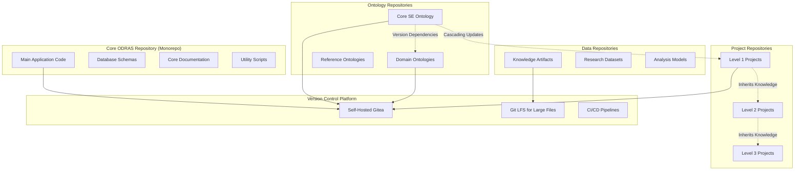
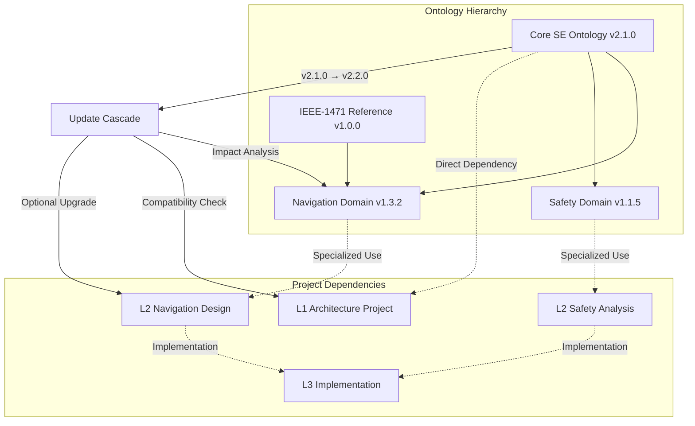
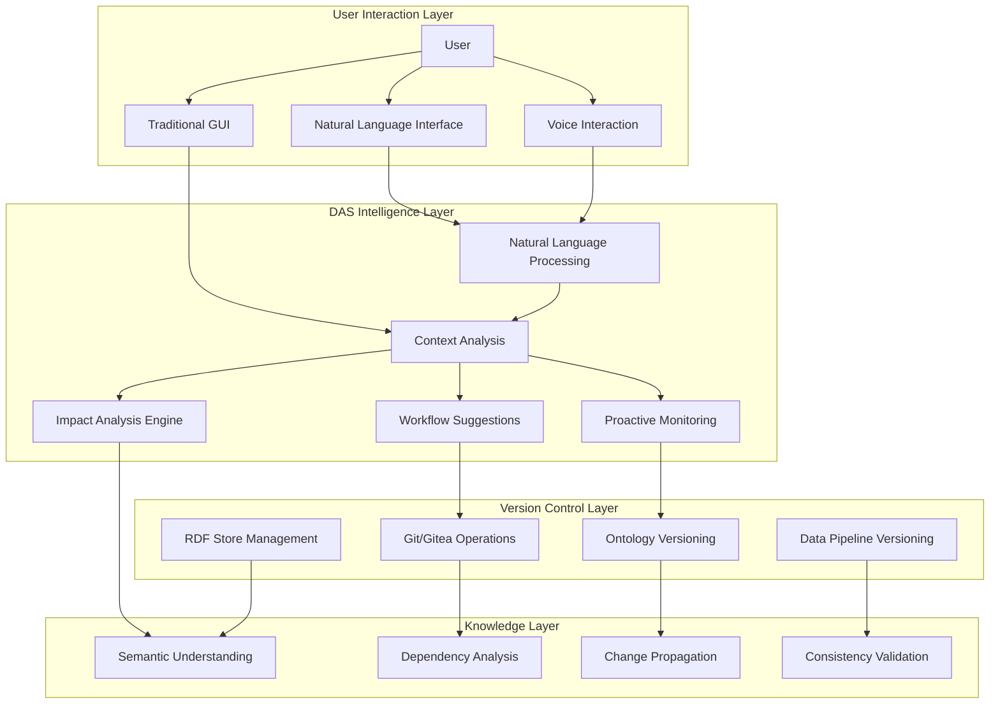
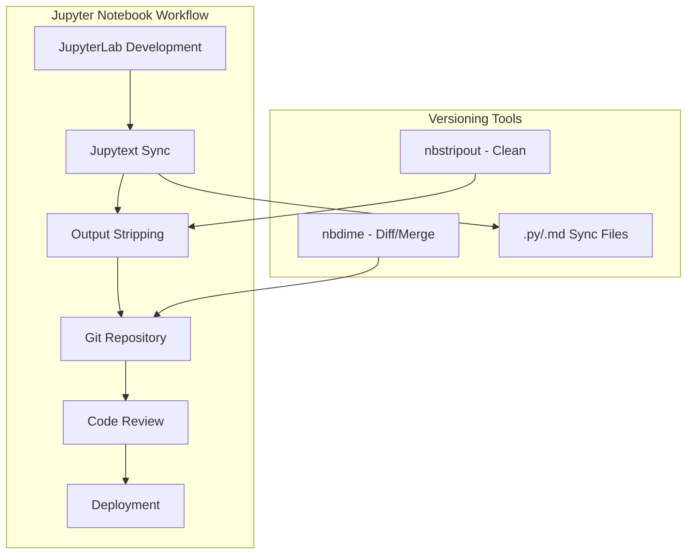
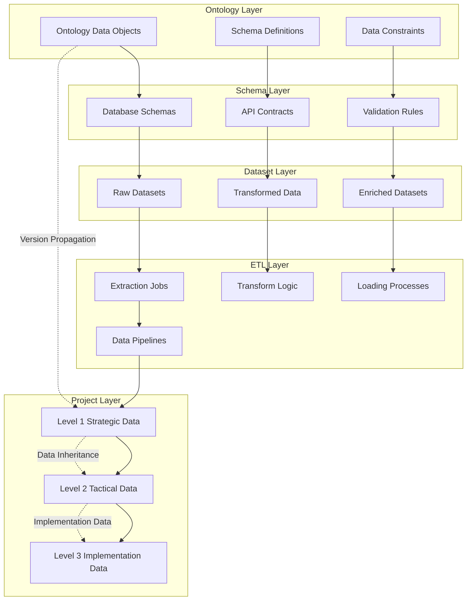
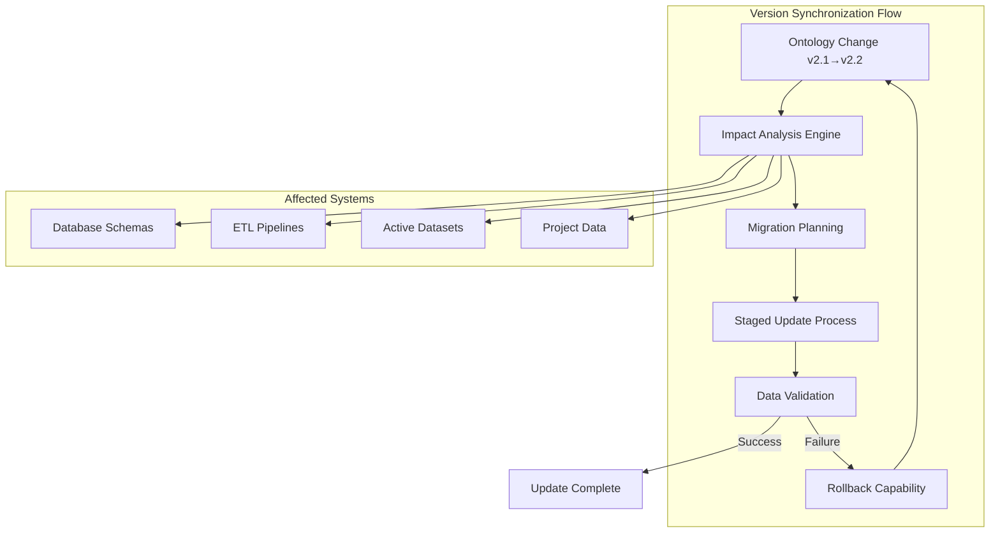

# Version Control Strategies for Ontology-Driven Knowledge Management Systems: A Comprehensive Analysis

**Authors:** J. DeHart, ODRAS Research Team
**Affiliation:** Ontology-Driven Requirements Analysis System (ODRAS) Project
**Date:** September 27, 2025
**Document Type:** Research Paper
**Keywords:** Version Control, Ontology Management, Knowledge Systems, Semantic Web, Requirements Engineering

---

## Abstract

This paper presents a comprehensive analysis of version control strategies for complex ontology-driven knowledge management systems. We examine the unique challenges of versioning across multiple interconnected components including ontologies, data artifacts, analytical pipelines, and knowledge bases. Through systematic evaluation of existing approaches and emerging technologies, we identify key requirements for version control in semantic knowledge systems and propose a taxonomy of versioning strategies. Our analysis focuses on the critical challenge of ontology version propagation across hierarchical project structures and presents comparative evaluation of three primary approaches: native RDF store versioning, external file-based versioning with synchronization, and hybrid approaches combining both paradigms. Additionally, we explore how intelligent assistant systems can significantly enhance version control usability through natural language interfaces, proactive monitoring, and context-aware guidance.

**Key Contributions:**
- Comprehensive taxonomy of versioning approaches for ontology-driven systems
- Analysis of version propagation challenges in hierarchical knowledge structures
- Comparative evaluation of RDF store vs. external file versioning strategies
- Framework for evaluating versioning solutions in complex semantic systems
- Novel analysis of intelligent assistant integration for enhanced version control usability

## 1. Introduction

Version control in ontology-driven knowledge management systems presents unique challenges that extend far beyond traditional software version control. While conventional version control systems like Git excel at managing source code evolution, they face significant limitations when applied to semantic knowledge systems that involve complex interdependencies between ontologies, data schemas, analytical workflows, and derived knowledge artifacts.

The emergence of large-scale ontology-driven systems for requirements analysis, systems engineering, and knowledge management has created a pressing need for sophisticated versioning strategies that can handle the propagation of changes across multiple interconnected knowledge components. This paper examines these challenges through the lens of the Ontology-Driven Requirements Analysis System (ODRAS), a complex semantic knowledge system that embodies many of the versioning challenges faced by modern knowledge management platforms.

### 1.1 Research Questions

This research addresses the following key questions:

1. **RQ1:** What are the fundamental versioning requirements for ontology-driven knowledge management systems?
2. **RQ2:** How do changes in top-level ontologies propagate through hierarchical project structures, and what mechanisms are needed to manage this propagation?
3. **RQ3:** What are the trade-offs between native RDF store versioning versus external file-based versioning approaches?
4. **RQ4:** How can version control strategies accommodate the diverse artifact types present in modern semantic knowledge systems?

### 1.2 Scope and Methodology

Our analysis focuses on versioning strategies for systems that exhibit the following characteristics:
- **Ontological Foundation**: Core knowledge represented as formal ontologies
- **Hierarchical Organization**: Multi-level project structures with inheritance relationships
- **Heterogeneous Artifacts**: Mix of structured data, unstructured documents, analytical code, and derived knowledge
- **Complex Dependencies**: Cascading dependencies between ontological definitions and operational datasets

## 2. Problem Analysis

### 2.1 System Architecture and Versioning Complexity

Contemporary ontology-driven knowledge management systems integrate multiple architectural components, each with distinct versioning requirements:

#### **Project Artifacts**
- **Python Applications**: Backend services, workers, API endpoints
- **Frontend Components**: React applications, UI components, styles
- **Configuration Files**: Docker compose, environment configurations
- **Scripts**: Database migrations, utility scripts, automation tools

#### **Data Structures**
- **PostgreSQL Schemas**: User management, project structures, knowledge assets
- **Neo4j Graph Data**: Knowledge relationships, conceptual models
- **Qdrant Vector Collections**: Embeddings, semantic search indices
- **Fuseki RDF Stores**: Ontology data, semantic triples
- **MinIO Object Storage**: Files, documents, binary artifacts

#### **Knowledge Artifacts**
- **Ontologies**: Core SE ontology, domain-specific ontologies, reference ontologies
- **Knowledge Bases**: Processed documents, extracted requirements, analysis results
- **BPMN Workflows**: Process definitions, analysis pipelines
- **Documentation**: Technical specifications, user guides, API documentation

#### **Project Hierarchy**
- **Level 1 Projects**: Strategic & Architecture projects
- **Level 2 Projects**: Tactical & Design projects
- **Level 3 Projects**: Implementation & Testing projects
- **Organizational Knowledge**: Global knowledge base, approved artifacts

### 1.2 Current Versioning Challenges

1. **Ontology Dependency Cascade**: Changes in top-level ontologies affect all downstream projects
2. **Multi-Database Coordination**: Changes span PostgreSQL, Neo4j, Qdrant, and Fuseki
3. **Binary Asset Management**: Large documents, models, and analysis results
4. **Cross-Project Synchronization**: Maintaining consistency across project hierarchy
5. **Knowledge Provenance**: Tracking origin and evolution of derived knowledge

## 2. Research-Based Best Practices

### 2.1 Version Control Pattern Analysis

**Monorepo vs. Polyrepo Assessment**:
- **Monorepo Advantages**: Unified versioning, atomic cross-component changes, simplified dependency management
- **Polyrepo Advantages**: Independent team ownership, granular access control, specialized tooling per component
- **ODRAS Recommendation**: Hybrid approach with core monorepo and specialized satellite repositories

**Semantic Versioning Applications**:
- **Software Components**: Standard SemVer (MAJOR.MINOR.PATCH)
- **Ontologies**: Extended SemVer with ontology-specific semantics
- **Knowledge Artifacts**: Date-based versioning with semantic annotations
- **Projects**: Hierarchical versioning reflecting project cascade levels

### 2.2 Enterprise Version Control Patterns

**Cascading Dependencies**:
- **Change Impact Analysis**: Automated dependency tree analysis
- **Staged Propagation**: Controlled rollout of breaking changes
- **Compatibility Matrices**: Version compatibility tracking across components
- **Rollback Strategies**: Safe reversion paths for failed updates

**Knowledge Management Versioning**:
- **Immutable Versions**: Published versions never change
- **Branching for Evolution**: Feature branches for experimental knowledge
- **Provenance Tracking**: Complete lineage from source documents to derived artifacts

## 3. Proposed ODRAS Versioning Architecture

### 3.1 Hybrid Versioning Strategy



### 3.2 Repository Structure Design

#### **Primary Monorepo**: `odras-core`
```
odras-core/
├── backend/              # Application services
├── frontend/             # UI components
├── database/
│   ├── migrations/       # Versioned schema changes
│   └── seeds/           # Reference data
├── docker/              # Container configurations
├── scripts/             # Utility and deployment scripts
├── docs/               # Core system documentation
└── tests/              # Comprehensive test suites
```

#### **Ontology Repositories**: Individual repos per major ontology
```
ontology-core-se/         # Core Systems Engineering Ontology
ontology-domain-*/        # Domain-specific ontologies
ontology-reference-*/     # Reference ontologies for import
```

#### **Project Repositories**: Organized by project hierarchy
```
project-l1-*/            # Level 1 strategic projects
project-l2-*/            # Level 2 tactical projects
project-l3-*/            # Level 3 implementation projects
```

#### **Knowledge Repositories**: Specialized for large datasets
```
knowledge-assets/         # Processed knowledge artifacts
research-datasets/        # Raw and processed datasets
analysis-models/          # Trained models and results
```

### 3.3 Version Identification Schemes

#### **Application Components** (Semantic Versioning)
- **Format**: `MAJOR.MINOR.PATCH[-PRERELEASE][+BUILD]`
- **Example**: `2.1.3-beta+build.20250927`
- **Breaking Changes**: Increment MAJOR
- **New Features**: Increment MINOR
- **Bug Fixes**: Increment PATCH

#### **Ontologies** (Extended Semantic Versioning)
- **Format**: `MAJOR.MINOR.PATCH.SEMANTIC`
- **Example**: `1.2.0.compatible`
- **MAJOR**: Incompatible structural changes
- **MINOR**: Backward-compatible additions
- **PATCH**: Corrections and clarifications
- **SEMANTIC**: `compatible|breaking|experimental`

#### **Projects** (Hierarchical Versioning)
- **Format**: `LEVEL.SEQUENCE.ITERATION`
- **Example**: `L1.003.v12` (Level 1, 3rd project, 12th iteration)
- **Reflects**: Project cascade level and development iteration

#### **Knowledge Artifacts** (Date-Based + Semantic)
- **Format**: `YYYY-MM-DD.SEQUENCE.TYPE`
- **Example**: `2025-09-27.001.extracted`
- **Date**: Processing/creation date
- **Sequence**: Daily sequence number
- **Type**: `raw|processed|analyzed|validated`

## 4. Ontology Version Propagation Strategy

### 4.1 Dependency Management Framework



### 4.2 Change Impact Assessment

#### **Compatibility Matrix Management**
```yaml
ontology_versions:
  core_se:
    version: "2.1.0"
    compatible_with:
      navigation_domain: ["1.3.x", "1.4.x"]
      safety_domain: ["1.1.x", "1.2.x"]
    breaking_changes_in: "3.0.0"

  navigation_domain:
    version: "1.3.2"
    depends_on:
      core_se: ">=2.0.0, <3.0.0"
      ieee_1471: "1.0.x"
    projects_using: ["L2-NAV-001", "L3-IMP-003"]
```

#### **Automated Impact Analysis**
- **Dependency Graph Generation**: Automated discovery of all dependent projects
- **Breaking Change Detection**: Semantic analysis of ontology modifications
- **Migration Path Planning**: Automated generation of upgrade procedures
- **Testing Strategy**: Validation requirements for dependent projects

### 4.3 Staged Update Process

1. **Impact Assessment Phase**
   - Generate dependency graph
   - Identify all affected projects
   - Classify changes (breaking/compatible/enhancement)
   - Estimate migration effort

2. **Stakeholder Notification Phase**
   - Notify project owners of pending changes
   - Provide migration guides and timelines
   - Collect feedback and concerns
   - Adjust rollout plan based on input

3. **Staged Rollout Phase**
   - **Alpha**: Internal testing with core team
   - **Beta**: Controlled rollout to selected Level 1 projects
   - **RC**: Release candidate for all affected projects
   - **GA**: General availability with migration support

4. **Validation Phase**
   - Automated compatibility testing
   - Project-specific validation requirements
   - Performance impact assessment
   - Rollback procedures if issues detected

## 5. Comparative Analysis of Version Control Approaches

### 5.1 Evaluation Framework

To systematically evaluate versioning approaches for ontology-driven knowledge management systems, we propose a multi-dimensional evaluation framework:

#### **Evaluation Criteria**

**Technical Complexity**
- Integration complexity with existing system architecture
- Maintenance overhead and operational requirements
- Scalability characteristics and performance implications
- Tool ecosystem maturity and community support

**Collaboration Effectiveness**
- Support for concurrent development workflows
- Change visibility and review mechanisms
- Conflict resolution capabilities
- Integration with existing development tools

**Semantic Integrity**
- Ontology consistency maintenance across versions
- Dependency relationship preservation
- Impact analysis and propagation capabilities
- Validation and reasoning support

**Operational Reliability**
- Backup and recovery mechanisms
- Rollback capabilities and error handling
- Audit trail completeness and compliance
- System availability and fault tolerance

### 5.2 Git/Gitea Distributed Approach Analysis

#### **Architecture Characteristics**

The distributed version control approach, exemplified by Git and self-hosted platforms like Gitea, represents the dominant paradigm in software development. Applied to ontology-driven systems, this approach treats all knowledge artifacts as files within a repository structure.

**Strengths:**
- **Mature Ecosystem**: Extensive tooling, established workflows, large community knowledge base
- **Distributed Collaboration**: Full repository history available locally, enabling offline work
- **Branching Model**: Sophisticated branching and merging capabilities support parallel development
- **Integration Capabilities**: Wide ecosystem of tools for continuous integration, code review, and project management

**Limitations:**
- **Binary Asset Handling**: Limited efficiency with large binary files without extensions like Git LFS
- **Semantic Understanding**: Lacks native understanding of ontological relationships and dependencies
- **Complex Merge Resolution**: Merging conflicting ontology changes requires domain expertise
- **Learning Curve**: Steep learning curve for users unfamiliar with distributed version control concepts

#### **Ontology-Specific Considerations**

When applied to ontology versioning, Git-based approaches face several domain-specific challenges:

- **Syntactic vs. Semantic Changes**: Git tracks syntactic changes in ontology files but lacks understanding of semantic equivalence
- **Dependency Resolution**: Limited native support for complex dependency relationships between ontologies
- **Change Impact Analysis**: Requires custom tooling to analyze the semantic impact of ontological changes
- **Format Dependencies**: Different ontology serialization formats (OWL/XML, Turtle, JSON-LD) may have different Git performance characteristics

## 6. Pros and Cons Analysis

### 6.1 Proposed Git/Gitea Approach

#### **Advantages**
- ✅ **Unified Platform**: Single system for all version control needs
- ✅ **Industry Standard**: Leverages well-established Git workflows
- ✅ **Self-Hosted Control**: Complete data sovereignty and customization
- ✅ **Scalable Architecture**: Supports growth from small teams to enterprise
- ✅ **Rich Ecosystem**: Extensive tooling and integration options
- ✅ **Audit Trail**: Complete history of all changes across all components
- ✅ **Branching Model**: Flexible workflows for different component types
- ✅ **Access Control**: Granular permissions and security features

#### **Disadvantages**
- ❌ **Learning Curve**: Team training required for Git workflows
- ❌ **Complexity**: Advanced features may overwhelm non-technical users
- ❌ **Maintenance Overhead**: Self-hosted infrastructure management required
- ❌ **Binary Asset Challenges**: Large files require special handling (Git LFS)
- ❌ **Ontology-Specific Tools**: May need custom tools for ontology diff/merge
- ❌ **Migration Effort**: Significant initial investment to migrate existing assets

### 6.2 Alternative Approaches Considered

#### **Integrated ODRAS Versioning**
**Pros**: Custom-tailored to ODRAS needs, seamless integration
**Cons**: High development cost, maintenance burden, limited ecosystem

#### **Enterprise Document Management**
**Pros**: Specialized for knowledge management, approval workflows
**Cons**: Limited code versioning, integration complexity, vendor lock-in

#### **Cloud-Based Solutions (GitHub/GitLab)**
**Pros**: Managed service, extensive features, community
**Cons**: Data sovereignty concerns, cost for private repositories, limited customization

## 7. Research Findings and Discussion

### 7.1 Version Control Requirements Analysis

Our analysis reveals that ontology-driven knowledge management systems exhibit distinct versioning requirements that differentiate them from traditional software systems:

#### **Multi-Modal Artifact Management**
Unlike software systems that primarily manage code artifacts, ontology-driven systems must handle diverse artifact types including formal ontologies, schema definitions, data instances, analytical code, and derived knowledge products. Each artifact type exhibits different change characteristics and dependency relationships.

#### **Semantic Change Propagation**
Changes in foundational ontologies have cascading effects throughout the system hierarchy. Unlike syntactic dependencies in software systems, these semantic dependencies require sophisticated analysis to determine compatibility and impact scope.

#### **Hierarchical Knowledge Inheritance**
The project cascade structure in systems like ODRAS creates complex inheritance relationships where lower-level projects inherit and extend knowledge from higher levels, creating bidirectional dependency flows that traditional version control systems are not designed to handle.

### 7.2 Comparative Analysis Results

#### **Native RDF Store Versioning**
Our analysis of RDF-native versioning approaches reveals both significant advantages and fundamental limitations:

**Advantages:**
- Direct semantic querying capabilities across versions
- Native understanding of ontological relationships
- Atomic operations ensuring consistency

**Limitations:**
- Limited tooling ecosystem for collaborative development
- Difficulty in visualizing and understanding changes
- Complexity in implementing backup and recovery procedures

#### **External File-Based Versioning**
Traditional file-based versioning with Git-like systems shows complementary characteristics:

**Advantages:**
- Mature collaboration workflows and tooling
- Clear change visualization and diff capabilities
- Established backup and recovery mechanisms

**Limitations:**
- Limited semantic understanding of changes
- Synchronization complexity with operational systems
- Potential consistency issues between authoritative sources

### 7.3 Intelligent Assistant Integration in Version Control

A significant opportunity exists to enhance version control user experience through integration with intelligent assistant systems. The Digital Assistant System (DAS) in ODRAS exemplifies how AI-powered assistance can address many of the usability challenges inherent in complex version control workflows.

#### **DAS-Enhanced Version Control Architecture**



#### **Intelligent Version Management Capabilities**

**Natural Language Version Operations**
DAS can translate natural language requests into complex version control operations:

```
User: "I need to update the navigation ontology to include autonomous vehicle concepts, but I'm worried about breaking existing projects."

DAS Response:
"I understand you want to extend the navigation ontology with autonomous vehicle concepts. Let me analyze the impact:

📊 Impact Analysis:
- 3 Level-2 projects currently import navigation ontology v1.3.2
- 7 Level-3 projects inherit from those Level-2 projects
- Estimated 15 datasets may require schema updates

🛠️ Recommended Approach:
1. Create feature branch: 'feature/autonomous-vehicles'
2. Implement changes with backward compatibility
3. Run automated validation against dependent projects
4. Stage rollout: Level-1 → Level-2 → Level-3

Would you like me to create the feature branch and set up the validation pipeline?"
```

**Proactive Change Monitoring**
DAS can continuously monitor version control activity and provide intelligent guidance:

```python
class DASVersionMonitor:
    """Intelligent monitoring of version control activities"""

    def __init__(self, version_control_client, knowledge_base):
        self.vc_client = version_control_client
        self.kb = knowledge_base
        self.context_analyzer = ContextAnalyzer()

    def analyze_commit_impact(self, commit_hash, user_context):
        """Analyze commit impact and provide intelligent guidance"""

        commit_info = self.vc_client.get_commit_details(commit_hash)

        # Semantic analysis of changes
        semantic_changes = self.analyze_semantic_impact(
            commit_info.changed_files,
            commit_info.diff_content
        )

        # Dependency impact analysis
        affected_projects = self.analyze_dependency_impact(
            semantic_changes, user_context
        )

        # Generate intelligent recommendations
        recommendations = self.generate_recommendations(
            semantic_changes, affected_projects, user_context
        )

        return {
            'impact_summary': semantic_changes,
            'affected_projects': affected_projects,
            'recommendations': recommendations,
            'suggested_actions': self.generate_action_plan(recommendations)
        }

    def proactive_assistance(self, user_activity, project_context):
        """Provide proactive assistance based on user activity patterns"""

        if self.detect_version_conflict_risk(user_activity):
            return self.suggest_conflict_prevention_measures()

        if self.detect_breaking_change_pattern(user_activity):
            return self.suggest_compatibility_preservation()

        if self.detect_knowledge_propagation_opportunity(user_activity):
            return self.suggest_knowledge_sharing_workflow()
```

#### **Context-Aware Version Guidance**

**Project Hierarchy Awareness**
DAS understands the ODRAS project hierarchy and can provide level-appropriate guidance:

```
Level-1 User Making Ontology Changes:
DAS: "As a Level-1 strategic project, your ontology changes will cascade to 12 Level-2 and 34 Level-3 projects. I recommend:
1. Schedule a stakeholder notification 48 hours before release
2. Prepare migration guides for affected project leads
3. Set up automated validation for downstream compatibility"

Level-3 User Requesting Ontology Extension:
DAS: "I see you need additional concepts for your implementation. Rather than modifying the core ontology directly, I suggest:
1. Create a project-specific extension ontology
2. Submit a formal request to Level-1 for core ontology enhancement
3. I can help draft the enhancement proposal with technical justification"
```

**Intelligent Conflict Resolution**
When version conflicts arise, DAS can provide semantic understanding and resolution guidance:

```
Merge Conflict Scenario:
DAS: "I've detected a merge conflict in the safety ontology. Analysis shows:

🔍 Conflict Details:
- Branch A: Added 'RiskAssessment' class with 'probability' property
- Branch B: Added 'HazardAnalysis' class with 'likelihood' property
- Semantic Analysis: These appear to represent similar concepts

💡 Resolution Suggestions:
1. Merge concepts: Create unified 'RiskAssessment' class with both properties
2. Maintain separation: Keep both classes with explicit relationship
3. Consult domain expert: Schedule review with safety ontology maintainer

I can create example implementations for each approach. Which would you prefer?"
```

#### **Automated Workflow Enhancement**

**Intelligent Version Planning**
DAS can analyze project timelines and suggest optimal versioning strategies:

```python
class DASVersionPlanner:
    """AI-powered version planning and scheduling"""

    def suggest_release_strategy(self, ontology_changes, project_timeline):
        """Suggest optimal release timing and strategy"""

        analysis = {
            'change_complexity': self.analyze_change_complexity(ontology_changes),
            'dependency_impact': self.calculate_dependency_impact(ontology_changes),
            'project_schedules': self.analyze_dependent_project_schedules(),
            'resource_availability': self.check_validation_resource_availability()
        }

        if analysis['change_complexity'] == 'breaking':
            return self.plan_major_version_release(analysis)
        elif analysis['dependency_impact'] > 0.5:
            return self.plan_coordinated_release(analysis)
        else:
            return self.plan_incremental_release(analysis)
```

**Quality Assurance Integration**
DAS can enhance version control with intelligent quality checks:

```
Pre-Commit Analysis:
DAS: "Analyzing your ontology changes...

✅ Syntax Validation: Passed
✅ Consistency Check: Passed
⚠️  Semantic Impact: Medium
❌ Documentation: Missing

Issues Found:
1. New class 'AutonomousAgent' lacks rdfs:comment
2. Property 'hasCapability' domain/range not specified
3. No examples provided for new concepts

Auto-Fix Available:
- Generate basic documentation from class structure
- Infer domain/range from usage patterns
- Create example instances from related concepts

Would you like me to apply auto-fixes before commit?"
```

#### **Knowledge Propagation Intelligence**

**Semantic Change Communication**
DAS can automatically generate human-readable change summaries for stakeholders:

```
Automated Change Notification:
Subject: Navigation Ontology v1.4.0 - Autonomous Vehicle Concepts Added

Dear Level-2 Project Leaders,

The navigation ontology has been updated with new concepts for autonomous vehicle modeling:

🆕 New Concepts Added:
- AutonomousVehicle (subclass of Vehicle)
- PathPlanningSystem (subclass of NavigationSystem)
- ObstacleDetection (new capability type)

🔧 Compatibility Impact:
- Backward Compatible: Existing queries will continue to work
- New Opportunities: Enhanced modeling for autonomous navigation projects
- Action Required: Optional - consider adopting new concepts in next iteration

📅 Timeline:
- Available Now: Development and testing
- Production Release: October 15, 2025
- Migration Support: Available through November 30, 2025

DAS Analysis:
Based on your current project scope, I recommend reviewing the PathPlanningSystem concepts for potential integration. I can schedule a consultation session to discuss specific applications.

Questions? Reply to this message or ask me directly: "DAS, explain navigation ontology updates"
```

## 10. Growth and Extensibility Strategy

### 10.1 ODRAS Platform Evolution

The versioning strategy must accommodate ODRAS's planned expansion into advanced analytical capabilities, including JupyterLab integration, machine learning workflows, and collaborative research environments.

#### **Planned Integrations**
- **JupyterLab**: Interactive data analysis and visualization notebooks
- **MLflow**: Machine learning experiment tracking and model versioning
- **Apache Airflow**: Workflow orchestration and data pipeline management
- **Collaborative Research Tools**: Shared workspaces for multi-institutional projects

### 10.2 Jupyter Notebook Versioning Strategy

Jupyter notebooks present unique versioning challenges due to their JSON-based format containing code, outputs, and metadata. The proposed strategy addresses these through specialized tooling:

#### **Core Approach: Hybrid Notebook Management**



#### **Implementation Components**

**1. Jupytext Integration**
```python
# jupytext configuration in ODRAS
# pyproject.toml
[tool.jupytext]
formats = "ipynb,py:percent"
notebook_metadata_filter = "-all"
cell_metadata_filter = "-all"
```

*Benefits*:
- **Human-readable diffs**: Python/Markdown format enables clear change tracking
- **Merge conflict resolution**: Text-based merging reduces notebook corruption
- **Code review friendly**: Reviewers can focus on code logic, not JSON noise

**2. nbdime for Advanced Notebook Operations**
```bash
# ODRAS Git configuration for notebooks
git config diff.ipynb.textconv 'nbdime diff-web --no-browser'
git config merge.ipynb.driver 'nbdime merge-web %O %A %B %L %P'
```

*Capabilities*:
- **Visual diff interface**: Cell-by-cell comparison with syntax highlighting
- **Smart merging**: Understands notebook structure for conflict resolution
- **Integration ready**: Works with existing Git/Gitea infrastructure

**3. Output Management Strategy**
```bash
# Pre-commit hook for output stripping
#!/bin/bash
# .git/hooks/pre-commit
nbstripout --keep-count --keep-output $(git diff --cached --name-only | grep '\.ipynb$')
```

*Policies*:
- **Strip outputs for commits**: Reduces repository size and diff noise
- **Preserve execution metadata**: Keep cell execution counts for workflow tracking
- **Selective output retention**: Important visualizations marked for preservation

#### **Notebook Repository Structure**

```
odras-analytics/
├── notebooks/
│   ├── exploratory/          # Experimental analysis notebooks
│   │   ├── raw/             # .ipynb files with outputs
│   │   └── cleaned/         # Jupytext .py versions
│   ├── production/          # Validated analysis workflows
│   │   ├── templates/       # Standardized notebook templates
│   │   └── validated/       # Peer-reviewed analytical workflows
│   └── archived/            # Historical analysis for reference
├── data/
│   ├── raw/                 # Input datasets (versioned separately)
│   ├── processed/           # Intermediate analysis results
│   └── outputs/             # Final analysis artifacts
└── environments/
    ├── requirements.txt     # Python dependencies
    ├── conda.yml           # Conda environment specification
    └── docker/             # Containerized analysis environments
```

### 10.3 Machine Learning Workflow Versioning

#### **MLflow Integration Strategy**
```python
# ODRAS MLflow tracking integration
class ODRASMLTracker:
    def __init__(self, git_client, project_context):
        self.mlflow_client = mlflow.tracking.MlflowClient()
        self.git_client = git_client
        self.project_context = project_context

    def log_experiment(self, experiment_name, model, metrics, artifacts):
        """Log ML experiment with ODRAS project context"""
        with mlflow.start_run():
            # Link to ODRAS project and ontology versions
            mlflow.set_tag("odras.project", self.project_context.project_id)
            mlflow.set_tag("odras.ontology_version", self.project_context.ontology_version)
            mlflow.set_tag("git.commit", self.git_client.current_commit())

            # Log model and metrics
            mlflow.sklearn.log_model(model, "model")
            mlflow.log_metrics(metrics)
            mlflow.log_artifacts(artifacts)
```

*Integration Benefits*:
- **Experiment reproducibility**: Complete versioning from data to models
- **ODRAS context linking**: Experiments tied to specific project/ontology versions
- **Model lineage tracking**: From requirements analysis to deployed models

### 10.4 Collaborative Research Environment

#### **Multi-Institutional Version Control**

```yaml
# ODRAS research collaboration configuration
collaborations:
  nasa_partnership:
    access_level: "restricted"
    repositories:
      - "odras-aerospace-ontologies"
      - "satellite-requirements-analysis"
    sync_strategy: "pull_request_review"

  university_research:
    access_level: "open"
    repositories:
      - "educational-examples"
      - "research-methodologies"
    sync_strategy: "direct_contribution"
```

*Features*:
- **Federated repositories**: External institution integration
- **Graduated access control**: Different permission levels by collaboration type
- **Research data sovereignty**: Institutional data remains under local control

#### **Advanced Analytics Pipeline Versioning**

```python
# Apache Airflow DAG versioning integration
class VersionedDAG:
    def __init__(self, dag_id, git_version, ontology_dependencies):
        self.dag_id = dag_id
        self.git_version = git_version
        self.ontology_deps = ontology_dependencies

    def validate_dependencies(self):
        """Ensure all ontology dependencies are available"""
        for ontology, version in self.ontology_deps.items():
            if not self.check_ontology_availability(ontology, version):
                raise DependencyError(f"Ontology {ontology}:{version} not available")

    def create_versioned_workflow(self):
        """Create workflow with complete version tracking"""
        return DAG(
            dag_id=f"{self.dag_id}_{self.git_version}",
            version=self.git_version,
            tags=["odras", "versioned", f"ontology:{','.join(self.ontology_deps.keys())}"]
        )
```

### 10.5 Growth Accommodation Framework

#### **Extensible Tool Integration Pattern**

```python
# ODRAS tool integration framework
class ODRASToolIntegration:
    """Framework for integrating new analytical tools with versioning"""

    def register_tool(self, tool_config):
        """Register new tool with versioning capabilities"""
        return {
            'name': tool_config.name,
            'version_strategy': self.determine_version_strategy(tool_config),
            'git_hooks': self.setup_git_integration(tool_config),
            'dependency_tracking': self.setup_dependency_tracking(tool_config)
        }

    def determine_version_strategy(self, tool_config):
        """Determine appropriate versioning approach"""
        strategies = {
            'notebook': 'jupytext_nbdime',
            'model': 'mlflow_git',
            'pipeline': 'airflow_git',
            'data': 'dvc_git',
            'documentation': 'standard_git'
        }
        return strategies.get(tool_config.type, 'standard_git')
```

#### **Anticipated Tool Integrations**

| Tool Category | Specific Tools | Versioning Strategy | Timeline |
|---------------|----------------|-------------------|----------|
| **Data Science** | JupyterLab, JupyterHub | Jupytext + nbdime | Q1 2026 |
| **ML/AI** | MLflow, TensorFlow, PyTorch | Model + experiment versioning | Q2 2026 |
| **Workflow** | Apache Airflow, Prefect | Pipeline versioning with Git | Q2 2026 |
| **Visualization** | Plotly Dash, Streamlit | App versioning with containers | Q3 2026 |
| **Big Data** | Apache Spark, Dask | Computation versioning | Q4 2026 |
| **Collaboration** | GitHub Codespaces, GitPod | Cloud development environments | Q1 2027 |

### 10.6 Data Lifecycle Versioning Strategy

**Critical Challenge**: ODRAS ontology data objects become real project-level datasets that undergo complex ETL (Extract, Transform, Load) operations. This creates a sophisticated versioning challenge spanning from ontological definitions to operational datasets.

#### **Data Versioning Complexity Matrix**



#### **Multi-Dimensional Data Versioning Framework**

**1. Ontology-Driven Schema Versioning**

```python
# ODRAS Data Object Version Management
class ODRASDataObjectVersioning:
    def __init__(self, ontology_manager, schema_registry):
        self.ontology_manager = ontology_manager
        self.schema_registry = schema_registry
        self.version_tracker = DataVersionTracker()

    def evolve_data_object(self, data_object_iri, changes, impact_analysis=True):
        """Handle evolution of ontology data objects to real schemas"""

        # 1. Version the ontology change
        ontology_version = self.ontology_manager.increment_version(
            data_object_iri, changes
        )

        # 2. Generate schema evolution
        schema_changes = self.generate_schema_evolution(
            data_object_iri, changes, ontology_version
        )

        # 3. Impact analysis across projects
        if impact_analysis:
            affected_datasets = self.analyze_dataset_impact(
                data_object_iri, schema_changes
            )
            migration_plan = self.create_migration_plan(affected_datasets)

        # 4. Version the schema changes
        schema_version = self.schema_registry.register_evolution(
            data_object_iri, schema_changes, ontology_version
        )

        return {
            'ontology_version': ontology_version,
            'schema_version': schema_version,
            'affected_datasets': affected_datasets,
            'migration_plan': migration_plan
        }
```

**2. ETL Pipeline Versioning**

```yaml
# ETL Pipeline Version Configuration
etl_pipelines:
  navigation_requirements_extraction:
    version: "2.1.3"
    ontology_dependencies:
      - "core_se:2.4.1"
      - "navigation_domain:1.3.2"
    data_sources:
      - name: "cdd_documents"
        version: "2025-09-27.001"
        schema_version: "nav_requirements:1.2.0"
    transformations:
      - name: "requirement_extraction"
        version: "1.4.2"
        git_commit: "abc123def"
      - name: "ontology_mapping"
        version: "2.1.0"
        git_commit: "def456ghi"
    outputs:
      - name: "structured_requirements"
        schema_version: "requirement_output:1.3.1"
        format: "jsonld"
```

**3. Data Lineage and Provenance Tracking**

```python
class DataLineageTracker:
    """Track complete data lineage from ontology to final datasets"""

    def track_data_transformation(self, source_data, transformation, output_data):
        """Record data transformation with complete provenance"""
        lineage_record = {
            'timestamp': datetime.utcnow(),
            'source': {
                'dataset_id': source_data.id,
                'version': source_data.version,
                'ontology_version': source_data.ontology_version,
                'schema_hash': source_data.schema_hash
            },
            'transformation': {
                'pipeline_id': transformation.id,
                'version': transformation.version,
                'git_commit': transformation.git_commit,
                'parameters': transformation.parameters
            },
            'output': {
                'dataset_id': output_data.id,
                'version': output_data.version,
                'schema_version': output_data.schema_version,
                'validation_status': output_data.validation_status
            },
            'provenance_chain': self.build_provenance_chain(source_data)
        }

        return self.store_lineage_record(lineage_record)
```

#### **Data Version Synchronization Strategy**

**Challenge**: Ontology changes must propagate through the entire data lifecycle while maintaining consistency and enabling rollback.

**Solution Framework**:



#### **Implementation Strategy for Data Versioning**

**1. Schema Registry Integration**

```python
class ODRASSchemaRegistry:
    """Central registry for data schemas derived from ontology"""

    def __init__(self, gitea_client, ontology_manager):
        self.gitea_client = gitea_client
        self.ontology_manager = ontology_manager
        self.schema_store = SchemaEvolutionStore()

    def register_data_object_schema(self, ontology_iri, data_object, version):
        """Register schema derived from ontology data object"""

        # Generate schema from ontology definition
        schema = self.generate_schema_from_ontology(ontology_iri, data_object)

        # Version and store schema
        schema_record = {
            'schema_id': f"{ontology_iri}#{data_object}",
            'version': version,
            'ontology_version': self.ontology_manager.get_version(ontology_iri),
            'schema_definition': schema,
            'compatibility': self.check_compatibility(schema),
            'git_commit': self.gitea_client.current_commit()
        }

        return self.schema_store.register(schema_record)

    def evolve_schema(self, schema_id, changes, breaking_change=False):
        """Handle schema evolution with proper versioning"""
        current_schema = self.schema_store.get_latest(schema_id)

        # Determine version increment strategy
        if breaking_change:
            new_version = self.increment_major_version(current_schema.version)
        else:
            new_version = self.increment_minor_version(current_schema.version)

        # Create migration script
        migration = self.generate_migration_script(
            current_schema, changes, new_version
        )

        return self.apply_schema_evolution(schema_id, new_version, migration)
```

**2. Data Validation Framework**

```python
class DataValidationVersioning:
    """Validate datasets against versioned ontology schemas"""

    def validate_dataset_against_ontology(self, dataset, ontology_version):
        """Comprehensive validation of dataset against ontology version"""

        validation_results = {
            'dataset_id': dataset.id,
            'dataset_version': dataset.version,
            'ontology_version': ontology_version,
            'validation_timestamp': datetime.utcnow(),
            'schema_compliance': self.check_schema_compliance(dataset, ontology_version),
            'constraint_validation': self.validate_constraints(dataset, ontology_version),
            'data_quality': self.assess_data_quality(dataset),
            'completeness': self.check_completeness(dataset, ontology_version)
        }

        # Store validation results for audit trail
        self.store_validation_results(validation_results)

        return validation_results
```

**3. ETL Pipeline Version Management**

```yaml
# Example: Versioned ETL Pipeline Configuration
pipelines:
  requirements_extraction_pipeline:
    pipeline_version: "3.1.2"
    source_dependencies:
      ontology_versions:
        - "core_se_ontology:2.4.1"
        - "requirements_ontology:1.7.3"
      data_sources:
        - "cdd_documents:2025-09-27.002.validated"
        - "stakeholder_inputs:2025-09-26.001.processed"

    transformation_stages:
      - stage: "document_parsing"
        version: "2.3.1"
        docker_image: "odras/parser:2.3.1"
        git_commit: "abc123"

      - stage: "requirement_extraction"
        version: "1.8.4"
        depends_on: ["document_parsing"]
        ontology_mapping: "requirements_ontology:1.7.3"

      - stage: "semantic_enrichment"
        version: "2.1.0"
        depends_on: ["requirement_extraction"]
        ontology_mapping: "core_se_ontology:2.4.1"

    output_schemas:
      - "extracted_requirements:2.1.0"
      - "semantic_annotations:1.4.2"

    quality_gates:
      - validation_against_ontology: "strict"
      - data_completeness_threshold: 0.95
      - semantic_consistency_check: "enabled"
```

#### **Data Repository Structure**

```
odras-data/
├── schemas/
│   ├── ontology-derived/        # Schemas generated from ontology
│   │   ├── core-se/
│   │   ├── navigation/
│   │   └── safety/
│   ├── migrations/             # Schema evolution scripts
│   └── validation/             # Validation rules and constraints
├── datasets/
│   ├── raw/                    # Unprocessed source data
│   │   ├── v2025-09-27.001/   # Date-based versioning
│   │   └── v2025-09-27.002/
│   ├── processed/              # ETL output datasets
│   │   ├── requirements/       # Versioned by semantic content
│   │   ├── stakeholder-inputs/
│   │   └── analysis-results/
│   └── validated/              # Quality-assured final datasets
├── pipelines/
│   ├── etl-definitions/        # Versioned pipeline configurations
│   ├── transformation-logic/   # Versioned transformation code
│   └── deployment/            # Pipeline deployment configurations
└── lineage/
    ├── provenance-records/     # Complete data lineage tracking
    ├── impact-analysis/        # Change impact assessments
    └── validation-reports/     # Data quality validation history
```

### 10.7 RDF Store Ontology Versioning Strategy

**Critical Architectural Question**: Should ontology versioning be handled directly within the RDF store (Fuseki), or should we maintain external OWL files and synchronize them with the RDF store?

#### **Three Approaches for ODRAS**

**Option 1: RDF Store Native Versioning**
- Store all versions as named graphs in Fuseki
- Use SPARQL for version queries and metadata
- Implement versioning metadata directly in RDF

**Option 2: External OWL Files + Sync**
- Maintain authoritative OWL files in Git repositories
- Synchronize versions with Fuseki on demand
- Use Git for collaboration and change tracking

**Option 3: Hybrid Approach (RECOMMENDED)**
- Git as authoritative source with enhanced RDF capabilities
- Automated synchronization with rich metadata
- Best of both collaboration and querying power

#### **Recommended Hybrid Implementation**

```python
class ODRASHybridOntologyVersioning:
    """Hybrid approach: Git authority + enhanced RDF capabilities"""

    def __init__(self, git_client, fuseki_client):
        self.git = git_client
        self.fuseki = fuseki_client

    def create_ontology_version(self, ontology_id, changes, metadata):
        # 1. Create version in Git (authoritative)
        git_version = self.git.create_version_commit(
            repo=f"ontology-{ontology_id}",
            changes=changes,
            metadata=metadata
        )

        # 2. Sync to Fuseki with enhanced metadata
        fuseki_graph = self.sync_to_fuseki_enhanced(
            ontology_id, git_version, metadata
        )

        # 3. Update dependency tracking
        self.update_dependency_graph(ontology_id, git_version)

        return {'git_version': git_version, 'fuseki_graph': fuseki_graph}
```

#### **Fuseki Named Graph Structure**

```sparql
# Example: Versioned ontology in Fuseki
GRAPH <http://odras.org/ontologies/core-se/v2.4.1> {
    <http://odras.org/ontologies/core-se> a owl:Ontology ;
        owl:versionIRI <http://odras.org/ontologies/core-se/v2.4.1> ;
        owl:versionInfo "2.4.1" ;
        odras:gitCommit "abc123def" ;
        odras:semanticVersion "2.4.1.compatible" ;
        dcterms:created "2025-09-27T10:30:00Z" .

    # Ontology content...
}
```

#### **Detailed Analysis of Options**

**Option 1: RDF Store Native Versioning**

*Advantages*:
- ✅ **SPARQL queries across versions**: Direct querying of version relationships
- ✅ **Atomic operations**: Version changes are transactional in Fuseki
- ✅ **No sync overhead**: Single source of truth in RDF store
- ✅ **Rich RDF metadata**: Native version and dependency relationships

*Disadvantages*:
- ❌ **Limited collaboration tools**: No Git workflows, branching, merging
- ❌ **Diff complexity**: Difficult to visualize ontology changes
- ❌ **Tool compatibility**: Most ontology editors expect OWL files
- ❌ **Backup complexity**: Must backup entire RDF store for each version

**Option 2: External OWL Files + Sync**

*Advantages*:
- ✅ **Standard workflows**: Git branching, pull requests, code review
- ✅ **Tool compatibility**: Works with Protégé, TopBraid, etc.
- ✅ **Clear diffs**: Git shows meaningful changes in OWL/Turtle
- ✅ **Collaboration**: Multiple developers can work simultaneously

*Disadvantages*:
- ❌ **Sync complexity**: Must keep Git and Fuseki synchronized
- ❌ **Consistency risk**: Sources may become out of sync
- ❌ **Query limitations**: Can't query across versions in SPARQL
- ❌ **Dual maintenance**: Version metadata in both places

**Option 3: Hybrid Approach - RECOMMENDED for ODRAS**

*Why Hybrid Works Best*:
- 🎯 **Git Authority**: OWL files in Git are the authoritative source
- 🎯 **Enhanced RDF**: Fuseki contains enriched version metadata
- 🎯 **Automated Sync**: Smart synchronization prevents inconsistency
- 🎯 **Best Tools**: Use Git tools for editing, SPARQL for queries

#### **ODRAS-Specific Implementation Strategy**

```yaml
# ODRAS Ontology Repository Structure
ontology-repositories:
  core-se-ontology:
    git_repo: "https://gitea.odras.org/ontologies/core-se"
    fuseki_graph_base: "http://odras.org/ontologies/core-se/"
    versioning_strategy: "semantic"
    auto_sync: true

  navigation-ontology:
    git_repo: "https://gitea.odras.org/ontologies/navigation"
    fuseki_graph_base: "http://odras.org/ontologies/navigation/"
    depends_on: ["core-se-ontology"]
    versioning_strategy: "semantic"
    auto_sync: true

sync_policies:
  trigger_events: ["git_push", "tag_created", "pull_request_merged"]
  validation_required: true
  dependency_check: true
  rollback_on_failure: true
```

**Implementation Benefits**:
- ✅ **Developer-friendly**: Standard Git workflows for ontology development
- ✅ **Query-powerful**: Rich SPARQL queries across all versions
- ✅ **Automated consistency**: Sync engine prevents drift
- ✅ **Scalable**: Works from single ontologies to complex dependencies

### 10.8 Future-Proofing Strategies

#### **Version Control Evolution Path**

1. **Phase 1 (Current)**: Git/Gitea foundation with core ODRAS components
2. **Phase 2 (Q1-Q2 2026)**: Jupyter and analytical tool integration + Data lifecycle versioning
3. **Phase 3 (Q3-Q4 2026)**: Machine learning and pipeline versioning + Advanced data lineage
4. **Phase 4 (2027+)**: Advanced research collaboration and federated versioning + Real-time data versioning

#### **Technology Readiness Assessment**

- **Git/Gitea Foundation**: ✅ **Production Ready** - Mature, proven technology
- **Jupyter Versioning**: ✅ **Production Ready** - Established tools (Jupytext, nbdime)
- **MLflow Integration**: ✅ **Production Ready** - Stable API and Git integration
- **Data Schema Versioning**: ✅ **Production Ready** - Confluent Schema Registry, Apache Avro patterns
- **ETL Pipeline Versioning**: ⚠️ **Emerging** - Growing best practices, needs evaluation
- **Data Lineage Tracking**: ⚠️ **Emerging** - Tools like Apache Atlas, DataHub available
- **Airflow Versioning**: ⚠️ **Emerging** - Growing best practices, needs evaluation
- **Federated Research**: 🔄 **Experimental** - Cutting-edge, requires R&D investment

## 11. Conclusions and Future Work

### 11.1 Research Contributions

This paper presents a comprehensive analysis of version control challenges and strategies for ontology-driven knowledge management systems. Our key contributions include:

1. **Systematic Framework**: We propose a multi-dimensional evaluation framework for assessing versioning approaches in semantic knowledge systems, addressing technical complexity, collaboration effectiveness, semantic integrity, and operational reliability.

2. **Taxonomy of Approaches**: We identify and analyze three primary versioning paradigms: native RDF store versioning, external file-based versioning, and hybrid approaches, each with distinct advantages and limitations.

3. **Propagation Challenge Analysis**: We provide detailed analysis of the ontology version propagation problem in hierarchical knowledge systems, identifying key technical and organizational challenges.

4. **Hybrid Architecture**: We demonstrate that hybrid approaches combining file-based authority with RDF-enhanced capabilities offer the most promising solution for complex ontology-driven systems.

5. **Intelligent Assistant Integration**: We explore how AI-powered digital assistants can significantly enhance version control usability through natural language interfaces, proactive monitoring, context-aware guidance, and automated workflow assistance.

### 11.2 Implications for Practice

Our findings have several implications for practitioners developing ontology-driven knowledge management systems:

- **Architectural Decisions**: System architects should carefully consider the trade-offs between native RDF versioning and external file approaches, with hybrid solutions often providing optimal characteristics.
- **Tool Selection**: Organizations should prioritize version control solutions that provide both collaborative development capabilities and semantic querying features.
- **Change Management**: The complexity of semantic change propagation requires sophisticated impact analysis tools and well-defined governance processes.
- **User Experience Design**: The integration of intelligent assistants like DAS can dramatically improve version control adoption by reducing complexity and providing context-aware guidance.
- **Natural Language Interfaces**: Implementing conversational interfaces for version control operations can make complex semantic versioning accessible to domain experts without deep technical knowledge.
- **Proactive Intelligence**: Systems should implement proactive monitoring and assistance capabilities rather than purely reactive version control tools.

### 11.3 Limitations and Future Research

This research has several limitations that point to opportunities for future work:

#### **Empirical Validation**
Our analysis is primarily theoretical and would benefit from empirical evaluation with real-world ontology-driven systems. Future research should include:
- Performance benchmarking of different versioning approaches
- User study evaluation of collaboration effectiveness
- Longitudinal analysis of version control adoption in semantic systems

#### **Tool Development**
Current tooling for ontology version control remains limited. Research opportunities include:
- Semantic-aware diff and merge algorithms for ontologies
- Automated impact analysis tools for ontological changes
- Integration frameworks for hybrid versioning architectures
- Natural language processing systems for version control command interpretation
- AI-powered conflict resolution systems for semantic merge conflicts

#### **Intelligent Assistant Research**
The integration of AI assistants in version control presents numerous research opportunities:
- Effectiveness studies of natural language interfaces for complex version control operations
- Machine learning approaches for predictive conflict detection and prevention
- Context-aware recommendation systems for versioning workflows
- Automated quality assurance and documentation generation for ontological changes
- Multi-modal interaction studies (voice, text, visual) for version control interfaces

#### **Scalability Analysis**
As ontology-driven systems grow in scale and complexity, version control requirements may evolve. Future research should examine:
- Version control performance at enterprise scale
- Distributed versioning approaches for multi-institutional collaborations
- Integration with emerging semantic web technologies
- Scalability of intelligent assistant systems in large collaborative environments

### 11.4 Related Work and Positioning

While version control for software systems is well-established, versioning in semantic knowledge systems remains an active area of research. This work builds upon:

- **Ontology Evolution**: Research on ontology evolution and change management (Stojanovic et al., 2004; Noy & Klein, 2004)
- **Semantic Versioning**: Approaches to versioning in semantic web contexts (Kiryakov et al., 2004; Klein & Noy, 2003)
- **Knowledge Management Systems**: Version control in collaborative knowledge development (Farquhar et al., 1997; Domingue et al., 1999)
- **Intelligent User Interfaces**: Research on conversational interfaces for complex systems (Candello et al., 2017; McTear et al., 2016)
- **AI-Assisted Software Engineering**: Studies on AI assistance in software development workflows (Barke et al., 2023; Chen et al., 2021)
- **Context-Aware Computing**: Adaptive systems that respond to user context and activity (Dey, 2001; Baldauf et al., 2007)

Our contribution extends this prior work by providing a comprehensive analysis framework and systematic comparison of versioning approaches specifically for ontology-driven knowledge management systems, with novel exploration of intelligent assistant integration to address usability challenges in semantic version control.

---

**Keywords**: Version Control, Ontology Management, Knowledge Systems, Semantic Web, Requirements Engineering, Intelligent Assistants, Digital Assistant Systems, Natural Language Interfaces
**Correspondence**: ODRAS Research Team, Ontology-Driven Requirements Analysis System Project
**Funding**: This research was conducted as part of the ODRAS project development effort
