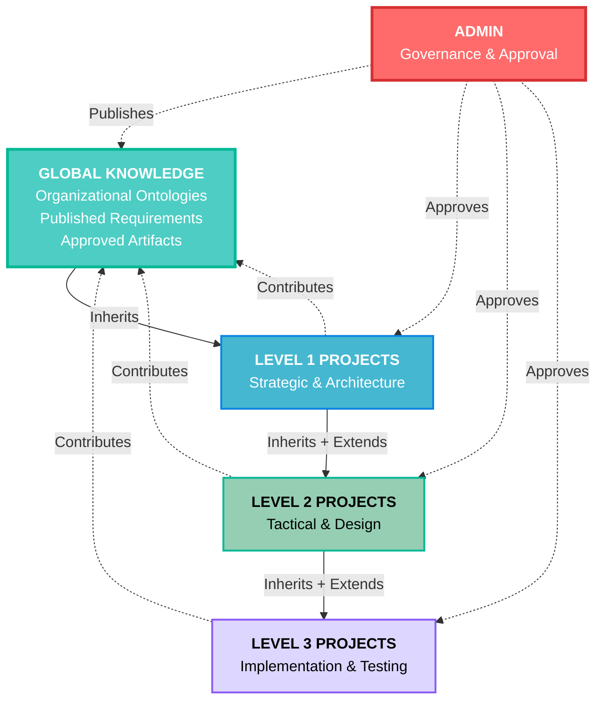
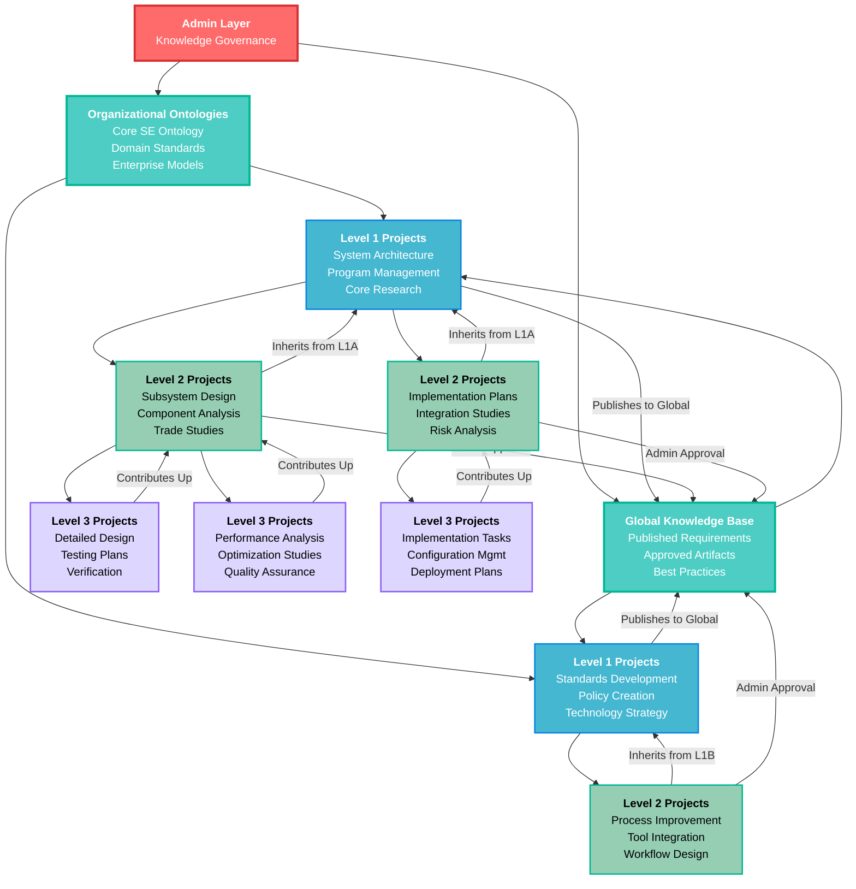

# ODRAS Management Presentation Summary

*Generated from PowerPoint slide development session*

## Overview

This document summarizes the complete management presentation content developed for ODRAS (Ontology-Driven Research & Analysis System), including slide content, enterprise vision, and the Project Cascade concept.

---

## PowerPoint Slide Content

### Slide 1: Introduction

# ODRAS
## Ontology-Driven Research & Analysis System

**What is ODRAS?**
• A platform for organizing and analyzing domain knowledge
• Enables teams to build structured knowledge bases for their projects
• Connects data, documents, and domain expertise in one place

**Key Value**
• Accelerates research and analysis workflows
• Ensures consistent understanding across teams
• Provides controlled access to organizational knowledge

**For Management:**
Making complex knowledge manageable and actionable

---

### Slide 2: ODRAS Core Features Overview

# Comprehensive Knowledge Management Platform

**ODRAS provides integrated workbenches for the complete research & analysis lifecycle:**

• **Projects & Access Control** - Project-centric organization with published ontologies, data properties, and knowledge sharing

• **Ontology Workbench** - Create and manage domain models with validation, reasoning, and direct Cameo integration

• **Data Workbench** - Auto-generate data connectors for any project data property, includes synthetic data testing

• **File & Document Manager** - Project-level document management with admin publishing controls

• **Knowledge Manager** - Extract and embed knowledge from approved documents for AI-powered insights

• **Requirements Management** - Extract requirements from documents, compare across projects, export to ReqIF/DoorsNG

• **Conceptualizer** - AI-powered system conceptualization from requirements with direct Cameo export

• **Context Manager** - Manage AI prompts, personas, and team configurations for consistent outputs

• **Process Management** - All workflows managed as BPMN processes for visibility and control

• **Thread Workbench** - Maintain formal project review and collaboration threads

• **LLM Playground** - Test and validate AI knowledge pipelines and generate example artifacts

• **Artifact Management** - Centralized access to objects, documents, and project-related artifacts

---

### Slide 3: Project Management & Access Control

# Projects, Users & Admin Controls

**Project-Centric Organization**
• Each project operates as a secure sandbox environment
• Teams work with dedicated ontologies, data, and knowledge bases
• Clear separation between development and production resources

**Publishing & Sharing Model**
• Admin approves and releases ontologies for organization-wide use
• Published data properties available across approved projects
• Knowledge sharing controlled through admin publishing workflow

**Business Value**
• Prevents project interference while enabling knowledge reuse
• Ensures quality control through admin approval process
• Scales from individual projects to enterprise-wide knowledge sharing

---

### Slide 4: Ontology Workbench

# Domain Knowledge Modeling

**Create & Manage Domain Models**
• Visual ontology creation and editing interface
• Import and extend approved organizational ontologies
• Real-time validation and reasoning capabilities

**Integration & Synchronization**
• Synced with RDF database for live querying
• Direct integration with Cameo Systems Modeler via TWC API
• Version control and change management

**Business Value**
• Standardizes domain understanding across teams
• Reduces modeling time through reusable components
• Ensures consistency between analysis and system design tools

---

### Slide 5: Data Workbench

# Automated Data Integration

**Smart Data Connectivity**
• Automatically creates data connectors for any ontology data property
• Cascades through imported ontologies from approved sources
• Eliminates manual data mapping and connection setup

**Testing & Validation**
• Built-in synthetic data test bench
• Validate data flows before connecting to live sources
• Ensures data quality and connector reliability

**Business Value**
• Drastically reduces data integration time and effort
• Minimizes data connection errors and downtime
• Enables rapid prototyping with synthetic data

---

### Slide 6: File Manager

# Document & Asset Control

**Project-Level Document Management**
• Organized storage for all project-related documents
• Version control and access permissions
• Integration with knowledge extraction workflows

**Publishing Controls**
• Admin approval process for making documents public
• Global knowledge sharing from approved projects
• Maintains security while enabling collaboration

**Business Value**
• Centralizes project documentation and assets
• Controlled knowledge sharing prevents information silos
• Reduces duplicate work across similar projects

---

### Slide 7: Knowledge Manager

# AI-Powered Knowledge Extraction

**Intelligent Document Processing**
• Extracts and chunks knowledge from approved documents
• Creates searchable, embedded knowledge base
• Maintains source traceability for all extracted information

**Knowledge Discovery**
• AI-powered insights from document collections
• Cross-reference information across multiple sources
• Identifies knowledge gaps and redundancies

**Business Value**
• Transforms static documents into actionable intelligence
• Accelerates research and reduces manual document review
• Enables AI-assisted decision making based on organizational knowledge

---

### Slide 8: Requirements Management

# Systematic Requirements Handling

**Automated Requirements Extraction**
• Extracts requirements from project documents
• Stores as structured individuals in RDF database
• Links to core Systems Engineering ontology

**Cross-Project Analysis**
• Compare requirements across different projects
• Identify reusable requirements and patterns
• Leverage approved organizational requirements

**Export & Integration**
• Export to ReqIF or IBM DoorsNG formats
• Direct integration with Cameo Systems Modeler
• Maintains traceability throughout system lifecycle

**Business Value**
• Reduces manual requirements management effort
• Improves requirements quality through standardization
• Enables requirements reuse across projects

---

### Slide 9: Conceptualizer

# AI-Assisted System Design

**Intelligent System Conceptualization**
• Uses AI teams to generate conceptual systems from requirements
• Creates base Systems Engineering individuals and estimates
• Generates classes and data properties using LLM reasoning

**Direct Design Integration**
• Seamless export to Cameo Systems Modeler via TWC API
• Maintains consistency between conceptual and detailed design
• Accelerates early system architecture development

**Business Value**
• Dramatically reduces time from requirements to initial system concept
• Ensures systematic approach to early design phases
• Leverages AI to explore design alternatives quickly

---

### Slide 10: Context Manager

# AI Configuration & Control

**Prompt & Persona Management**
• Create and test AI prompts for consistent outputs
• Manage different AI personas for various analysis tasks
• Configure AI team compositions for complex workflows

**Quality Assurance**
• Test and validate AI responses before deployment
• Ensure consistent AI behavior across project teams
• Maintain AI configuration version control

**Business Value**
• Ensures reliable and consistent AI-assisted analysis
• Reduces AI output variability across teams
• Enables fine-tuning of AI capabilities for specific domains

---

### Slide 11: Process Management

# Workflow Orchestration & Visibility

**BPMN Process Management**
• All major workflows managed as BPMN processes
• Visual process monitoring and control
• Includes RAG, Extraction, Conceptualizer, and other key workflows

**Process Transparency**
• Real-time visibility into workflow status
• Process performance metrics and optimization
• Audit trail for all automated processes

**Business Value**
• Provides management visibility into automated workflows
• Enables process optimization and bottleneck identification
• Ensures compliance and auditability of AI-assisted processes

---

### Slide 12: Thread Workbench

# Formal Review & Collaboration

**Structured Project Communication**
• Maintains formal project threads for all major interactions
• Organized review and approval workflows
• Traceable decision-making process

**Collaboration Management**
• Structured format for team interactions
• Integration with project artifacts and deliverables
• Historical record of project evolution

**Business Value**
• Ensures formal documentation of key project decisions
• Improves team coordination and communication
• Provides audit trail for project management and compliance

---

### Slide 13: LLM Playground

# AI Testing & Experimentation

**Knowledge Pipeline Testing**
• Interactive environment for testing RAG knowledge systems
• Validate AI responses against project knowledge base
• Generate example artifacts for evaluation

**Experimentation Platform**
• Safe environment for testing new AI configurations
• Compare different AI approaches and models
• Prototype new AI-assisted workflows

**Business Value**
• Reduces risk of deploying untested AI configurations
• Enables innovation in AI-assisted analysis methods
• Provides confidence in AI system reliability

---

### Slide 14: Artifact Management

# Comprehensive Asset Organization

**Unified Artifact Access**
• Centralized management of objects, documents, and project artifacts
• Cross-project artifact discovery and reuse
• Integration with all other ODRAS workbenches

**Knowledge Integration**
• Add existing artifacts to projects as knowledge sources
• Maintain relationships between artifacts and project elements
• Enable artifact-based analysis and insights

**Business Value**
• Eliminates artifact silos across projects
• Maximizes return on investment in existing documentation
• Accelerates project startup through artifact reuse

---

### Slide 15: ODRAS Summary

# Transforming Knowledge into Competitive Advantage

**What ODRAS Delivers**
• **Integrated Platform** - 12 specialized workbenches working together seamlessly
• **AI-Powered Automation** - Reduces manual effort in research, analysis, and system design
• **Knowledge Reuse** - Transforms organizational knowledge into reusable, actionable assets
• **Quality Control** - Admin oversight ensures standards while enabling innovation

**Key Business Outcomes**
• **Faster Time-to-Insight** - Automated knowledge extraction and AI-assisted analysis
• **Reduced Risk** - Systematic requirements management and validated design processes  
• **Improved Consistency** - Standardized ontologies and controlled knowledge sharing
• **Enhanced Collaboration** - Structured workflows with full traceability and audit trails

**Strategic Value**
• **Scalable Knowledge Management** - Grows from individual projects to enterprise-wide capability
• **Integration Ready** - Direct connections to Cameo, DoorsNG, and other enterprise tools
• **Future-Proof Architecture** - AI-powered workflows that adapt and improve over time

**Bottom Line**
ODRAS transforms complex research and analysis from manual, time-intensive work into systematic, AI-assisted processes that deliver faster, higher-quality results.

---

### Slide 16: Enterprise Vision & Future Capabilities

# ODRAS Enterprise Roadmap
## The Decision Operating System

**🎯 Core Mission: Systematic Decision Excellence**
• Evaluate comprehensive decision option spaces before implementation
• Monitor real-world decision performance and impact
• Create organizational learning loops from decision outcomes
• Build institutional decision-making intelligence over time

**🔍 Decision Option Space Management**
• **Decision Option Space Workbench** - Generate and evaluate all viable alternatives
• **Trade Study Capabilities** - Systematic comparison of options with multiple criteria
• **Stakeholder Impact Analysis** - Understand decision consequences across all affected parties
• **Risk/Uncertainty Modeling** - Quantify decision risks and confidence intervals

**📈 Decision Performance & Feedback**
• **Decision Field Feedback Workbench** - Monitor real-world decision outcomes
• **Performance Analytics** - Track decision success metrics over time
• **Learning Integration** - Feed performance data back into future decision models
• **Decision Quality Improvement** - Continuously enhance decision-making processes

**🏗️ Supporting Infrastructure**
• Enterprise ontology management for consistent decision frameworks
• Comprehensive data integration for evidence-based decisions
• Process-centric workflows ensuring decision governance
• AI-powered analysis and simulation capabilities
• Integration with SysMLv2 and enterprise modeling tools

**🚀 Strategic Impact**
• Transform from ad-hoc decisions to systematic decision excellence
• Create organizational competitive advantage through superior decision-making
• Build institutional memory of what works and what doesn't
• Enable evidence-based culture transformation

**The Vision:** Every significant organizational decision informed by comprehensive option analysis and improved by performance feedback.

---

## Project Cascade Concept

### Core Concept Definition

**Project Cascade: Pyramid Knowledge Development**

A structured, hierarchical approach to organizational knowledge development where projects inherit approved knowledge, ontologies, and artifacts from higher-level projects, while contributing their discoveries back to the organization through controlled publishing workflows.

### Project Cascade Flow Diagram

### Detailed Project Cascade Architecture

### How the Project Cascade Works

**🔴 Admin Layer (Top)**
- **Knowledge Governance:** Controls what gets published globally
- **Organizational Ontologies:** Maintains core SE ontology, domain standards, enterprise models
- **Global Knowledge Base:** Curates published requirements, approved artifacts, best practices

**🔵 Level 1 Projects (Strategic)**
- **Inherit:** Core organizational ontologies and global knowledge base
- **Focus:** System architecture, program management, standards development, technology strategy
- **Contribute:** High-level requirements, architectural decisions, strategic direction
- **Publish:** Admin-approved contributions to global knowledge base

**🟢 Level 2 Projects (Tactical)**
- **Inherit:** All Level 1 project knowledge + organizational assets
- **Focus:** Subsystem design, implementation planning, process improvement
- **Contribute:** Detailed designs, trade studies, implementation strategies
- **Publish:** Selected contributions (with admin approval) to global knowledge base

**🟣 Level 3 Projects (Operational)**
- **Inherit:** Knowledge from parent projects + organizational assets
- **Focus:** Detailed implementation, testing, verification, optimization
- **Contribute:** Implementation details, lessons learned, performance data
- **Publish:** Best practices and lessons learned bubble up through hierarchy

### Key Benefits of the Cascade Model

1. **Knowledge Reuse:** Prevents reinventing the wheel across projects
2. **Consistency:** Ensures alignment with organizational standards
3. **Quality Control:** Admin approval prevents knowledge pollution
4. **Scalability:** New projects benefit from all prior work
5. **Learning Organization:** Systematic capture and sharing of lessons learned
6. **Incremental Growth:** Each project adds value to organizational knowledge base

### Decision Support Integration

- Each level can access decision histories from parent projects
- Decision performance feedback flows both up and down the hierarchy
- Option spaces expand based on proven solutions from related projects

---

## Key Insights from Development Session

### ODRAS as a Decision Operating System

The core realization during our discussion was that ODRAS is fundamentally a **Decision Operating System** - designed to:

1. **Evaluate Decision Option Spaces** - Systematically explore all viable alternatives before implementation
2. **Monitor Decision Performance** - Track real-world outcomes of implemented decisions
3. **Create Learning Loops** - Feed performance data back into future decision models
4. **Build Decision Intelligence** - Accumulate organizational wisdom about what works

### Management Communication Strategy

The presentation takes a **business-value-first approach**:
- Avoids technical jargon (RDF, SPARQL, etc.)
- Focuses on outcomes and competitive advantage
- Emphasizes integration with existing enterprise tools
- Positions ODRAS as a strategic capability, not just a project tool

### Cascade Model Innovation

The Project Cascade represents a breakthrough in organizational knowledge management:
- **Pyramid Structure:** Knowledge flows both up and down the hierarchy
- **Controlled Growth:** Admin approval ensures quality while enabling innovation
- **Systematic Reuse:** Small projects inherit vast organizational knowledge
- **Multiplicative Effect:** Each project contribution enhances the entire organization

---

## Next Steps

1. **Presentation Preparation:** Use this content to create actual PowerPoint slides
2. **Technical Documentation:** Create architecture diagrams and technical specifications
3. **Implementation Planning:** Develop detailed project plans for the cascade model
4. **Stakeholder Alignment:** Share the decision operating system vision with key stakeholders

---

*Document created: [Current Date]*
*Source: ODRAS Management Presentation Development Session*
