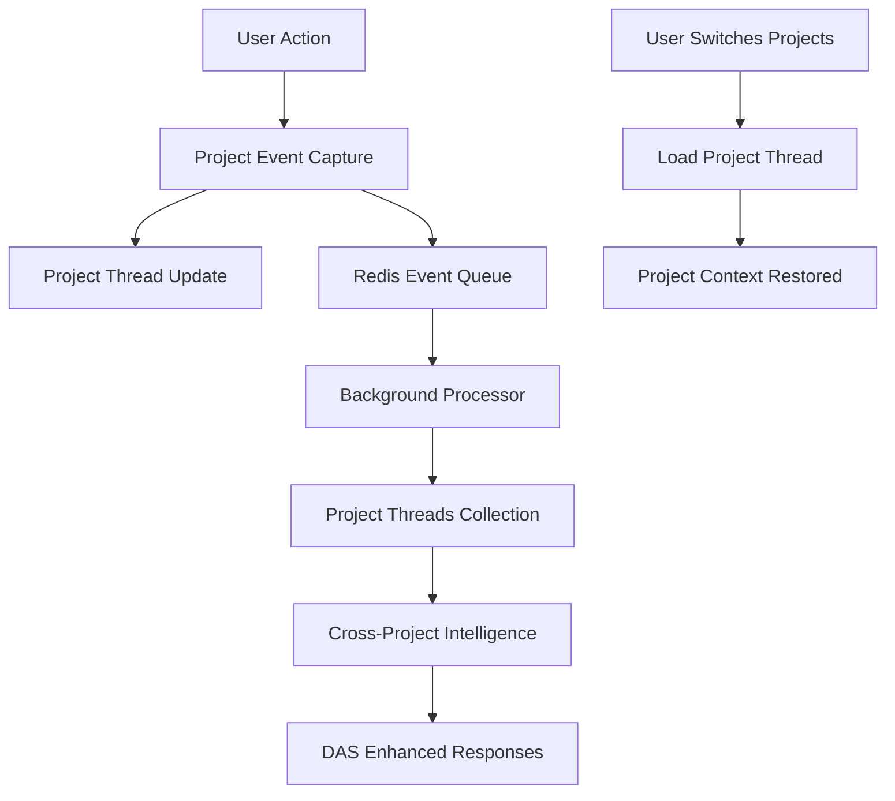

# Project Thread Intelligence Architecture

## 🎯 **Vision**

Create a comprehensive project-based DAS system where:
- **One DAS thread per project** (persistent across user sessions)
- **Project events captured** (not session-based)
- **Cross-project learning** (with security controls)
- **Project context awareness** (full project history)

## 🏗️ **Architecture Overview**



## 📊 **Data Architecture**

### **1. Project Threads (Redis)**
```json
{
  "project_thread_id": "uuid",
  "project_id": "uuid", 
  "created_by": "user_id",
  "created_at": "timestamp",
  "last_activity": "timestamp",
  "context": {
    "conversation_history": [],
    "project_events": [],
    "active_workflows": [],
    "key_decisions": [],
    "project_insights": []
  }
}
```

### **2. Project Events (Redis Queue)**
```json
{
  "event_id": "uuid",
  "project_id": "uuid",
  "project_thread_id": "uuid", 
  "user_id": "user_id",
  "timestamp": "timestamp",
  "event_type": "ontology_created|document_uploaded|analysis_run|das_interaction",
  "event_data": {},
  "context_snapshot": {},
  "semantic_summary": "LLM-generated summary"
}
```

### **3. Project Threads Collection (Qdrant)**
```json
{
  "collection_name": "project_threads",
  "vector_size": 384,
  "payload": {
    "project_thread_id": "uuid",
    "project_id": "uuid", 
    "project_name": "string",
    "project_domain": "string",
    "created_by": "user_id",
    "team_members": ["user_ids"],
    "activity_summary": "LLM summary",
    "key_patterns": ["pattern1", "pattern2"],
    "success_indicators": {},
    "learning_insights": "cross-project learnings",
    "privacy_level": "private|team|public"
  }
}
```

## 🔧 **Core Components**

### **1. ProjectThreadManager**
- Manages project threads (not session-based)
- Handles project switching
- Maintains project context
- Coordinates with DAS Core Engine

### **2. ProjectEventCapture**
- Captures ALL project activities
- Enhanced semantic event processing
- Project-scoped event queuing
- Integration with existing middleware

### **3. ProjectIntelligenceService**
- Cross-project pattern recognition
- Project similarity analysis
- Success pattern identification
- Privacy-aware knowledge sharing

### **4. Enhanced DAS Core Engine**
- Project-aware responses
- Cross-project suggestions
- Project context integration
- Intelligent project bootstrapping

## 🔐 **Security & Privacy**

### **Privacy Levels**
- **Private**: Only project team members
- **Team**: Organization members  
- **Public**: All users (anonymized)

### **Cross-Project Learning**
- **Pattern Recognition**: Anonymous behavioral patterns
- **Success Indicators**: Anonymized project outcomes
- **Best Practices**: Generalized workflow insights
- **No Sensitive Data**: Content remains private

## 🚀 **Implementation Plan**

### **Phase 1: Project Thread Foundation**
1. Create `ProjectThreadManager` service
2. Migrate from session-based to project-based events
3. Implement project thread persistence
4. Update DAS Core Engine for project awareness

### **Phase 2: Project Event Capture**
1. Enhance existing event capture for projects
2. Create project-scoped event processing
3. Implement semantic event summarization
4. Build project activity timeline

### **Phase 3: Cross-Project Intelligence**
1. Create `project_threads` Qdrant collection
2. Implement project similarity analysis
3. Build cross-project pattern recognition
4. Add privacy-aware knowledge sharing

### **Phase 4: Advanced Features**
1. Project bootstrapping from similar projects
2. Proactive project suggestions
3. Team collaboration features
4. Project success prediction

## 📈 **Benefits**

### **For Users**
- **Persistent Context**: DAS remembers project history
- **Smart Suggestions**: Based on similar projects
- **Faster Onboarding**: New projects benefit from patterns
- **Contextual Help**: DAS knows what you're working on

### **For Teams** 
- **Shared Intelligence**: Team projects learn from each other
- **Best Practice Propagation**: Successful patterns spread
- **Knowledge Retention**: Project insights preserved
- **Collaboration Enhancement**: DAS facilitates teamwork

### **For System**
- **Continuous Learning**: Gets smarter with each project
- **Pattern Recognition**: Identifies successful workflows
- **Predictive Assistance**: Anticipates user needs
- **Scalable Intelligence**: Grows with usage

## 🧪 **Testing Strategy**

### **Unit Tests**
- Project thread CRUD operations
- Event capture accuracy
- Privacy controls
- Cross-project queries

### **Integration Tests**
- Project switching scenarios
- Multi-user project collaboration
- Event processing pipeline
- Vector collection updates

### **User Tests**
- Project context persistence
- Cross-project suggestions
- Privacy boundary enforcement
- Performance with large projects

## 📊 **Success Metrics**

- **Context Accuracy**: DAS correctly references project history
- **Response Relevance**: Suggestions based on project patterns
- **User Satisfaction**: Improved DAS usefulness scores
- **Knowledge Transfer**: Cross-project learning effectiveness
- **Performance**: Sub-second project context loading

---

This architecture transforms DAS from a conversation tool into a comprehensive project intelligence system that learns, adapts, and provides increasingly valuable assistance as it accumulates project experience.
