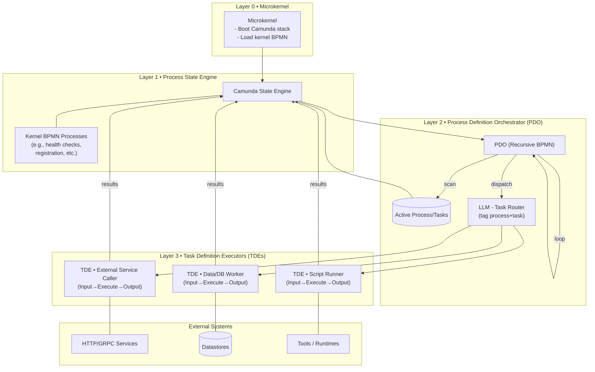

ProkOS - A process centric operating system (Basic)

At the heart of the system is a **microkernel**. Its job is not to do everything, but to make sure the core process engine is alive and ready. Concretely, the microkernel:

1. **Bootstraps Camunda (the process engine stack).**
   It ensures that Camunda is up and running, and pushes in the minimal “kernel-level” or “virtual OS-level” BPMN processes needed for the system to function.

2. **Starts the Process Definition Orchestrator (PDO).**
   The PDO is a special BPMN process that runs recursively. Think of it as a heartbeat: it loops continuously, monitoring Camunda for any active process definitions and the tasks they spawn. Because it is recursive, the PDO can call itself, enabling ongoing oversight without needing to be manually restarted.

3. **Coordinates Task Definition Executors (TDEs).**
   Whenever the PDO encounters an active task, it tags it to its parent process, and then hands it off to the appropriate TDE.

   * A **TDE** is a process in its own right, but it operates at the “task granularity.”
   * Each TDE runs with a simple structure: **Input → Execute → Output.**
   * There can be many types of TDEs (e.g., one that runs Python scripts, another that calls an external service, another that queries a database).

Together, this creates a clean layering:

* **Microkernel**: starts and sustains the environment (Camunda + core processes).
* **PDO**: the recursive overseer, monitoring all process definitions and routing tasks.
* **TDEs**: the workhorses that actually carry out the tasks, each encapsulated as its own small process.

This structure makes the system process-centric: everything is expressed and executed as BPMN, from the high-level orchestration down to the smallest script task. It also makes the system resilient, because the PDO never stops looping, and modular, because new types of TDEs can be introduced without touching the kernel.

