# Self-Organizing Hierarchical Knowledge Management Systems: A Genetic Tree Approach

## Abstract

This research explores a revolutionary approach to organizational knowledge management that models knowledge systems as self-organizing genetic trees. The concept proposes that projects within an organization naturally form hierarchical relationships where knowledge inheritance flows from parent to child projects, creating an evolving ecosystem of domain expertise.

**Core Innovation:** Projects self-organize into hierarchical namespaces (gov/mil/ind → domain → program → project) with Approved For Use (AFU) knowledge automatically cascading down the tree while specialized knowledge bubbles up through controlled approval workflows. A 24/7 AI system (DAS) acts as an intelligent knowledge broker, identifying cross-domain connections and presenting knowledge "commensurate with user capabilities."

**Key Research Areas:**
- Self-organizing hierarchical systems with conservative and dissipative organization
- Genetic algorithm optimization of knowledge structures
- Adaptive knowledge presentation based on user capability modeling
- Cross-domain knowledge discovery and translation

## Hierarchical Genetic Tree Structure

```mermaid
graph TD
    subgraph "Organizational Knowledge Genome"
        GOV["`**GOV**
        Constitutional/Legal
        AFU Knowledge Base`"]

        MIL["`**MIL**
        Defense Standards
        AFU Knowledge Base`"]

        IND["`**IND**
        Industry Best Practices
        AFU Knowledge Base`"]
    end

    subgraph "Domain Evolution"
        GOV --> DOD["`**DoD Programs**
        Inherits: Gov AFU
        Adds: Defense Policy`"]

        MIL --> DOD
        IND --> DEFENSE_IND["`**Defense Industry**
        Inherits: Ind AFU
        Adds: Defense Manufacturing`"]
    end

    subgraph "Program Branching"
        DOD --> USN["`**Navy Projects**
        Inherits: DoD + Gov AFU
        Adds: Naval Operations`"]

        DOD --> USAF["`**Air Force Projects**
        Inherits: DoD + Gov AFU
        Adds: Aviation Systems`"]

        DEFENSE_IND --> SHIPBUILDING["`**Naval Contractors**
        Inherits: Defense Ind AFU
        Adds: Ship Construction`"]
    end

    subgraph "Project Specialization"
        USN --> CARRIER["`**Carrier Program**
        Specialized Naval AFU`"]

        USN --> SUBMARINE["`**Submarine Program**
        Specialized Naval AFU`"]

        USAF --> FIGHTER["`**Fighter Program**
        Specialized Aviation AFU`"]
    end

    subgraph "Knowledge Evolution"
        CARRIER --> |Branch Growth| CVN78["`**CVN-78 Project**
        Active Development`"]

        CARRIER --> |Branch Extinction| OLD_CARRIER["`**Legacy Carrier**
        🧬 Extinct/Archived`"]

        SUBMARINE --> |Cross-Domain Link| MISSILE_SYS["`**Missile Systems**
        Links to USAF Knowledge`"]
    end

    classDef govStyle fill:#ff6b6b,stroke:#d63031,stroke-width:3px,color:#fff
    classDef milStyle fill:#45b7d1,stroke:#0984e3,stroke-width:3px,color:#fff
    classDef indStyle fill:#96ceb4,stroke:#00b894,stroke-width:3px,color:#000
    classDef activeStyle fill:#ddd6fe,stroke:#8b5cf6,stroke-width:2px,color:#000
    classDef extinctStyle fill:#fca5a5,stroke:#ef4444,stroke-width:2px,color:#000,stroke-dasharray: 5 5

    class GOV govStyle
    class MIL milStyle
    class IND indStyle
    class CVN78,MISSILE_SYS activeStyle
    class OLD_CARRIER extinctStyle
```

## Self-Organizing Intelligence System

## Genetic Knowledge Evolution Process

## Key Components

**1. Self-Organizing Hierarchical Systems:** These systems dynamically adjust their structure based on the evolving needs and inputs of the organization, facilitating efficient knowledge categorization and retrieval.

**2. Adaptive Knowledge Management:** By modeling knowledge systems as genetic trees, organizations can create a living knowledge base that evolves, branches, and occasionally prunes itself, mirroring natural selection processes.

**3. Ontology-Constrained Projects:** Each project is defined by a specific namespace and domain, ensuring that the knowledge it encompasses is automatically classified and constrained by the organization's ontology, maintaining consistency and relevance.

## Research Investigation Areas

### 1. Growing Hierarchical Self-Organizing Maps (GHSOM)
**Focus:** Dynamic knowledge structure evolution
- Application of SOMs in organizing and visualizing complex knowledge structures
- GHSOMs for web mining and large dataset management
- Automatic adaptation to changing knowledge landscapes

### 2. Genetic Algorithm Optimization
**Focus:** Knowledge base organization and retrieval optimization
- Genetic algorithms for automated hierarchical system decomposition
- Evolution of knowledge inheritance patterns
- Optimization of cross-domain knowledge linking

### 3. User Capability Modeling
**Focus:** Adaptive knowledge presentation
- Formal Concept Analysis (FCA) for knowledge hierarchy structuring
- Mathematical approaches to user expertise assessment
- Dynamic knowledge simplification and translation algorithms

### 4. Cross-Domain Knowledge Discovery
**Focus:** Semantic analysis and pattern mining
- Automated identification of knowledge connections between disparate domains
- Pattern recognition for beneficial cross-domain project linking
- Knowledge translation accuracy while maintaining accessibility

### 5. Evolutionary Knowledge Systems
**Focus:** Systems that improve through usage and feedback
- Fitness evaluation metrics for organizational knowledge
- Selection mechanisms for high-performing knowledge patterns
- Mutation and crossover operations for knowledge evolution

### 6. Hierarchical Self-Organizing Systems
**Focus:** Conservative and dissipative organization processes
- Stability vs. adaptation balance in knowledge systems
- Thermodynamic concepts applied to knowledge organization
- Autonomous self-organization characteristics

## Research Questions for Investigation

### Immediate Questions:
1. **Knowledge Fitness Metrics:** What defines "knowledge fitness" in organizational contexts?
2. **Genetic Optimization:** How can genetic algorithms optimize knowledge inheritance patterns?
3. **Translation Accuracy:** How does cross-domain knowledge translation maintain accuracy while improving accessibility?
4. **Predictive Hierarchies:** Can self-organizing systems predict optimal project hierarchies before users recognize the need?

### Advanced Questions:
5. **Evolutionary Convergence:** Do knowledge systems naturally converge to optimal organizational structures?
6. **Cross-Domain Pollination:** What mechanisms prevent knowledge contamination while enabling beneficial cross-pollination?
7. **User-System Co-evolution:** How do user capabilities and system intelligence co-evolve over time?
8. **Knowledge Extinction Criteria:** What determines when knowledge branches should be pruned vs. preserved?

## Implementation Paradigm

This represents a paradigm shift from static knowledge repositories to living, evolving intelligence systems that:

- **Grow smarter through use** - System intelligence increases with user interaction
- **Adapt organically** - Knowledge organization evolves based on actual usage patterns
- **Self-optimize** - Genetic algorithms continuously improve knowledge accessibility
- **Predict needs** - 24/7 DAS intelligence anticipates user knowledge requirements
- **Scale naturally** - Hierarchical structure grows without manual reorganization
- **Maintain quality** - Evolutionary pressure ensures high-performing knowledge survives

## Conclusion

The self-organizing hierarchical knowledge management system represents a revolutionary approach that transforms static knowledge bases into dynamic, living intelligence systems. By modeling organizational knowledge as genetic trees with evolutionary capabilities, this system can adapt, grow, and optimize itself based on user needs and organizational changes.

The integration of Growing Hierarchical Self-Organizing Maps, genetic algorithms, and adaptive user modeling creates a comprehensive framework for managing complex organizational knowledge while ensuring that each user receives information "commensurate with their capabilities."

This research direction promises to advance the field of knowledge management from reactive systems to proactive, intelligent partners in organizational learning and decision-making.
