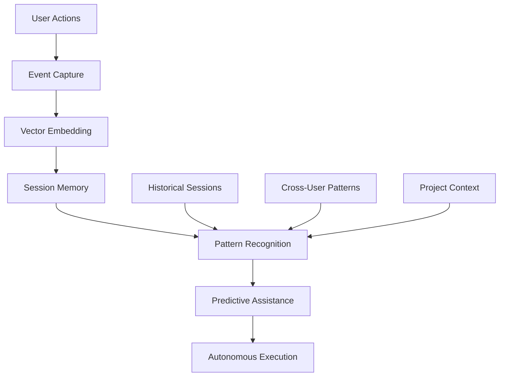
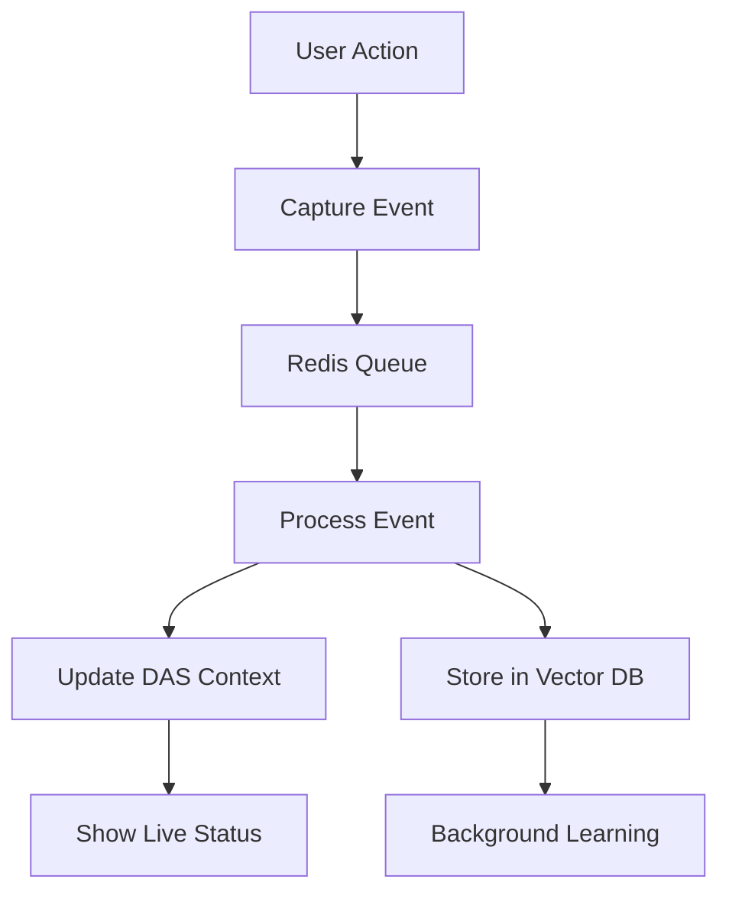

# Session Intelligence and Event Capture for DAS
## A Comprehensive Framework for Contextual User Experience and Autonomous Agent Learning

**Authors:** DAS Development Team  
**Date:** September 2025  
**Document Type:** Technical Architecture Paper  
**Version:** 1.0  
**Status:** Technical Specification  

---

## Executive Summary

Session Intelligence represents a paradigm shift in how Digital Assistance Systems (DAS) understand and respond to user behavior. By capturing, storing, and analyzing user session events as vector embeddings, DAS evolves from a reactive assistant to a proactive, context-aware autonomous agent that learns from collective user experience.

This paper outlines a comprehensive framework for implementing session event capture, memory systems, and behavioral analytics that enable DAS to:
- Maintain session awareness across user interactions
- Learn from historical user patterns and workflows
- Provide contextual assistance based on current and past activities
- Bootstrap new users and projects with knowledge from similar sessions
- Execute autonomous actions informed by collective user experience

---

## 1. Conceptual Foundation

### 1.1 Session Intelligence Definition

**Session Intelligence** is the systematic capture, storage, and analysis of user activities, decisions, and interactions within a software system, transformed into semantic representations that enable AI agents to understand context, predict needs, and execute autonomous actions.

### 1.2 Core Principles

1. **Event-Driven Architecture**: Every user action becomes a structured event
2. **Semantic Representation**: Events are embedded as vectors for similarity analysis
3. **Temporal Context**: Session chronology provides workflow understanding
4. **Cross-Session Learning**: Knowledge transfers between users and projects
5. **Privacy-Preserving**: Sensitive data is abstracted while preserving behavioral patterns

### 1.3 Value Proposition



---

## 2. Simple Event Capture (Start Here)

### 2.1 Minimal Event Schema

```python
# Keep it simple - just capture what happened
class SimpleEvent:
    session_id: str
    timestamp: str  
    event_type: str  # "document_upload", "ontology_create", "das_question", etc.
    data: dict       # Whatever context is relevant
    
# Common event types (add more as needed)
EVENT_TYPES = [
    "page_view",
    "document_upload", 
    "ontology_create",
    "ontology_modify",
    "analysis_run",
    "das_question",
    "das_response"
]
```

### 2.2 Event Capture Implementation

```python
class SessionEventCapture:
    """Captures and processes session events in real-time"""
    
    def __init__(self, vector_store, embedding_service, redis_client):
        self.vector_store = vector_store
        self.embedding_service = embedding_service
        self.redis = redis_client
        self.event_collection = "session_events"
        
    async def capture_event(self, event: SessionEvent) -> bool:
        """
        Capture a session event and process it for storage
        """
        try:
            # Enrich event with contextual data
            enriched_event = await self._enrich_event(event)
            
            # Generate semantic embedding
            event_embedding = await self._generate_event_embedding(enriched_event)
            
            # Store in vector database
            await self._store_event_vector(enriched_event, event_embedding)
            
            # Update real-time session state
            await self._update_session_state(enriched_event)
            
            # Trigger pattern analysis if needed
            await self._analyze_event_patterns(enriched_event)
            
            return True
            
        except Exception as e:
            logger.error(f"Failed to capture event {event.event_id}: {e}")
            return False
    
    async def _enrich_event(self, event: SessionEvent) -> EnrichedEvent:
        """
        Enrich event with additional contextual information
        """
        # Get current session context
        session_context = await self.get_session_context(event.session_id)
        
        # Get user profile and preferences
        user_profile = await self.get_user_profile(event.user_id)
        
        # Get project context if available
        project_context = None
        if event.project_id:
            project_context = await self.get_project_context(event.project_id)
        
        return EnrichedEvent(
            **event.__dict__,
            session_context=session_context,
            user_profile=user_profile,
            project_context=project_context,
            temporal_position=await self._calculate_temporal_position(event),
            workflow_stage=await self._identify_workflow_stage(event)
        )
    
    async def _generate_event_embedding(self, event: EnrichedEvent) -> List[float]:
        """
        Generate semantic embedding for the event
        """
        # Create semantic representation of the event
        event_text = self._create_event_text(event)
        
        # Generate embedding
        embedding = await self.embedding_service.generate_embeddings([event_text])
        return embedding[0]
    
    def _create_event_text(self, event: EnrichedEvent) -> str:
        """
        Create textual representation of event for embedding
        """
        components = [
            f"Event: {event.event_type.value}",
            f"Category: {event.event_category.value}",
            f"User: {event.user_id}",
            f"Project: {event.project_id or 'none'}",
            f"Context: {event.context}",
            f"Workflow Stage: {event.workflow_stage}",
            f"Temporal Position: {event.temporal_position}"
        ]
        
        return " | ".join(components)
```

### 2.3 Vector Storage Schema

```python
class SessionEventVector:
    """Vector representation of session events"""
    
    def __init__(self):
        self.collection_schema = {
            "name": "session_events",
            "vector_size": 384,  # all-MiniLM-L6-v2 embedding size
            "distance": "Cosine",
            "payload_schema": {
                "event_id": "string",
                "session_id": "string", 
                "user_id": "string",
                "project_id": "string",
                "timestamp": "datetime",
                "event_type": "string",
                "event_category": "string",
                "context": "object",
                "workflow_stage": "string",
                "temporal_position": "float",
                "semantic_summary": "string",
                "related_events": "array",
                "outcome": "string",
                "duration": "float",
                "user_satisfaction": "float"
            }
        }
```

---

## 3. Session Memory System

### 3.1 Multi-Level Memory Architecture

```python
class SessionMemorySystem:
    """
    Hierarchical memory system for session intelligence
    """
    
    def __init__(self, vector_store, redis_client, graph_db):
        self.vector_store = vector_store  # Long-term semantic memory
        self.redis = redis_client         # Short-term working memory  
        self.graph_db = graph_db         # Relationship memory
        
    async def get_session_context(self, session_id: str) -> SessionContext:
        """
        Retrieve comprehensive session context for DAS
        """
        # Working Memory (Redis) - Current session state
        working_memory = await self._get_working_memory(session_id)
        
        # Episodic Memory (Vector DB) - Similar past sessions
        episodic_memory = await self._get_episodic_memory(session_id)
        
        # Semantic Memory (Vector DB) - Learned patterns
        semantic_memory = await self._get_semantic_memory(session_id)
        
        # Procedural Memory (Graph DB) - Workflow knowledge
        procedural_memory = await self._get_procedural_memory(session_id)
        
        return SessionContext(
            working_memory=working_memory,
            episodic_memory=episodic_memory,
            semantic_memory=semantic_memory,
            procedural_memory=procedural_memory,
            synthesis=await self._synthesize_context(
                working_memory, episodic_memory, semantic_memory, procedural_memory
            )
        )

class MemoryType(Enum):
    WORKING = "working"      # Current session state (Redis)
    EPISODIC = "episodic"    # Specific past experiences (Vector DB)
    SEMANTIC = "semantic"    # General knowledge patterns (Vector DB)
    PROCEDURAL = "procedural" # Workflow and process knowledge (Graph DB)
```

### 3.2 Pattern Recognition Engine

```python
class SessionPatternEngine:
    """
    Identifies patterns in user behavior for predictive assistance
    """
    
    async def analyze_session_patterns(self, session_id: str) -> SessionPatterns:
        """
        Analyze current session for behavioral patterns
        """
        # Get recent session events
        recent_events = await self._get_recent_events(session_id, limit=50)
        
        # Identify workflow patterns
        workflow_patterns = await self._identify_workflow_patterns(recent_events)
        
        # Detect user preferences
        preference_patterns = await self._detect_preference_patterns(recent_events)
        
        # Find similar historical sessions
        similar_sessions = await self._find_similar_sessions(recent_events)
        
        # Predict next likely actions
        predicted_actions = await self._predict_next_actions(
            workflow_patterns, preference_patterns, similar_sessions
        )
        
        return SessionPatterns(
            workflow_patterns=workflow_patterns,
            preference_patterns=preference_patterns,
            similar_sessions=similar_sessions,
            predicted_actions=predicted_actions,
            confidence_score=self._calculate_pattern_confidence(recent_events)
        )
    
    async def _find_similar_sessions(self, current_events: List[SessionEvent]) -> List[SimilarSession]:
        """
        Find sessions with similar event patterns using vector similarity
        """
        # Create embedding for current session pattern
        session_embedding = await self._create_session_embedding(current_events)
        
        # Search for similar session patterns
        similar_vectors = await self.vector_store.search_vectors(
            collection_name="session_patterns",
            query_vector=session_embedding,
            limit=10,
            score_threshold=0.7
        )
        
        # Convert to SimilarSession objects with actionable insights
        similar_sessions = []
        for vector in similar_vectors:
            payload = vector.get("payload", {})
            similar_sessions.append(SimilarSession(
                session_id=payload.get("session_id"),
                user_id=payload.get("user_id"),
                project_id=payload.get("project_id"),
                similarity_score=vector.get("score"),
                successful_outcomes=payload.get("successful_outcomes", []),
                common_patterns=payload.get("common_patterns", []),
                suggested_actions=payload.get("suggested_actions", [])
            ))
        
        return similar_sessions
```

---

## 4. Cross-User Learning and Knowledge Transfer

### 4.1 Collective Intelligence Framework

```python
class CollectiveIntelligenceEngine:
    """
    Learns from all user sessions to improve DAS capabilities
    """
    
    async def bootstrap_new_project(self, project_context: dict) -> ProjectBootstrap:
        """
        Bootstrap a new project using knowledge from similar projects
        """
        # Find similar projects based on domain, requirements, etc.
        similar_projects = await self._find_similar_projects(project_context)
        
        # Extract successful patterns from similar projects
        success_patterns = await self._extract_success_patterns(similar_projects)
        
        # Generate recommended initial actions
        recommended_actions = await self._generate_bootstrap_recommendations(
            project_context, success_patterns
        )
        
        # Create initial DAS instruction set for this project
        project_instructions = await self._create_project_instructions(
            project_context, success_patterns
        )
        
        return ProjectBootstrap(
            similar_projects=similar_projects,
            success_patterns=success_patterns,
            recommended_actions=recommended_actions,
            project_instructions=project_instructions,
            confidence_score=self._calculate_bootstrap_confidence(similar_projects)
        )
    
    async def learn_from_user_success(self, session_id: str, outcome: UserOutcome):
        """
        Learn from successful user outcomes to improve future assistance
        """
        # Get the session events that led to success
        session_events = await self._get_session_events(session_id)
        
        # Identify the key decision points and actions
        critical_path = await self._identify_critical_path(session_events, outcome)
        
        # Create learning pattern
        learning_pattern = LearningPattern(
            session_id=session_id,
            outcome=outcome,
            critical_path=critical_path,
            context=await self._extract_session_context(session_events),
            replicable_actions=await self._identify_replicable_actions(critical_path)
        )
        
        # Store as knowledge for future sessions
        await self._store_learning_pattern(learning_pattern)
        
        # Update DAS instruction templates
        await self._update_instruction_templates(learning_pattern)
```

### 4.2 User Behavior Analytics

```python
class UserBehaviorAnalytics:
    """
    Analyzes user behavior patterns for DAS optimization
    """
    
    async def analyze_user_journey(self, user_id: str, timeframe: timedelta) -> UserJourney:
        """
        Analyze user's journey across multiple sessions
        """
        # Get all user sessions in timeframe
        user_sessions = await self._get_user_sessions(user_id, timeframe)
        
        # Identify workflow progressions
        workflow_progressions = await self._analyze_workflow_progressions(user_sessions)
        
        # Detect learning patterns
        learning_patterns = await self._detect_learning_patterns(user_sessions)
        
        # Identify pain points and friction
        friction_points = await self._identify_friction_points(user_sessions)
        
        # Calculate user proficiency evolution
        proficiency_evolution = await self._calculate_proficiency_evolution(user_sessions)
        
        return UserJourney(
            user_id=user_id,
            timeframe=timeframe,
            workflow_progressions=workflow_progressions,
            learning_patterns=learning_patterns,
            friction_points=friction_points,
            proficiency_evolution=proficiency_evolution,
            das_optimization_recommendations=await self._generate_optimization_recommendations(
                workflow_progressions, friction_points, proficiency_evolution
            )
        )
```

---

## 5. DAS Integration and Autonomous Decision Making

### 5.1 Context-Aware Response Generation

```python
class ContextAwareDAS:
    """
    DAS enhanced with session intelligence for autonomous decision making
    """
    
    async def process_user_request(self, request: str, session_id: str) -> DASResponse:
        """
        Process user request with full session intelligence
        """
        # Get comprehensive session context
        session_context = await self.session_memory.get_session_context(session_id)
        
        # Analyze current session patterns
        current_patterns = await self.pattern_engine.analyze_session_patterns(session_id)
        
        # Find similar historical contexts
        similar_contexts = await self._find_similar_contexts(request, session_context)
        
        # Determine if autonomous action is appropriate
        autonomy_decision = await self._evaluate_autonomy_opportunity(
            request, session_context, current_patterns, similar_contexts
        )
        
        if autonomy_decision.should_execute_autonomously:
            # Execute autonomous action
            return await self._execute_autonomous_action(
                request, autonomy_decision.execution_plan, session_context
            )
        else:
            # Provide enhanced guidance with session context
            return await self._generate_contextual_guidance(
                request, session_context, current_patterns, similar_contexts
            )
    
    async def _evaluate_autonomy_opportunity(
        self, 
        request: str, 
        session_context: SessionContext,
        current_patterns: SessionPatterns,
        similar_contexts: List[SimilarContext]
    ) -> AutonomyDecision:
        """
        Decide whether DAS should execute autonomously or provide guidance
        """
        # Analyze user intent and complexity
        intent_analysis = await self._analyze_user_intent(request)
        
        # Check if we have sufficient similar examples
        similar_success_rate = self._calculate_similar_success_rate(similar_contexts)
        
        # Evaluate user's current proficiency level
        user_proficiency = await self._assess_user_proficiency(
            session_context.user_id, intent_analysis.domain
        )
        
        # Check available autonomous capabilities
        available_actions = await self._get_available_autonomous_actions(intent_analysis)
        
        # Make autonomy decision based on multiple factors
        autonomy_score = self._calculate_autonomy_score(
            intent_analysis.complexity,
            similar_success_rate,
            user_proficiency,
            len(available_actions)
        )
        
        return AutonomyDecision(
            should_execute_autonomously=autonomy_score > 0.8,
            confidence_score=autonomy_score,
            execution_plan=available_actions[0] if available_actions else None,
            reasoning=self._generate_autonomy_reasoning(
                autonomy_score, intent_analysis, similar_success_rate
            )
        )
```

### 5.2 Autonomous Action Execution

```python
class AutonomousActionExecutor:
    """
    Executes actions autonomously based on session intelligence
    """
    
    async def execute_autonomous_action(
        self, 
        action_plan: ActionPlan, 
        session_context: SessionContext
    ) -> ActionResult:
        """
        Execute action autonomously with full transparency
        """
        # Log intention
        await self._log_autonomous_intention(action_plan, session_context)
        
        # Validate preconditions
        validation_result = await self._validate_preconditions(action_plan)
        if not validation_result.is_valid:
            return ActionResult(
                success=False,
                error=f"Preconditions not met: {validation_result.errors}"
            )
        
        # Execute action steps
        execution_steps = []
        try:
            for step in action_plan.steps:
                step_result = await self._execute_action_step(step, session_context)
                execution_steps.append(step_result)
                
                # Validate intermediate results
                if not step_result.success:
                    # Attempt rollback
                    await self._rollback_partial_execution(execution_steps)
                    return ActionResult(
                        success=False,
                        error=f"Step failed: {step_result.error}",
                        partial_results=execution_steps
                    )
        
            # Validate final outcome
            final_validation = await self._validate_final_outcome(
                action_plan, execution_steps
            )
            
            # Log successful execution for learning
            await self._log_successful_execution(action_plan, execution_steps, session_context)
            
            return ActionResult(
                success=True,
                results=execution_steps,
                validation=final_validation,
                learning_data=await self._extract_learning_data(action_plan, execution_steps)
            )
            
        except Exception as e:
            # Handle execution errors
            await self._handle_execution_error(e, action_plan, execution_steps)
            return ActionResult(
                success=False,
                error=str(e),
                partial_results=execution_steps
            )
```

---

## 6. Simple Redis Event System (MVP Approach)

### 6.1 Minimal Event Pipeline



### 6.2 Super Simple Implementation

```python
class SimpleSessionEvents:
    """
    Dead simple event system - just capture and process
    """
    
    def __init__(self, redis_client):
        self.redis = redis_client
    
    # 1. CAPTURE: When user does something
    async def capture_event(self, session_id: str, event_type: str, data: dict):
        """
        Capture any user event - keep it simple
        """
        event = {
            "session_id": session_id,
            "timestamp": datetime.now().isoformat(),
            "type": event_type,
            "data": data
        }
        
        # Just push to Redis queue
        await self.redis.lpush("events", json.dumps(event))
        
        # Tell DAS about it immediately
        await self.redis.publish(f"das_watch:{session_id}", json.dumps(event))
    
    # 2. PROCESS: Simple background processor
    async def process_events(self):
        """
        Process events one by one - no complexity
        """
        while True:
            # Get next event
            event_data = await self.redis.brpop("events", timeout=1)
            if event_data:
                event = json.loads(event_data[1])
                
                # Simple processing
                await self._simple_process(event)
    
    async def _simple_process(self, event):
        """
        Simple event processing - just update session and notify DAS
        """
        session_id = event["session_id"]
        
        # Update session activity list
        await self.redis.lpush(f"session:{session_id}:activity", json.dumps(event))
        await self.redis.ltrim(f"session:{session_id}:activity", 0, 49)  # Keep last 50
        
        # Update session summary
        await self._update_session_summary(session_id, event)
        
        # Check if DAS should say something
        await self._check_das_observation(session_id, event)

class LiveDASWatcher:
    """
    DAS watches session events live and makes observations
    """
    
    def __init__(self, redis_client, das_engine):
        self.redis = redis_client
        self.das = das_engine
    
    async def watch_session(self, session_id: str):
        """
        Watch a session and make live observations
        """
        # Subscribe to live events for this session
        pubsub = self.redis.pubsub()
        await pubsub.subscribe(f"das_watch:{session_id}")
        
        async for message in pubsub.listen():
            if message['type'] == 'message':
                event = json.loads(message['data'])
                await self._make_observation(session_id, event)
    
    async def _make_observation(self, session_id: str, event: dict):
        """
        Simple observation logic - when should DAS speak up?
        """
        # Get recent activity
        recent_events = await self.redis.lrange(f"session:{session_id}:activity", 0, 4)
        
        # Simple rules for when DAS should observe
        if len(recent_events) >= 3:  # User did 3+ things
            if self._detect_struggle_pattern(recent_events):
                await self._offer_help(session_id, "I notice you're working on several tasks. Would you like me to help organize or automate anything?")
            
            elif self._detect_repetitive_pattern(recent_events):
                await self._offer_help(session_id, "I see you're doing similar actions. I could automate this workflow for you.")
        
        # Check for specific opportunities
        if event["type"] == "document_upload":
            await self._offer_help(session_id, "I can analyze that document and extract key requirements if you'd like.")
        
        elif event["type"] == "ontology_create":
            await self._offer_help(session_id, "I can help populate your ontology with standard classes and relationships.")
    
    async def _offer_help(self, session_id: str, suggestion: str):
        """
        Simple way to offer help - just store suggestion for DAS to show
        """
        await self.redis.lpush(f"das:{session_id}:suggestions", suggestion)
        await self.redis.expire(f"das:{session_id}:suggestions", 300)  # 5 min expiry
```

---

## 7. LLM-Based Command Recognition (Recommended Approach)

### 7.1 Why LLM Over Regex?

**User's Position**: "It might be easier to just jump to the LLMs rather than a convoluted regex system"

**Research Findings**:
- Modern LLMs excel at intent recognition and parameter extraction
- Function calling capabilities are built into GPT-4 and similar models
- Structured outputs with JSON schemas provide reliable command parsing
- Natural language flexibility without brittle pattern matching
- Automatic handling of variations, synonyms, and context

**Conclusion**: **LLM-based command recognition is the superior approach** for DAS autonomous execution.

### 7.2 Custom-Built Command Recognition System

**Design Principle**: "We build everything ourselves - no external frameworks, full control"

```python
class CustomDASCommandSystem:
    """
    Our own command recognition and execution system - no external dependencies
    """
    
    def __init__(self, llm_client, tool_registry):
        self.llm = llm_client  # Our existing LLM client
        self.tools = tool_registry  # Our tool registry
        self.command_templates = self._build_command_templates()
    
    def _build_command_templates(self) -> dict:
        """
        Our own tool definitions - we control the schema completely
        """
        return {
            "create_ontology_class": {
                "description": "Create a new class in an ontology",
                "parameters": ["class_name", "ontology_name", "class_type", "properties"],
                "required": ["class_name"],
                "examples": [
                    "Create a class called AirVehicle",
                    "Add a Sensor class to seov1 ontology",
                    "Create a Vehicle class with speed property"
                ]
            },
            "save_to_memory": {
                "description": "Save current conversation or context to memory",
                "parameters": ["content_type", "description", "tags"],
                "required": ["content_type"],
                "examples": [
                    "Save this to memory",
                    "Remember this decision",
                    "Store this conversation"
                ]
            },
            "analyze_document": {
                "description": "Analyze a document for requirements, concepts, or insights", 
                "parameters": ["document_id", "analysis_type", "focus_areas"],
                "required": ["document_id"],
                "examples": [
                    "Analyze the disaster response document",
                    "Review the uploaded requirements file",
                    "Process the CDD document"
                ]
            },
            "query_knowledge_base": {
                "description": "Search and query the knowledge base for information",
                "parameters": ["query", "domain", "result_type"],
                "required": ["query"],
                "examples": [
                    "What do we know about missile systems?",
                    "Search for autonomous vehicle information",
                    "Find similar projects"
                ]
            },
            "create_workflow": {
                "description": "Create a BPMN workflow or process definition",
                "parameters": ["workflow_name", "workflow_type", "steps"],
                "required": ["workflow_name"],
                "examples": [
                    "Create a workflow for requirements validation",
                    "Build an analysis process",
                    "Set up a review workflow"
                ]
            }
        }
    
    async def recognize_and_execute_command(self, user_input: str, session_context: dict) -> CommandResult:
        """
        Our own command recognition system - no external frameworks
        """
        try:
            # Step 1: Ask LLM to analyze intent and extract parameters
            intent_analysis = await self._analyze_intent_with_llm(user_input, session_context)
            
            # Step 2: If it's a command, execute it ourselves
            if intent_analysis.is_command:
                return await self._execute_our_command(intent_analysis, session_context)
            else:
                # It's a question - provide information
                return CommandResult(
                    success=True,
                    message=intent_analysis.response_message,
                    action_taken="information_provided",
                    is_autonomous_action=False
                )
                
        except Exception as e:
            return CommandResult(
                success=False,
                message=f"Error processing request: {str(e)}",
                action_taken="error"
            )
    
    async def _analyze_intent_with_llm(self, user_input: str, session_context: dict) -> IntentAnalysis:
        """
        Use our LLM to analyze user intent - we build the prompt ourselves
        """
        # Build our own prompt for intent analysis
        analysis_prompt = f"""
        Analyze this user request and determine:
        1. Is this a COMMAND (user wants me to do something) or QUESTION (user wants information)?
        2. If COMMAND, what tool should be used and what are the parameters?
        3. If QUESTION, what information do they need?
        
        Available tools I can use:
        {self._format_available_tools()}
        
        User request: "{user_input}"
        Session context: {session_context}
        
        Respond with JSON in this exact format:
        {{
            "is_command": true/false,
            "tool_name": "tool_name_if_command",
            "parameters": {{"param1": "value1", "param2": "value2"}},
            "confidence": 0.0-1.0,
            "reasoning": "why you chose this interpretation",
            "response_message": "message if not a command"
        }}
        """
        
        # Call our existing LLM client
        llm_response = await self.llm.generate_response(analysis_prompt)
        
        # Parse the JSON response ourselves
        try:
            analysis_data = json.loads(llm_response)
            return IntentAnalysis(**analysis_data)
        except json.JSONDecodeError:
            # Fallback if JSON parsing fails
            return IntentAnalysis(
                is_command=False,
                response_message="I couldn't understand that request. Could you rephrase it?",
                confidence=0.0
            )
    
    def _format_available_tools(self) -> str:
        """
        Format our tools for the LLM prompt - we control the format
        """
        tool_descriptions = []
        for tool_name, tool_config in self.command_templates.items():
            examples = ", ".join(tool_config["examples"][:2])
            tool_descriptions.append(
                f"- {tool_name}: {tool_config['description']} (Examples: {examples})"
            )
        return "\n".join(tool_descriptions)
    
    async def _execute_our_command(self, intent: IntentAnalysis, session_context: dict) -> CommandResult:
        """
        Execute commands using our own tool system - no external dependencies
        """
        tool_name = intent.tool_name
        parameters = intent.parameters
        
        # Get our tool implementation
        tool = self.tools.get_tool(tool_name)
        if not tool:
            return CommandResult(
                success=False,
                message=f"I don't have a '{tool_name}' tool available yet."
            )
        
        # Execute using our tool
        try:
            result = await tool.execute(parameters, session_context)
            return CommandResult(
                success=result.success,
                message=f"✅ {result.message}" if result.success else f"❌ {result.message}",
                action_taken=tool_name,
                details=result.details,
                is_autonomous_action=True
            )
        except Exception as e:
            return CommandResult(
                success=False,
                message=f"Error executing {tool_name}: {str(e)}",
                action_taken=tool_name
            )

class IntentAnalysis:
    """
    Our own intent analysis structure - we define the schema
    """
    is_command: bool
    tool_name: Optional[str] = None
    parameters: dict = None
    confidence: float = 0.0
    reasoning: str = ""
    response_message: str = ""
```

### 7.3 Natural Language Command Examples

```yaml
natural_language_commands:
  ontology_operations:
    - "Create a class called AirVehicle and add it to my seov1 ontology"
    - "Add a relationship between Sensor and Component"
    - "Modify the Vehicle class to include a speed property"
    - "Show me all classes in the current ontology"
    
  memory_operations:
    - "Save this conversation to memory"
    - "Remember this decision for future projects"
    - "Store this as a best practice"
    - "Keep track of this approach"
    
  document_operations:
    - "Analyze the disaster response requirements document"
    - "Upload and process the new CDD file"
    - "Compare this document with previous requirements"
    - "Extract key concepts from the uploaded specification"
    
  knowledge_operations:
    - "What do we know about missile guidance systems?"
    - "Search for information about autonomous vehicles"
    - "Find similar projects in our knowledge base"
    - "Cross-reference this with existing standards"
    
  workflow_operations:
    - "Create a workflow for requirements validation"
    - "Run the standard analysis process on this document"
    - "Execute the sensitivity analysis workflow"
    - "Start the verification and validation process"
    
  complex_requests:
    - "Review the uploaded document, extract requirements, create ontology classes for key concepts, and run an analysis"
    - "Save our current progress, create a summary, and set up a workflow for the next phase"
    - "Find similar projects, extract their best practices, and apply them to our current ontology"
```

### 7.4 Advantages of LLM-Based Approach

```python
class LLMCommandAdvantages:
    """
    Why LLM function calling is superior to regex patterns
    """
    
    advantages = {
        "natural_language_flexibility": {
            "description": "Handles variations, synonyms, and context naturally",
            "examples": [
                "Create a class called AirVehicle",
                "Add a new class named AirVehicle", 
                "I need a class for AirVehicle",
                "Can you create an AirVehicle class?"
            ],
            "regex_limitation": "Would require dozens of patterns for variations"
        },
        
        "parameter_extraction": {
            "description": "Automatically extracts parameters from natural language",
            "examples": [
                "Create a Vehicle class with speed and altitude properties",
                "Add a Sensor class to the seov1 ontology with temperature and pressure attributes"
            ],
            "regex_limitation": "Complex nested parameter extraction is brittle"
        },
        
        "context_awareness": {
            "description": "Uses session context to resolve ambiguous references",
            "examples": [
                "Add it to the current ontology" → knows which ontology
                "Create another one like that" → understands what 'that' refers to
            ],
            "regex_limitation": "No context understanding capability"
        },
        
        "intent_disambiguation": {
            "description": "Distinguishes between commands and questions",
            "examples": [
                "Create a class" → COMMAND (execute)
                "How do I create a class?" → QUESTION (provide guidance)
            ],
            "regex_limitation": "Requires separate classification logic"
        },
        
        "error_handling": {
            "description": "Graceful handling of unclear or impossible requests",
            "examples": [
                "Create a purple elephant class" → Asks for clarification
                "Delete everything" → Requests confirmation or refuses
            ],
            "regex_limitation": "No understanding of reasonableness or safety"
        }
    }
```

### 7.5 Our Own Tool Registry System

```python
class CustomToolRegistry:
    """
    Our own tool registry - no external frameworks, full control
    """
    
    def __init__(self, api_client, vector_store, redis_client):
        self.api = api_client
        self.vector_store = vector_store  
        self.redis = redis_client
        self.tools = self._initialize_tools()
    
    def _initialize_tools(self) -> dict:
        """
        Initialize our own tools - we build each one
        """
        return {
            "create_ontology_class": OntologyClassTool(self.api),
            "save_to_memory": MemoryTool(self.vector_store),
            "analyze_document": DocumentAnalysisTool(self.api),
            "query_knowledge_base": KnowledgeQueryTool(self.vector_store),
            "create_workflow": WorkflowTool(self.api)
        }
    
    def get_tool(self, tool_name: str) -> Optional[BaseTool]:
        """
        Get tool implementation by name
        """
        return self.tools.get(tool_name)
    
    def list_available_tools(self) -> List[str]:
        """
        List all available tool names
        """
        return list(self.tools.keys())

class BaseTool:
    """
    Base class for all our custom tools
    """
    
    async def execute(self, parameters: dict, session_context: dict) -> ToolResult:
        """
        Execute the tool with given parameters
        """
        raise NotImplementedError("Each tool must implement execute()")
    
    def validate_parameters(self, parameters: dict) -> bool:
        """
        Validate parameters before execution
        """
        return True  # Override in subclasses

class OntologyClassTool(BaseTool):
    """
    Our own ontology class creation tool
    """
    
    def __init__(self, api_client):
        self.api = api_client
    
    async def execute(self, parameters: dict, session_context: dict) -> ToolResult:
        """
        Create ontology class using our API
        """
        try:
            class_name = parameters.get("class_name")
            ontology_name = parameters.get("ontology_name") or session_context.get("active_ontology")
            class_type = parameters.get("class_type", "PhysicalEntity")
            properties = parameters.get("properties", {})
            
            if not class_name:
                return ToolResult(
                    success=False,
                    message="I need a class name to create the class."
                )
            
            if not ontology_name:
                return ToolResult(
                    success=False,
                    message="I need to know which ontology to add the class to."
                )
            
            # Call our ODRAS API directly
            response = await self.api.post(
                f"/api/ontologies/{ontology_name}/classes",
                json={
                    "name": class_name,
                    "type": class_type,
                    "properties": properties
                }
            )
            
            if response.status_code == 200:
                return ToolResult(
                    success=True,
                    message=f"Created class '{class_name}' in {ontology_name} ontology",
                    details={
                        "class_name": class_name,
                        "ontology": ontology_name,
                        "class_type": class_type,
                        "api_response": response.json()
                    }
                )
            else:
                return ToolResult(
                    success=False,
                    message=f"Failed to create class: {response.text}"
                )
                
        except Exception as e:
            return ToolResult(
                success=False,
                message=f"Error creating class: {str(e)}"
            )

class MemoryTool(BaseTool):
    """
    Our own memory storage tool
    """
    
    def __init__(self, vector_store):
        self.vector_store = vector_store
    
    async def execute(self, parameters: dict, session_context: dict) -> ToolResult:
        """
        Save information to our vector memory system
        """
        try:
            content_type = parameters.get("content_type", "conversation")
            description = parameters.get("description", "User saved memory")
            tags = parameters.get("tags", [])
            
            # Get conversation context to save
            conversation_context = session_context.get("recent_conversation", [])
            
            # Create memory entry
            memory_entry = {
                "session_id": session_context["session_id"],
                "user_id": session_context["user_id"],
                "project_id": session_context.get("project_id"),
                "timestamp": datetime.now().isoformat(),
                "content_type": content_type,
                "description": description,
                "tags": tags,
                "conversation_context": conversation_context,
                "saved_by_user": True
            }
            
            # Store in our vector database
            await self._store_memory_entry(memory_entry)
            
            return ToolResult(
                success=True,
                message=f"Saved {content_type} to memory with description: '{description}'",
                details=memory_entry
            )
            
        except Exception as e:
            return ToolResult(
                success=False,
                message=f"Error saving to memory: {str(e)}"
            )

class ToolResult:
    """
    Our own tool result structure
    """
    success: bool
    message: str
    details: Optional[dict] = None
    
class CommandResult:
    """
    Our own command result structure  
    """
    success: bool
    message: str
    action_taken: Optional[str] = None
    details: Optional[dict] = None
    is_autonomous_action: bool = False
```

### 7.6 Simple Command Execution

```python
class SimpleCommandExecutor:
    """
    Execute simple commands autonomously - start with basic ones
    """
    
    def __init__(self, api_client, session_manager):
        self.api = api_client
        self.sessions = session_manager
    
    async def execute_command(self, intent: CommandIntent, session_id: str) -> CommandResult:
        """
        Execute command based on recognized intent
        """
        try:
            if intent.command_type == "save_to_memory":
                return await self._save_to_memory(intent, session_id)
                
            elif intent.command_type == "create_ontology_class":
                return await self._create_ontology_class(intent, session_id)
                
            elif intent.command_type == "analyze_document":
                return await self._analyze_document(intent, session_id)
                
            elif intent.command_type == "search_knowledge":
                return await self._search_knowledge(intent, session_id)
                
            else:
                return CommandResult(
                    success=False,
                    message=f"I understand you want to {intent.command_type}, but I can't execute that yet."
                )
                
        except Exception as e:
            return CommandResult(
                success=False,
                message=f"Error executing command: {str(e)}"
            )
    
    async def _create_ontology_class(self, intent: CommandIntent, session_id: str) -> CommandResult:
        """
        Example: "create a class called AirVehicle and add it to my seov1 ontology"
        """
        try:
            # Extract class name
            class_name = intent.entities[0] if intent.entities else "NewClass"
            
            # Get current project/ontology context
            session_context = await self.sessions.get_session_context(session_id)
            current_ontology = session_context.get("active_ontology")
            
            if not current_ontology:
                return CommandResult(
                    success=False,
                    message="I need to know which ontology to add the class to. Please select an ontology first."
                )
            
            # Execute API call
            api_response = await self.api.post(
                f"/api/ontologies/{current_ontology}/classes",
                json={
                    "name": class_name,
                    "type": "PhysicalEntity",  # Default type
                    "properties": {}
                }
            )
            
            if api_response.status_code == 200:
                return CommandResult(
                    success=True,
                    message=f"✅ Created class '{class_name}' in {current_ontology} ontology",
                    action_taken="create_ontology_class",
                    details={
                        "class_name": class_name,
                        "ontology": current_ontology,
                        "api_response": api_response.json()
                    }
                )
            else:
                return CommandResult(
                    success=False,
                    message=f"❌ Failed to create class: {api_response.text}"
                )
                
        except Exception as e:
            return CommandResult(
                success=False,
                message=f"Error creating class: {str(e)}"
            )
    
    async def _save_to_memory(self, intent: CommandIntent, session_id: str) -> CommandResult:
        """
        Example: "save this to memory" - save current conversation context
        """
        try:
            # Get recent conversation
            recent_context = await self.sessions.get_recent_conversation(session_id, limit=5)
            
            # Store in vector database with session context
            memory_entry = {
                "session_id": session_id,
                "timestamp": datetime.now().isoformat(),
                "content": recent_context,
                "type": "user_saved_memory",
                "user_command": intent.original_text
            }
            
            # Store in vector DB for future retrieval
            await self._store_memory_entry(memory_entry)
            
            return CommandResult(
                success=True,
                message="✅ Saved current conversation to memory. I'll remember this context for future sessions.",
                action_taken="save_to_memory"
            )
            
        except Exception as e:
            return CommandResult(
                success=False,
                message=f"Error saving to memory: {str(e)}"
            )

class CommandResult:
    success: bool
    message: str
    action_taken: Optional[str] = None
    details: Optional[dict] = None
```

### 7.3 Integration with DAS Chat

```python
class EnhancedDASChat:
    """
    DAS chat enhanced with command recognition and execution
    """
    
    def __init__(self, command_recognizer, command_executor, rag_service):
        self.recognizer = command_recognizer
        self.executor = command_executor
        self.rag = rag_service
    
    async def process_user_input(self, user_input: str, session_id: str) -> DASResponse:
        """
        Process input - either execute command or provide guidance
        """
        # First, check if this is a command
        intent = self.recognizer.recognize_command(user_input)
        
        if intent.confidence > 0.8 and intent.command_type != "question":
            # High confidence command - execute it
            result = await self.executor.execute_command(intent, session_id)
            
            if result.success:
                return DASResponse(
                    message=result.message,
                    confidence=ConfidenceLevel.HIGH,
                    intent=IntentType.COMMAND,
                    metadata={
                        "command_executed": intent.command_type,
                        "action_details": result.details,
                        "autonomous_execution": True
                    }
                )
            else:
                return DASResponse(
                    message=f"I tried to {intent.command_type} but encountered an error: {result.message}",
                    confidence=ConfidenceLevel.MEDIUM,
                    intent=IntentType.COMMAND
                )
        else:
            # Not a clear command - provide guidance/answer
            return await self.rag.query_das_knowledge(user_input, session_id)
```

---

## 8. Proactive Session Management

### 8.1 Session Goal Setting

**Concept**: DAS asks "What do you want to accomplish today?" and then:
- Prepares relevant knowledge in background
- Monitors progress against goals  
- Provides proactive assistance
- Evaluates results and identifies system gaps

```python
class ProactiveSessionManager:
    """
    DAS manages entire session lifecycle proactively
    """
    
    async def start_session(self, session_id: str, user_id: str) -> str:
        """
        Start session with optional goal setting
        """
        # Get user's recent patterns
        recent_patterns = await self._get_user_patterns(user_id)
        
        # Create personalized prompt
        if recent_patterns:
            common_goals = ", ".join(recent_patterns[:3])
            prompt = f"""Hi! I'm DAS. I notice you often work on: {common_goals}

What would you like to accomplish in this session? (Optional)
This helps me prepare relevant information and watch for opportunities to assist."""
        else:
            prompt = """Hi! I'm DAS, your session assistant.

What would you like to accomplish today? (Optional)
Examples: "Analyze requirements", "Create ontology classes", "Just exploring"

This helps me prepare and assist you better."""
        
        return prompt
    
    async def set_session_goals(self, session_id: str, user_goals: str):
        """
        Process goals and prepare session context
        """
        # Parse goals with LLM
        parsed_goals = await self._parse_goals_with_llm(user_goals)
        
        # Start background preparation
        asyncio.create_task(self._prepare_background_context(session_id, parsed_goals))
        
        # Start session monitoring
        asyncio.create_task(self._monitor_session_progress(session_id, parsed_goals))
        
        return f"Got it! I'm preparing information about {', '.join(parsed_goals)} while you get started."
```

---

## 9. Future State: DAS as Tool-Calling Agent

### 8.1 Tool-Calling Architecture Vision

```python
class ToolCallingDAS:
    """
    Future state: DAS as a general-purpose tool-calling agent
    """
    
    def __init__(self, tool_registry, llm_client):
        self.tools = tool_registry
        self.llm = llm_client
    
    async def process_user_request(self, user_input: str, session_id: str) -> DASResponse:
        """
        Process any user request by selecting and calling appropriate tools
        """
        # 1. Understand user intent using LLM
        intent_analysis = await self.llm.analyze_intent(
            user_input=user_input,
            available_tools=self.tools.get_tool_descriptions(),
            session_context=await self._get_session_context(session_id)
        )
        
        # 2. Select tools to accomplish the intent
        selected_tools = await self._select_tools(intent_analysis)
        
        # 3. Execute tools in sequence
        execution_plan = await self._create_execution_plan(selected_tools, intent_analysis)
        
        # 4. Execute the plan
        results = await self._execute_plan(execution_plan, session_id)
        
        # 5. Synthesize and report results
        return await self._synthesize_results(user_input, results, session_id)

class ToolRegistry:
    """
    Registry of all tools DAS can use
    """
    
    def __init__(self):
        self.tools = {
            # ODRAS API Tools
            "ontology_manager": OntologyAPITool(),
            "document_processor": DocumentAPITool(), 
            "analysis_runner": AnalysisAPITool(),
            "knowledge_querier": KnowledgeAPITool(),
            
            # Workflow Tools
            "workflow_executor": WorkflowTool(),
            "process_creator": ProcessCreationTool(),
            
            # File Management Tools
            "file_uploader": FileUploadTool(),
            "file_analyzer": FileAnalysisTool(),
            
            # Memory Tools
            "memory_saver": MemoryTool(),
            "context_retriever": ContextTool(),
            
            # Future Tools (when available)
            "sparql_generator": SPARQLTool(),
            "artifact_generator": ArtifactTool(),
            "visualization_creator": VisualizationTool()
        }
    
    def get_tool_descriptions(self) -> List[dict]:
        """
        Get descriptions of all available tools for LLM selection
        """
        return [
            {
                "name": name,
                "description": tool.description,
                "parameters": tool.parameter_schema,
                "capabilities": tool.capabilities
            }
            for name, tool in self.tools.items()
        ]

class OntologyAPITool:
    """
    Tool for ontology operations
    """
    
    description = "Create, modify, and query ontologies"
    parameter_schema = {
        "action": ["create_class", "add_relationship", "modify_class", "query_ontology"],
        "ontology_id": "string",
        "class_name": "string", 
        "properties": "object"
    }
    capabilities = [
        "Create new ontology classes",
        "Add relationships between classes",
        "Modify existing classes",
        "Query ontology structure"
    ]
    
    async def execute(self, action: str, parameters: dict) -> ToolResult:
        """
        Execute ontology operations
        """
        if action == "create_class":
            return await self._create_class(parameters)
        elif action == "add_relationship":
            return await self._add_relationship(parameters)
        # ... other actions
    
    async def _create_class(self, params: dict) -> ToolResult:
        """
        Create a new ontology class
        """
        # Call ODRAS API
        response = await self._call_api(
            method="POST",
            endpoint=f"/api/ontologies/{params['ontology_id']}/classes",
            payload={
                "name": params["class_name"],
                "type": params.get("class_type", "PhysicalEntity"),
                "properties": params.get("properties", {})
            }
        )
        
        return ToolResult(
            success=response.status_code == 200,
            message=f"Created class '{params['class_name']}'" if response.status_code == 200 else "Failed to create class",
            data=response.json() if response.status_code == 200 else None,
            tool_used="ontology_manager",
            action_taken="create_class"
        )
```

### 8.2 Example Tool-Calling Scenarios

```yaml
user_requests_and_tool_execution:
  
  scenario_1:
    user_input: "Create a class called AirVehicle and add it to my seov1 ontology"
    das_reasoning: "User wants to create an ontology class"
    tools_selected: ["ontology_manager"]
    execution_plan:
      - tool: "ontology_manager"
        action: "create_class"
        parameters:
          ontology_id: "seov1"
          class_name: "AirVehicle"
          class_type: "PhysicalEntity"
    das_response: "✅ I've created the AirVehicle class in your seov1 ontology. Would you like me to add any specific properties or relationships?"
  
  scenario_2:
    user_input: "Analyze the disaster response document and tell me the key requirements"
    das_reasoning: "User wants document analysis and requirement extraction"
    tools_selected: ["document_processor", "analysis_runner", "knowledge_querier"]
    execution_plan:
      - tool: "document_processor"
        action: "extract_content"
        parameters:
          document_id: "disaster_response_requirements.md"
      - tool: "analysis_runner" 
        action: "extract_requirements"
        parameters:
          content: "{output_from_step_1}"
      - tool: "knowledge_querier"
        action: "enrich_requirements"
        parameters:
          requirements: "{output_from_step_2}"
    das_response: "✅ I've analyzed the disaster response document. Here are the 12 key requirements I identified: [detailed list]. I also cross-referenced them with our knowledge base and found 3 related standards you should consider."
  
  scenario_3:
    user_input: "Save this conversation to memory and create a workflow for similar analysis"
    das_reasoning: "User wants memory storage and workflow creation"
    tools_selected: ["memory_saver", "process_creator"]
    execution_plan:
      - tool: "memory_saver"
        action: "save_conversation"
        parameters:
          session_id: "{current_session}"
          context: "analysis_workflow_creation"
      - tool: "process_creator"
        action: "create_bpmn_workflow"
        parameters:
          workflow_type: "document_analysis"
          based_on_session: "{current_session}"
    das_response: "✅ I've saved our conversation to memory and created a reusable 'Document Analysis Workflow' based on our discussion. The workflow is now available in your process library as 'Custom_Analysis_v1.0'."
```

### 8.3 Simple Tool Integration Framework

```python
class SimpleDASToolCaller:
    """
    Simple implementation - DAS figures out what to do and does it
    """
    
    async def handle_user_request(self, user_input: str, session_id: str) -> str:
        """
        Dead simple: user asks for something, DAS figures it out and does it
        """
        # Ask LLM what tools to use
        tool_plan = await self.llm.generate_tool_plan(
            user_request=user_input,
            available_tools=self._get_simple_tool_list(),
            session_context=await self._get_session_summary(session_id)
        )
        
        # Execute the plan
        if tool_plan.should_execute:
            results = []
            for tool_call in tool_plan.tool_calls:
                result = await self._execute_tool(tool_call)
                results.append(result)
            
            # Report what was done
            return f"✅ Done! {tool_plan.summary}. Results: {self._format_results(results)}"
        else:
            # Just answer the question
            return await self.rag.query_das_knowledge(user_input, session_id)
    
    def _get_simple_tool_list(self) -> str:
        """
        Simple list of what DAS can do
        """
        return """
        Available tools:
        - Create/modify ontology classes
        - Upload/analyze documents  
        - Run analysis workflows
        - Query knowledge base
        - Save information to memory
        - Create BPMN workflows
        """
```

```python
class SessionIntelligenceStorage:
    """
    Multi-modal storage for session intelligence
    """
    
    def __init__(self, qdrant_client, redis_client, neo4j_client):
        self.vector_db = qdrant_client    # Event vectors and patterns
        self.cache_db = redis_client      # Real-time session state
        self.graph_db = neo4j_client      # Relationships and workflows
        
    async def store_session_event(self, event: EnrichedEvent, embedding: List[float]):
        """
        Store event across multiple storage layers
        """
        # Vector storage for semantic similarity
        await self.vector_db.upsert(
            collection_name="session_events",
            points=[{
                "id": event.event_id,
                "vector": embedding,
                "payload": event.to_dict()
            }]
        )
        
        # Graph storage for relationships
        await self.graph_db.run("""
            MERGE (s:Session {id: $session_id})
            MERGE (u:User {id: $user_id})
            MERGE (e:Event {id: $event_id, type: $event_type, timestamp: $timestamp})
            MERGE (u)-[:HAS_SESSION]->(s)
            MERGE (s)-[:CONTAINS_EVENT]->(e)
        """, event.to_graph_params())
        
        # Cache storage for real-time access
        await self.redis.hset(
            f"session:{event.session_id}:events",
            event.event_id,
            json.dumps(event.to_dict())
        )
        
        # Update session summary
        await self._update_session_summary(event.session_id, event)
```

---

## 7. Privacy and Security Considerations

### 7.1 Privacy-Preserving Event Capture

```python
class PrivacyPreservingCapture:
    """
    Ensures user privacy while capturing behavioral intelligence
    """
    
    def __init__(self, anonymization_service, encryption_service):
        self.anonymizer = anonymization_service
        self.encryptor = encryption_service
    
    async def capture_event_safely(self, raw_event: RawEvent) -> SafeEvent:
        """
        Capture event while preserving user privacy
        """
        # Anonymize sensitive data
        anonymized_event = await self.anonymizer.anonymize_event(raw_event)
        
        # Extract behavioral patterns without personal data
        behavioral_signature = await self._extract_behavioral_signature(raw_event)
        
        # Encrypt sensitive context that must be preserved
        encrypted_context = await self.encryptor.encrypt_sensitive_context(
            raw_event.context
        )
        
        return SafeEvent(
            event_id=raw_event.event_id,
            session_id=raw_event.session_id,
            anonymized_user_id=anonymized_event.user_id,
            behavioral_signature=behavioral_signature,
            encrypted_context=encrypted_context,
            semantic_representation=await self._create_semantic_representation(raw_event)
        )
```

### 7.2 Data Retention and Governance

```yaml
data_retention_policy:
  session_events:
    raw_events: 30_days        # Detailed event data
    aggregated_patterns: 1_year # Behavioral patterns
    anonymized_insights: 5_years # Learning data
    
  user_data:
    personal_identifiers: encrypted_at_rest
    behavioral_patterns: anonymized_after_30_days
    cross_user_insights: fully_anonymized
    
  compliance:
    gdpr_compliance: true
    data_export: on_demand
    data_deletion: complete_within_30_days
    audit_trail: comprehensive_logging
```

---

## 8. DAS Enhancement Through Session Intelligence

### 8.1 Session-Aware DAS Capabilities

```python
class SessionIntelligentDAS:
    """
    DAS enhanced with session intelligence for superior user experience
    """
    
    async def provide_contextual_assistance(self, user_request: str, session_id: str) -> EnhancedDASResponse:
        """
        Provide assistance informed by session intelligence
        """
        # Get session intelligence
        session_intel = await self.session_memory.get_session_context(session_id)
        
        # Analyze current workflow stage
        workflow_stage = await self._identify_current_workflow_stage(session_intel)
        
        # Predict user's next likely needs
        predicted_needs = await self._predict_user_needs(session_intel, workflow_stage)
        
        # Check for autonomous execution opportunities
        autonomy_opportunities = await self._identify_autonomy_opportunities(
            user_request, session_intel, predicted_needs
        )
        
        # Generate response with full context
        if autonomy_opportunities:
            # Execute autonomously if appropriate
            execution_result = await self._execute_contextual_action(
                autonomy_opportunities[0], session_intel
            )
            
            return EnhancedDASResponse(
                message=f"I've completed that task for you. {execution_result.summary}",
                action_taken=execution_result.action,
                execution_details=execution_result.steps,
                confidence=ConfidenceLevel.HIGH,
                session_context_used=True,
                learning_applied=session_intel.patterns_applied
            )
        else:
            # Provide enhanced guidance
            guidance = await self._generate_contextual_guidance(
                user_request, session_intel, predicted_needs
            )
            
            return EnhancedDASResponse(
                message=guidance.message,
                suggested_actions=guidance.actions,
                context_insights=guidance.insights,
                confidence=guidance.confidence,
                session_context_used=True,
                similar_user_experiences=await self._get_similar_user_experiences(session_intel)
            )
```

### 8.2 Proactive Session Management

```python
class ProactiveSessionManager:
    """
    Proactively manages sessions and provides anticipatory assistance
    """
    
    async def monitor_session_progression(self, session_id: str):
        """
        Continuously monitor session for intervention opportunities
        """
        while session_active(session_id):
            # Get current session state
            current_state = await self._get_current_session_state(session_id)
            
            # Analyze for intervention opportunities
            interventions = await self._analyze_intervention_opportunities(current_state)
            
            for intervention in interventions:
                if intervention.confidence > 0.8:
                    # Proactively offer assistance
                    await self._offer_proactive_assistance(session_id, intervention)
                elif intervention.confidence > 0.6:
                    # Prepare assistance for when user asks
                    await self._prepare_contextual_assistance(session_id, intervention)
            
            # Check for session optimization opportunities
            optimizations = await self._identify_session_optimizations(current_state)
            for optimization in optimizations:
                await self._apply_session_optimization(session_id, optimization)
            
            # Wait before next analysis cycle
            await asyncio.sleep(30)  # Check every 30 seconds
```

---

## 9. Implementation Roadmap

### 9.1 Phase 1: Foundation (Weeks 1-4)

**Week 1: Event Capture Infrastructure**
- Implement SessionEvent schema and capture layer
- Create event enrichment pipeline
- Set up vector storage for session events

**Week 2: Session Memory System**
- Implement multi-level memory architecture
- Create session context retrieval system
- Build pattern recognition engine

**Week 3: Basic Analytics**
- Implement user behavior analytics
- Create similarity detection algorithms
- Build session pattern identification

**Week 4: DAS Integration**
- Integrate session intelligence with DAS
- Implement context-aware response generation
- Create basic autonomous decision framework

### 9.2 Phase 2: Intelligence (Weeks 5-8)

**Week 5: Cross-User Learning**
- Implement collective intelligence engine
- Create project bootstrapping system
- Build success pattern extraction

**Week 6: Autonomous Execution**
- Implement autonomous action executor
- Create action validation framework
- Build rollback and error handling

**Week 7: Proactive Management**
- Implement proactive session monitoring
- Create intervention opportunity detection
- Build anticipatory assistance system

**Week 8: Advanced Analytics**
- Implement user journey analysis
- Create proficiency tracking
- Build optimization recommendation engine

### 9.3 Phase 3: Optimization (Weeks 9-12)

**Week 9: Performance Optimization**
- Optimize vector similarity searches
- Implement efficient pattern matching
- Create intelligent caching strategies

**Week 10: Privacy and Security**
- Implement privacy-preserving capture
- Create data anonymization pipeline
- Build compliance monitoring

**Week 11: Advanced Features**
- Implement predictive assistance
- Create workflow optimization
- Build cross-project knowledge transfer

**Week 12: Production Deployment**
- Production-ready deployment
- Comprehensive testing
- User training and documentation

---

## 10. Technical Specifications

### 10.1 Vector Database Schema

```python
# Session Events Collection
session_events_schema = {
    "collection_name": "session_events",
    "vector_size": 384,
    "distance": "Cosine",
    "payload_fields": {
        "event_id": "keyword",
        "session_id": "keyword", 
        "user_id": "keyword",
        "project_id": "keyword",
        "timestamp": "datetime",
        "event_type": "keyword",
        "semantic_summary": "text",
        "context_hash": "keyword",
        "workflow_stage": "keyword",
        "user_proficiency": "float",
        "outcome_success": "boolean"
    }
}

# Session Patterns Collection  
session_patterns_schema = {
    "collection_name": "session_patterns",
    "vector_size": 384,
    "distance": "Cosine", 
    "payload_fields": {
        "pattern_id": "keyword",
        "pattern_type": "keyword",
        "success_rate": "float",
        "usage_frequency": "integer",
        "domain": "keyword",
        "complexity_level": "keyword",
        "replication_instructions": "text"
    }
}

# Cross-User Insights Collection
cross_user_insights_schema = {
    "collection_name": "cross_user_insights",
    "vector_size": 384,
    "distance": "Cosine",
    "payload_fields": {
        "insight_id": "keyword",
        "insight_type": "keyword",
        "confidence_score": "float",
        "applicable_contexts": "array",
        "success_indicators": "array",
        "anonymized_examples": "array"
    }
}
```

### 10.2 API Endpoints

```python
# Session Intelligence API
POST /api/session/events/capture          # Capture session event
GET  /api/session/{session_id}/context    # Get session context
GET  /api/session/{session_id}/patterns   # Get session patterns
POST /api/session/{session_id}/analyze    # Analyze session for insights

# Cross-User Learning API
GET  /api/insights/similar-sessions       # Find similar sessions
POST /api/insights/bootstrap-project      # Bootstrap new project
GET  /api/insights/user-journey          # Get user journey analysis
POST /api/insights/learn-from-outcome     # Learn from user success

# DAS Enhancement API
POST /api/das/contextual-response         # Get context-aware response
POST /api/das/autonomous-action           # Request autonomous action
GET  /api/das/session-recommendations     # Get session-based recommendations
POST /api/das/proactive-assistance        # Enable proactive assistance
```

---

## 11. Benefits and Impact

### 11.1 User Experience Benefits

1. **Contextual Awareness**: DAS understands what you're working on and where you are in your workflow
2. **Proactive Assistance**: DAS anticipates your needs and offers help before you ask
3. **Learning from Others**: Benefits from successful patterns of other users
4. **Reduced Cognitive Load**: DAS handles routine tasks autonomously
5. **Accelerated Onboarding**: New users benefit from collective knowledge

### 11.2 System Intelligence Benefits

1. **Continuous Learning**: System gets smarter with every user interaction
2. **Pattern Recognition**: Identifies successful workflows and replicates them
3. **Optimization**: Automatically optimizes user experiences based on data
4. **Predictive Capabilities**: Anticipates user needs and system requirements
5. **Knowledge Transfer**: Transfers expertise between users and projects

### 11.3 Organizational Benefits

1. **Accelerated Project Delivery**: Faster project starts using proven patterns
2. **Knowledge Retention**: Captures and preserves institutional knowledge
3. **Best Practice Propagation**: Spreads successful approaches across teams
4. **Reduced Training Time**: New users learn from collective experience
5. **Data-Driven Insights**: Analytics inform system and process improvements

---

## 12. Conclusion

Session Intelligence represents a fundamental advancement in how AI assistants understand and serve users. By capturing, analyzing, and learning from user session events, DAS evolves from a reactive tool to a proactive, intelligent partner that understands context, anticipates needs, and executes complex tasks autonomously.

The framework outlined in this paper provides a comprehensive approach to implementing session intelligence that:
- Preserves user privacy while capturing behavioral insights
- Enables cross-user learning and knowledge transfer
- Supports autonomous action execution with full transparency
- Continuously improves through collective experience

This approach transforms DAS into a truly intelligent system that learns, adapts, and evolves with its users, ultimately becoming an indispensable partner in complex analytical workflows.

---

## References

1. Event Sourcing Patterns for Distributed Systems
2. Vector Database Design for Behavioral Analytics  
3. Privacy-Preserving Machine Learning Techniques
4. Autonomous Agent Decision Making Frameworks
5. Session Management Best Practices for AI Systems

---

*This paper establishes the foundation for implementing advanced session intelligence that will enable DAS to become a truly autonomous and intelligent assistant.*
