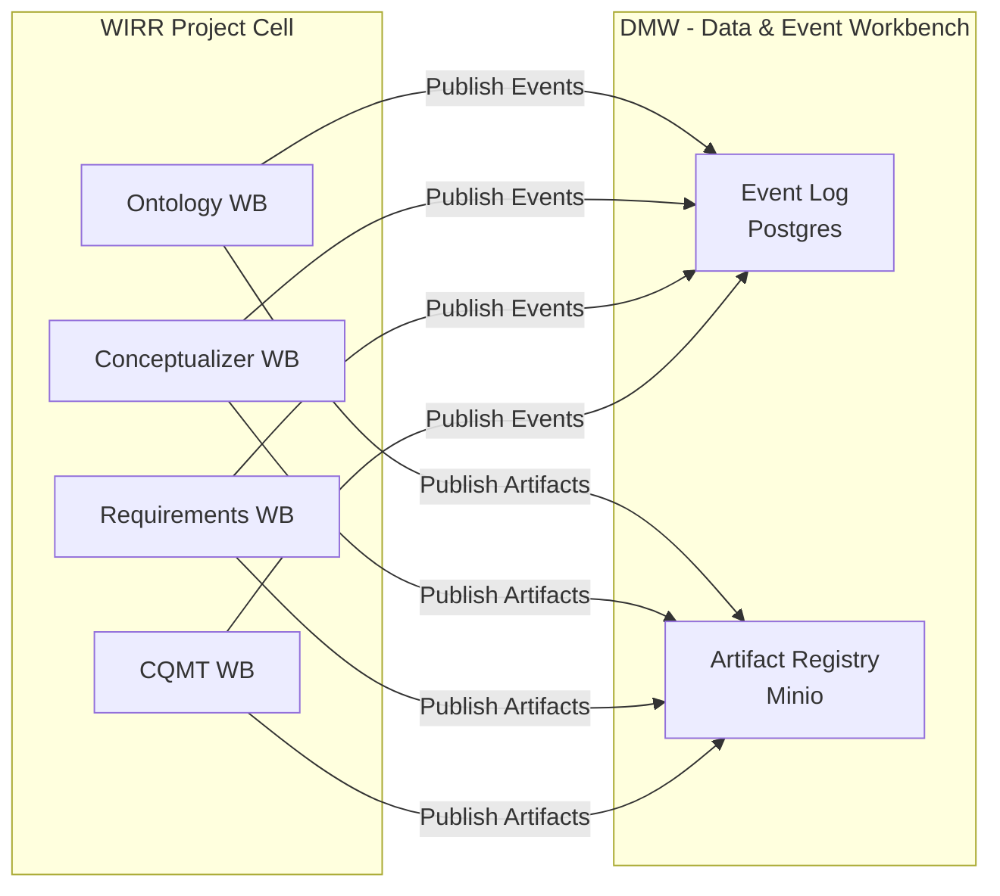
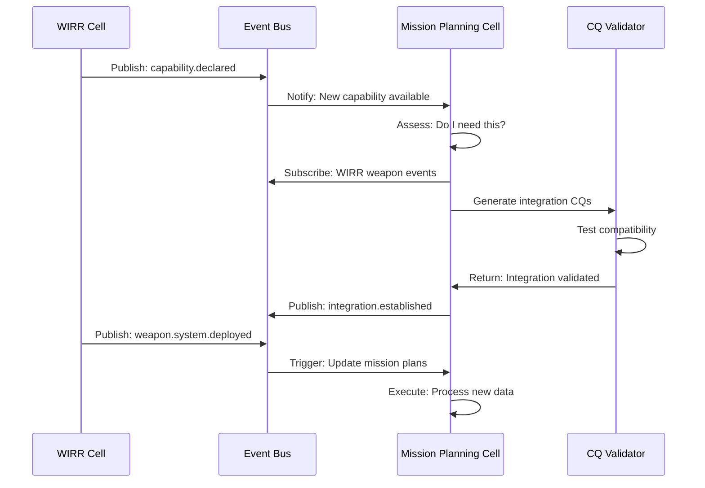
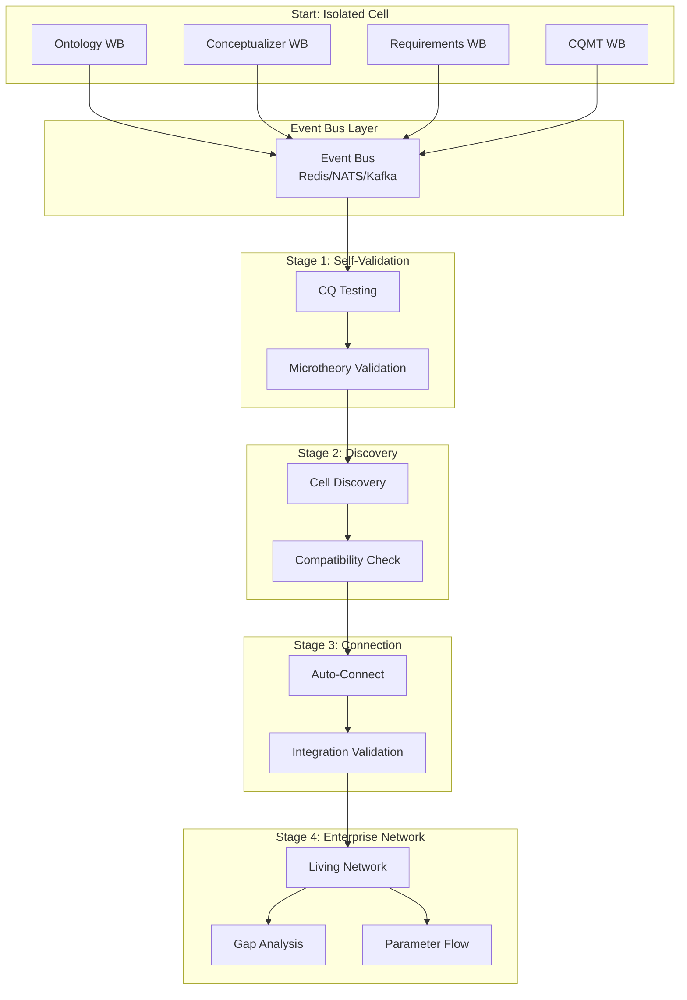

# Cellular to Enterprise Evolution: Creating Alive Project Networks

**Document Type:** Architecture Evolution  
**Created:** January 2025  
**Status:** Conceptual Framework  
**Related Documents:** 
- ODRAS_CELLULAR_ARCHITECTURE.md
- ENTERPRISE_ENGINEERING_CQ_INTEGRATION_PLAN.md
- Project_Thread_Intelligence_Architecture.md
- decoupled_event_architecture.md

---

## Executive Summary

This document describes how **autonomous Project Cells** evolve into an **alive enterprise-level project network** through event-driven architecture, competency questions, and microtheories. This approach extends and fundamentally improves upon the traditional "digital thread" concept by making it **executable, validated, and event-driven** rather than static and document-based.

### The Core Problem Solved

**Traditional Digital Thread Failure:**
- Static, document-based links
- Not executable or validatable
- Breaks when underlying systems change
- Hard to maintain and verify
- Provides documentation but no real-time intelligence

**ODRAS Living Digital Thread:**
- Event-driven connections between cells
- Executable competency questions validate connections
- Microtheories provide isolated test contexts
- Auto-discovery through event bus
- Continual validation and gap analysis
- Truly "alive" network that responds to changes

---

## Stage 1: Autonomous Cells (WIRR Project)

### Initial State: Isolated Workbenches

**Starting Point:**
- WIRR Project Cell created
- Ontology Workbench: Create/import ontologies
- Conceptualizer: Build domain models
- Requirements Workbench: Capture requirements
- CQMT Workbench: Define competency questions

**Key Characteristics:**
- Each workbench operates independently
- No inter-workbench dependencies
- Local data only
- Manual validation

### Cell-Level Event Capture



**Event Examples:**
```json
{
  "event_type": "ontology.class.created",
  "cell_id": "wirr-cell-001",
  "workbench": "ontology",
  "data": {
    "class_iri": "http://usn/wirr/WeaponSystem",
    "layer": "L2"
  }
}

{
  "event_type": "competency_question.tested",
  "cell_id": "wirr-cell-001",
  "workbench": "cqmt",
  "data": {
    "cq_id": "cq-001",
    "status": "passed",
    "execution_time_ms": 1200
  }
}
```

---

## Stage 2: Competency Questions Drive Validation

### CQs Define Cell Capabilities

**Each Cell Develops Its Own CQ Set:**

```yaml
WIRR_Cell_CQs:
  # Entity Identification
  - "What weapon systems exist?"
  - "What platforms can carry weapons?"
  
  # Relationship Discovery
  - "How do weapons relate to platforms?"
  - "What are the integration constraints?"
  
  # Process Validation
  - "What integration processes exist?"
  - "How are integration issues resolved?"
  
  # Constraint Verification
  - "What certification rules apply?"
  - "What compatibility requirements exist?"
```

### CQ Testing Against Microtheories

**Microtheories Provide Isolated Test Contexts:**

```yaml
Microtheory_WIRR_Baseline:
  purpose: "Baseline integration testing"
  named_graph: "http://localhost:3030/wirr/baseline"
  test_data:
    - ":weapon1 rdf:type :WeaponSystem"
    - ":platform1 rdf:type :Aircraft"
    - ":weapon1 :canBeCarriedBy :platform1"

Microtheory_WIRR_EdgeCase:
  purpose: "Test edge cases"
  named_graph: "http://localhost:3030/wirr/edgecase"
  test_data:
    - ":weapon2 rdf:type :WeaponSystem"
    - ":platform2 rdf:type :Aircraft"
    - ":weapon2 :weight 50000"  # Too heavy!
```

**CQ Execution:**
```sparql
# CQ: "What platforms can carry weapon X?"
SELECT ?platform WHERE {
  ?weapon rdf:type :WeaponSystem .
  ?weapon :canBeCarriedBy ?platform .
  FILTER(?weapon = :weapon1)
}
```

---

## Stage 3: Event-Driven Discovery

### Cell Publishes Events to Bus

**Key Event Types:**
- `cq.test.completed` - CQ validation results
- `ontology.layer.completed` - Ontology layer finished
- `microtheory.validated` - Microtheory tested
- `artifact.published` - Workbench artifact available
- `capability.declared` - Cell declares capabilities

**Event Bus Pattern:**
```python
# Event-driven discovery
class CellDiscovery:
    async def publish_capability(self, cell_id, capabilities):
        """Declare what this cell can do"""
        event = {
            "type": "capability.declared",
            "cell_id": cell_id,
            "capabilities": capabilities,
            "cq_coverage": ["entity_identification", "relationship_discovery"]
        }
        await self.event_bus.publish(event)
    
    async def discover_compatible_cells(self, my_cqs):
        """Find cells with compatible CQs"""
        candidates = await self.event_bus.subscribe(
            filter={"type": "capability.declared"}
        )
        # Find cells whose CQs complement ours
        return [c for c in candidates if self._cq_compatible(c['cq_coverage'], my_cqs)]
```

### Subscriber Cells Discover Opportunities

**Pattern Recognition:**
```python
# Mission Planning Cell discovers WIRR Cell
class MissionPlanningCell:
    async def on_capability_discovered(self, event):
        """Another cell declared capabilities"""
        if self._needs_capability(event):
            # Automatically subscribe to their events
            await self.subscribe_to_cell(event['cell_id'])
            
            # Validate integration using CQs
            integration_cqs = await self.generate_integration_cqs(event)
            await self.validate_integration(integration_cqs)
```

---

## Stage 4: Automated Connection & Validation

### Event-Driven Process Kickoff

**Scenario: WIRR Cell + Mission Planning Cell**



### Automatic Integration Validation

**Integration CQs Generated:**

```yaml
Integration_CQs:
  # Can we query weapon capabilities?
  - cq: "What weapons are available for missions?"
    sparql: |
      SELECT ?weapon ?platform WHERE {
        ?weapon rdf:type :WeaponSystem .
        ?weapon :canBeCarriedBy ?platform .
      }
  
  # Do our ontologies align?
  - cq: "Are mission and weapon ontologies compatible?"
    sparql: |
      ASK {
        ?mission :requires ?weapon .
        ?weapon rdf:type :WeaponSystem .
      }
  
  # Can we flow parameters?
  - cq: "Can we retrieve weapon specifications?"
    sparql: |
      SELECT ?weapon ?weight ?range WHERE {
        ?weapon rdf:type :WeaponSystem .
        ?weapon :weight ?weight .
        ?weapon :effectiveRange ?range .
      }
```

**Validation Process:**
1. Generate integration CQs based on declared capabilities
2. Execute CQs against both cells' microtheories
3. If all pass → establish connection
4. If any fail → alert for manual review
5. Publish integration status event

---

## Stage 5: Living Digital Thread

### How This Extends Digital Thread

**Traditional Digital Thread (Broken):**
```
Requirement → Design → Implementation → Test
     ↓           ↓           ↓           ↓
   Document   Document   Document   Document
```
- Static links
- No validation
- Breaks when changed
- Not executable

**ODRAS Living Digital Thread:**
```
Requirement Cell → Design Cell → Implementation Cell → Test Cell
       ↓                ↓               ↓                  ↓
  Event Bus ← → Event Bus ← → Event Bus ← → Event Bus
       ↓                ↓               ↓                  ↓
   CQ Valid   CQ Valid   CQ Valid   CQ Valid
       ↓                ↓               ↓                  ↓
  Microtheory   Microtheory   Microtheory   Microtheory
```
- **Event-driven**: Changes propagate automatically
- **CQ-validated**: Connections verified continuously
- **Microtheory-tested**: Isolated validation contexts
- **Auto-discovery**: Cells find each other
- **Executable**: Real queries, real data, real validation

### Continuous Validation

**Living Thread Validation:**

```python
class LivingThreadValidator:
    async def validate_thread(self, thread_id):
        """Continuously validate digital thread"""
        cells = await self.get_thread_cells(thread_id)
        
        for source, target in self._get_cell_pairs(cells):
            # Generate connection CQs
            cqs = await self.generate_connection_cqs(source, target)
            
            # Execute validation
            results = await self.execute_cqs(cqs)
            
            # If validation fails, break thread
            if any(not r.passed for r in results):
                await self.alert_thread_broken(thread_id, source, target)
            else:
                await self.record_thread_valid(thread_id, source, target)
```

**Event: Thread Broken**
```json
{
  "event_type": "digital_thread.broken",
  "thread_id": "thread-req-design-impl",
  "broken_at": "cell-design-002",
  "reason": "Design ontology incompatible with requirements",
  "failed_cqs": ["cq-integration-001", "cq-integration-003"],
  "action_required": "manual_review"
}
```

---

## Stage 6: Enterprise-Level Patterns

### Gap Analysis Through CQs

**Automated Gap Detection:**

```python
class EnterpriseGapAnalyzer:
    async def analyze_gaps(self, enterprise_cqs):
        """Find gaps in enterprise coverage"""
        cell_cqs = await self.get_all_cell_cqs()
        
        # What enterprise CQs aren't covered?
        uncovered = enterprise_cqs - cell_cqs
        
        # What cells need to be added?
        required_cells = await self.determine_required_cells(uncovered)
        
        # Generate gap report
        return {
            "uncovered_cqs": uncovered,
            "required_cells": required_cells,
            "coverage_percentage": len(cell_cqs) / len(enterprise_cqs) * 100
        }
```

**Gap Analysis Events:**
```json
{
  "event_type": "enterprise.gap.detected",
  "enterprise_id": "enterprise-aircraft-acquisition",
  "missing_cqs": [
    "cq-sustainment-001",
    "cq-logistics-002"
  ],
  "suggested_cells": [
    {
      "cell_type": "sustainment",
      "layer": "L2",
      "required_cqs": ["cq-sustainment-001"]
    }
  ]
}
```

### Parameter Flow Validation

**Cross-Cell Parameter Flow:**

```python
class ParameterFlowValidator:
    async def validate_flow(self, source_cell, target_cell, parameters):
        """Validate parameters can flow between cells"""
        
        # Generate CQs for parameter compatibility
        flow_cqs = []
        for param in parameters:
            cq = f"Can {source_cell} provide {param} in format {target_cell} expects?"
            flow_cqs.append(await self.generate_cq(cq))
        
        # Execute flow CQs
        results = await self.execute_cqs(flow_cqs)
        
        if all(r.passed for r in results):
            await self.establish_flow(source_cell, target_cell, parameters)
        else:
            await self.alert_flow_incompatible(source_cell, target_cell, results)
```

---

## Natural Flow: Workbenches to Enterprise

### How Workbenches Support This Evolution

**1. Ontology Workbench**
- Creates cell's internal ontology
- Publishes `ontology.layer.completed` events
- Exposes ontology through connectors
- Validates through CQs

**2. Conceptualizer Workbench**
- Creates domain models
- Publishes `concept.created` events
- Links to ontology artifacts
- Validates conceptual consistency

**3. Requirements Workbench**
- Captures allocated requirements
- Publishes `requirement.satisfied` events
- Links to ontology elements
- Validates requirement traceability

**4. CQMT Workbench**
- Defines competency questions
- Publishes `cq.test.completed` events
- Links to microtheories
- Validates ontology completeness

**5. Future Workbenches**
- Each workbench adds domain-specific capability
- Each publishes events declaring capabilities
- Each subscribes to relevant events
- Each validates through CQs

### The Complete Flow



---

## Why This Succeeds Where Digital Thread Failed

### Traditional Digital Thread Problems

| Problem | Traditional Approach | Result |
|---------|---------------------|--------|
| **Static Links** | Document references | Breaks when docs change |
| **No Validation** | Manual reviews | Errors accumulate |
| **Not Executable** | Text-based | Can't test connections |
| **Hard to Maintain** | Manual updates | Falls out of sync |
| **No Discovery** | Manual identification | Missed connections |

### ODRAS Living Thread Solutions

| Solution | ODRAS Approach | Result |
|----------|----------------|--------|
| **Event-Driven** | Cell publishes events | Auto-propagation |
| **CQ Validation** | Competency questions | Continuous verification |
| **Executable** | SPARQL queries | Real testing |
| **Auto-Maintain** | Event replay | Self-healing |
| **Auto-Discovery** | Event bus patterns | Finds opportunities |

### Key Innovations

**1. CQs as Executable Specifications**
```python
# Not just documentation
CQ: "Can weapon X be carried by platform Y?"
# Executable validation
SPARQL: SELECT WHERE { :weaponX :canBeCarriedBy :platformY }
```

**2. Microtheories as Isolated Contexts**
```python
# Each cell tests independently
CellA_Microtheory: Test data for cell A
CellB_Microtheory: Test data for cell B
Integration_Microtheory: Combined test data
```

**3. Event Bus as Nervous System**
```python
# Cells communicate without direct knowledge
CellA → Event: "Weapon deployed"
Event → CellB: "Mission planning updated"
```

**4. Living Thread as Continuous Process**
```python
# Not a snapshot, a process
while True:
    validate_connections()
    detect_gaps()
    suggest_improvements()
    auto_heal()
```

---

## Practical Example: WIRR to Enterprise Network

### Phase 1: WIRR Cell Standalone

**Initial Setup:**
- Create WIRR Project Cell
- Import weapon system ontology
- Define 10 CQs
- Create baseline microtheory
- Test all CQs → 100% pass

**Events Published:**
- `cell.created`: WIRR Cell established
- `cq.completed`: 10/10 CQs passing
- `capability.declared`: Weapon integration expertise

### Phase 2: Mission Planning Cell Discovers WIRR

**Discovery Process:**
1. Mission Planning Cell publishes `capability.declared`
2. Event bus routes to all subscribers
3. WIRR Cell subscribes to mission events
4. Mission Planning Cell discovers WIRR events
5. Both cells assess compatibility

**Integration CQs Generated:**
- "Can mission planning query weapon capabilities?"
- "Are ontology concepts compatible?"
- "Can we flow mission parameters to weapons?"

**Validation:**
- Execute integration CQs against combined microtheory
- All pass → connection established
- Events continue to flow

### Phase 3: Integration Test Cell Added

**New Cell Discovery:**
- Integration Test Cell needs weapon data
- Subscribes to WIRR and Mission Planning events
- Generates test scenarios from event data
- Publishes test results

**Network Effect:**
```
WIRR ← → Mission Planning ← → Integration Test
  ↓                                    ↓
  └────────────────────────────────────┘
          (via event bus)
```

### Phase 4: Enterprise-Level Patterns Emerge

**Auto-Discovered Patterns:**
- Weapon integration → Mission planning → Testing
- Requirements → Design → Validation
- Ontology → Conceptualizer → Requirements

**Gap Analysis:**
- Enterprise CQ: "What sustainment requirements exist?"
- Current Coverage: 0% (no sustainment cell)
- Recommendation: Create Sustainment Cell

**Living Thread Established:**
- Full traceability through events
- Continuous validation through CQs
- Auto-healing when connections break
- Gap detection identifies missing cells

---

## Benefits of Alive Enterprise Network

### For Project Managers

**Visibility:**
- Real-time view of all cell connections
- Gap analysis shows missing capabilities
- CQ coverage metrics show system health

**Risk Management:**
- CQ failures indicate integration problems
- Event-driven alerts show breaking changes
- Microtheories provide safe testing

### For Engineers

**Productivity:**
- Auto-discovery reduces manual integration
- CQ validation catches errors early
- Event replay enables debugging

**Quality:**
- Continuous validation ensures correctness
- Microtheories enable isolated testing
- Living thread prevents accumulation of errors

### For the Enterprise

**Agility:**
- Add new cells without breaking existing
- Auto-discovery finds synergies
- Gap analysis drives capability planning

**Intelligence:**
- Network learns patterns over time
- CQ metrics show quality trends
- Event analytics reveal bottlenecks

---

## Implementation Roadmap

### Phase 1: Foundation (Weeks 1-4)
- Implement DMW (Data & Event Workbench)
- Add event publishing to all workbenches
- Create project threads collection
- Enable basic event bus

### Phase 2: CQ Integration (Weeks 5-8)
- Add CQ layer/context metadata
- Implement microtheory isolation
- Create CQ validation engine
- Enable CQ event publishing

### Phase 3: Discovery (Weeks 9-12)
- Implement capability declaration
- Create cell discovery service
- Build compatibility assessment
- Enable auto-subscription

### Phase 4: Integration (Weeks 13-16)
- Implement integration CQ generation
- Create connection validation
- Enable automatic connection
- Build parameter flow validation

### Phase 5: Enterprise (Weeks 17-20)
- Implement gap analysis
- Create living thread validator
- Build enterprise patterns
- Enable auto-healing

---

## Conclusion

The evolution from isolated Project Cells to an alive enterprise network represents a fundamental shift from **static documentation** to **executable intelligence**. By combining:

1. **Competency Questions** as executable specifications
2. **Microtheories** as isolated test contexts
3. **Event Bus** as nervous system
4. **Living Digital Thread** as continuous process

ODRAS creates an enterprise system that **discovers itself, validates itself, and evolves itself**. This is not just a digital thread—it's a **living organism** of connected, validated, intelligent cells that make the enterprise truly executable.

**Key Achievement:** Where traditional digital threads document what happened, ODRAS's living thread **validates what is** and **discovers what could be**.

---

## References

- ODRAS Cellular Architecture Specification
- Enterprise Engineering CQ Integration Plan
- Project Thread Intelligence Architecture
- Decoupled Event Architecture
- Gruninger & Fox: Competency Question Methodology
