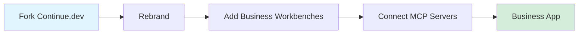
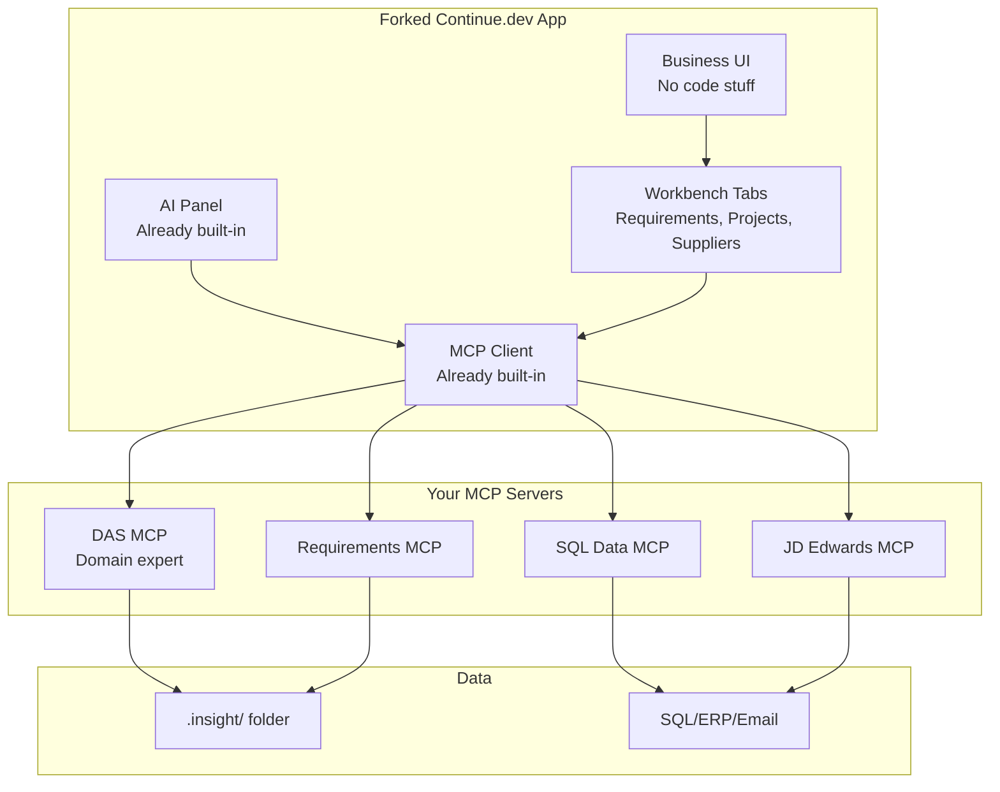
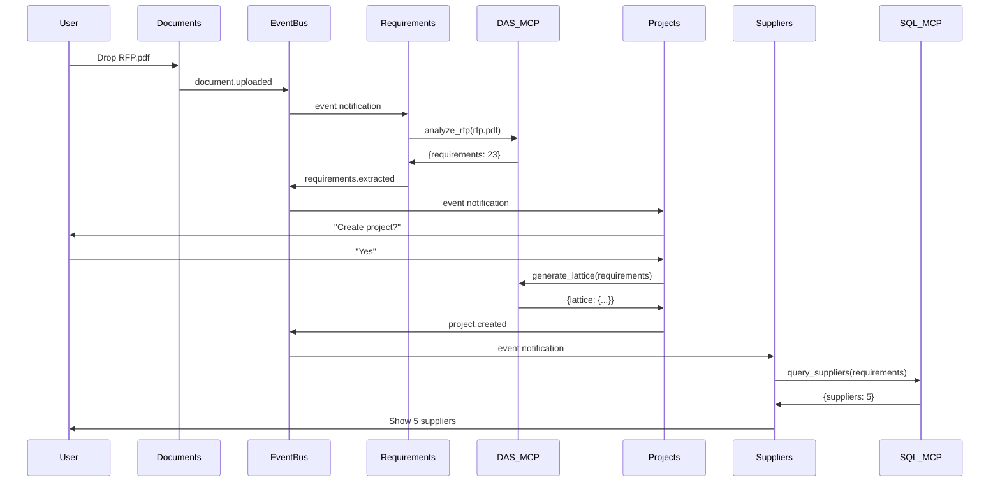

# Fork Analysis: Continue.dev → Business Platform
**One-page technical assessment**

---

## What You Want



**Goals:**
1. ✅ Fork Continue.dev (has AI already integrated)
2. ✅ NotebookLM-like UX (chat with documents)
3. ✅ Workbenches as extensions (tabs for Requirements, Suppliers, etc.)
4. ✅ Hide VS Code branding (looks like business app)
5. ✅ Use native MCP (Continue.dev already has this)
6. ✅ MCP servers for DAS, SQL, Requirements, etc.

---

## Architecture



---

## What's Already Built (Continue.dev)

✅ **AI Chat Panel** - LLM integration  
✅ **MCP Protocol** - Can call MCP servers  
✅ **File Indexing** - Semantic search  
✅ **Tab System** - VS Code tabs  
✅ **Extensions** - Can add workbenches  

**You get this for free.**

---

## What You Need to Build

### 1. Fork & Rebrand (1 week)
```bash
git clone https://github.com/continuedev/continue.git insight
cd insight
# Change product.json: name → "Insight"
# Change logos, colors
# Build: npm install && npm run build
```

### 2. Hide Developer Stuff (1 week)
- Remove: Debug panel, Git view, Extension marketplace
- Simplify: Command palette (business commands only)
- Customize: Activity bar (business icons)

### 3. Add Business Workbenches (4 weeks)
Each workbench = VS Code extension

**Requirements Workbench:**
```typescript
// extensions/insight-requirements/src/extension.ts
export function activate(context: vscode.ExtensionContext) {
    // Register tree view in activity bar
    vscode.window.registerTreeDataProvider('requirementsView', 
        new RequirementsTreeProvider()
    );
    
    // Register tab view
    vscode.window.registerWebviewViewProvider('requirementsTab',
        new RequirementsWebviewProvider()
    );
}
```

**Projects, Suppliers, Compliance** - same pattern

### 4. Build MCP Servers (4 weeks)

**DAS MCP (Domain Assistant):**
```python
# mcp-servers/das/server.py
from fastmcp import FastMCP
mcp = FastMCP("DAS")

@mcp.tool()
async def analyze_rfp(document_path: str):
    """Extract requirements from RFP"""
    # LLM extracts requirements
    return {"requirements": [...], "count": 23}

@mcp.tool()
async def find_suppliers(requirements: list):
    """Find matching suppliers"""
    # Search suppliers, rank by match
    return {"suppliers": [...], "top_match": "Acme"}
```

**Requirements MCP, SQL MCP, etc.** - same pattern

### 5. Data Flow Between Tabs (1 week)

**Event bus for cross-tab communication:**
```typescript
// When user uploads RFP in Documents tab
eventBus.publish('document.uploaded', {path: 'rfp.pdf'});

// Requirements tab listens
eventBus.subscribe('document.uploaded', (event) => {
    showNotification("Extract requirements?");
});
```

---

## Gap Analysis

### ✅ What's Covered (You're Good)

1. ✅ **Fork Continue.dev** - Straightforward, well-documented
2. ✅ **MCP Integration** - Already built into Continue.dev
3. ✅ **AI Chat** - Already built into Continue.dev
4. ✅ **File Operations** - VS Code file API
5. ✅ **Extensions** - VS Code extension system
6. ✅ **Build/Package** - Continue.dev has build scripts

### ⚠️ Gaps You Need to Address

#### Gap 1: Cross-Tab Data Flow
**Problem:** Tabs don't talk to each other by default

**Solution:** Build event bus
```typescript
class DataBus {
    publish(event, data) { /* notify subscribers */ }
    subscribe(event, handler) { /* register listener */ }
}
```
**Effort:** 1 week  
**Critical:** Yes

#### Gap 2: External Data Sources (SQL, JD Edwards)
**Problem:** MCP servers need connectors to legacy systems

**Solution:** Build MCP servers with database clients
```python
# sql-mcp/server.py
import pyodbc
@mcp.tool()
def query_sql(connection, query):
    conn = pyodbc.connect(connection)
    return conn.execute(query).fetchall()
```
**Effort:** 1 week per connector  
**Critical:** Medium (start with SQL, add others later)

#### Gap 3: Persona System
**Problem:** Need to switch between Supply Chain, PM, Compliance personas

**Solution:** Persona config + DAS routing
```json
// .insight/persona.json
{
    "current": "supply-chain",
    "personas": {
        "supply-chain": {
            "das_prompt": "You are a supply chain expert...",
            "workbenches": ["suppliers", "contracts"],
            "mcp_servers": ["suppliers-mcp", "sql-mcp"]
        }
    }
}
```
**Effort:** 2 weeks  
**Critical:** High

#### Gap 4: Document Parsing (PDF, Word, Excel)
**Problem:** Need to extract text from various document formats

**Solution:** Document MCP server
```python
# document-mcp/server.py
from pypdf import PdfReader
from docx import Document

@mcp.tool()
def parse_document(path: str):
    if path.endswith('.pdf'):
        return extract_pdf(path)
    elif path.endswith('.docx'):
        return extract_docx(path)
```
**Effort:** 1 week  
**Critical:** High (core feature)

#### Gap 5: Hiding VS Code Branding Completely
**Problem:** Still looks like VS Code in some places

**Solution:** Thorough rebranding
- Change: product.json, logos, splash screen, window title
- Remove: "VS Code" from all menus, dialogs, settings
- Test: Search codebase for "vscode", "Visual Studio Code"

**Effort:** 1 week  
**Critical:** High (user perception)

#### Gap 6: Installation Package
**Problem:** Users need one-click installer, not "clone and build"

**Solution:** Build installer
```bash
# Windows: .msi installer
npm run package-win

# Mac: .dmg installer  
npm run package-mac

# Linux: .deb/.rpm
npm run package-linux
```
**Effort:** 1 week (with code signing)  
**Critical:** High (for non-technical users)

#### Gap 7: MCP Server Lifecycle Management
**Problem:** Need to start/stop MCP servers automatically

**Solution:** Server manager service
```typescript
class MCPServerManager {
    async startAll() {
        for (server of configuredServers) {
            spawn(server.command, server.args);
        }
    }
}
```
**Effort:** 1 week  
**Critical:** Medium (can start manually initially)

---

## Effort Estimate

| Task | Weeks | Critical |
|------|-------|----------|
| Fork & rebrand | 1 | ✅ |
| Hide developer features | 1 | ✅ |
| Build 3 workbenches | 3 | ✅ |
| Event bus (data flow) | 1 | ✅ |
| Document parser MCP | 1 | ✅ |
| DAS MCP server | 2 | ✅ |
| SQL connector MCP | 1 | ⚠️ |
| Persona system | 2 | ✅ |
| Package installers | 1 | ✅ |
| Testing & polish | 2 | ✅ |
| **TOTAL** | **15 weeks** | |

---

## Why Continue.dev, Not VS Code?

| Feature | VS Code OSS | Continue.dev | Winner |
|---------|-------------|--------------|---------|
| AI Chat | ❌ Need to add | ✅ Built-in | Continue |
| MCP Support | ❌ Need to add | ✅ Built-in | Continue |
| LLM Integration | ❌ Need to add | ✅ Built-in | Continue |
| Codebase Size | 1M+ lines | ~50K lines | Continue |
| Fork Complexity | High | Low | Continue |

**Continue.dev = VS Code + AI, already done**

You fork Continue.dev, not VS Code. Saves 4-6 weeks.

---

## The Data Flow (Your Key Question)



**Key:** Event bus connects tabs, MCP servers do the work.

---

## Is This Doable?

**Yes.** Here's why:

1. ✅ **Continue.dev is forkable** - Open source, MIT license
2. ✅ **MCP is already integrated** - Don't need to build it
3. ✅ **Extension system exists** - Add workbenches as extensions
4. ✅ **We proved iframe approach** - Desktop extension works (673 lines)
5. ✅ **MCP servers are simple** - Python with FastMCP library

**Complexity:** Medium (not trivial, but doable)  
**Time:** 15 weeks with 1-2 developers  
**Risk:** Low (proven technology stack)

---

## What You're Missing (Gap Analysis Summary)

### Technical Gaps:
1. ⚠️ **Event bus** - Need to build for cross-tab communication
2. ⚠️ **Document parsing** - PDF/Word extraction
3. ⚠️ **Persona system** - Switch between user roles
4. ⚠️ **External connectors** - SQL, JDE, email MCP servers
5. ⚠️ **Installer** - One-click setup for non-technical users

### Knowledge Gaps:
1. ❓ **Continue.dev codebase** - Need to explore before forking
2. ❓ **Build process** - How Continue.dev builds/packages
3. ❓ **Extension API** - How to add custom workbenches
4. ❓ **MCP protocol details** - Message format, transport

### Process Gaps:
1. ❓ **User testing** - Need pilot users for feedback
2. ❓ **Persona training data** - Where to get domain expertise for DAS
3. ❓ **Deployment strategy** - How to distribute to enterprises

**None of these are blockers.** All are solvable.

---

## Recommended Next Steps

### Week 1: Explore
```bash
# 1. Fork Continue.dev
git clone https://github.com/continuedev/continue.git insight

# 2. Build it
npm install
npm run build

# 3. Run it
npm run dev

# 4. Explore codebase
# - Find where AI panel lives
# - Find extension registration
# - Find MCP integration
# - Estimate customization effort
```

### Week 2: Prototype
- Change branding (name, logo)
- Add one simple workbench (Requirements)
- Connect to one MCP server (DAS)
- Test: Can we hide developer features?

### Decision Point (End of Week 2)
**If prototype works:** Proceed with full implementation (12 more weeks)  
**If blockers found:** Reconsider approach

---

## Bottom Line

**Is it doable?** Yes.

**How long?** 15 weeks.

**What's the risk?** Low (proven tech).

**What's missing?** Event bus, document parsing, persona system, external connectors, packaging.

**Should you do it?** Yes, if you want a professional business platform. No, if you're happy with the VS Code extension.

**Next step:** Fork Continue.dev and build 2-week prototype to validate.

---

## Quick Reference

**Current:** Desktop extension (673 lines, works)  
**Proposed:** Forked Continue.dev (~20K lines of customization)  
**Benefit:** Native tabs, professional branding, better UX  
**Cost:** 15 weeks of development  
**Risk:** Low

**Read full analysis:** VSCODE_FORK_BUSINESS_PLATFORM.md (if you want details later)


