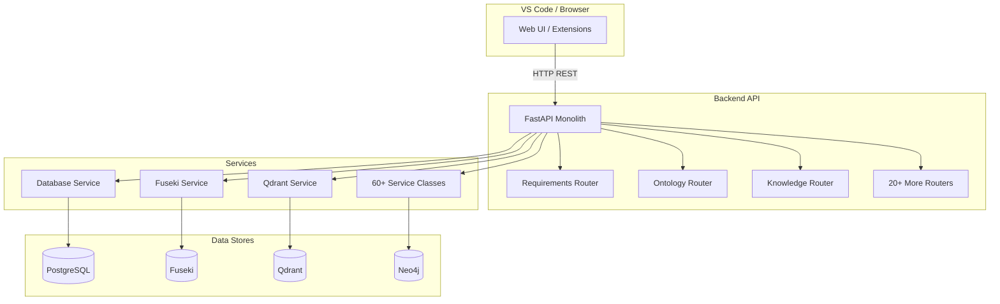
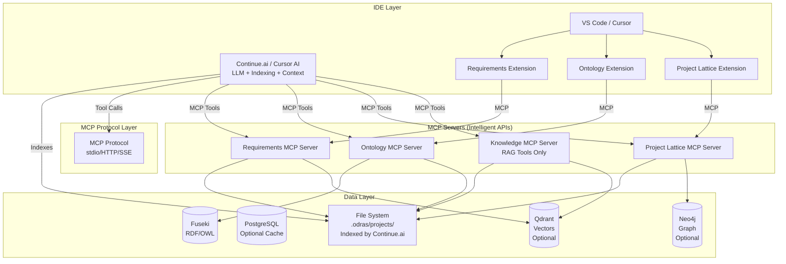
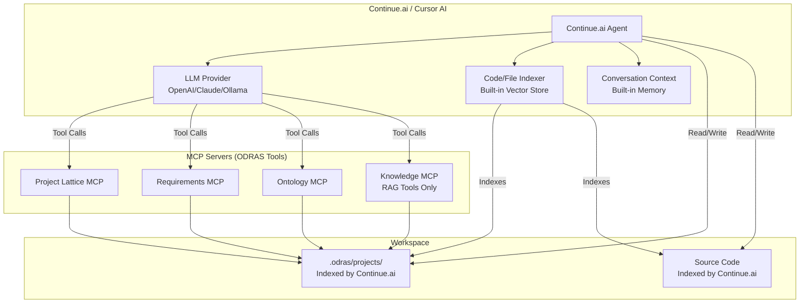
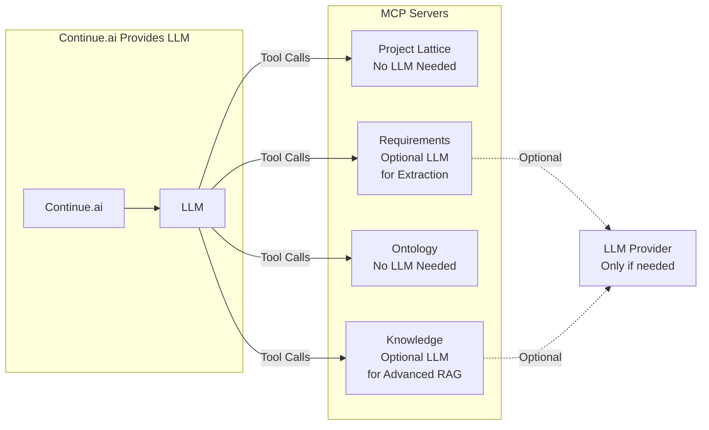
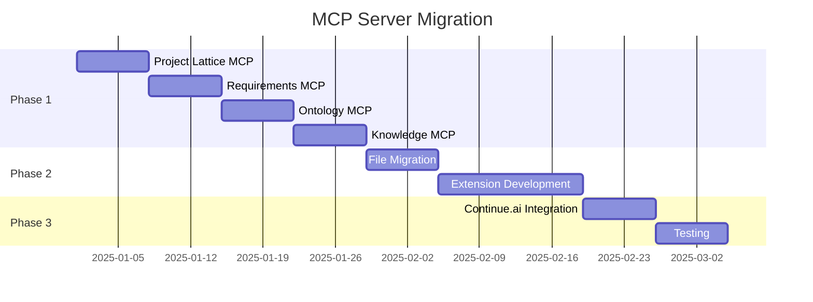
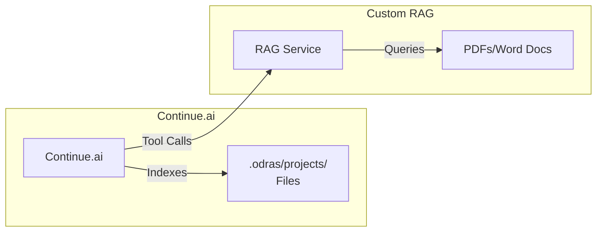

# ODRAS MCP Server Architecture
## Decoupled Extension-Based Architecture with Intelligent APIs

**Version:** 1.0  
**Date:** November 2025  
**Status:** Architectural Design

---

## Executive Summary

**IMPORTANT:** Read [ODRAS as a Standard](ODRAS_AS_STANDARD.md) first. ODRAS is not a monolithic system - it's a **standard architecture** for building domain-specific tools. People already understand this pattern (files, tools, extensions, workflows).

This document describes the technical implementation: transforming from a monolithic FastAPI backend to a distributed architecture of **Model Context Protocol (MCP) servers** that act as intelligent APIs. Each workbench becomes a VS Code extension paired with an MCP server, communicating via the MCP protocol. The traditional REST API disappears, replaced by intelligent, tool-based MCP servers that can be integrated with Continue.ai and other AI coding assistants.

**Key Innovation:** MCP servers act as "intelligent APIs" - they don't just expose endpoints, they understand context, validate operations, and can be queried conversationally by LLMs. **No separate DAS needed** - Continue.ai/Cursor provides the LLM layer, indexing, and conversation context.

**Core Principle:** Everything is files, tools, extensions, and workflows - a pattern everyone already knows.

---

## Table of Contents

1. [Architecture Overview](#architecture-overview)
2. [MCP Server Structure](#mcp-server-structure)
3. [Continue.ai Integration](#continueai-integration)
4. [LLM Provider Abstraction](#llm-provider-abstraction)
5. [File-Based Storage](#file-based-storage)
6. [Extension Architecture](#extension-architecture)
7. [Migration Path](#migration-path)
8. [Implementation Examples](#implementation-examples)
9. [Custom RAG vs Continue.ai](#custom-rag-vs-continueai)

**Related Documents:**
- [ODRAS as a Standard](ODRAS_AS_STANDARD.md): **READ THIS FIRST** - ODRAS is not a system, it's a standard architecture
- [RAG vs Continue.ai Analysis](RAG_VS_CONTINUE_AI_ANALYSIS.md): Detailed comparison and decision framework
- [User-Friendly Windows Setup](USER_FRIENDLY_WINDOWS_SETUP.md): Making ODRAS accessible for supply chain and program managers

---

## Architecture Overview

### Current State (Monolithic)



**Problems:**
- Tight coupling between workbenches
- Monolithic deployment
- Hard to extend
- API-first, not tool-first

### Target State (Distributed MCP Servers)



**Benefits:**
- ✅ Decoupled: Each server independent
- ✅ Tool-based: LLMs can use tools directly
- ✅ File-based: Version controllable
- ✅ Composable: Install only what you need
- ✅ Intelligent: Context-aware operations
- ✅ No separate DAS: Continue.ai/Cursor provides LLM + indexing
- ✅ Simpler: Fewer moving parts, native IDE integration

---

## MCP Server Structure

### Directory Structure

```
odras/
├── mcp-servers/                    # All MCP servers
│   ├── project-lattice/
│   │   ├── server.py              # MCP server implementation
│   │   ├── tools.py               # Tool definitions
│   │   ├── file_manager.py        # File-based storage
│   │   ├── relationship_validator.py
│   │   ├── lineage_queries.py
│   │   └── config.json            # Server configuration
│   │
│   ├── requirements/
│   │   ├── server.py
│   │   ├── tools.py
│   │   ├── file_manager.py
│   │   ├── extractor.py           # Optional LLM extraction (or Continue.ai does it)
│   │   ├── validator.py
│   │   └── config.json
│   │
│   ├── ontology/
│   │   ├── server.py
│   │   ├── tools.py
│   │   ├── fuseki_client.py
│   │   ├── sparql_engine.py
│   │   └── config.json
│   │
│   └── knowledge/
│       ├── server.py
│       ├── tools.py
│       ├── rag_tools.py           # Custom RAG tools (for documents/knowledge)
│       │                           # See RAG_VS_CONTINUE_AI_ANALYSIS.md for when to use
│       └── config.json
│
│   # NOTE: No DAS MCP Server - Continue.ai/Cursor provides:
│   # - LLM integration (OpenAI, Claude, Ollama, etc.)
│   # - Code/file indexing and search
│   # - Conversation context
│   # - Tool calling capabilities
│
├── vscode-extensions/              # VS Code extensions
│   ├── odras-requirements/
│   ├── odras-ontology/
│   ├── odras-project-lattice/
│   └── odras-knowledge/
│
└── shared/
    ├── mcp_base/                  # Base MCP server class
    ├── file_utils/                # File operations
    ├── llm_providers/             # LLM abstraction layer
    └── config/                    # Shared configuration
```

### MCP Server Base Class

```python
# shared/mcp_base/base_server.py
from mcp.server import Server
from mcp.types import Tool, TextContent
from typing import List, Dict, Any, Optional
from abc import ABC, abstractmethod

class BaseODRASMCPServer(ABC):
    """Base class for all ODRAS MCP servers"""
    
    def __init__(
        self,
        server_name: str,
        version: str = "1.0.0",
        description: str = ""
    ):
        self.server = Server(server_name)
        self.server_name = server_name
        self.version = version
        self.description = description
        self.tools: List[Tool] = []
        self.setup_tools()
        self.setup_handlers()
    
    @abstractmethod
    def get_tools(self) -> List[Tool]:
        """Define tools exposed by this server"""
        pass
    
    @abstractmethod
    async def execute_tool(
        self,
        name: str,
        arguments: Dict[str, Any],
        context: Optional[Dict[str, Any]] = None
    ) -> Dict[str, Any]:
        """Execute a tool"""
        pass
    
    def setup_tools(self):
        """Register tools with MCP server"""
        @self.server.list_tools()
        async def list_tools() -> List[Tool]:
            return self.get_tools()
    
    def setup_handlers(self):
        """Setup tool execution handlers"""
        @self.server.call_tool()
        async def call_tool(name: str, arguments: dict):
            return await self.execute_tool(name, arguments)
    
    async def run(self, transport: str = "stdio"):
        """Run the MCP server"""
        if transport == "stdio":
            from mcp.server.stdio import stdio_server
            async with stdio_server() as (read_stream, write_stream):
                await self.server.run(
                    read_stream,
                    write_stream,
                    self.server.create_initialization_options()
                )
        elif transport == "http":
            from mcp.server.http import http_server
            # HTTP server implementation
            pass
```

### Example: Project Lattice MCP Server

```python
# mcp-servers/project-lattice/server.py
from shared.mcp_base.base_server import BaseODRASMCPServer
from mcp.types import Tool
from typing import List, Dict, Any
import json
import os

class ProjectLatticeMCPServer(BaseODRASMCPServer):
    """MCP server for project lattice and relationship management"""
    
    def __init__(self):
        super().__init__(
            server_name="odras-project-lattice",
            version="1.0.0",
            description="Manages ODRAS project lattice, parent-child-cousin relationships"
        )
        self.workspace_root = os.getcwd()
        self.odras_dir = os.path.join(self.workspace_root, ".odras")
        self.projects_dir = os.path.join(self.odras_dir, "projects")
    
    def get_tools(self) -> List[Tool]:
        return [
            Tool(
                name="get_project_lineage",
                description="Get complete lineage (ancestors) of a project",
                inputSchema={
                    "type": "object",
                    "properties": {
                        "project_id": {
                            "type": "string",
                            "description": "Project ID to get lineage for"
                        },
                        "include_self": {
                            "type": "boolean",
                            "description": "Include the project itself in lineage",
                            "default": True
                        }
                    },
                    "required": ["project_id"]
                }
            ),
            Tool(
                name="get_project_descendants",
                description="Get all descendant projects (children, grandchildren, etc.)",
                inputSchema={
                    "type": "object",
                    "properties": {
                        "project_id": {
                            "type": "string",
                            "description": "Project ID to get descendants for"
                        },
                        "max_depth": {
                            "type": "integer",
                            "description": "Maximum depth to traverse",
                            "default": 10
                        }
                    },
                    "required": ["project_id"]
                }
            ),
            Tool(
                name="get_cousin_projects",
                description="Get all cousin projects (cross-domain relationships)",
                inputSchema={
                    "type": "object",
                    "properties": {
                        "project_id": {
                            "type": "string",
                            "description": "Project ID to get cousins for"
                        },
                        "relationship_type": {
                            "type": "string",
                            "description": "Filter by relationship type",
                            "enum": ["coordinates_with", "depends_on", "similar_to", None]
                        }
                    },
                    "required": ["project_id"]
                }
            ),
            Tool(
                name="add_parent_child_relationship",
                description="Add a parent-child relationship between projects",
                inputSchema={
                    "type": "object",
                    "properties": {
                        "parent_id": {
                            "type": "string",
                            "description": "Parent project ID"
                        },
                        "child_id": {
                            "type": "string",
                            "description": "Child project ID"
                        }
                    },
                    "required": ["parent_id", "child_id"]
                }
            ),
            Tool(
                name="add_cousin_relationship",
                description="Add a cousin relationship (cross-domain)",
                inputSchema={
                    "type": "object",
                    "properties": {
                        "source_id": {
                            "type": "string",
                            "description": "Source project ID"
                        },
                        "target_id": {
                            "type": "string",
                            "description": "Target project ID"
                        },
                        "relationship_type": {
                            "type": "string",
                            "description": "Type of relationship",
                            "enum": ["coordinates_with", "depends_on", "similar_to"],
                            "default": "coordinates_with"
                        },
                        "description": {
                            "type": "string",
                            "description": "Relationship description"
                        }
                    },
                    "required": ["source_id", "target_id"]
                }
            ),
            Tool(
                name="validate_relationship",
                description="Validate if a relationship can be created (checks rules)",
                inputSchema={
                    "type": "object",
                    "properties": {
                        "source_id": {"type": "string"},
                        "target_id": {"type": "string"},
                        "relationship_type": {
                            "type": "string",
                            "enum": ["parent", "cousin"]
                        }
                    },
                    "required": ["source_id", "target_id", "relationship_type"]
                }
            ),
            Tool(
                name="get_impact_analysis",
                description="Analyze impact of changes to a project",
                inputSchema={
                    "type": "object",
                    "properties": {
                        "project_id": {
                            "type": "string",
                            "description": "Project ID to analyze"
                        },
                        "analysis_type": {
                            "type": "string",
                            "enum": ["downstream", "upstream", "bidirectional"],
                            "default": "downstream"
                        }
                    },
                    "required": ["project_id"]
                }
            ),
            Tool(
                name="detect_circular_reference",
                description="Check if adding a relationship would create a circular reference",
                inputSchema={
                    "type": "object",
                    "properties": {
                        "source_id": {"type": "string"},
                        "target_id": {"type": "string"}
                    },
                    "required": ["source_id", "target_id"]
                }
            )
        ]
    
    async def execute_tool(
        self,
        name: str,
        arguments: Dict[str, Any],
        context: Optional[Dict[str, Any]] = None
    ) -> Dict[str, Any]:
        """Execute tool based on name"""
        
        if name == "get_project_lineage":
            return await self._get_lineage(
                arguments["project_id"],
                arguments.get("include_self", True)
            )
        
        elif name == "get_project_descendants":
            return await self._get_descendants(
                arguments["project_id"],
                arguments.get("max_depth", 10)
            )
        
        elif name == "get_cousin_projects":
            return await self._get_cousins(
                arguments["project_id"],
                arguments.get("relationship_type")
            )
        
        elif name == "add_parent_child_relationship":
            return await self._add_parent_child(
                arguments["parent_id"],
                arguments["child_id"]
            )
        
        elif name == "add_cousin_relationship":
            return await self._add_cousin(
                arguments["source_id"],
                arguments["target_id"],
                arguments.get("relationship_type", "coordinates_with"),
                arguments.get("description", "")
            )
        
        elif name == "validate_relationship":
            return await self._validate_relationship(
                arguments["source_id"],
                arguments["target_id"],
                arguments["relationship_type"]
            )
        
        elif name == "get_impact_analysis":
            return await self._get_impact_analysis(
                arguments["project_id"],
                arguments.get("analysis_type", "downstream")
            )
        
        elif name == "detect_circular_reference":
            return await self._detect_circular_reference(
                arguments["source_id"],
                arguments["target_id"]
            )
        
        else:
            raise ValueError(f"Unknown tool: {name}")
    
    async def _get_lineage(self, project_id: str, include_self: bool) -> Dict[str, Any]:
        """Get project lineage by reading relationships.json files"""
        lineage = []
        current_id = project_id
        
        while current_id:
            project_path = os.path.join(self.projects_dir, current_id)
            relationships_file = os.path.join(project_path, "relationships.json")
            
            if not os.path.exists(relationships_file):
                break
            
            with open(relationships_file, 'r') as f:
                rel_data = json.load(f)
            
            project_file = os.path.join(project_path, "project.json")
            if os.path.exists(project_file):
                with open(project_file, 'r') as f:
                    project_data = json.load(f)
                    if include_self or current_id != project_id:
                        lineage.append(project_data)
            
            current_id = rel_data.get("parent_project_id")
            if current_id == project_id:  # Prevent infinite loops
                break
        
        return {"lineage": lineage}
    
    async def _add_parent_child(
        self,
        parent_id: str,
        child_id: str
    ) -> Dict[str, Any]:
        """Add parent-child relationship"""
        # 1. Validate
        validation = await self._validate_relationship(
            parent_id, child_id, "parent"
        )
        if not validation["valid"]:
            return {
                "success": False,
                "error": validation["error"]
            }
        
        # 2. Update child's relationships.json
        child_path = os.path.join(self.projects_dir, child_id)
        os.makedirs(child_path, exist_ok=True)
        rel_file = os.path.join(child_path, "relationships.json")
        
        if os.path.exists(rel_file):
            with open(rel_file, 'r') as f:
                rel_data = json.load(f)
        else:
            rel_data = {
                "parent_project_id": None,
                "child_project_ids": [],
                "cousin_relationships": []
            }
        
        rel_data["parent_project_id"] = parent_id
        
        with open(rel_file, 'w') as f:
            json.dump(rel_data, f, indent=2)
        
        # 3. Update parent's relationships.json
        parent_path = os.path.join(self.projects_dir, parent_id)
        os.makedirs(parent_path, exist_ok=True)
        parent_rel_file = os.path.join(parent_path, "relationships.json")
        
        if os.path.exists(parent_rel_file):
            with open(parent_rel_file, 'r') as f:
                parent_rel_data = json.load(f)
        else:
            parent_rel_data = {
                "parent_project_id": None,
                "child_project_ids": [],
                "cousin_relationships": []
            }
        
        if child_id not in parent_rel_data["child_project_ids"]:
            parent_rel_data["child_project_ids"].append(child_id)
        
        with open(parent_rel_file, 'w') as f:
            json.dump(parent_rel_data, f, indent=2)
        
        return {
            "success": True,
            "parent_id": parent_id,
            "child_id": child_id
        }
    
    # ... more methods

if __name__ == "__main__":
    server = ProjectLatticeMCPServer()
    import asyncio
    asyncio.run(server.run())
```

---

## Continue.ai Integration

### Architecture with Continue.ai (No Separate DAS Needed)



**Key Insight:** Continue.ai/Cursor already provides:
- ✅ **LLM Integration**: OpenAI, Claude, Ollama, etc.
- ✅ **Code Indexing**: Indexes all files in workspace
- ✅ **Vector Search**: Built-in semantic search over code/files
- ✅ **Conversation Context**: Maintains conversation history
- ✅ **Tool Calling**: Can call MCP tools directly

**What ODRAS MCP Servers Provide:**
- ✅ **ODRAS-Specific Tools**: Project operations, requirements, ontologies
- ✅ **Business Logic**: Validation, relationship rules, etc.
- ✅ **Optional RAG**: Advanced semantic search over knowledge base (if needed)

### Continue.ai Configuration

```json
// .continue/config.json
{
  "models": [
    {
      "title": "OpenAI GPT-4",
      "provider": "openai",
      "model": "gpt-4o",
      "apiKey": "${OPENAI_API_KEY}"
    },
    {
      "title": "Claude Sonnet",
      "provider": "anthropic",
      "model": "claude-sonnet-4-20250514",
      "apiKey": "${ANTHROPIC_API_KEY}"
    },
    {
      "title": "Local Ollama",
      "provider": "ollama",
      "model": "llama3.1:70b",
      "apiBase": "http://localhost:11434"
    }
  ],
    "mcpServers": {
      "odras-project-lattice": {
        "command": "python",
        "args": [
          "-m",
          "odras.mcp_servers.project_lattice.server"
        ],
        "env": {
          "ODRAS_WORKSPACE": "${workspaceFolder}"
        }
      },
      "odras-requirements": {
        "command": "python",
        "args": [
          "-m",
          "odras.mcp_servers.requirements.server"
        ],
        "env": {
          "ODRAS_WORKSPACE": "${workspaceFolder}"
          // Note: No LLM config needed - Continue.ai provides LLM
        }
      },
      "odras-ontology": {
        "command": "python",
        "args": [
          "-m",
          "odras.mcp_servers.ontology.server"
        ],
        "env": {
          "ODRAS_WORKSPACE": "${workspaceFolder}",
          "FUSEKI_URL": "http://localhost:3030/odras"
        }
      },
      "odras-knowledge": {
        "command": "python",
        "args": [
          "-m",
          "odras.mcp_servers.knowledge.server"
        ],
        "env": {
          "ODRAS_WORKSPACE": "${workspaceFolder}",
          "QDRANT_URL": "http://localhost:6333"
          // Optional: Only if advanced RAG needed beyond Continue.ai indexing
        }
      }
    },
    
    // Continue.ai automatically indexes .odras/projects/ files
    // No separate DAS needed - Continue.ai provides:
    // - LLM (configured above in models section)
    // - File indexing and search
    // - Conversation context
    // - Tool calling to MCP servers
  "customCommands": [
    {
      "name": "Create Project Lattice",
      "prompt": "Use the odras-project-lattice MCP server to create a new project lattice structure based on the requirements in the current file."
    },
    {
      "name": "Extract Requirements",
      "prompt": "Use the odras-requirements MCP server to extract requirements from the current document and save them to .odras/projects/{project_id}/requirements/"
    }
  ]
}
```

### How Continue.ai Uses MCP Servers

**Example Conversation:**

```
User: "Create a new L1 project called 'SE Domain' that is a child of the Core project"

Continue.ai (thinking):
1. Need to call odras-project-lattice MCP server
2. Tool: add_parent_child_relationship
3. But first need to create the project
4. Actually, need create_project tool first

Continue.ai → MCP Server:
{
  "tool": "create_project",
  "arguments": {
    "name": "SE Domain",
    "project_level": 1,
    "domain": "systems-engineering",
    "parent_id": "l0-core"
  }
}

MCP Server → Continue.ai:
{
  "project_id": "l1-se-domain",
  "file_path": ".odras/projects/l1-se-domain/project.json"
}

Continue.ai → User:
"Created project 'SE Domain' at .odras/projects/l1-se-domain/. 
The project is now linked as a child of Core project."
```

---

## LLM Provider Abstraction (Optional - For MCP Servers That Need LLM)

**Note:** Most MCP servers don't need LLM providers - Continue.ai/Cursor provides the LLM layer. Only use LLM providers in MCP servers for:
- **Requirements Extraction**: When extracting requirements from documents
- **Advanced RAG**: When needing specialized RAG beyond Continue.ai's indexing
- **Autonomous Operations**: When MCP server needs to make LLM calls independently

For most cases, **Continue.ai calls MCP tools, and MCP tools operate on files/data**.

### When to Use LLM in MCP Servers



**Decision Tree:**
- **File operations** → No LLM needed in MCP server
- **Validation** → No LLM needed (business logic)
- **Extraction from documents** → Optional LLM in MCP server (or Continue.ai does it)
- **Advanced semantic search** → Optional LLM in MCP server (or use Continue.ai indexing)

### Provider Interface (For Optional LLM Usage)

```python
# shared/llm_providers/base.py
from abc import ABC, abstractmethod
from typing import List, Dict, Any, Optional, AsyncIterator
from enum import Enum

class LLMProviderType(Enum):
    OPENAI = "openai"
    ANTHROPIC = "anthropic"
    OLLAMA = "ollama"
    AZURE_OPENAI = "azure_openai"
    GOOGLE = "google"

class LLMMessage:
    """Standardized LLM message format"""
    def __init__(
        self,
        role: str,  # "system", "user", "assistant", "tool"
        content: str,
        tool_calls: Optional[List[Dict[str, Any]]] = None,
        tool_call_id: Optional[str] = None
    ):
        self.role = role
        self.content = content
        self.tool_calls = tool_calls or []
        self.tool_call_id = tool_call_id

class LLMResponse:
    """Standardized LLM response format"""
    def __init__(
        self,
        content: str,
        tool_calls: Optional[List[Dict[str, Any]]] = None,
        finish_reason: str = "stop",
        usage: Optional[Dict[str, Any]] = None
    ):
        self.content = content
        self.tool_calls = tool_calls or []
        self.finish_reason = finish_reason
        self.usage = usage or {}

class LLMProvider(ABC):
    """Abstract base class for LLM providers"""
    
    @abstractmethod
    async def chat(
        self,
        messages: List[LLMMessage],
        model: Optional[str] = None,
        temperature: float = 0.7,
        max_tokens: Optional[int] = None,
        tools: Optional[List[Dict[str, Any]]] = None,
        stream: bool = False
    ) -> LLMResponse:
        """Send chat completion request"""
        pass
    
    @abstractmethod
    async def stream_chat(
        self,
        messages: List[LLMMessage],
        model: Optional[str] = None,
        temperature: float = 0.7,
        max_tokens: Optional[int] = None,
        tools: Optional[List[Dict[str, Any]]] = None
    ) -> AsyncIterator[str]:
        """Stream chat completion"""
        pass
    
    @abstractmethod
    def get_available_models(self) -> List[str]:
        """Get list of available models"""
        pass
```

### Provider Implementations

```python
# shared/llm_providers/openai_provider.py
import openai
from shared.llm_providers.base import LLMProvider, LLMMessage, LLMResponse

class OpenAIProvider(LLMProvider):
    def __init__(self, api_key: str, base_url: Optional[str] = None):
        self.client = openai.AsyncOpenAI(
            api_key=api_key,
            base_url=base_url
        )
    
    async def chat(
        self,
        messages: List[LLMMessage],
        model: Optional[str] = None,
        temperature: float = 0.7,
        max_tokens: Optional[int] = None,
        tools: Optional[List[Dict[str, Any]]] = None,
        stream: bool = False
    ) -> LLMResponse:
        # Convert messages to OpenAI format
        openai_messages = [
            {
                "role": msg.role,
                "content": msg.content,
                **({"tool_calls": msg.tool_calls} if msg.tool_calls else {}),
                **({"tool_call_id": msg.tool_call_id} if msg.tool_call_id else {})
            }
            for msg in messages
        ]
        
        response = await self.client.chat.completions.create(
            model=model or "gpt-4o",
            messages=openai_messages,
            temperature=temperature,
            max_tokens=max_tokens,
            tools=tools,
            stream=stream
        )
        
        if stream:
            # Handle streaming
            pass
        
        return LLMResponse(
            content=response.choices[0].message.content or "",
            tool_calls=[
                {
                    "id": tc.id,
                    "type": tc.type,
                    "function": {
                        "name": tc.function.name,
                        "arguments": tc.function.arguments
                    }
                }
                for tc in response.choices[0].message.tool_calls or []
            ],
            finish_reason=response.choices[0].finish_reason,
            usage={
                "prompt_tokens": response.usage.prompt_tokens,
                "completion_tokens": response.usage.completion_tokens,
                "total_tokens": response.usage.total_tokens
            }
        )
    
    def get_available_models(self) -> List[str]:
        return [
            "gpt-4o",
            "gpt-4o-mini",
            "gpt-4-turbo",
            "gpt-3.5-turbo"
        ]

# shared/llm_providers/ollama_provider.py
import httpx
from shared.llm_providers.base import LLMProvider, LLMMessage, LLMResponse

class OllamaProvider(LLMProvider):
    def __init__(self, base_url: str = "http://localhost:11434"):
        self.base_url = base_url
        self.client = httpx.AsyncClient(base_url=base_url)
    
    async def chat(
        self,
        messages: List[LLMMessage],
        model: Optional[str] = None,
        temperature: float = 0.7,
        max_tokens: Optional[int] = None,
        tools: Optional[List[Dict[str, Any]]] = None,
        stream: bool = False
    ) -> LLMResponse:
        # Convert messages to Ollama format
        ollama_messages = [
            {
                "role": msg.role,
                "content": msg.content
            }
            for msg in messages
        ]
        
        response = await self.client.post(
            "/api/chat",
            json={
                "model": model or "llama3.1:70b",
                "messages": ollama_messages,
                "options": {
                    "temperature": temperature,
                    "num_predict": max_tokens
                },
                "stream": stream
            }
        )
        
        result = response.json()
        
        return LLMResponse(
            content=result["message"]["content"],
            finish_reason="stop",
            usage={
                "prompt_tokens": result.get("prompt_eval_count", 0),
                "completion_tokens": result.get("eval_count", 0),
                "total_tokens": result.get("prompt_eval_count", 0) + result.get("eval_count", 0)
            }
        )
    
    def get_available_models(self) -> List[str]:
        # Fetch from Ollama API
        response = httpx.get(f"{self.base_url}/api/tags")
        models = response.json().get("models", [])
        return [m["name"] for m in models]

# shared/llm_providers/provider_factory.py
from shared.llm_providers.base import LLMProvider, LLMProviderType
from shared.llm_providers.openai_provider import OpenAIProvider
from shared.llm_providers.ollama_provider import OllamaProvider
from shared.llm_providers.anthropic_provider import AnthropicProvider
import os

class LLMProviderFactory:
    """Factory for creating LLM providers"""
    
    @staticmethod
    def create_provider(
        provider_type: LLMProviderType,
        **kwargs
    ) -> LLMProvider:
        """Create LLM provider instance"""
        
        if provider_type == LLMProviderType.OPENAI:
            api_key = kwargs.get("api_key") or os.getenv("OPENAI_API_KEY")
            base_url = kwargs.get("base_url")
            return OpenAIProvider(api_key=api_key, base_url=base_url)
        
        elif provider_type == LLMProviderType.OLLAMA:
            base_url = kwargs.get("base_url") or os.getenv("OLLAMA_URL", "http://localhost:11434")
            return OllamaProvider(base_url=base_url)
        
        elif provider_type == LLMProviderType.ANTHROPIC:
            api_key = kwargs.get("api_key") or os.getenv("ANTHROPIC_API_KEY")
            return AnthropicProvider(api_key=api_key)
        
        else:
            raise ValueError(f"Unknown provider type: {provider_type}")
    
    @staticmethod
    def create_from_config(config: Dict[str, Any]) -> LLMProvider:
        """Create provider from configuration"""
        provider_type = LLMProviderType(config["provider"])
        return LLMProviderFactory.create_provider(provider_type, **config)
```

### Using LLM Providers in MCP Servers (Optional Pattern)

**Preferred Approach:** Let Continue.ai handle LLM operations

```python
# mcp-servers/requirements/server.py
# Most tools don't need LLM - Continue.ai provides it

class RequirementsMCPServer(BaseODRASMCPServer):
    def __init__(self):
        super().__init__(
            server_name="odras-requirements",
            version="1.0.0"
        )
        # No LLM provider needed - Continue.ai provides LLM
    
    async def execute_tool(
        self,
        name: str,
        arguments: Dict[str, Any],
        context: Optional[Dict[str, Any]] = None
    ) -> Dict[str, Any]:
        if name == "create_requirement":
            # Simple file operation - no LLM needed
            return await self._create_requirement(arguments)
        
        elif name == "list_requirements":
            # Read files - no LLM needed
            return await self._list_requirements(arguments)
        
        elif name == "extract_requirements":
            # OPTION 1: Continue.ai does extraction, calls save_requirement
            # OPTION 2: MCP server can do extraction if needed
            return await self._extract_requirements(arguments)
        
        # ... other tools
    
    async def _create_requirement(self, args: Dict[str, Any]) -> Dict[str, Any]:
        """Create requirement from provided data (no LLM needed)"""
        project_id = args["project_id"]
        req_data = args["requirement"]
        
        # Validate
        if not self._validate_requirement(req_data):
            return {"success": False, "error": "Invalid requirement data"}
        
        # Save to file
        req_file = await self._save_requirement(project_id, req_data)
        
        return {
            "success": True,
            "requirement_id": req_data["id"],
            "file_path": req_file
        }
    
    async def _extract_requirements(self, args: Dict[str, Any]) -> Dict[str, Any]:
        """
        Extract requirements from document.
        
        NOTE: This is OPTIONAL. Continue.ai can:
        1. Read the document
        2. Use its LLM to extract requirements
        3. Call create_requirement tool for each one
        
        This tool is only needed if you want extraction as a single atomic operation.
        """
        # If extraction needed, can use LLM provider here
        # But Continue.ai can do this too!
        pass
```

**Better Pattern: Continue.ai Handles Extraction**

```typescript
// Continue.ai conversation:
User: "Extract requirements from the current document"

Continue.ai:
1. Reads current file
2. Uses its LLM to extract requirements
3. For each requirement:
   - Calls odras-requirements MCP tool: create_requirement
4. Returns summary

// No LLM needed in MCP server!
```

---

## File-Based Storage

### Project Structure

```
workspace/
├── .odras/
│   ├── config.json                    # Global ODRAS config
│   │
│   ├── projects/
│   │   ├── l0-core/
│   │   │   ├── project.json          # Project metadata
│   │   │   ├── relationships.json    # Parent/child/cousin links
│   │   │   │
│   │   │   ├── ontologies/
│   │   │   │   ├── core.owl          # OWL ontology file
│   │   │   │   └── index.json        # Ontology registry
│   │   │   │
│   │   │   ├── requirements/
│   │   │   │   ├── REQ-001.md        # Individual requirement
│   │   │   │   ├── REQ-002.md
│   │   │   │   └── index.json        # Requirements index
│   │   │   │
│   │   │   ├── knowledge/
│   │   │   │   ├── documents/
│   │   │   │   │   ├── spec-001.pdf
│   │   │   │   │   └── guide.md
│   │   │   │   └── index.json        # Knowledge assets index
│   │   │   │
│   │   │   ├── individuals/
│   │   │   │   ├── components.json   # Component individuals
│   │   │   │   ├── functions.json    # Function individuals
│   │   │   │   └── index.json
│   │   │   │
│   │   │   └── workflows/
│   │   │       └── *.bpmn            # BPMN workflow files
│   │   │
│   │   └── l1-se-domain/
│   │       ├── project.json
│   │       ├── relationships.json    # References l0-core as parent
│   │       └── ...
│   │
│   └── lattice.json                   # Global lattice view (cached)
│
└── [your source code]
```

### File Formats

#### project.json
```json
{
  "project_id": "l0-core",
  "name": "Core",
  "description": "Foundational systems engineering knowledge",
  "domain": "foundational",
  "project_level": 0,
  "namespace_id": "ns-foundational",
  "status": "active",
  "publication_status": "published",
  "created_at": "2025-01-01T00:00:00Z",
  "created_by": "user_id",
  "updated_at": "2025-01-15T10:30:00Z",
  "iri": "http://localhost:8000/odras/projects/l0-core"
}
```

#### relationships.json
```json
{
  "parent_project_id": null,
  "child_project_ids": [
    "l1-se-domain",
    "l1-cost-domain"
  ],
  "cousin_relationships": [
    {
      "target_project_id": "l1-cost-domain",
      "relationship_type": "coordinates_with",
      "description": "Cross-domain coordination for cost estimates",
      "created_at": "2025-01-10T14:20:00Z",
      "created_by": "user_id"
    }
  ]
}
```

#### requirements/REQ-001.md
```markdown
---
id: REQ-001
title: System shall provide GPS navigation
type: functional
priority: high
state: approved
verification_method: test
verification_status: passed
tags: [navigation, gps, core]
parent_requirement_id: null
derived_from_requirement_id: null
created_at: 2025-01-05T09:00:00Z
created_by: user_id
updated_at: 2025-01-10T15:30:00Z
---

## Requirement Text

The system shall provide GPS-based navigation capabilities with accuracy 
within 10 meters under normal operating conditions.

## Rationale

GPS navigation is a core capability required for mission success. The 
10-meter accuracy requirement ensures adequate positioning for navigation 
and waypoint tracking.

## Verification

Verification shall be performed through field testing using standard GPS 
test equipment. The system must demonstrate 10-meter accuracy in 95% of 
test cases.
```

---

## Extension Architecture

### VS Code Extension Structure

```typescript
// vscode-extensions/odras-project-lattice/src/extension.ts
import * as vscode from 'vscode';
import { MCPClient } from '@modelcontextprotocol/sdk/client';

export function activate(context: vscode.ExtensionContext) {
    // Initialize MCP client
    const mcpClient = new MCPClient({
        name: 'odras-project-lattice',
        version: '1.0.0'
    });
    
    // Connect to MCP server
    await mcpClient.connect({
        transport: 'stdio',
        command: 'python',
        args: ['-m', 'odras.mcp_servers.project_lattice.server']
    });
    
    // Register tree view
    const treeProvider = new ProjectLatticeTreeProvider(mcpClient);
    vscode.window.registerTreeDataProvider('odrasProjectLattice', treeProvider);
    
    // Register commands
    vscode.commands.registerCommand(
        'odras.addParentChild',
        async () => {
            const parentId = await vscode.window.showInputBox({
                prompt: 'Parent Project ID'
            });
            const childId = await vscode.window.showInputBox({
                prompt: 'Child Project ID'
            });
            
            const result = await mcpClient.callTool({
                name: 'add_parent_child_relationship',
                arguments: {
                    parent_id: parentId!,
                    child_id: childId!
                }
            });
            
            if (result.success) {
                vscode.window.showInformationMessage('Relationship added');
                treeProvider.refresh();
            } else {
                vscode.window.showErrorMessage(result.error);
            }
        }
    );
}

class ProjectLatticeTreeProvider implements vscode.TreeDataProvider<ProjectNode> {
    constructor(private mcpClient: MCPClient) {}
    
    async getChildren(node?: ProjectNode): Promise<ProjectNode[]> {
        if (!node) {
            // Root: Get all L0 projects
            const result = await this.mcpClient.callTool({
                name: 'get_root_projects',
                arguments: {}
            });
            return result.projects.map(p => new ProjectNode(p));
        }
        
        // Get children
        const result = await this.mcpClient.callTool({
            name: 'get_project_descendants',
            arguments: {
                project_id: node.projectId,
                max_depth: 1
            }
        });
        return result.projects.map(p => new ProjectNode(p));
    }
    
    getTreeItem(node: ProjectNode): vscode.TreeItem {
        return node;
    }
}
```

---

## Migration Path

### Phase 1: Extract MCP Servers (Weeks 1-4)



**Week 1-2: Project Lattice MCP**
- Extract relationship logic from `backend/api/project_relationships.py`
- Create `mcp-servers/project-lattice/`
- Implement file-based storage
- Test with VS Code extension

**Week 3-4: Requirements MCP**
- Extract from `backend/api/requirements.py`
- Implement file-based requirements storage
- Optional: Add LLM extraction (or let Continue.ai handle it)
- Test extraction workflows

**Week 5-6: Ontology & Knowledge MCPs**
- Extract ontology operations
- Extract knowledge/RAG operations
- Maintain Fuseki/Qdrant integration

### Phase 2: File Migration (Week 7)

**Migration Script:**
```python
# scripts/migrate_to_files.py
async def migrate_project_to_files(project_id: str):
    """Migrate project from database to files"""
    # 1. Load from database
    project = db.get_project(project_id)
    relationships = db.get_relationships(project_id)
    requirements = db.get_requirements(project_id)
    
    # 2. Create directory structure
    project_dir = f".odras/projects/{project_id}"
    os.makedirs(project_dir, exist_ok=True)
    
    # 3. Write project.json
    with open(f"{project_dir}/project.json", 'w') as f:
        json.dump(project.to_dict(), f, indent=2)
    
    # 4. Write relationships.json
    with open(f"{project_dir}/relationships.json", 'w') as f:
        json.dump(relationships.to_dict(), f, indent=2)
    
    # 5. Write requirements as markdown files
    req_dir = f"{project_dir}/requirements"
    os.makedirs(req_dir, exist_ok=True)
    for req in requirements:
        req_file = f"{req_dir}/{req.identifier}.md"
        write_requirement_markdown(req_file, req)
    
    # 6. Update index files
    update_index_files(project_dir)
```

### Phase 3: Continue.ai Integration (Week 8)

1. **Configure Continue.ai** with MCP servers
2. **Test conversational interactions**
3. **Create custom commands** for common workflows
4. **Document usage patterns**

### Phase 4: Deprecate FastAPI (Week 9+)

- Keep FastAPI as optional gateway for legacy clients
- All new development uses MCP servers
- Gradually migrate remaining endpoints

---

## Implementation Examples

### Example 1: Creating a Project via Continue.ai

**User:** "Create a new L2 project called 'UAV Navigation' that is a child of the SE Domain project"

**Continue.ai Process:**
1. **Discover available tools** from `odras-project-lattice` MCP server
2. **Call tool:** `create_project` with arguments
3. **MCP server:**
   - Validates parent relationship
   - Creates `.odras/projects/l2-uav-navigation/` directory
   - Writes `project.json` and `relationships.json`
   - Updates parent's `relationships.json`
4. **Returns:** Project ID and file paths
5. **Continue.ai:** Confirms creation and shows file structure

### Example 2: Extracting Requirements (Continue.ai Does LLM Work)

**User:** "Extract requirements from the current document"

**Continue.ai Process:**
1. **Reads current file** (document with requirements text)
2. **Uses its own LLM** to extract requirements from document
3. **For each extracted requirement:**
   - Calls `create_requirement` tool from `odras-requirements` MCP server
   - MCP server validates and saves to `.odras/projects/{id}/requirements/REQ-XXX.md`
4. **Continue.ai:** Shows extracted requirements and file locations

**Key Point:** Continue.ai provides the LLM, MCP server just saves files!

### Example 3: Querying Relationships

**User:** "What projects depend on the Core project?"

**Continue.ai Process:**
1. **Calls tool:** `get_project_descendants` from `odras-project-lattice` MCP server
2. **MCP server:**
   - Reads `relationships.json` files
   - Traverses parent-child links
   - Returns all descendants
3. **Continue.ai:** Lists dependent projects in response

---

## Benefits Summary

### For Developers
- ✅ **Code-based UI**: Everything in VS Code extensions
- ✅ **File-based**: Version control everything
- ✅ **Composable**: Install only what you need
- ✅ **Testable**: Test MCP servers independently
- ✅ **Extensible**: Add new workbenches easily

### For AI Assistants (Continue.ai/Cursor)
- ✅ **Tool-based**: LLMs can use tools directly
- ✅ **Context-aware**: Continue.ai indexes files, MCP servers understand relationships
- ✅ **Intelligent**: Validation and business logic in servers
- ✅ **Conversational**: Natural language → tool calls
- ✅ **No separate DAS**: Continue.ai provides LLM + indexing + context
- ✅ **Simpler**: Fewer components, native IDE integration

### For Users
- ✅ **Transparent**: See all files in workspace
- ✅ **Portable**: Copy folder = copy project
- ✅ **Searchable**: VS Code indexes everything
- ✅ **Integrated**: Works with Git, search, etc.

---

## Next Steps

1. **Implement Base MCP Server Class**
2. **Build Project Lattice MCP Server** (first example)
3. **Create VS Code Extension** for project lattice
4. **Configure Continue.ai** integration
5. **Migrate one workbench** (Requirements) as proof of concept
6. **Document patterns** for other workbenches

---

## Conclusion

By transforming ODRAS into a distributed MCP server architecture:

- **The API disappears** → Replaced by intelligent MCP servers
- **Everything becomes extensions** → VS Code extensions + MCP servers
- **File-based storage** → Version controllable, transparent
- **Continue.ai integration** → Natural language → tool calls
- **No separate DAS needed** → Continue.ai/Cursor provides LLM + indexing + context
- **Simpler architecture** → Fewer components, native IDE integration

### Key Architectural Insight

**Continue.ai/Cursor already provides:**
- ✅ LLM integration (OpenAI, Claude, Ollama, etc.)
- ✅ Code/file indexing and semantic search
- ✅ Conversation context and memory
- ✅ Tool calling capabilities

**ODRAS MCP Servers provide:**
- ✅ ODRAS-specific tools (projects, requirements, ontologies)
- ✅ Business logic and validation
- ✅ File operations on `.odras/projects/` structure
- ✅ Optional advanced RAG (if needed beyond Continue.ai indexing)

**Result:** Simpler, more integrated architecture where Continue.ai is the intelligence layer and MCP servers are the tool layer.

This architecture aligns perfectly with modern development workflows where code, AI assistants, and tools are integrated seamlessly in the IDE.

---

## Custom RAG vs Continue.ai

### When to Use Each

**Continue.ai Indexing (Default):**
- ✅ File-based artifacts (`.odras/projects/` files)
- ✅ Code understanding and navigation
- ✅ Simple queries over files
- ✅ Zero maintenance

**Custom RAG (Optional, for Advanced Use Cases):**
- ✅ Large documents (PDFs, Word docs)
- ✅ Domain-specific knowledge retrieval
- ✅ Semantic search over requirements
- ✅ LLM team coordination
- ✅ Advanced RAG techniques (hybrid search, re-ranking)

### Decision Framework

See [RAG_VS_CONTINUE_AI_ANALYSIS.md](RAG_VS_CONTINUE_AI_ANALYSIS.md) for detailed comparison and decision framework.

**Quick Rule:**
- **Files** → Continue.ai indexes automatically
- **Documents** → Custom RAG pipeline (optional)
- **Simple queries** → Continue.ai
- **Complex semantic search** → Custom RAG

### Hybrid Architecture



**Result:** Best of both worlds - Continue.ai for files, Custom RAG for documents.
