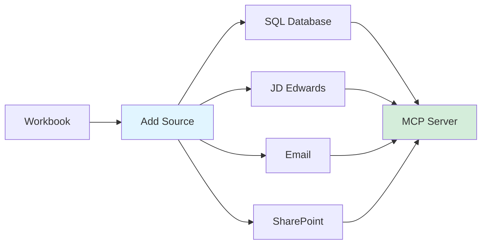
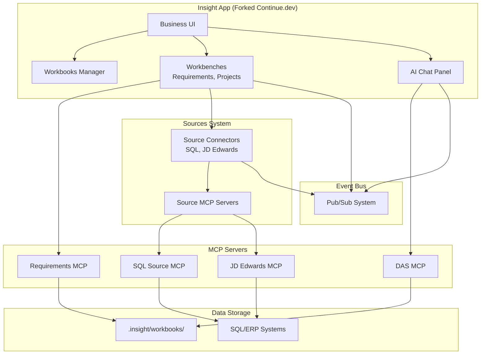
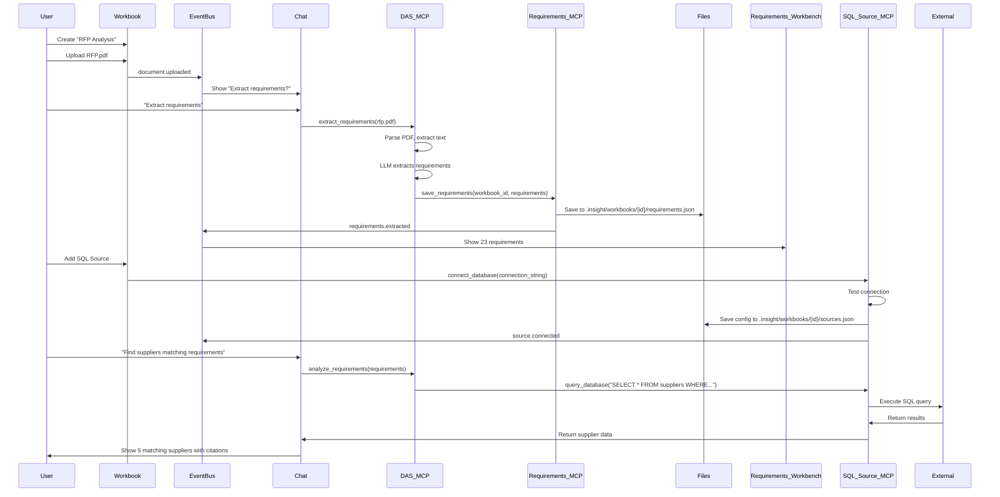

# MVP Plan: Insight Platform Demonstrator
**NotebookLM-style platform → Enterprise engineering suite**

---

## Terminology

- **Workbooks** = Projects/Notebooks (like NotebookLM notebooks)
- **Workbenches** = Tools/Tabs (Requirements, Projects, Suppliers, etc.)
- **Sources** = Data connectors (SQL, JD Edwards, Email, SharePoint, etc.)

---

## Target User & Value Proposition

### User: Program Manager
**Core Workflow:**
1. Upload RFP.pdf to new Workbook
2. Chat: "Extract requirements"
3. DAS extracts 23 requirements → Requirements Workbench
4. Click "Generate Project Structure"
5. DAS creates project lattice → Projects Workbench
6. Add SQL Source → Query suppliers database
7. Chat: "Find suppliers matching requirements"
8. Results saved to `.insight/workbooks/demo/`

**Value Prop:** "From 4 days to 20 minutes: Extract requirements, structure projects, find suppliers"

---

## MVP Scope

### ✅ Must Have (Core Demo)

#### 1. Fork Continue.dev & Rebrand
- Clone Continue.dev
- Change branding: "Insight" (or chosen name)
- Hide VS Code developer features
- **Timeline:** 1 week

#### 2. NotebookLM-Style Chat
- Upload documents (PDF, Word)
- Chat with documents (semantic search)
- Cited answers with source references
- **Timeline:** 1 week

#### 3. Workbooks System
- Create new Workbook
- Save to `.insight/workbooks/{workbook-id}/`
- Workbook = container for documents, chat history, workbench data
- **Timeline:** 1 week

#### 4. Sources/Connectors (Like NotebookLM)

**MVP Sources:**
- **SQL Database** (PostgreSQL, SQL Server)
  - Connection config UI
  - Query via MCP server
  - Results available in chat context
- **JD Edwards** (via API or database)
  - Connection config
  - Query via MCP server
  - Results available in chat context

**Timeline:** 2 weeks (1 week per source type)

#### 5. Workbenches (2 minimum)
- **Requirements Workbench**
  - View extracted requirements
  - Edit, filter, export
  - Visual list/grid view
- **Projects Workbench**
  - View project lattice/structure
  - Visual graph representation
  - Export to JSON

**Timeline:** 2 weeks (1 week per workbench)

#### 6. MCP Servers
- **DAS MCP** (Domain Assistant)
  - `extract_requirements(document_path)`
  - `generate_project_lattice(requirements)`
  - `analyze_document(document_path)`
- **Requirements MCP**
  - `get_requirements(workbook_id)`
  - `search_requirements(query, workbook_id)`
- **SQL Source MCP**
  - `connect_database(connection_string)`
  - `query_database(query, connection_id)`
  - `list_tables(connection_id)`
- **JD Edwards Source MCP**
  - `connect_jde(config)`
  - `query_jde(endpoint, params)`

**Timeline:** 3 weeks (DAS: 1.5 weeks, Requirements: 0.5 weeks, SQL: 0.5 weeks, JDE: 0.5 weeks)

#### 7. Event Bus
- Cross-workbench communication
- Simple pub/sub system
- Events: `document.uploaded`, `requirements.extracted`, `source.connected`
- **Timeline:** 1 week

#### 8. Document Parsing
- PDF extraction (pypdf)
- Word extraction (python-docx)
- Store text in workbook
- **Timeline:** 1 week

---

### ⚠️ Nice to Have (Show Growth Path)

- Second source type (Email or SharePoint)
- Third workbench (Suppliers or Compliance)
- Visual graph rendering (Cytoscape.js for project lattice)
- Persona system (switch between PM, Supply Chain, Compliance)
- Workflow automation (BPMN integration)

---

## Architecture

---

## Data Flow Example

---

## MVP Timeline

| Week | Task | Deliverable |
|------|------|-------------|
| 1 | Fork Continue.dev, rebrand | Working Insight app |
| 2 | Document upload + chat | Can upload PDF, chat with it |
| 3 | Workbooks system | Create/save workbooks |
| 4-5 | Sources system (SQL + JDE) | Can connect SQL, query via chat |
| 6-7 | Workbenches (Requirements + Projects) | 2 workbenches functional |
| 8-10 | MCP servers (DAS, Requirements, SQL, JDE) | All MCP servers working |
| 11 | Event bus | Cross-workbench communication |
| 12 | Document parsing | PDF/Word extraction |
| 13-14 | Integration + polish | End-to-end demo works |
| **Total** | **14 weeks** | **MVP Complete** |

---

## Technical Gaps

### ✅ Covered
- Fork Continue.dev (straightforward)
- MCP integration (built into Continue.dev)
- AI chat (built into Continue.dev)
- Extension system (VS Code extensions)

### ⚠️ Need to Build

#### 1. Sources UI
**Problem:** Need UI to add/configure sources

**Solution:** Source manager workbench
- "Add Source" button
- Connection form (host, port, credentials)
- Test connection
- List connected sources
- Remove sources

**Effort:** 1 week

#### 2. Source Authentication
**Problem:** Store credentials securely

**Solution:** 
- Encrypt credentials in `.insight/workbooks/{id}/sources.json`
- Use OS keychain for encryption key
- Or prompt user each time (simpler for MVP)

**Effort:** 0.5 weeks (if using prompt)

#### 3. Source Query Interface
**Problem:** How does chat query sources?

**Solution:** DAS MCP routes to source MCP servers
- User: "Find suppliers"
- DAS analyzes intent
- DAS calls SQL Source MCP: `query_database("SELECT...")`
- Results returned to chat with citations

**Effort:** Built into DAS MCP (already planned)

#### 4. Source Discovery
**Problem:** How does DAS know which sources are available?

**Solution:** Source registry
- Each workbook has `sources.json`
- DAS MCP reads sources for current workbook
- DAS can list available sources to LLM

**Effort:** 0.5 weeks

---

## Success Criteria

### MVP Demo Must Show:
1. ✅ Upload RFP.pdf to new Workbook
2. ✅ Chat extracts requirements → Requirements Workbench shows 23 requirements
3. ✅ Generate project structure → Projects Workbench shows lattice graph
4. ✅ Add SQL source → Connection successful
5. ✅ Chat queries SQL → Returns supplier data with citations
6. ✅ All data saved to `.insight/workbooks/{id}/`
7. ✅ Event bus connects workbenches (requirements extracted → projects workbench notified)

### User Can:
- Create workbooks
- Upload documents
- Chat with documents + sources
- View results in workbenches
- Add multiple sources
- Save everything locally

---

## Next Steps

### Week 1: Exploration
1. Fork Continue.dev
2. Build and run locally
3. Explore codebase:
   - Where is AI chat?
   - How are extensions registered?
   - How does MCP integration work?
   - How to add custom tabs/workbenches?

### Week 2: Prototype
1. Change branding (name, logo)
2. Add one simple workbench (Requirements)
3. Connect to one MCP server (DAS)
4. Test: Can we hide developer features?

### Decision Point (End of Week 2)
**If prototype works:** Proceed with full MVP (12 more weeks)  
**If blockers found:** Reconsider approach

---

## Questions to Resolve

1. **Source Credentials:** Store encrypted or prompt each time? (Recommend: prompt for MVP)
2. **JD Edwards Access:** API or direct database? (Need to check JDE architecture)
3. **Workbook Format:** JSON files or database? (Recommend: JSON files for MVP, migrate later)
4. **Event Bus:** Simple pub/sub or full data manager? (Recommend: simple pub/sub for MVP)
5. **Visualization:** Use Cytoscape.js for project lattice? (Recommend: Yes, already proven in demo)

---

## Risk Assessment

| Risk | Impact | Mitigation |
|------|--------|------------|
| Continue.dev fork complexity | High | Explore codebase Week 1, prototype Week 2 |
| Source connector complexity | Medium | Start with SQL (simpler), JDE later |
| MCP server integration | Low | Continue.dev already has MCP |
| Event bus performance | Low | Simple pub/sub sufficient for MVP |
| Document parsing quality | Medium | Use proven libraries (pypdf, python-docx) |

**Overall Risk:** Low-Medium (proven tech stack, clear path forward)

---

## Value Proposition Summary

**For Program Managers:**
- Upload RFP → Extract requirements → Generate project structure → Find suppliers
- **Time saved:** 4 days → 20 minutes
- **Value:** Faster RFP response, better supplier matching

**For Enterprise:**
- Extensible platform (add workbenches, sources, MCP servers)
- Local data storage (`.insight/` folder)
- Can grow into full ODRAS capabilities
- Plugin architecture for custom tools

**MVP demonstrates:** NotebookLM capabilities + ODRAS growth path + Enterprise extensibility

