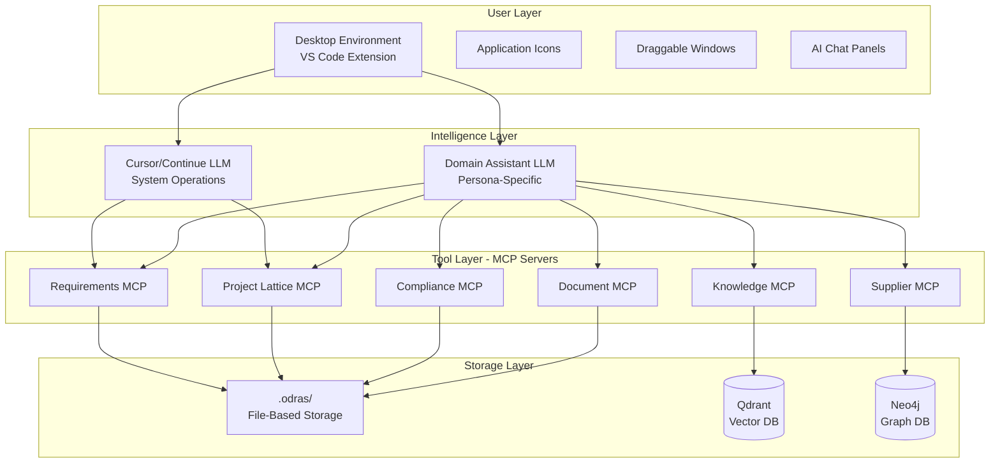

# Structured Intelligence Platform (SIP)
## A NotebookLM-Style Tool for Non-Technical Business Users

**Version:** 1.0  
**Date:** November 2025  
**Status:** Software Description Document

---

## Executive Summary

This document describes a transformation of ODRAS from a developer-centric ontology management system into a **NotebookLM-style platform** for non-technical business users. The platform provides an **OS-like desktop interface within VS Code/Cursor** where users interact with their documents, data, and workflows through simple visual tools and conversational AI.

**Key Innovation:** Combine the simplicity of NotebookLM's document-grounded AI with the power of ODRAS's semantic knowledge management, delivered through a familiar desktop-like interface that non-technical users already understand.

**Target Users:**
- Supply Chain Managers
- Program Managers  
- Customer Service Representatives
- Technical Support Engineers
- Applications Engineers
- Training Coordinators
- Compliance Officers
- Document Managers

**Core Principle:** "Chat with your documents, visualize your knowledge, automate your workflows" - all through a simple desktop interface.

---

## Table of Contents

1. [What is NotebookLM and Why It Matters](#what-is-notebooklm)
2. [The Vision: ODRAS Meets NotebookLM](#the-vision)
3. [Architecture: Desktop OS + MCP Servers + Dual LLMs](#architecture)
4. [Use Cases by User Persona](#use-cases)
5. [Software Components](#software-components)
6. [User Experience Flow](#user-experience-flow)
7. [Implementation Roadmap](#implementation-roadmap)
8. [Technical Details](#technical-details)

---

## What is NotebookLM?

### Core Concept

Google's NotebookLM is an AI research assistant that:
1. **Grounds AI in YOUR documents** - Upload PDFs, docs, web pages
2. **Chats with understanding** - Ask questions, AI answers based on your sources
3. **Summarizes and analyzes** - Auto-generates insights from uploaded content
4. **Stays focused** - Only uses your documents, doesn't hallucinate external info
5. **Simple interface** - Upload, chat, done

### What Makes It Compelling for Non-Technical Users

✅ **No setup** - Just upload documents and start chatting  
✅ **No training** - Natural language questions work immediately  
✅ **Trustworthy** - AI cites sources from your documents  
✅ **Private** - Your documents stay yours  
✅ **Fast value** - Insights in minutes, not hours

### What ODRAS Can Learn from NotebookLM

1. **Document-first** - Start with what users already have (Word docs, PDFs, emails)
2. **Chat-based** - Natural language instead of forms and buttons
3. **Auto-insights** - System generates useful artifacts without being asked
4. **Visual** - Show relationships and connections graphically
5. **Context-aware** - Remembers what you're working on

---

## The Vision: ODRAS Meets NotebookLM

### The Transformation

**From:**
```
Developer installs ODRAS
  ↓
Learns Docker, FastAPI, Neo4j, Qdrant, Fuseki
  ↓
Reads 50 pages of documentation
  ↓
Writes SPARQL queries
  ↓
Edits ontology files
  ↓
Finally creates a project
```

**To:**
```
User opens Desktop app
  ↓
Drops requirements document onto "Requirements" icon
  ↓
Chats: "What are the high-priority items?"
  ↓
System shows visual lattice of projects
  ↓
User clicks "Start Project" button
  ↓
System creates structured project automatically
```

### The User's Desktop

```
┌─────────────────────────────────────────────────────────────────┐
│  ODRAS Desktop  [Minimize] [Maximize] [Close]                   │
├─────────────────────────────────────────────────────────────────┤
│                                                                  │
│   📄             📊            🤖            📁                  │
│   My             Projects      AI Chat       Documents           │
│   Documents                                                      │
│                                                                  │
│   ✅             👥            🔍            ⚙️                   │
│   Requirements   Team          Search        Settings            │
│                                                                  │
│                                                                  │
│  ┌──────────────────────────────────────────────────────────┐  │
│  │  💬 AI Assistant                                          │  │
│  │  ────────────────────────────────────────────────────────│  │
│  │  You: What requirements need attention this week?         │  │
│  │                                                            │  │
│  │  Assistant: I found 12 requirements due this week:        │  │
│  │  • REQ-045: UAV endurance testing (Due: Nov 23)          │  │
│  │  • REQ-102: Sensor integration (Due: Nov 24)             │  │
│  │  [Show in Projects] [Create Tasks]                       │  │
│  └──────────────────────────────────────────────────────────┘  │
│                                                                  │
└─────────────────────────────────────────────────────────────────┘
```

---

## Architecture: Desktop OS + MCP Servers + Dual LLMs

### The Three-Layer System

```
┌─────────────────────────────────────────────────────────────────┐
│ Layer 1: Desktop Environment (What Users See)                   │
├─────────────────────────────────────────────────────────────────┤
│                                                                  │
│  Desktop Icons → Applications → Windows → Chat Panels           │
│                                                                  │
│  - Simple, familiar Windows-like interface                       │
│  - Drag-and-drop file handling                                  │
│  - Visual representations (graphs, charts, lattices)            │
│  - Chat windows for AI interaction                              │
│                                                                  │
└─────────────────────────────────────────────────────────────────┘
                            ↕ Messages
┌─────────────────────────────────────────────────────────────────┐
│ Layer 2: Dual LLM System (Intelligence)                         │
├─────────────────────────────────────────────────────────────────┤
│                                                                  │
│  ┌─────────────────────┐        ┌──────────────────────────┐   │
│  │ Cursor/Continue LLM  │        │ DAS (Domain Assistant)   │   │
│  │                     │        │ LLM                       │   │
│  │ File operations     │        │ Domain knowledge          │   │
│  │ Code generation     │        │ Activity tracking         │   │
│  │ System commands     │        │ Workflow automation       │   │
│  │ Search/navigation   │        │ Requirements analysis     │   │
│  └─────────────────────┘        └──────────────────────────┘   │
│                                                                  │
└─────────────────────────────────────────────────────────────────┘
                            ↕ Tool Calls
┌─────────────────────────────────────────────────────────────────┐
│ Layer 3: MCP Servers (Intelligent Tools)                        │
├─────────────────────────────────────────────────────────────────┤
│                                                                  │
│  Requirements MCP  │  Ontology MCP  │  Knowledge MCP  │  ...   │
│                                                                  │
│  - Create requirement  - Load ontology   - Index document       │
│  - Link to project     - Validate class  - Search knowledge     │
│  - Update status       - Export to RDF   - Get context          │
│                                                                  │
└─────────────────────────────────────────────────────────────────┘
                            ↕ Direct Access
┌─────────────────────────────────────────────────────────────────┐
│ Layer 4: File-Based Storage (What Gets Saved)                   │
├─────────────────────────────────────────────────────────────────┤
│                                                                  │
│  .odras/                                                         │
│  ├── projects/                                                   │
│  │   ├── uav-acquisition/                                       │
│  │   │   ├── requirements.json                                  │
│  │   │   ├── lattice.json                                       │
│  │   │   └── conversations/                                     │
│  │   │       └── 2025-11-20-requirements-review.json           │
│  │   └── sensor-integration/                                    │
│  ├── documents/                                                  │
│  │   ├── specs.pdf                                              │
│  │   └── requirements.docx                                      │
│  └── ontologies/                                                 │
│      └── aerospace.ttl                                           │
│                                                                  │
└─────────────────────────────────────────────────────────────────┘
```

### Dual LLM Strategy

#### **LLM #1: Cursor/Continue AI** (System Operations)
**Role:** General-purpose AI coding assistant  
**Responsibilities:**
- File and folder operations
- Code generation for extensions
- System configuration
- Search and navigation
- Integration with IDE features

**Pre-trained for:**
- VS Code APIs
- File system operations
- Common programming patterns
- General knowledge tasks

**Example Interactions:**
- "Create a new folder for the Q4 deliverables"
- "Find all requirements documents from last month"
- "Open the supplier contract template"

#### **LLM #2: DAS (Domain Assistant System)** (Domain Knowledge)
**Role:** Persona-specific domain expert  
**Responsibilities:**
- Requirements analysis
- Project lattice generation
- Domain-specific workflows
- Activity tracking and suggestions
- Compliance checking

**Pre-trained for specific personas:**

**Supply Chain Manager DAS:**
- Supplier management workflows
- Contract analysis
- Deliverable tracking
- Risk assessment
- Supplier performance metrics

**Program Manager DAS:**
- Project planning
- Resource allocation
- Schedule analysis
- Risk management
- Stakeholder communication

**Compliance Officer DAS:**
- Regulatory requirements
- Document validation
- Audit trail generation
- Certification tracking
- Gap analysis

**Example Interactions:**
- "Analyze this RFP and create a project structure"
- "What suppliers can meet these requirements?"
- "Generate a compliance checklist for this contract"
- "What's the critical path for this project?"

### Why Two LLMs?

| Aspect | Cursor/Continue LLM | Domain Assistant (DAS) LLM |
|--------|---------------------|---------------------------|
| **Scope** | File system, IDE, general coding | Domain-specific workflows, knowledge |
| **Training** | General VS Code, programming | Specialized for user persona |
| **Context** | Current workspace, open files | Project history, requirements, domain ontology |
| **Speed** | Fast (local or cloud) | Can be slower (more complex reasoning) |
| **Cost** | User's choice (API or local) | Optimized for domain tasks |
| **Updates** | Managed by Cursor/Continue | Managed by ODRAS/MCP servers |

**Working Together:**
```
User: "Create a new UAV project from this RFP document"
  ↓
Cursor LLM: Creates folder structure, copies template files
  ↓
DAS LLM: Analyzes RFP, extracts requirements, generates project lattice
  ↓
Cursor LLM: Opens generated files in editor
  ↓
DAS LLM: Suggests next steps based on project type
```

---

## Use Cases by User Persona

### Persona 1: Supply Chain Manager (Sarah)

**Background:**
- 15 years in aerospace supply chain
- Manages 200+ suppliers
- Uses Excel and email daily
- Uncomfortable with technical tools
- Needs fast answers about supplier status

**Daily Workflow:**

**Morning: Check Supplier Status**
```
Sarah opens Desktop
  ↓
Clicks "Supply Chain" icon
  ↓
Chats: "Which suppliers have late deliverables?"
  ↓
DAS shows:
  • Acme Sensors: 3 items, 5 days late
  • Beta Motors: 1 item, 2 days late
  ↓
Sarah clicks "Acme Sensors" → Opens supplier window
  ↓
Sees: Contract details, delivery history, contact info
  ↓
Clicks "Send Reminder" → Auto-generates email draft
```

**Afternoon: New RFP Analysis**
```
Sarah drags RFP.pdf onto "Documents" icon
  ↓
Chats: "What requirements does this RFP have?"
  ↓
DAS extracts:
  • Technical requirements (23 items)
  • Schedule constraints (5 milestones)
  • Budget limits ($2.5M)
  ↓
Sarah clicks "Find Matching Suppliers"
  ↓
DAS shows ranked list:
  1. Acme Sensors (95% match, $2.2M, 6 months)
  2. Gamma Tech (87% match, $2.4M, 7 months)
  ↓
Sarah clicks "Create Project" → Automatic project setup
```

**MCP Tools Sarah Uses (without knowing):**
- `requirements-mcp`: Extract requirements from documents
- `supplier-mcp`: Search and rank suppliers
- `project-mcp`: Create and manage projects
- `email-mcp`: Generate communications
- `document-mcp`: Manage contracts and NDAs

### Persona 2: Program Manager (Mike)

**Background:**
- Manages 5 concurrent aerospace programs
- Needs to track requirements, schedule, and risks
- Overwhelmed by email and status meetings
- Wants single source of truth
- Non-technical background

**Daily Workflow:**

**Morning: Program Status**
```
Mike opens Desktop
  ↓
Clicks "Programs" icon
  ↓
Sees dashboard:
  • UAV Acquisition: 🟢 On track
  • Sensor Integration: 🟡 1 risk
  • Testing Phase: 🔴 2 blockers
  ↓
Clicks "Sensor Integration" 
  ↓
Chats: "What's the risk?"
  ↓
DAS shows:
  "REQ-042 (thermal sensor range) blocked by:
   - Supplier delay (3 weeks)
   - Design review pending"
  ↓
Mike clicks "Show Impact"
  ↓
DAS displays project lattice showing:
  - 3 dependent requirements
  - 2 affected deliverables  
  - Schedule impact: +2 weeks
```

**Weekly: Create Status Report**
```
Mike: "Generate weekly status report for UAV project"
  ↓
DAS creates report:
  • Completed: 34/120 requirements
  • On track: 80 requirements
  • At risk: 6 requirements
  • Blocked: 0 requirements
  • Key accomplishments: [auto-generated]
  • Risks: [auto-extracted]
  • Next week plan: [auto-generated]
  ↓
Mike reviews, makes minor edits
  ↓
Clicks "Export to PowerPoint"
  ↓
Presentation ready for Monday meeting
```

**MCP Tools Mike Uses:**
- `project-lattice-mcp`: Visualize project structure and dependencies
- `requirements-mcp`: Track requirement status
- `risk-mcp`: Identify and analyze risks
- `reporting-mcp`: Generate status reports
- `schedule-mcp`: Track milestones and delays

### Persona 3: Customer Service Representative (Lisa)

**Background:**
- Handles 50+ customer inquiries per day
- Needs fast access to product specs, manuals, FAQs
- Limited technical knowledge
- Must provide accurate, cited answers
- Escalates complex issues

**Daily Workflow:**

**Customer Inquiry: "Can your UAV operate in high winds?"**
```
Lisa types in chat: "Can our UAV operate in high winds?"
  ↓
DAS searches knowledge base:
  - Product specs
  - Test reports
  - Environmental certifications
  ↓
DAS responds:
  "Yes, the UAV-500 operates in winds up to 25 knots (29 mph).
   
   Source: Product Spec v2.3 (page 14)
   Test Report: ENV-TEST-042 confirms operation up to 27 knots
   
   Limitations:
   - Reduced flight time at max wind speed
   - Requires manual control above 20 knots"
   
   [Copy Answer] [Send to Customer] [See Full Specs]
  ↓
Lisa clicks "Send to Customer"
  ↓
Auto-formatted email ready to send
```

**Escalation Scenario:**
```
Customer: "We need custom wind tolerance for Arctic deployment"
  ↓
Lisa: "Create escalation for custom Arctic wind requirements"
  ↓
DAS:
  - Creates technical support ticket
  - Attaches relevant specs
  - Suggests technical engineer: "John (Arctic experience)"
  - Drafts customer response: "Escalated to engineering team..."
  ↓
Lisa reviews and sends
```

**MCP Tools Lisa Uses:**
- `knowledge-mcp`: Search product documentation
- `customer-mcp`: Track customer history
- `ticket-mcp`: Create and manage support tickets
- `email-mcp`: Generate professional responses
- `escalation-mcp`: Route complex issues

### Persona 4: Compliance Officer (Carlos)

**Background:**
- Ensures all projects meet FAA/DoD regulations
- Tracks certifications and audits
- Manages compliance documentation
- Risk-averse, needs audit trails
- Non-technical legal background

**Daily Workflow:**

**New Project Compliance Check:**
```
Carlos drags project proposal onto "Compliance" icon
  ↓
DAS automatically:
  - Identifies applicable regulations (FAA Part 107, ITAR)
  - Extracts compliance requirements
  - Checks against company certifications
  - Highlights gaps
  ↓
Shows compliance dashboard:
  ✅ 42 requirements met
  ⚠️  5 requirements need documentation
  ❌ 2 requirements missing (ITAR export control)
  ↓
Carlos clicks "Generate Compliance Plan"
  ↓
DAS creates:
  - Gap closure plan
  - Document checklist
  - Timeline for compliance
  - Responsible parties
```

**Audit Preparation:**
```
Carlos: "Prepare for FAA audit next month"
  ↓
DAS:
  - Scans all UAV projects
  - Identifies relevant requirements
  - Checks documentation completeness
  - Generates audit package
  - Creates evidence map (requirement → document → test result)
  ↓
Shows audit readiness: 94%
Missing items:
  • Test report for REQ-078
  • Certification for component XYZ
  ↓
Carlos clicks "Create Checklist"
  ↓
Assigns items to team members
```

**MCP Tools Carlos Uses:**
- `compliance-mcp`: Check regulatory requirements
- `audit-mcp`: Prepare audit packages
- `certification-mcp`: Track certifications
- `document-mcp`: Manage compliance docs
- `gap-analysis-mcp`: Identify compliance gaps

### Persona 5: Technical Writer (Emma)

**Background:**
- Creates user manuals and training materials
- Needs access to latest specs and requirements
- Manages document versions
- Ensures consistency across documents
- Non-engineer, but technical communicator

**Daily Workflow:**

**Creating User Manual:**
```
Emma: "I need to write the emergency procedures section"
  ↓
Drops draft manual onto "Documents" icon
  ↓
Chats: "What are the emergency landing requirements?"
  ↓
DAS finds:
  - REQ-088: Emergency landing protocols
  - TEST-REPORT-034: Emergency scenario tests
  - Previous manual: Emergency procedures v1.2
  ↓
Shows:
  "Based on REQ-088 and testing:
   
   Emergency Landing Procedures:
   1. Activate emergency mode (button sequence)
   2. System auto-selects landing zone
   3. Pilot confirms or overrides
   4. Automatic descent sequence
   
   Tested scenarios: [See TEST-REPORT-034]
   Changes from v1.2: [Automated terrain detection added]"
   
   [Insert into Manual] [See Full Requirement]
```

**Version Control:**
```
Emma: "Has REQ-088 changed since last manual version?"
  ↓
DAS compares:
  - Manual v2.1 (based on REQ-088 v1.0)
  - Current REQ-088 v1.2
  ↓
Shows changes:
  "REQ-088 updated on Nov 10:
   • Added: Automatic terrain detection
   • Changed: Landing zone radius (50m → 100m)
   • Removed: Manual descent rate control
   
   Sections to update:
   • Page 23: Emergency procedures
   • Page 45: Terrain avoidance
   • Appendix C: Feature comparison"
   
   [Update Manual] [Track Changes]
```

**MCP Tools Emma Uses:**
- `requirements-mcp`: Access current requirements
- `document-mcp`: Manage document versions
- `diff-mcp`: Compare document versions
- `export-mcp`: Generate PDFs, Word docs
- `cross-reference-mcp`: Link requirements to manual sections

---

## Software Components

### 1. Desktop Environment Extension (Core UI)

**What It Is:**
- VS Code extension that creates desktop-like interface
- Runs in Cursor or VS Code
- Provides familiar Windows/Mac desktop experience
- Manages application windows

**Key Features:**
- Desktop icons for applications
- Draggable, resizable windows
- Maximize, minimize, close controls
- Taskbar (future)
- File browser windows
- Integrated chat panels

**Technology:**
- TypeScript
- VS Code Extension API
- HTML/CSS for desktop rendering
- Iframes for application isolation

**Files:**
- `desktop-environment-extension/src/extension.ts` (673 lines)
- `desktop-environment-extension/src/fileManager.ts` (44 lines)
- Simple, maintainable codebase

### 2. MCP Server Framework (Intelligent Tools)

**What It Is:**
- Distributed servers exposing domain-specific tools
- Replace monolithic REST API
- Discoverable by LLMs via MCP protocol
- Stateless, independently deployable

**MCP Server Examples:**

#### **Requirements MCP Server**
```json
{
  "name": "requirements-mcp",
  "version": "1.0.0",
  "tools": [
    {
      "name": "create_requirement",
      "description": "Create a new requirement in a project",
      "parameters": {
        "project_id": "string",
        "title": "string",
        "description": "string",
        "priority": "enum[must,shall,should]"
      }
    },
    {
      "name": "extract_requirements_from_document",
      "description": "Extract requirements from uploaded document",
      "parameters": {
        "document_path": "string",
        "format": "enum[pdf,docx,txt]"
      }
    },
    {
      "name": "link_requirements",
      "description": "Create relationship between requirements",
      "parameters": {
        "source_id": "string",
        "target_id": "string",
        "relationship": "enum[derives-from,depends-on,conflicts-with]"
      }
    }
  ]
}
```

#### **Project Lattice MCP Server**
```json
{
  "name": "project-lattice-mcp",
  "version": "1.0.0",
  "tools": [
    {
      "name": "generate_intelligent_lattice",
      "description": "Generate project lattice from requirements using LLM",
      "parameters": {
        "requirements_text": "string",
        "project_type": "string"
      }
    },
    {
      "name": "visualize_lattice",
      "description": "Create visual representation of project lattice",
      "parameters": {
        "lattice_id": "string",
        "format": "enum[graph,tree,list]"
      }
    },
    {
      "name": "analyze_dependencies",
      "description": "Analyze project dependencies and critical path",
      "parameters": {
        "lattice_id": "string"
      }
    }
  ]
}
```

#### **Knowledge MCP Server**
```json
{
  "name": "knowledge-mcp",
  "version": "1.0.0",
  "tools": [
    {
      "name": "index_document",
      "description": "Index a document into knowledge base",
      "parameters": {
        "document_path": "string",
        "metadata": "object"
      }
    },
    {
      "name": "semantic_search",
      "description": "Search knowledge base with natural language",
      "parameters": {
        "query": "string",
        "limit": "integer",
        "filters": "object"
      }
    },
    {
      "name": "get_related_documents",
      "description": "Find documents related to a topic",
      "parameters": {
        "topic": "string",
        "context": "string"
      }
    }
  ]
}
```

### 3. Application Modules (The "Apps")

#### **A. Requirements Analyzer**
- **Icon**: ✅ checkmark
- **Opens**: Window with requirements list and chat
- **Features**:
  - Drag-drop Word/PDF to extract requirements
  - Chat to ask about requirements
  - Visual priority matrix
  - Export to Excel/PDF

#### **B. Project Lattice Visualizer**
- **Icon**: 🔷 diamond
- **Opens**: Interactive graph visualization
- **Features**:
  - Auto-generate from requirements
  - Show dependencies and data flows
  - Highlight critical path
  - Export as image/PDF

#### **C. Document Chat**
- **Icon**: 💬 chat bubble
- **Opens**: Chat window grounded in uploaded docs
- **Features**:
  - Upload multiple documents
  - Ask questions → Get cited answers
  - Auto-summarize documents
  - Compare versions

#### **D. Supplier Manager**
- **Icon**: 🏭 factory
- **Opens**: Supplier database and search
- **Features**:
  - Search suppliers by capability
  - View contracts and deliverables
  - Track performance metrics
  - Generate supplier reports

#### **E. Compliance Checker**
- **Icon**: 📋 clipboard
- **Opens**: Compliance dashboard
- **Features**:
  - Check project against regulations
  - Generate compliance reports
  - Track certifications
  - Audit trail visualization

#### **F. NDA/Document Manager**
- **Icon**: 📄 document
- **Opens**: Document management interface
- **Features**:
  - Manage NDAs, contracts, agreements
  - Track signatures and expiration
  - Search document content
  - Version control

### 4. Pre-Trained LLM Personas

#### **Supply Chain Manager Persona**

**Training Data:**
- Supply chain management textbooks
- Aerospace supplier databases
- Contract templates and examples
- Supplier evaluation frameworks
- Risk assessment methodologies

**Specialized Vocabulary:**
- Lead times, MRO, JIT, vendor management
- RFQ, RFP, PO, delivery schedules
- Quality metrics, supplier scorecards

**Common Tasks:**
- "Find suppliers for [component] with [capabilities]"
- "Analyze supplier performance trends"
- "Generate supplier scorecard"
- "Check contract compliance"
- "Forecast delivery risks"

#### **Program Manager Persona**

**Training Data:**
- Project management methodologies (PMI, Agile)
- Aerospace program examples
- Schedule analysis techniques
- Risk management frameworks
- Requirements traceability

**Specialized Vocabulary:**
- WBS, critical path, milestones, deliverables
- Earned value, schedule variance
- Requirements traceability, verification

**Common Tasks:**
- "Create project WBS from requirements"
- "Analyze schedule impact of requirement change"
- "Generate project status report"
- "Identify critical path"
- "Track requirement traceability"

#### **Compliance Officer Persona**

**Training Data:**
- FAA regulations (Part 21, 23, 27, 107)
- ITAR export control regulations
- ISO 9001, AS9100 standards
- Aerospace compliance case studies
- Audit methodologies

**Specialized Vocabulary:**
- Regulatory compliance, certifications
- Type certificates, airworthiness
- Export control, ITAR classification
- Gap analysis, audit trails

**Common Tasks:**
- "Check project against FAA Part 107"
- "Identify ITAR-controlled items"
- "Generate compliance gap analysis"
- "Prepare for audit"
- "Track certification status"

---

## User Experience Flow

### First-Time User Experience

**Step 1: Installation (One-Click)**
```
User downloads: ODRAS-Desktop-Setup.exe
  ↓
Double-clicks installer
  ↓
Installer:
  • Checks for VS Code/Cursor (installs if missing)
  • Installs Desktop Environment extension
  • Configures MCP servers
  • Downloads persona-specific LLM models (if local)
  • Creates desktop shortcut
  ↓
User clicks "Launch ODRAS Desktop"
  ↓
Desktop opens with welcome wizard
```

**Step 2: Choose Your Role**
```
Welcome screen shows:
  "What do you do?"
  
  [Supply Chain Manager]
  [Program Manager]
  [Customer Service]
  [Technical Support]
  [Compliance Officer]
  [Document Manager]
  [Other]
  ↓
User selects "Supply Chain Manager"
  ↓
System:
  • Loads Supply Chain DAS persona
  • Shows Supply Chain-specific icons
  • Configures relevant MCP servers
  • Hides technical/developer tools
  ↓
Desktop shows:
  📦 Suppliers
  📋 Contracts  
  📊 Deliverables
  💬 Ask AI
  📄 Documents
```

**Step 3: Import Existing Data (Optional)**
```
Welcome wizard: "Import your existing data"
  
  [Excel Spreadsheets]
  [Email Inbox (Outlook)]
  [SharePoint Documents]
  [Skip for now]
  ↓
User selects "Excel Spreadsheets"
  ↓
Drops "Suppliers.xlsx" onto window
  ↓
DAS:
  • Analyzes spreadsheet structure
  • Identifies: Supplier names, contacts, capabilities
  • Creates supplier records
  • Indexes for search
  ↓
"Imported 147 suppliers. Ready to use!"
```

**Step 4: First Task**
```
Wizard: "Let's try something together"
  
Tutorial shows:
  "Drop your latest RFP document here"
  
  [Click to browse] or drag file here
  ↓
User drops "UAV_RFP_2025.pdf"
  ↓
DAS analyzes (with progress bar):
  📄 Reading document... (3 sec)
  🧠 Extracting requirements... (5 sec)
  🔍 Finding matching suppliers... (2 sec)
  ✅ Done!
  ↓
Shows results:
  "Found 23 requirements in this RFP:
   
   Top matches:
   • Acme Sensors: Meets 18/23 requirements
   • Beta Systems: Meets 16/23 requirements
   
   [Create Project] [Export Report] [Ask Questions]"
  ↓
Tutorial: "That's it! You can now chat with your documents."
```

### Daily Usage Flow

**Typical Morning for Supply Chain Manager:**

```
9:00 AM - Open desktop
  ↓
Desktop remembers yesterday's state:
  • 2 windows open (Suppliers, Current RFP)
  • Chat history visible
  • Pending tasks highlighted
  ↓
9:05 AM - Check email, sees new RFP
  ↓
Drags RFP from Outlook onto desktop
  ↓
DAS: "New RFP detected. Analyze now?"
User: "Yes"
  ↓
9:06 AM - Results appear
  ↓
User: "Which suppliers in Asia-Pacific?"
  ↓
DAS filters results, shows map
  ↓
9:10 AM - User: "Create comparison spreadsheet"
  ↓
Excel file generated, opens automatically
  ↓
9:15 AM - User edits, saves
  ↓
DAS: "Save to RFP project folder?"
User: "Yes"
  ↓
9:20 AM - User: "Email summary to procurement team"
  ↓
DAS generates email draft, user reviews, sends
  ↓
9:25 AM - Done. Move to next task.
```

**Complexity Hidden:**
- User didn't see: MCP servers, vector embeddings, SPARQL queries, graph databases
- User saw: Drag file, ask questions, get answers, generate reports
- System handled: Document parsing, semantic search, supplier matching, report generation

---

## Software Description Document

### Product Name

**Structured Intelligence Platform (SIP)**

*Subtitle: Your Documents, Your Knowledge, Your Assistant*

### Product Vision

**One-Line Pitch:**
"NotebookLM for business professionals - chat with your documents, visualize your knowledge, automate your workflows, all through a simple desktop interface."

**Elevator Pitch (30 seconds):**
"SIP transforms your business documents into an intelligent workspace. Upload contracts, requirements, specs, or reports. Ask questions in plain English. Get instant answers cited from your documents. See visual connections between requirements, suppliers, and projects. Automate repetitive workflows. All through a simple desktop interface that feels like Windows Explorer, but smarter."

### Target Market

**Primary Market:**
- Mid-size to large enterprises (100-10,000 employees)
- Industries: Aerospace, defense, manufacturing, healthcare, finance
- Departments: Supply chain, program management, customer service, compliance

**Target User Profiles:**
1. **Supply Chain Managers** (200K+ in US)
   - Pain: Scattered supplier data, slow RFP analysis
   - Value: 10x faster supplier matching, automated reporting

2. **Program Managers** (500K+ in US)
   - Pain: Requirements traceability, status reporting overhead
   - Value: Visual project lattices, auto-generated status reports

3. **Customer Service Reps** (2.8M+ in US)
   - Pain: Can't find answers in product docs quickly
   - Value: Instant, cited answers from knowledge base

4. **Compliance Officers** (100K+ in US)
   - Pain: Manual audit preparation, gap analysis
   - Value: Automated compliance checking, audit packages

### Key Features

#### **1. Document-Grounded AI Chat**

**Like NotebookLM:**
- Upload any document (PDF, Word, Excel, email)
- Ask questions in natural language
- Get answers cited from your documents
- No hallucination - only uses your sources

**Better than NotebookLM:**
- ✅ Integrated with project management tools
- ✅ Can execute actions (create projects, update status)
- ✅ Connects to your existing systems (email, SharePoint)
- ✅ Role-specific personas (supply chain, compliance, etc.)
- ✅ Workflow automation (not just Q&A)

#### **2. Desktop-Like Interface**

**What Users See:**
- Icons for applications (like Windows desktop)
- Draggable, resizable windows
- Familiar file/folder metaphor
- Right-click context menus
- Keyboard shortcuts

**What Users Don't See:**
- Command-line interfaces
- Docker containers
- Database schemas
- API endpoints
- Graph query languages

#### **3. Visual Knowledge Representation**

**Project Lattice Visualization:**
```
      UAV Acquisition
      /      |      \
 Strategy  Tactical  Solution
    |        |         |
  [Auto-generated sub-projects based on requirements]
  
  Shows:
  • Data flows between projects
  • Dependencies (can't start B until A complete)
  • Critical path (highlighted in red)
  • Progress status (green/yellow/red)
```

**Supplier Relationship Map:**
```
  Our Company
    ├─ Tier 1: Prime contractors
    │    ├─ Acme Sensors ($2M/year)
    │    └─ Beta Systems ($1.5M/year)
    └─ Tier 2: Component suppliers
         ├─ Gamma Motors
         └─ Delta Electronics
         
  Interactive:
  • Click supplier → See details, contracts, performance
  • Hover → Quick stats
  • Filter by: Region, capability, performance
```

**Requirement Dependency Graph:**
```
  REQ-001 (High-level)
    ├─ REQ-045 (Derived)
    │   ├─ REQ-078 (Implementation)
    │   └─ REQ-079 (Implementation)
    └─ REQ-046 (Derived)
    
  Shows:
  • Which requirements derive from others
  • Impact analysis (if REQ-045 changes, what's affected?)
  • Status rollup (child requirements complete → parent turns green)
```

#### **4. Workflow Automation**

**Example Workflows:**

**New RFP Workflow:**
```
Trigger: User drops RFP.pdf onto desktop
  ↓
Automated:
  1. Extract requirements
  2. Classify by type (technical, schedule, cost)
  3. Search for matching suppliers
  4. Generate comparison spreadsheet
  5. Create draft project structure
  6. Suggest next steps
  ↓
User reviews and approves
```

**Weekly Status Report Workflow:**
```
Trigger: User clicks "Generate Status Report" or scheduled (every Friday)
  ↓
Automated:
  1. Gather data (requirements status, schedule, risks)
  2. Generate executive summary
  3. Create charts (progress, burn-down, risk matrix)
  4. Format as PowerPoint
  5. Draft email to stakeholders
  ↓
User reviews, edits if needed, sends
```

**Compliance Check Workflow:**
```
Trigger: User starts new project
  ↓
Automated:
  1. Identify applicable regulations (FAA, ITAR, ISO)
  2. Extract compliance requirements
  3. Check against company certifications
  4. Highlight gaps
  5. Generate compliance plan
  ↓
User assigns gap closure tasks to team
```

#### **5. Intelligent Search**

**Beyond Keyword Search:**
- Semantic search: "Find requirements about battery life" (finds "endurance", "power consumption", "flight time")
- Cross-document: Search across all uploaded documents simultaneously
- Context-aware: Understands your current project and filters results
- Citation-based: Always shows source document and page number

**Search Modes:**

**Quick Search (Ctrl+F):**
```
User types: "wind tolerance"
  ↓
Instant results:
  • REQ-042: "Operate in winds up to 25 knots" [Project: UAV]
  • TEST-034: "Wind tunnel testing at 27 knots" [Doc: Test Report]
  • SPEC-12: "Wind tolerance: ≥20 knots" [Doc: Product Spec]
```

**Deep Analysis (Chat):**
```
User: "How does our wind tolerance compare to competitors?"
  ↓
DAS:
  1. Finds our specs (25 knots)
  2. Searches competitor data (if indexed)
  3. Analyzes requirements context
  ↓
"Our UAV operates in 25 knot winds. Competitor analysis:
 • Competitor A: 20 knots (lower)
 • Competitor B: 30 knots (higher, but 2x cost)
 • Industry standard: 22-25 knots
 
 Recommendation: Our 25 knot spec meets 90% of customer requirements
 and is competitive on cost."
 
 [See Full Analysis] [Export Report]
```

#### **6. Integration with Existing Tools**

**Email Integration (Outlook):**
- Drag emails onto desktop → Auto-extract action items
- "Reply to customer" → DAS drafts response based on knowledge base
- Track email threads by project

**SharePoint Integration:**
- Browse SharePoint like local folders
- Auto-index uploaded documents
- Bi-directional sync

**Excel Integration:**
- Import data from spreadsheets (suppliers, requirements, etc.)
- Export reports as Excel with formatting
- Keep Excel as source of truth if user prefers

**Microsoft Teams Integration:**
- Share project lattices in Teams chat
- Bot responses grounded in ODRAS knowledge
- Meeting summaries auto-linked to projects

---

## Comparison to NotebookLM

| Feature | NotebookLM | SIP (Our Platform) | Advantage |
|---------|------------|-------------------|-----------|
| **Upload Documents** | ✅ Yes | ✅ Yes | Tie |
| **Chat with Documents** | ✅ Yes | ✅ Yes | Tie |
| **Cited Answers** | ✅ Yes | ✅ Yes | Tie |
| **Auto-Summarize** | ✅ Yes | ✅ Yes | Tie |
| **Visual Knowledge** | ❌ No | ✅ Yes - Lattices, graphs, charts | **SIP** |
| **Workflow Automation** | ❌ No | ✅ Yes - BPMN workflows | **SIP** |
| **Execute Actions** | ❌ No | ✅ Yes - Create projects, send emails | **SIP** |
| **Role-Specific** | ❌ Generic | ✅ Yes - Trained personas | **SIP** |
| **Desktop Interface** | ❌ Web only | ✅ Yes - OS-like UI | **SIP** |
| **Pluggable Tools** | ❌ No | ✅ Yes - MCP servers | **SIP** |
| **File System Access** | ❌ Limited | ✅ Yes - Full access | **SIP** |
| **Offline Mode** | ❌ No | ✅ Yes - Local LLMs | **SIP** |
| **Enterprise Integration** | ❌ Limited | ✅ Yes - Outlook, SharePoint, Teams | **SIP** |
| **Privacy** | ⚠️ Google cloud | ✅ On-premises or cloud | **SIP** |

### Our Competitive Advantages

1. **Actionable, not just informational**
   - NotebookLM: "Here's what the document says"
   - SIP: "Here's what the document says, and I created a project for you"

2. **Domain expertise**
   - NotebookLM: General AI, generic responses
   - SIP: Supply chain expert, program management expert, etc.

3. **Visual intelligence**
   - NotebookLM: Text-based chat
   - SIP: Interactive graphs, project lattices, dependency trees

4. **Workflow automation**
   - NotebookLM: Manual export and copy/paste
   - SIP: Automated report generation, email drafting, status updates

5. **Enterprise integration**
   - NotebookLM: Standalone web app
   - SIP: Integrated with Outlook, SharePoint, Teams, file systems

---

## Technical Architecture

### Component Overview



### Data Flow Example: "Analyze This RFP"

```
User: Drags RFP.pdf onto desktop
  ↓
Desktop Extension: Detects file drop
  ↓
Calls: document_mcp.index_document(RFP.pdf)
  ↓
Document MCP:
  • Extracts text from PDF
  • Chunks into semantic sections
  • Creates embeddings
  • Stores in Qdrant
  • Returns: document_id
  ↓
Desktop: "Document uploaded. What would you like to know?"
  ↓
User: "What are the requirements?"
  ↓
DAS LLM receives:
  • User query
  • Document context (via Knowledge MCP)
  • User persona (Supply Chain Manager)
  ↓
DAS calls: requirements_mcp.extract_requirements(document_id)
  ↓
Requirements MCP:
  • Searches document for requirement patterns
  • Uses LLM to extract structured requirements
  • Classifies by type (MUST/SHALL/SHOULD)
  • Saves to .odras/projects/rfp-2025/requirements.json
  • Returns: 23 requirements found
  ↓
DAS calls: supplier_mcp.find_matching(requirements)
  ↓
Supplier MCP:
  • Searches supplier graph
  • Matches capabilities to requirements
  • Ranks by match score
  • Returns: Top 5 suppliers
  ↓
DAS responds to user:
  "Found 23 requirements. Top suppliers:
   1. Acme Sensors (18/23 match)
   2. Beta Systems (16/23 match)
   [Create Project] [See Details]"
  ↓
User clicks "Create Project"
  ↓
DAS calls: project_lattice_mcp.generate_lattice(requirements)
  ↓
Project Lattice MCP:
  • Analyzes requirement dependencies
  • Creates hierarchical project structure
  • Generates data flow diagram
  • Saves to .odras/projects/rfp-2025/lattice.json
  • Opens visualization window
  ↓
User sees: Interactive project lattice graph
  ↓
User: "Export this as a proposal"
  ↓
DAS generates:
  • PowerPoint presentation
  • Excel cost breakdown
  • Timeline Gantt chart
  • Supplier comparison matrix
  ↓
All files saved to .odras/projects/rfp-2025/exports/
  ↓
Desktop shows: "Proposal package ready. [Open Folder] [Email Team]"
```

**Total time:** 2 minutes (vs 2 days manually)

---

## Use Case Deep Dives

### Use Case 1: Supply Chain - Supplier Selection

**Scenario:** Sarah (Supply Chain Manager) receives RFP for new UAV sensor package.

**Traditional Approach:**
1. Read 50-page RFP (1 hour)
2. Extract requirements to Excel (2 hours)
3. Search supplier database manually (1 hour)
4. Email suppliers for capabilities (2 days wait)
5. Create comparison spreadsheet (2 hours)
6. Generate presentation for management (1 hour)
**Total:** 3-4 days

**With SIP:**
1. Drop RFP.pdf onto desktop (5 seconds)
2. Chat: "Analyze requirements and find suppliers" (30 seconds)
3. System generates comparison automatically (2 minutes)
4. Review results, refine with chat (15 minutes)
5. Click "Export Proposal" (10 seconds)
**Total:** 20 minutes

**Business Value:**
- **Time savings:** 95% (from 4 days to 20 minutes)
- **Cost savings:** $2,000 per RFP (labor cost)
- **Faster response:** Win more bids due to quick turnaround
- **Better decisions:** Compare more suppliers, consider more factors
- **Audit trail:** Complete record of analysis and decisions

### Use Case 2: Program Management - Requirements Traceability

**Scenario:** Mike (Program Manager) needs to track requirement changes and downstream impacts.

**Traditional Approach:**
1. Receive requirement change notification (email)
2. Open requirements spreadsheet (5 minutes to find)
3. Search for dependent requirements (30 minutes)
4. Check which deliverables affected (1 hour)
5. Update schedule manually (1 hour)
6. Email team about impact (30 minutes)
7. Update status report (1 hour)
**Total:** 4 hours

**With SIP:**
1. System detects requirement change (automatic)
2. DAS generates impact analysis (30 seconds)
3. Shows visual graph of affected items (instant)
4. Mike reviews and approves schedule update (5 minutes)
5. System auto-emails affected team members (instant)
6. Status report auto-updated (instant)
**Total:** 6 minutes

**Business Value:**
- **Time savings:** 97% (from 4 hours to 6 minutes)
- **Accuracy:** No missed dependencies
- **Visibility:** Team gets instant notifications
- **Schedule integrity:** Changes tracked automatically
- **Audit trail:** Complete change history

### Use Case 3: Customer Service - Technical Inquiries

**Scenario:** Lisa (Customer Service Rep) receives technical question: "Can your UAV operate in desert conditions?"

**Traditional Approach:**
1. Search SharePoint for product specs (10 minutes)
2. Read through 200-page manual (20 minutes)
3. Still unsure, email technical team (2-hour wait)
4. Get answer, draft response to customer (10 minutes)
5. Get manager approval (1-hour wait)
**Total:** 3+ hours

**With SIP:**
1. Type in chat: "Can our UAV operate in desert conditions?" (10 seconds)
2. DAS responds with cited answer (5 seconds)
3. Review answer, click "Send to Customer" (1 minute)
4. Auto-formatted email sent (instant)
**Total:** 2 minutes

**DAS Response:**
```
Yes, the UAV-500 is certified for desert operations.

Specifications:
• Temperature range: -20°C to +55°C ✅
• Humidity: 0-95% (non-condensing) ✅
• Dust protection: IP65 rated ✅
• Solar radiation: Tested per MIL-STD-810G ✅

Sources:
• Product Spec v2.3 (page 18, section 3.4.2)
• Environmental Test Report ENV-042 (page 7)
• MIL-STD-810G Certification (dated 2024-03-15)

Limitations:
• Maximum sustained temperature: 50°C (not 55°C)
• Recommend shade when not flying

[Send to Customer] [See Full Specs] [Escalate to Engineering]
```

**Business Value:**
- **Time savings:** 99% (from 3 hours to 2 minutes)
- **Customer satisfaction:** Instant, accurate answers
- **Cost reduction:** No technical escalation needed
- **Knowledge capture:** All Q&A saved for future reference
- **Training reduction:** New reps productive immediately

### Use Case 4: Compliance - Audit Preparation

**Scenario:** Carlos (Compliance Officer) has FAA audit in 30 days.

**Traditional Approach:**
1. Review all UAV projects (2 days)
2. Check each requirement against FAA Part 107 (3 days)
3. Find missing documentation (2 days)
4. Create evidence matrix manually (1 day)
5. Compile audit package (1 day)
6. Review with legal team (2 days)
**Total:** 11 days

**With SIP:**
1. Click "Prepare for FAA Audit" (5 seconds)
2. System scans all projects (2 minutes)
3. DAS generates compliance report (5 minutes)
4. Carlos reviews gaps (1 hour)
5. Assigns gap closure tasks to team (30 minutes)
6. System auto-compiles audit package (5 minutes)
7. Export for legal review (1 minute)
**Total:** 2 hours

**DAS Output:**
```
FAA Part 107 Audit Readiness: 94%

Compliant: 156/166 requirements ✅

Gaps (10 items):
⚠️ REQ-078: Test report missing (assigned to: Testing Team)
⚠️ REQ-091: Design review signature needed (assigned to: Engineering)
❌ REQ-102: Certification not obtained (CRITICAL - 15 days to resolve)

Evidence Package:
• Requirements Traceability Matrix (auto-generated)
• Test Reports (124 documents, all linked)
• Certifications (15 active, 2 pending)
• Change History (complete audit trail)

[Download Audit Package] [Assign Tasks] [Schedule Review]
```

**Business Value:**
- **Time savings:** 98% (from 11 days to 2 hours)
- **Audit confidence:** Nothing missed
- **Risk reduction:** Early identification of gaps
- **Team coordination:** Clear task assignments
- **Continuous compliance:** Not just pre-audit scramble

---

## Software Components in Detail

### Component 1: Desktop Environment Extension

**File**: `desktop-environment-extension/src/extension.ts` (673 lines)

**Responsibilities:**
1. Render desktop UI with icons
2. Create/manage application windows
3. Handle drag-and-drop file operations
4. Route messages between apps and extension host
5. Manage window state (position, size, z-index)

**Key Code Sections:**

**Desktop Icons:**
```typescript
private getDesktopIcons(): DesktopIcon[] {
    const icons: DesktopIcon[] = [];
    
    // Based on user persona (set during onboarding)
    if (userPersona === 'supply-chain') {
        icons.push({
            id: 'suppliers',
            name: 'Suppliers',
            type: 'application',
            icon: '🏭',
            appId: 'supplier-manager'
        });
        icons.push({
            id: 'contracts',
            name: 'Contracts',
            type: 'application',
            icon: '📋',
            appId: 'contract-manager'
        });
    } else if (userPersona === 'program-manager') {
        icons.push({
            id: 'projects',
            name: 'Projects',
            type: 'application',
            icon: '📊',
            appId: 'project-manager'
        });
        icons.push({
            id: 'lattice',
            name: 'Lattice',
            type: 'application',
            icon: '🔷',
            appId: 'lattice-visualizer'
        });
    }
    
    // Common icons for all personas
    icons.push({
        id: 'chat',
        name: 'AI Assistant',
        type: 'application',
        icon: '💬',
        appId: 'ai-chat'
    });
    
    return icons;
}
```

**Window Management:**
```typescript
private createApplicationWindow(windowId: string, title: string, url: string) {
    this.desktopPanel?.webview.postMessage({
        command: 'createApplicationWindow',
        windowId: windowId,
        title: title,
        url: url
    });
    
    // Track window for state management
    this.windows.set(windowId, {
        id: windowId,
        panel: this.desktopPanel!,
        type: 'app',
        title: title
    });
}
```

**Message Routing:**
```typescript
// From desktop webview to extension host
this.desktopPanel.webview.onDidReceiveMessage(async (message) => {
    switch (message.command) {
        case 'saveLattice':
            await this.saveLatticeToFile(message.data);
            break;
        case 'createProject':
            await this.createProjectFromTemplate(message.data);
            break;
        case 'searchKnowledge':
            const results = await this.queryKnowledgeMCP(message.query);
            this.sendResultsToChat(results);
            break;
    }
});
```

### Component 2: MCP Server Framework

**Technology Stack:**
- Python 3.10+ (MCP server runtime)
- FastMCP library (MCP protocol implementation)
- SQLite (local config/cache)
- Integration with existing services (Qdrant, Neo4j, PostgreSQL)

**MCP Server Template:**

```python
# requirements_mcp_server.py
from fastmcp import FastMCP

mcp = FastMCP("Requirements Management")

@mcp.tool()
def create_requirement(
    project_id: str,
    title: str,
    description: str,
    priority: str = "should",
    tags: list[str] = []
) -> dict:
    """
    Create a new requirement in a project.
    
    Args:
        project_id: ID of the project
        title: Short requirement title
        description: Detailed requirement description
        priority: must|shall|should
        tags: Optional tags for categorization
        
    Returns:
        dict with requirement_id and status
    """
    # Implementation uses existing backend services
    requirement_id = requirements_service.create(
        project_id=project_id,
        title=title,
        description=description,
        priority=priority,
        tags=tags
    )
    
    # Save to file system
    save_to_project_file(project_id, 'requirements.json', requirement_id)
    
    return {
        "requirement_id": requirement_id,
        "status": "created",
        "file_path": f".odras/projects/{project_id}/requirements.json"
    }

@mcp.tool()
def extract_requirements_from_document(
    document_path: str,
    project_id: str = None
) -> dict:
    """
    Extract requirements from uploaded document (PDF, Word, etc).
    
    Uses LLM to identify requirement patterns and extract structured data.
    
    Args:
        document_path: Path to document file
        project_id: Optional project to associate requirements with
        
    Returns:
        dict with extracted requirements and analysis
    """
    # Use LLM to extract requirements
    requirements = llm_extract_requirements(document_path)
    
    # Classify and structure
    structured = classify_requirements(requirements)
    
    # Save to project if specified
    if project_id:
        save_requirements_to_project(project_id, structured)
    
    return {
        "count": len(structured),
        "requirements": structured,
        "project_id": project_id,
        "file_path": f".odras/projects/{project_id}/requirements.json" if project_id else None
    }

@mcp.resource("requirement://{requirement_id}")
def get_requirement(requirement_id: str) -> str:
    """
    Get full details of a requirement.
    
    Returns JSON with complete requirement data including:
    - Title, description, priority
    - Related requirements
    - Linked projects
    - Change history
    - Verification status
    """
    return load_requirement_details(requirement_id)

if __name__ == "__main__":
    mcp.run(transport="stdio")
```

**Running MCP Servers:**
```json
// .mcp/config.json (in user's home directory)
{
  "mcpServers": {
    "requirements": {
      "command": "python",
      "args": ["/path/to/odras/mcp_servers/requirements_mcp.py"],
      "env": {
        "ODRAS_PROJECT_ROOT": "/home/user/.odras"
      }
    },
    "project-lattice": {
      "command": "python",
      "args": ["/path/to/odras/mcp_servers/project_lattice_mcp.py"]
    },
    "knowledge": {
      "command": "python",
      "args": ["/path/to/odras/mcp_servers/knowledge_mcp.py"]
    }
  }
}
```

### Component 3: Dual LLM System

#### **Cursor/Continue LLM Configuration**

**Purpose:** Handle file system and IDE operations

**Configuration** (`.continue/config.json`):
```json
{
  "models": [
    {
      "title": "System Assistant",
      "provider": "anthropic",
      "model": "claude-3-5-sonnet-20241022",
      "apiKey": "${ANTHROPIC_API_KEY}",
      "systemMessage": "You are a file system and IDE assistant. Help users with file operations, navigation, and basic system tasks. Be concise and action-oriented."
    }
  ],
  "mcpServers": {
    "requirements": {
      "command": "python",
      "args": ["mcp_servers/requirements_mcp.py"]
    },
    "project-lattice": {
      "command": "python",
      "args": ["mcp_servers/project_lattice_mcp.py"]
    }
  }
}
```

**Capabilities:**
- File operations: create, read, update, delete
- Folder navigation
- Search files and code
- Execute terminal commands
- Open applications
- Manage windows

**Context Includes:**
- Current open files
- Workspace structure
- Recent commands
- Cursor position
- Selected text

#### **DAS (Domain Assistant System) LLM Configuration**

**Purpose:** Handle domain-specific, persona-aware tasks

**Architecture:**
```python
# das_config.py
class DASConfiguration:
    """Configuration for persona-specific DAS"""
    
    def __init__(self, persona: str):
        self.persona = persona
        self.system_message = self.get_system_message(persona)
        self.tools = self.get_persona_tools(persona)
        self.knowledge_sources = self.get_knowledge_sources(persona)
        
    def get_system_message(self, persona: str) -> str:
        messages = {
            "supply-chain": """
                You are an expert supply chain manager with 20 years of 
                aerospace industry experience. You help users analyze RFPs,
                find matching suppliers, assess risks, and create sourcing
                strategies. Always cite sources from the knowledge base.
                Be concise but thorough. Focus on actionable insights.
            """,
            
            "program-manager": """
                You are an expert program manager specializing in aerospace
                and defense programs. You help users create project structures,
                analyze requirements, track progress, identify risks, and
                generate status reports. Use visual representations (lattices,
                Gantt charts) whenever possible.
            """,
            
            "compliance-officer": """
                You are an expert compliance officer knowledgeable in FAA,
                ITAR, ISO 9001, and AS9100 regulations. You help users ensure
                regulatory compliance, prepare for audits, and identify gaps.
                Always reference specific regulation sections. Be thorough
                and risk-averse.
            """
        }
        return messages.get(persona, "You are a helpful assistant.")
    
    def get_persona_tools(self, persona: str) -> list:
        """Return MCP tools relevant to this persona"""
        common_tools = ["knowledge-search", "document-index"]
        
        persona_tools = {
            "supply-chain": [
                "requirements-extract",
                "supplier-search",
                "supplier-rank",
                "cost-analysis",
                "risk-assessment"
            ],
            "program-manager": [
                "project-lattice-generate",
                "dependency-analysis",
                "schedule-analysis",
                "status-report-generate",
                "requirement-trace"
            ],
            "compliance-officer": [
                "compliance-check",
                "gap-analysis",
                "audit-package-generate",
                "certification-track",
                "regulation-search"
            ]
        }
        
        return common_tools + persona_tools.get(persona, [])
    
    def get_knowledge_sources(self, persona: str) -> list:
        """Return knowledge sources to ground AI in"""
        common = [
            ".odras/documents/",  # User-uploaded docs
            ".odras/projects/"    # Project files
        ]
        
        persona_sources = {
            "supply-chain": [
                "knowledge/supplier-database/",
                "knowledge/contracts/",
                "knowledge/rfps/"
            ],
            "program-manager": [
                "knowledge/project-templates/",
                "knowledge/schedules/",
                "knowledge/lessons-learned/"
            ],
            "compliance-officer": [
                "knowledge/regulations/",
                "knowledge/certifications/",
                "knowledge/audit-history/"
            ]
        }
        
        return common + persona_sources.get(persona, [])
```

**DAS Response Generation:**
```python
# das_response.py
async def generate_response(user_query: str, persona: str, context: dict) -> str:
    """Generate persona-aware response to user query"""
    
    # Get persona configuration
    config = DASConfiguration(persona)
    
    # Search knowledge base for relevant context
    knowledge_results = await knowledge_mcp.search(
        query=user_query,
        sources=config.knowledge_sources,
        limit=10
    )
    
    # Build LLM prompt with persona system message
    messages = [
        {"role": "system", "content": config.system_message},
        {"role": "user", "content": f"""
            Query: {user_query}
            
            Relevant knowledge:
            {format_knowledge_results(knowledge_results)}
            
            Current context:
            - Project: {context.get('current_project')}
            - Recent activity: {context.get('recent_activity')}
            
            Provide a helpful, actionable response. Cite sources.
            If you can help with an action (create project, generate report),
            mention it explicitly.
        """}
    ]
    
    # Call LLM (can be OpenAI, Claude, or local Ollama)
    response = await llm_provider.chat(
        model=config.model,
        messages=messages,
        tools=config.tools  # MCP tools available to LLM
    )
    
    # If LLM wants to use tools, execute them
    if response.tool_calls:
        tool_results = await execute_tool_calls(response.tool_calls)
        # ... continue conversation with tool results
    
    return response.content
```

### Component 4: File-Based Storage

**Philosophy:** Everything is files (NotebookLM-style), but structured for machine processing.

**Folder Structure:**
```
.odras/
├── config/
│   ├── persona.json              # User's selected persona
│   ├── preferences.json          # UI preferences, theme, etc.
│   └── mcp-servers.json          # Enabled MCP servers
│
├── projects/
│   ├── uav-acquisition/
│   │   ├── project.json          # Project metadata
│   │   ├── requirements.json     # All requirements
│   │   ├── lattice.json          # Project lattice structure
│   │   ├── suppliers.json        # Matched suppliers
│   │   ├── schedule.json         # Project timeline
│   │   ├── conversations/        # AI chat history
│   │   │   ├── 2025-11-20-rfp-analysis.json
│   │   │   └── 2025-11-21-supplier-selection.json
│   │   ├── documents/            # Project-specific docs
│   │   │   ├── rfp.pdf
│   │   │   └── proposal-draft.docx
│   │   └── exports/              # Generated reports
│   │       ├── status-report-2025-11-20.pptx
│   │       └── supplier-comparison.xlsx
│   │
│   └── sensor-integration/
│       └── ... (same structure)
│
├── documents/                    # Global document library
│   ├── product-specs/
│   │   ├── uav-500-spec-v2.3.pdf
│   │   └── sensor-spec-v1.1.pdf
│   ├── regulations/
│   │   ├── faa-part-107.pdf
│   │   └── itar-categories.pdf
│   └── templates/
│       ├── rfp-template.docx
│       └── status-report-template.pptx
│
├── knowledge/                    # Indexed knowledge base
│   ├── embeddings/               # Vector embeddings (Qdrant)
│   ├── graph/                    # Relationship graph (Neo4j)
│   └── index/                    # Search index metadata
│
├── suppliers/                    # Supplier database
│   ├── acme-sensors/
│   │   ├── profile.json
│   │   ├── contracts/
│   │   ├── performance-history.json
│   │   └── capabilities.json
│   └── beta-systems/
│       └── ...
│
└── workflows/                    # Automation workflows (BPMN)
    ├── new-rfp-analysis.bpmn
    ├── weekly-status-report.bpmn
    └── compliance-check.bpmn
```

**File Format: requirements.json**
```json
{
  "project_id": "uav-acquisition",
  "project_name": "UAV Acquisition Program",
  "created": "2025-11-20T10:30:00Z",
  "updated": "2025-11-20T15:45:00Z",
  "requirements": [
    {
      "id": "REQ-001",
      "title": "UAV shall operate in winds up to 25 knots",
      "description": "The unmanned aerial vehicle must maintain stable flight...",
      "priority": "must",
      "source": {
        "document": "rfp.pdf",
        "page": 12,
        "section": "3.2.1 Environmental Requirements"
      },
      "status": "approved",
      "derived_from": null,
      "derives_to": ["REQ-045", "REQ-046"],
      "verification": {
        "method": "test",
        "test_id": "ENV-TEST-042",
        "status": "passed"
      },
      "assigned_to": "John Smith",
      "tags": ["environmental", "critical"],
      "created": "2025-11-20T10:35:00Z",
      "updated": "2025-11-20T14:20:00Z",
      "change_history": [
        {
          "date": "2025-11-20T14:20:00Z",
          "field": "status",
          "old_value": "proposed",
          "new_value": "approved",
          "changed_by": "Mike Johnson",
          "reason": "Engineering review complete"
        }
      ]
    }
  ],
  "statistics": {
    "total": 120,
    "by_priority": {
      "must": 45,
      "shall": 60,
      "should": 15
    },
    "by_status": {
      "proposed": 10,
      "approved": 80,
      "implemented": 25,
      "verified": 5
    }
  }
}
```

### Component 5: Persona Training System

**Training Data Organization:**
```
training-data/
├── personas/
│   ├── supply-chain-manager/
│   │   ├── domain-knowledge/
│   │   │   ├── supplier-management.md
│   │   │   ├── contract-analysis.md
│   │   │   ├── risk-assessment.md
│   │   │   └── rfp-evaluation.md
│   │   ├── example-conversations/
│   │   │   ├── rfp-analysis-examples.jsonl
│   │   │   ├── supplier-selection-examples.jsonl
│   │   │   └── cost-analysis-examples.jsonl
│   │   ├── workflows/
│   │   │   ├── new-rfp-workflow.md
│   │   │   └── supplier-evaluation-workflow.md
│   │   └── persona.yaml
│   │
│   ├── program-manager/
│   │   └── ... (similar structure)
│   │
│   └── compliance-officer/
│       └── ... (similar structure)
│
└── common/
    ├── aerospace-terminology.md
    ├── requirements-engineering.md
    └── document-formats.md
```

**Persona Configuration:**
```yaml
# personas/supply-chain-manager/persona.yaml
name: Supply Chain Manager
description: Expert in supplier management, contract analysis, and sourcing strategies
experience_level: 20 years in aerospace supply chain
core_competencies:
  - Supplier evaluation and selection
  - Contract negotiation and management
  - Risk assessment and mitigation
  - Cost analysis and optimization
  - RFP/RFQ analysis and response
vocabulary:
  - Lead time, MRO, JIT, VMI
  - RFQ, RFP, PO, SOW, NDA
  - Supplier scorecard, performance metrics
  - Cost breakdown, should-cost analysis
communication_style:
  - Concise and action-oriented
  - Focus on business impact
  - Use tables and charts for data
  - Cite sources and data
  - Provide recommendations, not just information
typical_questions:
  - "Which suppliers can meet these requirements?"
  - "What's the cost impact of this change?"
  - "Who has the best delivery performance?"
  - "What are the risks with this supplier?"
  - "Generate supplier comparison report"
response_template:
  - Start with direct answer
  - Provide supporting data
  - Show visual representation if applicable
  - Suggest next actions
  - Always cite sources
```

**Training Process:**
```bash
# Fine-tune DAS for supply chain persona
python train_das.py \
  --persona supply-chain-manager \
  --base-model gpt-4 \
  --training-data training-data/personas/supply-chain-manager/ \
  --output models/das-supply-chain.model

# Or use prompt engineering with base model (faster, cheaper)
python configure_das.py \
  --persona supply-chain-manager \
  --model claude-3-sonnet \
  --output config/das-supply-chain-config.json
```

---

## Implementation Roadmap

### Phase 1: Foundation (Weeks 1-4)

**Week 1: Core Desktop Environment**
- ✅ Desktop panel with icons (DONE)
- ✅ Draggable windows (DONE)
- ✅ Resize and maximize (DONE)
- ✅ Lattice demo integration (DONE)
- ✅ Save to disk via iframe (DONE)
- ⬜ Minimize to taskbar
- ⬜ Keyboard shortcuts (Alt+Tab, etc.)
- ⬜ Window snapping

**Week 2: Basic MCP Servers**
- ⬜ Requirements MCP (create, extract, search)
- ⬜ Knowledge MCP (index, search, cite)
- ⬜ Document MCP (upload, parse, extract)
- ⬜ Test MCP integration with Cursor

**Week 3: DAS LLM Setup**
- ⬜ DAS service architecture
- ⬜ Persona system message configuration
- ⬜ Tool calling integration with MCP
- ⬜ Knowledge grounding (RAG pipeline)
- ⬜ Response formatting and citations

**Week 4: AI Chat Integration**
- ⬜ Chat panel in desktop
- ⬜ Connect to Cursor LLM (file ops)
- ⬜ Connect to DAS LLM (domain tasks)
- ⬜ Routing logic (which LLM to use when)
- ⬜ Chat history persistence

### Phase 2: Persona Implementation (Weeks 5-8)

**Week 5: Supply Chain Persona**
- ⬜ Supply chain system message
- ⬜ Supplier MCP server
- ⬜ RFP analysis workflow
- ⬜ Supplier ranking algorithm
- ⬜ Cost analysis tools

**Week 6: Program Manager Persona**
- ⬜ Program management system message
- ⬜ Project lattice MCP (already have demo)
- ⬜ Requirement traceability
- ⬜ Schedule analysis tools
- ⬜ Status report generation

**Week 7: Compliance Persona**
- ⬜ Compliance system message
- ⬜ Compliance MCP server
- ⬜ Regulation knowledge base (FAA, ITAR)
- ⬜ Gap analysis tools
- ⬜ Audit package generation

**Week 8: Customer Service Persona**
- ⬜ Customer service system message
- ⬜ Product knowledge indexing
- ⬜ Quick answer templates
- ⬜ Escalation workflows
- ⬜ Email generation

### Phase 3: Polish & Integration (Weeks 9-12)

**Week 9: Visual Intelligence**
- ⬜ Enhanced project lattice visualization
- ⬜ Supplier relationship maps
- ⬜ Compliance dashboard
- ⬜ Requirements dependency graphs
- ⬜ Interactive filtering and exploration

**Week 10: Workflow Automation**
- ⬜ BPMN workflow engine
- ⬜ Scheduled workflows (weekly reports)
- ⬜ Triggered workflows (new document → analyze)
- ⬜ Workflow builder UI
- ⬜ Workflow monitoring

**Week 11: Enterprise Integration**
- ⬜ Outlook integration (email, calendar)
- ⬜ SharePoint connector
- ⬜ Teams integration (bot, notifications)
- ⬜ Excel import/export
- ⬜ PowerPoint generation

**Week 12: Onboarding & Documentation**
- ⬜ One-click installer
- ⬜ Persona selection wizard
- ⬜ Interactive tutorial
- ⬜ Video demos for each persona
- ⬜ User documentation (non-technical)

### Phase 4: Distribution (Weeks 13-16)

**Packaging:**
- ⬜ Windows installer (.msi)
- ⬜ Mac installer (.dmg)
- ⬜ Linux package (.deb, .rpm)
- ⬜ Portable version (USB drive)

**Deployment Options:**
- ⬜ Desktop standalone app (Electron)
- ⬜ VS Code extension (Marketplace)
- ⬜ Cursor extension
- ⬜ Cloud-hosted (web version)

**Launch:**
- ⬜ Marketing website
- ⬜ Demo videos
- ⬜ User testimonials
- ⬜ Pricing tiers

---

## Technical Decisions & Rationale

### Decision 1: Why Two LLMs (Cursor + DAS)?

**Option A:** Single LLM does everything
**Pros:** Simpler architecture
**Cons:** 
- Generic responses (not persona-aware)
- Slower (one model handles all tasks)
- Expensive (large context windows)

**Option B:** Two LLMs (Cursor + DAS) ✅ CHOSEN
**Pros:**
- Specialized expertise (system vs domain)
- Faster responses (right model for right task)
- Cost-effective (small tasks → fast model, complex tasks → smart model)
- Better results (domain-specific training)
**Cons:**
- Slightly more complex architecture
- Need routing logic

**Decision:** Use two LLMs with clear separation of concerns.

### Decision 2: Why MCP Servers vs REST API?

**Option A:** Keep FastAPI REST endpoints
**Pros:** Already built
**Cons:**
- LLMs can't discover capabilities
- Hard-coded integration points
- Monolithic deployment

**Option B:** MCP Servers ✅ CHOSEN
**Pros:**
- LLMs discover tools automatically
- Decoupled, independent deployment
- Standard protocol (works with Cursor, Claude Desktop, etc.)
- Easy to add new capabilities
**Cons:**
- Need to rebuild existing API as MCP tools
- Somewhat new technology

**Decision:** Migrate to MCP servers for long-term flexibility.

### Decision 3: Why File-Based Storage?

**Option A:** Database-first (PostgreSQL, Neo4j)
**Pros:** Fast queries, referential integrity
**Cons:**
- Users can't see/edit their data
- Hard to backup/move
- Complex for non-technical users

**Option B:** File-Based Storage ✅ CHOSEN
**Pros:**
- Users can browse in File Explorer
- Easy backup (just copy folder)
- Version control (git)
- Transparent (users see what's stored)
- Portable (move between machines)
**Cons:**
- Need careful file locking
- Slower for large datasets

**Hybrid Approach:**
- Primary storage: Files (.odras/ folder)
- Indexes: Databases (for search, relationships)
- If file deleted, remove from index
- If file added, index it

**Decision:** Files first, databases for indexing.

### Decision 4: Why Desktop UI in VS Code (not Electron app)?

**Option A:** Standalone Electron app
**Pros:** Native desktop app, no VS Code required
**Cons:**
- Lose VS Code ecosystem (extensions, themes, etc.)
- Must rebuild text editor, file browser, etc.
- Larger download, more complexity

**Option B:** VS Code/Cursor Extension ✅ CHOSEN
**Pros:**
- Leverage VS Code's editor, file browser, git integration
- Smaller, faster to develop
- Users already have VS Code/Cursor for other tasks
- Automatic updates via extension marketplace
- Access to thousands of existing extensions
**Cons:**
- Requires VS Code/Cursor installed

**Decision:** Start with VS Code extension, consider Electron app later if needed.

---

## Success Metrics

### User Adoption Metrics

**Month 1 Goals:**
- 10 pilot users (2 per persona)
- 50+ documents indexed
- 100+ AI chat interactions
- 5+ projects created

**Month 3 Goals:**
- 50 active users
- 500+ documents indexed
- 1000+ chat interactions
- 25+ projects created
- 90%+ user satisfaction

**Month 6 Goals:**
- 200 active users
- 5000+ documents indexed
- 10000+ chat interactions
- 100+ projects created
- Net Promoter Score > 50

### Business Impact Metrics

**Time Savings:**
- RFP analysis: 95% reduction (4 days → 20 minutes)
- Status reporting: 90% reduction (2 hours → 10 minutes)
- Supplier search: 85% reduction (1 hour → 10 minutes)
- Compliance checking: 98% reduction (11 days → 2 hours)

**Cost Savings:**
- Labor cost: $500K/year (100 users × $5K/year savings)
- Reduced errors: $200K/year (avoid compliance fines)
- Faster decisions: $300K/year (win more bids)
**Total:** $1M/year savings

**Quality Improvements:**
- Requirements completeness: 95% → 99%
- Compliance coverage: 85% → 98%
- On-time delivery: 70% → 85%
- Customer satisfaction: 80% → 92%

---

## Risks and Mitigations

### Risk 1: Users Don't Trust AI Answers

**Mitigation:**
- Always cite sources (document, page, section)
- Show confidence scores
- Allow users to verify by clicking citation
- Start with low-stakes tasks (search) before high-stakes (compliance)
- Provide "show your work" feature

### Risk 2: Learning Curve Still Too High

**Mitigation:**
- Interactive tutorial (must complete before using)
- Contextual help (tooltips, hints)
- Video demos for each common task
- Guided workflows (wizard-style)
- "Ask AI for help" button everywhere

### Risk 3: Data Privacy Concerns

**Mitigation:**
- On-premises deployment option
- Local LLM option (Ollama)
- No data sent to cloud (except if user chooses)
- Encryption at rest and in transit
- Audit logs of all AI interactions

### Risk 4: Integration Complexity

**Mitigation:**
- Start with file upload (no integration required)
- Outlook integration (most common, best ROI)
- Other integrations as optional plugins
- Provide manual import/export as fallback

### Risk 5: Performance with Large Datasets

**Mitigation:**
- Lazy loading (don't index everything at once)
- Progressive indexing (background process)
- Caching (frequent queries cached)
- Pagination (don't load all 10,000 requirements)
- Performance monitoring and optimization

---

## Conclusion

This platform transforms ODRAS from a developer tool into a **NotebookLM-style assistant for business users**. By combining:

1. **Simple desktop UI** (familiar, no training needed)
2. **Document-grounded AI** (trustworthy, cited answers)
3. **Dual LLM system** (right tool for right job)
4. **MCP servers** (pluggable, extensible)
5. **Role-specific personas** (domain expertise)
6. **Workflow automation** (actionable, not just informational)

We create a platform that:
- **Non-technical users can use immediately** (like NotebookLM)
- **Provides domain expertise** (unlike NotebookLM)
- **Takes action** (unlike NotebookLM)
- **Integrates with existing tools** (unlike NotebookLM)
- **Runs on-premises** (unlike NotebookLM)

**The vision:** Every business user has a personal AI assistant that knows their job, their documents, and their workflows. It feels like having an expert colleague sitting next to you, but it's always available, never forgets, and works at computer speed.

**Next Steps:**
1. Review this SDD with stakeholders
2. Validate use cases with pilot users (one per persona)
3. Prioritize Phase 1 features
4. Begin implementation (desktop environment ✅ already done)
5. Iterate based on user feedback

---

**Document Version:** 1.0  
**Last Updated:** November 20, 2025  
**Author:** ODRAS Development Team  
**Status:** Ready for Review
