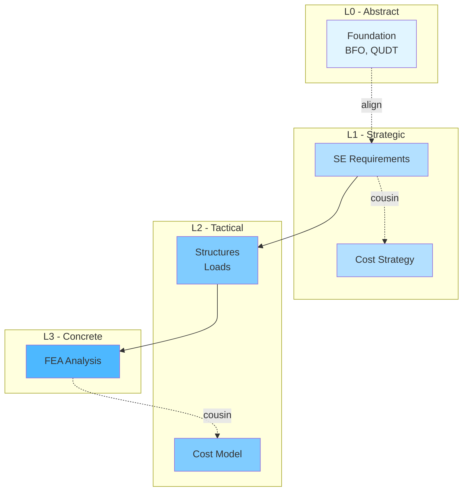
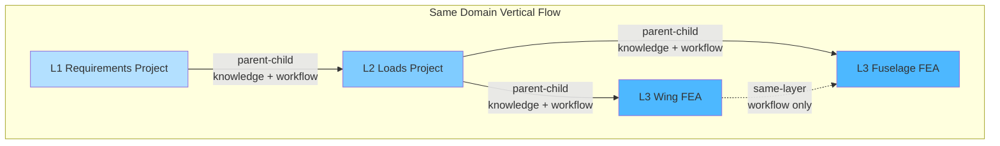
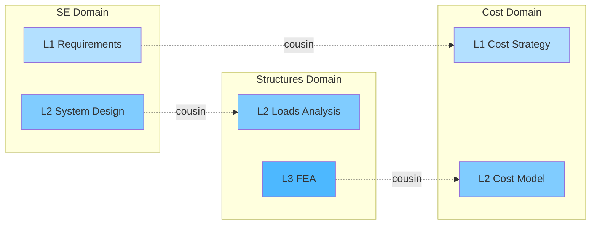
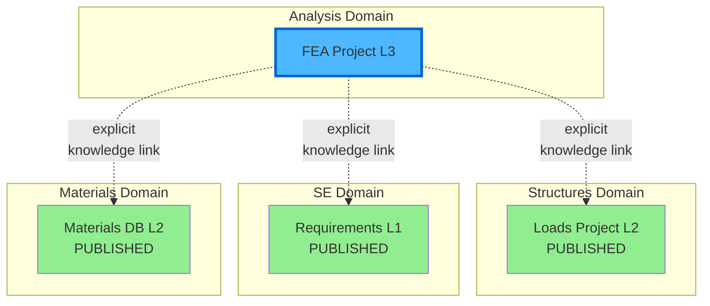
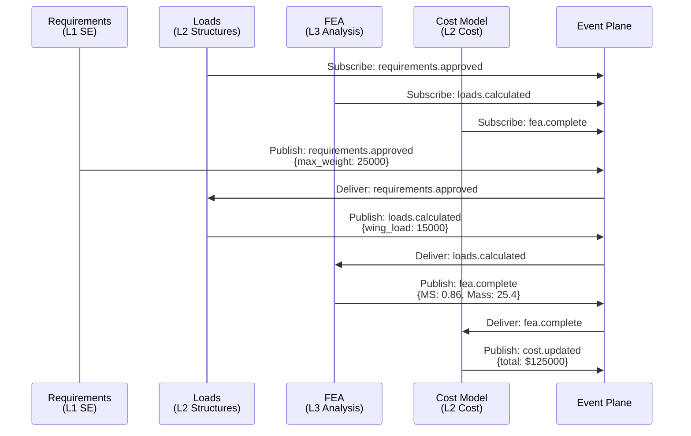
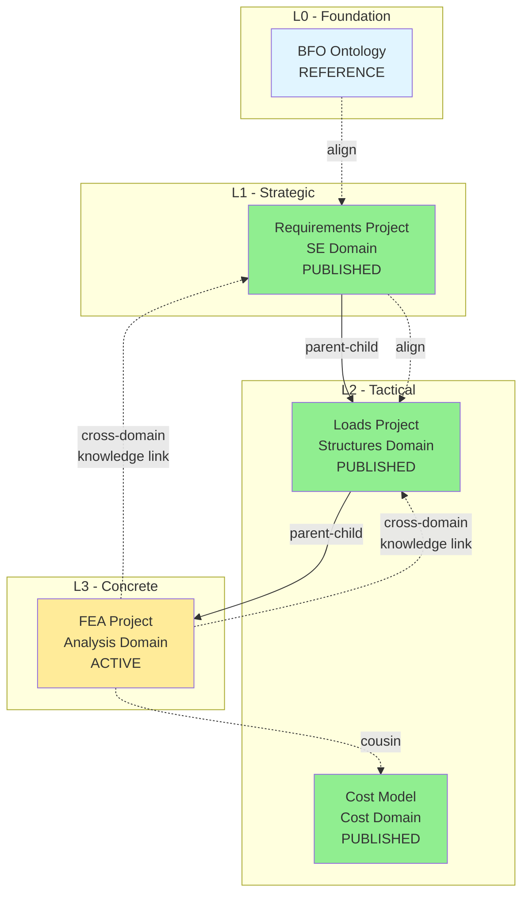
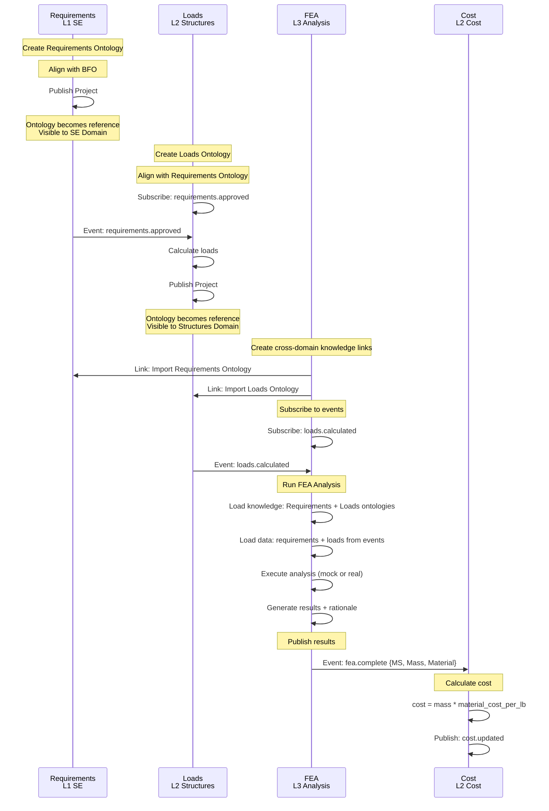
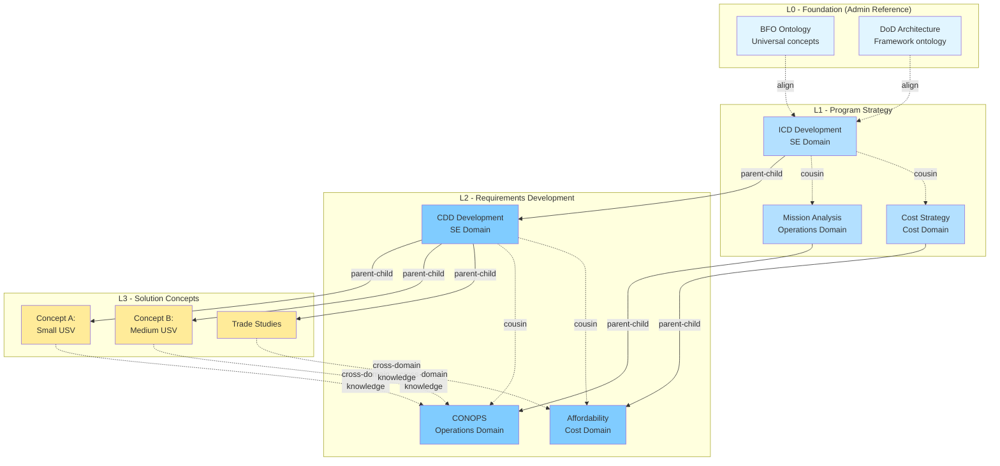
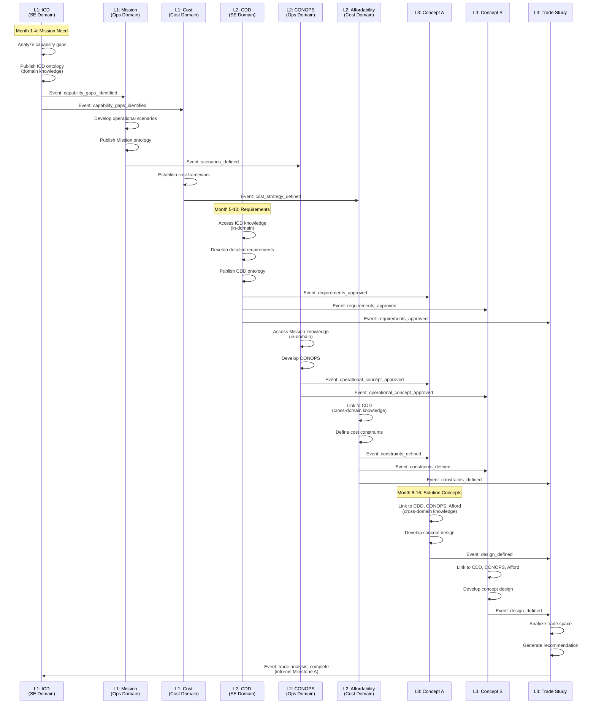

# Project Lattice and Knowledge Flow Architecture

**Document Type:** Architectural White Paper  
**Created:** November 17, 2025  
**Status:** Authoritative  
**Related Documents:** [ODRAS Software Description Document](odras_sdd.md)

---

## Executive Summary

This document defines the foundational architecture for project organization, knowledge dissemination, and workflow coordination in ODRAS. It establishes the distinction between **knowledge** (domain ontologies and engineering rationale) and **artifacts** (requirements, analysis results, data), and describes how each flows through the enterprise lattice.

The architecture supports the SDD's vision of a self-assembling, self-executing digital enterprise by enabling:
- Natural workflow coordination through parent-child project hierarchies
- Domain-wide knowledge dissemination for approved engineering knowledge
- Explicit cross-domain knowledge linkage when needed
- Unrestricted event-driven artifact flow via publish/subscribe

---

## 1. Core Architectural Principles

### 1.1 Project Lattice Structure

ODRAS organizes work into a lattice of **project cells** arranged across two dimensions:

**Layers (L0-L3):** Levels of abstraction
- **L0 (Abstract):** Foundational ontologies, universal concepts
- **L1 (Strategic):** Program-level strategy, high-level requirements
- **L2 (Tactical):** Subsystem design, detailed planning
- **L3 (Concrete):** Implementation, analysis, execution

**Domains:** Knowledge disciplines
- Systems Engineering, Cost, Structures, Analysis, Logistics, etc.
- Each domain maintains its own knowledge and practices



### 1.2 Knowledge vs. Artifacts

**CRITICAL DISTINCTION:**

**Knowledge** (ontological, domain-bounded):
- Domain ontologies defining how to model systems
- Engineering rationale and decision reasoning
- Analysis methods and best practices
- Machine-readable semantic structures
- Example: "Why 17-4PH selected: Better corrosion resistance + lower cost than 15-5PH"

**Artifacts** (data, unrestricted flow):
- Requirements text and constraints
- Analysis results (margins of safety, forces, masses)
- Cost data, test results, drawings
- Parameters and measurements
- Example: `{MS: 0.86, FoS_yld: 1.15, Material: "17-4PH", Mass: 25.4}`

This distinction drives how each flows through the system.

---

## 2. Project Relationships

### 2.1 Parent-Child Relationships

**Purpose:** Vertical workflow coordination and knowledge inheritance

**Rules:**
- **Cross-layer:** L0→L1→L2→L3 (knowledge flows downward)
- **Same-layer:** L1→L1, L2→L2, L3→L3 (workflow coordination)
- **NO upward:** L2 cannot parent L1 (prevents bottom-up pollution)

**Semantics:**
- Parent coordinates workflow of children
- Children inherit knowledge from activated parents (if cross-layer)
- Same-layer parent-child = sub-workflow organization



### 2.2 Cousin Relationships

**Purpose:** Cross-domain coordination

**Rules:**
- Connect projects in different domains
- Any layer to any layer
- Enable cross-domain collaboration

**Semantics:**
- Coordination and event subscription
- Do NOT automatically enable knowledge flow
- Knowledge linkage requires explicit cross-domain knowledge link



---

## 3. Knowledge Dissemination

### 3.1 In-Domain Knowledge (Domain-Wide)

**Principle:** Published knowledge is available to entire domain

**Rationale:**
- Engineers in same discipline should see approved work
- Supports top-down knowledge building
- Eliminates need for explicit in-domain links
- Maintains domain expertise coherence

**Mechanism:**
```python
def get_domain_knowledge(project):
    """Get all published knowledge in project's domain"""
    return Project.query.filter_by(
        domain=project.domain,
        publication_status='published'
    ).all()
```

**Example:**
```
SE Domain:
  ✓ Requirements Project (published)
  ✓ System Architecture (published)  } All visible to
  ✓ Interface Definitions (published) } entire SE domain
  ✗ New Analysis (draft)              } Not visible yet
```

### 3.2 Cross-Domain Knowledge (Explicit Links)

**Principle:** Cross-domain knowledge requires explicit linkage

**Rationale:**
- Controlled context for better reasoning
- Traceable dependencies
- Prevents knowledge overload
- DAS or SME identifies actual dependencies

**Mechanism:**
```sql
CREATE TABLE cross_domain_knowledge_links (
    link_id UUID PRIMARY KEY,
    source_project_id UUID,  -- Project requesting knowledge
    target_project_id UUID,  -- Project providing knowledge
    link_type VARCHAR(50),   -- ontology_import, rationale_reference
    created_by VARCHAR(50),  -- 'das' or user_id
    confidence FLOAT,        -- If DAS-suggested
    approved_by UUID         -- SME approval
);
```

**Example:**
```
FEA Project (Analysis Domain, L3) needs knowledge from:
  ├─ Structures Domain (explicit link)
  │   └─ Loads Project ontology + rationale
  ├─ SE Domain (explicit link)
  │   └─ Requirements Project ontology
  └─ Materials Domain (explicit link)
      └─ Materials Database ontology
```



---

## 4. Artifact and Event Flow

### 4.1 Pure Publish/Subscribe

**Principle:** Results, artifacts, and data flow via unrestricted pub/sub

**Characteristics:**
- Any project can publish events
- Any project can subscribe to any event
- No domain boundaries
- No layer restrictions
- Completely decoupled from knowledge visibility

**Event Types:**
```python
class EventType:
    REQUIREMENTS_APPROVED = "requirements.approved"
    LOADS_CALCULATED = "loads.calculated"
    ANALYSIS_COMPLETE = "analysis.complete"
    COST_UPDATED = "cost.updated"
    DESIGN_CHANGED = "design.changed"
    # ... any event type
```

### 4.2 Event Payload Structure

**Events carry data, not knowledge:**

```json
{
  "event_type": "fea.analysis_complete",
  "source_project_id": "uuid-fea-project",
  "timestamp": "2025-11-17T10:30:00Z",
  "data": {
    "margin_of_safety": 0.86,
    "factor_of_safety_yield": 1.15,
    "factor_of_safety_ultimate": 1.50,
    "material": "17-4PH",
    "mass_lbs": 25.4,
    "analysis_id": "uuid-analysis-123"
  }
}
```

### 4.3 Subscription Example



---

## 5. Ontology Relationships

### 5.1 Import vs. Alignment

**Two mechanisms for ontology relationships:**

#### Import (owl:imports)
**Purpose:** Bring entire ontology into reasoning scope  
**Use when:** Need full reasoning over imported classes/properties  
**Can import:**
- Foundational ontologies (BFO, QUDT)
- Other project's reference ontologies
- External ontologies
- Supporting ontologies within same project

```turtle
@prefix : <https://xma-adt.usn.mil/analysis/fea/ontologies/main#> .
@prefix req: <https://xma-adt.usn.mil/se/requirements/ontologies/main#> .

<https://xma-adt.usn.mil/analysis/fea/ontologies/main>
    a owl:Ontology ;
    owl:imports <https://xma-adt.usn.mil/se/requirements/ontologies/main> ;
    owl:imports <https://xma-adt.usn.mil/analysis/fea/ontologies/materials> .

:Analysis a owl:Class ;
    rdfs:subClassOf req:Requirement .  # Full reasoning available
```

#### Alignment (owl:equivalentClass, rdfs:subClassOf)
**Purpose:** Semantic linking without import overhead  
**Use when:** Want semantic relationship without full import  
**Can align to:**
- BFO classes (without importing entire BFO)
- Other ontology classes
- External standards

```turtle
@prefix : <https://xma-adt.usn.mil/se/requirements/ontologies/main#> .

:Requirement a owl:Class ;
    owl:equivalentClass <http://purl.obolibrary.org/obo/BFO_0000002> ;
    rdfs:comment "Aligned with BFO without importing it" .
```

### 5.2 Reference Ontologies

**Definition:** Project ontologies marked as "reference" when published

**Characteristics:**
- Available for import by other projects
- Available for alignment by other projects
- Represent domain knowledge in machine-readable form
- Subject to domain-wide visibility or cross-domain link rules

**Lifecycle:**
```
Draft → Review → Published (becomes reference) → Deprecated
```

---

## 6. Complete Workflow Example: FEA Analysis

### 6.1 Project Structure



### 6.2 Knowledge Flow

**FEA Project Knowledge Sources:**

1. **In-Domain Knowledge (Analysis Domain):**
   - All published Analysis domain ontologies
   - FEA best practices and methods
   - Analysis rationale from other projects

2. **Cross-Domain Knowledge (Explicit Links):**
   - Requirements ontology (from SE Domain)
   - Loads ontology (from Structures Domain)
   - Engineering rationale: "Why 17-4PH selected"

3. **Internal Knowledge:**
   - FEA-specific ontologies (materials, stress, analysis)
   - Project-specific calculations and methods

### 6.3 Artifact Flow (Events)

**FEA Project Event Subscriptions:**

```python
fea_project.subscribe([
    "requirements.approved",      # Get requirement data
    "loads.calculated",           # Get load case data
    "materials.cost_updated"      # Get material cost data
])
```

**FEA Project Event Publications:**

```python
fea_project.publish_event(
    event_type="fea.analysis_complete",
    data={
        "margin_of_safety": 0.86,
        "factor_of_safety_yield": 1.15,
        "factor_of_safety_ultimate": 1.50,
        "material": "17-4PH",
        "mass_lbs": 25.4,
        "max_stress_psi": 85000,
        "analysis_timestamp": "2025-11-17T10:30:00Z"
    }
)
```

### 6.4 Complete Sequence



---

## 7. Self-Assembly and DAS Orchestration

### 7.1 DAS Role in Program Bootstrap

**DAS can create entire program structure via API:**

```python
# Pseudo-code for DAS program assembly
class DASProgramAssembler:
    def bootstrap_aircraft_acquisition(self):
        """Create complete aircraft acquisition program structure"""
        
        # L0 - Foundation
        bfo = self.ensure_reference_ontology("BFO")
        qudt = self.ensure_reference_ontology("QUDT")
        
        # L1 - Strategic Layer
        req_project = self.create_project(
            name="Requirements",
            level=1,
            domain="SE",
            ontology_classes=["Requirement", "Component", "Function"],
            align_to=[bfo, qudt]
        )
        req_project.publish()
        
        # L2 - Tactical Layer
        loads_project = self.create_project(
            name="Loads Analysis",
            level=2,
            domain="Structures",
            parent=req_project,
            ontology_classes=["LoadCase", "Structure", "Load"],
            align_to=[req_project.ontology]
        )
        loads_project.subscribe("requirements.approved")
        loads_project.publish()
        
        # L3 - Concrete Layer
        fea_project = self.create_project(
            name="FEA Analysis",
            level=3,
            domain="Analysis",
            parent=loads_project,
            ontology_imports=[req_project.ontology, loads_project.ontology],
            knowledge_links=[req_project, loads_project]
        )
        fea_project.subscribe(["requirements.approved", "loads.calculated"])
        
        # L2 - Cost Domain (parallel)
        cost_project = self.create_project(
            name="Cost Model",
            level=2,
            domain="Cost",
            cousin_links=[fea_project]
        )
        cost_project.subscribe("fea.analysis_complete")
        
        # Create event flow expectations
        self.create_workflow_template(
            trigger="requirements.approved",
            sequence=[
                "loads.calculated",
                "fea.analysis_complete",
                "cost.updated"
            ]
        )
```

### 7.2 Project Templates

**Templates define structure for reusable project patterns:**

```json
{
  "template_name": "FEA_Analysis_L3",
  "template_version": "1.0",
  "layer": 3,
  "domain": "Analysis",
  "ontology_structure": {
    "main_classes": ["Analysis", "Stress", "Margin", "Material"],
    "alignment_required": ["Requirement", "Component", "LoadCase"]
  },
  "event_subscriptions": [
    "requirements.approved",
    "loads.calculated"
  ],
  "event_publications": [
    "fea.analysis_complete"
  ],
  "knowledge_links_required": [
    {"domain": "SE", "ontology": "Requirements"},
    {"domain": "Structures", "ontology": "Loads"}
  ],
  "calculations": {
    "margin_of_safety": "formula_reference",
    "factor_of_safety": "formula_reference"
  }
}
```

---

## 8. Implementation Schema

### 8.1 Core Tables

```sql
-- Projects table
CREATE TABLE public.projects (
    project_id UUID PRIMARY KEY DEFAULT gen_random_uuid(),
    name VARCHAR(255) NOT NULL,
    description TEXT,
    
    -- Structure
    domain VARCHAR(255) NOT NULL,
    project_level INTEGER CHECK (project_level IN (0, 1, 2, 3)),
    parent_project_id UUID REFERENCES public.projects(project_id) ON DELETE SET NULL,
    
    -- Publication state (gates knowledge visibility)
    publication_status VARCHAR(20) DEFAULT 'draft' 
        CHECK (publication_status IN ('draft', 'review', 'published', 'deprecated')),
    published_at TIMESTAMPTZ,
    published_by UUID REFERENCES public.users(user_id),
    
    -- Tenant (future multi-tenant support)
    tenant_id UUID,
    
    -- Standard fields
    namespace_id UUID REFERENCES namespace_registry(id),
    status VARCHAR(50) DEFAULT 'active',
    created_by UUID REFERENCES public.users(user_id),
    created_at TIMESTAMPTZ DEFAULT NOW(),
    updated_at TIMESTAMPTZ DEFAULT NOW(),
    is_active BOOLEAN DEFAULT TRUE,
    iri VARCHAR(1000) UNIQUE,
    
    -- Constraints
    CONSTRAINT no_self_parent CHECK (project_id != parent_project_id)
);

-- Cousin relationships (cross-domain coordination)
CREATE TABLE public.project_relationships (
    relationship_id UUID PRIMARY KEY DEFAULT gen_random_uuid(),
    source_project_id UUID NOT NULL REFERENCES public.projects(project_id) ON DELETE CASCADE,
    target_project_id UUID NOT NULL REFERENCES public.projects(project_id) ON DELETE CASCADE,
    relationship_type VARCHAR(50) NOT NULL,  -- coordinates_with, depends_on, similar_to
    description TEXT,
    created_by UUID REFERENCES public.users(user_id),
    created_at TIMESTAMPTZ DEFAULT NOW(),
    
    UNIQUE(source_project_id, target_project_id, relationship_type),
    CHECK (source_project_id != target_project_id)
);

-- Cross-domain knowledge links (explicit knowledge access)
CREATE TABLE public.cross_domain_knowledge_links (
    link_id UUID PRIMARY KEY DEFAULT gen_random_uuid(),
    source_project_id UUID NOT NULL REFERENCES public.projects(project_id) ON DELETE CASCADE,
    target_project_id UUID NOT NULL REFERENCES public.projects(project_id) ON DELETE CASCADE,
    
    -- What kind of knowledge is linked
    link_type VARCHAR(50) NOT NULL,  -- ontology_import, rationale_reference, method_reference
    
    -- Specific elements (optional)
    source_element_iri TEXT,
    target_element_iri TEXT,
    
    -- How was this identified
    identified_by VARCHAR(50) NOT NULL,  -- 'das', 'user', 'system'
    confidence FLOAT,  -- For DAS-suggested links
    
    -- Approval workflow
    status VARCHAR(20) DEFAULT 'proposed' CHECK (status IN ('proposed', 'approved', 'rejected')),
    approved_by UUID REFERENCES public.users(user_id),
    approved_at TIMESTAMPTZ,
    
    -- Must be cross-domain
    CHECK (
        (SELECT domain FROM projects WHERE project_id = source_project_id) !=
        (SELECT domain FROM projects WHERE project_id = target_project_id)
    ),
    
    created_by UUID REFERENCES public.users(user_id),
    created_at TIMESTAMPTZ DEFAULT NOW(),
    
    UNIQUE(source_project_id, target_project_id, link_type)
);

-- Event subscriptions (runtime, may be cached in DB)
CREATE TABLE public.project_event_subscriptions (
    subscription_id UUID PRIMARY KEY DEFAULT gen_random_uuid(),
    project_id UUID NOT NULL REFERENCES public.projects(project_id) ON DELETE CASCADE,
    event_type VARCHAR(100) NOT NULL,  -- requirements.approved, fea.complete, etc.
    source_project_id UUID REFERENCES public.projects(project_id) ON DELETE CASCADE,  -- NULL = any source
    is_active BOOLEAN DEFAULT TRUE,
    created_at TIMESTAMPTZ DEFAULT NOW()
);

-- Indexes
CREATE INDEX idx_projects_domain ON public.projects(domain);
CREATE INDEX idx_projects_level ON public.projects(project_level);
CREATE INDEX idx_projects_parent ON public.projects(parent_project_id);
CREATE INDEX idx_projects_publication ON public.projects(publication_status);
CREATE INDEX idx_project_relationships_source ON public.project_relationships(source_project_id);
CREATE INDEX idx_project_relationships_target ON public.project_relationships(target_project_id);
CREATE INDEX idx_knowledge_links_source ON public.cross_domain_knowledge_links(source_project_id);
CREATE INDEX idx_knowledge_links_target ON public.cross_domain_knowledge_links(target_project_id);
CREATE INDEX idx_event_subs_project ON public.project_event_subscriptions(project_id);
CREATE INDEX idx_event_subs_type ON public.project_event_subscriptions(event_type);
```

### 8.2 Query Helpers

```python
class ProjectKnowledgeService:
    """Service for managing knowledge visibility and access"""
    
    def get_visible_knowledge(self, project_id: str) -> List[Project]:
        """
        Get all knowledge visible to a project.
        
        Returns:
            - In-domain published projects
            - Cross-domain projects with explicit links
            - Parent chain (if cross-layer)
        """
        project = self.get_project(project_id)
        visible = []
        
        # 1. In-domain knowledge (domain-wide dissemination)
        domain_projects = db.query("""
            SELECT * FROM projects
            WHERE domain = %s
            AND publication_status = 'published'
            AND project_id != %s
        """, project.domain, project_id)
        visible.extend(domain_projects)
        
        # 2. Cross-domain knowledge (explicit links)
        linked_projects = db.query("""
            SELECT p.* FROM projects p
            JOIN cross_domain_knowledge_links l ON l.target_project_id = p.project_id
            WHERE l.source_project_id = %s
            AND l.status = 'approved'
            AND p.publication_status = 'published'
        """, project_id)
        visible.extend(linked_projects)
        
        # 3. Parent chain (cross-layer inheritance)
        parent = project.parent
        while parent:
            if parent.publication_status == 'published':
                if parent.project_level < project.project_level:
                    # Only inherit from higher abstraction layers
                    visible.append(parent)
            parent = parent.parent
        
        return visible
    
    def get_event_subscribers(self, project_id: str, event_type: str) -> List[Project]:
        """Get all projects subscribed to this project's events"""
        return db.query("""
            SELECT p.* FROM projects p
            JOIN project_event_subscriptions s ON s.project_id = p.project_id
            WHERE (s.source_project_id = %s OR s.source_project_id IS NULL)
            AND s.event_type = %s
            AND s.is_active = TRUE
        """, project_id, event_type)
```

---

## 9. Validation Rules

### 9.1 Project Relationship Validation

```python
def validate_parent_child(parent: Project, child: Project) -> ValidationResult:
    """Validate parent-child relationship"""
    
    # Rule 1: No self-reference
    if parent.project_id == child.project_id:
        return ValidationResult(False, "Project cannot be its own parent")
    
    # Rule 2: No upward relationships (knowledge flows downward)
    if parent.project_level > child.project_level:
        return ValidationResult(
            False,
            f"Parent L{parent.project_level} cannot be parent of child L{child.project_level}. "
            "Knowledge flows downward only (L0→L1→L2→L3)."
        )
    
    # Rule 3: Circular reference detection
    if would_create_circle(child.project_id, parent.project_id):
        return ValidationResult(False, "Circular reference detected")
    
    return ValidationResult(True)

def validate_cousin_relationship(source: Project, target: Project) -> ValidationResult:
    """Validate cousin relationship"""
    
    # Cousins can be any layer, any domain
    # No restrictions - just coordination
    
    if source.project_id == target.project_id:
        return ValidationResult(False, "Project cannot be cousin to itself")
    
    return ValidationResult(True)

def validate_cross_domain_knowledge_link(source: Project, target: Project) -> ValidationResult:
    """Validate cross-domain knowledge link"""
    
    # Rule 1: Must be different domains
    if source.domain == target.domain:
        return ValidationResult(
            False,
            "Cross-domain knowledge links must be between different domains. "
            f"Both projects are in '{source.domain}' domain. "
            "Use in-domain dissemination instead."
        )
    
    # Rule 2: Target must be published
    if target.publication_status != 'published':
        return ValidationResult(
            False,
            f"Target project must be published to create knowledge link. "
            f"Current status: {target.publication_status}"
        )
    
    return ValidationResult(True)
```

---

## 10. API Endpoints

### 10.1 Project Management

```
POST   /api/projects
  body: { name, domain, project_level, parent_project_id?, description? }
  
GET    /api/projects/{project_id}
  returns: Complete project details including relationships

PUT    /api/projects/{project_id}
  body: { name?, description?, publication_status? }

DELETE /api/projects/{project_id}
```

### 10.2 Relationships

```
POST   /api/projects/{project_id}/relationships
  body: { target_project_id, relationship_type }
  
GET    /api/projects/{project_id}/relationships
  query: ?type=cousin|parent|child
  
DELETE /api/projects/{project_id}/relationships/{relationship_id}
```

### 10.3 Knowledge Links

```
POST   /api/projects/{project_id}/knowledge-links
  body: { target_project_id, link_type, identified_by }
  
GET    /api/projects/{project_id}/knowledge-links
  returns: All cross-domain knowledge links
  
PUT    /api/projects/{project_id}/knowledge-links/{link_id}/approve
  Approve DAS-suggested link (SME only)
  
DELETE /api/projects/{project_id}/knowledge-links/{link_id}
```

### 10.4 Knowledge Queries

```
GET    /api/projects/{project_id}/visible-knowledge
  returns: All knowledge visible to this project
  
GET    /api/projects/{project_id}/domain-knowledge
  returns: All published knowledge in project's domain
  
GET    /api/projects/{project_id}/lineage
  returns: Complete parent chain up to L0
```

### 10.5 Event Management

```
POST   /api/projects/{project_id}/subscriptions
  body: { event_type, source_project_id? }
  
GET    /api/projects/{project_id}/subscriptions
  returns: All event subscriptions
  
POST   /api/projects/{project_id}/publish-event
  body: { event_type, data }
  
GET    /api/projects/{project_id}/subscribers?event_type={type}
  returns: All projects subscribed to this project's events
```

---

## 11. Conclusion

This architecture provides:

1. **Clear separation** between knowledge (domain-bounded) and artifacts (unrestricted)
2. **Flexible structure** supporting natural workflow hierarchies
3. **Domain cohesion** through domain-wide knowledge dissemination
4. **Controlled coupling** through explicit cross-domain knowledge links
5. **Event-driven coordination** via unrestricted publish/subscribe
6. **Self-assembly capability** enabling DAS to bootstrap entire programs
7. **Semantic flexibility** supporting both ontology import and alignment

The model aligns with the SDD's vision of a self-assembling, self-executing digital enterprise while maintaining practical constraints for reasoning, context management, and traceability.

---

## References

- [ODRAS Software Description Document](odras_sdd.md) - Section 4 (Project Model), Section 10 (Processes and Execution)
- [Domain-Centric Project Hierarchy Design](../features/DOMAIN_CENTRIC_PROJECT_HIERARCHY.md)
- [ODRAS Cellular Architecture](core-architecture/ODRAS_CELLULAR_ARCHITECTURE.md)
- [Publishing Architecture](PUBLISHING_ARCHITECTURE.md)

---

## Appendix A: Pre-Milestone A Acquisition Example

### A.1 Scenario Overview

**Context:** Naval unmanned surface vehicle (USV) capability gap identified  
**Phase:** Pre-Milestone A (Material Solution Analysis)  
**Timeline:** 12-18 months before Milestone A decision  
**Goal:** Develop Initial Capabilities Document (ICD) → Capability Development Document (CDD) → Solution concepts

**Key Activities:**
1. Mission need identification and analysis
2. Capability gap documentation
3. Requirements development and refinement
4. Solution space exploration
5. Concept evaluation and trade studies

### A.2 ODRAS Project Structure for Pre-Milestone A



### A.3 Knowledge Flow in Pre-Milestone A

#### Phase 1: Mission Need and ICD (Months 1-4)

**L1 ICD Development Project (SE Domain):**

```python
# Knowledge created:
icd_ontology = {
    "classes": [
        "CapabilityGap",      # What capability is missing
        "MissionThread",      # How capability supports missions
        "OperationalTask",    # What operators need to do
        "PerformanceGoal"     # High-level performance targets
    ],
    "alignment": {
        "CapabilityGap": "dod:Capability",
        "MissionThread": "dod:Mission"
    }
}

# Artifacts published:
icd_project.publish_event(
    event_type="icd.capability_gaps_identified",
    data={
        "capability_gaps": [
            {
                "gap_id": "GAP-001",
                "title": "Persistent ISR in Littoral Environment",
                "description": "Insufficient persistent surveillance capability in contested littoral waters",
                "priority": "high",
                "operational_impact": "Cannot maintain continuous maritime domain awareness"
            },
            {
                "gap_id": "GAP-002", 
                "title": "Low-Signature Maritime Patrol",
                "description": "Need low-observable platform for reconnaissance",
                "priority": "medium",
                "operational_impact": "Increased risk to manned platforms"
            }
        ],
        "mission_threads": [
            "Littoral ISR",
            "Mine Countermeasures",
            "Anti-Surface Warfare"
        ]
    }
)
```

**L1 Mission Analysis Project (Operations Domain):**

```python
# Subscribes to ICD events
mission_project.subscribe("icd.capability_gaps_identified")

# Creates mission-specific ontology
mission_ontology = {
    "classes": [
        "OperationalScenario",
        "Threat",
        "Environment",
        "OperationalConstraint"
    ]
}

# Publishes mission analysis
mission_project.publish_event(
    event_type="mission.scenarios_defined",
    data={
        "scenarios": [
            {
                "scenario_id": "SCEN-001",
                "name": "Strait Patrol",
                "environment": "Littoral, High Traffic",
                "threat_level": "Medium",
                "duration_hours": 72,
                "area_nm2": 5000
            }
        ],
        "constraints": [
            "Must operate in Sea State 4",
            "Undetectable by coastal radar",
            "Autonomous operation for 72+ hours"
        ]
    }
)
```

#### Phase 2: CDD and Requirements (Months 5-10)

**L2 CDD Development Project (SE Domain):**

```python
# Inherits knowledge from L1 ICD (domain-wide in SE)
# Subscribes to mission analysis
cdd_project.subscribe(["icd.capability_gaps_identified", "mission.scenarios_defined"])

# Creates detailed requirements ontology
cdd_ontology = {
    "classes": [
        "Requirement",        # Refined from ICD
        "SystemFunction",     # What system must do
        "PerformanceBound",   # Quantified performance
        "Interface"           # How system integrates
    ],
    "alignment": {
        "Requirement": "icd:PerformanceGoal",  # Aligns with parent
        "SystemFunction": "mission:OperationalTask"
    }
}

# Publishes threshold and objective requirements
cdd_project.publish_event(
    event_type="cdd.requirements_approved",
    data={
        "requirements": [
            {
                "req_id": "REQ-001",
                "text": "The system shall conduct persistent ISR operations for 72 hours [T] / 96 hours [O]",
                "type": "Performance",
                "source_gap": "GAP-001",
                "threshold": "72 hours",
                "objective": "96 hours",
                "kpp": True  # Key Performance Parameter
            },
            {
                "req_id": "REQ-002",
                "text": "The system shall have a radar cross-section ≤ 5 m² [T] / ≤ 2 m² [O]",
                "type": "Performance",
                "source_gap": "GAP-002",
                "threshold": "5 m²",
                "objective": "2 m²",
                "kpp": True
            },
            {
                "req_id": "REQ-003",
                "text": "The system shall operate in Sea State 4 [T] / Sea State 5 [O]",
                "type": "Environmental",
                "source_constraint": "mission.SCEN-001",
                "threshold": "SS4",
                "objective": "SS5"
            }
        ],
        "verification_approach": {
            "REQ-001": "Test (at-sea demonstration)",
            "REQ-002": "Analysis + Test (RCS measurement)",
            "REQ-003": "Test (environmental chamber + at-sea)"
        }
    }
)
```

**L2 CONOPS Project (Operations Domain):**

```python
# Creates operational concept ontology
conops_ontology = {
    "classes": [
        "OperationalMode",
        "MissionPhase",
        "CrewInteraction",
        "LogisticsFootprint"
    ]
}

# Publishes operational concept
conops_project.publish_event(
    event_type="conops.operational_concept_approved",
    data={
        "operational_modes": [
            {
                "mode": "Autonomous Patrol",
                "description": "USV operates independently following pre-programmed route",
                "human_interaction": "Minimal (command approval only)",
                "duration": "Up to 72 hours"
            },
            {
                "mode": "Remote Control",
                "description": "Operator controls USV via satellite link",
                "human_interaction": "Continuous",
                "use_case": "Complex navigation or threat response"
            }
        ],
        "logistics": {
            "deployment": "Deployed from LCS or shore facility",
            "recovery": "Self-docking or crane recovery",
            "maintenance": "Depot-level only"
        }
    }
)
```

**L2 Affordability Project (Cost Domain):**

```python
# Links to CDD for requirements
affordability_project.create_knowledge_link(
    target=cdd_project,
    link_type="requirement_reference"
)

# Subscribes to requirements
affordability_project.subscribe("cdd.requirements_approved")

# Publishes cost constraints
affordability_project.publish_event(
    event_type="cost.constraints_defined",
    data={
        "cost_targets": {
            "unit_procurement_cost_threshold": 15_000_000,  # $15M
            "unit_procurement_cost_objective": 10_000_000,  # $10M
            "annual_operating_cost": 500_000,               # $500K
            "lifecycle_cost": 75_000_000                    # $75M over 15 years
        },
        "affordability_drivers": [
            "COTS components preferred",
            "Minimal crew training",
            "Commercial maintenance"
        ]
    }
)
```

#### Phase 3: Solution Conceptualization (Months 8-16)

**L3 Concept A: Small USV**

```python
# Links to multiple domain knowledge sources
concept_a.create_knowledge_links([
    {"target": cdd_project, "link_type": "requirement_satisfaction"},
    {"target": conops_project, "link_type": "operational_alignment"},
    {"target": affordability_project, "link_type": "cost_basis"}
])

# Subscribes to all upstream artifacts
concept_a.subscribe([
    "cdd.requirements_approved",
    "conops.operational_concept_approved",
    "cost.constraints_defined"
])

# Creates concept-specific ontology
concept_a_ontology = {
    "classes": [
        "PhysicalCharacteristic",
        "SubsystemConcept",
        "TechnologyElement",
        "RiskElement"
    ]
}

# Publishes concept definition
concept_a.publish_event(
    event_type="concept.design_defined",
    data={
        "concept_id": "CONCEPT-A",
        "name": "Small Autonomous USV",
        "characteristics": {
            "length_ft": 25,
            "displacement_tons": 8,
            "speed_knots": 30,
            "endurance_hours": 72,
            "payload_capacity_lbs": 500
        },
        "subsystems": [
            {
                "subsystem": "Propulsion",
                "concept": "Diesel-electric hybrid",
                "maturity": "TRL 7"
            },
            {
                "subsystem": "ISR Suite",
                "concept": "EO/IR + AIS receiver",
                "maturity": "TRL 8"
            },
            {
                "subsystem": "Autonomy",
                "concept": "Waypoint navigation + collision avoidance",
                "maturity": "TRL 6"
            }
        ],
        "requirement_satisfaction": {
            "REQ-001": {"satisfied": True, "margin": "24 hours"},
            "REQ-002": {"satisfied": True, "margin": "2 m² RCS"},
            "REQ-003": {"satisfied": True, "margin": "SS4 verified"}
        },
        "cost_estimate": {
            "unit_cost": 12_000_000,
            "meets_threshold": True,
            "meets_objective": False
        },
        "risks": [
            {
                "risk": "Autonomy software maturity",
                "likelihood": "Medium",
                "impact": "High",
                "mitigation": "Spiral development with increasing autonomy"
            }
        ]
    }
)
```

**L3 Concept B: Medium USV**

```python
# Similar structure to Concept A, different parameters
concept_b.publish_event(
    event_type="concept.design_defined",
    data={
        "concept_id": "CONCEPT-B",
        "name": "Medium Multi-Mission USV",
        "characteristics": {
            "length_ft": 40,
            "displacement_tons": 20,
            "speed_knots": 25,
            "endurance_hours": 96,
            "payload_capacity_lbs": 2000
        },
        "requirement_satisfaction": {
            "REQ-001": {"satisfied": True, "margin": "48 hours"},
            "REQ-002": {"satisfied": True, "margin": "1 m² RCS"},
            "REQ-003": {"satisfied": True, "margin": "SS5 verified"}
        },
        "cost_estimate": {
            "unit_cost": 18_000_000,
            "meets_threshold": False,  # Exceeds $15M threshold
            "meets_objective": False
        }
    }
)
```

**L3 Trade Study Project**

```python
# Subscribes to all concept events
trade_study.subscribe([
    "concept.design_defined",
    "cost.constraints_defined"
])

# Creates trade study ontology
trade_ontology = {
    "classes": [
        "TradeParameter",
        "ComparisonCriterion",
        "TradeResult",
        "Recommendation"
    ]
}

# Publishes trade analysis
trade_study.publish_event(
    event_type="trade.analysis_complete",
    data={
        "trade_study_id": "TRADE-001",
        "title": "USV Size/Capability Trade",
        "concepts_evaluated": ["CONCEPT-A", "CONCEPT-B"],
        "criteria": [
            {
                "criterion": "Mission Performance",
                "weight": 0.40,
                "scores": {"CONCEPT-A": 85, "CONCEPT-B": 95}
            },
            {
                "criterion": "Affordability",
                "weight": 0.30,
                "scores": {"CONCEPT-A": 90, "CONCEPT-B": 65}
            },
            {
                "criterion": "Technical Risk",
                "weight": 0.20,
                "scores": {"CONCEPT-A": 75, "CONCEPT-B": 80}
            },
            {
                "criterion": "Schedule",
                "weight": 0.10,
                "scores": {"CONCEPT-A": 90, "CONCEPT-B": 85}
            }
        ],
        "weighted_scores": {
            "CONCEPT-A": 85.5,
            "CONCEPT-B": 84.0
        },
        "recommendation": {
            "preferred_concept": "CONCEPT-A",
            "rationale": "Concept A meets threshold requirements with acceptable margin, stays within cost threshold, and presents lower technical risk. Recommend pursuing with Technology Development Strategy to mature autonomy software.",
            "alternatives": "If mission performance is paramount and additional funding available, Concept B provides superior capability."
        }
    }
)
```

### A.4 Complete Pre-Milestone A Event Flow



### A.5 Knowledge Repository After Pre-Milestone A

**Domain Knowledge (Ontologies - Published and Available):**

```
SE Domain:
  ✓ ICD Ontology (CapabilityGap, MissionThread, PerformanceGoal)
  ✓ CDD Ontology (Requirement, SystemFunction, PerformanceBound, Interface)
  → Available to all SE domain projects

Operations Domain:
  ✓ Mission Analysis Ontology (OperationalScenario, Threat, Environment)
  ✓ CONOPS Ontology (OperationalMode, MissionPhase, CrewInteraction)
  → Available to all Operations domain projects

Cost Domain:
  ✓ Cost Strategy Ontology
  ✓ Affordability Ontology (CostTarget, CostDriver)
  → Available to all Cost domain projects

Analysis Domain:
  ✓ Trade Study Ontology (TradeParameter, ComparisonCriterion, TradeResult)
  → Available to all Analysis domain projects
```

**Cross-Domain Knowledge Links (Explicit):**

```
Concept A → CDD (SE): Requirements reference
Concept A → CONOPS (Ops): Operational alignment
Concept A → Affordability (Cost): Cost basis

Concept B → CDD (SE): Requirements reference
Concept B → CONOPS (Ops): Operational alignment
Concept B → Affordability (Cost): Cost basis

Trade Study → Affordability (Cost): Cost constraints
```

**Artifacts (Available via Event History):**

```
- Capability gap descriptions
- Mission scenarios
- Threshold/objective requirements
- Operational concepts
- Cost constraints
- Concept designs
- Requirement satisfaction matrices
- Trade study results
- Recommendation for Milestone A
```

### A.6 DAS Role in Pre-Milestone A

**DAS can bootstrap the entire program structure:**

```python
# DAS assembles Pre-Milestone A program
def bootstrap_usv_acquisition():
    """DAS creates complete Pre-Milestone A structure"""
    
    # Create L1 strategic layer
    icd = das.create_project(
        name="USV ICD Development",
        level=1,
        domain="SE",
        template="ICD_Development_L1"
    )
    
    mission = das.create_project(
        name="Mission Analysis",
        level=1,
        domain="Operations",
        cousin_links=[icd]
    )
    
    # Create L2 requirements layer
    cdd = das.create_project(
        name="USV CDD Development",
        level=2,
        domain="SE",
        parent=icd,
        template="CDD_Development_L2"
    )
    
    conops = das.create_project(
        name="USV CONOPS",
        level=2,
        domain="Operations",
        parent=mission
    )
    
    # Create L3 solution concepts
    concept_a = das.create_project(
        name="Small USV Concept",
        level=3,
        domain="Analysis",
        parent=cdd,
        template="Concept_Definition_L3"
    )
    
    # Set up event subscriptions
    das.create_event_flow(
        sequence=[
            "icd.capability_gaps_identified",
            "mission.scenarios_defined",
            "cdd.requirements_approved",
            "conops.operational_concept_approved",
            "concept.design_defined",
            "trade.analysis_complete"
        ]
    )
    
    # DAS can also suggest knowledge links
    das.suggest_knowledge_link(
        source=concept_a,
        target=cdd,
        rationale="Concept A references CDD requirements for satisfaction analysis",
        confidence=0.95
    )
```

### A.7 Benefits for Navy Acquisition Teams

**1. Traceability:**
- Every requirement traces to capability gap
- Every concept traces to requirements
- Every trade decision has provenance

**2. Knowledge Reuse:**
- ICD/CDD ontologies reusable for similar programs
- Mission analysis patterns applicable to other systems
- Trade study methods available across programs

**3. Rapid Analysis:**
- DAS can generate concept comparisons automatically
- Sensitivity analysis on requirement changes
- Impact assessment on cost constraint changes

**4. Collaboration:**
- SE, Operations, Cost domains work in parallel
- Event-driven coordination eliminates waiting
- Cross-domain knowledge links explicit and traceable

**5. Decision Support:**
- Complete artifact history for Milestone A decision
- Trade study results linked to source data
- Risk assessment integrated with concept evaluation

**6. Program Continuity:**
- Knowledge persists as program evolves
- New team members see complete rationale
- Lessons learned captured in domain knowledge

---

**Document Control:**
- Version: 1.0
- Last Updated: November 17, 2025
- Next Review: As implementation progresses
- Status: Authoritative - Implementation Required
