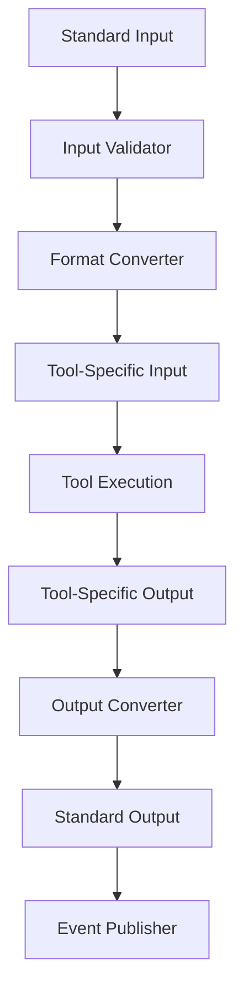

# Project Cell Tool Decoupling Architecture

## Overview

Project cells in ODRAS provide a powerful abstraction layer that enables complex tool ecosystems to be encapsulated and decoupled from the broader system. This document describes how cells can effectively hide complex modeling, simulation, and analysis tools (such as AFSIM) behind clean interfaces, allowing other cells to interact only with standardized inputs, outputs, and events.

## Core Concept

### The Decoupling Problem

In complex engineering environments, different tools and ecosystems often have:
- Incompatible data formats
- Different execution environments
- Complex dependency chains
- Proprietary interfaces
- Varying performance characteristics

### The Cell Solution

Project cells solve this by providing:
- **Standardized Interfaces**: Clean input/output contracts
- **Tool Abstraction**: Hide implementation complexity
- **Event-Driven Communication**: Asynchronous interaction patterns
- **Data Transformation**: Automatic format conversion
- **Execution Isolation**: Independent tool execution environments

## Architecture Pattern

### Cell Interface Standard

Each project cell exposes a standardized interface:

```yaml
Cell Interface:
  Inputs:
    - data: Standardized input schema
    - parameters: Configuration parameters
    - triggers: Event-based triggers
    
  Outputs:
    - results: Processed data outputs
    - status: Execution status
    - metadata: Processing metadata
    
  Events:
    - started: Cell execution began
    - progress: Execution progress updates
    - completed: Execution finished
    - error: Error conditions
    - data_ready: New data available
```

### AFSIM Integration Example

#### Cell Definition: AFSIM Analysis Cell

```yaml
Cell Name: afsim_analysis_cell
Purpose: Perform AFSIM-based simulation analysis
Tools: AFSIM, MATLAB, Python analysis scripts

Interface:
  Inputs:
    - scenario_data: JSON schema for scenario parameters
    - aircraft_models: Standardized aircraft model definitions
    - mission_parameters: Mission-specific parameters
    - analysis_type: Type of analysis to perform
    
  Outputs:
    - simulation_results: Standardized results format
    - performance_metrics: Key performance indicators
    - visualization_data: Charts and plots data
    - analysis_report: Comprehensive analysis report
    
  Events:
    - simulation_started: AFSIM simulation initiated
    - simulation_progress: Progress updates (0-100%)
    - simulation_completed: Analysis finished
    - results_available: New results ready for consumption
```

#### Internal Implementation (Hidden from Other Cells)

```python
class AFSIMAnalysisCell:
    def __init__(self):
        self.afsim_engine = AFSIMEngine()
        self.matlab_interface = MATLABInterface()
        self.python_analyzer = PythonAnalyzer()
        
    def execute_analysis(self, inputs):
        # Convert standardized inputs to AFSIM format
        afsim_scenario = self.convert_to_afsim_format(inputs)
        
        # Execute AFSIM simulation
        afsim_results = self.afsim_engine.run_simulation(afsim_scenario)
        
        # Process results with MATLAB
        matlab_analysis = self.matlab_interface.analyze_results(afsim_results)
        
        # Generate final outputs with Python
        final_results = self.python_analyzer.process(matlab_analysis)
        
        # Convert to standardized output format
        return self.convert_to_standard_format(final_results)
```

## Decoupling Benefits

### 1. Tool Ecosystem Isolation

**Before Decoupling:**
- Other cells need AFSIM knowledge
- Complex dependency management
- Tool-specific error handling
- Incompatible data formats

**After Decoupling:**
- Other cells only know standard interfaces
- Clean dependency boundaries
- Standardized error handling
- Automatic format conversion

### 2. Implementation Flexibility

```yaml
Cell Evolution Examples:
  
  AFSIM Cell v1:
    Tools: AFSIM only
    Performance: Slow, single-threaded
    
  AFSIM Cell v2:
    Tools: AFSIM + MATLAB optimization
    Performance: 3x faster, parallel processing
    
  AFSIM Cell v3:
    Tools: AFSIM + Python ML models
    Performance: 10x faster, predictive analysis
    
  Interface: Unchanged - other cells unaffected
```

### 3. Testing and Validation

```python
# Other cells can test against mock interfaces
class MockAFSIMCell:
    def execute_analysis(self, inputs):
        return {
            "simulation_results": mock_results,
            "performance_metrics": mock_metrics,
            "analysis_report": mock_report
        }

# Test scenarios without AFSIM dependencies
test_scenario = {
    "scenario_data": {...},
    "aircraft_models": {...},
    "mission_parameters": {...}
}

# Cell works with mock or real implementation
result = afsim_cell.execute_analysis(test_scenario)
```

## Implementation Patterns

### Pattern 1: Tool Wrapper Cells

```yaml
Purpose: Wrap single complex tools
Example: AFSIM, MATLAB, Ansys, etc.

Structure:
  - Input Adapter: Convert standard → tool format
  - Tool Executor: Run the actual tool
  - Output Adapter: Convert tool format → standard
  - Event Manager: Handle tool lifecycle events
```

### Pattern 2: Pipeline Cells

```yaml
Purpose: Chain multiple tools together
Example: AFSIM → MATLAB → Python → Report

Structure:
  - Pipeline Orchestrator: Manage tool sequence
  - Data Flow Manager: Handle data between tools
  - Error Recovery: Handle tool failures
  - Progress Tracking: Monitor pipeline execution
```

### Pattern 3: Service Integration Cells

```yaml
Purpose: Integrate external services
Example: Cloud APIs, databases, web services

Structure:
  - Service Client: Interface with external service
  - Authentication Manager: Handle credentials
  - Rate Limiter: Manage API limits
  - Cache Manager: Optimize performance
```

## Data Flow Architecture

### Input Processing



### Event-Driven Communication

```yaml
Event Flow:
  1. Cell receives input data
  2. Publishes 'analysis_started' event
  3. Other cells can subscribe to progress
  4. Publishes 'analysis_progress' events
  5. Publishes 'analysis_completed' event
  6. Publishes 'results_available' event
  7. Other cells can consume results
```

## Configuration Management

### Cell Configuration Schema

```yaml
afsim_analysis_cell:
  tools:
    afsim:
      version: "2023.1"
      license_server: "afsim-license.company.com"
      timeout: 3600
      
    matlab:
      version: "R2023b"
      toolboxes: ["Aerospace", "Statistics"]
      
    python:
      version: "3.9"
      packages: ["numpy", "scipy", "matplotlib"]
      
  execution:
    max_concurrent: 2
    retry_attempts: 3
    timeout: 7200
    
  interfaces:
    input_schema: "afsim_input_v1.json"
    output_schema: "afsim_output_v1.json"
    event_schema: "afsim_events_v1.json"
```

## Error Handling and Recovery

### Standardized Error Patterns

```yaml
Error Types:
  - Input Validation Errors
  - Tool Execution Errors
  - Data Conversion Errors
  - Timeout Errors
  - Resource Exhaustion Errors

Error Response:
  - Error Code: Standardized error codes
  - Error Message: Human-readable description
  - Recovery Suggestions: Possible solutions
  - Retry Information: Retry policies
  - Fallback Options: Alternative approaches
```

### Recovery Strategies

```python
class AFSIMCellErrorHandler:
    def handle_error(self, error, context):
        if error.type == "AFSIM_LICENSE_ERROR":
            return self.retry_with_different_license()
        elif error.type == "AFSIM_TIMEOUT":
            return self.split_analysis_into_chunks()
        elif error.type == "MATLAB_CRASH":
            return self.fallback_to_python_analysis()
        else:
            return self.standard_error_response(error)
```

## Performance Optimization

### Caching Strategies

```yaml
Cache Layers:
  - Input Cache: Cache processed inputs
  - Tool Cache: Cache tool execution results
  - Output Cache: Cache processed outputs
  - Metadata Cache: Cache cell metadata

Cache Policies:
  - TTL: Time-to-live for cached data
  - LRU: Least recently used eviction
  - Size Limits: Maximum cache size
  - Invalidation: Cache invalidation triggers
```

### Parallel Execution

```yaml
Parallel Patterns:
  - Input Parallelization: Process multiple inputs
  - Tool Parallelization: Run multiple tool instances
  - Output Parallelization: Generate multiple outputs
  - Pipeline Parallelization: Overlap tool execution
```

## Monitoring and Observability

### Metrics Collection

```yaml
Cell Metrics:
  - Execution Time: Total cell execution time
  - Tool Time: Individual tool execution times
  - Memory Usage: Memory consumption patterns
  - CPU Usage: CPU utilization
  - I/O Operations: Input/output operations
  - Error Rates: Success/failure rates
```

### Logging Standards

```python
class CellLogger:
    def log_execution_start(self, cell_id, inputs):
        self.logger.info(f"Cell {cell_id} started", extra={
            "cell_id": cell_id,
            "input_size": len(inputs),
            "timestamp": datetime.now()
        })
    
    def log_tool_execution(self, tool_name, duration, status):
        self.logger.info(f"Tool {tool_name} completed", extra={
            "tool": tool_name,
            "duration": duration,
            "status": status
        })
```

## Best Practices

### 1. Interface Design

- **Keep interfaces stable**: Avoid breaking changes
- **Version interfaces**: Support multiple versions
- **Document thoroughly**: Clear interface documentation
- **Validate inputs**: Robust input validation
- **Handle errors gracefully**: Comprehensive error handling

### 2. Implementation Guidelines

- **Isolate tools**: Keep tool dependencies contained
- **Use adapters**: Convert between formats
- **Handle timeouts**: Set appropriate timeouts
- **Monitor resources**: Track resource usage
- **Test thoroughly**: Comprehensive testing

### 3. Deployment Considerations

- **Container isolation**: Use containers for tool isolation
- **Resource limits**: Set appropriate resource limits
- **Scaling policies**: Define scaling strategies
- **Health checks**: Implement health monitoring
- **Rollback plans**: Prepare for rollbacks

## Use Cases

### 1. Simulation Analysis Pipeline

```yaml
Pipeline:
  Input Cell: Collect scenario data
  AFSIM Cell: Run simulation analysis
  MATLAB Cell: Process results
  Python Cell: Generate visualizations
  Report Cell: Create final report

Benefits:
  - Each cell hides tool complexity
  - Easy to swap individual tools
  - Parallel execution possible
  - Independent testing
```

### 2. Multi-Tool Integration

```yaml
Integration:
  Requirements Cell: Extract requirements
  AFSIM Cell: Simulate performance
  Ansys Cell: Structural analysis
  MATLAB Cell: Optimization
  Validation Cell: Cross-validate results

Benefits:
  - Tools don't need to know about each other
  - Easy to add/remove tools
  - Standardized data flow
  - Centralized error handling
```

### 3. Legacy System Integration

```yaml
Legacy Integration:
  Legacy Tool Cell: Wrap old tools
  Modern Tool Cell: Use new tools
  Comparison Cell: Compare results
  Migration Cell: Gradual migration

Benefits:
  - Gradual modernization
  - Risk mitigation
  - Performance comparison
  - Smooth transition
```

## Conclusion

Project cell tool decoupling provides a powerful architectural pattern for managing complex tool ecosystems in ODRAS. By encapsulating tools behind standardized interfaces, cells enable:

- **Simplified Integration**: Other cells interact with clean interfaces
- **Tool Flexibility**: Easy to swap or upgrade tools
- **Testing Isolation**: Test cells independently
- **Performance Optimization**: Optimize individual cells
- **Error Isolation**: Contain tool-specific errors
- **Scalability**: Scale cells independently

This architecture enables ODRAS to integrate with any tool ecosystem while maintaining clean, maintainable, and testable code.

## References

- [ODRAS Cell Architecture](Cell_Architecture.md)
- [Tool Integration Patterns](Tool_Integration_Patterns.md)
- [Event-Driven Architecture](Event_Driven_Architecture.md)
- [Data Format Standards](Data_Format_Standards.md)