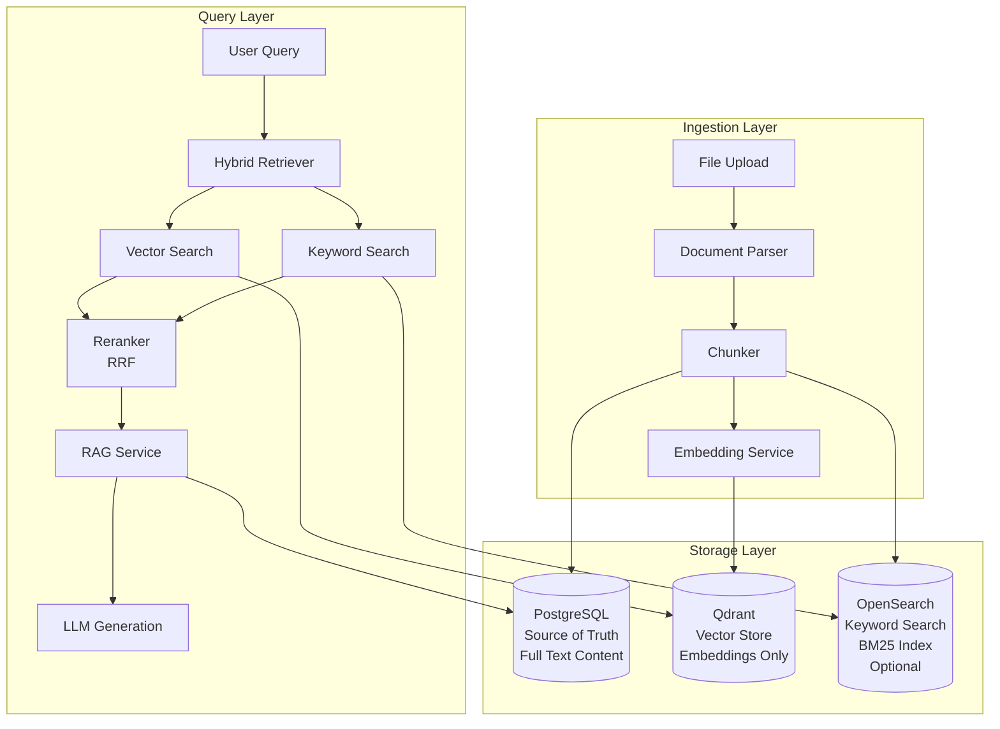

# ODRAS RAG Architecture - Comprehensive Guide

**Version:** 2.0  
**Date:** November 2025  
**Status:** Production Implementation

## Executive Summary

This document provides a comprehensive overview of the ODRAS Hybrid RAG (Retrieval Augmented Generation) implementation. The system combines semantic vector search (Qdrant) with keyword-based text search (PostgreSQL FTS/OpenSearch) to deliver superior retrieval performance for technical requirements documents, specifications, and knowledge assets.

**Key Architectural Principles:**
- **PostgreSQL as Source of Truth**: All document content is stored in PostgreSQL with full ACID guarantees
- **Dual-Write Pattern**: Chunks are written to PostgreSQL, Qdrant (vectors), and optionally OpenSearch (keywords) in parallel
- **Hybrid Retrieval**: Combines vector and keyword search results using Reciprocal Rank Fusion (RRF)
- **BPMN Workflow Orchestration**: RAG processes managed through visual BPMN workflows
- **SQL-First Storage**: Vector stores contain IDs-only payloads; full text retrieved from PostgreSQL

---

## Table of Contents

1. [Architecture Overview](#1-architecture-overview)
2. [Data Flow and Storage](#2-data-flow-and-storage)
3. [Ingestion Pipeline](#3-ingestion-pipeline)
4. [Query Pipeline](#4-query-pipeline)
5. [BPMN Workflow Implementation](#5-bpmn-workflow-implementation)
6. [Current Status and Roadmap](#6-current-status-and-roadmap)
7. [Best Practices and Recommendations](#7-best-practices-and-recommendations)
8. [Implementation Details](#8-implementation-details)
9. [Troubleshooting](#9-troubleshooting)

---

## 1. Architecture Overview

### 1.1 High-Level Architecture

The Hybrid RAG system follows a three-tier storage architecture with clear separation of concerns:



### 1.2 Component Architecture

**Core Services:**
- **RAGStoreService**: Dual-write orchestrator for SQL + vector storage
- **EmbeddingService**: all-MiniLM-L6-v2 (384-dim) or OpenAI (1536-dim) embeddings
- **QdrantService**: Vector operations and similarity search
- **OpenSearchTextStore** (Optional): BM25 keyword search
- **PostgreSQLFTS**: Alternative keyword search using PostgreSQL Full-Text Search

**Retrieval Layer:**
- **VectorRetriever**: Semantic similarity search via Qdrant
- **KeywordRetriever**: Exact match search via OpenSearch or PostgreSQL FTS
- **HybridRetriever**: Combines vector + keyword results
- **ReciprocalRankFusionReranker**: Merges and reranks results

**BPMN Orchestration:**
- **External Task Worker**: Executes BPMN workflow tasks
- **RAG Query Pipeline**: BPMN workflow for query processing
- **Document Ingestion Pipeline**: BPMN workflow for document processing

---

## 2. Data Flow and Storage

### 2.1 Storage Responsibilities

**PostgreSQL (Source of Truth)**
- **Purpose**: Authoritative storage for all document content
- **Schema**: `doc_chunk` table with full text content
- **Benefits**: ACID guarantees, transactional consistency, full-text search capabilities
- **Content**: Complete chunk text, metadata, relationships

**Qdrant (Vector Store)**
- **Purpose**: Fast semantic similarity search
- **Content**: Embeddings (384 or 1536 dimensions) + metadata-only payloads
- **Key Design**: NO text content in payloads - only IDs for SQL read-through
- **Collections**: 
  - `knowledge_chunks` (384-dim embeddings)
  - `knowledge_large` (1536-dim OpenAI embeddings)
  - `project_threads` (chat/conversation threads)
  - `odras_requirements` (requirements-specific)
  - `das_instructions` (DAS instructions)

**OpenSearch (Keyword Search - Optional)**
- **Purpose**: BM25-based keyword search for exact IDs, model numbers, specifications
- **Content**: Full text content mirrored from PostgreSQL
- **Status**: Can be replaced with PostgreSQL FTS for simpler architecture

### 2.2 Recommended Architecture: PostgreSQL FTS + Qdrant

**Option 2 (Recommended):** Use PostgreSQL FTS + Qdrant

**Why this is better:**
- Simpler: One less service to manage
- Faster: No network hop for keyword search
- More reliable: Text is already in PostgreSQL
- Industry standard: PostgreSQL FTS is well-established

**Implementation:**
1. Add FTS index to `doc_chunk.text`
2. Create PostgreSQL FTS search function
3. Combine Qdrant vector results + PostgreSQL FTS results using RRF
4. Remove OpenSearch dependency (optional)

### 2.3 Data Synchronization Model

**Write-Through Pattern:**
1. Document chunk written to PostgreSQL (transactional)
2. Embedding generated from chunk text
3. Parallel writes to Qdrant (vector) and OpenSearch (optional)
4. Verification and sync repair if needed

**Read-Through Pattern:**
1. Vector search in Qdrant returns chunk IDs
2. Full text retrieved from PostgreSQL using chunk IDs
3. Ensures consistency and reduces vector store payload size

---

## 3. Ingestion Pipeline

### 3.1 Document Processing Flow

```
File Upload → Parse Document → Chunk Text → Generate Embeddings → 
Store in PostgreSQL → Store in Qdrant → (Optional) Index in OpenSearch
```

### 3.2 Chunking Strategy

**Current Configuration:**
- **Strategy**: Hybrid (semantic + fixed size)
- **Chunk Size**: 512 tokens (~2048 characters)
- **Overlap**: 50 tokens (~200 characters)
- **Similarity Threshold**: 0.5 (default), 0.25 (DAS enhanced)
- **Max Chunks**: 5 (default), 10 (DAS enhanced)

**Recommended Improvements:**
- **Chunk Size**: 256 tokens for better precision
- **Overlap**: 15% overlap for technical documents
- **Preserve Structure**: Split on headers, maintain entity relationships
- **Semantic Boundaries**: Use semantic chunking with proper boundaries

### 3.3 BPMN Document Ingestion Pipeline

The `document_ingestion_pipeline.bpmn` workflow orchestrates:
- Document validation
- Parsing (PDF, DOCX, Markdown, etc.)
- Chunking with semantic boundaries
- Embedding generation
- Dual-write to PostgreSQL and Qdrant
- Indexing completion

---

## 4. Query Pipeline

### 4.1 Query Processing Flow

```
User Query → Process Query → Retrieve Context (Vector + Keyword) → 
Rerank Context → Quality Check → Construct Prompt → LLM Generation → 
Process Response → Log Interaction
```

### 4.2 Hybrid Retrieval

**Vector Search (Qdrant):**
- Semantic similarity using cosine distance
- Returns top-k chunks with similarity scores
- Filters by project_id, user permissions

**Keyword Search (PostgreSQL FTS or OpenSearch):**
- BM25-based keyword matching
- Exact ID/model number matching
- Technical specification search

**Reciprocal Rank Fusion (RRF):**
- Combines vector and keyword results
- Reranks by combined relevance score
- Deduplicates overlapping results

### 4.3 Context Quality Assessment

- **High Quality** (≥0.7): Direct to LLM generation
- **Low Quality** (<0.7): Trigger fallback search with expanded terms
- **Dynamic Thresholds**: Context-aware thresholds based on query type

---

## 5. BPMN Workflow Implementation

### 5.1 RAG Query Pipeline

The `rag_query_pipeline.bpmn` workflow provides visual process management:

**External Task Topics:**
- `process-user-query`: Extract query intent and terms
- `retrieve-context`: Search vector store for relevant chunks
- `rerank-context`: Improve relevance ranking
- `fallback-search`: Handle poor context quality
- `construct-prompt`: Build LLM prompt with context
- `llm-generation`: Generate response using LLM
- `process-response`: Format and add citations
- `log-interaction`: Log for analytics

**Process Flow:**
```
User Query → Process Query → Retrieve Context → Rerank Context → 
Context Quality Check → Construct Prompt → LLM Generation → 
Process Response → Log Interaction → Response Ready
```

### 5.2 Integration with Existing Systems

**Leverages Existing Infrastructure:**
- **QdrantService**: Vector similarity search
- **RAGService**: User/project access control and chunk retrieval
- **EmbeddingService**: Query embedding generation
- **DatabaseService**: User and project validation

**Maintains Compatibility:**
- Uses same `knowledge_chunks` collection as existing RAG
- Respects same user/project access permissions
- Returns same data structure and quality as hard-coded implementation
- Can be used alongside existing `/api/knowledge/query` endpoint

### 5.3 API Endpoints

**Start RAG Query:**
```http
POST /api/workflows/rag-query
Content-Type: application/json

{
  "query": "What is the required position accuracy?",
  "max_results": 5,
  "similarity_threshold": 0.3,
  "user_context": {
    "session_id": "test_session"
  }
}
```

**Check Status:**
```http
GET /api/workflows/rag-query/{process_instance_id}/status
```

---

## 6. Current Status and Roadmap

### 6.1 Completed Features

- ✅ Basic RAG implementation
- ✅ Vector embeddings (Qdrant)
- ✅ Document chunking
- ✅ Similarity search
- ✅ Query processing
- ✅ Response generation
- ✅ BPMN workflow orchestration
- ✅ SQL-first storage pattern
- ✅ Dual-write architecture

### 6.2 In Progress

- 🚧 Advanced RAG optimization
- 🚧 Multi-modal RAG
- 🚧 RAG performance tuning
- 🚧 Advanced query understanding
- 🚧 PostgreSQL FTS integration (replacing OpenSearch)

### 6.3 Pending Features

- 📋 RAG analytics
- 📋 Advanced caching
- 📋 RAG monitoring
- 📋 RAG versioning
- 📋 Workflow-based RAG processing (enhanced)
- 📋 Context window optimization for DAS
- 📋 Advanced document indexing
- 📋 Real-time RAG updates
- 📋 RAG fidelity improvements

### 6.4 Next Priorities

1. Implement PostgreSQL FTS (replace OpenSearch)
2. Optimize context window for DAS
3. Implement advanced document indexing
4. Complete advanced RAG optimization
5. Add RAG analytics and monitoring

---

## 7. Best Practices and Recommendations

### 7.1 Chunking Best Practices

**Issues Identified:**
1. **Inconsistent Chunking Strategy**: Multiple implementations cause inconsistent retrieval
2. **Similarity Threshold Problems**: 0.5 default too restrictive (should be 0.2-0.3)
3. **Query Processing Inconsistency**: Different enhancement logic causes confusion
4. **Chunk Overlap Issues**: 50 tokens overlap insufficient for technical documents
5. **No Query Understanding**: Direct query processing doesn't handle ambiguity

**Recommended Fixes:**

**Phase 1: Immediate Fixes**
- Unified semantic chunking strategy
- Improved similarity thresholds (0.2-0.3 for comprehensive coverage)
- Query normalization (remove context pollution)
- Increased chunk overlap (15% for technical documents)

**Phase 2: Advanced Enhancements**
- Multi-stage retrieval (exact match → semantic → cross-document)
- Chunk consolidation (merge related chunks from same document)
- Query understanding (detect intent, apply appropriate strategy)

### 7.2 Similarity Threshold Guidelines

**Context-Aware Thresholds:**
- **Specific Facts** (weights, specs, numbers): 0.2
- **General Info** (descriptions, overviews): 0.3
- **Comprehensive** (tables, lists, summaries): 0.15

**Dynamic Thresholds:**
- Adjust based on query type
- Lower thresholds for comprehensive queries
- Higher thresholds for specific fact queries

### 7.3 Query Processing Best Practices

**Query Normalization:**
- Remove context pollution
- Standardize technical terms
- Extract key entities
- Handle ambiguous pronouns intelligently

**Query Understanding:**
- Detect query intent (fact-finding, comprehensive, contextual)
- Apply appropriate retrieval strategy
- Handle pronoun resolution

---

## 8. Implementation Details

### 8.1 SQL-First Storage Pattern

**Database Schema:**
```sql
CREATE TABLE doc (
  doc_id TEXT PRIMARY KEY,
  project_id TEXT NOT NULL,
  filename TEXT NOT NULL,
  version INT NOT NULL DEFAULT 1,
  sha256 TEXT NOT NULL,
  created_at TIMESTAMPTZ DEFAULT NOW()
);

CREATE TABLE doc_chunk (
  chunk_id TEXT PRIMARY KEY,
  doc_id TEXT NOT NULL REFERENCES doc(doc_id) ON DELETE CASCADE,
  chunk_index INT NOT NULL,
  text TEXT NOT NULL,
  page INT,
  start_char INT,
  end_char INT,
  created_at TIMESTAMPTZ DEFAULT NOW()
);
```

**Dual-Write Pattern:**
```python
# Write to PostgreSQL first (source of truth)
chunk_id = insert_chunk(conn, doc_id, idx, text, page, start, end)

# Then write to Qdrant (vector store)
qdrant_upsert(
    collection="knowledge_chunks",
    id=chunk_id,
    vector=embed(text),
    payload={"chunk_id": chunk_id, "doc_id": doc_id}  # IDs only
)
```

**Read-Through Pattern:**
```python
# Vector search returns chunk IDs
hits = qdrant_search("knowledge_chunks", query_embedding, top_k=10)

# Retrieve full text from PostgreSQL
chunk_ids = [h.payload["chunk_id"] for h in hits]
chunks = get_chunks_by_ids(conn, chunk_ids)  # Full text from SQL
```

### 8.2 PostgreSQL FTS Implementation

**Add FTS Index:**
```sql
ALTER TABLE doc_chunk ADD COLUMN text_search_vector tsvector;
CREATE INDEX idx_doc_chunk_fts ON doc_chunk USING gin(text_search_vector);

-- Populate FTS vector
UPDATE doc_chunk SET text_search_vector = to_tsvector('english', text);
```

**FTS Search Function:**
```python
def search_fts(conn, query_text: str, limit: int = 10):
    tsquery = query_text.replace(' ', ' & ')
    sql = """
    SELECT chunk_id, ts_rank(text_search_vector, to_tsquery('english', %s)) AS rank
    FROM doc_chunk
    WHERE text_search_vector @@ to_tsquery('english', %s)
    ORDER BY rank DESC
    LIMIT %s
    """
    # Execute and return results
```

### 8.3 Hybrid Retrieval Implementation

**Combine Vector + FTS Results:**
```python
# Vector search
vector_results = qdrant_search(query_embedding, top_k=10)

# FTS search
fts_results = postgresql_fts_search(query_text, limit=10)

# Reciprocal Rank Fusion
combined_results = reciprocal_rank_fusion(vector_results, fts_results)
```

---

## 9. Troubleshooting

### 9.1 Common Issues

**1. "No chunks retrieved"**
- **Cause**: User/project access permissions
- **Solution**: Check user has access to project, verify project_id in filters

**2. Process hangs**
- **Cause**: External task worker not running
- **Solution**: Ensure external task worker is running: `python scripts/run_external_task_worker.py`

**3. Wrong answers**
- **Cause**: LLM generation logic not using actual context
- **Solution**: Verify context is passed to LLM, check prompt construction

**4. Inconsistent results**
- **Cause**: Multiple chunking strategies or query enhancement differences
- **Solution**: Use unified chunking strategy, normalize queries consistently

**5. Missing relevant content**
- **Cause**: Similarity threshold too high (0.5 default)
- **Solution**: Lower threshold to 0.2-0.3 for comprehensive coverage

### 9.2 Debug Commands

```bash
# Check vector store data
curl -s "http://localhost:6333/collections/knowledge_chunks" | jq '.result.points_count'

# Check Camunda health
curl -s "http://localhost:8080/engine-rest/engine" | jq '.name'

# Check stalled processes
curl -s "http://localhost:8080/engine-rest/process-instance?processDefinitionKey=rag_query_process&active=true"

# Validate BPMN diagrams
python scripts/validate_bpmn_diagrams.py
```

### 9.3 Performance Optimization

**Observed Performance:**
- **Process Completion Time**: 6-8 seconds average
- **Vector Search Time**: ~1 second (including embedding generation)
- **LLM Generation Time**: ~1 second (mock implementation)
- **Total Pipeline Time**: ~8 seconds end-to-end

**Scalability Features:**
- External task workers can scale horizontally
- Camunda handles process orchestration and load balancing
- Vector store searches optimized with similarity thresholds
- Process instances automatically cleaned up after completion

---

## Key Files

### BPMN Workflows
- `bpmn/rag_query_pipeline.bpmn` - Main RAG query process
- `bpmn/document_ingestion_pipeline.bpmn` - Document processing
- `bpmn/add_to_knowledge.bpmn` - Knowledge management

### Infrastructure
- `backend/services/external_task_worker.py` - Task execution engine
- `backend/api/workflows.py` - REST API integration
- `backend/services/rag_service.py` - Core RAG service
- `backend/services/qdrant_service.py` - Vector operations
- `scripts/run_external_task_worker.py` - Worker startup script

### Testing
- `scripts/camunda_rag_test.py` - Working test script
- `scripts/deploy_bpmn_workflows.py` - Deployment automation
- `scripts/validate_bpmn_diagrams.py` - Diagram validation

---

## Success Metrics

The implementation is considered successful because:

✅ **Functional**: Returns correct answers for technical queries  
✅ **Integrated**: Uses real vector store data from init-db  
✅ **Visual**: Complete BPMN diagrams for process management  
✅ **Automated**: Self-managing test scripts with worker lifecycle  
✅ **Persistent**: Results stored in Camunda for later retrieval  
✅ **Scalable**: External task worker architecture supports scaling  
✅ **Consistent**: SQL-first pattern ensures data consistency  

---

## References

- [RAG Chunking Best Practices](https://unstructured.io/blog/chunking-for-rag-best-practices)
- [Semantic Chunking Strategies](https://towardsdatascience.com/rag-101-chunking-strategies-fdc6f6c2aaec/)
- [RAG Debugging Guide](https://hamming.ai/blog/rag-debugging)
- [Advanced RAG Systems](https://focusedlabs.io/blog/debugging-your-rag-app)
- PostgreSQL Full-Text Search Documentation
- Qdrant Vector Database Documentation

---

*Last Updated: November 2025*  
*Consolidated from: HYBRID_RAG_ARCHITECTURE.md, HYBRID_RAG_IMPLEMENTATION_PAPER.md, rag_query_implementation.md, rag_analysis_report.md, rag_improved.md, rag_plus_implementation.md, RAG_plus_study1.md, CURRENT_STATUS.md*
