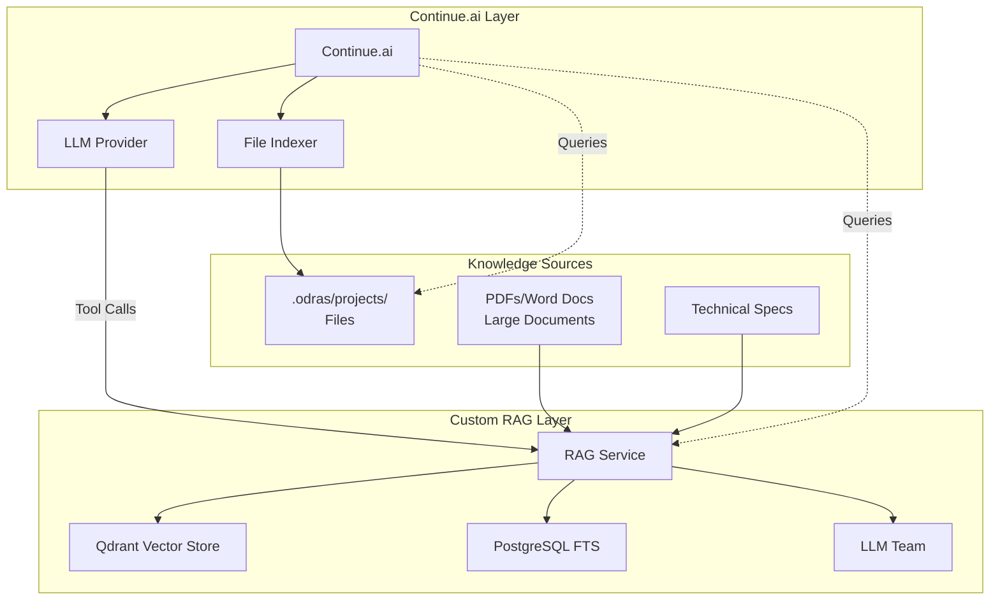

# Custom RAG vs Continue.ai Indexing: Strategic Analysis

**Version:** 1.0  
**Date:** November 2025  
**Status:** Architectural Decision Document

---

## Executive Summary

This document analyzes when to use **custom RAG with LLM teams** versus **Continue.ai's built-in indexing** in the ODRAS MCP architecture. The recommendation is a **hybrid approach**: Use Continue.ai for general code/file search, and custom RAG for domain-specific ODRAS knowledge.

---

## Comparison Matrix

| Capability | Continue.ai Indexing | Custom ODRAS RAG | Winner |
|------------|---------------------|------------------|--------|
| **Code Understanding** | ✅ Excellent (AST-aware) | ❌ Text-only | Continue.ai |
| **Automatic Indexing** | ✅ Zero setup | ⚠️ Requires pipeline | Continue.ai |
| **Domain-Specific Knowledge** | ⚠️ General semantic | ✅ Specialized collections | Custom RAG |
| **Metadata Filtering** | ⚠️ Limited | ✅ Project/domain filters | Custom RAG |
| **Hybrid Search** | ⚠️ Semantic only | ✅ Vector + Keyword | Custom RAG |
| **Multiple Embedding Models** | ❌ Single model | ✅ 384-dim + 768-dim | Custom RAG |
| **LLM Teams** | ❌ Single LLM | ✅ Multiple personas | Custom RAG |
| **Provenance/Traceability** | ⚠️ File-level | ✅ Chunk-level lineage | Custom RAG |
| **BPMN Integration** | ❌ No | ✅ Workflow-triggered | Custom RAG |
| **Maintenance** | ✅ Zero | ⚠️ Requires ops | Continue.ai |
| **Cost** | ✅ Included | ⚠️ API costs | Continue.ai |

---

## When to Use Continue.ai Indexing

### ✅ Best For:

1. **General Code Search**
   - Finding functions, classes, imports
   - Understanding codebase structure
   - Cross-file references

2. **File-Based Artifacts**
   - `.odras/projects/{id}/project.json`
   - `.odras/projects/{id}/requirements/*.md`
   - Configuration files, schemas

3. **Simple Queries**
   - "What projects exist?"
   - "Show me requirement REQ-001"
   - "What's in project.json?"

4. **Zero Maintenance**
   - Automatic indexing
   - No pipeline management
   - No vector store ops

### Example Use Cases:

```
User: "What projects are children of the Core project?"
→ Continue.ai reads .odras/projects/*/relationships.json
→ Uses its LLM to understand structure
→ Returns list

User: "Show me requirement REQ-001"
→ Continue.ai reads .odras/projects/{id}/requirements/REQ-001.md
→ Returns content
```

---

## When to Use Custom RAG

### ✅ Best For:

1. **Domain-Specific Knowledge Retrieval**
   - Requirements documents (PDFs, Word docs)
   - Technical specifications
   - Standards documents (ISO, MIL-STD, etc.)
   - Large knowledge bases

2. **Semantic Search Over Documents**
   - "What requirements mention 'authentication'?"
   - "Find all requirements related to 'safety'"
   - "What documents discuss 'UAV navigation'?"

3. **Multi-Collection Knowledge**
   - Requirements collection (`odras_requirements`)
   - Project threads collection (`project_threads`)
   - DAS instructions collection (`das_instructions`)
   - Knowledge chunks (`knowledge_chunks`)

4. **Advanced RAG Techniques**
   - Multi-query expansion
   - Re-ranking with business logic
   - Context expansion using ontologies
   - Hybrid search (vector + keyword)

5. **LLM Team Coordination**
   - Extractor persona: Extract entities
   - Reviewer persona: Validate extraction
   - Analyst persona: Analyze requirements
   - Validator persona: Check compliance

6. **BPMN Workflow Integration**
   - Trigger RAG on document upload
   - Workflow-driven knowledge extraction
   - Automated requirement analysis

### Example Use Cases:

```
User: "What requirements mention authentication and are related to safety?"
→ Custom RAG searches knowledge_chunks collection
→ Uses hybrid search (vector + keyword)
→ Filters by project_id and domain tags
→ Returns relevant chunks with citations

User: "Extract all requirements from this PDF document"
→ BPMN workflow triggers document ingestion
→ Custom RAG pipeline: Parse → Chunk → Embed → Store
→ LLM team extracts requirements
→ Saves to .odras/projects/{id}/requirements/
```

---

## Hybrid Approach (Recommended)

### Architecture Decision



### Decision Framework

**Use Continue.ai when:**
- Querying file-based artifacts (JSON, Markdown)
- Simple file operations (read, write, search)
- Code understanding and navigation
- General workspace search

**Use Custom RAG when:**
- Querying large documents (PDFs, Word docs)
- Semantic search over requirements
- Domain-specific knowledge retrieval
- Advanced RAG techniques needed
- LLM team coordination required

### Implementation Pattern

```typescript
// Continue.ai conversation:
User: "What requirements mention authentication?"

Continue.ai:
1. Checks if query is about files → No
2. Checks if query needs semantic search → Yes
3. Calls odras-knowledge MCP tool: query_knowledge_base
4. Custom RAG searches knowledge_chunks collection
5. Returns results with citations
6. Continue.ai formats response

// vs.

User: "Show me requirement REQ-001"

Continue.ai:
1. Checks if query is about files → Yes
2. Reads .odras/projects/{id}/requirements/REQ-001.md
3. Returns content directly
```

---

## Advantages of Custom RAG with LLM Teams

### 1. **Specialized Embedding Models**

**ODRAS uses:**
- `all-MiniLM-L6-v2` (384-dim): Fast, general purpose
- `all-mpnet-base-v2` (768-dim): Better quality for technical content
- OpenAI embeddings (1536-dim): Highest quality for critical documents

**Continue.ai:** Single model (usually OpenAI's embedding model)

**Advantage:** Custom RAG can optimize embeddings for technical requirements documents.

### 2. **Multiple Specialized Collections**

**ODRAS Collections:**
- `knowledge_chunks`: General documents (384-dim)
- `knowledge_chunks_768`: Technical specs (768-dim)
- `odras_requirements`: Requirements-specific
- `project_threads`: Conversation context
- `das_instructions`: Operational procedures

**Continue.ai:** Single unified index

**Advantage:** Custom RAG can maintain separate collections for different knowledge types, enabling specialized retrieval strategies.

### 3. **Metadata Filtering**

**Custom RAG:**
```python
metadata_filter = {
    "project_id": "l2-uav-navigation",
    "domain": "systems-engineering",
    "document_type": "requirement"
}
```

**Continue.ai:** Limited metadata filtering

**Advantage:** Custom RAG can filter by project, domain, document type, etc., enabling precise retrieval.

### 4. **Hybrid Search (Vector + Keyword)**

**Custom RAG:**
- Vector search: Semantic similarity
- Keyword search: Exact matches (IDs, model numbers)
- Reciprocal Rank Fusion: Combines both

**Continue.ai:** Primarily semantic search

**Advantage:** Custom RAG finds both semantically similar content AND exact keyword matches (e.g., "REQ-001", "ISO-15288").

### 5. **LLM Teams for Complex Tasks**

**ODRAS LLM Team:**
- **Extractor Persona**: Extracts entities from requirements
- **Reviewer Persona**: Validates and corrects extraction
- **Analyst Persona**: Analyzes requirements for gaps
- **Validator Persona**: Checks compliance with standards

**Continue.ai:** Single LLM

**Advantage:** LLM teams can coordinate multiple perspectives, improving accuracy and reliability.

### 6. **Provenance and Traceability**

**Custom RAG:**
- Chunk-level lineage
- Source document tracking
- Citation with page numbers
- Full audit trail

**Continue.ai:** File-level attribution

**Advantage:** Custom RAG provides precise citations and full traceability.

### 7. **BPMN Workflow Integration**

**Custom RAG:**
- Workflow-triggered ingestion
- Automated processing pipelines
- Event-driven knowledge updates

**Continue.ai:** Manual indexing

**Advantage:** Custom RAG integrates with ODRAS workflows for automated knowledge management.

---

## Cost-Benefit Analysis

### Custom RAG Costs

**Infrastructure:**
- Qdrant: ~$50-200/month (depending on scale)
- PostgreSQL: Already running
- Embedding API: ~$0.0001 per 1K tokens (OpenAI)
- LLM API: ~$0.01-0.03 per 1K tokens (GPT-4o)

**Maintenance:**
- Pipeline monitoring
- Collection management
- Embedding updates
- Performance tuning

### Continue.ai Costs

**Infrastructure:**
- Included with Continue.ai subscription
- Uses existing LLM API keys

**Maintenance:**
- Zero (automatic indexing)

### ROI Calculation

**Custom RAG is worth it when:**
- You have >1000 documents
- You need domain-specific search
- You need LLM team coordination
- You need BPMN workflow integration
- You need precise provenance

**Continue.ai is sufficient when:**
- You have <100 documents
- You only need file-based search
- You don't need advanced RAG techniques
- You want zero maintenance

---

## Recommended Architecture

### Phase 1: Start with Continue.ai

1. **File-Based Storage**: `.odras/projects/` structure
2. **Continue.ai Indexing**: Automatic indexing of all files
3. **MCP Tools**: Simple file operations (create, read, update)

### Phase 2: Add Custom RAG for Documents

1. **Document Ingestion**: PDFs, Word docs → Custom RAG pipeline
2. **Hybrid Approach**: 
   - Files → Continue.ai
   - Documents → Custom RAG
3. **MCP Tools**: `query_knowledge_base` for semantic search

### Phase 3: Advanced Features (Optional)

1. **LLM Teams**: For complex extraction/analysis
2. **BPMN Integration**: Workflow-driven RAG
3. **Multi-Collection**: Specialized knowledge stores

---

## Conclusion

**Use Continue.ai for:**
- ✅ File-based artifacts (JSON, Markdown)
- ✅ Code understanding
- ✅ Simple queries
- ✅ Zero maintenance

**Use Custom RAG for:**
- ✅ Large documents (PDFs, Word docs)
- ✅ Domain-specific knowledge
- ✅ Semantic search over requirements
- ✅ LLM team coordination
- ✅ Advanced RAG techniques

**Hybrid Approach:**
- Continue.ai handles files and code
- Custom RAG handles documents and knowledge
- MCP servers provide tools for both
- User gets best of both worlds

---

## Next Steps

1. **Implement MCP Knowledge Server** with optional RAG tools
2. **Configure Continue.ai** to index `.odras/projects/`
3. **Create decision logic** in MCP server (when to use RAG vs file search)
4. **Document usage patterns** for developers


