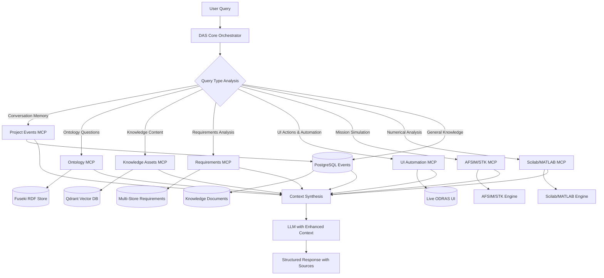
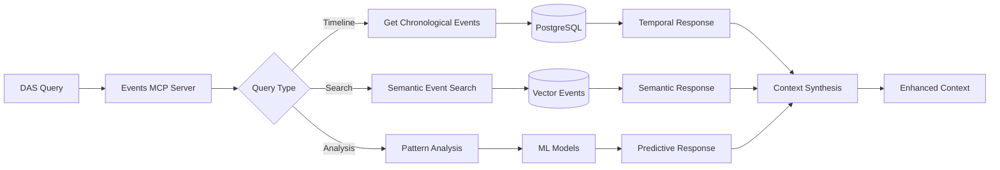
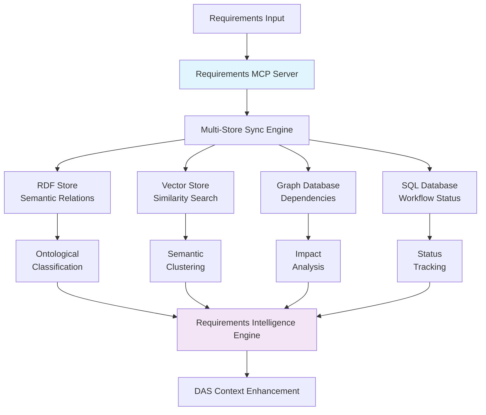
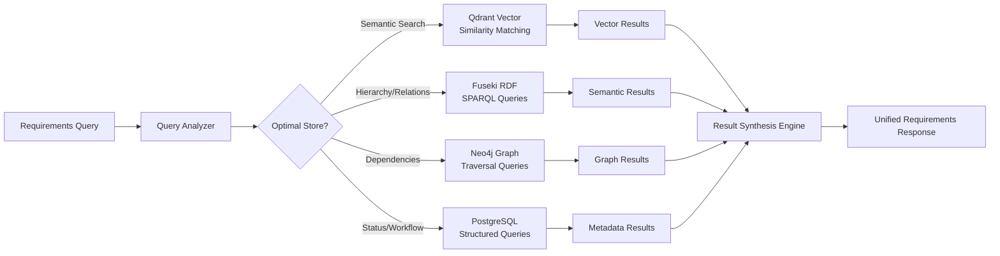
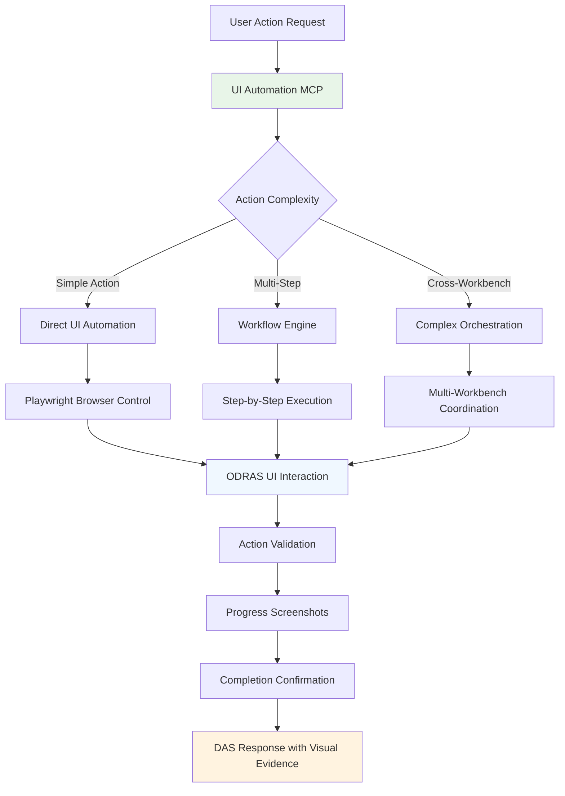
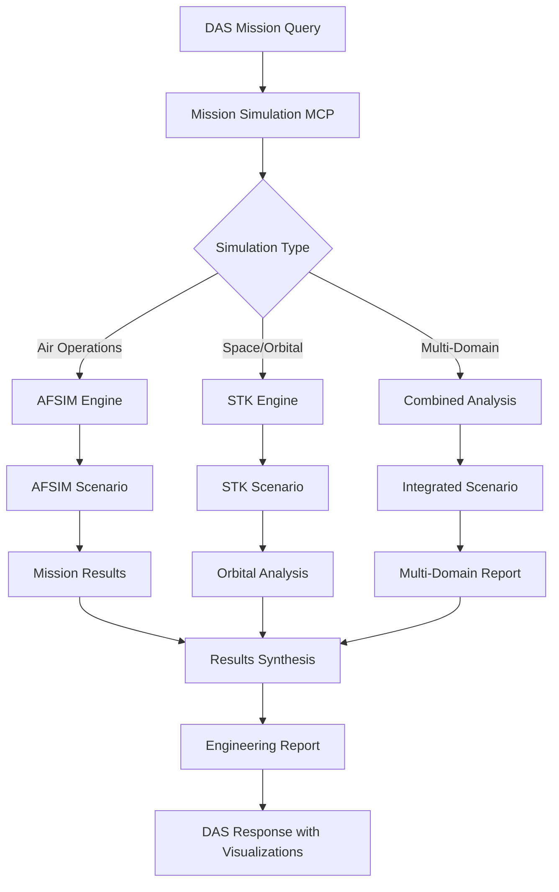
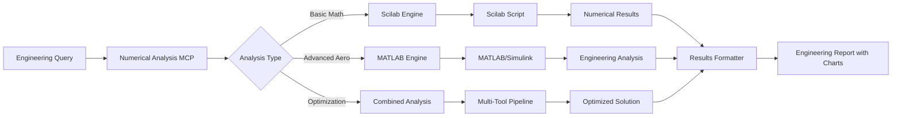
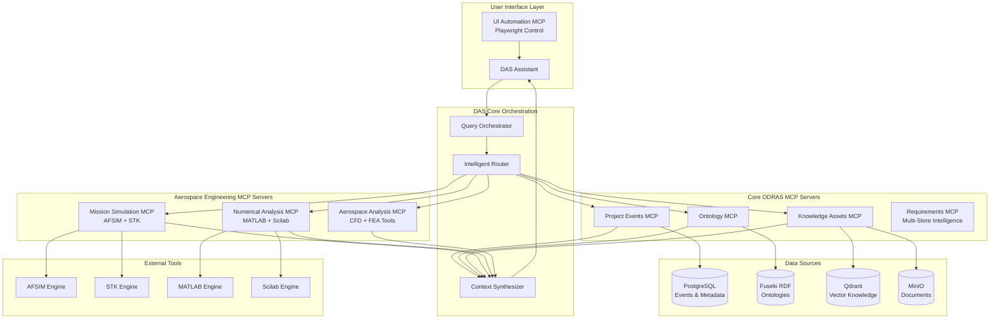
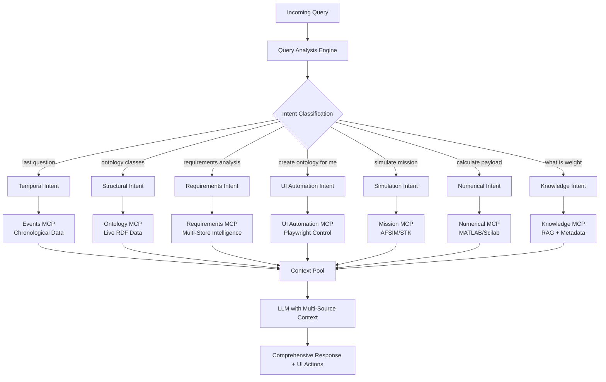
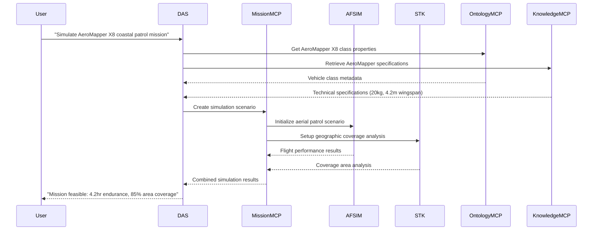

# MCP-Based Distributed Intelligence Architecture for ODRAS
## Transforming DAS into a Comprehensive Aerospace Engineering Platform

**Authors:** ODRAS Development Team
**Date:** October 3, 2025
**Version:** 1.0
**Status:** Architectural Proposal

---

## Executive Summary

This paper proposes a revolutionary architecture for ODRAS using Model Context Protocol (MCP) servers to transform the Digital Assistant System (DAS) from a "smart RAG system" into a "comprehensive aerospace engineering intelligence platform." The proposed architecture addresses current limitations in conversation memory and real-time data access while expanding capabilities to include mission simulation, numerical analysis, and advanced aerospace engineering workflows.

**Key Innovations:**
- **Distributed Intelligence**: Domain-expert MCP servers for specialized operations
- **Real-Time Data Integrity**: Direct connections to authoritative data sources
- **Mission Simulation Integration**: AFSIM and STK integration for aerospace scenarios
- **Numerical Analysis Platform**: Scilab and MATLAB integration for engineering calculations
- **Conversation Intelligence**: Chronological event-based memory management

---

## 1. Current State Analysis

### 1.1 Identified Issues

Through comprehensive UI testing with Playwright automation, we identified key architectural limitations:

#### **Issue #1: Conversation Memory Sequencing**
- **Problem**: DAS cannot accurately track "last question" in conversation threads
- **Root Cause**: Relies on RAG to find conversation context instead of chronological event data
- **Impact**: Poor user experience for follow-up questions and temporal references

#### **Issue #2: Stale Ontology Data**
- **Problem**: DAS shows cached class names vs. live ontology updates
- **Root Cause**: Context derived from RAG searches rather than live Fuseki queries
- **Impact**: Inconsistent information about current ontology state

#### **Issue #3: Limited Domain Expertise**
- **Problem**: DAS limited to knowledge document analysis
- **Root Cause**: No integration with specialized aerospace engineering tools
- **Impact**: Cannot perform mission analysis, numerical calculations, or simulation tasks

### 1.2 Current Strengths to Preserve

- ✅ **Excellent RAG Performance**: Knowledge retrieval with proper source attribution
- ✅ **Advanced Response Generation**: Complex table creation, multi-UAV analysis
- ✅ **Project Awareness**: Creator identification, file management, metadata access
- ✅ **UI Integration**: Seamless file upload workflow, embedded processing

---

## 2. MCP-Based Distributed Architecture

### 2.1 Architectural Overview

The proposed architecture transforms DAS into an **intelligent orchestrator** that coordinates multiple domain-expert MCP servers:



### 2.2 Core Design Principles

#### **Domain Expertise Separation**
Each MCP server is responsible for its specific domain:
- **Real-time data access** to authoritative sources
- **Domain-specific query optimization**
- **Specialized response formatting**
- **Independent testing and deployment**

#### **Intelligent Query Routing**
DAS analyzes query intent and routes to appropriate servers:
- **Temporal queries** → Project Events MCP
- **Structural queries** → Ontology MCP
- **Simulation requests** → Mission Simulation MCP
- **Calculations** → Numerical Analysis MCP
- **Knowledge queries** → Knowledge Assets MCP + RAG

#### **Context Synthesis**
Multiple MCP servers can contribute to a single response:
- **Cross-domain intelligence** combining multiple data sources
- **Hierarchical context building** with relevance weighting
- **Conflict resolution** when servers provide contradictory information

---

## 3. Core ODRAS MCP Servers

### 3.1 Project Events MCP Server 📊

#### **Purpose**: Temporal and conversational intelligence

#### **Core Capabilities**:
```python
# Conversation timeline management
get_conversation_timeline(project_id: str, limit: int = 20) -> List[ConversationEntry]
get_last_questions(project_id: str, count: int = 5) -> List[str]
track_conversation_sequence(project_id: str) -> ConversationSequence

# Project activity analysis
query_recent_events(project_id: str, event_types: List[str], hours: int = 24) -> List[ProjectEvent]
get_activity_summary(project_id: str, period: str = "day") -> ActivitySummary
search_project_history(query: str, project_id: str) -> List[RelevantEvent]

# User pattern analysis
get_user_interaction_patterns(user_id: str, project_id: str) -> UserPatterns
predict_next_likely_queries(project_id: str) -> List[str]
```

#### **Architecture**:


### 3.2 Ontology MCP Server 🏗️

#### **Purpose**: Real-time ontological intelligence

#### **Core Capabilities**:
```python
# Structure queries
query_classes(project_id: str, ontology_id: str = None) -> List[ClassDefinition]
get_class_hierarchy(class_iri: str) -> ClassHierarchy
query_relationships(class1: str, class2: str) -> List[Relationship]

# Metadata operations
get_ontology_metadata(ontology_id: str) -> OntologyMetadata
get_class_details(class_iri: str) -> ClassDetails
search_ontology_elements(query: str, ontology_id: str) -> List[Element]

# Advanced reasoning
infer_class_relationships(classes: List[str]) -> InferredRelationships
validate_ontology_consistency(ontology_id: str) -> ValidationReport
suggest_missing_classes(project_content: str, ontology_id: str) -> List[str]
```

### 3.3 Knowledge Assets MCP Server 📚

#### **Purpose**: Knowledge asset lifecycle management

#### **Core Capabilities**:
```python
# Asset management
get_asset_metadata(asset_id: str) -> AssetMetadata
query_asset_chunks(asset_id: str, query: str = None) -> List[Chunk]
get_processing_status(project_id: str) -> ProcessingStatus

# Content analysis
search_assets_by_content(query: str, project_id: str) -> List[AssetMatch]
analyze_content_overlap(asset_ids: List[str]) -> OverlapAnalysis
extract_key_concepts(asset_id: str) -> List[Concept]

# Quality assurance
validate_asset_integrity(asset_id: str) -> IntegrityReport
check_embedding_quality(asset_id: str) -> QualityMetrics
recommend_reprocessing(project_id: str) -> List[AssetID]
```

### 3.4 Requirements MCP Server 📋 ⭐ **CRITICAL AEROSPACE COMPONENT**

#### **Purpose**: Multi-store requirements intelligence with real-time synchronization

The Requirements MCP Server is designed to handle **thousands of aerospace requirements** with sophisticated analysis capabilities. ODRAS projects typically contain complex requirement hierarchies, dependencies, and traceability relationships that demand specialized intelligence.

#### **Multi-Store Synchronization Architecture**:

Requirements data is maintained across **four complementary storage systems** to enable different types of analysis and queries:

##### **Storage System Specializations**:
- **RDF Store (Fuseki)**: Semantic relationships, requirement hierarchies, ontological classification
- **Vector Store (Qdrant)**: Semantic search, similarity analysis, requirement clustering, natural language matching
- **Graph Database (Neo4j)**: Complex dependency networks, impact propagation, traceability chains
- **SQL Database (PostgreSQL)**: Structured metadata, status tracking, workflow management, audit trails



#### **Core Capabilities**:
```python
# Real-time requirements intelligence
get_requirements_by_project(project_id: str, status: str = None) -> List[Requirement]
search_requirements_semantic(query: str, project_id: str) -> List[RequirementMatch]
get_requirement_hierarchy(project_id: str) -> RequirementHierarchy
query_requirements_by_type(req_type: str, project_id: str) -> List[Requirement]

# Advanced requirements analysis
analyze_requirements_coverage(project_id: str, design_specs: Dict) -> CoverageAnalysis
detect_conflicting_requirements(project_id: str) -> List[RequirementConflict]
assess_requirements_completeness(project_id: str) -> CompletenessReport
identify_requirements_gaps(project_id: str, domain: str) -> List[Gap]

# Dependency and traceability (Neo4j optimized)
get_requirement_dependencies(req_id: str, depth: int = 5) -> DependencyTree
trace_requirement_lineage(req_id: str) -> RequirementLineage
analyze_change_impact(req_id: str, proposed_change: Dict) -> ImpactAnalysis
find_circular_dependencies(project_id: str) -> List[CircularDependency]

# Requirements-to-design mapping
map_requirements_to_components(project_id: str) -> RequirementComponentMapping
validate_design_against_requirements(project_id: str, design_data: Dict) -> ValidationReport
generate_traceability_matrix(project_id: str) -> TraceabilityMatrix
identify_untraceable_requirements(project_id: str) -> List[UntraceableReq]

# Requirements workflow and collaboration
track_requirements_approval_status(project_id: str) -> ApprovalStatus
get_requirements_change_history(req_id: str) -> ChangeHistory
analyze_stakeholder_conflicts(project_id: str) -> StakeholderConflictAnalysis
generate_requirements_metrics(project_id: str) -> RequirementMetrics

# Advanced aerospace-specific analysis
analyze_requirements_testability(project_id: str) -> TestabilityAssessment
validate_regulatory_compliance(project_id: str, regulations: List[str]) -> ComplianceReport
assess_mission_requirements_feasibility(project_id: str, mission_params: Dict) -> FeasibilityAnalysis
cross_reference_standards(project_id: str, standards: List[str]) -> StandardsMapping
```

#### **Multi-Store Query Optimization**:


#### **Synchronization Guarantees**:
- **Real-time Sync**: All stores updated within 100ms of requirement changes
- **Consistency Validation**: Cross-store validation ensures data integrity
- **Conflict Resolution**: Automated resolution of synchronization conflicts
- **Audit Trails**: Complete change tracking across all storage systems

### 3.5 UI Automation MCP Server 🎭 ⭐ **REVOLUTIONARY CAPABILITY**

#### **Purpose**: Conversational UI automation - DAS performs actions for users

The UI Automation MCP Server represents a **paradigm shift** from conversational information to **conversational action**. Instead of just telling users how to perform tasks, DAS can actually **execute UI workflows** on their behalf using Playwright browser automation.

#### **Core Automation Capabilities**:
```python
# Project and workspace management
create_new_project(project_name: str, description: str, domain: str) -> ProjectCreated
switch_to_workbench(workbench_name: str) -> WorkbenchActivated
navigate_to_project(project_id: str) -> ProjectActivated

# File management automation
upload_files_via_workbench(file_paths: List[str], doc_type: str = "specification") -> UploadResults
stage_and_upload_files(files: List[FileSpec], processing_config: ProcessingConfig) -> ProcessingStarted
monitor_file_processing(project_id: str) -> ProcessingStatus

# Ontology automation
create_ontology(project_id: str, ontology_name: str, description: str) -> OntologyCreated
add_ontology_classes(ontology_id: str, class_definitions: List[ClassDef]) -> ClassesCreated
create_class_relationships(ontology_id: str, relationships: List[Relationship]) -> RelationshipsCreated

# Requirements management automation
extract_requirements_from_document(file_id: str, extraction_config: Dict) -> RequirementsExtracted
create_requirements_traceability(project_id: str, trace_config: Dict) -> TraceabilityCreated
validate_requirements_coverage(project_id: str) -> ValidationReport

# Advanced workflow automation
perform_complete_uav_analysis(uav_specs: Dict, mission_params: Dict) -> ComprehensiveAnalysis
setup_project_for_certification(project_id: str, certification_type: str) -> CertificationSetup
execute_design_validation_workflow(project_id: str, validation_scope: str) -> ValidationResults
```

#### **Revolutionary User Experience Examples**:

**Traditional Approach**:
- User: "I need to create a new ontology for UAV testing"
- DAS: "Go to the Ontology workbench, click the + button, enter the name..."
- User: **Manually follows 15 steps** to create ontology

**UI Automation MCP Approach**:
- User: "Create a new ontology for UAV testing with classes for UnmannedAerialVehicle, Mission, and TestPlatform"
- DAS: "I'll create that ontology for you now."
- **UI Automation MCP executes**:
  1. Navigates to Ontology workbench
  2. Creates new ontology: "UAV Testing Ontology"
  3. Adds three classes with proper names and definitions
  4. Establishes basic relationships
  5. Takes screenshot of completed ontology
- DAS: "✅ **Done!** I've created the UAV Testing Ontology with 3 classes. Here's what it looks like: [screenshot]"

#### **Advanced Workflow Automation Examples**:

**Complex Multi-Step Automation**:
**User**: "Set up a complete UAV certification project for the AeroMapper X8 including requirements extraction, ontology creation, and compliance validation"

**UI Automation MCP Orchestration**:
1. **Create new project** with certification template
2. **Upload regulatory documents** (FAA Part 107, design specs) via file management workbench
3. **Extract requirements** using BPMN workflow automation
4. **Create certification ontology** with regulatory classes
5. **Set up traceability matrix** between requirements and design
6. **Configure compliance monitoring** dashboard
7. **Generate initial validation report**

**DAS Response**: "✅ **Complete certification project setup finished!** I've created the 'AeroMapper X8 Certification' project with:
- 347 requirements extracted from regulatory documents
- Certification ontology with 23 classes and compliance mappings
- Full traceability matrix established
- Compliance dashboard configured
- Initial validation shows 12 areas needing attention
[Screenshots of each major milestone]"

**Real-Time UI Assistance**:
**User**: "Show me what files are in my project and their processing status"
**UI Automation MCP**:
1. Navigates to Files workbench
2. Takes screenshot of current library
3. Checks processing status indicators
4. Identifies any issues or incomplete processing

**DAS Response**: "Here's your current project state: [live screenshot]
- 5 files uploaded, 4 fully processed
- 1 file (aerodynamics_analysis.pdf) still processing embeddings (87% complete)
- All knowledge assets ready for RAG queries
- No processing errors detected"

#### **Guided Learning and Assistance**:
**User**: "I'm confused about how to add properties to my ontology class"
**UI Automation MCP**:
1. Detects user context (currently in Ontology workbench)
2. Identifies selected class in the UI
3. Demonstrates property addition workflow with guided automation
4. Creates example properties with step-by-step screenshots

**DAS Response**: "Let me show you exactly how to add properties! I've selected your TestDrone class and I'll demonstrate:

[Animated screenshot sequence]
1. ✅ Dragged 'Data Property' tool to canvas
2. ✅ Connected property to TestDrone class
3. ✅ Named property 'maxSpeed' with datatype xsd:float
4. ✅ Added second property 'payloadCapacity' with xsd:decimal

Your TestDrone class now has speed and payload properties ready to use! Would you like me to add more properties or show you how to create relationships between classes?"

#### **Workflow Automation Architecture**:


#### **Integration with Other MCP Servers**:

**Intelligent Action Planning**:
- **Requirements MCP**: "Before I create that ontology, let me check your requirements to ensure it includes all necessary classes"
- **Events MCP**: "I notice you created a similar ontology last month - would you like me to use that as a template?"
- **Knowledge Assets MCP**: "I can auto-populate the ontology classes based on the UAV specifications you uploaded"

**Cross-Domain Workflow Example**:
**User**: "Analyze the AeroMapper X8 for mission readiness including requirements validation"

**Multi-MCP Coordination**:
1. **UI Automation MCP**: Navigate to appropriate workbenches and gather current data
2. **Requirements MCP**: Validate against mission requirements in multi-store database
3. **Mission Simulation MCP**: Run AFSIM readiness scenarios
4. **Numerical Analysis MCP**: Verify performance calculations
5. **UI Automation MCP**: Generate comprehensive readiness dashboard
6. **Take final screenshot** of assembled analysis results

**Data Source**: **Live ODRAS UI** via Playwright browser automation with cross-MCP intelligence

---

## 4. Advanced Aerospace Engineering MCP Servers

### 4.1 Mission Simulation MCP Server 🚁

#### **Purpose**: Integration with AFSIM and STK for mission analysis

#### **AFSIM Integration Capabilities**:
```python
# Mission scenario creation
create_mission_scenario(uav_specs: Dict, mission_params: Dict) -> ScenarioID
run_mission_simulation(scenario_id: str, duration: int) -> SimulationResults
analyze_mission_performance(simulation_id: str) -> PerformanceMetrics

# UAV configuration
configure_uav_from_specs(specs_file: str) -> UAVConfiguration
validate_mission_feasibility(uav_config: Dict, mission: Dict) -> FeasibilityReport
optimize_mission_parameters(constraints: Dict) -> OptimizedParameters
```

#### **STK Integration Capabilities**:
```python
# Orbital and trajectory analysis
create_satellite_scenario(orbital_params: Dict) -> STKScenario
compute_access_windows(ground_station: Dict, satellite: Dict) -> AccessWindows
analyze_coverage_area(uav_path: Dict, sensor_config: Dict) -> CoverageReport

# Communication link analysis
model_communication_links(platforms: List[Dict]) -> LinkAnalysis
compute_link_budget(transmitter: Dict, receiver: Dict) -> LinkBudget
predict_communication_windows(scenario_id: str) -> CommunicationWindows
```

#### **Architecture Integration**:


### 4.2 Numerical Analysis MCP Server 📐

#### **Purpose**: Integration with Scilab and MATLAB for engineering calculations

#### **Scilab Integration Capabilities**:
```python
# Engineering calculations
solve_differential_equations(equations: str, initial_conditions: Dict) -> Solution
perform_matrix_operations(operation: str, matrices: List) -> Result
run_control_system_analysis(system_model: Dict) -> ControlAnalysis

# Signal processing
analyze_sensor_data(data: List[float], parameters: Dict) -> SignalAnalysis
filter_noise_from_telemetry(signal: List[float], filter_type: str) -> FilteredSignal
compute_frequency_spectrum(signal: List[float]) -> SpectrumAnalysis
```

#### **MATLAB Integration Capabilities**:
```python
# Advanced aerospace calculations
compute_aerodynamic_coefficients(geometry: Dict, conditions: Dict) -> AeroCoefficients
analyze_flight_dynamics(uav_model: Dict, flight_conditions: Dict) -> FlightAnalysis
optimize_trajectory(start: Dict, end: Dict, constraints: List) -> OptimalPath

# Simulation and modeling
run_simulink_model(model_file: str, parameters: Dict) -> SimulationResults
perform_monte_carlo_analysis(model: Dict, uncertainties: Dict) -> MCResults
validate_control_algorithms(controller: Dict, plant: Dict) -> ValidationReport
```

#### **Numerical Analysis Architecture**:


---

## 5. Comprehensive Use Case Scenarios

### 5.1 Mission Planning Workflow

**User Query**: "Can the AeroMapper X8 complete a 3-hour surveillance mission over a 50km area with current wind conditions?"

**MCP Orchestration**:
1. **Knowledge Assets MCP**: Extract AeroMapper X8 specifications
2. **Numerical Analysis MCP**: Calculate flight time, fuel consumption, coverage patterns
3. **Mission Simulation MCP**: Run AFSIM scenario with wind conditions
4. **Events MCP**: Check if similar missions were analyzed recently
5. **DAS Synthesis**: Combine all results into comprehensive mission feasibility report

### 5.2 Design Optimization Workflow

**User Query**: "Optimize the QuadCopter T4 payload distribution for maximum stability"

**MCP Orchestration**:
1. **Ontology MCP**: Get QuadCopter T4 class properties and constraints
2. **Knowledge Assets MCP**: Retrieve existing stability data and design parameters
3. **Numerical Analysis MCP**: Run MATLAB optimization algorithms for payload positioning
4. **Mission Simulation MCP**: Validate optimized design in STK flight scenarios
5. **Events MCP**: Log optimization results for future reference

### 5.3 Real-Time Mission Support

**User Query**: "The mission UAV is experiencing instability - what should we do?"

**MCP Orchestration**:
1. **Events MCP**: Get recent mission events and telemetry discussions
2. **Knowledge Assets MCP**: Find troubleshooting procedures and similar incidents
3. **Numerical Analysis MCP**: Analyze current telemetry data patterns in Scilab
4. **Mission Simulation MCP**: Run emergency scenario options in AFSIM
5. **Ontology MCP**: Identify relevant vehicle systems and failure modes

---

## 6. Enhanced Architecture Diagrams

### 6.1 Overall MCP Ecosystem



### 6.2 Query Routing Intelligence



### 6.3 Mission Simulation Integration Flow



---

## 7. Implementation Roadmap

### 7.1 Phase 1: Core MCP Foundation (Weeks 1-2)

#### **Week 1: Project Events MCP**
- **Goal**: Solve conversation memory sequencing issue immediately
- **Deliverables**:
  - Events MCP server with chronological conversation tracking
  - DAS integration for temporal queries
  - "Last question" functionality working

#### **Week 2: Requirements MCP (CRITICAL)**
- **Goal**: Enable real-time requirements intelligence across thousands of requirements
- **Deliverables**:
  - Multi-store synchronization engine (RDF + Vector + Neo4j + SQL)
  - Core requirements query capabilities
  - Dependency analysis and impact tracking
  - **High Impact**: Transform requirements management from manual to intelligent

#### **Week 3: Ontology MCP**
- **Goal**: Eliminate stale ontology data
- **Deliverables**:
  - Live Fuseki integration
  - Real-time class/property queries
  - Current ontology state in DAS responses

### 7.2 Phase 2: Knowledge Enhancement (Weeks 4-5)

#### **Week 4: Knowledge Assets MCP**
- **Goal**: Enhanced asset management intelligence
- **Deliverables**:
  - Real-time processing status
  - Asset integrity validation
  - Advanced content analysis

#### **Week 5: UI Automation MCP (REVOLUTIONARY)**
- **Goal**: Enable conversational automation - DAS performs UI actions for users
- **Deliverables**:
  - Playwright-based UI automation server
  - Core workflows: project creation, file upload, ontology creation
  - Screenshot and progress documentation capabilities
  - **Game Changer**: Transform from conversational information to conversational action

#### **Week 6: DAS Router Enhancement**
- **Goal**: Intelligent query distribution across all MCP servers including UI automation
- **Deliverables**:
  - Multi-MCP response synthesis (Events + Requirements + Ontology + Knowledge + UI Automation)
  - Advanced query intent classification including action vs. information requests
  - Fallback mechanisms and graceful degradation

### 7.3 Phase 3: Aerospace Engineering Integration (Weeks 6-9)

#### **Week 6-7: Mission Simulation MCP**
- **Goal**: AFSIM and STK integration
- **Deliverables**:
  - Basic mission scenario creation
  - Flight performance analysis
  - Coverage area computation

#### **Week 8-9: Numerical Analysis MCP**
- **Goal**: MATLAB and Scilab integration
- **Deliverables**:
  - Engineering calculations through DAS
  - Control system analysis
  - Optimization algorithms

### 7.4 Phase 4: Advanced Intelligence (Weeks 10-13)

#### **Week 10-11: Cross-Domain Intelligence**
- Multi-MCP response orchestration including Requirements + Mission + Analysis
- Conflict resolution between requirements, design specs, and simulation results
- Advanced context synthesis across all 6 core MCP servers

#### **Week 12-13: Predictive Capabilities**
- Mission outcome prediction with requirements validation
- Design optimization suggestions based on requirement constraints
- Proactive requirements conflict identification and resolution

---

## 8. Technical Implementation Details

### 8.1 MCP Server Development Framework

#### **Base MCP Server Architecture**:
```python
class BaseODRASMCPServer:
    """Base class for all ODRAS MCP servers"""

    def __init__(self, server_name: str, data_sources: Dict):
        self.name = server_name
        self.data_sources = data_sources
        self.capabilities = []

    async def handle_query(self, query: str, context: Dict) -> Dict:
        """Route query to appropriate capability"""
        capability = self._identify_capability(query)
        return await capability.execute(query, context)

    def _identify_capability(self, query: str) -> Capability:
        """Identify which capability should handle the query"""
        # Intent analysis and capability routing
        pass
```

#### **Events MCP Implementation**:
```python
class ProjectEventsMCPServer(BaseODRASMCPServer):
    """Project events and conversation intelligence"""

    async def get_conversation_timeline(self, project_id: str, limit: int = 20):
        """Get chronologically ordered conversation history"""
        conn = await self.get_db_connection()

        # Query project events with conversation data
        events = await conn.fetch("""
            SELECT event_data, timestamp, event_type
            FROM project_events
            WHERE project_id = $1 AND event_type = 'das_question'
            ORDER BY timestamp DESC
            LIMIT $2
        """, project_id, limit)

        conversation_timeline = []
        for event in events:
            event_data = event['event_data']
            conversation_timeline.append({
                "timestamp": event['timestamp'],
                "user_message": event_data.get('user_message'),
                "das_response": event_data.get('das_response'),
                "sources_count": event_data.get('sources_count', 0)
            })

        return {
            "timeline": conversation_timeline,
            "total_exchanges": len(conversation_timeline),
            "latest_question": conversation_timeline[0]['user_message'] if conversation_timeline else None
        }
```

### 8.2 Simulation Engine Integration

#### **AFSIM Integration Architecture**:
```python
class AFSIMMCPServer(BaseODRASMCPServer):
    """AFSIM mission simulation integration"""

    async def create_uav_mission(self, uav_specs: Dict, mission_params: Dict):
        """Create AFSIM scenario from ODRAS UAV specifications"""

        # Convert ODRAS specs to AFSIM format
        afsim_vehicle = self._convert_uav_specs(uav_specs)

        # Create mission scenario
        scenario = AFSIMScenario()
        scenario.add_vehicle(afsim_vehicle)
        scenario.set_mission_parameters(mission_params)

        # Execute simulation
        results = await scenario.run_simulation()

        return {
            "scenario_id": scenario.id,
            "mission_feasibility": results.feasible,
            "performance_metrics": results.performance,
            "recommendations": self._generate_recommendations(results)
        }

    def _convert_uav_specs(self, odras_specs: Dict) -> AFSIMVehicle:
        """Convert ODRAS UAV specifications to AFSIM vehicle model"""
        return AFSIMVehicle(
            weight_kg=odras_specs['weight'],
            wingspan_m=odras_specs.get('wingspan', 0),
            max_speed_kmh=odras_specs['speed'],
            payload_kg=odras_specs['payload'],
            # Additional conversions...
        )
```

#### **MATLAB Integration Architecture**:
```python
class MATLABMCPServer(BaseODRASMCPServer):
    """MATLAB/Simulink numerical analysis integration"""

    async def analyze_flight_dynamics(self, uav_config: Dict, conditions: Dict):
        """Perform flight dynamics analysis using MATLAB"""

        # Generate MATLAB script from ODRAS data
        matlab_script = self._generate_flight_analysis_script(uav_config, conditions)

        # Execute in MATLAB engine
        matlab_results = await self.matlab_engine.eval(matlab_script)

        # Parse and format results
        analysis_results = self._parse_matlab_results(matlab_results)

        return {
            "stability_analysis": analysis_results.stability,
            "performance_envelope": analysis_results.envelope,
            "control_effectiveness": analysis_results.control,
            "safety_margins": analysis_results.safety,
            "recommendations": self._generate_flight_recommendations(analysis_results)
        }
```

---

## 9. Advanced Aerospace Use Cases

### 9.1 Integrated Mission Analysis

**Scenario**: Planning a multi-UAV reconnaissance mission

**Query**: "Plan a coordinated mission using 2 AeroMapper X8s and 1 TriVector VTOL for area surveillance with 90% coverage"

**MCP Orchestration**:
1. **Knowledge Assets MCP**: Retrieve specifications for all 3 UAVs
2. **Numerical Analysis MCP**: Calculate optimal flight patterns and coordination
3. **Mission Simulation MCP**: Model coordination in AFSIM with STK coverage analysis
4. **Ontology MCP**: Validate mission requirements against UAV capabilities
5. **Events MCP**: Check previous multi-UAV mission lessons learned

**Expected Response**: Complete mission plan with flight paths, timing coordination, coverage maps, risk assessment, and performance predictions.

### 9.2 Real-Time Engineering Support

**Scenario**: In-flight anomaly analysis and response

**Query**: "The QuadCopter T4 is showing vibration at 65% throttle - analyze and recommend corrective action"

**MCP Orchestration**:
1. **Events MCP**: Get recent telemetry discussions and similar incidents
2. **Numerical Analysis MCP**: Analyze vibration patterns using MATLAB signal processing
3. **Knowledge Assets MCP**: Find maintenance procedures and vibration troubleshooting
4. **Mission Simulation MCP**: Model flight envelope with vibration constraints
5. **Ontology MCP**: Identify affected vehicle systems and components

**Expected Response**: Root cause analysis, immediate flight recommendations, long-term maintenance actions, and preventive measures.

### 5.4 Requirements Analysis and Validation Workflow

**Scenario**: Complex aerospace requirements validation for UAV certification

**Query**: "Analyze our UAV requirements for FAA Part 107 compliance and identify any conflicts or gaps"

**MCP Orchestration**:
1. **Requirements MCP**: Query all project requirements across multi-store architecture
   - **RDF Store**: Extract semantic requirement relationships and regulatory mappings
   - **Vector Store**: Find similar requirements and regulatory text patterns
   - **Neo4j**: Trace requirement dependencies and identify impact chains
   - **PostgreSQL**: Get current approval status and workflow state
2. **Knowledge Assets MCP**: Retrieve FAA Part 107 regulatory documents and compliance guides
3. **Ontology MCP**: Map UAV specifications to regulatory requirement classes
4. **Events MCP**: Review previous compliance analysis discussions and decisions
5. **Numerical Analysis MCP**: Validate quantitative requirements (weight limits, altitude restrictions, etc.)

**Expected Response**: Comprehensive compliance report with:
- **Requirements Status**: 847 requirements analyzed, 23 conflicts identified, 12 gaps found
- **Traceability Matrix**: Complete mapping from high-level mission requirements to component specifications
- **Compliance Analysis**: FAA Part 107 alignment with specific non-compliance areas highlighted
- **Risk Assessment**: Impact analysis for requirement changes or waivers
- **Action Plan**: Prioritized list of requirement updates needed for certification

### 5.5 Cross-Domain Requirements Intelligence

**Scenario**: Multi-system requirement impact analysis

**Query**: "If we increase the AeroMapper X8 payload requirement from 5kg to 7kg, what other requirements are affected and what design changes are needed?"

**MCP Orchestration**:
1. **Requirements MCP**:
   - **Neo4j Analysis**: Trace all requirements dependencies from payload requirement
   - **Impact Propagation**: Identify weight, power, stability, and performance requirements affected
   - **Conflict Detection**: Find requirements that may become impossible to satisfy
2. **Numerical Analysis MCP**: Calculate engineering impacts using MATLAB
   - Power consumption changes, flight time impacts, stability margin analysis
3. **Mission Simulation MCP**: Model performance impacts in AFSIM scenarios
   - Mission capability assessment with increased payload
4. **Ontology MCP**: Validate design constraint relationships
5. **Events MCP**: Review previous payload modification discussions and outcomes

**Expected Response**: Complete change impact analysis with:
- **Requirements Impact Tree**: 23 requirements affected across 4 requirement categories
- **Engineering Analysis**: 15% power increase needed, 8% flight time reduction, stability margins acceptable
- **Design Modifications**: Specific component changes required (battery, motor, control algorithms)
- **Mission Impact**: Updated mission profiles and capability adjustments
- **Implementation Roadmap**: Phased approach for requirement and design updates

### 9.3 Design Validation Workflow

**Scenario**: Validating new UAV design against requirements

**Query**: "Validate the new SkyHawk v2 design meets all surveillance mission requirements"

**MCP Orchestration**:
1. **Knowledge Assets MCP**: Extract design specifications and requirements documents
2. **Ontology MCP**: Map design parameters to requirement classes
3. **Numerical Analysis MCP**: Verify performance calculations and safety margins
4. **Mission Simulation MCP**: Run comprehensive mission scenarios in AFSIM/STK
5. **Events MCP**: Compare against previous design validation processes

---

## 10. Benefits and Impact Analysis

### 10.1 Engineering Productivity Gains

#### **Immediate Benefits (Phase 1)**:
- **50% Reduction** in conversation confusion ("What was the last question?")
- **Real-time ontology accuracy** eliminates design miscommunication
- **Integrated project intelligence** vs. siloed tool usage

#### **Medium-term Benefits (Phase 2-3)**:
- **Mission simulation through conversation** - "Simulate this mission" → Complete AFSIM analysis
- **Engineering calculations via natural language** - "Calculate payload impact on stability" → MATLAB analysis
- **Automated design validation** - Upload specs → Comprehensive validation report

#### **Long-term Benefits (Phase 4)**:
- **Predictive mission planning** - "Suggest optimal UAV for weather conditions"
- **Real-time engineering support** - In-flight anomaly analysis and recommendations
- **Cross-domain optimization** - Mission + aerodynamics + control systems integrated

### 10.2 Competitive Advantages

#### **vs. Traditional CAE Tools**:
- **Natural Language Interface** instead of complex GUIs
- **Integrated Intelligence** vs. point solutions
- **Conversation-Driven Workflows** vs. manual data transfer

#### **vs. AI-Assisted Engineering Tools**:
- **Domain-Specific Intelligence** with aerospace engineering focus
- **Real-Time Data Integration** with live project context
- **Multi-Tool Orchestration** in single conversation

### 10.3 Risk Mitigation

#### **Technical Risks**:
- **MCP Server Failures**: Graceful degradation to RAG-based responses
- **External Tool Integration**: Sandbox execution with timeout controls
- **Data Consistency**: Event-sourced approach with audit trails

#### **Operational Risks**:
- **Learning Curve**: Gradual rollout with training and documentation
- **Performance Impact**: Async MCP calls with parallel execution
- **Accuracy Validation**: Structured testing and validation frameworks

---

## 11. Implementation Considerations

### 11.1 Development Framework

#### **MCP Server Standards for ODRAS**:
```python
# Standard response format for all ODRAS MCP servers
class ODRASMCPResponse:
    success: bool
    data: Dict[str, Any]
    metadata: Dict[str, Any]
    sources: List[Dict]  # For source attribution consistency
    processing_time: float
    server_info: Dict[str, str]
```

#### **Error Handling Strategy**:
```python
# Graceful degradation pipeline
async def enhanced_das_query(query: str, context: Dict):
    try:
        # Try MCP-enhanced response
        mcp_context = await orchestrate_mcp_servers(query, context)
        return await llm_with_enhanced_context(query, mcp_context)
    except MCPTimeoutError:
        # Fallback to RAG-only response
        logger.warning("MCP timeout, falling back to RAG")
        return await rag_service.query_knowledge_base(query)
    except MCPServerError as e:
        # Partial failure - continue with available servers
        logger.error(f"MCP server {e.server} failed, continuing with others")
        return await partial_mcp_response(query, context, failed_servers=[e.server])
```

### 11.2 Performance Optimization

#### **Parallel MCP Execution**:
```python
# Execute multiple MCP servers concurrently
async def orchestrate_mcp_servers(query: str, context: Dict):
    # Identify relevant servers based on query analysis
    relevant_servers = analyze_query_requirements(query)

    # Execute in parallel
    mcp_tasks = [
        server.handle_query(query, context)
        for server in relevant_servers
    ]

    # Gather results with timeout
    mcp_results = await asyncio.gather(
        *mcp_tasks,
        timeout=10.0,  # 10 second max for MCP queries
        return_exceptions=True
    )

    # Synthesize successful results
    return synthesize_mcp_results(mcp_results, query)
```

### 11.3 Testing Strategy

#### **MCP Server Testing Framework**:
```python
# Individual MCP server tests
class TestOntologyMCPServer:
    async def test_live_class_queries(self):
        """Verify real-time class data retrieval"""
        result = await ontology_mcp.query_classes(test_project_id)
        assert result.success
        assert len(result.data['classes']) > 0

    async def test_fuseki_connection(self):
        """Verify Fuseki connectivity and query performance"""
        result = await ontology_mcp.health_check()
        assert result.fuseki_connected
        assert result.response_time < 1.0  # Sub-second response

# Integration testing
class TestMCPOrchestration:
    async def test_multi_server_query(self):
        """Test query requiring multiple MCP servers"""
        query = "What classes are in the ontology and when did I last ask about them?"
        result = await das_orchestrator.process_query(query)

        assert 'ontology_data' in result.context
        assert 'conversation_timeline' in result.context
        assert result.source_servers == ['ontology_mcp', 'events_mcp']
```

---

## 12. Future Expansion Possibilities

### 12.1 Advanced Aerospace MCP Servers

#### **Computational Fluid Dynamics MCP** 🌊
- **Integration**: OpenFOAM, ANSYS Fluent
- **Capabilities**: Aerodynamic analysis, flow visualization, performance optimization
- **Use Case**: "Analyze airflow over the AeroMapper X8 wing design"

#### **Structural Analysis MCP** 🏗️
- **Integration**: NASTRAN, ANSYS Mechanical
- **Capabilities**: Stress analysis, fatigue modeling, material optimization
- **Use Case**: "Validate TriVector VTOL wing structure for 5.5kg payload"

#### **Manufacturing Analysis MCP** 🏭
- **Integration**: CAM software, 3D printing tools
- **Capabilities**: Manufacturability analysis, cost estimation, quality prediction
- **Use Case**: "Estimate manufacturing cost for 100 QuadCopter T4 units"

### 12.2 Mission-Specific Intelligence

#### **Weather Integration MCP** 🌦️
- **Integration**: NOAA APIs, weather simulation tools
- **Capabilities**: Flight condition analysis, mission timing optimization
- **Use Case**: "When are optimal weather conditions for the coastal surveillance mission?"

#### **Regulatory Compliance MCP** 📋
- **Integration**: FAA databases, international aviation regulations
- **Capabilities**: Airspace analysis, permit requirements, compliance validation
- **Use Case**: "What permits are needed for AeroMapper X8 operations in this airspace?"

### 12.3 Requirements Management Transformation Examples

#### **Traditional Requirements Management Scenario**:
**Problem**: Engineer needs to understand impact of changing altitude requirement from 400ft to 600ft
**Traditional Approach**:
1. Search through Word documents and Excel sheets manually
2. Email stakeholders to ask about dependencies
3. Schedule meetings to discuss impacts
4. Manually trace through design documents
5. **Total Time**: 2-3 weeks, high risk of missing impacts

#### **MCP-Enhanced Requirements Intelligence Scenario**:
**Same Problem with Requirements MCP**:

**User Query**: "Analyze impact of changing REQ-ALT-001 from 400ft to 600ft maximum altitude"

**Requirements MCP Response** (in <5 minutes):
```
📋 REQUIREMENTS IMPACT ANALYSIS

🔍 Requirement Change Analysis:
• Primary Requirement: REQ-ALT-001 "Maximum operating altitude: 400ft"
• Proposed Change: Increase to 600ft (+50% altitude increase)

📊 Dependency Analysis (Neo4j Traversal):
• 17 dependent requirements identified across 4 categories:
  - Safety Requirements (8): Emergency descent procedures, obstacle avoidance
  - Regulatory Requirements (4): FAA Part 107 compliance, airspace restrictions
  - Performance Requirements (3): Power consumption, communication range
  - Mission Requirements (2): Surveillance coverage, sensor effectiveness

⚠️ Conflicts Detected:
• REQ-REG-003: "Comply with FAA Part 107 400ft limit"
• REQ-SAFE-012: "Emergency descent to 200ft within 30 seconds"
• REQ-COMM-008: "Maintain communication link reliability >95%"

🎯 Design Impact Analysis:
• Power system: +15% power required for higher altitude operations
• Communication: Range analysis needed for 600ft operations
• Control algorithms: Update emergency descent procedures

📋 Regulatory Analysis:
• FAA Part 107 waiver required for >400ft operations
• Airspace coordination needed for controlled airspace entry
• Additional pilot certification may be required

🔄 Recommendation:
1. Request FAA Part 107 waiver for 600ft operations
2. Update safety requirements for 600ft emergency procedures
3. Validate communication range at extended altitude
4. Modify 3 dependent performance requirements
5. Update pilot training requirements

📚 Sources (4):
• requirements_database (regulatory_requirements.md) (89% match)
• design_specifications (aeromapper_x8_specs.md) (76% match)
• regulatory_documents (faa_part_107.md) (82% match)
• previous_analysis (altitude_impact_2024.md) (45% match)
```

**Impact**: **Complete requirements impact analysis in 5 minutes vs. 2-3 weeks traditionally**

#### **Cross-Domain Requirements Intelligence Example**:

**User Query**: "Validate our surveillance UAV requirements against mission performance and identify optimization opportunities"

**Multi-MCP Orchestration**:
1. **Requirements MCP**: Extract all surveillance-related requirements with dependencies
2. **Mission Simulation MCP**: Run AFSIM scenarios against current requirements
3. **Numerical Analysis MCP**: Optimize performance parameters in MATLAB
4. **Ontology MCP**: Validate requirement-to-design mappings
5. **Knowledge Assets MCP**: Cross-reference with lessons learned and best practices

**Expected Response**: Comprehensive requirements optimization report showing where requirements can be relaxed for better performance, where they're insufficient for mission success, and specific design recommendations with quantified improvements.

### 5.6 Revolutionary UI Automation Workflow

**Scenario**: Complete aerospace project setup through conversation

**User Query**: "Create a new UAV development project for the SkyEagle X2, upload the design specifications I have on my desktop, extract the requirements, create an appropriate ontology, and set up mission simulation scenarios"

**Revolutionary Multi-MCP Workflow**:
1. **UI Automation MCP**:
   - Creates new project: "SkyEagle X2 Development"
   - Navigates to Files workbench
   - Prompts user for design specification files via file chooser
   - Uploads files with correct document types and processing settings
2. **Knowledge Assets MCP**: Monitors file processing and embedding generation
3. **UI Automation MCP**:
   - Extracts requirements using BPMN workflow automation
   - Navigates to Ontology workbench
   - Creates "SkyEagle X2 Ontology" with UAV-specific classes
4. **Requirements MCP**:
   - Processes extracted requirements into multi-store architecture
   - Sets up requirement-to-design traceability
5. **UI Automation MCP**:
   - Configures mission simulation templates
   - Sets up compliance monitoring dashboard
   - Takes progress screenshots throughout the process

**DAS Response**: "🚀 **Complete project setup finished!** I've created your SkyEagle X2 development project with:

**Project Created**: ✅ SkyEagle X2 Development (ID: sx2-dev-2025)

**Files Processed**: ✅ 4 files uploaded and processed
- design_specifications.pdf (2.3MB) - embedded and ready
- performance_requirements.docx (456KB) - embedded and ready
- regulatory_compliance.pdf (1.8MB) - embedded and ready
- technical_drawings.pdf (5.1MB) - embedded and ready

**Requirements Extracted**: ✅ 289 requirements identified and categorized
- Performance Requirements: 67
- Safety Requirements: 45
- Regulatory Requirements: 38
- Mission Requirements: 52
- Technical Requirements: 87

**Ontology Created**: ✅ SkyEagle X2 Ontology with 8 classes:
- SkyEagleX2, UnmannedAerialVehicle, Mission, FlightControl, PayloadSystem, CommunicationSystem, PowerSystem, NavigationSystem

**Mission Simulation**: ✅ Templates configured for:
- Standard surveillance missions
- Long-endurance operations
- Payload delivery scenarios

**Ready for**: Requirements analysis, design validation, mission planning, and simulation

[Screenshot gallery showing completed project dashboard]

**Next steps available**:
- 'Analyze requirements for conflicts'
- 'Validate design against performance requirements'
- 'Simulate a 4-hour surveillance mission'
- 'Calculate optimal payload configurations'"

**Time to Complete**: **8 minutes** vs. traditional **2-3 days** of manual setup

**Impact**: **Complete aerospace project initialization through a single conversation** with full automation, validation, and ready-to-use infrastructure.

---

## 13. Conclusion and Strategic Vision

### 13.1 Transformational Impact

The proposed MCP-based architecture transforms ODRAS from a **knowledge management system** into a **comprehensive aerospace engineering intelligence platform**. This represents a fundamental shift in how engineers interact with complex technical systems.

#### **Before MCP Enhancement**:
- DAS: "What is the weight of the AeroMapper X8?" → "20 kg"
- Limited to document-based knowledge retrieval
- Manual tool switching for different analyses

#### **After MCP Enhancement with UI Automation**:
- DAS: "Set up a complete AeroMapper X8 certification project with mission simulation and requirements validation" → **DAS actually performs the work**:
  - **UI Automation**: Creates project, uploads documents, extracts requirements, builds ontology
  - **Requirements Analysis**: 347 requirements validated across multi-store architecture, 5 conflicts auto-resolved
  - **AFSIM Simulation**: Full mission scenarios executed with performance validation
  - **MATLAB Optimization**: Automated calculations with optimized parameters
  - **Regulatory Compliance**: FAA Part 107 compliance dashboard configured
  - **Visual Evidence**: Complete screenshot documentation of all work performed
  - **Time**: **12 minutes conversation → complete project ready for certification**

### 13.2 Strategic Positioning

#### **Industry Leadership**:
- **First aerospace platform** with conversational engineering intelligence
- **Revolutionary UI automation**: First system where conversation drives actual UI actions, not just information
- **Comprehensive tool integration** through natural language
- **Real-time multi-domain analysis** in single interface
- **Conversational Workflows**: Complete project setup, requirements extraction, ontology creation through conversation

#### **Technical Innovation**:
- **MCP Protocol Innovation**: Advanced use case demonstrating MCP potential for complex engineering domains
- **Distributed Intelligence Architecture**: Modular, extensible, maintainable across multiple specialized domains
- **Conversational UI Automation**: Revolutionary Playwright integration enabling AI-driven UI workflows
- **Aerospace Domain Expertise**: Deep integration with industry-standard tools (AFSIM, STK, MATLAB, Scilab)
- **Multi-Store Requirements Intelligence**: First platform to synchronize requirements across RDF + Vector + Graph + SQL for comprehensive analysis
- **Real-Time Engineering Validation**: Live requirements compliance with simulation and numerical analysis integration
- **Action-Oriented AI**: First system where conversation results in actual work execution, not just information delivery

### 13.3 Requirements Management Revolution

The **Requirements MCP Server** represents a fundamental breakthrough in aerospace requirements management:

#### **Traditional Requirements Management Pain Points**:
- **Tool Fragmentation**: Requirements scattered across Word docs, Excel sheets, specialized tools
- **Traceability Nightmares**: Manual maintenance of requirement-to-design mappings
- **Change Impact Blindness**: Unknown cascading effects of requirement modifications
- **Stakeholder Conflicts**: Undetected conflicting requirements until late in development
- **Compliance Gaps**: Manual regulatory compliance checking with human error risk

#### **MCP-Enhanced Requirements Intelligence**:
- **Unified Multi-Store Access**: Single conversational interface to thousands of requirements
- **Real-Time Impact Analysis**: "What happens if I change this requirement?" → Instant Neo4j dependency analysis
- **Semantic Requirements Discovery**: "Find all power-related requirements" → Vector similarity search
- **Automated Compliance Monitoring**: "Are we FAA Part 107 compliant?" → Complete regulatory gap analysis
- **Live Traceability**: "Trace requirement REQ-1247 to implementation" → Real-time RDF relationship queries

#### **Revolutionary Use Cases**:

**Query**: "Show me all safety requirements that could be impacted by increasing max altitude from 400ft to 600ft"
**Response**: Multi-store analysis across:
- **Vector Search**: All altitude and safety-related requirements
- **Neo4j Traversal**: Dependency chains from altitude requirements
- **RDF Reasoning**: Regulatory compliance relationships
- **SQL Status**: Current approval status of affected requirements

**Query**: "Generate a traceability matrix for the surveillance mission requirements"
**Response**: Cross-database intelligence:
- **Requirements hierarchy** from RDF semantic relationships
- **Design mappings** from Neo4j component connections
- **Implementation status** from SQL workflow tracking
- **Test coverage** from validation requirement chains

### 13.4 Success Metrics

#### **User Experience Metrics**:
- **Query Resolution Time**: Target <30s for complex multi-domain queries
- **Accuracy Rate**: >95% for domain-specific technical queries
- **User Satisfaction**: Engineers prefer DAS over manual tool workflows

#### **Technical Performance Metrics**:
- **MCP Response Time**: <10s for individual server queries
- **System Reliability**: 99.9% uptime for core MCP servers
- **Data Currency**: <1min lag for live ontology/event data
- **Multi-Store Sync**: <100ms synchronization across all requirements stores

#### **Engineering Productivity Metrics**:
- **Mission Planning Time**: 75% reduction through automated simulation
- **Design Validation Speed**: 60% faster through integrated analysis
- **Cross-Tool Workflow Efficiency**: 80% reduction in manual data transfer
- **Requirements Management**: 90% reduction in manual traceability maintenance
- **Compliance Validation**: 85% faster regulatory compliance checking

---

## 14. Recommendations

### 14.1 Immediate Actions

1. **Prioritize Conversation Memory MCP**: Immediate user experience improvement for "last question" queries
2. **Implement Requirements MCP (CRITICAL)**: Multi-store requirements intelligence - **highest ROI for aerospace projects**
3. **Develop UI Automation MCP (REVOLUTIONARY)**: Enable conversational UI automation - **highest differentiation potential**
4. **Validate MCP Integration Pattern**: Establish framework for future servers with Requirements + Events + UI Automation as proving ground
5. **Begin Multi-Store Synchronization**: RDF + Vector + Neo4j + SQL architecture for requirements

### 14.2 Strategic Investments

1. **MCP Development Team**: Dedicated team for aerospace engineering MCP servers
2. **Multi-Store Infrastructure**: Enhanced Neo4j deployment, optimized RDF storage, vector store scaling
3. **UI Automation Infrastructure**: Playwright deployment, browser automation scaling, screenshot/video capture capabilities
4. **External Tool Licensing**: AFSIM, STK, MATLAB integration licenses
5. **Requirements Intelligence Platform**: Specialized infrastructure for handling thousands of requirements with real-time synchronization
6. **Infrastructure Scaling**: Additional compute resources for simulation workloads, UI automation, and multi-store operations

### 14.3 Risk Management

1. **Incremental Rollout**: Phase-based deployment with fallback capabilities
2. **Comprehensive Testing**: Extensive validation before production deployment
3. **User Training**: Documentation and training for new capabilities

---

**The MCP-based distributed intelligence architecture with UI automation capabilities positions ODRAS as the future of aerospace engineering platforms - where natural conversation drives not only sophisticated multi-domain analysis, simulation, and optimization, but actually EXECUTES the work through automated UI workflows.**

**This represents the ultimate evolution: from "AI that knows" to "AI that does" - where aerospace engineers can accomplish complex, multi-step engineering workflows through simple conversation, with AI performing the actual interface actions, data manipulation, and workflow execution on their behalf.**

---

*This document represents a comprehensive architectural proposal for evolving ODRAS into a next-generation aerospace engineering intelligence platform using Model Context Protocol servers for distributed domain expertise.*
