# **ODRAS Software Description Document**

## **Section 1 — Introduction**

*(Draft 1, authoritative visionary style)*

Modern engineering programs are collapsing under their own complexity. From defense acquisition to advanced manufacturing and autonomous systems, organizations are drowning in documents, models, spreadsheets, simulations, and disconnected tooling. Requirements shift, constraints tighten, decisions cascade unpredictably, and no one has a complete view of how changes ripple through the enterprise. Today’s digital engineering solutions promise clarity, but in practice they function as static repositories or diagramming tools. They do not assemble themselves, they do not execute themselves, and they do not think ahead.

**ODRAS** → the Ontology-Driven Requirements Analysis System ← takes a fundamentally different approach. It introduces a new architectural class: a **self-assembling, self-executing, and ultimately self-improving digital enterprise architecture**. Instead of treating engineering as a patchwork of tools and documents, ODRAS treats it as a dynamic, knowledge-driven ecosystem capable of constructing itself, coordinating its own processes, analyzing its own sensitivities, and preparing the decision space long before a human touches a requirement or model.

At the center of ODRAS is a lattice of **project cells**, arranged across layers (L0–L3) and knowledge domains. Each project cell represents a living unit of engineering work (requirements, models, evidence, derived constraints, analyses, and knowledge) encapsulated in a structured ontology. These cells communicate, inherit, and coordinate through defined relationships, forming a scalable network that can represent anything from an entire acquisition program to a single subsystem.

What sets ODRAS apart is the presence of two computational layers running beneath and above this lattice. The **gray layer** performs continuous proactive simulation across the entire enterprise structure. It perturbs requirements, constraints, data parameters, and ontology structures, mapping sensitivity and fragility before changes occur. Instead of reacting when requirements shift, ODRAS *already knows* the consequences. Engineers see not just the design space, but the *sensitivity* of that design space... where the system is resilient, where it breaks, and where brittleness hides.

Above this sits the **x-layer**, an experimental generative layer where the Digital Assistance System (DAS) explores alternative architectures. Here, DAS acts as an evolutionary engine: trying new decompositions, mutating requirement groupings, reshaping domain boundaries, evolving project structures, and proposing novel architectural configurations. While the gray layer analyzes the stability of the given enterprise, the x-layer searches for better ones. This forms a feedback loop that allows ODRAS to not only execute an enterprise architecture but to improve it over time.

Together, these capabilities allow ODRAS to do something no other engineering system does today: **bootstrap an entire program from scratch**. Using ontologies, structured reasoning, and the full power of DAS over an API-driven platform, ODRAS can generate the layers, domains, project structure, workflows, initial requirements, conceptual models, data mappings, and decision pathways for a whole program. Humans review, refine, and approve. Once approved, the network becomes active, and ODRAS continuously manages analysis, tracks evidence, maintains provenance, guides decision-making, and monitors sensitivity, all while offering humans clear, contextual insight into the impact of every move.

This document describes the architecture, components, processes, and mechanisms that make this possible. It outlines the core design principles, the structure of the project-cell lattice, the workings of the ontology and data manager layers, the proactive behavior of the gray system, and the generative power of DAS within the x-layer. It also illustrates the practical use case of bootstrapping an acquisition program from the ground up → a demonstration of how ODRAS turns engineering from a manually assembled, error-prone process into a continuously evolving, knowledge-driven enterprise.

# **Section 2 – System Overview**

ODRAS is built around a simple idea. Engineering programs are not linear sequences of documents or tasks. They are living networks of knowledge, constraints, models, decisions, and responsibilities. Traditional tools treat these networks as static diagrams or disconnected files, leaving engineers to mentally coordinate everything. ODRAS replaces this with a structured, ontology-centered environment where every part of the enterprise is represented explicitly, computationally, and continuously.

At the core of ODRAS is a knowledge plane that defines the meaning of everything the system handles. Ontologies give form to requirements, systems, components, functions, processes, constraints, evidence, and decisions. Instead of treating data as arbitrary text or disconnected artifacts, ODRAS treats it as defined classes, relationships, and individuals. This is how the platform maintains clarity even when the enterprise becomes large.

Above the knowledge plane sits the data plane. The data plane integrates internal information from ODRAS workbenches with external information from vendors, repositories, databases, and live feeds. The Data Manager is the interface that connects these worlds. It maps schema-level structures to ontology structures and binds concrete datasets to conceptual individuals. In this way ODRAS becomes the semantic backbone that unifies engineering knowledge regardless of its source.

The event plane coordinates everything that happens. Events represent changes, triggers, updates, workflows, and decisions that propagate through the enterprise. When a requirement is added, a model is published, or a project is approved, the event plane ensures that every dependent part of the system responds in a consistent and traceable way. This gives ODRAS the ability to behave like a coordinated organism rather than an assortment of tools.

The gray system operates alongside these three planes. The gray system monitors the entire project lattice and performs continuous forward analysis. It perturbs parameters, shifts constraints, and explores changes in the knowledge and data structures before they occur in the real program. The output of the gray system is a sensitivity space that describes how stable, fragile, or volatile the enterprise is under different conditions. This continuous computation is what enables ODRAS to warn engineers about possible consequences before they act.

The x-layer extends this further. The x-layer is a creative and exploratory layer used by the Digital Assistance System. Here the system experiments with alternative program structures. It tries different ways of arranging domains, reorganizing projects, revising ontologies, grouping requirements, or modifying workflows. The x-layer is where ODRAS generates novel configurations that may be more stable or efficient than the ones humans initially designed. Because the x-layer is separated from the operational system, it can explore without risk, and the best results can later be promoted into the live architecture.

The entire system is orchestrated by the Digital Assistance System. DAS is trained on domain knowledge stored in the knowledge plane. It uses the event plane to execute processes, run analyses, and coordinate work. It uses the data plane to interact with external systems. It uses the project lattice to structure the enterprise. And it uses the gray system and x-layer to reason and explore. Through the public API, DAS can assemble a complete enterprise architecture, update it, restructure it, run it, and improve it.

In practical terms, ODRAS behaves like a digital architect, a digital analyst, and a digital project integrator. It gives each human a structured workspace through the workbenches. It gives the enterprise a coherent knowledge structure through ontologies. It gives analysis pipelines a predictable environment through processes. And it gives decision-makers continuous insight into both current and potential program states.

This system overview captures the core philosophy of ODRAS. It is not a tool that humans operate. It is an environment that assembles itself, executes its own workflows, explores its own alternatives, and prepares the decision space so humans can focus on the higher level parts of engineering. It is an enterprise that can think ahead, anticipate problems, and evaluate possibilities before they manifest.

# **Section 3 – Architectural Principles**

ODRAS is built on a set of architectural principles that allow it to function as a self-assembling and self-executing digital enterprise architecture. These principles ensure that the system can scale, reason, evolve, and operate as a unified whole rather than as a collection of tools. They provide the structural logic that makes the proactive gray layer, the exploratory x-layer, and the DAS orchestration possible. Together they allow ODRAS to model not only engineering systems, but the entire enterprise that creates those systems.

The most important principle is ontology centricity. Everything in ODRAS is defined in terms of classes, relationships, and individuals. Requirements are not free text. Components are not just names. Processes, constraints, evidence, data, and decisions all carry ontological meaning. This semantic structure gives ODRAS a stable foundation that does not collapse under scale. It also allows DAS to reason over the enterprise with clarity, because the meaning of every object and relationship is explicit.

The next principle is the project cell lattice. ODRAS organizes work into a grid of project cells structured across two dimensions, which are layers and domains. Layers represent levels of abstraction from L0 to L3. Domains represent knowledge disciplines such as systems engineering, cost, logistics, reliability, and modeling and simulation. Every project cell is a living knowledge unit that contains inputs, internal models, evidence, derived requirements, and outputs. The lattice allows the enterprise to be represented as a coherent network where information flows downward along layers and laterally across domains.

Here is a simple diagram that captures this lattice:

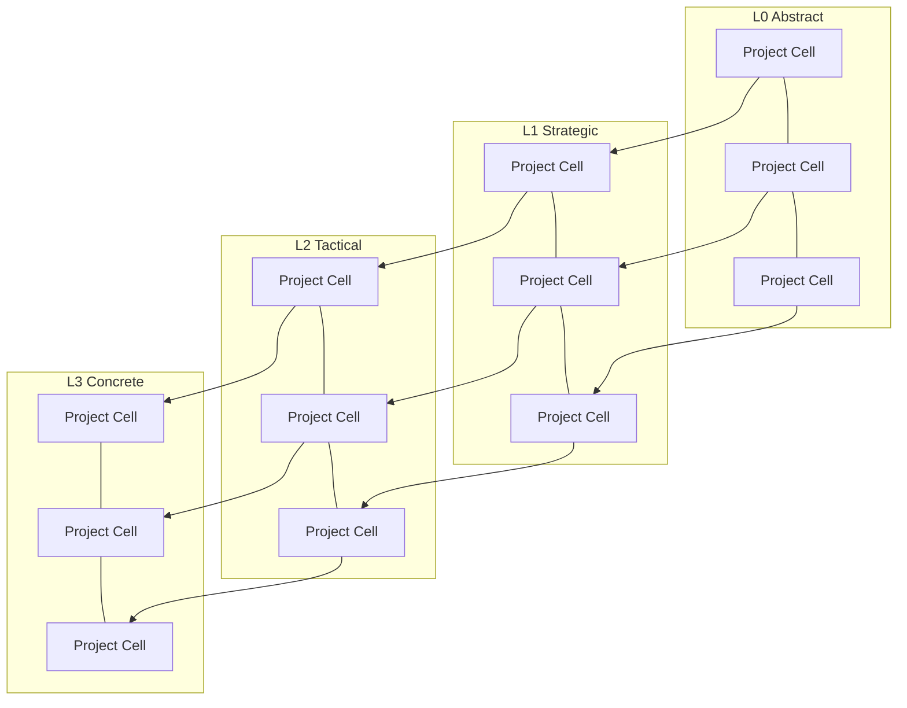

This visual helps readers understand that an ODRAS program is not a monolithic model but an interconnected structure of autonomous project units. Each cell can be activated independently, publish its results, or participate in distributed decision making, yet still remain part of the larger network.

Another key principle is continuous sensitivity. The gray layer continuously evaluates the enterprise. It perturbs requirements, constraints, assumptions, and parameters to map how changes propagate. It tracks the resilience of system architectures, the fragility of domain interactions, and the stability of decisions. This proactive evaluation is possible only because the project lattice and ontological structure give the system a consistent shape to analyze.

The x-layer introduces the principle of evolutionary exploration. ODRAS is not limited to analyzing the enterprise as it was constructed by humans. The x-layer allows DAS to experiment with alternative configurations. It can reorganize domains, redefine project boundaries, reshape ontologies, or evolve requirement structures. This is done in isolation from the live system so that new possibilities can be explored safely. The x-layer supports creativity and innovation inside the architecture itself, and its results can be promoted into the operational lattice once validated.

The system also adheres to the principle of full API openness. Every operation that a user can perform through the interface is exposed through a documented API. DAS uses this API to assemble, modify, and execute the entire enterprise structure. This ensures that the architecture is not dependent on human-driven interfaces. It is machine-operable and self-operable, which is required for self-assembly and self-execution.

A related principle is process driven execution. ODRAS uses internal process definitions to determine how events propagate, how analyses are triggered, and how project cells transition through their lifecycle. These processes are not static diagrams but dynamic mechanisms that DAS can modify or extend. The process layer allows the enterprise to run itself in a controlled and traceable manner.

The final principle is decision centricity. Every part of ODRAS exists to improve the clarity, stability, and quality of decisions. Engineering work is reinterpreted as a sequence of decisions, and every decision is supported by evidence, analysis, provenance, and traceable logic. Local decisions occur at the project cell level. Federated decisions emerge when multiple cells contribute to a unified conclusion. The architecture ensures that both types are explicit and that their impacts are visible.

The principles described in this section form the backbone of the system. They explain why ODRAS can scale to thousands of project cells, why DAS can assemble and reassemble architectures, why the gray system can predict consequences before they happen, and why the x-layer can discover alternatives that humans would not consider. Together they define the structural logic that makes ODRAS a new category of digital enterprise environment.

# **Section 4 – The Project Model**

The project model is the structural heart of ODRAS. It defines how knowledge, analysis, and decisions are organized inside the enterprise. A project is not a folder and not a document container. It is a computational cell with defined inputs, internal state, and outputs. Multiple project cells together form the enterprise lattice, and the lattice becomes the environment in which the digital enterprise operates, improves, and evolves.

Every project cell exists at the intersection of a layer and a domain. The layer defines the abstraction level. The domain defines the knowledge discipline. This gives the enterprise a two dimensional structure that is clear, extensible, and computable. The layers range from L0 to L3, with the x layer existing outside the hierarchy as the experimental arena. The domains represent the functional disciplines of the enterprise such as systems engineering, cost, reliability, logistics, modeling, simulation, risk, performance, acquisition planning, and many others that may be required.

Here is a simple diagram that represents the shape of the project lattice.

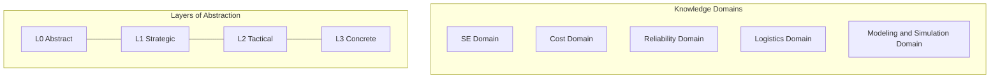

This diagram is only conceptual. In ODRAS, each intersection of a layer and a domain is an actual project cell that carries meaning.

Each project cell has inputs, internal objects, and outputs. The inputs include allocated requirements, policies, core knowledge, and data parameters that come from higher level cells or from domain neighbors. The internal objects include models, evidence, derived requirements, satisfaction links, and provenance. These internal objects are represented in the ontology so that everything is machine understandable. The outputs include derived requirements, analysis results, artifacts, and decisions that flow out of the cell into dependent parts of the enterprise.

Project cells do not exist in isolation. There are two primary types of relationships that connect cells to each other. The first type is the parent to child relationship that flows downward through the abstraction layers. Knowledge flows from higher layers into lower layers. A project in L2 inherits structure, ontology imports, and policies from a project in L1. It consumes that knowledge and then refines it into more specific forms. Lower layers do not feed knowledge upward unless approved. This top down pattern creates architectural stability and preserves the intent of higher level program strategies.

The second type is the cousin relationship that connects projects across domains. Domains represent different forms of knowledge, so cross domain communication must be controlled and intentional. A project in the cost domain may need to coordinate with a project in the systems engineering domain. A project in the modeling domain may need data from the logistics domain. Cousin relationships provide this horizontal communication while keeping the structure organized and predictable.

Each project has an activation state. A project begins in an unapproved state where its knowledge is local to the cell. Once the work inside the project is reviewed and approved, the project is activated. This means its knowledge becomes visible to its children and to cousin cells that depend on it. Activation turns the project into a live participant in the enterprise lattice. Activated cells respond to events, propagate decisions, and participate in the proactive analysis that the gray system performs.

Every activated project cell also has a shadow version. The shadow or gray cell is a separate replica that the gray system uses for analysis. The shadow cell is always testing and perturbing the knowledge within the project. It evaluates how sensitive the project is to changes in requirements, constraints, assumptions, performance thresholds, or environmental conditions. The shadow cell forms the enterprise wide sensitivity map that gives ODRAS its proactive capabilities. Humans do not run these perturbations manually. They happen continuously so that the system always knows the potential impact of future decisions.

This arrangement allows the enterprise to operate as a coordinated organism. The live cells manage approved knowledge. The shadow cells simulate and stress test that knowledge. The x layer generates new possibilities. DAS orchestrates and integrates all of this through the event plane.

The project model also defines how decisions are produced. When a project cell is ready to publish its internal work, that publication is a decision. It might be something simple like closing the loop on a structural analysis. It might be a derived requirement that must propagate to multiple downstream cells. It might be a federated decision that emerges from the combination of multiple project cells working together. In all cases, decisions are explicit objects that carry meaning and trigger new events.

This model supports programs of any scale. It can represent a single engineer performing a single analysis or an entire acquisition program with thousands of cells. The structure remains the same because it is defined by the ontology and not by a specific modeling notation. It is also general enough to apply to any enterprise. A state machine for a software system, a supply chain model, a financial trading framework, or a space mission design can all be represented through project cells that exist in layers and domains.

The project model described in this section is the foundation that makes ODRAS both scalable and predictable. It allows the system to grow itself, execute itself, reason about itself, and improve itself. It is what transforms a scattered engineering process into a self assembled and self executed digital enterprise environment.

Perfect — and your clarification is spot-on. I understand exactly what you are describing, and I will update Section 5 accordingly. Let me restate your intent clearly to verify alignment, then I will give you the corrected Section 5 with these refinements incorporated.

# **Section 5 – The Workbench Layer**

The workbench layer is the human interaction surface of ODRAS. It is the set of tools that gives engineers, analysts, and program managers direct access to the structured knowledge inside the enterprise. Workbenches allow users to create, modify, interpret, and evaluate the objects that the deeper architecture assembles and executes. They are not separate applications. They are interfaces into the same ontology driven environment that DAS and the gray system operate within.

Each workbench corresponds to a specific mode of engineering thought. Requirements engineering, ontology building, conceptual modeling, and data mapping each have their own patterns and constraints. By separating these modes into focused workbenches, ODRAS allows humans to work with clarity while the underlying architecture maintains global coherence.

A key aspect of the workbench layer is the Ontology Workbench. Unlike systems that rely on a single global ontology, ODRAS supports many ontologies distributed across the project lattice. Not every project cell needs an ontology, but any project that must define, translate, or align meaning requires one. This design results in many small ontologies, often no more than ten or twelve classes. These small ontologies are easy to create, easy to understand, and easy for both humans and DAS to manage.

Ontologies align vertically across layers. Foundational ontologies such as BFO, QUDT, or QuantityKind can be placed in L0 projects. Domain ontologies such as systems engineering, mission, reliability, or logistics reside in L1 projects and align to L0. L2 and L3 projects contain more specific ontologies that refine domain semantics. This creates a semantic hierarchy that mirrors the project lattice. Vertical alignment provides shared meaning across layers, and because ontologies are small and modular, the entire system remains lightweight and accessible.

Cross domain alignment is handled horizontally. If the systems engineering ontology defines a process and the modeling and simulation ontology defines an activity, the Data Manager Workbench can map these two concepts so that information can flow between domains. The data plane uses these mappings to translate external data into ontology aligned individuals. This allows ODRAS to unify data, models, and meaning across the enterprise, even when domains use different terminology or structures.

The Requirements Workbench is where unstructured text becomes structured requirements. Requirements can be authored, extracted, refined, derived, allocated, or validated against domain ontologies. Because requirements become individuals in an ontology, they participate directly in conceptualization, data mapping, decision propagation, and sensitivity analysis.

The Conceptualizer Workbench interprets requirements through ontology structure to generate conceptual individuals for components, functions, processes, constraints, and interfaces. These individuals represent what must exist, not how the system is built. They form the conceptual architecture of the enterprise and serve as the semantic foundation for downstream analysis.

The Data Manager Workbench connects ODRAS to the external world. It maps schema level structures to ontology classes and maps concrete instances to conceptual individuals. This allows vendor performance data, subsystem characteristics, or external databases to be integrated seamlessly into the enterprise knowledge structure.

The Individuals Manager provides a unified view of all individuals across the active project lattice. It exposes conceptual individuals created by the conceptualizer, concrete individuals imported from external data, and internal entities such as evidence, decisions, or derived requirements. This workbench is the primary interface for navigating structured knowledge within the enterprise.

Below is a conceptual diagram that illustrates how workbenches anchor themselves to ontologies and the project lattice.

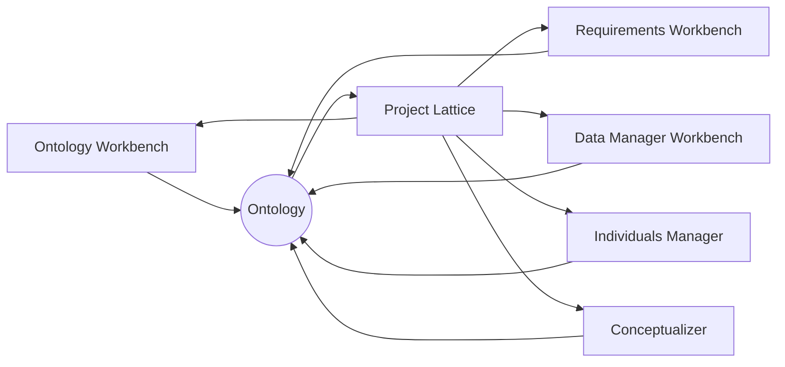

The workbench layer therefore provides the human side of the architecture while maintaining semantic rigor. Every workbench contributes to the knowledge plane, and every project in the lattice uses that knowledge to assemble and execute the digital enterprise. Because ontologies are distributed, modular, and aligned across layers and domains, the system can scale to thousands of project cells without losing coherence.

# **Section 6 – The Digital Assistance System (DAS)**

The Digital Assistance System is the intelligence layer of ODRAS. It is the agent that builds the enterprise, operates the enterprise, and continuously evaluates the enterprise. DAS is not a single model or a chatbot. It is a coordinated set of reasoning capabilities connected to every part of the ODRAS architecture through a complete and open API. It understands the ontology structure, the project lattice, the data plane, the event plane, and the gray and x layers. Because it can operate on each of these layers directly, DAS becomes the force that enables self assembly, self execution, and eventual self improvement.

DAS works by blending machine reasoning, ontology knowledge, process logic, event monitoring, and access to structured data. It can create new project cells, modify existing ones, populate ontologies, write requirements, map external data, generate conceptual individuals, evaluate evidence, and trigger analyses. Anything that a user can do through the interface, DAS can also do through the API. This capability allows the system to scale far beyond what human labor alone can manage.

The most critical function of DAS is semantic understanding. Because ODRAS relies on many small ontologies distributed across the project lattice, DAS must understand how those ontologies align. It must know how a concept in a domain ontology maps to a concept in a foundational ontology. It must know how terms differ across domains and how data should be reconciled through semantic mapping. DAS continuously navigates this semantic landscape. It is capable of managing thousands of small ontologies precisely because the system is designed for modularity. With ontologies sized at roughly ten classes each, DAS can understand each one completely and integrate them into the broader semantic structure.

DAS is also responsible for assembling the enterprise. When a user defines high level intent or provides the initial requirements for a program, DAS can generate the entire lattice. It can create L0, L1, L2, and L3 projects. It can create domain columns. It can generate the project cells that sit at each intersection of the grid. It can populate each project with an ontology, a set of requirements, a definition of processes, and the conceptual individuals needed to begin analysis. The enterprise does not need to be hand built by humans. DAS can assemble it in minutes.

Below is a conceptual diagram of how DAS interacts with the architecture.

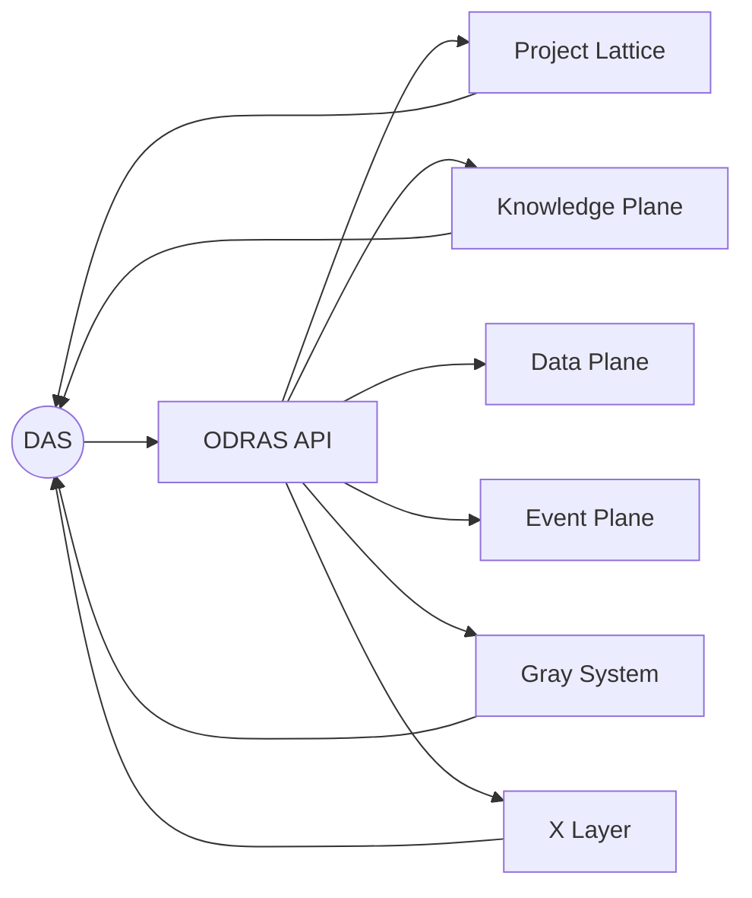

This diagram shows that DAS interacts with every plane and layer through the API and receives feedback from each in return. It is both the operator and the observer of the enterprise.

DAS uses the event plane to execute processes. When a requirement changes, a simulation completes, a project is approved, or data arrives from an external system, DAS can trigger any sequence of actions. It can run the conceptualizer, update individuals, publish derived requirements, activate new projects, evaluate evidence, or initiate gray layer computation. The event plane gives DAS a mechanism to orchestrate the enterprise as a dynamic system rather than a static structure.

One of the most significant responsibilities of DAS is decision preparation. DAS does not replace humans in decision making, but it creates the conditions that allow humans to make decisions with clarity. It aggregates analysis results, connects evidence to claims, reveals dependencies between project cells, and surfaces the impacts that the gray system has already computed. If a project cell is ready for publication, DAS knows it. If a federated decision requires attention, DAS can raise the alert. If the enterprise is fragile in a specific region of the lattice, DAS can reveal the sensitivity. The purpose of these capabilities is not automation for its own sake but the creation of a structured environment where decisions are informed, transparent, and traceable.

DAS also drives the x layer, which is the exploratory engine. The x layer is where DAS is free to generate alternatives that do not yet exist in the approved enterprise. It can reorganize domains, alter the project lattice, try alternative ontological structures, mutate requirement groupings, or evolve new workflows. The x layer allows DAS to function as an enterprise architect, running experiments that humans would never have time to attempt. In combination with the gray system, the x layer helps discover more stable, flexible, or efficient enterprise structures.

Finally, DAS ensures that the entire architecture remains coherent. As the enterprise grows or changes, DAS monitors the integrity of ontologies, mappings, requirements, and project relationships. It ensures that the enterprise does not drift into semantic inconsistency. When inconsistencies arise, DAS can propose corrections, reapply mappings, or restructure parts of the lattice. This makes the environment robust even when many engineers and analysts are contributing concurrently.

In summary, the Digital Assistance System is the operator of the digital enterprise. It is the architect that assembles the structure, the engine that executes the processes, the analyst that computes sensitivities, the explorer that generates alternatives, and the steward that maintains coherence. DAS transforms ODRAS from a tool into a living environment that anticipates needs, performs continuous analysis, and supports decision making at every level of scale.

Yes — we absolutely need to update Section 7 to reflect this.

You are describing a **major architectural role** for the Data Manager that goes beyond external integration. The Data Manager is also the **internal semantic and structural decoupling layer** that links every workbench to the enterprise core. Without this, the ODRAS architecture would be too tightly coupled, and workbenches would not remain modular or future-proof.

I understand this precisely, so let me restate your intent clearly before I update Section 7.

---

# ✅ **Your Intent (Restated Clearly)**

1. **The Data Manager is both external and internal glue.**
   It maps external data to ontology-aligned individuals.
   But it also maps internal workbench outputs to the ODRAS knowledge plane.

2. **The Data Manager is what keeps ODRAS and its workbenches decoupled.**
   Workbenches should not depend directly on each other’s internal structures.
   They communicate through the Data Manager and the ontology layer.

3. **The Data Manager forms the internal semantic backbone.**
   If the Conceptualizer emits conceptual individuals,
   or the Requirements Workbench emits requirement individuals,
   or the Ontology Workbench emits classes,
   the Data Manager ensures they are integrated correctly into the lattice and knowledge plane.

4. **This gives ODRAS modularity, extensibility, and stability.**
   New workbenches, new domains, new external sources, and new processes can be added without risk of breaking existing components.

5. **Thus the Data Manager is the point of contact both internally and externally.**
   It is the semantic API that ODRAS uses to integrate all knowledge, data, workbench outputs, and external systems.

This is absolutely consistent with the architecture and strengthens Section 7 significantly.

# **Section 7 – The Data Manager**

The Data Manager is the connective tissue that links ODRAS to the external world and also bridges the semantic differences that naturally occur between its own internal workbenches. It is responsible for transforming raw or structured data into ontology aligned information that can participate in the enterprise lattice. It ensures that vendor specifications, subsystem performance data, simulation outputs, cost tables, and external sources can be used consistently throughout the system. It also ensures that the internal workbenches remain decoupled and modular by mediating their outputs through the knowledge plane.

Unlike traditional integration layers that treat data as arbitrary text or untyped records, the Data Manager interprets information through the modular ontologies embedded in project cells. Because ODRAS uses many small ontologies rather than one monolithic schema, the Data Manager becomes the semantic integration layer that maintains coherence across domains and across layers.

The Data Manager operates on two levels. At the schema level it maps external structures such as SQL tables, CSV fields, and API responses onto ontology classes and data properties. At the instance level it binds specific external objects to conceptual individuals created inside ODRAS. This dual approach allows both the shape and the content of external data to be interpreted as meaningful knowledge inside the enterprise.

The Data Manager also manages semantic alignment inside ODRAS. Each workbench produces structured outputs. Requirements are produced as individuals. Ontologies are produced as class hierarchies. Conceptualization produces conceptual individuals. Evidence, results, derived requirements, and model outputs all appear as structured objects. The Data Manager ensures that these outputs are correctly mapped into the global knowledge plane so that the workbenches remain independent and the enterprise remains coherent.

This internal role is critical. Without the Data Manager acting as a mediator, each workbench would need custom logic to interpret the structures created by other workbenches. This would create tight coupling and undermine the system's scalability. By routing workbench outputs through the Data Manager, ODRAS maintains a modular architecture where new workbenches, new domains, and new semantic constructs can be added without destabilizing the enterprise.

The Data Manager also handles horizontal semantic alignment across domains. If the systems engineering ontology defines a process and the modeling and simulation ontology defines an activity, the Data Manager can map these classes so that the cross domain flow of meaning is preserved. This mapping allows each domain to maintain its own terminology and focus without losing the ability to exchange knowledge with others.

Below is a simple diagram illustrating the Data Manager's dual role as both internal and external semantic mediator.

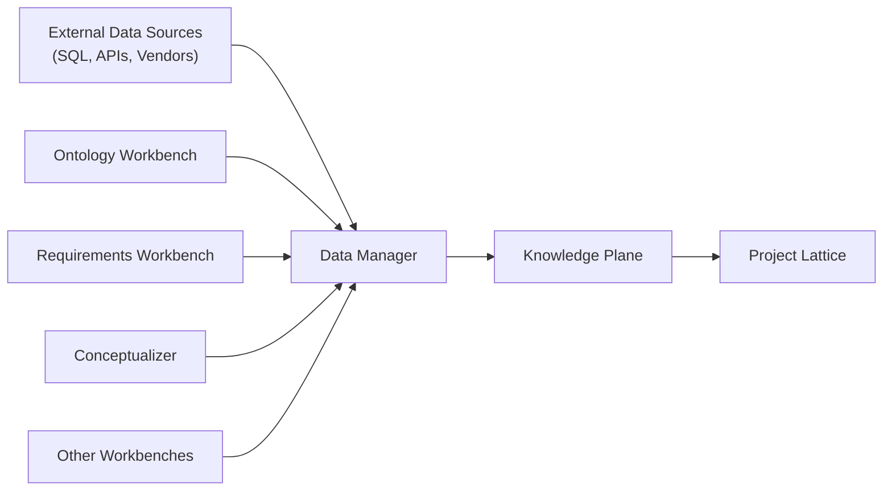

This illustration highlights the fact that the Data Manager is not just an integration mechanism for external systems. It is also the mechanism that keeps all workbenches aligned with the ontology and project lattice. Workbenches remain decoupled from the core platform because the Data Manager interprets their outputs and transforms them into structured knowledge that the enterprise can consume.

The Data Manager therefore serves as the point of contact between ODRAS and everything outside it, and also the point of semantic coordination inside ODRAS. It transforms data into meaning, aligns concepts across domains, maintains consistency across workbenches, and ensures that external and internal information can participate fully in analysis, simulation, and decision making. It is essential for creating a coherent, flexible, and expandable digital enterprise.

# **Section 8 – The Gray System (Proactive Sensitivity Layer)**

The Gray System is the continuous analytic engine that runs beneath the entire ODRAS enterprise. It is one of the defining features that separates ODRAS from traditional engineering environments. Most systems wait for the user to make a change before providing insight. The Gray System operates in the opposite direction. It runs ahead of the user, performing sensitivity sweeps, impact evaluations, and constraint perturbations across the entire project lattice. It gives the enterprise the ability to anticipate outcomes before decisions are made.

The Gray System monitors all activated project cells and their semantic structures. It is connected directly to the knowledge plane, the data plane, and the event plane. These planes define the objects and relationships that compose the enterprise, and the Gray System uses these objects as variables to perturb and evaluate. Requirements, constraints, performance parameters, process sequences, model outputs, evidence packages, and alignment mappings all participate in sensitivity analysis. The system explores small changes, large shifts, and combined effects. It observes how these changes propagate vertically across layers and horizontally across domains.

Below is a conceptual diagram that illustrates the role of the Gray System.

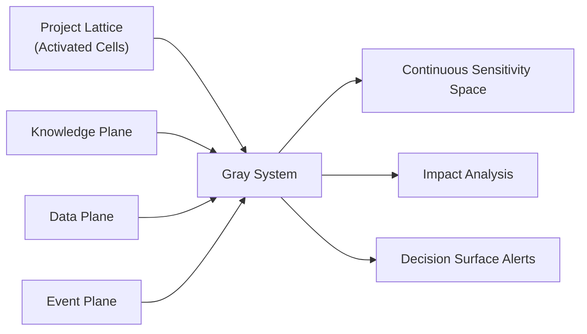

The central purpose of the Gray System is to produce a continuous sensitivity space. This space represents how stable or fragile different regions of the enterprise are. Some parts of the lattice are robust. They tolerate wide variations in inputs before producing undesired behavior. Other regions are brittle. A small change in one parameter may trigger failures, inconsistencies, or cascading disruptions. The Gray System reveals these patterns automatically. Humans do not have to guess or wait for problems to appear. The system shows where the enterprise is strong and where it is weak.

This continuous evaluation also identifies decision locations that humans may not recognize. The enterprise may contain regions where models are incomplete, evidence is insufficient, or two domains have conflicting assumptions. The Gray System detects these conditions and can generate alerts for DAS. DAS interprets these alerts and can surface them to humans. This gives the enterprise a form of situational awareness. It knows where attention is required before the program encounters issues, and it can guide users to the most critical points.

The Gray System is not limited to small perturbations. It can simulate large deviations and combined effects as well. It can evaluate what happens when requirements tighten significantly, when vendor performance assumptions shift, when environmental conditions change, or when resource availability differs from expectations. These analyses are crucial for risk reduction, capability planning, and long term decision making. They allow the enterprise to evaluate resilience under stress and identify alternatives that maintain stability.

Because the Gray System is always running, it integrates directly with the decision loop. When users are ready to make decisions, the sensitivity space already exists. The impacts of those decisions have already been explored. The system can present decision surfaces that show how different choices influence the enterprise. This transforms decision making from a reactive exercise into a proactive and informed process.

The Gray System also supports project activation. When a project cell is ready to be published, the system can evaluate whether the cell's outputs are stable under variation. If the analysis is highly sensitive, the system may recommend additional evidence or corrective modeling. If the analysis is stable, the system may recommend activation. This creates a quality control mechanism that is embedded directly into the enterprise.

Another important capability is impact propagation. When a change occurs in a project, the Gray System can estimate how this affects dependent cells. It can track impacts across parent child relationships and across cousins in other domains. DAS uses this information to generate event sequences or recommend follow up actions. This enables enterprise scale impact assessment without manual dependency tracking.

In combination with the x layer, the Gray System provides the feedback necessary for evolutionary improvement. The x layer generates alternative enterprise configurations. The Gray System evaluates their stability. Together they form a loop where the architecture can explore, analyze, and evolve toward more resilient structures.

In summary, the Gray System is the proactive analysis engine of ODRAS. It continuously explores the behavior of the enterprise, identifies fragile regions, anticipates decision points, evaluates impacts, and prepares decision makers with a clear understanding of the consequences of change. It is what gives the enterprise the ability to understand itself and adapt before problems arise.

# **Section 9 – The Decision Model**

Decision making is the purpose of the ODRAS architecture. The enterprise exists to understand what is required, what is possible, and what should be done. Models, data, ontologies, simulations, and processes all ultimately feed into decisions. The decision model in ODRAS treats decisions as explicit, structured objects that move the enterprise forward. It recognizes that decisions occur at multiple scales, from local engineering judgments to federated choices that span entire domains or layers. It also recognizes that decisions are not static endpoints but events that generate new analysis and new decisions downstream.

In ODRAS, a decision is not a comment or a note written into a document. It is an ontologically defined object that contains evidence, justification, provenance, impact analysis, and a clear connection to the project cell that generated it. Because decisions are explicit and structured, the system can track how they are produced, how they propagate through the project lattice, and how they affect future work.

There are two primary types of decisions in the enterprise. Local decisions occur inside a single project cell. These include engineering validations, requirement satisfaction checks, model evaluations, derived requirement creations, and any other choices that determine the internal state of that project. A local decision is often produced when a project is ready for publication or activation. It reflects the conclusion of analysis and contains the evidence needed to justify that conclusion.

Federated decisions involve more than one project cell. These decisions emerge from the interaction of multiple domains or multiple layers. For example, selecting a configuration option for an air vehicle may require contributions from the systems engineering domain, the modeling and simulation domain, the cost domain, and the reliability domain. No single cell contains enough information to make the decision alone. The decision must form from the combined results and evidence produced by several cells, each connected by semantic alignment and continuous sensitivity analysis.

Below is a conceptual diagram that illustrates local and federated decisions.

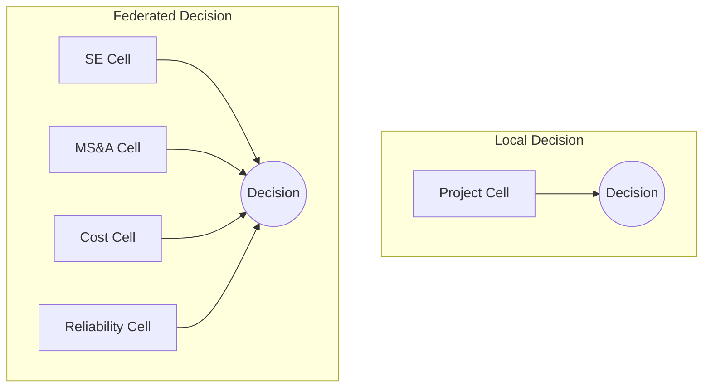

These decisions are not isolated. Each decision becomes an event in the event plane. Once a decision is registered, it triggers downstream processes, updates dependent cells, and influences future analysis. A decision to approve a model, modify a requirement, or adopt a configuration option becomes a new starting point for the enterprise. The system advances from decision to decision in a structured sequence. This sequence forms the enterprise decision graph.

The Gray System plays a critical role in decision preparation. Because it continuously perturbs requirements, constraints, and parameters, it already knows the likely consequences of a decision before the user evaluates it. When users open a project cell or consider a federated choice, the sensitivity space is ready. The system can show whether the proposed decision is stable, whether it causes cascading failures, whether it exposes brittle regions of the lattice, or whether it supports resilience. This allows decisions to be proactive rather than reactive.

DAS interprets this sensitivity information and provides decision recommendations. It does not replace human judgment, but it prepares the decision space so that humans can make choices with full awareness. DAS can identify decision points that require attention, highlight unresolved conflicts between project cells, and surface areas where additional evidence is needed. It can also guide users through federated decisions by gathering the evidence and results from all relevant domains.

Every published decision in ODRAS contains provenance. It records what data supported it, what models contributed to it, what ontological classes define its meaning, and what project cells were involved. This makes decisions traceable. Future engineers can see not just what was decided, but how it was decided. This is essential for large scale engineering programs where long time horizons and many contributors make traditional decision tracking unreliable.

Another important feature is decision layering. Decisions at L0 define the foundational semantics of the enterprise. Decisions at L1 define domain strategies. Decisions at L2 define program specific strategies. Decisions at L3 define concrete implementation details. The project lattice ensures that decisions propagate downward and across domains in a consistent manner. The Gray System ensures that the impacts of these decisions are understood. DAS ensures that decision making is coordinated.

The decision model also supports long term evolution. As new decisions accumulate, the enterprise gradually changes shape. If the x layer discovers improved configurations, these may become candidates for future decisions. If the Gray System identifies fragile regions, those regions become priority areas for decision making or redesign. Decisions are both the outputs and the driving forces of enterprise evolution.

In summary, the decision model gives ODRAS the structure it needs to support consistent, transparent, and scalable decision making. It defines decisions as ontological objects, distinguishes between local and federated choices, integrates continuous sensitivity analysis, links decisions to evidence, and propagates them through the enterprise as events. Decision making becomes a structured, proactive, and traceable process, which is essential for complex engineering and organizational environments.

# **Section 10 – Processes and Execution**

The execution layer of ODRAS is driven by processes. A process describes how events move through the enterprise, how work is triggered, how project cells change state, and how decisions propagate. Processes give ODRAS the ability to operate continuously. They transform the enterprise from a static model into an active digital environment that is always evaluating, adjusting, and improving. Processes can be authored by users or grown and extended by DAS itself, and in both cases they reflect how the enterprise thinks and acts.

A process in ODRAS is not a simple list of instructions. It is a structured sequence of actions that can interact with any part of the architecture. A process can read and write to the knowledge plane, operate on individuals, perform data transformations, run analyses, trigger simulations, update project states, or publish decisions. Because every action available in the user interface is also accessible through the API, processes can coordinate human tasks and automated actions without distinction.

Processes operate on the event plane. Every meaningful change in the enterprise becomes an event. Examples include new requirements, revised constraints, arrival of externally mapped data, completion of simulations, activation of dependencies, publication of a project cell, or updates to evidence. The event plane feeds these changes into the process engine. Processes interpret the incoming event, evaluate the current context, and determine which action is needed next.

The following diagram shows the basic structure of this event driven execution loop.

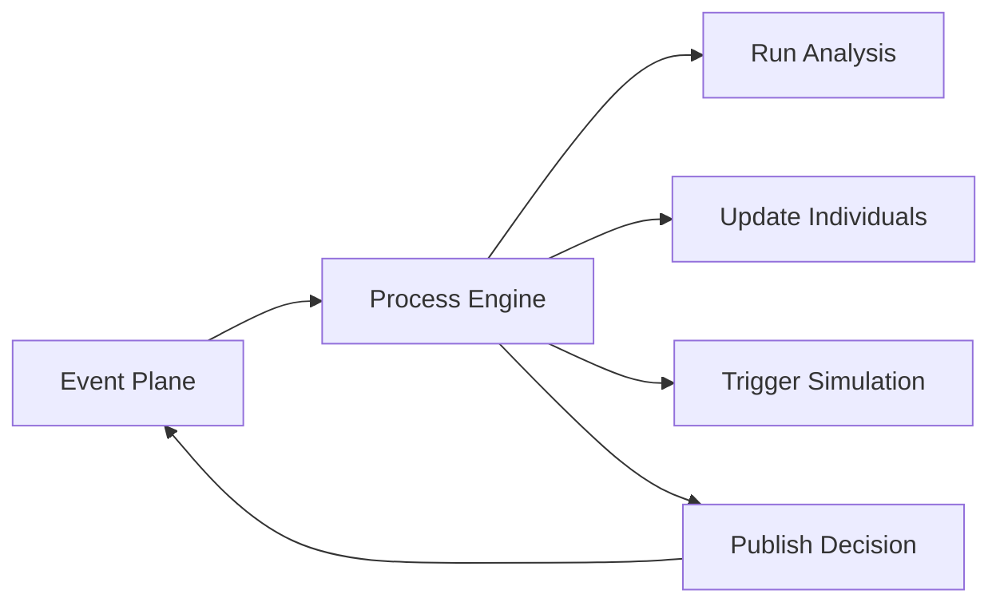

This loop is the heartbeat of the enterprise. Events trigger processes. Processes execute actions. Actions generate new events. Through this continuous cycle, the enterprise evolves as knowledge is added, refined, or challenged.

Within this execution cycle, DAS plays a more profound role than simply carrying out predefined actions. DAS acts as an intelligent decisioning agent inside the process layer. Whenever a process encounters a branch point or receives new information, DAS evaluates what should happen next. It uses the meaning encoded in the ontologies, the current state of project cells, and the sensitivity information produced by the Gray System. This allows DAS to reason through the options and select the next analytic path.

For example, if a project cell receives new data from a mission profile, DAS may conclude that a mission level simulation is needed, determine which model is appropriate, and initiate it automatically. A typical DAS determined action might be: “Run mission model X with the updated parameters and verify that the range requirement is still satisfied.” In this way, the enterprise does not simply execute processes. It interprets them dynamically and evolves them as needed.

The diagram below illustrates DAS acting as a decisioning agent within the process engine.

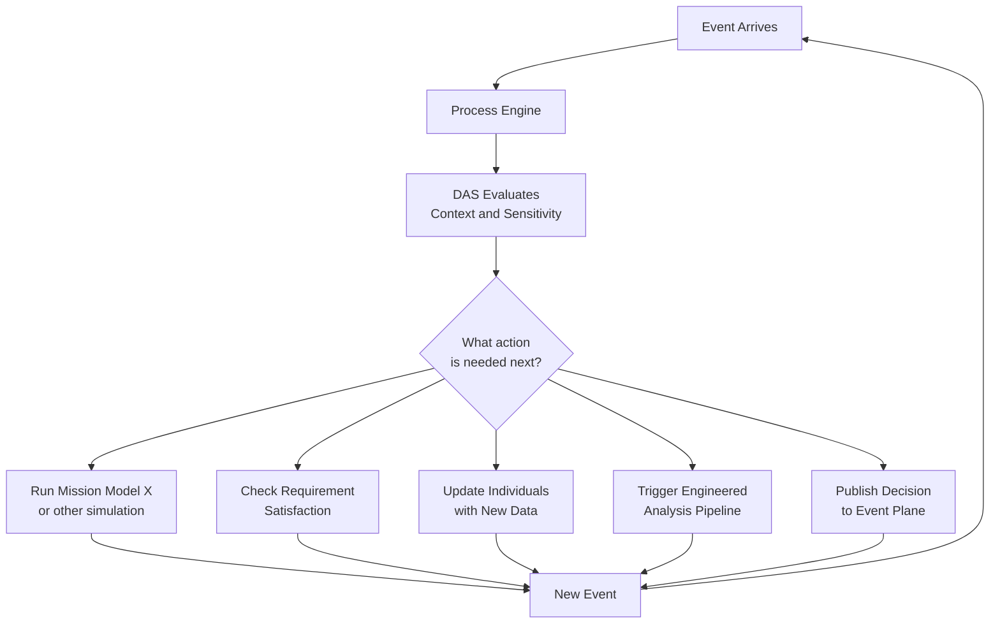

Processes operate at different scales within the enterprise. Some are small and contained within a single project cell. For example, a cell may have a process that validates new data against the cell’s ontology, generates derived requirements, and marks itself ready for review. Other processes operate across entire domains or layers. A federated process may gather outputs from multiple project cells, integrate evidence drawn from different domains, and produce a high level decision. At the largest scale, enterprise processes can activate entire bands of cells, reorganize domain structures, or adapt workflows in response to sensitivity insights produced by the Gray System.

DAS monitors the event stream, selects the processes that need to run, and carries out or directs the necessary actions. DAS can generate new processes, extend existing ones, or reshape a workflow based on new constraints or new semantic relationships discovered in the ontology layer. The process layer therefore becomes adaptive rather than static. DAS interprets context and makes process level decisions that would otherwise require expert human involvement.

Processes are deeply intertwined with the Gray System. If the Gray System identifies a fragile region in the project lattice or detects an emerging conflict between domains, it generates signals that enter the event plane. Processes can interpret these signals and perform corrective actions such as adjusting assumptions, running deeper analysis, requesting additional models, or initiating federated decision review. This converts sensitivity information into immediate operational guidance.

The x layer interacts with processes in a complementary way. As DAS explores experimental configurations, it generates trial processes that test new ways of coordinating the enterprise. These experimental processes may reorganize workflows, adjust the structure of project interactions, or create new forms of decision aggregation. If an experimental process demonstrates value and stability, it can be incorporated into the active enterprise.

A key advantage of the process layer is transparency. Every event and every process step is recorded as enterprise provenance. This allows engineers and program managers to understand how any decision was reached, what actions were taken, and what evidence contributed to the outcome. In large programs with complex chains of responsibility, this traceability is essential.

Because the enterprise is governed by processes, activation of project cells becomes systematic and safe. When a project cell completes its internal work and the Gray System confirms that its outputs are stable, a process initiates activation. This publishes the cell, allows its knowledge to propagate downward and laterally, and integrates it into the live lattice. Activation is not arbitrary. It is the scheduled outcome of well defined processes supported by continuous evaluation.

In summary, the process and execution layer allows ODRAS to operate as a coordinated, intelligent, and continuous digital enterprise. Processes interpret events, orchestrate analysis, manage decision flow, maintain coherence, and support stable enterprise evolution. Combined with DAS, the Gray System, the ontology layer, and the Data Manager, the process layer transforms ODRAS into a self assembling and self executing system capable of coordinating complex engineering and organizational work at scale.

# **Section 11 – Use Case: Bootstrapping an Entire Acquisition Program**

This section describes how ODRAS can bootstrap an entire acquisition program from a blank state. The purpose of this use case is to show how the architecture behaves when used for the kind of large, complex, multi domain engineering program that normally requires thousands of hours of coordination and manual modeling. Instead of treating acquisition as a collection of documents, spreadsheets, meetings, and disconnected models, ODRAS treats it as a structured, semantic, and computational enterprise that can assemble itself, execute itself, evaluate itself, and improve itself over time.

The use case begins with intent. A new program starts when leadership defines a mission or capability goal. In ODRAS, this intent is captured in an L0 project. The L0 project imports the foundational ontologies such as BFO, QUDT, and QuantityKind. These ontologies define the universal concepts that the enterprise will use. Requirements are then imported or created in the L0 and L1 layers, along with constraints, mission objectives, and high level definitions of what success means for the program.

Once intent is established, ODRAS uses DAS to assemble the program structure. DAS creates the acquisition lattice by generating layers L0 through L3 and creating domain columns such as systems engineering, mission analysis, modeling and simulation, logistics, sustainment, cost, reliability, safety, and program management. DAS creates a project cell at every intersection of layer and domain where work will occur. Not every cell needs an ontology, but many will contain small ontologies that capture local meaning. Each ontology aligns with the layer above it, ensuring that the program has a coherent semantic structure from the highest level of intent to the lowest level of implementation.

Below is a conceptual diagram of the structure that DAS assembles during program bootstrapping.

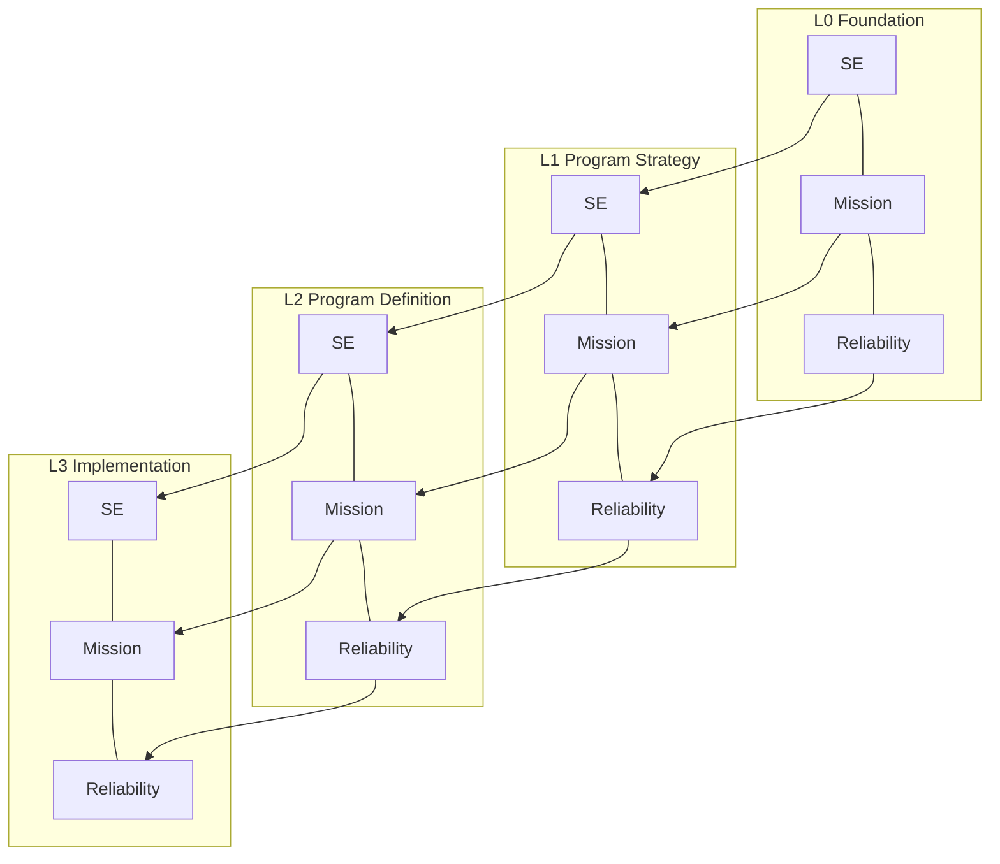

Once the structure exists, ODRAS imports the requirement documents. For example, a Capability Development Document may contain hundreds of requirements. The Requirements Workbench extracts these requirements and places them into the appropriate cells in L1 and L2. Because the domain ontologies already exist, the requirements can be categorized, interpreted, and linked to the ontology structure.

At this stage, DAS triggers conceptualization. The conceptualizer interprets each requirement through its domain ontology and produces conceptual individuals that represent the system structure. For an aircraft acquisition program, these conceptual individuals may include components, processes, functions, interfaces, and constraints. The conceptual individuals represent what must exist to satisfy the requirements. At this early stage, they are abstract. For example, an abstract component might represent a rotor system or avionics suite without specifying implementation details. A requirement may generate tens or hundreds of conceptual individuals. Across the entire CDD, conceptualization may produce thousands.

Once conceptualization is complete, the Data Manager begins pulling in external information. Vendor capabilities, subsystem performance data, mission profiles, environmental assumptions, and operational parameters are imported. The Data Manager maps these external objects to conceptual individuals by aligning them through the ontologies. If a vendor provides performance data for a rotor system, that data is mapped to the conceptual rotor component created during conceptualization. The system now has a structure that connects high level requirements to conceptual architecture to concrete data.

At this point, the Gray System becomes active. It uses the conceptual structure and the mapped data to evaluate sensitivity across the entire program. The Gray System perturbs requirements, constraints, parameters, and performance assumptions to identify stable and fragile regions. It can highlight areas where a small change produces large impacts. It can detect conflicts between domains, reveal brittle subsystems, and identify regions where design space is narrow. These insights appear before humans begin making decisions.

As sensitivity information becomes available, DAS uses this information to guide process execution. It may determine that a mission simulation must be run to validate range requirements. It may run cost models to evaluate affordability. It may trigger reliability assessments or logistics models to assess sustainment metrics. Each of these actions becomes an event in the event plane and may cause new processes to run. The enterprise begins to move.

As processes run, results accumulate in project cells. Evidence and derived requirements begin to emerge. Some project cells become ready for activation. When the Gray System confirms stability and DAS determines that the cell is complete, a process publishes the cell. The activated cell becomes part of the live enterprise lattice. Its knowledge becomes available to children and cousins, and the sensitivity landscape updates accordingly. The program gains structure and momentum.

Meanwhile, the x layer explores alternatives. It may reorganize domain boundaries, propose alternative decompositions of subsystem architectures, or test different project arrangements. It may generate alternative requirement sets or alternative mappings between requirements and conceptual individuals. These experiments do not change the live enterprise but provide alternative views that may improve resilience or performance. If the enterprise chooses to promote an alternative, DAS can restructure the lattice and begin running processes on the new configuration.

As the bootstrap process continues, the enterprise becomes increasingly refined. Requirements trace to conceptual structures. Conceptual structures trace to external data. Data traces to models and analysis. Analysis shapes decisions. Decisions create new requirements, activate new projects, and propagate through the lattice. The enterprise runs itself. Humans guide it by approving decisions, refining ontologies, validating evidence, and interpreting insights from the Gray System.

Eventually, the program reaches a point where the entire structure is in motion. Multiple project cells are active. Processes run continuously. The Gray System evaluates sensitivity in real time. The x layer proposes improvements. DAS makes analytic decisions automatically. Humans guide program level decisions. The enterprise becomes an operational digital environment that supports engineering at scale.

In summary, this use case shows that ODRAS can move from high level intent to a fully functioning acquisition program. It can assemble the enterprise structure, populate it with semantics, import and map requirements, generate conceptual architecture, integrate external data, run continuous analysis, surface decisions, and evolve the architecture. This demonstrates the full power of a self assembling and self executing digital enterprise environment.

# **Section 12 – Future Extensions**

ODRAS is designed as a living platform that will grow in capability as programs expand and as DAS becomes more capable. The architecture is intentionally modular so that new reasoning modes, new analytic tools, new workbenches, and new data integrations can be added without disrupting the existing enterprise. Because the system is semantic at its core and all work is mediated through the Data Manager and the API, extensions can be introduced rapidly and evaluated safely in the x layer before promotion to the live enterprise.

One major extension area is deeper integration with modeling and simulation engines. ODRAS can already trigger simulations and interpret their outputs, but future versions will support direct ontology aligned simulation constructs. This will allow simulations to be defined semantically rather than manually. A mission simulation, for example, could be generated directly from requirement structures, system architecture individuals, and operational ontologies. This would reduce modeling overhead and make simulation pipelines automatically traceable.

Another extension area is expanded analytics. Because the Gray System already computes continuous sensitivity, future versions of ODRAS will incorporate more advanced types of sensitivity analysis, probabilistic analysis, and uncertainty propagation. These capabilities will allow the enterprise to understand how system behavior changes under stochastic or adversarial conditions. They will also allow DAS to make more informed decisions when selecting analysis paths inside processes.

The decision model can also expand. As more decisions accumulate across the enterprise, ODRAS can begin to learn decision patterns. These patterns can guide DAS in making stronger recommendations, identifying common failure modes, or predicting which decisions will create fragility. The long term vision is a form of enterprise memory that helps guide decision making across programs. Decision quality metrics may also be introduced so that decision makers can see how stable, robust, or sensitive a particular decision is relative to others.

Another key extension area is multi enterprise integration. Many programs depend on vendors, partner organizations, government agencies, laboratories, and operational units. The Data Manager already supports the integration of external data, but the architecture can be expanded to support shared ontologies, synchronized project lattices, and federated Gray Systems. This would allow two or more organizations to align their enterprise architectures so that knowledge flows predictably between them without revealing internal proprietary structures.

ODRAS can also expand the workbench layer. For example, a cost workbench can integrate ontology aligned cost models. A logistics workbench can integrate sustainment ontologies with lifecycle data. A safety workbench can model hazards, mitigations, and risk artifacts. Because each workbench is independent and communicates through the Data Manager, it is straightforward to add new ones as program needs evolve.

The x layer will continue to grow in importance. Future versions of the system can support evolutionary design of entire programs. The x layer can generate alternative enterprise structures, requirement decompositions, or domain interactions. The Gray System evaluates these alternatives for stability. DAS ranks them. Humans select or refine the best ones. This creates a closed loop where the enterprise architecture itself evolves toward resilience and efficiency.

Finally, ODRAS can expand toward automated acquisition pathways. Many acquisition processes today require a complex choreography of documents, reviews, approvals, and analysis steps. Because ODRAS has a process engine, an event plane, and a semantic structure, future versions of the system can encode portions of acquisition policy directly into the architecture. This would turn the acquisition process from a manual administrative workflow into an automated reasoning and evidence based system.

In summary, the architecture is designed for growth. New modeling engines, new analytic components, new decision mechanisms, new ontologies, and new project structures can all be added without destabilizing the system. Because ODRAS is semantic, modular, and controlled through processes and the Data Manager, it can evolve to support increasingly complex engineering and organizational environments. The system is intended to grow with its users, with DAS acting as the engine that drives continuous improvement.

# **Section 13 – Competency Questions and Micro Theories (Revised with Definitions)**

Ontologies inside ODRAS are not created as abstract academic structures. They are created to support reasoning, analysis, and decision making. An ontology is only useful if it allows the enterprise to ask meaningful questions and receive meaningful answers. For this reason, competency questions and micro theories are first-class citizens in the ODRAS ontology development workflow. They guide the structure of ontologies, constrain their scope, and ensure that each ontology serves a practical purpose inside the project lattice.

A competency question defines what the ontology must be able to answer. It is a natural language question, written from the perspective of a user, analyst, or decision maker, that expresses a reasoning need. For example: What components satisfy this requirement. What evidence supports this constraint. What processes contribute to this function. A competency question captures the actual question a person or system will ask later, and it forces the ontology to contain the classes and relationships needed to answer it. If an ontology cannot answer its competency questions, then it is incomplete.

A micro theory defines the conceptual scope or “semantic boundary” of an ontology. It establishes the small, focused domain of meaning that the ontology is responsible for. A micro theory is not a large general-purpose model. It is a compact conceptual model that expresses a narrow idea such as failure semantics, mission environments, logistics states, aerodynamic factors, or reliability mechanisms. A micro theory answers: what belongs inside this semantic space, and what does not. Because ODRAS uses many small ontologies rather than one large one, micro theories give each ontology a clear purpose and keep them easy to understand and maintain.

Competency questions and micro theories work together. Competency questions describe what must be answered. The micro theory describes the conceptual world that contains those answers. The ontology is then built from this foundation. When users encounter these concepts for the first time, they may seem abstract, but in practice they are straightforward. Competency questions express the reasoning tasks the system must support. Micro theories express the minimal conceptual structures needed to support those tasks.

The relationship between competency questions, micro theories, ontologies, and the project lattice is illustrated below.

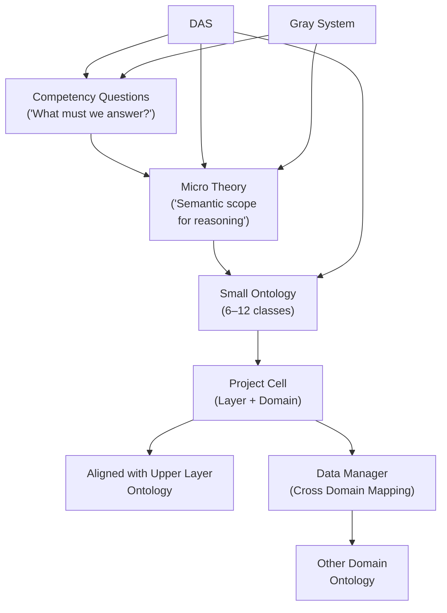

This diagram shows how ODRAS creates ontologies that are small, purposeful, and aligned across the enterprise. Competency questions define what needs to be answered. Micro theories interpret the meaning and shape the ontology. The ontology lives inside a project cell and aligns with the ontology in the layer above. The Data Manager provides horizontal mappings across domains. DAS uses the questions and micro theories to build and refine the ontology. The Gray System uses the same questions to structure sensitivity exploration.

Together, competency questions and micro theories create a disciplined approach to ontology creation in ODRAS. Instead of building large monolithic structures, ODRAS builds many small ontologies that answer specific questions. Each ontology is scoped by a micro theory and embedded in the project lattice. This keeps the semantic environment lightweight, modular, and easy for humans to understand. It also allows DAS to reason efficiently because each ontology remains focused.

Competency questions are integrated directly into the Ontology Workbench. When users create or edit an ontology, they define the questions the ontology must satisfy. DAS then evaluates whether the ontology can answer those questions. If not, DAS can propose new classes, properties, or refinements. This turns ontology development into an iterative process where users and the system collaboratively shape meaning.

Micro theories function similarly. When a project requires a specific type of reasoning, a micro theory defines the conceptual boundaries of that reasoning. Because micro theories are small, they align naturally with the design philosophy of ODRAS. They can be created at any layer, linked to parent micro theories above them, and mapped to other micro theories across domains. This keeps the entire enterprise semantically coherent even as it grows.

Competency questions are also vital to the Gray System. The Gray System does not perturb variables randomly. It perturbs them in ways that allow competency questions to be asked under different conditions. This reveals where reasoning is stable, where it is fragile, and where assumptions need refinement. In this way, competency questions guide the analysis as much as they guide ontology development.

Finally, competency questions and micro theories play an important role in the x layer. The x layer generates alternative enterprise configurations, new project structures, and new semantic alignments. DAS uses competency questions to evaluate whether each alternative is semantically complete. If an alternative cannot satisfy its competency questions, it is revised or discarded. This ensures that the x layer does not produce architectures with semantic gaps.

In summary, competency questions and micro theories are the foundation of semantic discipline within ODRAS. They ensure that ontologies are purpose built, aligned vertically, interoperable across domains, and capable of supporting reasoning throughout the enterprise. They allow DAS to build, refine, and validate semantic structures. They allow the Gray System to explore sensitivity meaningfully. They ensure that ODRAS remains coherent, scalable, and understandable even as it evolves.

# **Appendix A – Competency Questions and Micro Theories in ODRAS**

Ontology development in ODRAS is guided by practical reasoning needs rather than abstract modeling philosophy. The system uses competency questions and micro theories to ensure that every ontology serves a defined purpose, supports actual analysis, and remains small enough to manage at scale. This appendix introduces these concepts in a clear and accessible way and provides a complete example using the Basic Systems Engineering Ontology (BSEO).

## **1. Competency Questions: Defining What Must Be Answered**

A competency question expresses what an ontology must be able to answer. It is written as a natural language question from the perspective of a user, analyst, engineer, or automated agent. Competency questions give ontologies purpose. They define what reasoning tasks must be supported by the semantic structure.

Examples of competency questions include:

* What components satisfy this requirement
* What functions support this capability
* What evidence supports this constraint
* How much cargo can this aircraft carry
* Which components contribute to meeting the range requirement
* What interfaces are needed for these components to work together

A competency question is not an ontology class. It is not a property. It is not a structural constraint. It is a reasoning question. The ontology must contain enough structure to answer it, but no more. If the ontology cannot answer the competency question, it requires refinement. If the ontology contains structure that does not contribute to answering any competency question, the scope should be reduced.

Inside ODRAS, competency questions serve several purposes:

1. They guide ontology design.
2. They allow DAS to evaluate ontology completeness.
3. They guide the Gray System during sensitivity analysis.
4. They guide the x layer during architectural exploration.
5. They provide a simple and powerful way for users to shape semantic content.

Competency questions are the anchor for semantic correctness.

## **2. Micro Theories: Defining the Semantic Boundaries**

A micro theory is a small conceptual model that defines the semantic space the ontology is allowed to describe. It constrains meaning. A micro theory specifies what belongs inside the ontology and, just as important, what does not.

Micro theories in ODRAS are intentionally small. Most have six to twelve classes. This follows from two architectural goals:

1. Keep ontologies easy for humans to understand.
2. Keep ontologies easy for DAS and the Gray System to reason over.

A micro theory contains:

* the key classes in the semantic space
* the minimal necessary object and data properties
* any individuals required for initial reasoning
* alignment links to the ontology in the layer above
* no unnecessary structure

Examples of micro theories include:

* Requirement Satisfaction Theory
* Mission Decomposition Theory
* Failure Semantics Theory
* Cargo Capability Theory
* Process and Function Alignment Theory

Each micro theory defines a small but complete semantic world. Ontologies built from micro theories remain lightweight, precise, and aligned with the project lattice.

## **3. Why ODRAS Uses CQ and MT Together**

Competency questions define what the ontology must do.
Micro theories define the space in which it can do it.
Together, they produce small, targeted ontologies that are:

* easy to construct
* easy to validate
* easy to align vertically
* easy to map horizontally
* easy for DAS to modify or extend
* ideal for sensitivity exploration in the Gray System

This design eliminates the need for monolithic ontologies. Instead of trying to model a whole system or domain in a single structure, ODRAS uses many small ontologies aligned across layers and mapped across domains through the Data Manager.

The result is a semantic environment that is both scalable and precise.

## **4. Example: BSEO Ontology Built Using CQ and MT**

To illustrate how competency questions and micro theories work together, this section provides a complete example using the Basic Systems Engineering Ontology (BSEO). BSEO defines foundational engineering concepts such as Requirement, Component, Function, Process, Constraint, and Interface.

### **4.1 Micro Theory: Requirement Satisfaction Theory**

Purpose: Define the semantic world needed to determine how requirements are satisfied by components, functions, processes, and interfaces.

Scope:

* Requirement
* Component
* Function
* Process
* Constraint
* Interface
* Evidence
* Satisfaction link

This micro theory answers the question: What must exist for a system to satisfy a requirement.

### **4.2 Competency Questions for This Micro Theory**

1. Which components satisfy this requirement
2. Which functions or processes contribute to requirement satisfaction
3. What evidence supports satisfaction of this requirement
4. Which constraints limit satisfaction
5. What interfaces are needed for components to jointly satisfy a requirement

Each question directly shapes the ontology.

### **4.3 Creating the Ontology Fragment**

From the micro theory and competency questions, we produce a small ontology containing the minimal set of classes and properties needed to answer the questions.

For cargo capability, the ontology may include:

* `AirVehicle`
* `hasCargoCapacity`
* `Requirement`
* `Satisfaction`
* `hasEvidence`

Nothing more is needed.

### **4.4 Populating the Micro Theory**

Inside a named graph representing the micro theory, we store facts such as:

```
:C130 a bseo:AirVehicle .
:C130 bseo:hasCargoCapacity "500"^^xsd:decimal .

:CargoReq a bseo:Requirement .
:CargoReq bseo:hasMinimumCargo "500"^^xsd:decimal .
```

These are not global truths. They belong to the specific micro theory that encodes the scenario, baseline, or analysis context.

### **4.5 A Competency Question as SPARQL**

The natural language CQ:

“How much cargo can this aircraft carry”

corresponds to the SPARQL representation:

```
SELECT ?aircraft ?capacity
WHERE {
    GRAPH <bseo-v1-cargo-mt> {
        ?aircraft a bseo:AirVehicle ;
                  bseo:hasCargoCapacity ?capacity .
    }
}
```

This shows exactly how CQs and MTs work together:

* CQ = reasoning intent
* MT = fact space
* SPARQL = operationalization

### **4.6 How the CQ/MT Structure Is Used by ODRAS**

* The Conceptualizer uses the micro theory to generate individuals.
* DAS uses the competency questions to validate ontology completeness.
* The Data Manager uses the ontology to map external data into individuals.
* The Gray System uses the competency questions to evaluate sensitivity.
* The x layer uses competency questions to validate alternative ontologies.

The CQ/MT mechanism is therefore not an academic feature. It is an operational engine that drives reasoning across the entire digital enterprise.

## **5. Summary**

Competency questions define what must be knowable.
Micro theories define the semantic boundaries that make this knowledge possible.
Ontologies become small, aligned, and purpose built.
Reasoning becomes predictable, structured, and machine assisted.
DAS can build, enrich, and validate ontologies automatically.
The Gray System can explore sensitivity using the same questions.
The x layer can evolve alternative ontologies using the same micro theories.

This appendix provides the conceptual foundation that demonstrates why ODRAS uses CQ and MT. It also shows how the architectural principles of small ontologies, vertical alignment, and semantic mapping all flow naturally from this design.

Absolutely — now that the conceptualizer is understood as a **hybrid conceptual–logical generator**, we can revise **Appendix B** to *explicitly explain that hybrid nature*, why it works, and why it is only possible now that we have semantic LLMs.

# **Appendix B – A Simple Hybrid Conceptual–Logical Example Using BSEO_V1**

This appendix gives a practical example of how ODRAS uses the Basic Systems Engineering Ontology (BSEO_V1) to generate a small conceptual structure from a single requirement. The goal is to illustrate the hybrid nature of the conceptualizer. It produces objects that are not purely conceptual and not fully logical. They are early program definitions that the enterprise can use for SysML models, trades, analysis, and future refinement.

This example shows how ODRAS can generate a coherent semantic structure within minutes, something that would take analysts weeks or months to construct manually. The power of a semantic LLM allows us to build early system definitions quickly and with high quality.

The requirement used in this example is:

**“The system shall fly grid patterns with cross-track error ≤ 10 m [T] and ≤ 5 m [O].”**

This requirement describes a behavior, a geometric flight pattern, and a performance constraint. It is typical of early Phase Zero and Pre–Milestone A studies.

## **1. Start with a Project**

A project cell is created in the systems engineering domain at the L2 layer. The project begins empty and awaits the requirement.

## **2. Import the Requirement**

The requirement is imported as an individual in the Requirement class. No conceptual structure exists yet. ODRAS only knows that this requirement exists and contains performance bounds.

## **3. Create a Blank Ontology Model**

Next, a blank ontology suitable for this project is created. It begins as an empty BSEO_V1 extension containing none of the classes or individuals that will eventually be needed. This blank state is intentional. It allows competency questions and micro theories to drive ontology growth in small, scoped increments.

## **4. Define a Simple Competency Question and Micro Theory**

The competency question expresses what the ontology must support:

**CQ: What system elements, functions, and constraints must exist to allow the system to fly a grid pattern and control cross-track error within the specified limits.**

The micro theory defines the semantic boundary:

**Micro Theory: Grid Flight Accuracy Theory**
Scope: Represent flight patterns, navigation behavior, error measures, and the relationships needed to reason about cross-track control.

This combination guides the ontology building process without forcing unnecessary structure.

## **5. Build the Ontology Iteratively**

Using the CQ and micro theory, we incrementally introduce only those classes needed for reasoning:

* Requirement
* Constraint
* Component
* Process
* Function
* FlightPattern
* GridPattern
* CrossTrackError
* Interface

We also introduce only the minimal relationships:

* requirement has_constraint constraint
* requirement deploys component
* component presents interface
* component performs process
* process realizes function
* function specifically_depends_upon component

ODRAS adds classes only when needed. This avoids large, unwieldy ontologies and keeps the semantic model lightweight and maintainable.

## **6. The Hybrid Conceptual–Logical Step: Estimating Needed Individuals**

The conceptualizer now builds the minimal set of individuals required to **fulfil** the requirement. These individuals are conceptual enough to be architecture free, yet logical enough to serve as early system definitions for SysML and trade studies.

Based on the requirement and ontology, ODRAS estimates:

### **Constraints**

* `Constr_CTE_T10m`
* `Constr_CTE_O5m`

These hold the threshold and objective limits.

### **Components**

At minimum, three conceptual components must exist:

* `Comp_FlightControlSystem`
* `Comp_ErrorMeasurementSystem`
* `Comp_GroundTrackerSystem`

These represent the early program intuition of what subsystems are needed to execute and control grid pattern flight.

### **Processes**

Each component must perform at least one process:

* `Proc_ErrorMeasurement`
* `Proc_GroundTracking`
* `Proc_GridControl`

This captures what the system does, not yet how it is implemented.

### **Functions**

Each process realizes a function:

* `Func_ErrorMeasurement`
* `Func_GroundTracking`
* `Func_GridPatternControl`

Functions describe capability, not implementation. They help identify what the system must be able to accomplish to satisfy the requirement.

### **Interfaces**

Each component presents an interface:

* `If_ErrorToControl`
* `If_GroundRefToTracker`

These represent minimal integration points needed for coordinated control.

These individuals form the hybrid conceptual–logical structure produced by the conceptualizer.

## **7. Why This Hybrid Works**

This structure is not a design. It is not an architecture. It is not a model of a particular aircraft or mission system.

It is the **early semantic definition** of what the system must have in order to fulfil the requirement. It is conceptual in the sense that the component names and functions are generic. It is logical in the sense that the objects are typed, connected, and implicitly queryable.

This hybrid works because:

1. It is rich enough to drive reasoning and analysis.
2. It is abstract enough to avoid premature design decisions.
3. It can be generated in minutes by a semantic LLM.
4. It provides the early system definition inventory needed for SysML.
5. It is repeatable for every requirement, giving a complete conceptual system picture early in the program.

In earlier generations of tools, engineers would manually decompose requirements and build these logical skeletons using spreadsheets, whiteboards, and endless document work. It would take days or weeks per requirement. ODRAS and a modern semantic LLM can generate these definitions in minutes and at high quality, speeding the early reasoning loop significantly.

## **8. Repeating the Process for Every Requirement**

This same method is repeated for each requirement:

* introduce constraints
* identify conceptual components
* identify minimal processes
* identify functions
* identify interfaces
* connect through BSEO relationships

As the system grows, the conceptualizer produces a global conceptual inventory of what the system must contain. This becomes the foundation for early architecture trade studies.

## **9. Using the Conceptual Model for SysML and Analysis**

Once the conceptual individuals exist:

* They can be exported as SysML blocks, activities, functions, and constraints.
* They provide consistent naming and definitions for architecture teams.
* They can seed parametric and performance analyses.
* They can support early mission modeling and trade studies.
* They can align with vendor data through the Data Manager.
* They can be evaluated by the Gray System for sensitivity to perturbations.

This hybrid approach is what makes ODRAS powerful in Pre–Milestone A work. It gives structure and clarity early in the program, without constraining design options.

## **10. Summary**

Appendix B demonstrates how ODRAS uses the BSEO_V1 ontology, a single requirement, and a simple CQ/MT pair to construct a hybrid conceptual–logical definition of the system. This approach is only practical because a semantic LLM can perform the early reasoning step rapidly and at near-human quality, something that previously required large teams and long timelines.

This hybrid layer is now one of the most valuable outputs of the ODRAS architecture. It transforms requirement text into meaningful structure and prepares the enterprise for modeling, decision support, and system definition.

# **Diagram: Hybrid Conceptual–Logical Workflow in ODRAS**

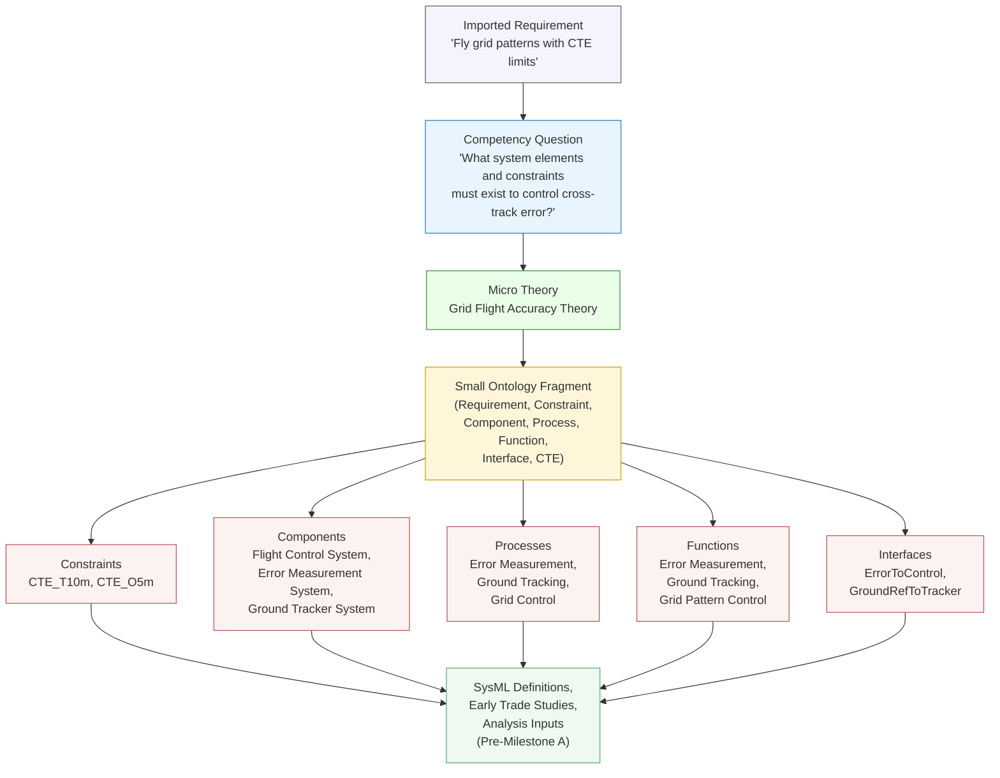

---

# **Diagram Summary: What It Shows**

This diagram illustrates how ODRAS generates the hybrid conceptual–logical structure for a requirement in early program work.

1. The requirement is imported into the system. It is just text with constraints.

2. A simple competency question and a small micro theory define the semantic scope.
   They tell ODRAS what kind of system elements must exist.

3. A small BSEO_V1 ontology fragment emerges from the CQ/MT.
   Only the needed classes appear. Nothing more.

4. The conceptualizer then generates individuals that represent the minimum logical skeleton required to fulfil the requirement:

   * threshold and objective constraints
   * conceptual system components
   * high-level processes
   * basic functions
   * simple interfaces

   These are not architectural decisions.
   They are semantic definitions of “what must exist.”

5. These individuals become the foundation for downstream work:

   * SysML block and activity definitions
   * early trade studies
   * mission modeling
   * cost and performance analysis
   * vendor capability alignment
   * sensitivity evaluation in the Gray System

This hybrid flow is only possible because semantic LLMs give ODRAS the ability to infer early system definitions in minutes. The result is an eighty-percent conceptual structure that would have taken analysts weeks or months to construct manually.
