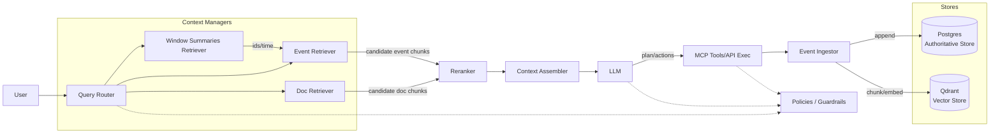
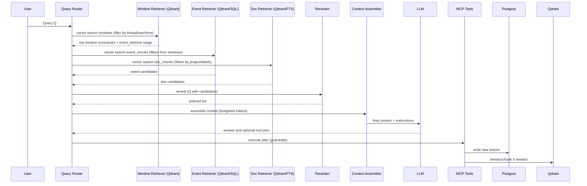
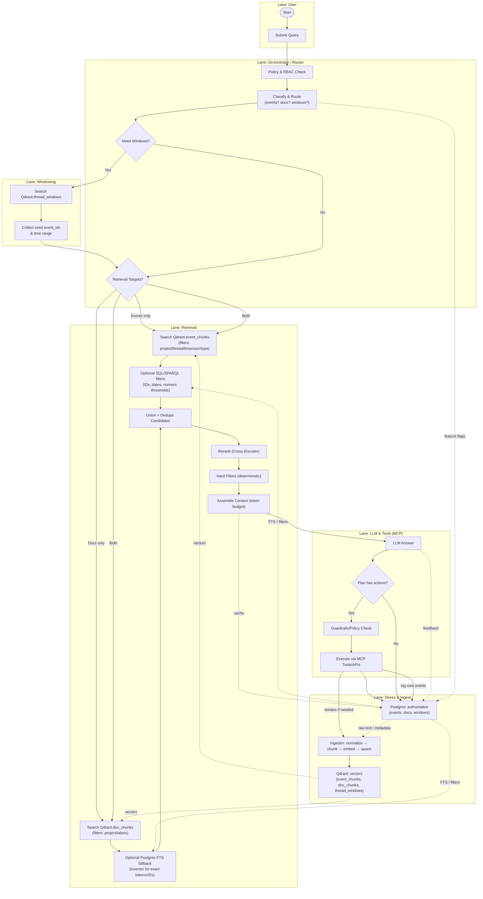
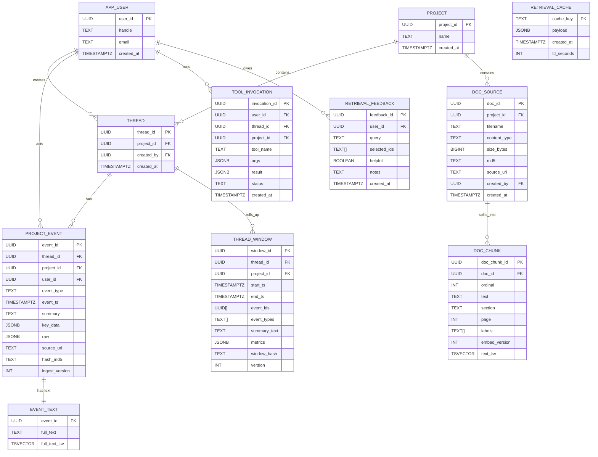

Below is a **production‑grade RAG design** that is **contextually aware of**:

1. **App events** (system activity)
2. **User events** (who did what, when)
3. **Document chunks** (knowledge)
4. **Optional extras** you likely need in practice (retrieval cache, feedback, policies)

I include **ASCII/Mermaid graphs**, **PostgreSQL DDL**, and **Qdrant collection schemas/payloads**. No BPMN.

---

## 1) High‑level architecture (graph)



**Key:**

* **Query Router**: picks which retrievers to call (events/docs/both).
* **Window Summaries Retriever**: jumps to the right “chapter” of a thread/time range.
* **Event Retriever**: fine‑grained chunks from app/user events.
* **Doc Retriever**: knowledge chunks from documents.
* **Reranker**: cross‑encoder or lightweight LLM to re‑order mixed candidates.
* **Context Assembler**: trims/merges into final prompt.
* **MCP Tools**: perform actions; all actions are logged as events.
* **Postgres**: source of truth, analytics, filters, joins.
* **Qdrant**: fast semantic search over chunks and summaries.

---

## 2) Retrieval sequence (graph)



---

## 3) Data model — PostgreSQL (authoritative source)

**Goals:** append‑only events, reproducible windows, optional lexical search fallback, joins/filters.

> Assumes PostgreSQL 13+. Enable extensions if allowed.

```sql
-- Extensions (optional but recommended)
CREATE EXTENSION IF NOT EXISTS pg_trgm;
CREATE EXTENSION IF NOT EXISTS unaccent;

-- Users & projects
CREATE TABLE app_user (
  user_id UUID PRIMARY KEY,
  handle TEXT NOT NULL,
  email TEXT UNIQUE,
  created_at TIMESTAMPTZ NOT NULL DEFAULT now()
);

CREATE TABLE project (
  project_id UUID PRIMARY KEY,
  name TEXT NOT NULL,
  created_at TIMESTAMPTZ NOT NULL DEFAULT now()
);

CREATE TABLE thread (
  thread_id UUID PRIMARY KEY,
  project_id UUID NOT NULL REFERENCES project(project_id),
  created_by UUID REFERENCES app_user(user_id),
  created_at TIMESTAMPTZ NOT NULL DEFAULT now()
);

-- Authoritative, append-only event log
CREATE TABLE project_event (
  event_id UUID PRIMARY KEY,
  thread_id UUID NOT NULL REFERENCES thread(thread_id),
  project_id UUID NOT NULL REFERENCES project(project_id),
  user_id UUID REFERENCES app_user(user_id),
  event_type TEXT NOT NULL,                   -- e.g., ontology_modified, document_uploaded
  event_ts TIMESTAMPTZ NOT NULL,              -- source timestamp
  summary TEXT NOT NULL,                      -- short human-readable
  key_data JSONB NOT NULL DEFAULT '{}'::jsonb, -- structured attributes
  raw JSONB,                                  -- optional full raw payload
  source_uri TEXT,                             -- optional external reference
  hash_md5 TEXT,                               -- dedupe/audit
  ingest_version INT NOT NULL DEFAULT 1
);

CREATE INDEX ON project_event (project_id, event_ts);
CREATE INDEX ON project_event (thread_id, event_ts);
CREATE INDEX ON project_event (event_type, event_ts);
CREATE INDEX project_event_key_data_gin ON project_event USING GIN (key_data jsonb_path_ops);

-- Canonical event text to chunk (normalization output)
CREATE TABLE event_text (
  event_id UUID PRIMARY KEY REFERENCES project_event(event_id) ON DELETE CASCADE,
  full_text TEXT NOT NULL,
  full_text_tsv tsvector GENERATED ALWAYS AS (
    to_tsvector('english', unaccent(full_text))
  ) STORED
);
CREATE INDEX event_text_tsv_idx ON event_text USING GIN (full_text_tsv);

-- Documents and their chunks (authoritative metadata; vector lives in Qdrant)
CREATE TABLE doc_source (
  doc_id UUID PRIMARY KEY,
  project_id UUID NOT NULL REFERENCES project(project_id),
  filename TEXT NOT NULL,
  content_type TEXT,
  size_bytes BIGINT,
  md5 TEXT,
  source_uri TEXT,
  created_by UUID REFERENCES app_user(user_id),
  created_at TIMESTAMPTZ NOT NULL DEFAULT now()
);

CREATE TABLE doc_chunk (
  doc_chunk_id UUID PRIMARY KEY,
  doc_id UUID NOT NULL REFERENCES doc_source(doc_id) ON DELETE CASCADE,
  ordinal INT NOT NULL,               -- chunk order
  text TEXT NOT NULL,
  section TEXT,
  page INT,
  labels TEXT[],                      -- tags/keywords
  embed_version INT NOT NULL DEFAULT 1,
  text_tsv tsvector GENERATED ALWAYS AS (
    to_tsvector('english', unaccent(text))
  ) STORED
);
CREATE UNIQUE INDEX doc_chunk_doc_ordinal ON doc_chunk(doc_id, ordinal);
CREATE INDEX doc_chunk_labels_idx ON doc_chunk USING GIN (labels);
CREATE INDEX doc_chunk_tsv_idx ON doc_chunk USING GIN (text_tsv);

-- Window rollups (time-based or phase-based)
CREATE TABLE thread_window (
  window_id UUID PRIMARY KEY,
  thread_id UUID NOT NULL REFERENCES thread(thread_id),
  project_id UUID NOT NULL REFERENCES project(project_id),
  start_ts TIMESTAMPTZ NOT NULL,
  end_ts TIMESTAMPTZ NOT NULL,
  event_ids UUID[] NOT NULL,
  event_types TEXT[] NOT NULL,
  summary_text TEXT NOT NULL,
  metrics JSONB NOT NULL DEFAULT '{"count":0}'::jsonb,
  window_hash TEXT,                  -- content hash for idempotence
  version INT NOT NULL DEFAULT 1
);
CREATE INDEX ON thread_window (thread_id, start_ts, end_ts);
CREATE INDEX thread_window_event_types_idx ON thread_window USING GIN (event_types);

-- Tool executions (MCP), auditable
CREATE TABLE tool_invocation (
  invocation_id UUID PRIMARY KEY,
  user_id UUID REFERENCES app_user(user_id),
  thread_id UUID REFERENCES thread(thread_id),
  project_id UUID REFERENCES project(project_id),
  tool_name TEXT NOT NULL,
  args JSONB NOT NULL,
  result JSONB,
  status TEXT NOT NULL,           -- success/failed/retried
  created_at TIMESTAMPTZ NOT NULL DEFAULT now()
);

-- Retrieval feedback & cache (optional)
CREATE TABLE retrieval_feedback (
  feedback_id UUID PRIMARY KEY,
  user_id UUID REFERENCES app_user(user_id),
  query TEXT NOT NULL,
  selected_ids TEXT[] NOT NULL,
  helpful BOOLEAN,
  notes TEXT,
  created_at TIMESTAMPTZ NOT NULL DEFAULT now()
);

CREATE TABLE retrieval_cache (
  cache_key TEXT PRIMARY KEY,      -- e.g., hash(query + filters)
  payload JSONB NOT NULL,          -- serialized candidate set
  created_at TIMESTAMPTZ NOT NULL DEFAULT now(),
  ttl_seconds INT NOT NULL DEFAULT 600
);
```

**Notes**

* Use **`project_event`** for filters/joins; use **`event_text`** for FTS fallback.
* **`doc_chunk`** keeps the authoritative chunk text; embeddings live in Qdrant.
* **`thread_window`** captures rollups (for “jump to right period”).

---

## 4) Qdrant collections (semantic search)

> Use one embedding model across collections or track `embed_version`. Dimensions below are examples.

### 4.1 `event_chunks`

* **Purpose:** semantic retrieval of app/user events at chunk level.
* **Vectors:** `size: 1024, distance: Cosine` (adjust to your model).
* **Point id:** `"<event_id>::<chunk_ordinal>"`.
* **Payload (flat, filterable):**

  * `event_id` (string, keyword)
  * `chunk_id` (string)
  * `thread_id` (string, keyword)
  * `project_id` (string, keyword)
  * `user_id` (string, keyword, optional)
  * `event_type` (string, keyword)
  * `event_ts` (int64 epoch seconds)
  * `text` (string) — keep short; can store reference only if needed
  * `source_uri` (string)
  * `hash_md5` (string)
  * `embed_version` (int)

**Indexes to create (payload indexes):** `thread_id`, `project_id`, `event_type`, `event_ts`, `user_id`.

**Upsert example (single point):**

```json
{
  "id": "9d600f2a-9735-4e5f-9b35-d4287918b3f4::000",
  "vector": [/* 1024 floats */],
  "payload": {
    "event_id": "9d600f2a-9735-4e5f-9b35-d4287918b3f4",
    "chunk_id": "000",
    "thread_id": "ba1836eb-6e83-4a12-9e58-69ec23e8f783",
    "project_id": "0dcb21a5-9bc5-48eb-b233-d3182d8702e0",
    "user_id": "8709bffb-410c-4bc4-b1d9-292aac0ffa63",
    "event_type": "document_uploaded",
    "event_ts": 1769840552,
    "text": "uploaded disaster_response_requirements.md (4.1 KB)",
    "source_uri": "s3://.../2068c56a-1765-449e-adb2-668898b60a23",
    "hash_md5": "3ceac6...ec82a",
    "embed_version": 1
  }
}
```

### 4.2 `doc_chunks`

* **Purpose:** semantic retrieval of knowledge chunks.
* **Vectors:** `size: 1024, distance: Cosine`.
* **Point id:** `"<doc_id>::<chunk_ordinal>"`.
* **Payload:**

  * `doc_id` (string, keyword)
  * `chunk_id` (string)
  * `project_id` (string, keyword)
  * `filename` (string)
  * `page` (int, optional)
  * `section` (string, optional)
  * `labels` (array[string], optional)
  * `created_at` (int64 epoch)
  * `text` (string)
  * `embed_version` (int)

**Indexes:** `project_id`, `filename`, `labels`, `created_at`.

### 4.3 `thread_windows`

* **Purpose:** fast jump‑to‑period via summarized windows.
* **Vectors:** `size: 1024, distance: Cosine`.
* **Point id:** `"<thread_id>::<window_key>"` (e.g., `::2025-09-30T14:00Z`).
* **Payload:**

  * `window_id` (string)
  * `thread_id` (string, keyword)
  * `project_id` (string, keyword)
  * `start_ts`, `end_ts` (int64)
  * `event_ids` (array[string])
  * `event_types` (array[string])
  * `summary_text` (string)
  * `metrics.count` (int)
  * `version` (int)

**Indexes:** `thread_id`, `start_ts`, `end_ts`.

> Qdrant config: HNSW defaults work; set `ef_construct ~ 100`, `m ~ 16`. For large corpora, consider scalar quantization.

---

## 5) Ingestion pipelines (deterministic)

**Event pipeline**

1. Append into `project_event` (Postgres) + `event_text.full_text`.
2. Normalize to canonical text.
3. Chunk to ~400–800 tokens, 10–15% overlap.
4. Compute `chunk_id = sha1(event_id || chunk_text)[:8]`.
5. Embed; upsert to **`event_chunks`** (Qdrant).

**Document pipeline**

1. Register file in `doc_source`.
2. Extract text; chunk (same policy).
3. Store chunks in `doc_chunk` (Postgres).
4. Embed; upsert to **`doc_chunks`** (Qdrant).

**Window rollup**

1. Group by time bucket (e.g., 15 min) or phase markers.
2. Build `summary_text` (rule‑based + LLM compress).
3. Compute `window_hash`.
4. Upsert to **`thread_windows`** with `event_ids` + metrics.
5. Rebuild on late events by bumping `version`.

---

## 6) Retrieval strategy

**Routing (simple rules)**

* If query contains “what happened / when / who / changed / uploaded / created” → **events**.
* If query contains “what is / define / requirements / explain / spec” → **docs**.
* Otherwise: **both**.

**Search**

* **Step 1 (optional)**: windows → get time span and seed `event_ids`.
* **Step 2**: semantic search in `event_chunks` and/or `doc_chunks` (filters: project/thread/user/time).
* **Step 3 (optional)**: FTS fallback in Postgres using `event_text.full_text_tsv` and `doc_chunk.text_tsv` for keywords/IDs.
* **Step 4**: merge candidates (union) and apply **RRF**:

  * `score = Σ 1 / (k + rank_i)`; `k=60` is common.
* **Step 5**: **Rerank** with cross‑encoder on (query, text).
* **Step 6**: assemble context under token budget; prefer diversity across sources (events+docs).

**Filters to apply outside vectors:** numeric thresholds, exact IDs, dates, joins, user permissions.

---

## 7) Minimal orchestration pseudocode (Python‑like)

```python
def route(query: str) -> dict:
    q = query.lower()
    if any(t in q for t in ["uploaded", "modified", "created", "who", "when"]):
        return {"events": True, "docs": False, "windows": True}
    if any(t in q for t in ["what is", "define", "requirement", "spec", "explain"]):
        return {"events": False, "docs": True, "windows": False}
    return {"events": True, "docs": True, "windows": True}

def retrieve(query, ctx):
    candidates = []

    if ctx["windows"]:
        win = qdrant.search("thread_windows", embed(query), limit=5,
                            filter={"must":[{"key":"thread_id","match":{"value":ctx["thread_id"]}}]})
        seed_event_ids = list({eid for h in win for eid in h.payload["event_ids"]})
        time_range = (min(h.payload["start_ts"] for h in win), max(h.payload["end_ts"] for h in win))
    else:
        seed_event_ids, time_range = [], None

    if ctx["events"]:
        filt = {"must":[{"key":"project_id","match":{"value":ctx["project_id"]}}]}
        if seed_event_ids:
            filt["must"].append({"key":"event_id","match":{"any":seed_event_ids}})
        if time_range:
            filt["must"].append({"key":"event_ts","range":{"gte":time_range[0],"lte":time_range[1]}})
        ev = qdrant.search("event_chunks", embed(query), limit=50, filter=filt)
        candidates += [("event", h) for h in ev]

    if ctx["docs"]:
        filt = {"must":[{"key":"project_id","match":{"value":ctx["project_id"]}}]}
        dc = qdrant.search("doc_chunks", embed(query), limit=50, filter=filt)
        candidates += [("doc", h) for h in dc]

    # Optional lexical fallback
    # ev_lex = sql_fts_event(query); doc_lex = sql_fts_doc(query); candidates += ...

    reranked = cross_encoder_rerank(query, candidates)   # returns ordered list
    return reranked[:ctx.get("k", 20)]
```

---

## 8) LLM interface & tool use (concise)

* **LLM never talks to stores directly.**
* It returns a **plan**:

  ```json
  {
    "need": ["events","docs"],
    "filters": {"project_id":"...", "thread_id":"...", "time": {"since":"7d"}},
    "actions": [{"tool":"get_ontology_diff","args":{"graph":"bseo-v1"}}]
  }
  ```
* Orchestrator executes the plan, injects results, enforces **policies** (PII, RBAC, tool allowlist).

---

## 9) What else you probably need

* **Reranker model** (cross‑encoder) for quality.
* **Query rewrite** (expand acronyms, normalize IDs).
* **Entity linker** (map “bseo” → `graph_iri`).
* **Policy guardrails** (who can see what; redact).
* **Observability** (per‑query recall@k, MRR, latency, token usage).
* **Feedback loop** (thumbs up/down tied to candidate ids).
* **Versioning** (embed_version, ingest_version).
* **Backfill jobs** for re‑chunk/re‑embed.
* **Cache** for hot queries and recent windows.

---

## 10) Example windowing policy (time‑based)

* Window = **15 min**; **10–15% overlap**.
* Store top **N event_ids** (~200) and `event_types`.
* `summary_text` ≤ **800 tokens**.
* Recompute recent windows on each new event; nightly consolidate.

---

## 11) Example prompts (router + answering)

**Router system prompt (LLM‑assisted routing)**

```
You are a planner. Classify the user query:
- If about actions/changes/times/people -> need.events = true
- If about definitions/specs/requirements -> need.docs = true
May be both.
Return only JSON: {"need":{"events":bool,"docs":bool},"filters":{...}}
```

**Answerer system prompt**

```
You are an assistant. Use the provided CONTEXT only. Cite whether evidence came from events or docs.
If the user asks for actions, include timestamps and actors. If background info, include file names and sections.
If missing data, say what filter to try next.
```

---

## 12) Example “source separation” in answers

* Prefix snippets:

  * `[EVENT] 2025-09-30 14:19Z jdehart added class 'Class3' to 'bseo-v1'`
  * `[DOC] uas_specifications.md §2.3: "Payload limit ..."`
* Keep it deterministic so users can tell where facts came from.

---

## 13) Sane defaults

* Embedding chunk: **400–800 tokens**, **10–15% overlap**.
* Top‑K per retriever: **50**, final **20** after rerank.
* Max context: reserve **20–30% tokens** for the model’s reasoning.
* Time decay: bias recent **events** in scoring; not for static docs.

---

### TL;DR

* Keep **Postgres** as source of truth for events, docs, and windows.
* Use **Qdrant** for `event_chunks`, `doc_chunks`, and `thread_windows`.
* Route per query to events/docs (or both), retrieve, **rerank**, assemble context, then let MCP execute actions.
* Add policies, feedback, and observability from day one.

---
Below is a **workflow Mermaid diagram** that approximates the BPMN model for the RAG + events system (no BPMN XML). I also include a compact **ER diagram** of the Postgres layer for reference. Keep your two Qdrant collections (`event_chunks`, `doc_chunks`) and the optional `thread_windows`.

---

### Workflow (BPMN‑like) — RAG with Events, Docs, Windows, MCP



**Legend (shapes):**

* Rounded = start/stop/user/system entry.
* Rectangles = tasks.
* Diamonds = gateways (decisions).
* Dashed arrows = auxiliary flows (metadata, telemetry, cache).

---

### Postgres ER (authoritative layer)



---

### Qdrant collections (for completeness)

* **`event_chunks`**

  * `id`: `"${event_id}::${chunk_ordinal}"`
  * `vector`: embedding of normalized event chunk
  * `payload` (flat, filterable):

    * `event_id`, `chunk_id`, `thread_id`, `project_id`, `user_id`
    * `event_type`, `event_ts` (epoch s)
    * `text`, `source_uri`, `hash_md5`, `embed_version`
  * Index keys: `thread_id`, `project_id`, `event_type`, `event_ts`, `user_id`

* **`doc_chunks`**

  * `id`: `"${doc_id}::${chunk_ordinal}"`
  * `vector`: embedding of chunk text
  * `payload`: `doc_id`, `chunk_id`, `project_id`, `filename`, `section`, `page`, `labels[]`, `created_at` (epoch), `text`, `embed_version`
  * Index keys: `project_id`, `filename`, `labels`, `created_at`

* **`thread_windows`**

  * `id`: `"${thread_id}::${window_key}"`
  * `vector`: embedding of `summary_text`
  * `payload`: `window_id`, `thread_id`, `project_id`, `start_ts`, `end_ts`, `event_ids[]`, `event_types[]`, `summary_text`, `metrics.count`, `version`
  * Index keys: `thread_id`, `start_ts`, `end_ts`

**Embedding dimension/distance:** pick your model (e.g., 768/1024, cosine). Track `embed_version`.

---
