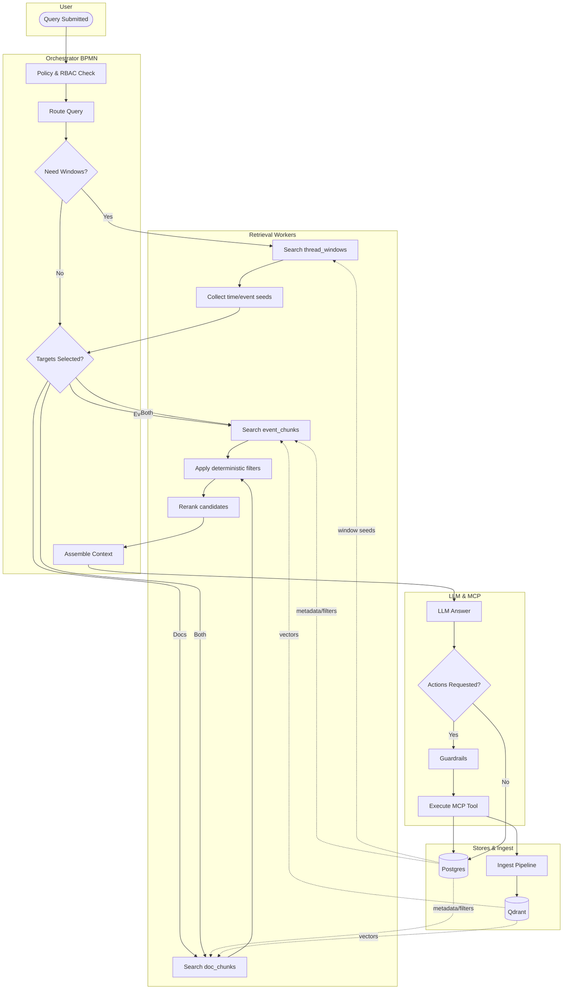
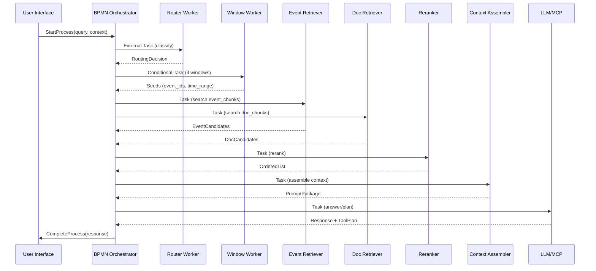
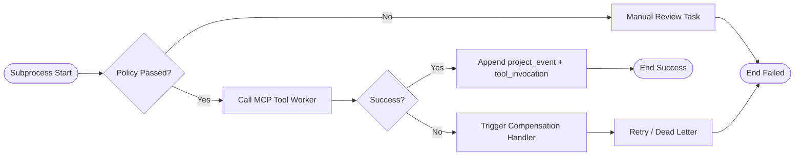
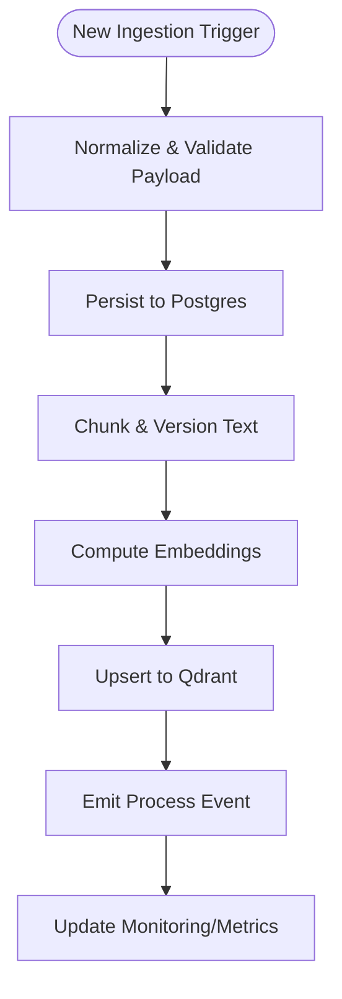

# RAG+ BPMN Implementation Plan

## Purpose & Scope

This document defines a comprehensive plan for replacing the current hard-coded Retrieval-Augmented Generation (RAG) orchestration in ODRAS with a BPMN-driven model. It consolidates the reference design from `docs/RAG_plus_study1.md`, incorporates additional BPMN research, and establishes roadmap, architecture, and operational controls required to deliver a production-ready RAG+ capability that remains fully self-hosted to protect potential CUI data (no SaaS or cloud-managed dependencies).

## Objectives

- Adopt a BPMN engine that provides resilient, observable orchestration across retrieval, policy, and tool-execution layers.
- Preserve the semantic retrieval improvements described in `docs/RAG_plus_study1.md` while enabling richer branching, human-in-the-loop tasks, and compensation logic.
- Align ingestion, storage, and policy enforcement with BPMN-managed processes to improve maintainability and auditability.
- Deliver a migration approach that allows shadow execution, parity validation, and controlled rollout without disrupting current operations.

## Research Summary: BPMN Engine Options

| Engine | Python Integration | Deployment Model | Strengths | Constraints |
| --- | --- | --- | --- | --- |
| Camunda 8 (Zeebe) | gRPC/REST workers; PyZeebe client | Self-hosted Zeebe cluster (K8s/VMs) | Scales horizontally; strong observability; BPMN 2.0 execution with timers and correlations | Operated entirely on-prem; requires Zeebe brokers + Elasticsearch/OpenSearch; commercial features gated; higher ops footprint |
| Camunda 7 (Activiti-based) | REST API + External Task workers | Java app server (Tomcat/Spring) | Mature tooling; embedded modeler; fully self-hosted | End-of-life October 2025; JVM-heavy; weaker cloud-native support |
| Flowable (Activiti fork) | Java-centric; REST API | Standalone Spring Boot or embedded | OSS friendly; lightweight footprint; self-hosted | Python integration via REST only; fewer managed services |
| Imixs-Workflow | REST API, MQTT | Java EE environment | Human-centric workflows, low-code; self-hosted | Less focus on high-throughput automation; limited vector-store patterns |

**Recommendation**: Prioritize self-hosted Camunda 8 (Zeebe) evaluation on secured infrastructure because it satisfies on-prem requirements while offering robust worker patterns for Python services. Maintain Flowable as a contingency for lighter-weight JVM deployments or if Zeebe’s operational footprint proves excessive. SaaS/hosted offerings remain out of scope due to potential CUI data exposure.

## Target Operating Model

## Process Inventory & BPMN Models

### 1. Query Orchestration Process

- **Trigger**: Message from gateway/UI containing query payload, user context, project/thread identifiers.
- **Key Gateways**: RBAC/policy compliance, retrieval routing decisions, timeout/retry branches for each worker type.
- **Artifacts**: `process_instance_id` recorded on `project_event`, `tool_invocation` to maintain lineage.

### 2. Tool Execution & Compensation Subprocess

- Executes MCP plans with guardrails and rollback handling.
- Invoked as embedded subprocess when LLM response includes actions.
- Boundary events watch for policy violations, timeouts, or execution errors.

### 3. Ingestion Event Process

- Converts document/event ingestion and re-embedding operations into BPMN-managed flows triggered by messages or timers.
- Ensures deterministic chunking, embedding, and upsert steps with monitoring hooks.

## Data & Metadata Extensions

- Add BPMN correlation columns:
  - `project_event.process_instance_id UUID`
  - `thread_window.process_instance_id UUID`
  - `tool_invocation.process_instance_id UUID`, `task_id TEXT`
- Create `bpmn_process_log` capturing state transitions, latency, retries.
- Ensure migrations update `odras.sh init-db`, `migration_order.txt`, and `backend/database_schema_info.json`.

## Service Layer Refactor

- Wrap Python modules as Zeebe workers (PyZeebe/gRPC) exposing:
  - `retrieve_thread_windows`
  - `retrieve_event_chunks`
  - `retrieve_doc_chunks`
  - `rerank_candidates`
  - `assemble_context`
  - `execute_mcp_tool`
  - `ingest_event_chunk`, `ingest_doc_chunk`
- Workers remain stateless, configurable via existing `.env` settings, and emit structured logs/metrics.
- Failure handling routed through BPMN job failure semantics with exponential backoff.

## Guardrails & Policies

- Implement policy gateways referencing RBAC service outputs before releasing retrieval results.
- Apply deterministic Postgres filters (project, thread, labels, timestamps) post-vector search.
- Configure boundary events for:
  - Unauthorized access → manual review lane.
  - PII detection requiring redaction.
  - Tool execution anomalies (timeout, failure threshold).

## Observability & Feedback Loop

- Integrate Zeebe metrics into Prometheus/Grafana dashboards (job latency, success rate, process duration).
- Extend `retrieval_feedback` capture as BPMN user tasks, populating existing table.
- Emit process completion events to analytics for recall@k, MRR, latency reporting.
- Provide distributed tracing integration (OpenTelemetry) across workers.

## Implementation Roadmap

1. **Phase 0 – Foundations (Weeks 1-2)**
   - Stand up a self-hosted Camunda 8 dev cluster (Docker Compose or bare-metal/Kubernetes instrumentation) within CUI-approved infrastructure.
   - Implement minimal Python worker to execute sample BPMN hitting Qdrant/Postgres read-only.
   - Draft BPMN models (query, tool execution, ingestion) and store XML in `docs/architecture/bpmn/`.

2. **Phase 1 – Retrieval Orchestration (Weeks 3-6)**
   - Implement router, window, event, doc, reranker, context workers.
   - Ship migration adding BPMN correlation fields.
   - Run shadow-mode orchestration comparing outputs/latency with existing pipeline.

3. **Phase 2 – Tool Execution & Guardrails (Weeks 7-9)**
   - Integrate guardrail services; implement compensation patterns.
   - Ensure MCP executions log canonical events and trigger re-index workflows when required.

4. **Phase 3 – Ingestion Alignment (Weeks 10-12)**
   - Convert ingestion/backfill jobs to BPMN message/timer-triggered processes.
   - Implement monitoring for ingestion lag and failures.

5. **Phase 4 – Observability & Feedback (Weeks 13-14)**
   - Wire BPMN runtime metrics into dashboards.
   - Automate retrieval feedback handling and integrate with reranker tuning loop.

6. **Phase 5 – Migration & Cutover (Weeks 15-16)**
   - Run dual-path shadow traffic; evaluate parity, latency, tool outcomes.
   - Gradually shift traffic using feature flags; maintain rollback plan.
   - Close out documentation updates and readiness checklist.

## Testing & Rollout Requirements

- Extend integration tests to launch Zeebe engine and workers via `docker-compose` in CI.
- Automate end-to-end UI tests using `das_service` credentials to validate BPMN execution logs and responses.
- Validate database migrations with `./odras.sh clean -y && ./odras.sh init-db` prior to merge.
- Update GitHub Actions workflows (`.github/workflows/ci.yml`, `ci-simple.yml`, `smoke-tests.yml`) to provision BPMN services.

## Documentation & Deliverables

- Store BPMN XML diagrams in `docs/architecture/bpmn/` with versioned filenames.
- Cross-reference this plan from `docs/RAG_plus_study1.md` and update `docs/DOCUMENT_HISTORY.md`.
- Produce operational runbook covering worker deployment, scaling, alert response, and failure recovery.

## Next Steps

- Finalize BPMN engine decision document and infrastructure prerequisites, confirming self-hosted deployment footprint.
- Kick off Phase 0 tasks with DevOps alignment for on-prem Zeebe deployment.
- Complete BPMN model drafts and schedule design review ahead of Phase 1 implementation.
