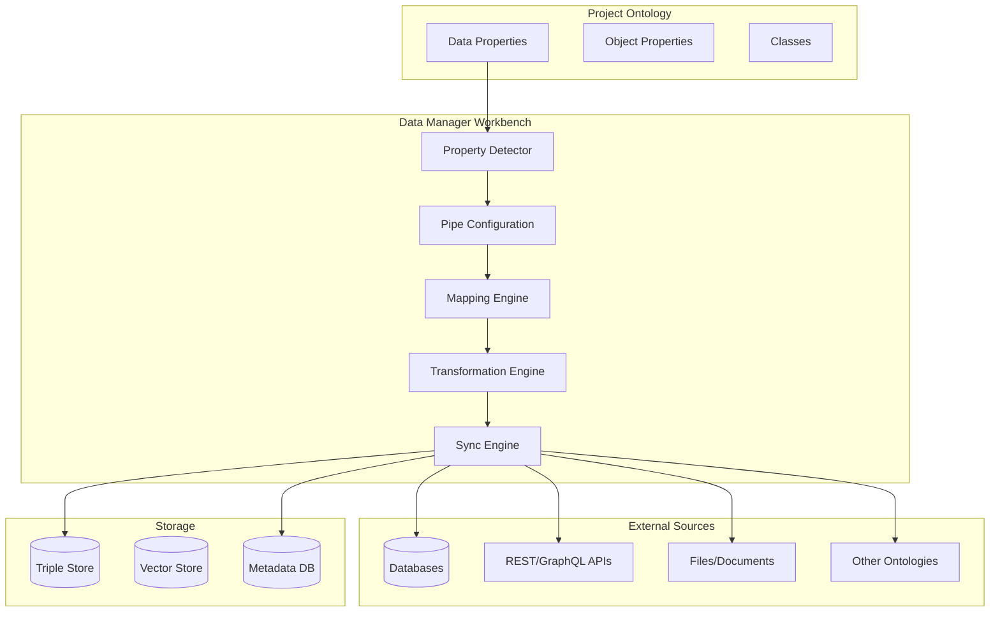

# Data Manager Workbench Specification

## Overview

The Data Manager Workbench is a new ODRAS component that bridges the gap between ontology data properties and real-world data sources. It enables users to create "data pipes" that connect semantic models to operational data, maintaining the benefits of ontological reasoning while working with live data.

## Core Concepts

### Data Properties in Ontologies
In RDF/OWL ontologies, data properties link individuals to literal values (strings, numbers, dates, etc.). The Data Manager Workbench activates these properties by:
- Automatically detecting data properties defined in the project ontology
- Creating configurable connections to external data sources
- Maintaining semantic consistency while enabling dynamic data integration

### Data Pipes
A data pipe is a configured connection between an ontology data property and an external data source. Each pipe defines:
- Source connection (database, API, file, etc.)
- Mapping rules (how external data maps to RDF literals)
- Transformation logic (data type conversion, validation)
- Refresh strategy (real-time, scheduled, manual)

## Architecture



## Best Practices for Ontology Data Integration

### 1. Semantic Consistency
- **Maintain Domain/Range Constraints**: Ensure external data respects the ontology's domain and range definitions
- **Type Safety**: Validate data types match RDF datatypes (xsd:string, xsd:integer, xsd:dateTime, etc.)
- **Cardinality Rules**: Respect min/max cardinality constraints defined in the ontology

### 2. Data Provenance
- **Source Tracking**: Record the origin of each data value
- **Timestamp Management**: Track when data was fetched and last updated
- **Version Control**: Maintain history of data changes
- **Quality Indicators**: Record confidence scores and validation results

### 3. Integration Patterns

#### R2RML (RDB to RDF Mapping Language)
For relational databases, follow W3C R2RML standards:
```turtle
@prefix rr: <http://www.w3.org/ns/r2rml#> .
@prefix odras: <http://odras.local/onto/> .

:CustomerMapping a rr:TriplesMap ;
    rr:logicalTable [ rr:tableName "customers" ] ;
    rr:subjectMap [
        rr:template "http://odras.local/data/customer/{id}" ;
        rr:class odras:Customer
    ] ;
    rr:predicateObjectMap [
        rr:predicate odras:customerName ;
        rr:objectMap [ rr:column "name" ]
    ] ;
    rr:predicateObjectMap [
        rr:predicate odras:revenue ;
        rr:objectMap [ 
            rr:column "annual_revenue" ;
            rr:datatype xsd:decimal
        ]
    ] .
```

#### API Integration Pattern
For REST/GraphQL APIs:
```json
{
  "pipe_config": {
    "source_type": "rest_api",
    "endpoint": "https://api.example.com/sensors/{sensor_id}",
    "auth": {
      "type": "bearer",
      "token_ref": "vault://api_tokens/sensor_api"
    },
    "mapping": {
      "odras:temperature": "$.current_temp",
      "odras:humidity": "$.current_humidity",
      "odras:lastReading": {
        "path": "$.timestamp",
        "transform": "iso8601_to_xsd_datetime"
      }
    }
  }
}
```

### 4. Performance Optimization
- **Lazy Loading**: Fetch data only when needed
- **Caching Strategy**: Implement TTL-based caching for frequently accessed data
- **Batch Operations**: Process multiple entities in single queries
- **Incremental Updates**: Only sync changed data

### 5. Error Handling
- **Graceful Degradation**: System continues with cached data if source unavailable
- **Validation Pipelines**: Validate data before committing to triple store
- **Retry Logic**: Implement exponential backoff for transient failures
- **Alert Mechanisms**: Notify users of persistent sync failures

## Data Pipe Types

### 1. Database Connections
**Supported Databases:**
- PostgreSQL, MySQL, SQLite (via R2RML)
- MongoDB (via JSON-LD mapping)
- Neo4j (direct RDF export)
- TimescaleDB (time-series data)

**Configuration Example:**
```yaml
pipe_type: database
connection:
  driver: postgresql
  host: localhost
  port: 5432
  database: operational_data
  credentials_ref: vault://db_creds/postgres_prod
mapping:
  query: |
    SELECT id, name, value, updated_at 
    FROM sensor_readings 
    WHERE sensor_type = 'temperature'
  bindings:
    odras:sensorId: id
    odras:sensorName: name
    odras:temperatureValue: value
    odras:readingTime: updated_at
```

### 2. API Integrations
**Supported Protocols:**
- REST (JSON, XML)
- GraphQL
- SOAP (legacy systems)
- WebSocket (real-time)

**Features:**
- Authentication management (OAuth2, API keys, JWT)
- Rate limiting and quota management
- Response transformation
- Error handling and retries

### 3. File-Based Sources
**Supported Formats:**
- CSV/TSV with header mapping
- Excel with sheet/range selection
- JSON with JSONPath queries
- XML with XPath queries
- CAD metadata (via specialized parsers)

**Processing:**
- Change detection (file hash, modified date)
- Incremental processing for large files
- Schema validation
- Format conversion

### 4. Ontology-to-Ontology
**Use Cases:**
- Import instance data from published ontologies
- Cross-project data sharing
- Federation of distributed knowledge

**Implementation:**
- SPARQL Federation for live queries
- Materialized views for performance
- Access control integration

## MVP Implementation Plan

### Phase 1: Foundation (Week 1)
1. **Database Schema**
   - Create data_pipes table
   - Design execution history tracking
   - Implement credential management

2. **Property Detection Service**
   - Monitor ontology for data property changes
   - Generate default pipe configurations
   - Notify UI of new properties

3. **Basic UI Components**
   - Data property browser
   - Pipe configuration form
   - Connection test interface

### Phase 2: Core Functionality (Week 1-2)
1. **Database Integration**
   - PostgreSQL connector
   - Basic R2RML mapping
   - Query builder UI

2. **Mapping Engine**
   - Simple field-to-property mapping
   - Basic data type conversion
   - Validation rules

3. **Sync Execution**
   - Manual sync trigger
   - Progress monitoring
   - Error reporting

### Phase 3: MVP Completion (Week 2)
1. **API Integration (Basic)**
   - REST API connector
   - JSON mapping
   - Authentication support

2. **Monitoring Dashboard**
   - Sync history view
   - Performance metrics
   - Error logs

3. **Testing & Documentation**
   - Integration tests
   - User documentation
   - Best practices guide

## Security Considerations

### Credential Management
- Use vault/secret management service
- Encrypt credentials at rest
- Audit credential access
- Rotate credentials regularly

### Data Access Control
- Respect project boundaries
- Implement row-level security where applicable
- Log all data access
- Support data masking/redaction

### Network Security
- Use SSL/TLS for all connections
- Implement IP whitelisting
- Support VPN/private endpoints
- Monitor for anomalous access patterns

## User Interface Design

### Main Dashboard
```
┌─────────────────────────────────────────────────────┐
│ Data Manager Workbench                              │
├─────────────────────────────────────────────────────┤
│ ┌─────────────┐ ┌─────────────────────────────────┐ │
│ │ Properties  │ │ Data Pipe Configuration         │ │
│ │             │ │                                 │ │
│ │ ✓ revenue   │ │ Property: odras:revenue         │ │
│ │ ○ temperat. │ │ Source: PostgreSQL Database     │ │
│ │ ○ location  │ │ Status: ● Active                │ │
│ │ + Add New   │ │                                 │ │
│ └─────────────┘ │ Mapping:                        │ │
│                 │ ┌─────────────┬───────────────┐ │ │
│ Recent Syncs    │ │ DB Column   │ RDF Property  │ │ │
│ ┌─────────────┐ │ ├─────────────┼───────────────┤ │ │
│ │ ✓ Success   │ │ │ revenue     │ odras:revenue │ │ │
│ │ ⚠ Warning   │ │ └─────────────┴───────────────┘ │ │
│ │ ✗ Failed    │ │                                 │ │
│ └─────────────┘ │ [Test] [Save] [Run Sync]        │ │
│                 └─────────────────────────────────┘ │
└─────────────────────────────────────────────────────┘
```

### Mapping Interface
- Visual mapping between source and target
- Drag-and-drop field connections
- Transformation preview
- Validation indicators

## Future Enhancements

### Advanced Features
1. **Complex Transformations**
   - Custom transformation functions
   - Multi-source joins
   - Aggregation operations

2. **Real-time Streaming**
   - WebSocket connections
   - Change data capture (CDC)
   - Event-driven updates

3. **Machine Learning Integration**
   - Data quality scoring
   - Anomaly detection
   - Automated mapping suggestions

4. **Visualization**
   - Data lineage graphs
   - Impact analysis
   - Quality dashboards

### Integration Possibilities
- BPMN workflow integration
- Knowledge graph enrichment
- Automated reasoning triggers
- Cross-ontology federation

## Success Metrics

### MVP Metrics
- Number of data properties successfully mapped
- Sync success rate (target: >95%)
- Average sync execution time
- User task completion rate

### Quality Indicators
- Data validation pass rate
- Mapping accuracy scores
- System uptime
- Error resolution time

## Conclusion

The Data Manager Workbench bridges the semantic and operational data worlds, enabling ODRAS to work with live data while maintaining ontological consistency. By following established best practices and standards, we ensure the system is robust, scalable, and semantically sound.

This MVP focuses on core functionality with clear extension points for future enhancement, providing immediate value while building toward a comprehensive data integration platform.
