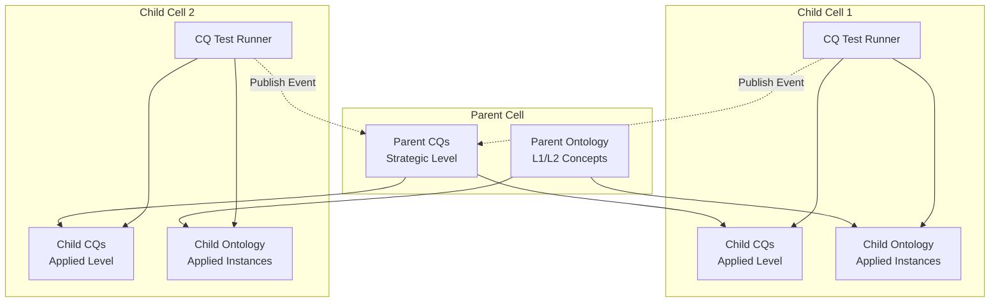
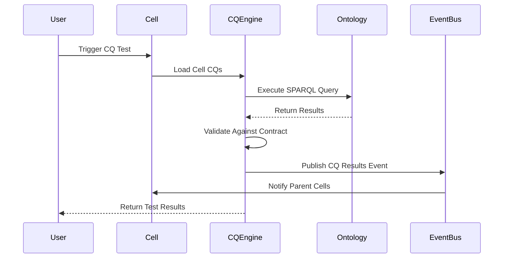
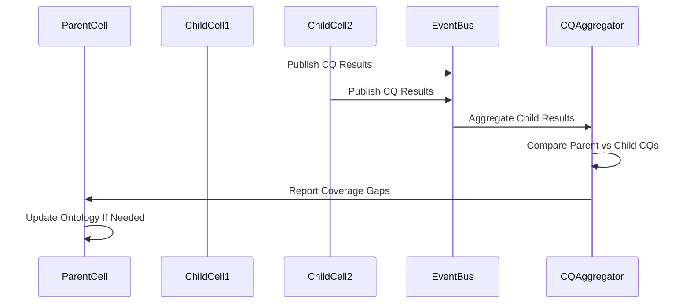

# Enterprise Engineering Integration Plan: Gruninger's CQ Methodology for ODRAS

**Document Type:** Integration Plan  
**Created:** January 2025  
**Status:** Draft  
**Related Documents:** 
- ODRAS_CELLULAR_ARCHITECTURE.md
- CQMT_WORKBENCH_SPECIFICATION.md
- DOMAIN_CENTRIC_PROJECT_HIERARCHY.md

---

## Executive Summary

This plan integrates **Gruninger's Competency Question (CQ) methodology** from enterprise engineering into ODRAS's **cellular project network architecture** and **Domain-Driven Design (DDD)** approach. The integration enables ontology-driven enterprise engineering where competency questions drive both ontology development and enterprise system design.

### Key Integration Points

1. **Cellular Project Network**: Each Project Cell maintains its own CQ set
2. **Domain-Driven Design**: CQs map to bounded contexts and domain events
3. **Layered Ontology Architecture**: CQs align with Core → L1 → L2 → Applied layers
4. **Event-Driven Communication**: CQ results published as events between cells
5. **Test-Driven Development**: CQs serve as executable specifications for ontologies

---

## Gruninger's CQ Methodology Overview

### Core Principles

**Gruninger and Fox's Approach** uses competency questions as:
- **Requirements**: What questions must the ontology answer?
- **Validation**: How do we know the ontology is correct?
- **Scope Definition**: What concepts and relationships are needed?
- **Testing**: Executable specifications for ontology functionality

### CQ-Driven Development Lifecycle

```
1. Identify Competency Questions
   ↓
2. Formalize in First-Order Logic
   ↓
3. Design Ontology to Answer CQs
   ↓
4. Implement Ontology
   ↓
5. Test CQs Against Ontology
   ↓
6. Iterate Based on CQ Failures
```

### CQ Categories (Enterprise Engineering Focus)

1. **Entity Identification**: "What entities exist in the domain?"
2. **Relationship Discovery**: "How do entities relate?"
3. **Process Validation**: "What processes are involved?"
4. **Constraint Verification**: "What rules must be satisfied?"
5. **Query Execution**: "Can we answer specific business questions?"

---

## Integration Architecture

### 1. Cellular CQ Architecture

Each **Project Cell** becomes a CQ testing context with its own competency questions.



**Key Design Decisions:**

1. **Hierarchical CQ Inheritance**: Child cells inherit parent CQs but add specialized CQs
2. **Cell-Level CQ Execution**: Each cell tests its own CQs independently
3. **Event Publishing**: CQ test results published as events to parent cells
4. **Ontology Scope**: Each cell's CQs test against its layer-appropriate ontology

### 2. DDD Bounded Context Integration

**CQs Define Bounded Contexts:**

```yaml
BoundedContext: RequirementsCell
  UbiquitousLanguage:
    - Requirement: A need or constraint that must be satisfied
    - DerivedRequirement: Requirement generated within this cell
    - AllocatedRequirement: Requirement assigned from parent
  
  CompetencyQuestions:
    - "What requirements must this cell satisfy?"
    - "How do requirements relate to each other?"
    - "What derived requirements does this cell generate?"
    - "Which requirements are allocated from parent cells?"
  
  DomainEvents:
    - RequirementCreated
    - RequirementSatisfied
    - RequirementAllocated
  
  CQTestCoverage:
    entity_identification: true
    relationship_discovery: true
    process_validation: true
    constraint_verification: true
```

**Bounded Context Mapping:**

| DDD Concept | CQ Role | ODRAS Implementation |
|------------|---------|---------------------|
| Bounded Context | CQ Scope | Project Cell |
| Ubiquitous Language | CQ Vocabulary | Ontology Terms |
| Domain Events | CQ Triggers | Event Streams |
| Aggregates | CQ Entities | Ontology Classes |
| Domain Services | CQ Processes | BPMN Workflows |

### 3. Layered Ontology CQ Alignment

**CQs Map to Ontology Layers:**

```yaml
Core_Layer:
  CQs:
    - "What fundamental ontological categories exist?"
    - "What are the primary ontological distinctions?"
  Ontology: BFO base concepts
  Testable: true
  
L1_StrategicLayer:
  CQs:
    - "What processes exist in systems engineering?"
    - "How do requirements relate to processes?"
  Ontology: Systems Engineering concepts
  Inherits: Core CQs
  Testable: true
  
L2_ArchitecturalLayer:
  CQs:
    - "What architectural patterns are defined?"
    - "How do components integrate?"
  Ontology: Architecture-specific concepts
  Inherits: L1 CQs
  Testable: true
  
Applied_Layer:
  CQs:
    - "What actual instances exist?"
    - "What are the concrete values?"
  Ontology: Project-specific individuals
  Inherits: L2 CQs
  Testable: true
```

**CQ Vertical Flow:**

```
Core CQ → L1 CQ → L2 CQ → Applied CQ
```

Each layer's CQs are **extended** (not replaced) by child layers, creating a hierarchical CQ taxonomy.

---

## Data Model Integration

### Enhanced CQ Data Structure

```json
{
  "id": "cq-001",
  "ontology_layer": "L2",
  "bounded_context": "WeaponsIntegrationCell",
  "project_cell_id": "cell-weapons-integration-001",
  
  "natural_language": "What aircraft types can carry which weapon systems?",
  
  "sparql_query": {
    "query": "SELECT ?aircraft ?weapon WHERE { ?aircraft rdf:type :Aircraft ; :canCarry ?weapon . ?weapon rdf:type :WeaponSystem . }",
    "layer_context": "L2"
  },
  
  "validation_contract": {
    "required_columns": ["aircraft", "weapon"],
    "min_rows": 1,
    "performance_max_ms": 5000,
    "business_rules": [
      "aircraft must be certified for weapon type",
      "weapon must be within aircraft capacity"
    ]
  },
  
  "domain_events": {
    "triggers": ["WeaponSystemAdded", "AircraftConfigured"],
    "publishes": ["CQValidated", "CapabilityMismatchDetected"]
  },
  
  "inheritance": {
    "extends_parent_cq": "cq-core-007",
    "parent_cell": "cell-aircraft-architecture-001"
  },
  
  "ddd_context": {
    "aggregate": "WeaponCapability",
    "domain_service": "CapabilityAssessment",
    "value_object": "WeaponCompatibility"
  },
  
  "metadata": {
    "created_by": "user-123",
    "stakeholder": "mission-planner",
    "business_value": "high",
    "priority": "critical"
  }
}
```

### Database Schema Enhancements

```sql
-- Enhanced CQ Table
ALTER TABLE competency_questions ADD COLUMN ontology_layer VARCHAR(10);
ALTER TABLE competency_questions ADD COLUMN bounded_context VARCHAR(255);
ALTER TABLE competency_questions ADD COLUMN project_cell_id UUID REFERENCES project_cells(id);
ALTER TABLE competency_questions ADD COLUMN extends_parent_cq UUID REFERENCES competency_questions(id);
ALTER TABLE competency_questions ADD COLUMN ddd_aggregate VARCHAR(255);
ALTER TABLE competency_questions ADD COLUMN domain_events JSONB;

-- Link CQs to Project Cells
CREATE TABLE project_cell_cqs (
  project_cell_id UUID REFERENCES project_cells(id),
  cq_id UUID REFERENCES competency_questions(id),
  inheritance_type VARCHAR(20), -- 'extends', 'implements', 'tests'
  PRIMARY KEY (project_cell_id, cq_id)
);

-- Link CQs to Domain Events
CREATE TABLE cq_domain_events (
  cq_id UUID REFERENCES competency_questions(id),
  event_type VARCHAR(100),
  trigger_or_publish VARCHAR(10), -- 'trigger' or 'publish'
  PRIMARY KEY (cq_id, event_type, trigger_or_publish)
);
```

---

## Implementation Phases

### Phase 1: Foundation (Weeks 1-2)

**Goal**: Extend CQMT Workbench with enterprise engineering concepts

**Tasks**:
1. Add `ontology_layer` field to CQ data model
2. Add `bounded_context` field to CQ data model
3. Add `project_cell_id` linking to CQs
4. Update CQ UI to show layer and context
5. Add CQ inheritance visualization

**Deliverables**:
- Updated CQMT database schema
- Enhanced CQ creation UI
- CQ layer visualization

### Phase 2: Cellular Integration (Weeks 3-4)

**Goal**: Integrate CQs with Project Cell architecture

**Tasks**:
1. Add CQ test runner to each Project Cell
2. Implement event publishing for CQ test results
3. Create parent-child CQ inheritance mechanism
4. Add shadow cell CQ testing for impact analysis
5. Implement CQ result aggregation across cells

**Deliverables**:
- Cell-level CQ execution service
- Event-driven CQ test publishing
- Parent CQ aggregation dashboard

### Phase 3: DDD Integration (Weeks 5-6)

**Goal**: Map CQs to DDD bounded contexts

**Tasks**:
1. Create bounded context mapping for cells
2. Add DDD metadata to CQs (aggregates, services, value objects)
3. Link CQs to domain events
4. Implement ubiquitous language validation
5. Create bounded context visualization

**Deliverables**:
- Bounded context → CQ mapping
- Domain event → CQ triggers
- Ubiquitous language validator

### Phase 4: Layered Ontology Integration (Weeks 7-8)

**Goal**: Align CQs with layered ontology architecture

**Tasks**:
1. Implement CQ layer inheritance (Core → L1 → L2 → Applied)
2. Add layer-specific CQ templates
3. Create vertical CQ validation (ensure upper layers answer their CQs)
4. Implement CQ layer visualization
5. Add layer-level CQ coverage reporting

**Deliverables**:
- Layer-specific CQ templates
- Vertical CQ validation
- CQ layer coverage metrics

### Phase 5: Enterprise Engineering Patterns (Weeks 9-10)

**Goal**: Add enterprise-specific CQ patterns

**Tasks**:
1. Create enterprise entity CQ templates
2. Add process validation CQ patterns
3. Implement governance CQ templates
4. Add stakeholder-specific CQ views
5. Create enterprise CQ library

**Deliverables**:
- Enterprise CQ template library
- Governance CQ patterns
- Stakeholder CQ dashboards

---

## CQ Execution Flow

### Single Cell CQ Execution



### Multi-Cell CQ Aggregation



---

## CQ Templates for Enterprise Engineering

### Core Layer Templates

```yaml
Core_Entity_Identification:
  template: "What fundamental entities exist in the Core domain?"
  sparql_pattern: "SELECT DISTINCT ?entity WHERE { ?entity rdf:type ?type . }"
  validation: { min_rows: 5 }

Core_Classification:
  template: "How are entities classified in the Core domain?"
  sparql_pattern: "SELECT ?entity ?type WHERE { ?entity rdf:type ?type . }"
  validation: { require_columns: ["entity", "type"] }
```

### L1 Strategic Layer Templates

```yaml
L1_Process_Identification:
  template: "What processes exist in the {domain} domain?"
  sparql_pattern: "SELECT ?process WHERE { ?process rdf:type <L1>:Process . }"
  validation: { min_rows: 1 }

L1_Process_Relationships:
  template: "How do processes relate to each other?"
  sparql_pattern: "SELECT ?process1 ?relation ?process2 WHERE { ?process1 ?relation ?process2 . }"
  validation: { require_columns: ["process1", "relation", "process2"] }
```

### L2 Architectural Layer Templates

```yaml
L2_Component_Identification:
  template: "What components exist in the {architecture}?"
  sparql_pattern: "SELECT ?component WHERE { ?component rdf:type <L2>:Component . }"
  validation: { min_rows: 1 }

L2_Interface_Relationships:
  template: "How do components interface with each other?"
  sparql_pattern: "SELECT ?component1 ?interface ?component2 WHERE { ?component1 ?interface ?component2 . }"
  validation: { require_columns: ["component1", "interface", "component2"] }
```

### Applied Layer Templates

```yaml
Applied_Instance_Retrieval:
  template: "What instances of {concept} exist?"
  sparql_pattern: "SELECT ?instance WHERE { ?instance rdf:type <Applied>:{concept} . }"
  validation: { min_rows: 0 }

Applied_Value_Query:
  template: "What are the values of {property} for {concept}?"
  sparql_pattern: "SELECT ?instance ?value WHERE { ?instance rdf:type <Applied>:{concept} ; <Applied>:{property} ?value . }"
  validation: { require_columns: ["instance", "value"] }
```

---

## Event-Driven CQ Communication

### CQ Event Schema

```json
{
  "event_type": "cq_test_completed",
  "event_version": "1.0",
  "timestamp": "2025-01-15T10:30:00Z",
  
  "cell_context": {
    "cell_id": "cell-weapons-integration-001",
    "cell_type": "Applied",
    "ontology_layer": "L2",
    "bounded_context": "WeaponsIntegration"
  },
  
  "cq_result": {
    "cq_id": "cq-001",
    "natural_language": "What aircraft types can carry which weapon systems?",
    "status": "passed",
    "execution_time_ms": 1250,
    "rows_returned": 15,
    "validations": {
      "required_columns": "passed",
      "min_rows": "passed",
      "performance": "passed",
      "business_rules": "passed"
    }
  },
  
  "ontology_context": {
    "core_version": "BFO_1.0",
    "l1_version": "SE_2.1",
    "l2_version": "WI_3.5",
    "applied_version": "WI_Cell_4.2"
  },
  
  "impact_analysis": {
    "cells_affected": ["cell-mission-planning-001"],
    "reasoning": "Capability data used by mission planning"
  }
}
```

### Event Subscriptions

```yaml
SubscriptionRules:
  - cell_id: parent-cell-001
    subscribes_to: 
      - event_types: ["cq_test_completed"]
        filter: { cell_context.cell_type: ["Applied"] }
    
  - cell_id: reporting-cell-001
    subscribes_to:
      - event_types: ["cq_test_completed"]
        filter: { cq_result.status: ["failed"] }
    
  - cell_id: integration-cell-001
    subscribes_to:
      - event_types: ["cq_test_completed"]
        filter: { cell_context.bounded_context: ["Integration"] }
```

---

## DDD Bounded Context Mapping

### Cell → Bounded Context Mapping

```json
{
  "bounded_context": "RequirementsCell",
  "project_cell_id": "cell-requirements-001",
  
  "ubiquitous_language": {
    "terms": {
      "Requirement": "A need or constraint that must be satisfied",
      "DerivedRequirement": "Requirement generated within this cell",
      "AllocatedRequirement": "Requirement assigned from parent cell",
      "SatisfactionCriteria": "Conditions that indicate requirement satisfaction"
    }
  },
  
  "cq_coverage": {
    "entity_identification": [
      "cq-101: What requirements exist?",
      "cq-102: What derived requirements are generated?"
    ],
    "relationship_discovery": [
      "cq-103: How do requirements relate to processes?",
      "cq-104: What are the parent-child requirement relationships?"
    ],
    "process_validation": [
      "cq-105: What requirements validation processes exist?",
      "cq-106: How are requirements traced?"
    ],
    "constraint_verification": [
      "cq-107: What business rules govern requirements?",
      "cq-108: What are the cardinality constraints?"
    ]
  },
  
  "domain_events": {
    "triggers": ["RequirementCreated", "RequirementSatisfied"],
    "publishes": ["RequirementDerived", "RequirementAllocated"]
  },
  
  "aggregates": {
    "Requirement": {
      "entities": ["Requirement", "SatisfactionCriteria"],
      "value_objects": ["RequirementId", "SatisfactionStatus"],
      "cg_coverage": ["cq-101", "cq-107"]
    }
  }
}
```

---

## Business Value Metrics

### CQ Coverage Metrics

```yaml
EnterpriseCQMetrics:
  ontology_coverage:
    description: "Percentage of ontology elements covered by CQs"
    formula: "covered_elements / total_elements * 100"
    target: ">80%"
  
  layer_coverage:
    description: "CQ coverage by ontology layer"
    layers: ["Core", "L1", "L2", "Applied"]
    target_per_layer: ">75%"
  
  bounded_context_coverage:
    description: "CQ coverage per bounded context"
    per_context: true
    target: ">70%"
  
  cq_pass_rate:
    description: "Percentage of CQs passing validation"
    formula: "passed_cqs / total_cqs * 100"
    target: ">90%"
  
  cross_cell_coverage:
    description: "CQ coverage across cellular network"
    aggregates: ["parent", "child", "peer"]
    target: ">60%"
```

### Success Criteria

- **Phase 1**: CQ layer and context metadata integrated
- **Phase 2**: Cell-level CQ execution working with event publishing
- **Phase 3**: DDD bounded context mapping complete
- **Phase 4**: Layer inheritance and vertical validation working
- **Phase 5**: Enterprise CQ patterns library available

---

## Next Steps

1. **Review and Approve**: Stakeholder review of integration plan
2. **Detailed Design**: Create detailed API specifications
3. **Begin Phase 1**: Start foundation implementation
4. **Iterative Development**: Regular demos and feedback loops
5. **Documentation**: Update CQMT documentation with enterprise patterns

---

## References

- Gruninger, M., & Fox, M. S. (1995). Methodology for the Design and Evaluation of Ontologies.
- ODRAS Cellular Architecture Specification
- CQMT Workbench Specification
- Domain-Driven Design (Evans, 2003)
- Enterprise Ontology Development Best Practices
