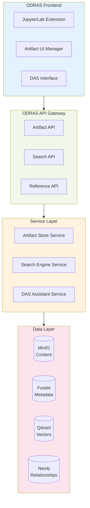
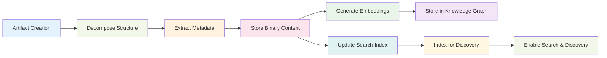

# ODRAS Artifact Management System - Implementation Proposal

## Executive Summary

This document outlines the practical implementation of advanced artifact management capabilities for ODRAS, building on the research presented in `ARTIFACT_MANAGEMENT_RESEARCH.md`. The implementation transforms ODRAS into a comprehensive research platform supporting JupyterLab integration, cross-project artifact sharing, and intelligent DAS-powered discovery.

## 1. System Architecture Overview

### 1.1 Core Components



### 1.2 Data Flow Architecture



## 2. Database Schema Extensions

### 2.1 Fuseki Knowledge Graph Extensions

```turtle
# Extended artifact ontology for ODRAS
@prefix odras: <http://usn/adt/odras/> .
@prefix prov: <http://www.w3.org/ns/prov#> .

# Core Artifact Classes
odras:Artifact a owl:Class ;
    rdfs:label "Research Artifact" ;
    rdfs:comment "Base class for all research artifacts in ODRAS" .

odras:WhitePaper rdfs:subClassOf odras:Artifact .
odras:JupyterNotebook rdfs:subClassOf odras:Artifact .
odras:DataVisualization rdfs:subClassOf odras:Artifact .
odras:Dataset rdfs:subClassOf odras:Artifact .
odras:AnalyticalResult rdfs:subClassOf odras:Artifact .
odras:CodeArtifact rdfs:subClassOf odras:Artifact .

# Notebook-specific classes
odras:NotebookCell a owl:Class .
odras:CodeCell rdfs:subClassOf odras:NotebookCell .
odras:MarkdownCell rdfs:subClassOf odras:NotebookCell .
odras:NotebookOutput a owl:Class .

# Properties
odras:hasCell a owl:ObjectProperty ;
    rdfs:domain odras:JupyterNotebook ;
    rdfs:range odras:NotebookCell .

odras:hasOutput a owl:ObjectProperty ;
    rdfs:domain odras:CodeCell ;
    rdfs:range odras:NotebookOutput .

odras:hasContentUri a owl:DatatypeProperty ;
    rdfs:domain odras:Artifact ;
    rdfs:range xsd:anyURI .

odras:hasEmbeddingId a owl:DatatypeProperty ;
    rdfs:domain odras:Artifact ;
    rdfs:range xsd:string .

odras:hasTag a owl:DatatypeProperty ;
    rdfs:domain odras:Artifact ;
    rdfs:range xsd:string .

odras:hasAccessLevel a owl:DatatypeProperty ;
    rdfs:domain odras:Artifact ;
    rdfs:range xsd:string .

odras:referencedBy a owl:ObjectProperty ;
    rdfs:domain odras:Artifact ;
    rdfs:range odras:Artifact .
```

### 2.2 Neo4j Relationship Schema

```cypher
// Core artifact nodes
CREATE CONSTRAINT artifact_id IF NOT EXISTS FOR (a:Artifact) REQUIRE a.id IS UNIQUE;

// Artifact types
(:Artifact:WhitePaper)
(:Artifact:JupyterNotebook)
(:Artifact:DataVisualization)
(:Artifact:Dataset)
(:Artifact:AnalyticalResult)

// Relationships
(:Artifact)-[:BELONGS_TO_PROJECT]->(:Project)
(:Artifact)-[:CREATED_BY]->(:User)
(:Artifact)-[:DERIVED_FROM]->(:Artifact)
(:Artifact)-[:GENERATED_BY]->(:Analysis)
(:Artifact)-[:REFERENCES]->(:Artifact)
(:Artifact)-[:CONTAINS]->(:NotebookCell)
(:NotebookCell)-[:PRODUCES]->(:NotebookOutput)
(:User)-[:HAS_ACCESS {level: 'read|write|admin'}]->(:Artifact)
```

### 2.3 Qdrant Collections

```python
# Artifact embeddings collection
artifact_embeddings_config = {
    "vectors": {
        "size": 384,  # Using all-MiniLM-L6-v2 embeddings
        "distance": "Cosine"
    }
}

# Multi-modal artifact collection for different content types
notebook_embeddings_config = {
    "vectors": {
        "content": {"size": 384, "distance": "Cosine"},  # Full content embedding
        "code": {"size": 384, "distance": "Cosine"},     # Code-only embedding
        "markdown": {"size": 384, "distance": "Cosine"}  # Documentation embedding
    }
}
```

## 3. API Specifications

### 3.1 Artifact Storage API

```python
# FastAPI endpoint definitions
from fastapi import FastAPI, File, UploadFile, Depends
from pydantic import BaseModel
from typing import List, Optional, Dict, Any

class ArtifactMetadata(BaseModel):
    title: str
    description: Optional[str] = None
    tags: List[str] = []
    artifact_type: str  # whitepaper, notebook, visualization, dataset
    project_id: str
    access_level: str = "private"  # private, project, public

class ArtifactReference(BaseModel):
    id: str
    title: str
    type: str
    project: str
    creator: str
    created_at: str
    access_permissions: List[str]

class SearchQuery(BaseModel):
    query: str
    artifact_types: Optional[List[str]] = None
    projects: Optional[List[str]] = None
    tags: Optional[List[str]] = None
    limit: int = 20

@app.post("/api/artifacts/", response_model=str)
async def create_artifact(
    metadata: ArtifactMetadata,
    file: UploadFile = File(...),
    current_user: User = Depends(get_current_user)
):
    """Store a new artifact with metadata"""
    pass

@app.get("/api/artifacts/search", response_model=List[ArtifactReference])
async def search_artifacts(
    query: SearchQuery,
    current_user: User = Depends(get_current_user)
):
    """Search for artifacts using hybrid semantic + metadata search"""
    pass

@app.get("/api/artifacts/{artifact_id}/content")
async def get_artifact_content(
    artifact_id: str,
    current_user: User = Depends(get_current_user)
):
    """Retrieve artifact content with permission checking"""
    pass

@app.post("/api/artifacts/{artifact_id}/reference")
async def create_reference(
    artifact_id: str,
    reference_context: Dict[str, Any],
    current_user: User = Depends(get_current_user)
):
    """Create a reference to an artifact for insertion in documents"""
    pass
```

### 3.2 JupyterLab Integration API

```python
@app.post("/api/notebooks/decompose")
async def decompose_notebook(
    notebook_file: UploadFile,
    project_id: str,
    current_user: User = Depends(get_current_user)
):
    """Decompose notebook into knowledge graph triples"""
    pass

@app.get("/api/notebooks/{notebook_id}/cells")
async def get_notebook_cells(
    notebook_id: str,
    current_user: User = Depends(get_current_user)
):
    """Get structured notebook cell information"""
    pass

@app.post("/api/notebooks/execute-reference")
async def execute_reference_command(
    command: str,  # e.g., "/reference external_data_1"
    context: Dict[str, Any],
    current_user: User = Depends(get_current_user)
):
    """Process reference commands from JupyterLab"""
    pass
```

## 4. Service Implementation Details

### 4.1 Artifact Storage Service

```python
import asyncio
import json
import uuid
from datetime import datetime
from typing import List, Dict, Any, Optional
from sentence_transformers import SentenceTransformer

class ArtifactStorageService:
    def __init__(self, minio_client, fuseki_client, qdrant_client, neo4j_driver):
        self.minio = minio_client
        self.fuseki = fuseki_client
        self.qdrant = qdrant_client
        self.neo4j = neo4j_driver
        self.embedder = SentenceTransformer('all-MiniLM-L6-v2')

    async def store_artifact(self,
                           content: bytes,
                           metadata: ArtifactMetadata,
                           user_id: str) -> str:
        """Store artifact with full metadata extraction and indexing"""

        artifact_id = str(uuid.uuid4())
        timestamp = datetime.utcnow().isoformat()

        try:
            # 1. Store content in MinIO
            content_uri = await self._store_content(artifact_id, content, metadata)

            # 2. Extract metadata based on artifact type
            extracted_metadata = await self._extract_metadata(content, metadata)

            # 3. Generate embeddings
            embedding = await self._generate_embedding(extracted_metadata)

            # 4. Store in knowledge graph (Fuseki)
            await self._store_in_knowledge_graph(
                artifact_id, metadata, extracted_metadata, content_uri, user_id, timestamp
            )

            # 5. Store in Neo4j for relationship queries
            await self._store_in_neo4j(artifact_id, metadata, user_id, timestamp)

            # 6. Index in Qdrant for search
            await self._index_in_qdrant(artifact_id, embedding, metadata, extracted_metadata)

            return artifact_id

        except Exception as e:
            # Cleanup on failure
            await self._cleanup_failed_storage(artifact_id)
            raise e

    async def _extract_metadata(self, content: bytes, metadata: ArtifactMetadata) -> Dict[str, Any]:
        """Extract structured metadata based on artifact type"""

        if metadata.artifact_type == "notebook":
            return await self._extract_notebook_metadata(content)
        elif metadata.artifact_type == "whitepaper":
            return await self._extract_document_metadata(content)
        elif metadata.artifact_type == "dataset":
            return await self._extract_dataset_metadata(content)
        else:
            return {}

    async def _extract_notebook_metadata(self, content: bytes) -> Dict[str, Any]:
        """Extract structured information from Jupyter notebooks"""

        try:
            notebook = json.loads(content.decode('utf-8'))
        except:
            return {}

        metadata = {
            "kernel": notebook.get("metadata", {}).get("kernelspec", {}).get("name"),
            "cell_count": len(notebook.get("cells", [])),
            "code_cells": 0,
            "markdown_cells": 0,
            "imports": set(),
            "functions": [],
            "variables": set(),
            "outputs": []
        }

        for cell in notebook.get("cells", []):
            if cell["cell_type"] == "code":
                metadata["code_cells"] += 1
                # Extract imports, functions, variables from code
                await self._analyze_code_cell(cell, metadata)
            elif cell["cell_type"] == "markdown":
                metadata["markdown_cells"] += 1

        # Convert sets to lists for JSON serialization
        metadata["imports"] = list(metadata["imports"])
        metadata["variables"] = list(metadata["variables"])

        return metadata

    async def _analyze_code_cell(self, cell: Dict[str, Any], metadata: Dict[str, Any]):
        """Analyze code cell content for imports, functions, variables"""

        source = cell.get("source", "")
        if isinstance(source, list):
            source = "".join(source)

        # Simple regex-based extraction (could be enhanced with AST parsing)
        import re

        # Extract imports
        import_matches = re.findall(r'^\s*(?:import|from)\s+([^\s]+)', source, re.MULTILINE)
        metadata["imports"].update(import_matches)

        # Extract function definitions
        func_matches = re.findall(r'^\s*def\s+(\w+)', source, re.MULTILINE)
        metadata["functions"].extend(func_matches)

        # Extract variable assignments (basic)
        var_matches = re.findall(r'^\s*(\w+)\s*=', source, re.MULTILINE)
        metadata["variables"].update(var_matches)

        # Extract outputs if present
        if "outputs" in cell:
            for output in cell["outputs"]:
                if output.get("output_type") == "display_data":
                    metadata["outputs"].append({
                        "type": "visualization",
                        "data_types": list(output.get("data", {}).keys())
                    })
```

### 4.2 Search Engine Service

```python
class SearchEngineService:
    def __init__(self, qdrant_client, fuseki_client, neo4j_driver):
        self.qdrant = qdrant_client
        self.fuseki = fuseki_client
        self.neo4j = neo4j_driver
        self.embedder = SentenceTransformer('all-MiniLM-L6-v2')

    async def semantic_search(self,
                            query: str,
                            user_id: str,
                            filters: Optional[Dict[str, Any]] = None,
                            limit: int = 20) -> List[Dict[str, Any]]:
        """Perform hybrid semantic + metadata search"""

        # 1. Generate query embedding
        query_embedding = self.embedder.encode(query).tolist()

        # 2. Build Qdrant filter
        qdrant_filter = self._build_qdrant_filter(filters, user_id)

        # 3. Perform vector search
        vector_results = await self.qdrant.search(
            collection_name="artifact_embeddings",
            query_vector=query_embedding,
            query_filter=qdrant_filter,
            limit=limit * 2,  # Get more results for re-ranking
            with_payload=True
        )

        # 4. Enhance with graph relationships
        enhanced_results = await self._enhance_with_relationships(vector_results)

        # 5. Re-rank based on context and relationships
        ranked_results = await self._rank_results(enhanced_results, query, user_id)

        return ranked_results[:limit]

    async def _enhance_with_relationships(self,
                                       vector_results: List[Dict[str, Any]]) -> List[Dict[str, Any]]:
        """Enhance search results with graph relationship data"""

        enhanced = []
        for result in vector_results:
            artifact_id = result.id

            # Get relationships from Neo4j
            with self.neo4j.session() as session:
                relationships = session.run("""
                    MATCH (a:Artifact {id: $artifact_id})
                    OPTIONAL MATCH (a)-[r1:REFERENCES]->(referenced:Artifact)
                    OPTIONAL MATCH (a)-[r2:DERIVED_FROM]->(derived:Artifact)
                    OPTIONAL MATCH (a)-[r3:BELONGS_TO_PROJECT]->(p:Project)
                    OPTIONAL MATCH (a)-[r4:CREATED_BY]->(u:User)
                    RETURN a,
                           collect(DISTINCT {type: 'references', target: referenced.id, title: referenced.title}) as references,
                           collect(DISTINCT {type: 'derived_from', target: derived.id, title: derived.title}) as derived_from,
                           p.name as project_name,
                           u.username as creator
                """, artifact_id=artifact_id).single()

            result_dict = {
                "id": artifact_id,
                "score": result.score,
                "payload": result.payload,
                "relationships": {
                    "references": relationships["references"],
                    "derived_from": relationships["derived_from"],
                    "project": relationships["project_name"],
                    "creator": relationships["creator"]
                }
            }

            enhanced.append(result_dict)

        return enhanced

    async def contextual_suggestions(self,
                                   current_context: Dict[str, Any],
                                   user_id: str,
                                   limit: int = 5) -> List[Dict[str, Any]]:
        """Suggest relevant artifacts based on current work context"""

        suggestions = []

        # 1. Extract key concepts from current context
        concepts = await self._extract_concepts(current_context)

        # 2. Search for each concept
        for concept in concepts:
            results = await self.semantic_search(
                query=concept,
                user_id=user_id,
                limit=3
            )
            suggestions.extend(results)

        # 3. Look for recently used artifacts in same project
        if "project_id" in current_context:
            recent_artifacts = await self._get_recent_project_artifacts(
                current_context["project_id"],
                user_id,
                limit=3
            )
            suggestions.extend(recent_artifacts)

        # 4. Deduplicate and rank
        unique_suggestions = self._deduplicate_by_id(suggestions)
        ranked_suggestions = await self._rank_suggestions(unique_suggestions, current_context)

        return ranked_suggestions[:limit]
```

### 4.3 DAS Integration Service

```python
class DASArtifactAssistant:
    def __init__(self, search_service, storage_service, reference_service):
        self.search = search_service
        self.storage = storage_service
        self.reference = reference_service

    async def process_artifact_request(self,
                                     message: str,
                                     context: Dict[str, Any],
                                     user_id: str) -> Dict[str, Any]:
        """Process natural language artifact requests from DAS"""

        # Parse the request to understand intent
        intent = await self._classify_intent(message)

        if intent["type"] == "search":
            return await self._handle_search_request(intent, context, user_id)
        elif intent["type"] == "reference":
            return await self._handle_reference_request(intent, context, user_id)
        elif intent["type"] == "suggest":
            return await self._handle_suggestion_request(intent, context, user_id)
        elif intent["type"] == "create":
            return await self._handle_creation_request(intent, context, user_id)
        else:
            return {"type": "error", "message": "I don't understand that request"}

    async def _handle_search_request(self,
                                   intent: Dict[str, Any],
                                   context: Dict[str, Any],
                                   user_id: str) -> Dict[str, Any]:
        """Handle artifact search requests"""

        search_query = intent.get("query", "")
        filters = intent.get("filters", {})

        results = await self.search.semantic_search(
            query=search_query,
            user_id=user_id,
            filters=filters,
            limit=10
        )

        if not results:
            # Suggest similar artifacts or alternative searches
            suggestions = await self.search.contextual_suggestions(context, user_id)
            return {
                "type": "no_results",
                "message": "No matching artifacts found. Here are some related items:",
                "suggestions": suggestions
            }

        return {
            "type": "search_results",
            "results": results,
            "message": f"Found {len(results)} matching artifacts"
        }

    async def _handle_reference_request(self,
                                      intent: Dict[str, Any],
                                      context: Dict[str, Any],
                                      user_id: str) -> Dict[str, Any]:
        """Handle artifact reference creation requests"""

        artifact_id = intent.get("artifact_id")
        reference_type = intent.get("reference_type", "inline")

        if not artifact_id:
            # Try to find artifact from description
            description = intent.get("description", "")
            search_results = await self.search.semantic_search(
                query=description,
                user_id=user_id,
                limit=3
            )

            if len(search_results) == 1:
                artifact_id = search_results[0]["id"]
            else:
                return {
                    "type": "disambiguation",
                    "message": "Multiple artifacts match that description. Which one?",
                    "options": search_results
                }

        # Create the reference
        reference = await self.reference.create_reference(
            artifact_id=artifact_id,
            reference_type=reference_type,
            context=context,
            user_id=user_id
        )

        return {
            "type": "reference_created",
            "reference": reference,
            "message": f"Created reference to {reference['title']}"
        }
```

## 5. JupyterLab Extension Implementation

### 5.1 Extension Structure

```
odras-jupyterlab-extension/
├── package.json
├── src/
│   ├── index.ts                 # Extension entry point
│   ├── widgets/
│   │   ├── ArtifactSearchWidget.ts
│   │   ├── ReferenceDialog.ts
│   │   └── ProjectBrowser.ts
│   ├── commands/
│   │   ├── insertReference.ts
│   │   ├── saveToODRAS.ts
│   │   └── searchArtifacts.ts
│   └── services/
│       ├── ODRASClient.ts
│       └── NotebookAnalyzer.ts
├── style/
│   └── index.css
└── schema/
    └── plugin.json
```

### 5.2 Core Extension Implementation

```typescript
// src/index.ts - Main extension entry point
import {
  JupyterFrontEnd,
  JupyterFrontEndPlugin
} from '@jupyterlab/application';
import { ICommandPalette } from '@jupyterlab/apputils';
import { INotebookTracker } from '@jupyterlab/notebook';
import { ArtifactSearchWidget } from './widgets/ArtifactSearchWidget';
import { ODRASClient } from './services/ODRASClient';

const plugin: JupyterFrontEndPlugin<void> = {
  id: 'odras-artifacts:plugin',
  autoStart: true,
  requires: [ICommandPalette, INotebookTracker],
  activate: (
    app: JupyterFrontEnd,
    palette: ICommandPalette,
    notebooks: INotebookTracker
  ) => {
    console.log('ODRAS Artifact Management extension is activated!');

    // Initialize ODRAS client
    const odrasClient = new ODRASClient();

    // Create artifact search widget
    const searchWidget = new ArtifactSearchWidget(odrasClient);
    searchWidget.id = 'odras-artifact-search';
    searchWidget.title.label = 'ODRAS Artifacts';

    // Add widget to left sidebar
    app.shell.add(searchWidget, 'left', { rank: 200 });

    // Register commands
    const insertReferenceCommand = 'odras:insert-reference';
    app.commands.addCommand(insertReferenceCommand, {
      label: 'Insert ODRAS Reference',
      execute: async () => {
        const current = notebooks.currentWidget;
        if (current) {
          await insertReference(current, odrasClient);
        }
      }
    });

    const saveToODRASCommand = 'odras:save-notebook';
    app.commands.addCommand(saveToODRASCommand, {
      label: 'Save to ODRAS',
      execute: async () => {
        const current = notebooks.currentWidget;
        if (current) {
          await saveNotebookToODRAS(current, odrasClient);
        }
      }
    });

    // Add commands to palette
    palette.addItem({ command: insertReferenceCommand, category: 'ODRAS' });
    palette.addItem({ command: saveToODRASCommand, category: 'ODRAS' });

    // Auto-save hook
    notebooks.widgetAdded.connect((sender, widget) => {
      widget.context.fileChanged.connect(async () => {
        if (widget.context.model.dirty === false) {
          // Notebook was saved, sync with ODRAS
          await syncWithODRAS(widget, odrasClient);
        }
      });
    });
  }
};

export default plugin;
```

### 5.3 Artifact Search Widget

```typescript
// src/widgets/ArtifactSearchWidget.ts
import { Widget } from '@lumino/widgets';
import { ODRASClient, ArtifactSearchResult } from '../services/ODRASClient';

export class ArtifactSearchWidget extends Widget {
  private odrasClient: ODRASClient;
  private searchInput: HTMLInputElement;
  private resultsContainer: HTMLDivElement;
  private filterContainer: HTMLDivElement;

  constructor(odrasClient: ODRASClient) {
    super();
    this.odrasClient = odrasClient;
    this.addClass('odras-artifact-search');
    this.buildUI();
    this.attachEventListeners();
  }

  private buildUI(): void {
    this.node.innerHTML = `
      <div class="odras-search-header">
        <h3>ODRAS Artifacts</h3>
        <input type="text" class="search-input" placeholder="Search artifacts...">
      </div>

      <div class="filter-container">
        <select class="type-filter">
          <option value="">All Types</option>
          <option value="notebook">Notebooks</option>
          <option value="whitepaper">White Papers</option>
          <option value="visualization">Visualizations</option>
          <option value="dataset">Datasets</option>
        </select>

        <select class="project-filter">
          <option value="">All Projects</option>
        </select>
      </div>

      <div class="results-container">
        <div class="empty-state">
          <p>Search for artifacts to see results</p>
        </div>
      </div>
    `;

    this.searchInput = this.node.querySelector('.search-input') as HTMLInputElement;
    this.resultsContainer = this.node.querySelector('.results-container') as HTMLDivElement;
    this.filterContainer = this.node.querySelector('.filter-container') as HTMLDivElement;
  }

  private attachEventListeners(): void {
    // Debounced search
    let searchTimeout: NodeJS.Timeout;
    this.searchInput.addEventListener('input', () => {
      clearTimeout(searchTimeout);
      searchTimeout = setTimeout(() => {
        this.performSearch();
      }, 300);
    });

    // Filter changes
    const typeFilter = this.node.querySelector('.type-filter') as HTMLSelectElement;
    const projectFilter = this.node.querySelector('.project-filter') as HTMLSelectElement;

    typeFilter.addEventListener('change', () => this.performSearch());
    projectFilter.addEventListener('change', () => this.performSearch());
  }

  private async performSearch(): Promise<void> {
    const query = this.searchInput.value.trim();
    if (!query) {
      this.showEmptyState();
      return;
    }

    this.showLoadingState();

    try {
      const filters = this.getActiveFilters();
      const results = await this.odrasClient.searchArtifacts(query, filters);
      this.displayResults(results);
    } catch (error) {
      this.showErrorState(error.message);
    }
  }

  private displayResults(results: ArtifactSearchResult[]): void {
    if (results.length === 0) {
      this.resultsContainer.innerHTML = '<div class="no-results">No artifacts found</div>';
      return;
    }

    const resultsHTML = results.map(result => `
      <div class="artifact-result" data-id="${result.id}">
        <div class="artifact-header">
          <h4 class="artifact-title">${result.title}</h4>
          <span class="artifact-type">${result.type}</span>
        </div>
        <div class="artifact-meta">
          <span class="project">${result.project}</span>
          <span class="creator">${result.creator}</span>
          <span class="date">${new Date(result.created_at).toLocaleDateString()}</span>
        </div>
        <div class="artifact-description">${result.description || 'No description'}</div>
        <div class="artifact-actions">
          <button class="btn-reference" data-id="${result.id}">Insert Reference</button>
          <button class="btn-view" data-id="${result.id}">View Details</button>
        </div>
      </div>
    `).join('');

    this.resultsContainer.innerHTML = resultsHTML;

    // Attach click handlers
    this.resultsContainer.querySelectorAll('.btn-reference').forEach(btn => {
      btn.addEventListener('click', (e) => {
        const artifactId = (e.target as HTMLElement).dataset.id;
        this.insertArtifactReference(artifactId);
      });
    });
  }

  private async insertArtifactReference(artifactId: string): Promise<void> {
    try {
      const reference = await this.odrasClient.createReference(artifactId);
      // Insert into current notebook cell
      this.insertReferenceIntoNotebook(reference);
    } catch (error) {
      console.error('Failed to insert reference:', error);
    }
  }
}
```

## 6. Reference System Implementation

### 6.1 Reference Command Processor

```python
import re
from typing import Dict, Any, Optional, List
from dataclasses import dataclass

@dataclass
class ReferenceCommand:
    command_type: str  # 'reference', 'insert', 'cite'
    artifact_identifier: str
    options: Dict[str, Any]
    context: Dict[str, Any]

class ReferenceCommandProcessor:
    def __init__(self, artifact_service, search_service):
        self.artifact_service = artifact_service
        self.search_service = search_service

        # Command patterns
        self.patterns = {
            'reference': re.compile(r'/reference\s+(\w+)(?:\s+(.*))?'),
            'insert': re.compile(r'/insert\s+(\w+)(?:\s+(.*))?'),
            'cite': re.compile(r'/cite\s+(\w+)(?:\s+(.*))?'),
        }

    async def process_command(self,
                            command_text: str,
                            context: Dict[str, Any],
                            user_id: str) -> Dict[str, Any]:
        """Process a reference command from JupyterLab or document editor"""

        # Parse command
        parsed_command = self.parse_command(command_text)
        if not parsed_command:
            return {"error": "Invalid command format"}

        # Resolve artifact
        artifact = await self.resolve_artifact(
            parsed_command.artifact_identifier,
            context,
            user_id
        )

        if not artifact:
            # Try fuzzy search
            suggestions = await self.search_service.semantic_search(
                query=parsed_command.artifact_identifier,
                user_id=user_id,
                limit=5
            )
            return {
                "type": "disambiguation",
                "message": f"Artifact '{parsed_command.artifact_identifier}' not found",
                "suggestions": suggestions
            }

        # Generate appropriate reference
        if parsed_command.command_type == "reference":
            return await self.create_inline_reference(artifact, parsed_command.options)
        elif parsed_command.command_type == "insert":
            return await self.create_content_insertion(artifact, parsed_command.options)
        elif parsed_command.command_type == "cite":
            return await self.create_citation(artifact, parsed_command.options)

    def parse_command(self, command_text: str) -> Optional[ReferenceCommand]:
        """Parse reference command text"""

        for command_type, pattern in self.patterns.items():
            match = pattern.match(command_text.strip())
            if match:
                identifier = match.group(1)
                options_text = match.group(2) if match.lastindex > 1 else ""
                options = self.parse_options(options_text)

                return ReferenceCommand(
                    command_type=command_type,
                    artifact_identifier=identifier,
                    options=options,
                    context={}
                )

        return None

    async def create_inline_reference(self,
                                    artifact: Dict[str, Any],
                                    options: Dict[str, Any]) -> Dict[str, Any]:
        """Create an inline reference to an artifact"""

        reference_format = options.get('format', 'link')

        if reference_format == 'link':
            return {
                "type": "reference",
                "content": f"[{artifact['title']}](odras://artifact/{artifact['id']})",
                "metadata": {
                    "artifact_id": artifact['id'],
                    "title": artifact['title'],
                    "type": artifact['type'],
                    "project": artifact['project']
                }
            }
        elif reference_format == 'embed':
            # For visualizations or small content
            if artifact['type'] == 'visualization':
                return {
                    "type": "embedded_content",
                    "content": await self.get_artifact_embed_code(artifact['id']),
                    "metadata": artifact
                }

        return {"error": "Unsupported reference format"}

    async def create_content_insertion(self,
                                     artifact: Dict[str, Any],
                                     options: Dict[str, Any]) -> Dict[str, Any]:
        """Insert actual artifact content"""

        insertion_type = options.get('type', 'full')

        if artifact['type'] == 'notebook':
            if insertion_type == 'code_only':
                code_cells = await self.extract_notebook_code(artifact['id'])
                return {
                    "type": "code_insertion",
                    "content": code_cells,
                    "metadata": artifact
                }
            elif insertion_type == 'specific_cell':
                cell_index = options.get('cell', 0)
                cell_content = await self.get_notebook_cell(artifact['id'], cell_index)
                return {
                    "type": "cell_insertion",
                    "content": cell_content,
                    "metadata": artifact
                }

        elif artifact['type'] == 'visualization':
            return {
                "type": "visualization_insertion",
                "content": await self.get_visualization_embed(artifact['id']),
                "metadata": artifact
            }

        return {"error": "Unsupported insertion type"}
```

## 7. Deployment and Configuration

### 7.1 Docker Integration

```yaml
# docker-compose.yml additions
version: '3.8'
services:
  odras-api:
    # ... existing configuration
    environment:
      # ... existing environment
      - ARTIFACT_STORAGE_ENABLED=true
      - MINIO_ARTIFACTS_BUCKET=artifacts
      - QDRANT_ARTIFACTS_COLLECTION=artifact_embeddings
    volumes:
      # ... existing volumes
      - ./artifacts:/app/artifacts
    depends_on:
      # ... existing dependencies
      - artifact-processor

  artifact-processor:
    build:
      context: ./services/artifact-processor
      dockerfile: Dockerfile
    environment:
      - MINIO_URL=http://minio:9000
      - MINIO_ACCESS_KEY=${MINIO_ACCESS_KEY}
      - MINIO_SECRET_KEY=${MINIO_SECRET_KEY}
      - FUSEKI_URL=http://fuseki:3030
      - QDRANT_URL=http://qdrant:6333
    depends_on:
      - minio
      - fuseki
      - qdrant

  jupyterlab:
    image: jupyter/scipy-notebook:latest
    ports:
      - "8888:8888"
    environment:
      - JUPYTER_TOKEN=odras-token
      - ODRAS_API_URL=http://odras-api:8000
    volumes:
      - ./notebooks:/home/jovyan/work
      - ./jupyterlab-extensions:/opt/conda/share/jupyter/lab/extensions
    command: >
      bash -c "
        pip install /opt/conda/share/jupyter/lab/extensions/odras-jupyterlab-extension &&
        jupyter lab --ip=0.0.0.0 --port=8888 --no-browser --allow-root
      "
```

### 7.2 ODRAS Configuration Updates

```bash
# odras.sh additions for artifact management

init-artifacts() {
    log_info "Initializing artifact management system..."

    # Create MinIO buckets
    docker exec odras-minio mc mb minio/artifacts 2>/dev/null || true
    docker exec odras-minio mc policy set public minio/artifacts

    # Create Qdrant collections
    curl -X PUT "http://localhost:6333/collections/artifact_embeddings" \
        -H 'Content-Type: application/json' \
        -d '{
            "vectors": {
                "size": 384,
                "distance": "Cosine"
            }
        }'

    # Initialize artifact ontology in Fuseki
    curl -X POST "http://localhost:3030/odras/update" \
        -H 'Content-Type: application/sparql-update' \
        -d @backend/ontologies/artifact-ontology.ttl

    log_success "Artifact management system initialized"
}

start-jupyterlab() {
    log_info "Starting JupyterLab with ODRAS integration..."
    docker-compose up -d jupyterlab
    log_success "JupyterLab available at http://localhost:8888 (token: odras-token)"
}
```

## 8. Testing Strategy

### 8.1 Unit Tests

```python
# tests/test_artifact_storage.py
import pytest
from unittest.mock import Mock, AsyncMock
from services.artifact_storage import ArtifactStorageService

class TestArtifactStorageService:

    @pytest.fixture
    def service(self):
        minio_mock = AsyncMock()
        fuseki_mock = AsyncMock()
        qdrant_mock = AsyncMock()
        neo4j_mock = Mock()

        return ArtifactStorageService(
            minio_mock, fuseki_mock, qdrant_mock, neo4j_mock
        )

    @pytest.mark.asyncio
    async def test_store_notebook_artifact(self, service):
        # Test data
        notebook_content = b'{"cells": []}'
        metadata = ArtifactMetadata(
            title="Test Notebook",
            artifact_type="notebook",
            project_id="test_project"
        )

        # Mock responses
        service.minio.put_object = AsyncMock(return_value="minio://artifacts/123")
        service._generate_embedding = AsyncMock(return_value=[0.1, 0.2, 0.3])

        # Execute
        artifact_id = await service.store_artifact(notebook_content, metadata, "user123")

        # Verify
        assert artifact_id is not None
        service.minio.put_object.assert_called_once()
        service.qdrant.upsert.assert_called_once()
```

### 8.2 Integration Tests

```python
# tests/integration/test_artifact_workflow.py
import pytest
import json
from httpx import AsyncClient
from main import app

class TestArtifactWorkflow:

    @pytest.mark.asyncio
    async def test_complete_artifact_workflow(self):
        async with AsyncClient(app=app, base_url="http://test") as client:

            # 1. Upload a notebook
            notebook_data = {
                "cells": [
                    {
                        "cell_type": "code",
                        "source": ["import pandas as pd\ndf = pd.read_csv('data.csv')"]
                    }
                ]
            }

            response = await client.post(
                "/api/artifacts/",
                data={
                    "metadata": json.dumps({
                        "title": "Data Analysis Notebook",
                        "artifact_type": "notebook",
                        "project_id": "test_project",
                        "tags": ["analysis", "pandas"]
                    })
                },
                files={"file": ("notebook.ipynb", json.dumps(notebook_data), "application/json")}
            )

            assert response.status_code == 200
            artifact_id = response.json()

            # 2. Search for the artifact
            search_response = await client.post(
                "/api/artifacts/search",
                json={
                    "query": "pandas analysis",
                    "artifact_types": ["notebook"]
                }
            )

            assert search_response.status_code == 200
            results = search_response.json()
            assert len(results) > 0
            assert any(r["id"] == artifact_id for r in results)

            # 3. Create a reference
            ref_response = await client.post(
                f"/api/artifacts/{artifact_id}/reference",
                json={
                    "reference_type": "inline",
                    "context": {"document_type": "notebook"}
                }
            )

            assert ref_response.status_code == 200
            reference = ref_response.json()
            assert "content" in reference
```

## 9. Performance and Monitoring

### 9.1 Performance Metrics

```python
# services/monitoring.py
from prometheus_client import Counter, Histogram, Gauge
import time
from functools import wraps

# Metrics definitions
artifact_operations = Counter('odras_artifact_operations_total',
                             'Total artifact operations',
                             ['operation', 'type', 'status'])

artifact_search_duration = Histogram('odras_artifact_search_duration_seconds',
                                    'Time spent on artifact searches',
                                    buckets=[0.1, 0.5, 1.0, 2.0, 5.0])

artifact_storage_size = Gauge('odras_artifact_storage_bytes_total',
                             'Total size of stored artifacts')

def monitor_operation(operation: str, artifact_type: str = "unknown"):
    """Decorator to monitor artifact operations"""
    def decorator(func):
        @wraps(func)
        async def wrapper(*args, **kwargs):
            start_time = time.time()
            status = "success"

            try:
                result = await func(*args, **kwargs)
                return result
            except Exception as e:
                status = "error"
                raise
            finally:
                duration = time.time() - start_time
                artifact_operations.labels(
                    operation=operation,
                    type=artifact_type,
                    status=status
                ).inc()

                if operation == "search":
                    artifact_search_duration.observe(duration)

        return wrapper
    return decorator
```

### 9.2 Health Checks

```python
# api/health.py
from fastapi import APIRouter
from services.artifact_storage import ArtifactStorageService
from services.search_engine import SearchEngineService

router = APIRouter()

@router.get("/health/artifacts")
async def artifact_health_check():
    """Check health of artifact management systems"""

    health_status = {
        "status": "healthy",
        "services": {},
        "timestamp": datetime.utcnow().isoformat()
    }

    # Check MinIO
    try:
        # Simple bucket list operation
        buckets = await minio_client.list_buckets()
        health_status["services"]["minio"] = {
            "status": "healthy",
            "bucket_count": len(buckets)
        }
    except Exception as e:
        health_status["services"]["minio"] = {
            "status": "unhealthy",
            "error": str(e)
        }
        health_status["status"] = "degraded"

    # Check Qdrant
    try:
        collections = await qdrant_client.get_collections()
        health_status["services"]["qdrant"] = {
            "status": "healthy",
            "collections": [c.name for c in collections.collections]
        }
    except Exception as e:
        health_status["services"]["qdrant"] = {
            "status": "unhealthy",
            "error": str(e)
        }
        health_status["status"] = "degraded"

    return health_status
```

## 10. Migration and Rollout Plan

### 10.1 Phase 1: Core Infrastructure (Weeks 1-2)
1. Implement artifact storage service
2. Create database schema extensions
3. Set up MinIO integration
4. Basic API endpoints

### 10.2 Phase 2: Search and Discovery (Weeks 3-4)
1. Implement semantic search
2. Create search API
3. Basic UI for artifact browsing
4. DAS integration foundations

### 10.3 Phase 3: JupyterLab Integration (Weeks 5-6)
1. Develop JupyterLab extension
2. Notebook decomposition service
3. Reference insertion commands
4. Auto-save integration

### 10.4 Phase 4: Advanced Features (Weeks 7-8)
1. Enhanced DAS capabilities
2. Cross-project collaboration
3. Advanced search filters
4. Performance optimizations

### 10.5 Production Deployment (Week 9)
1. Production configuration
2. Load testing
3. User training
4. Gradual rollout

This implementation proposal provides a concrete roadmap for transforming ODRAS into a comprehensive research artifact management platform, leveraging its existing knowledge graph infrastructure while adding powerful new capabilities for modern research workflows.
