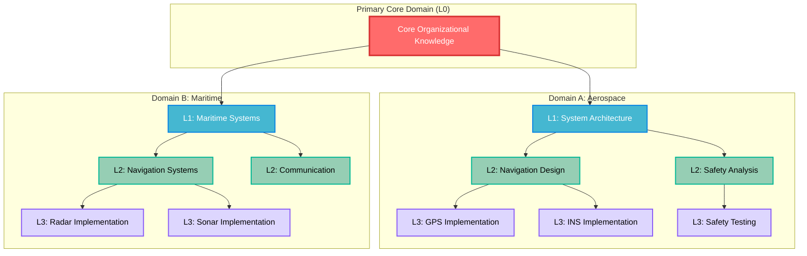
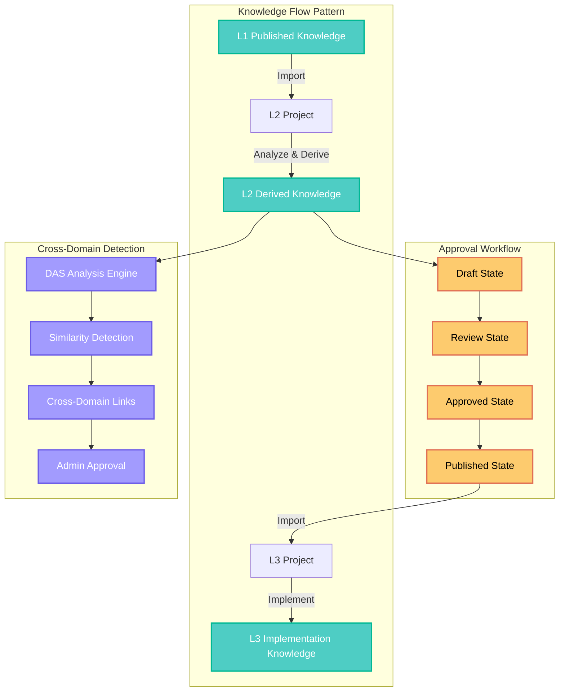
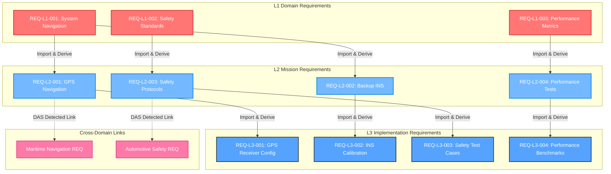
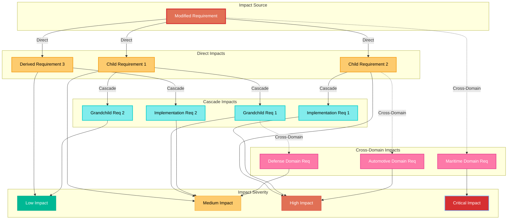
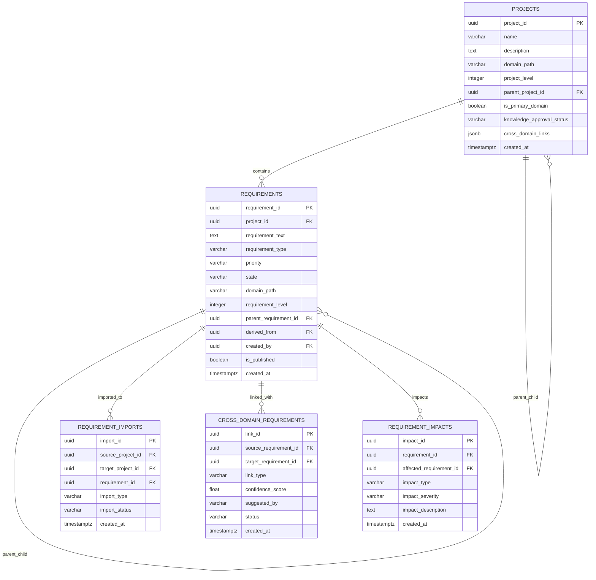
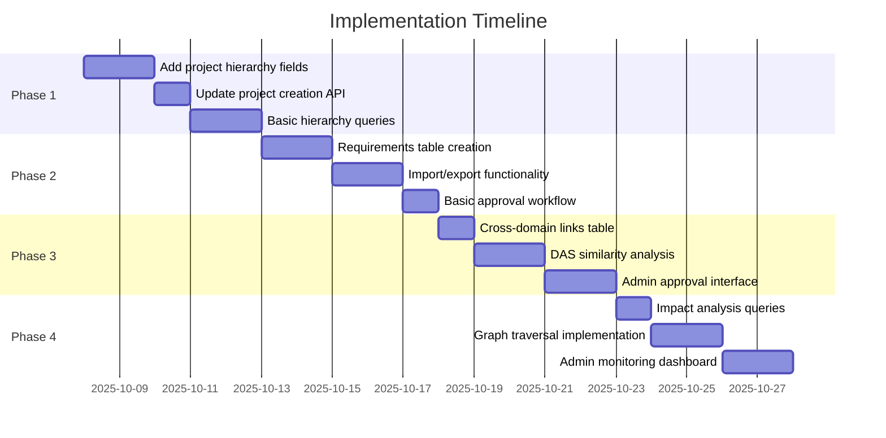
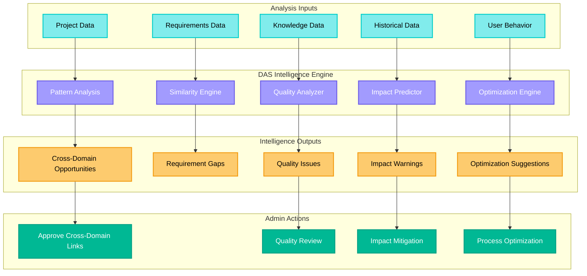

# Domain-Centric Project Hierarchy Design

**Document Type:** Technical Architecture Design
**Created:** October 7, 2025
**Status:** Design Phase
**Related Documents:** ODRAS_Management_Presentation_Summary.md

---

## Executive Summary

This document outlines the design for a domain-centric project hierarchy system in ODRAS that supports vertical project paths within domains, cross-domain knowledge propagation, and intelligent impact analysis. The system enables top-down knowledge and requirements flow with DAS-driven cross-domain link detection and admin-controlled quality gates.

## Core Concept: Vertical Domain Paths

### Domain-Centric Organization



### Project Hierarchy Levels

- **L0 (Core)**: Primary organizational domain with foundational knowledge
- **L1 (Strategic)**: Strategic & Architecture projects within specific domains
- **L2 (Tactical)**: Tactical & Design projects that inherit from L1
- **L3 (Implementation)**: Implementation & Testing projects that inherit from L2

## Knowledge Flow Architecture

### Top-Down Knowledge Propagation



## Requirements Hierarchy System

### Requirements Flow and Derivation



## Cross-Domain Intelligence System

### DAS Cross-Domain Detection

```mermaid
graph TD
    subgraph "Domain A: Aerospace"
        A_PROJ[Aerospace Navigation Project]
        A_REQ[Navigation Requirements]
        A_KNOWLEDGE[Navigation Knowledge]
    end

    subgraph "Domain B: Maritime"
        B_PROJ[Maritime Navigation Project]
        B_REQ[Navigation Requirements]
        B_KNOWLEDGE[Navigation Knowledge]
    end

    subgraph "Domain C: Automotive"
        C_PROJ[Automotive Safety Project]
        C_REQ[Safety Requirements]
        C_KNOWLEDGE[Safety Knowledge]
    end

    subgraph "DAS Analysis Engine"
        SEMANTIC[Semantic Analysis]
        SIMILARITY[Similarity Detection]
        CLASSIFIER[Link Classifier]
        CONFIDENCE[Confidence Scoring]
    end

    subgraph "Cross-Domain Links"
        NAV_LINK[Navigation Link A↔B]
        SAFETY_LINK[Safety Link A↔C]
        MULTI_LINK[Multi-Domain Link]
    end

    subgraph "Admin Approval"
        SUGGESTIONS[Link Suggestions]
        SME_REVIEW[SME Review]
        APPROVED_LINKS[Approved Links]
    end

    A_REQ --> SEMANTIC
    A_KNOWLEDGE --> SEMANTIC
    B_REQ --> SEMANTIC
    B_KNOWLEDGE --> SEMANTIC
    C_REQ --> SEMANTIC
    C_KNOWLEDGE --> SEMANTIC

    SEMANTIC --> SIMILARITY
    SIMILARITY --> CLASSIFIER
    CLASSIFIER --> CONFIDENCE

    CONFIDENCE --> NAV_LINK
    CONFIDENCE --> SAFETY_LINK
    CONFIDENCE --> MULTI_LINK

    NAV_LINK --> SUGGESTIONS
    SAFETY_LINK --> SUGGESTIONS
    MULTI_LINK --> SUGGESTIONS

    SUGGESTIONS --> SME_REVIEW
    SME_REVIEW --> APPROVED_LINKS

    classDef domainStyle fill:#74b9ff,stroke:#0984e3,stroke-width:2px,color:#fff
    classDef dasStyle fill:#a29bfe,stroke:#6c5ce7,stroke-width:2px,color:#fff
    classDef linkStyle fill:#fd79a8,stroke:#e84393,stroke-width:2px,color:#fff
    classDef approvalStyle fill:#00b894,stroke:#00a085,stroke-width:2px,color:#fff

    class A_PROJ,A_REQ,A_KNOWLEDGE,B_PROJ,B_REQ,B_KNOWLEDGE,C_PROJ,C_REQ,C_KNOWLEDGE domainStyle
    class SEMANTIC,SIMILARITY,CLASSIFIER,CONFIDENCE dasStyle
    class NAV_LINK,SAFETY_LINK,MULTI_LINK linkStyle
    class SUGGESTIONS,SME_REVIEW,APPROVED_LINKS approvalStyle
```

## Impact Analysis System

### Requirement Change Impact Graph



## Database Schema Design

### Core Tables Structure



## Implementation Phases

### Phase Timeline



## Admin Monitoring Dashboard

### Dashboard Overview

```mermaid
graph TD
    subgraph "Admin Dashboard"
        OVERVIEW[System Overview]
        DOMAINS[Domain Health]
        APPROVALS[Pending Approvals]
        IMPACTS[Impact Analysis]
        CROSS_DOMAIN[Cross-Domain Links]
    end

    subgraph "System Metrics"
        PROJ_COUNT[Total Projects: 45]
        REQ_COUNT[Total Requirements: 1,247]
        PENDING_COUNT[Pending Approvals: 12]
        CROSS_COUNT[Cross-Domain Suggestions: 8]
        IMPACT_COUNT[High Impact Changes: 3]
    end

    subgraph "Domain Statistics"
        AEROSPACE[Aerospace: 15 projects]
        MARITIME[Maritime: 12 projects]
        AUTOMOTIVE[Automotive: 8 projects]
        DEFENSE[Defense: 10 projects]
    end

    subgraph "Quality Metrics"
        COVERAGE[Requirement Coverage: 87%]
        LINKS[Cross-Domain Links: 23]
        QUALITY[Quality Score: 92%]
    end

    OVERVIEW --> PROJ_COUNT
    OVERVIEW --> REQ_COUNT
    OVERVIEW --> PENDING_COUNT

    DOMAINS --> AEROSPACE
    DOMAINS --> MARITIME
    DOMAINS --> AUTOMOTIVE
    DOMAINS --> DEFENSE

    CROSS_DOMAIN --> COVERAGE
    CROSS_DOMAIN --> LINKS
    CROSS_DOMAIN --> QUALITY

    classDef dashboardStyle fill:#74b9ff,stroke:#0984e3,stroke-width:2px,color:#fff
    classDef metricsStyle fill:#00b894,stroke:#00a085,stroke-width:2px,color:#fff
    classDef domainStyle fill:#fdcb6e,stroke:#f39c12,stroke-width:2px,color:#000
    classDef qualityStyle fill:#a29bfe,stroke:#6c5ce7,stroke-width:2px,color:#fff

    class OVERVIEW,DOMAINS,APPROVALS,IMPACTS,CROSS_DOMAIN dashboardStyle
    class PROJ_COUNT,REQ_COUNT,PENDING_COUNT,CROSS_COUNT,IMPACT_COUNT metricsStyle
    class AEROSPACE,MARITIME,AUTOMOTIVE,DEFENSE domainStyle
    class COVERAGE,LINKS,QUALITY qualityStyle
```



## DAS Intelligence Integration

### DAS Analysis Capabilities



## Database Schema Implementation

### SQL Schema Changes

```sql
-- Add hierarchy fields to existing projects table
ALTER TABLE public.projects
ADD COLUMN IF NOT EXISTS project_level INTEGER DEFAULT 1 CHECK (project_level IN (1, 2, 3)),
ADD COLUMN IF NOT EXISTS parent_project_id UUID REFERENCES public.projects(project_id) ON DELETE CASCADE,
ADD COLUMN IF NOT EXISTS domain_path TEXT,
ADD COLUMN IF NOT EXISTS is_primary_domain BOOLEAN DEFAULT FALSE,
ADD COLUMN IF NOT EXISTS knowledge_approval_status TEXT DEFAULT 'draft' CHECK (knowledge_approval_status IN ('draft', 'review', 'approved', 'published')),
ADD COLUMN IF NOT EXISTS cross_domain_links JSONB DEFAULT '[]';

-- Requirements hierarchy tables
CREATE TABLE IF NOT EXISTS public.requirements (
    requirement_id UUID PRIMARY KEY DEFAULT gen_random_uuid(),
    project_id UUID REFERENCES public.projects(project_id) ON DELETE CASCADE,
    requirement_text TEXT NOT NULL,
    requirement_type TEXT NOT NULL CHECK (requirement_type IN ('functional', 'non_functional', 'performance', 'safety', 'security', 'interface')),
    priority TEXT DEFAULT 'medium' CHECK (priority IN ('low', 'medium', 'high', 'critical')),
    state TEXT DEFAULT 'draft' CHECK (state IN ('draft', 'review', 'approved', 'published', 'deprecated')),
    domain_path TEXT NOT NULL,
    requirement_level INTEGER DEFAULT 1 CHECK (requirement_level IN (1, 2, 3)),
    parent_requirement_id UUID REFERENCES public.requirements(requirement_id) ON DELETE CASCADE,
    derived_from UUID REFERENCES public.requirements(requirement_id),
    created_by UUID REFERENCES public.users(user_id),
    created_at TIMESTAMPTZ DEFAULT NOW(),
    updated_at TIMESTAMPTZ DEFAULT NOW(),
    version INTEGER DEFAULT 1,
    is_published BOOLEAN DEFAULT FALSE
);

-- Requirements import/export relationships
CREATE TABLE IF NOT EXISTS public.requirement_imports (
    import_id UUID PRIMARY KEY DEFAULT gen_random_uuid(),
    source_project_id UUID REFERENCES public.projects(project_id) ON DELETE CASCADE,
    target_project_id UUID REFERENCES public.projects(project_id) ON DELETE CASCADE,
    requirement_id UUID REFERENCES public.requirements(requirement_id) ON DELETE CASCADE,
    import_type TEXT DEFAULT 'inherited' CHECK (import_type IN ('inherited', 'referenced', 'derived')),
    import_status TEXT DEFAULT 'active' CHECK (import_status IN ('active', 'superseded', 'deprecated')),
    created_at TIMESTAMPTZ DEFAULT NOW(),
    UNIQUE(target_project_id, requirement_id)
);

-- Cross-domain requirement links
CREATE TABLE IF NOT EXISTS public.cross_domain_requirements (
    link_id UUID PRIMARY KEY DEFAULT gen_random_uuid(),
    source_requirement_id UUID REFERENCES public.requirements(requirement_id) ON DELETE CASCADE,
    target_requirement_id UUID REFERENCES public.requirements(requirement_id) ON DELETE CASCADE,
    link_type TEXT NOT NULL CHECK (link_type IN ('similar', 'conflicting', 'complementary', 'dependent')),
    confidence_score FLOAT DEFAULT 0.0 CHECK (confidence_score >= 0.0 AND confidence_score <= 1.0),
    suggested_by TEXT DEFAULT 'das' CHECK (suggested_by IN ('das', 'admin', 'sme')),
    status TEXT DEFAULT 'suggested' CHECK (status IN ('suggested', 'approved', 'rejected')),
    created_at TIMESTAMPTZ DEFAULT NOW()
);

-- Requirements impact analysis
CREATE TABLE IF NOT EXISTS public.requirement_impacts (
    impact_id UUID PRIMARY KEY DEFAULT gen_random_uuid(),
    requirement_id UUID REFERENCES public.requirements(requirement_id) ON DELETE CASCADE,
    affected_requirement_id UUID REFERENCES public.requirements(requirement_id) ON DELETE CASCADE,
    impact_type TEXT NOT NULL CHECK (impact_type IN ('direct', 'indirect', 'cascade')),
    impact_severity TEXT DEFAULT 'medium' CHECK (impact_severity IN ('low', 'medium', 'high', 'critical')),
    impact_description TEXT,
    created_at TIMESTAMPTZ DEFAULT NOW()
);

-- Indexes for performance
CREATE INDEX IF NOT EXISTS idx_projects_level ON public.projects(project_level);
CREATE INDEX IF NOT EXISTS idx_projects_parent ON public.projects(parent_project_id);
CREATE INDEX IF NOT EXISTS idx_projects_domain ON public.projects(domain_path);
CREATE INDEX IF NOT EXISTS idx_requirements_project ON public.requirements(project_id);
CREATE INDEX IF NOT EXISTS idx_requirements_domain ON public.requirements(domain_path);
CREATE INDEX IF NOT EXISTS idx_requirements_level ON public.requirements(requirement_level);
CREATE INDEX IF NOT EXISTS idx_requirements_parent ON public.requirements(parent_requirement_id);
CREATE INDEX IF NOT EXISTS idx_requirements_published ON public.requirements(is_published) WHERE is_published = TRUE;
CREATE INDEX IF NOT EXISTS idx_requirement_imports_target ON public.requirement_imports(target_project_id);
CREATE INDEX IF NOT EXISTS idx_cross_domain_requirements_source ON public.cross_domain_requirements(source_requirement_id);

-- Comments for documentation
COMMENT ON COLUMN public.projects.project_level IS 'Project hierarchy level: 1=Strategic, 2=Tactical, 3=Implementation';
COMMENT ON COLUMN public.projects.parent_project_id IS 'Parent project ID for L2/L3 projects';
COMMENT ON COLUMN public.projects.domain_path IS 'Domain path e.g., "aerospace/navigation/autonomous"';
COMMENT ON COLUMN public.projects.is_primary_domain IS 'Whether this is the primary project for a domain';
COMMENT ON COLUMN public.projects.knowledge_approval_status IS 'Approval status for knowledge publishing';
COMMENT ON COLUMN public.projects.cross_domain_links IS 'JSON array of approved cross-domain links';
```

## API Implementation Examples

### Project Creation with Hierarchy

```python
# Backend API endpoint update
@app.post("/api/projects")
async def create_project(body: Dict, user=Depends(get_user)):
    name = (body.get("name") or "").strip()
    namespace_id = body.get("namespace_id")
    domain = body.get("domain")
    project_level = body.get("project_level", 1)  # Default to L1
    parent_project_id = body.get("parent_project_id")  # Optional for L2/L3
    domain_path = body.get("domain_path", domain)  # Use domain as default path

    # Validation logic for hierarchy
    if project_level > 1 and not parent_project_id:
        raise HTTPException(status_code=400, detail="L2/L3 projects require parent_project_id")

    if project_level == 1 and parent_project_id:
        raise HTTPException(status_code=400, detail="L1 projects cannot have parent")

    # Validate parent project exists and is at correct level
    if parent_project_id:
        parent_project = db.get_project(parent_project_id)
        if not parent_project:
            raise HTTPException(status_code=400, detail="Parent project not found")
        if parent_project['project_level'] >= project_level:
            raise HTTPException(status_code=400, detail="Parent project must be at higher level")

    # Create project with hierarchy
    proj = db.create_project_with_hierarchy(
        name=name,
        owner_user_id=user["user_id"],
        description=body.get("description"),
        namespace_id=namespace_id,
        domain=domain,
        project_level=project_level,
        parent_project_id=parent_project_id,
        domain_path=domain_path
    )

    return {"project": proj}
```

### Requirements Import API

```python
@app.post("/api/projects/{project_id}/requirements/import")
async def import_requirements(
    project_id: str,
    body: Dict,
    user=Depends(get_user)
):
    source_project_id = body.get("source_project_id")
    requirement_ids = body.get("requirement_ids", [])

    if not source_project_id or not requirement_ids:
        raise HTTPException(status_code=400, detail="source_project_id and requirement_ids required")

    # Validate user has access to both projects
    if not db.user_has_project_access(user["user_id"], project_id):
        raise HTTPException(status_code=403, detail="Access denied to target project")
    if not db.user_has_project_access(user["user_id"], source_project_id):
        raise HTTPException(status_code=403, detail="Access denied to source project")

    # Import requirements
    result = requirements_service.import_requirements_to_project(
        target_project_id=project_id,
        source_project_id=source_project_id,
        requirement_ids=requirement_ids
    )

    return result

@app.post("/api/projects/{project_id}/requirements/{requirement_id}/derive")
async def derive_requirements(
    project_id: str,
    requirement_id: str,
    body: Dict,
    user=Depends(get_user)
):
    derived_requirements = body.get("derived_requirements", [])

    if not derived_requirements:
        raise HTTPException(status_code=400, detail="derived_requirements required")

    # Validate user access
    if not db.user_has_project_access(user["user_id"], project_id):
        raise HTTPException(status_code=403, detail="Access denied")

    # Create derived requirements
    result = requirements_service.derive_requirements(
        project_id=project_id,
        parent_requirement_id=requirement_id,
        derived_requirements=derived_requirements
    )

    return result
```

## Benefits and Value Proposition

### System Benefits

1. **Domain-Centric Organization**: Clear vertical paths within domains
2. **Knowledge Propagation**: Top-down knowledge flow with approval gates
3. **Cross-Domain Intelligence**: DAS-driven discovery of connections
4. **Quality Control**: Multi-stage approval process
5. **Impact Analysis**: Real-time impact assessment for changes
6. **Scalable Architecture**: Supports multiple domains and hierarchies
7. **Expert System Behavior**: Knowledge flows from experts to implementers

### Implementation Advantages

1. **Builds on Existing Infrastructure**: Leverages current ODRAS capabilities
2. **Incremental Delivery**: Value delivered at each implementation phase
3. **Simple Database Changes**: Standard foreign keys and queries
4. **DAS Integration**: Reuses existing AI capabilities
5. **Admin Control**: Comprehensive monitoring and approval workflows

### Development Effort Estimation

- **Phase 1 (Basic Hierarchy)**: 1-2 days
- **Phase 2 (Requirements Flow)**: 2-3 days
- **Phase 3 (Cross-Domain Detection)**: 2-3 days
- **Phase 4 (Impact Analysis)**: 1-2 days
- **Total Estimated Effort**: 6-10 days

## Usage Examples

### Creating Domain Hierarchy

```python
# Create primary aerospace domain (L1)
aerospace_l1 = create_project({
    "name": "Aerospace Systems Architecture",
    "domain": "aerospace",
    "domain_path": "aerospace",
    "project_level": 1,
    "is_primary_domain": True
})

# Create navigation subsystem (L2)
navigation_l2 = create_project({
    "name": "Navigation Systems Design",
    "domain": "aerospace",
    "domain_path": "aerospace/navigation",
    "project_level": 2,
    "parent_project_id": aerospace_l1["project_id"]
})

# Create GPS implementation (L3)
gps_l3 = create_project({
    "name": "GPS Navigation Implementation",
    "domain": "aerospace",
    "domain_path": "aerospace/navigation/gps",
    "project_level": 3,
    "parent_project_id": navigation_l2["project_id"]
})
```

### Requirements Flow Example

```python
# Create L1 requirement
l1_req = create_requirement({
    "project_id": aerospace_l1["project_id"],
    "requirement_text": "The system shall provide autonomous navigation capabilities",
    "requirement_type": "functional",
    "priority": "high",
    "requirement_level": 1
})

# Publish L1 requirement
publish_requirements(aerospace_l1["project_id"], [l1_req["requirement_id"]])

# Import to L2 project
import_requirements(
    target_project_id=navigation_l2["project_id"],
    source_project_id=aerospace_l1["project_id"],
    requirement_ids=[l1_req["requirement_id"]]
)

# Derive L2 requirements
derive_requirements(
    project_id=navigation_l2["project_id"],
    parent_requirement_id=l1_req["requirement_id"],
    derived_requirements=[
        {
            "requirement_text": "The navigation system shall provide GPS-based positioning",
            "requirement_type": "functional",
            "priority": "high"
        },
        {
            "requirement_text": "The navigation system shall provide backup inertial navigation",
            "requirement_type": "functional",
            "priority": "medium"
        }
    ]
)
```

## Conclusion

The domain-centric project hierarchy design provides a natural evolution of ODRAS that supports:

- **Vertical knowledge flow** within domains
- **Cross-domain intelligence** through DAS
- **Impact analysis** for change management
- **Quality control** through approval workflows
- **Administrative oversight** through comprehensive dashboards

This design is achievable within 6-10 days of development effort and builds upon existing ODRAS infrastructure, making it a practical and valuable enhancement to the platform.

The system enables organizations to:
1. Organize projects by domain expertise
2. Ensure knowledge flows from strategic to implementation levels
3. Discover cross-domain opportunities automatically
4. Maintain quality through controlled approval processes
5. Understand the impact of changes before they are made

---

*Document Created: October 7, 2025*
*Author: ODRAS Development Team*
*Status: Design Phase - Ready for Implementation*
