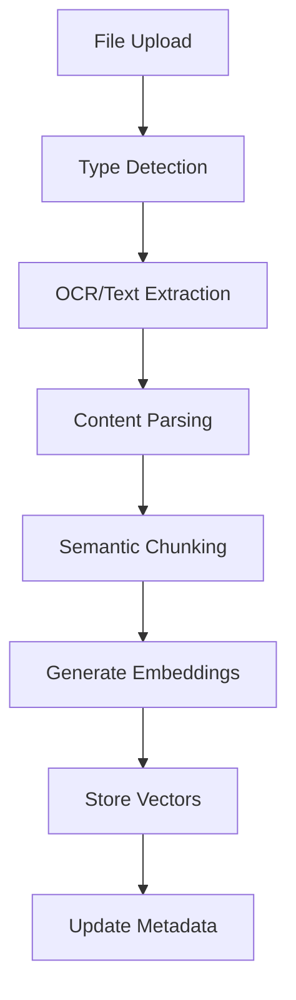
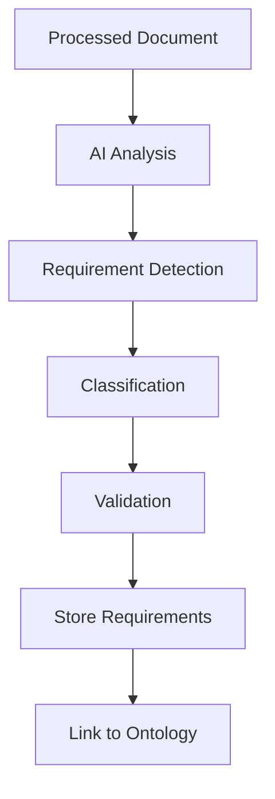

# File Management Guide
*Comprehensive Document Processing and Knowledge Management*

## 🎯 Overview

The ODRAS File Management System provides intelligent document processing, knowledge extraction, and file organization capabilities. It integrates with BPMN workflows for automated processing and supports multiple file types with AI-powered analysis.

## 🏗️ Architecture

### Core Components

#### **1. File Storage Backend**
- **Multi-Backend Support**: Local filesystem, MinIO S3, PostgreSQL BLOB
- **Metadata Management**: Comprehensive file metadata tracking
- **Version Control**: File versioning and change tracking
- **Security**: Access control and encryption at rest

#### **2. Processing Pipeline**
- **BPMN Integration**: Camunda-based workflow automation
- **AI Processing**: OpenAI/Ollama powered content analysis
- **Knowledge Extraction**: Requirements and concept identification
- **Vector Storage**: Embeddings for semantic search

#### **3. File Workbench UI**
- **Drag-and-Drop Upload**: Intuitive file addition
- **Library Management**: Organized file browsing and filtering
- **Processing Status**: Real-time workflow monitoring
- **Batch Operations**: Bulk file processing capabilities

## 🚀 Features

### **File Operations**

#### **Upload and Import**
- **Drag-and-Drop Interface**: Easy file addition
- **Batch Upload**: Multiple file processing
- **URL Import**: Direct web resource import
- **Format Support**: PDF, DOCX, TXT, MD, HTML, and more

#### **Organization and Tagging**
- **Project-Based Organization**: Files organized by project
- **Tag System**: Flexible metadata tagging
- **Document Types**: Requirements, knowledge, specifications
- **Status Tracking**: New, processed, analyzed, archived

#### **Search and Discovery**
- **Full-Text Search**: Content-based file discovery
- **Semantic Search**: AI-powered concept matching
- **Filter Options**: Type, status, date, project filters
- **Quick Access**: Recently used and favorited files

### **Intelligent Processing**

#### **Automated Workflows**
- **Document Ingestion Pipeline**: OCR → Parse → Chunk → Embed → Index
- **Requirements Extraction**: AI-powered requirement identification
- **Knowledge Enrichment**: Concept extraction and linking
- **Quality Assessment**: Content validation and scoring

#### **Content Analysis**
- **Text Extraction**: OCR for images and scanned documents
- **Structure Recognition**: Headers, sections, tables, lists
- **Entity Recognition**: People, places, organizations, concepts
- **Relationship Mapping**: Inter-document connections

#### **Knowledge Integration**
- **Vector Embeddings**: Semantic content representation
- **Graph Storage**: Concept relationships in Neo4j
- **Ontology Linking**: Connection to project ontologies
- **Cross-Reference**: Document interconnection analysis

## 🛠️ Implementation

### **Backend Services**

#### **File Storage Service**
```python
class FileStorageService:
    def upload_file(self, file_data, project_id, tags=None)
    def get_file(self, file_id, user_id)
    def delete_file(self, file_id, user_id)
    def list_files(self, project_id, filters=None)
    def get_file_url(self, file_id, expiry=3600)
```

#### **Processing Service**
```python
class DocumentProcessingService:
    def start_ingestion(self, file_id, pipeline_config)
    def extract_requirements(self, file_id, extraction_config)
    def enrich_knowledge(self, file_id, ontology_id)
    def get_processing_status(self, file_id)
```

### **API Endpoints**

#### **File Management**
```python
# Core file operations
POST   /api/files/upload           # Upload single file
POST   /api/files/batch/upload     # Batch upload
GET    /api/files                  # List files
GET    /api/files/{id}             # Get file metadata
GET    /api/files/{id}/download    # Download file
GET    /api/files/{id}/url         # Get signed URL
DELETE /api/files/{id}             # Delete file

# File processing
POST   /api/files/{id}/process     # Start processing workflow
GET    /api/files/{id}/status      # Get processing status
POST   /api/files/{id}/extract     # Extract requirements
POST   /api/files/{id}/enrich      # Knowledge enrichment

# Batch operations
POST   /api/files/batch/process    # Batch processing
POST   /api/files/batch/tag        # Batch tagging
POST   /api/files/batch/delete     # Batch deletion
```

### **Data Models**

#### **File Model**
```python
class File:
    id: str
    project_id: str
    name: str
    original_name: str
    mime_type: str
    size: int
    storage_key: str
    bytes_hash: str
    tags: List[str]
    status: FileStatus
    created_at: datetime
    updated_at: datetime
    metadata: dict
```

#### **Processing Run Model**
```python
class IngestionRun:
    id: str
    file_id: str
    project_id: str
    process_key: str
    status: ProcessStatus
    started_at: datetime
    finished_at: datetime
    config: dict
    results: dict
    logs_ref: str
```

### **BPMN Workflows**

#### **Document Ingestion Pipeline**


#### **Requirements Extraction**


## 📋 User Workflows

### **Basic File Management**
1. **Upload Files**: Drag-and-drop or browse to upload
2. **Organize**: Add tags, set document type, assign to project
3. **Process**: Start automated analysis workflows
4. **Review**: Examine extracted content and requirements
5. **Integrate**: Link findings to project ontologies

### **Advanced Processing**
1. **Batch Operations**: Process multiple files simultaneously
2. **Custom Workflows**: Configure processing pipelines
3. **Quality Control**: Review and validate AI extractions
4. **Knowledge Linking**: Connect documents to existing knowledge
5. **Export Results**: Generate reports and summaries

### **Search and Discovery**
1. **Content Search**: Find documents by content
2. **Semantic Search**: Discover related concepts
3. **Filter and Sort**: Organize by various criteria
4. **Cross-Reference**: Find document relationships
5. **Knowledge Graphs**: Visualize document connections

## 🔧 Configuration

### **Storage Configuration**
```python
# Storage backend settings
STORAGE_BACKEND = "local"  # local, minio, postgresql
LOCAL_STORAGE_PATH = "/app/data/files"
MINIO_ENDPOINT = "localhost:9000"
MINIO_BUCKET = "odras-files"

# File processing settings
MAX_FILE_SIZE = 100 * 1024 * 1024  # 100MB
ALLOWED_EXTENSIONS = [".pdf", ".docx", ".txt", ".md", ".html"]
ENABLE_OCR = True
OCR_LANGUAGE = "eng"
```

### **Processing Configuration**
```python
# AI processing settings
OPENAI_MODEL = "gpt-4o-mini"
EMBEDDING_MODEL = "text-embedding-3-small"
CHUNK_SIZE = 1000
CHUNK_OVERLAP = 200
MAX_CHUNKS_PER_FILE = 500

# Workflow settings
CAMUNDA_ENDPOINT = "http://localhost:8080/engine-rest"
DEFAULT_PROCESS_KEY = "document_ingestion_pipeline"
PROCESS_TIMEOUT = 3600  # 1 hour
```

## 🧪 Testing

### **File Operations Testing**
```python
def test_file_upload_success()
def test_file_upload_validation()
def test_file_download()
def test_file_deletion()
def test_batch_operations()
```

### **Processing Pipeline Testing**
```python
def test_document_ingestion_workflow()
def test_requirements_extraction()
def test_knowledge_enrichment()
def test_processing_error_handling()
```

### **Integration Testing**
```python
def test_end_to_end_document_processing()
def test_multi_user_file_access()
def test_large_file_handling()
def test_concurrent_processing()
```

## 📊 Monitoring and Analytics

### **File Metrics**
- **Upload Volume**: Files uploaded per day/week/month
- **Processing Times**: Average workflow completion times
- **Success Rates**: Processing success/failure ratios
- **Storage Usage**: Disk space utilization trends

### **Content Analytics**
- **Document Types**: Distribution of file formats
- **Content Quality**: AI-assessed document quality scores
- **Knowledge Extraction**: Requirements and concepts identified
- **User Engagement**: Most accessed and processed files

### **Performance Monitoring**
```python
# Key performance indicators
UPLOAD_TIME_TARGET = 30  # seconds for 10MB file
PROCESSING_TIME_TARGET = 300  # seconds for average document
SEARCH_RESPONSE_TARGET = 2  # seconds for search queries
AVAILABILITY_TARGET = 99.5  # percent uptime
```

## 🚀 Future Enhancements

### **Advanced Processing**
- **Multi-language Support**: OCR and processing for multiple languages
- **Custom AI Models**: Domain-specific processing models
- **Collaborative Annotation**: Multi-user document markup
- **Version Comparison**: Document diff and merge capabilities

### **Integration Enhancements**
- **External Repositories**: SharePoint, Google Drive integration
- **Workflow Automation**: Custom BPMN workflow designer
- **Real-time Processing**: Stream processing for large volumes
- **Advanced Analytics**: ML-powered content insights

### **User Experience**
- **Mobile Interface**: Responsive mobile file management
- **Offline Capabilities**: Local caching and sync
- **Advanced Search**: Natural language query interface
- **Visualization Tools**: Document relationship graphs

---

*This guide consolidates all file management documentation and serves as the comprehensive reference for document processing in ODRAS.*
