# Ontology Question-Driven Development (OQDD)

## Executive Summary

This document presents a comprehensive framework for implementing Question-Driven Ontology Development (OQDD) within ODRAS, integrating with the DAS (Digital Assistant Service) to provide intelligent, automated assistance in ontology creation and validation. This approach transforms ontology development from an ad-hoc process into a structured, validated, and AI-assisted workflow.

**Key Innovation**: By capturing domain questions upfront and training DAS to understand them, we enable automated ontology generation, validation, and refinement based on explicit user requirements.

---

## Table of Contents

1. [Benefits of Question-Driven Ontology Development](#benefits)
2. [Architecture Overview](#architecture-overview)
3. [System Components](#system-components)
4. [Question Types and Categories](#question-types)
5. [DAS Integration Strategy](#das-integration)
6. [API Design](#api-design)
7. [Workflow Examples](#workflow-examples)
8. [Implementation Roadmap](#implementation-roadmap)

---

## Benefits of Question-Driven Ontology Development {#benefits}

### 1. Enhanced Clarity and Focus

**Problem**: Traditional ontology development often lacks clear requirements, leading to scope creep and misalignment with actual needs.

**Solution**: By systematically addressing specific questions, developers ensure the ontology accurately represents the intended domain.

**Benefits**:
- **Explicit Requirements**: Questions serve as formal requirements documentation
- **Scope Definition**: Clear boundaries for what the ontology should and shouldn't cover
- **Stakeholder Alignment**: Questions ensure all stakeholders agree on ontology purpose
- **Reduced Ambiguity**: Concrete questions eliminate interpretation issues

### 2. Improved Validation and Completeness

**Problem**: Without structured validation, ontologies may have gaps or inconsistencies that only appear during use.

**Solution**: A structured set of questions provides a validation checklist ensuring comprehensive coverage.

**Benefits**:
- **Completeness Verification**: Every question must have a corresponding ontology answer
- **Coverage Analysis**: Identify missing concepts, relationships, or properties
- **Consistency Checking**: Ensure ontology structure aligns with question requirements
- **Quality Metrics**: Track percentage of questions answered by the ontology

### 3. Facilitated Collaboration

**Problem**: Ontology development often involves domain experts, knowledge engineers, and developers who speak different languages.

**Solution**: Questions provide a common vocabulary and reference point for all stakeholders.

**Benefits**:
- **Common Language**: Questions bridge technical and domain expertise
- **Clear Communication**: Non-technical stakeholders can review and validate questions
- **Iterative Refinement**: Questions evolve through collaborative discussion
- **Documentation**: Questions serve as living documentation of ontology purpose

### 4. Efficient AI Training and Assistance

**Problem**: AI systems need extensive context to provide meaningful assistance in ontology development.

**Solution**: Questions provide structured training data for DAS, enabling intelligent assistance.

**Benefits**:
- **Contextual Understanding**: DAS learns domain context from questions
- **Pattern Recognition**: DAS identifies common ontology patterns from question types
- **Automated Suggestions**: DAS proposes ontology elements based on questions
- **Validation Automation**: DAS automatically checks if ontology answers questions

### 5. Traceability and Accountability

**Problem**: Design decisions in ontologies are often undocumented, making maintenance difficult.

**Solution**: Each ontology element traces back to one or more questions it addresses.

**Benefits**:
- **Design Rationale**: Why each element exists is documented
- **Impact Analysis**: Understand what breaks if elements are removed
- **Version Control**: Track how questions and answers evolve
- **Audit Trail**: Demonstrate ontology meets requirements

### 6. Accelerated Development Cycle

**Problem**: Ontology development is time-consuming and iterative without clear direction.

**Solution**: Questions provide a roadmap, and DAS automates much of the implementation.

**Benefits**:
- **Reduced Development Time**: DAS generates initial ontology structure from questions
- **Fewer Iterations**: Clear requirements reduce rework
- **Automated Testing**: Questions serve as test cases
- **Continuous Validation**: Real-time feedback on completeness

---

## Architecture Overview {#architecture-overview}

### High-Level System Architecture

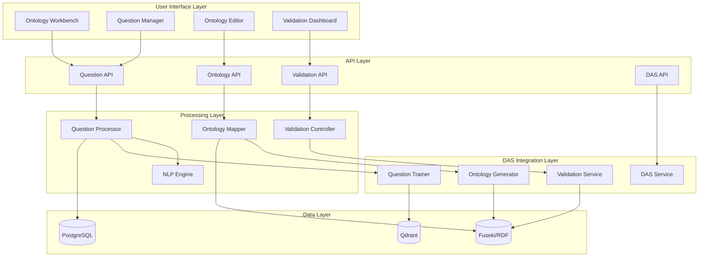

### Data Flow Architecture

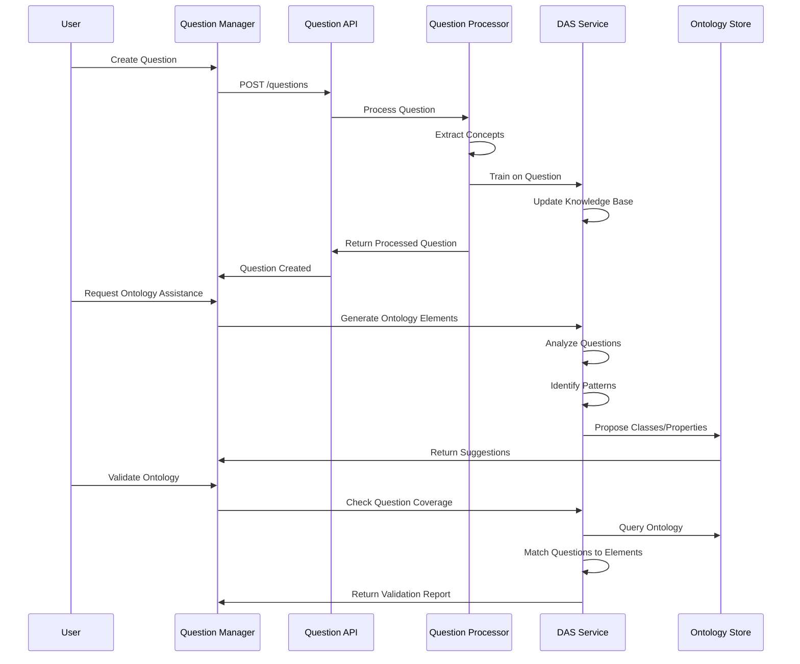

---

## System Components {#system-components}

### 1. User Interface Layer

#### Question Manager Component

**Purpose**: Provide intuitive interface for creating, organizing, and managing ontology questions.

**Features**:
- Table view with sorting, filtering, and search
- Question creation with rich text editor
- Metadata assignment (category, priority, status, tags)
- Bulk operations (import, export, delete)
- Question templates for common patterns
- Visual question hierarchy (parent/child relationships)

**UI Elements**:
```
┌─────────────────────────────────────────────────────────────┐
│ Ontology Question Manager                    [+ New Question]│
├─────────────────────────────────────────────────────────────┤
│ Filters: [All Categories ▼] [All Status ▼] [Priority ▼]    │
├────┬──────────────────────────┬──────────┬──────────┬───────┤
│ ID │ Question                 │ Category │ Priority │ Status│
├────┼──────────────────────────┼──────────┼──────────┼───────┤
│ 1  │ What is the purpose of..?│ Purpose  │ High     │ ✓ Done│
│ 2  │ What are the inputs to..?│ Input    │ Medium   │ Draft │
│ 3  │ What are the outputs...? │ Output   │ Medium   │ Draft │
└────┴──────────────────────────┴──────────┴──────────┴───────┘
```

#### Validation Dashboard Component

**Purpose**: Visualize ontology completeness and question coverage.

**Features**:
- Coverage percentage by question category
- Unanswered questions highlighted
- Ontology element to question traceability
- Gap analysis visualization
- Recommendation engine output

### 2. API Layer

#### Question API Endpoints

```python
# Question CRUD Operations
POST   /api/v1/projects/{project_id}/ontologies/{ontology_id}/questions
GET    /api/v1/projects/{project_id}/ontologies/{ontology_id}/questions
GET    /api/v1/projects/{project_id}/ontologies/{ontology_id}/questions/{question_id}
PUT    /api/v1/projects/{project_id}/ontologies/{ontology_id}/questions/{question_id}
DELETE /api/v1/projects/{project_id}/ontologies/{ontology_id}/questions/{question_id}

# Question Analysis
POST   /api/v1/questions/{question_id}/analyze
GET    /api/v1/questions/{question_id}/concepts

# Question Templates
GET    /api/v1/question-templates
POST   /api/v1/question-templates
```

#### DAS Integration API Endpoints

```python
# Train DAS on Questions
POST   /api/v1/das/train-questions
POST   /api/v1/das/train-questions/{question_id}

# Generate Ontology from Questions
POST   /api/v1/das/generate-ontology
GET    /api/v1/das/suggestions

# Validate Ontology Against Questions
POST   /api/v1/das/validate-ontology
GET    /api/v1/das/validation-report
```

### 3. Processing Layer

#### Natural Language Processing Engine

**Purpose**: Extract semantic meaning from user questions.

**Capabilities**:
- **Entity Recognition**: Identify domain concepts, objects, and actors
- **Relationship Extraction**: Detect relationships between concepts
- **Intent Classification**: Understand question purpose (definition, input, output, validation)
- **Dependency Parsing**: Understand question structure and dependencies
- **Concept Linking**: Connect question terms to existing ontology elements

**Example Processing**:
```
Question: "What are the required inputs for a mission planning process?"

Extracted Elements:
- Concept: "mission planning process"
- Type: "Process" (OWL Class candidate)
- Relationship: "hasInput" (OWL Property candidate)
- Constraint: "required" (OWL Cardinality constraint)
- Intent: "Input specification"
```

#### Ontology Mapper

**Purpose**: Map extracted concepts to OWL ontology elements.

**Mappings**:
| Question Element | OWL Element | Example |
|-----------------|-------------|---------|
| Domain concept | owl:Class | "Mission" → `core:Mission` |
| Relationship | owl:ObjectProperty | "requires" → `core:requires` |
| Attribute | owl:DatatypeProperty | "name" → `core:hasName` |
| Constraint | owl:Restriction | "required" → `owl:minCardinality 1` |
| Category | rdfs:subClassOf | "Process" → `core:Process` |

#### Validation Controller

**Purpose**: Orchestrate validation of ontology against questions.

**Validation Types**:
1. **Completeness**: Does ontology answer all questions?
2. **Consistency**: Are answers logically consistent?
3. **Coverage**: Are all question categories addressed?
4. **Traceability**: Can each element trace to a question?

---

## Question Types and Categories {#question-types}

### Overview: Structured vs Free-Form Questions

**Two Question Modes**:
1. **Structured Questions**: Template-based, categorized questions with predefined patterns
2. **Free-Form Questions**: Open-ended competency questions that capture domain-specific nuances

**When to Use Each**:
- **Structured**: When building foundational ontology elements, following best practices
- **Free-Form**: When capturing domain-specific requirements, unique use cases, or complex scenarios

### Question Taxonomy

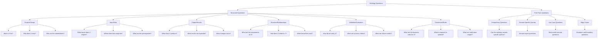

### Question Templates

#### 1. Purpose Questions
```yaml
templates:
  - pattern: "What is the purpose of {concept}?"
    generates:
      - rdfs:comment for concept
      - dcterms:description

  - pattern: "Why do we need {concept}?"
    generates:
      - rdfs:comment
      - justification property

  - pattern: "Who uses {concept}?"
    generates:
      - stakeholder relationship
      - owl:ObjectProperty (usedBy)
```

#### 2. Input Questions
```yaml
templates:
  - pattern: "What are the required inputs for {process}?"
    generates:
      - owl:ObjectProperty (hasInput)
      - owl:Restriction (minCardinality 1)

  - pattern: "Where does {data} come from?"
    generates:
      - owl:ObjectProperty (derivedFrom)
      - provenance properties
```

#### 3. Output Questions
```yaml
templates:
  - pattern: "What does {process} produce?"
    generates:
      - owl:ObjectProperty (hasOutput)
      - output class definitions

  - pattern: "What changes when {event} occurs?"
    generates:
      - state change properties
      - temporal relationships
```

#### 4. Structure Questions
```yaml
templates:
  - pattern: "What are the components of {system}?"
    generates:
      - owl:ObjectProperty (hasPart)
      - part-of hierarchy

  - pattern: "How does {concept1} relate to {concept2}?"
    generates:
      - owl:ObjectProperty (custom relationship)
      - relationship constraints
```

#### 5. Validation Questions
```yaml
templates:
  - pattern: "How do we verify {condition}?"
    generates:
      - validation rule
      - constraint checking property

  - pattern: "What indicates success for {process}?"
    generates:
      - success criteria class
      - measurement properties
```

#### 6. Constraint Questions
```yaml
templates:
  - pattern: "What are the valid values for {attribute}?"
    generates:
      - owl:DatatypeProperty
      - owl:oneOf enumeration

  - pattern: "What is required for {concept}?"
    generates:
      - owl:Restriction
      - cardinality constraints
```

---

### Free-Form Competency Questions

**Definition**: Competency questions are specific, domain-oriented queries that the ontology must be able to answer. Unlike structured templates, these are open-ended questions that capture the unique requirements of your domain.

**Purpose**:
- Validate ontology scope and completeness
- Ensure ontology serves real-world use cases
- Capture domain expert knowledge
- Guide iterative ontology refinement

#### Categories of Free-Form Questions

##### 1. **Purpose and Scope Questions**

These questions define what the ontology is for and what it should cover.

**Real-World Examples**:

```
Medical Ontology:
- "What is the primary goal of this clinical decision support ontology?"
- "Which medical specialties and conditions should be covered?"
- "Who will use this ontology (clinicians, researchers, administrators)?"
- "How will this ontology integrate with existing medical terminologies like SNOMED CT?"

Mission Planning Ontology:
- "What types of military operations should this ontology support?"
- "What level of detail is needed for mission planning elements?"
- "How will this ontology interface with existing DoD systems?"
- "What classification levels must the ontology accommodate?"

Supply Chain Ontology:
- "What aspects of the supply chain are in scope (procurement, logistics, inventory)?"
- "Which industries or verticals should this ontology support?"
- "How will this ontology handle multi-tier supplier relationships?"
```

##### 2. **Conceptualization Questions**

These questions identify core concepts, entities, and relationships.

**Real-World Examples**:

```
Pizza Ontology (Classic Example):
- "What makes a pizza different from other Italian dishes?"
- "How do we classify pizzas (by topping, base, country of origin)?"
- "Can a pizza have multiple bases, or is that a different dish?"
- "What defines a 'vegetarian pizza' - absence of meat or presence of vegetables?"

Wine Ontology:
- "How do we distinguish between wine regions, sub-regions, and appellations?"
- "What properties define a wine's character (grape, vintage, terroir, process)?"
- "Can a wine belong to multiple classification systems simultaneously?"
- "How do we represent wine pairing relationships?"

Aircraft Maintenance Ontology:
- "What are the fundamental maintenance concepts (tasks, procedures, inspections)?"
- "How do we model the relationship between aircraft systems and maintenance actions?"
- "What defines a maintenance event versus a modification?"
- "How do we represent scheduled vs unscheduled maintenance?"
```

##### 3. **Data Integration Questions**

These questions address how the ontology integrates with data sources and other systems.

**Real-World Examples**:

```
Healthcare:
- "How will patient data from EHR systems map to ontology concepts?"
- "What data quality standards must be enforced?"
- "How do we handle conflicting data from multiple sources?"
- "What temporal aspects of medical data need to be captured?"

Manufacturing:
- "How will real-time sensor data align with ontology concepts?"
- "What IoT device types and protocols must be supported?"
- "How do we map legacy system identifiers to ontology IRIs?"
- "What frequency of data updates should the ontology support?"

Intelligence Analysis:
- "How will classified and unclassified data be distinguished?"
- "What data sources (SIGINT, HUMINT, OSINT) must be integrated?"
- "How do we handle data provenance and confidence levels?"
- "What cross-domain relationships need to be captured?"
```

##### 4. **Relationship and Structure Questions**

These questions explore how concepts relate to each other.

**Real-World Examples**:

```
Organizational Ontology:
- "How do we model reporting relationships in matrix organizations?"
- "Can a person belong to multiple organizational units simultaneously?"
- "How do we represent temporary assignments or rotations?"
- "What's the difference between functional and administrative reporting?"

Genealogy Ontology:
- "How do we represent adoption versus biological parentage?"
- "Can we model step-parent relationships distinctly from biological ones?"
- "How do we handle same-sex parents and non-traditional families?"
- "What granularity is needed for extended family relationships?"

Project Management Ontology:
- "How do project dependencies and constraints interact?"
- "Can a task be part of multiple work breakdown structures?"
- "How do we model critical path relationships?"
- "What's the relationship between resources, tasks, and deliverables?"
```

##### 5. **Business Rules and Constraints Questions**

These questions capture domain rules and restrictions.

**Real-World Examples**:

```
Banking Ontology:
- "What are the regulatory requirements for each account type?"
- "Under what conditions can an account be closed?"
- "What are the business rules for transaction approval?"
- "How do we enforce KYC (Know Your Customer) requirements?"

Aviation Safety Ontology:
- "What are the minimum crew requirements for different aircraft types?"
- "Under what weather conditions must flights be grounded?"
- "What maintenance must be completed before flight clearance?"
- "How do we enforce crew rest requirements?"

Pharmaceutical Ontology:
- "What are the contraindications for specific drug combinations?"
- "Under what conditions can generic drugs be substituted?"
- "What are the storage and handling requirements for each drug class?"
- "How do we model age-based dosing restrictions?"
```

##### 6. **Temporal and Dynamic Questions**

These questions address how things change over time.

**Real-World Examples**:

```
Clinical Trial Ontology:
- "How do we track patient progression through trial phases?"
- "What temporal relationships exist between adverse events and interventions?"
- "How do we model protocol amendments over time?"
- "What's the relationship between enrollment dates, treatment dates, and outcomes?"

Asset Management Ontology:
- "How do we track asset lifecycle stages (acquisition, operation, disposal)?"
- "What triggers a transition between asset states?"
- "How do we model depreciation and value changes over time?"
- "What historical data must be retained for compliance?"

Cyber Security Ontology:
- "How do we model the evolution of threat actors over time?"
- "What temporal patterns indicate a coordinated attack?"
- "How do we track vulnerability disclosure and patching timelines?"
- "What's the relationship between threat intelligence age and reliability?"
```

##### 7. **Query and Reasoning Questions**

These questions test if the ontology can support required reasoning and queries.

**Real-World Examples**:

```
E-Commerce Ontology:
- "Can we find all products suitable for customers with specific dietary restrictions?"
- "How do we identify products that are frequently bought together?"
- "Can we determine if a product is in stock at a specific location?"
- "How do we find all reviews for a product across product variations?"

Urban Planning Ontology:
- "Can we identify all properties affected by a proposed zoning change?"
- "How do we find suitable locations for new infrastructure based on criteria?"
- "Can we determine the environmental impact of a development project?"
- "How do we analyze traffic patterns and their impact on neighborhoods?"

Logistics Ontology:
- "Can we determine the fastest route considering current conditions?"
- "How do we identify all shipments affected by a facility closure?"
- "Can we find alternative suppliers who can meet delivery requirements?"
- "How do we calculate total cost of ownership for shipping methods?"
```

##### 8. **Exception and Edge Case Questions**

These questions capture unusual scenarios and boundary conditions.

**Real-World Examples**:

```
Insurance Ontology:
- "How do we handle policies with overlapping coverage periods?"
- "What happens when a policyholder changes legal status (marriage, divorce)?"
- "How do we model pre-existing conditions and their impact on coverage?"
- "What are the rules for beneficiary changes after a claim is filed?"

Education Ontology:
- "How do we handle transfer credits from international institutions?"
- "What happens when a student is simultaneously enrolled in multiple programs?"
- "How do we model incomplete grades and grade changes?"
- "What are the rules for retroactive course withdrawals?"

Real Estate Ontology:
- "How do we handle properties with multiple legal owners?"
- "What happens when property boundaries are disputed?"
- "How do we model properties that span multiple jurisdictions?"
- "What are the rules for fractional ownership and time-shares?"
```

#### How DAS Processes Free-Form Questions

**NLP Pipeline for Free-Form Questions**:

```python
class FreeFormQuestionProcessor:
    def process(self, question_text: str) -> ProcessedFreeFormQuestion:
        # 1. Extract domain concepts
        concepts = self.extract_concepts(question_text)

        # 2. Identify question intent (what type of answer is needed)
        intent = self.classify_intent(question_text)
        # Examples: definition, relationship, constraint, query, reasoning

        # 3. Extract entities and their roles
        entities = self.extract_entities(question_text)

        # 4. Identify required reasoning patterns
        reasoning = self.identify_reasoning_patterns(question_text)

        # 5. Generate competency query (SPARQL or similar)
        competency_query = self.generate_query(question_text, concepts)

        # 6. Suggest ontology elements
        suggestions = self.suggest_ontology_elements(
            concepts, entities, intent, reasoning
        )

        return ProcessedFreeFormQuestion(
            original_text=question_text,
            concepts=concepts,
            intent=intent,
            entities=entities,
            reasoning_patterns=reasoning,
            competency_query=competency_query,
            suggested_elements=suggestions
        )
```

**Example Processing**:

```
Input Question:
"How do we identify all shipments affected by a facility closure?"

Processing Results:
- Domain Concepts: ["shipment", "facility", "closure", "affected"]
- Intent: query_capability
- Entities:
  - Subject: "shipment"
  - Object: "facility closure"
  - Relationship: "affected by"
- Reasoning Patterns: ["transitive_relationship", "temporal_reasoning"]
- Required Ontology Elements:
  - Classes: Shipment, Facility, ClosureEvent
  - Properties: affectedBy, atFacility, hasStatus
  - Constraints: temporal overlap between shipment and closure
- Competency SPARQL:
  """
  SELECT ?shipment WHERE {
    ?shipment rdf:type :Shipment ;
              :atFacility ?facility .
    ?facility :hasEvent ?closure .
    ?closure rdf:type :ClosureEvent ;
             :startDate ?closureStart ;
             :endDate ?closureEnd .
    ?shipment :scheduledDate ?shipmentDate .
    FILTER (?shipmentDate >= ?closureStart && ?shipmentDate <= ?closureEnd)
  }
  """
```

#### User Interface for Free-Form Questions

```
┌─────────────────────────────────────────────────────────────────┐
│ Add Competency Question                          [Structured ▼] │
├─────────────────────────────────────────────────────────────────┤
│                                                                  │
│ Question Text:                                                   │
│ ┌──────────────────────────────────────────────────────────┐   │
│ │ How do we identify all shipments affected by a facility  │   │
│ │ closure?                                                  │   │
│ │                                                           │   │
│ │                                                           │   │
│ └──────────────────────────────────────────────────────────┘   │
│                                                                  │
│ Priority: [High ▼]        Status: [Draft ▼]                    │
│                                                                  │
│ Tags: [logistics] [query] [temporal]              [+ Add Tag]   │
│                                                                  │
│ ━━━━━━━━━━━━━━━━━━━━━━━━━━━━━━━━━━━━━━━━━━━━━━━━━━━━━━━━━━━━  │
│                                                                  │
│ 🤖 DAS Analysis (Auto-detected):                                │
│                                                                  │
│ Detected Concepts: Shipment, Facility, Closure                  │
│ Question Intent: Query Capability                               │
│ Reasoning Required: Temporal Overlap, Transitive Relationships  │
│                                                                  │
│ Suggested Ontology Elements:                                    │
│ • Class: Shipment                                               │
│ • Class: Facility                                               │
│ • Class: ClosureEvent                                           │
│ • Property: affectedBy                                          │
│ • Property: atFacility                                          │
│                                                                  │
│ [Generate SPARQL Query]  [Auto-Create Elements]                 │
│                                                                  │
├─────────────────────────────────────────────────────────────────┤
│                            [Cancel]  [Save Question]             │
└─────────────────────────────────────────────────────────────────┘
```

#### Best Practices for Free-Form Questions

1. **Be Specific**: Vague questions lead to vague ontologies
   - ❌ "How do we handle customers?"
   - ✅ "How do we track customer preferences across multiple channels?"

2. **Use Domain Language**: Write questions as domain experts would ask them
   - ❌ "What instances are in the customer class?"
   - ✅ "Which customers have purchased from us in the last 90 days?"

3. **Focus on Use Cases**: Questions should reflect actual needs
   - ❌ "What properties does a product have?"
   - ✅ "How do we determine if a product is available for international shipping?"

4. **Include Edge Cases**: Don't forget unusual scenarios
   - ❌ "How do we process returns?"
   - ✅ "How do we handle returns of personalized items after 30 days?"

5. **Think About Integration**: Consider how data flows
   - ❌ "What is an order?"
   - ✅ "How do we link orders from our e-commerce platform to inventory in our warehouse system?"

6. **Consider Temporal Aspects**: Many domains involve time
   - ❌ "How do we track projects?"
   - ✅ "How do we determine which projects are overdue and by how much?"

7. **Test Reasoning Capabilities**: Ensure the ontology can infer what's needed
   - ❌ "What are the parts of a machine?"
   - ✅ "Can we determine all components that need replacement if a specific part fails?"

---

## DAS Integration Strategy {#das-integration}

### Pre-Training DAS with Ontology Development Knowledge

**Critical Concept**: DAS must be trained on the OQDD process itself before it can effectively assist users. This meta-knowledge enables DAS to understand the methodology, guide users through the process, and make intelligent suggestions.

#### What DAS Needs to Learn Upfront

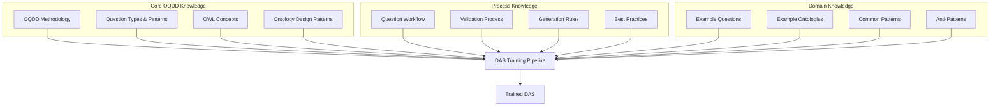

#### Training Documents for DAS

**1. Methodology Document** (this document):
```python
# Train DAS on OQDD methodology
das_training_service.ingest_document(
    document_path="docs/features/ONTOLOGY_QUESTION_DRIVEN_DEVELOPMENT.md",
    document_type="methodology",
    chunk_strategy="semantic",  # Chunk by section
    metadata={
        "topic": "ontology_question_driven_development",
        "version": "2.0",
        "priority": "critical"
    }
)
```

**2. Question Pattern Library**:
```yaml
# examples/question_patterns.yaml
question_patterns:
  - name: "purpose_identification"
    template: "What is the purpose of {concept}?"
    category: "purpose"
    generates:
      - rdfs:comment
      - dcterms:description
    example_questions:
      - "What is the purpose of a Mission Plan?"
      - "Why do we need a Resource Allocation concept?"
    training_examples:
      - question: "What is the purpose of a combat aircraft?"
        concepts: ["combat aircraft"]
        ontology_elements:
          - type: "owl:Class"
            name: "CombatAircraft"
            annotations:
              - rdfs:comment: "Military aircraft designed for air-to-air or air-to-ground combat"

  - name: "input_specification"
    template: "What are the required inputs for {process}?"
    category: "input"
    generates:
      - owl:ObjectProperty (hasRequiredInput)
      - owl:Restriction (minCardinality 1)
    example_questions:
      - "What inputs does mission planning require?"
      - "What data is needed for threat assessment?"
```

**3. OWL Pattern Library**:
```yaml
# examples/owl_patterns.yaml
owl_patterns:
  - name: "required_input_pattern"
    description: "Models required inputs for a process"
    trigger_questions: ["What are the required inputs", "What inputs are needed"]
    owl_structure:
      classes:
        - "{Process}Process"
        - "{Input}Input"
      properties:
        - name: "hasRequiredInput"
          type: "owl:ObjectProperty"
          domain: "{Process}Process"
          range: "{Input}Input"
      restrictions:
        - on_property: "hasRequiredInput"
          restriction_type: "owl:minCardinality"
          value: 1
    example:
      question: "What are the required inputs for mission planning?"
      generated_owl: |
        :MissionPlanningProcess rdf:type owl:Class .
        :MissionInput rdf:type owl:Class .
        :hasRequiredInput rdf:type owl:ObjectProperty ;
            rdfs:domain :MissionPlanningProcess ;
            rdfs:range :MissionInput .
        :MissionPlanningProcess rdfs:subClassOf [
            rdf:type owl:Restriction ;
            owl:onProperty :hasRequiredInput ;
            owl:minCardinality 1
        ] .
```

**4. Domain-Specific Examples**:
```python
# Load example ontologies with their questions
training_examples = [
    {
        "domain": "mission_planning",
        "questions": [
            "What are the phases of mission planning?",
            "Who are the stakeholders in mission execution?",
            "What resources are required for mission success?"
        ],
        "ontology_elements": [...],
        "competency_queries": [...]
    },
    {
        "domain": "supply_chain",
        "questions": [
            "How do we track shipments across facilities?",
            "What triggers a reorder event?",
            "How do we model supplier relationships?"
        ],
        "ontology_elements": [...],
        "competency_queries": [...]
    }
]

for example in training_examples:
    das_training_service.ingest_domain_example(example)
```

#### DAS Training Script

**Initial Setup Script** (`scripts/train_das_on_oqdd.py`):
```python
#!/usr/bin/env python3
"""
Train DAS on Ontology Question-Driven Development (OQDD) methodology.
Run this once during system initialization or when updating OQDD knowledge.
"""

import asyncio
from pathlib import Path
from backend.services.das_training_service import DASTrainingService
from backend.services.embedding_service import EmbeddingService

async def train_das_on_oqdd():
    """Train DAS with comprehensive OQDD knowledge."""

    training_service = DASTrainingService()

    print("🎓 Training DAS on Ontology Question-Driven Development...")

    # 1. Ingest OQDD methodology document
    print("📚 Loading OQDD methodology document...")
    await training_service.ingest_document(
        document_path="docs/features/ONTOLOGY_QUESTION_DRIVEN_DEVELOPMENT.md",
        document_type="methodology",
        collection="das_instructions",
        metadata={
            "topic": "ontology_question_driven_development",
            "version": "2.0",
            "priority": "critical",
            "category": "methodology"
        }
    )

    # 2. Ingest question pattern library
    print("🎯 Loading question patterns...")
    await training_service.ingest_yaml(
        yaml_path="examples/question_patterns.yaml",
        collection="das_instructions",
        metadata={
            "topic": "question_patterns",
            "type": "template_library"
        }
    )

    # 3. Ingest OWL pattern library
    print("🦉 Loading OWL design patterns...")
    await training_service.ingest_yaml(
        yaml_path="examples/owl_patterns.yaml",
        collection="das_instructions",
        metadata={
            "topic": "owl_patterns",
            "type": "design_patterns"
        }
    )

    # 4. Ingest domain examples
    print("🌍 Loading domain-specific examples...")
    domains = [
        "mission_planning",
        "supply_chain",
        "healthcare",
        "manufacturing"
    ]

    for domain in domains:
        await training_service.ingest_domain_examples(
            domain=domain,
            examples_path=f"examples/domains/{domain}_examples.yaml"
        )

    # 5. Ingest ontology engineering best practices
    print("✨ Loading best practices...")
    await training_service.ingest_document(
        document_path="docs/architecture/ONTOLOGY_BEST_PRACTICES.md",
        document_type="best_practices",
        collection="das_instructions"
    )

    # 6. Create embeddings for all ingested content
    print("🔢 Generating embeddings...")
    await training_service.generate_all_embeddings()

    # 7. Build pattern index for fast lookup
    print("📇 Building pattern index...")
    await training_service.build_pattern_index()

    print("✅ DAS training complete!")
    print("\n📊 Training Statistics:")
    stats = await training_service.get_training_stats()
    print(f"  - Documents: {stats['documents']}")
    print(f"  - Question Patterns: {stats['question_patterns']}")
    print(f"  - OWL Patterns: {stats['owl_patterns']}")
    print(f"  - Domain Examples: {stats['domain_examples']}")
    print(f"  - Total Embeddings: {stats['embeddings']}")

if __name__ == "__main__":
    asyncio.run(train_das_on_oqdd())
```

**Continuous Training** (on each new question):
```python
class DASTrainingService:
    async def train_on_question(self, question_id: str):
        """
        Train DAS incrementally when a new question is created.
        This updates DAS's understanding of the specific project.
        """
        # 1. Get question from SQL
        question = await self.question_service.get_question(question_id)

        # 2. Get extracted concepts and generated elements
        concepts = await self.get_question_concepts(question_id)
        elements = await self.get_generated_elements(question_id)

        # 3. Create training document
        training_doc = {
            "type": "question_example",
            "question_text": question.question_text,
            "question_type": question.question_type,
            "category": question.category,
            "domain": question.project.domain,
            "concepts": concepts,
            "generated_elements": elements,
            "timestamp": question.created_at
        }

        # 4. Store in DAS knowledge base
        await self.store_training_example(
            collection="project_questions",
            document=training_doc,
            metadata={
                "project_id": str(question.project_id),
                "ontology_id": str(question.ontology_id),
                "question_id": str(question_id)
            }
        )

        # 5. Update pattern library if new pattern detected
        if await self.is_new_pattern(question, concepts):
            await self.extract_and_store_pattern(question, concepts, elements)
```

### Dual Storage Architecture: SQL-First with Vector Sync

**ODRAS Principle**: PostgreSQL is the source of truth, Qdrant provides semantic search capabilities.

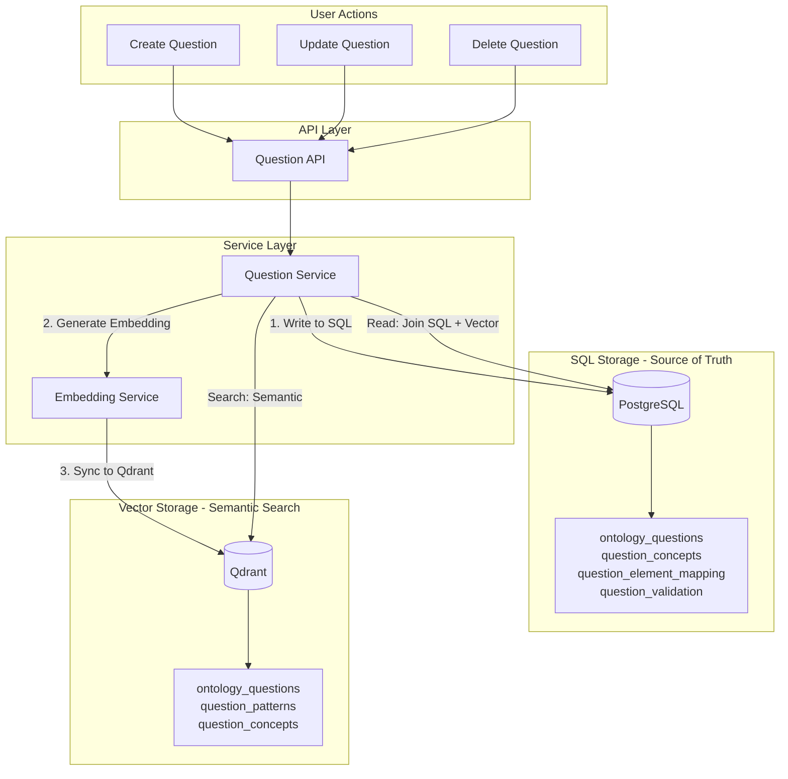

#### SQL-First Implementation

```python
class QuestionService:
    """
    SQL-first service with automatic vector synchronization.
    PostgreSQL is always the source of truth.
    """

    def __init__(self):
        self.db = get_postgres_connection()
        self.qdrant = get_qdrant_client()
        self.embedding_service = EmbeddingService()

    async def create_question(
        self,
        ontology_id: str,
        question_data: QuestionCreate
    ) -> Question:
        """
        Create question with SQL-first approach and vector sync.
        """
        async with self.db.transaction():
            # 1. Write to PostgreSQL (source of truth)
            question = await self.db.execute(
                """
                INSERT INTO ontology_questions
                (id, ontology_id, project_id, question_text, question_type,
                 category, priority, status, tags, created_by)
                VALUES ($1, $2, $3, $4, $5, $6, $7, $8, $9, $10)
                RETURNING *
                """,
                uuid.uuid4(), ontology_id, question_data.project_id,
                question_data.question_text, question_data.question_type,
                question_data.category, question_data.priority,
                "draft", question_data.tags, current_user.id
            )

            # 2. Process with NLP and store concepts in SQL
            processed = await self.process_question(question.question_text)

            for concept in processed.concepts:
                await self.db.execute(
                    """
                    INSERT INTO question_concepts
                    (id, question_id, concept_text, concept_type, confidence)
                    VALUES ($1, $2, $3, $4, $5)
                    """,
                    uuid.uuid4(), question.id, concept.text,
                    concept.type, concept.confidence
                )

            # 3. Generate embedding
            embedding = await self.embedding_service.encode(
                question.question_text
            )

            # 4. Sync to Qdrant (async, non-blocking)
            await self.sync_to_qdrant(
                question=question,
                concepts=processed.concepts,
                embedding=embedding
            )

            # 5. Train DAS on new question (async background task)
            background_tasks.add_task(
                self.train_das_on_question,
                question_id=question.id
            )

            return question

    async def sync_to_qdrant(
        self,
        question: Question,
        concepts: List[Concept],
        embedding: List[float]
    ):
        """
        Synchronize question data to Qdrant for semantic search.
        This is secondary storage - PostgreSQL remains source of truth.
        """
        try:
            # Upsert to Qdrant
            await self.qdrant.upsert(
                collection_name="ontology_questions",
                points=[
                    PointStruct(
                        id=str(question.id),
                        vector=embedding,
                        payload={
                            # Core fields
                            "question_id": str(question.id),
                            "ontology_id": str(question.ontology_id),
                            "project_id": str(question.project_id),
                            "question_text": question.question_text,
                            "question_type": question.question_type,
                            "category": question.category,
                            "priority": question.priority,
                            "status": question.status,
                            "tags": question.tags,

                            # Extracted concepts (for filtering)
                            "concepts": [
                                {
                                    "text": c.text,
                                    "type": c.type,
                                    "confidence": c.confidence
                                }
                                for c in concepts
                            ],

                            # Timestamps
                            "created_at": question.created_at.isoformat(),
                            "updated_at": question.updated_at.isoformat()
                        }
                    )
                ]
            )

            logger.info(f"Synced question {question.id} to Qdrant")

        except Exception as e:
            # Qdrant sync failure doesn't break the operation
            # SQL data is safe, we can retry sync later
            logger.error(f"Failed to sync question to Qdrant: {e}")
            # Queue for retry
            await self.queue_qdrant_retry(question.id)

    async def search_questions_semantic(
        self,
        query_text: str,
        ontology_id: str,
        limit: int = 10,
        filters: Optional[Dict] = None
    ) -> List[Question]:
        """
        Semantic search using Qdrant, then fetch full data from PostgreSQL.
        """
        # 1. Generate query embedding
        query_embedding = await self.embedding_service.encode(query_text)

        # 2. Build Qdrant filters
        qdrant_filter = Filter(
            must=[
                FieldCondition(
                    key="ontology_id",
                    match=MatchValue(value=str(ontology_id))
                )
            ]
        )

        if filters:
            if filters.get("question_type"):
                qdrant_filter.must.append(
                    FieldCondition(
                        key="question_type",
                        match=MatchValue(value=filters["question_type"])
                    )
                )
            if filters.get("category"):
                qdrant_filter.must.append(
                    FieldCondition(
                        key="category",
                        match=MatchValue(value=filters["category"])
                    )
                )

        # 3. Search Qdrant for similar questions
        search_results = await self.qdrant.search(
            collection_name="ontology_questions",
            query_vector=query_embedding,
            query_filter=qdrant_filter,
            limit=limit,
            with_payload=True
        )

        # 4. Get question IDs from Qdrant results
        question_ids = [result.id for result in search_results]

        # 5. Fetch full question data from PostgreSQL (source of truth)
        questions = await self.db.fetch(
            """
            SELECT q.*,
                   json_agg(
                       json_build_object(
                           'text', qc.concept_text,
                           'type', qc.concept_type,
                           'confidence', qc.confidence
                       )
                   ) as concepts
            FROM ontology_questions q
            LEFT JOIN question_concepts qc ON qc.question_id = q.id
            WHERE q.id = ANY($1)
            GROUP BY q.id
            ORDER BY array_position($1, q.id)
            """,
            question_ids
        )

        # 6. Enrich with similarity scores from Qdrant
        for i, question in enumerate(questions):
            question.similarity_score = search_results[i].score

        return questions

    async def update_question(
        self,
        question_id: str,
        updates: QuestionUpdate
    ) -> Question:
        """
        Update question in SQL, then sync to Qdrant.
        """
        async with self.db.transaction():
            # 1. Update PostgreSQL
            question = await self.db.execute(
                """
                UPDATE ontology_questions
                SET question_text = COALESCE($2, question_text),
                    category = COALESCE($3, category),
                    priority = COALESCE($4, priority),
                    status = COALESCE($5, status),
                    tags = COALESCE($6, tags),
                    updated_at = NOW()
                WHERE id = $1
                RETURNING *
                """,
                question_id, updates.question_text, updates.category,
                updates.priority, updates.status, updates.tags
            )

            # 2. If question text changed, reprocess and regenerate embedding
            if updates.question_text:
                processed = await self.process_question(updates.question_text)
                embedding = await self.embedding_service.encode(
                    updates.question_text
                )

                # Update concepts in SQL
                await self.db.execute(
                    "DELETE FROM question_concepts WHERE question_id = $1",
                    question_id
                )

                for concept in processed.concepts:
                    await self.db.execute(
                        """
                        INSERT INTO question_concepts
                        (id, question_id, concept_text, concept_type, confidence)
                        VALUES ($1, $2, $3, $4, $5)
                        """,
                        uuid.uuid4(), question_id, concept.text,
                        concept.type, concept.confidence
                    )
            else:
                # Use existing embedding
                embedding = await self.get_embedding_from_qdrant(question_id)
                processed = await self.get_concepts_from_sql(question_id)

            # 3. Sync updated data to Qdrant
            await self.sync_to_qdrant(question, processed.concepts, embedding)

            return question

    async def delete_question(self, question_id: str):
        """
        Delete from SQL and Qdrant.
        """
        async with self.db.transaction():
            # 1. Delete from PostgreSQL (cascades to related tables)
            await self.db.execute(
                "DELETE FROM ontology_questions WHERE id = $1",
                question_id
            )

            # 2. Delete from Qdrant
            await self.qdrant.delete(
                collection_name="ontology_questions",
                points_selector=PointIdsList(
                    points=[str(question_id)]
                )
            )

    async def reconcile_sql_and_qdrant(self, ontology_id: str):
        """
        Ensure Qdrant is in sync with PostgreSQL.
        Run periodically or after Qdrant failures.
        """
        # 1. Get all questions from SQL
        sql_questions = await self.db.fetch(
            """
            SELECT q.*,
                   json_agg(
                       json_build_object(
                           'text', qc.concept_text,
                           'type', qc.concept_type,
                           'confidence', qc.confidence
                       )
                   ) as concepts
            FROM ontology_questions q
            LEFT JOIN question_concepts qc ON qc.question_id = q.id
            WHERE q.ontology_id = $1
            GROUP BY q.id
            """,
            ontology_id
        )

        # 2. Get all question IDs from Qdrant
        qdrant_ids = await self.get_qdrant_question_ids(ontology_id)

        sql_ids = {str(q['id']) for q in sql_questions}
        qdrant_id_set = set(qdrant_ids)

        # 3. Find discrepancies
        missing_in_qdrant = sql_ids - qdrant_id_set
        extra_in_qdrant = qdrant_id_set - sql_ids

        # 4. Sync missing questions to Qdrant
        for question_id in missing_in_qdrant:
            question = next(q for q in sql_questions if str(q['id']) == question_id)
            embedding = await self.embedding_service.encode(question['question_text'])
            await self.sync_to_qdrant(question, question['concepts'], embedding)
            logger.info(f"Reconciled: Added {question_id} to Qdrant")

        # 5. Remove extra questions from Qdrant
        if extra_in_qdrant:
            await self.qdrant.delete(
                collection_name="ontology_questions",
                points_selector=PointIdsList(points=list(extra_in_qdrant))
            )
            logger.info(f"Reconciled: Removed {len(extra_in_qdrant)} from Qdrant")

        return {
            "total_in_sql": len(sql_ids),
            "total_in_qdrant": len(qdrant_id_set),
            "added_to_qdrant": len(missing_in_qdrant),
            "removed_from_qdrant": len(extra_in_qdrant)
        }
```

### DAS Knowledge Base Architecture

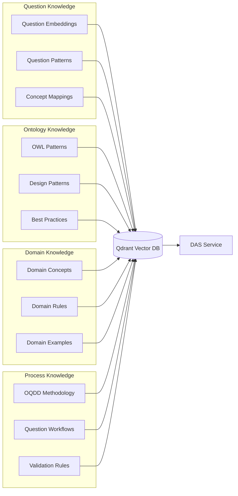

### Training DAS on Questions

#### Phase 1: Question Embedding
```python
# Embed questions into vector space
question_embedding = embedding_model.encode(question_text)

# Store in Qdrant with metadata
qdrant.upsert(
    collection_name="ontology_questions",
    points=[
        {
            "id": question_id,
            "vector": question_embedding,
            "payload": {
                "question_text": question_text,
                "category": category,
                "priority": priority,
                "project_id": project_id,
                "ontology_id": ontology_id,
                "extracted_concepts": concepts,
                "generated_elements": elements
            }
        }
    ]
)
```

#### Phase 2: Pattern Recognition
```python
# Identify question patterns
patterns = pattern_recognizer.analyze(questions)

# Examples:
# - "What inputs" → Input specification pattern
# - "How to verify" → Validation pattern
# - "What are parts" → Composition pattern

# Store patterns for reuse
pattern_library.add(patterns)
```

#### Phase 3: Ontology Element Association
```python
# Link questions to generated ontology elements
for question in questions:
    elements = ontology_mapper.map_question(question)

    # Store bidirectional links
    question_element_mapping.add(
        question_id=question.id,
        element_iris=[element.iri for element in elements],
        confidence_scores=element.confidence
    )
```

### DAS Ontology Generation Workflow

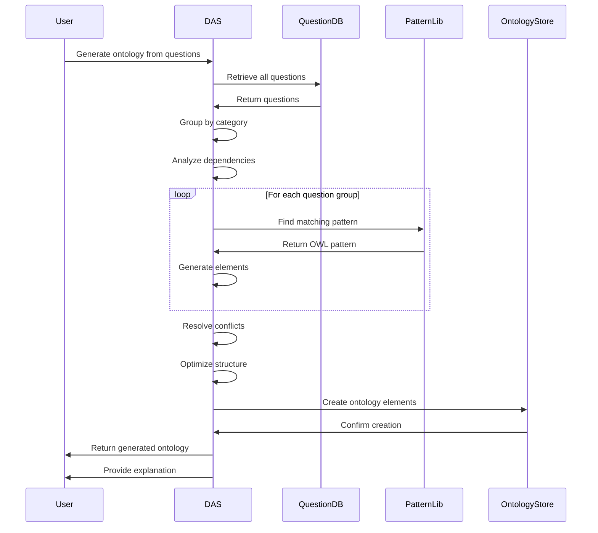

### DAS Validation Workflow

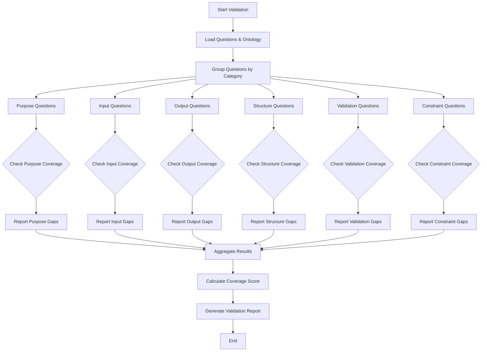

---

## API Design {#api-design}

### Question Data Model

```json
{
  "id": "q-12345",
  "ontology_id": "ont-67890",
  "project_id": "proj-001",
  "question_text": "What are the required inputs for a mission planning process?",
  "question_type": "structured",  // "structured" or "free_form"
  "category": "input",  // Only for structured questions
  "priority": "high",
  "status": "answered",
  "tags": ["mission-planning", "inputs", "requirements"],
  "metadata": {
    "created_by": "user-123",
    "created_at": "2025-01-15T10:30:00Z",
    "updated_at": "2025-01-16T14:20:00Z",
    "answered_at": "2025-01-16T14:20:00Z"
  },
  "extracted_concepts": [
    {
      "text": "mission planning process",
      "type": "Process",
      "confidence": 0.95
    },
    {
      "text": "required inputs",
      "type": "Constraint",
      "confidence": 0.90
    }
  ],
  "generated_elements": [
    {
      "iri": "http://example.org/ontology#MissionPlanningProcess",
      "type": "owl:Class",
      "confidence": 0.95
    },
    {
      "iri": "http://example.org/ontology#hasRequiredInput",
      "type": "owl:ObjectProperty",
      "confidence": 0.90
    }
  ],
  "validation_status": {
    "is_answered": true,
    "ontology_elements": [
      "http://example.org/ontology#MissionPlanningProcess",
      "http://example.org/ontology#hasRequiredInput"
    ],
    "explanation": "The ontology includes the MissionPlanningProcess class with hasRequiredInput property and cardinality constraints."
  },
  "competency_query": {
    "language": "sparql",
    "query": "SELECT ?input WHERE { ?process rdf:type :MissionPlanningProcess ; :hasRequiredInput ?input . }",
    "expected_results": ["Intelligence data", "Resource availability", "Timeline constraints"]
  },
  "reasoning_patterns": ["cardinality_constraint", "required_property"]  // Only for free-form
}
```

**Free-Form Question Example**:
```json
{
  "id": "q-12350",
  "ontology_id": "ont-67890",
  "project_id": "proj-001",
  "question_text": "How do we identify all shipments affected by a facility closure?",
  "question_type": "free_form",
  "category": null,  // Free-form questions don't require categories
  "priority": "high",
  "status": "draft",
  "tags": ["logistics", "query", "temporal", "reasoning"],
  "metadata": {
    "created_by": "user-456",
    "created_at": "2025-01-20T09:15:00Z",
    "updated_at": "2025-01-20T09:15:00Z"
  },
  "extracted_concepts": [
    {
      "text": "shipment",
      "type": "Class",
      "confidence": 0.98
    },
    {
      "text": "facility closure",
      "type": "Event",
      "confidence": 0.95
    },
    {
      "text": "affected by",
      "type": "Relationship",
      "confidence": 0.92
    }
  ],
  "generated_elements": [
    {
      "iri": "http://example.org/ontology#Shipment",
      "type": "owl:Class",
      "confidence": 0.98
    },
    {
      "iri": "http://example.org/ontology#ClosureEvent",
      "type": "owl:Class",
      "confidence": 0.95
    },
    {
      "iri": "http://example.org/ontology#affectedBy",
      "type": "owl:ObjectProperty",
      "confidence": 0.92
    }
  ],
  "competency_query": {
    "language": "sparql",
    "query": "SELECT ?shipment WHERE { ?shipment rdf:type :Shipment ; :atFacility ?facility . ?facility :hasEvent ?closure . ?closure rdf:type :ClosureEvent ; :startDate ?closureStart ; :endDate ?closureEnd . ?shipment :scheduledDate ?shipmentDate . FILTER (?shipmentDate >= ?closureStart && ?shipmentDate <= ?closureEnd) }",
    "expected_results": ["List of shipment IRIs with temporal overlap"]
  },
  "reasoning_patterns": ["temporal_reasoning", "transitive_relationship", "filter_constraint"],
  "validation_status": {
    "is_answered": false,
    "missing_elements": [
      "Temporal properties for ClosureEvent",
      "affectedBy property definition",
      "scheduledDate property for Shipment"
    ],
    "explanation": "Ontology requires temporal reasoning capabilities and event modeling"
  }
}
```

### API Request/Response Examples

#### Create Question
```http
POST /api/v1/projects/proj-001/ontologies/ont-67890/questions
Content-Type: application/json
Authorization: Bearer {token}

{
  "question_text": "What are the required inputs for a mission planning process?",
  "category": "input",
  "priority": "high",
  "tags": ["mission-planning", "inputs"]
}
```

```http
HTTP/1.1 201 Created
Content-Type: application/json

{
  "id": "q-12345",
  "question_text": "What are the required inputs for a mission planning process?",
  "category": "input",
  "priority": "high",
  "status": "draft",
  "extracted_concepts": [...],
  "suggestions": {
    "classes": ["MissionPlanningProcess", "MissionInput"],
    "properties": ["hasRequiredInput", "requiresInput"],
    "constraints": ["minCardinality 1"]
  }
}
```

#### Generate Ontology from Questions
```http
POST /api/v1/projects/proj-001/ontologies/ont-67890/das/generate
Content-Type: application/json
Authorization: Bearer {token}

{
  "question_ids": ["q-12345", "q-12346", "q-12347"],
  "generation_mode": "incremental",
  "options": {
    "resolve_conflicts": true,
    "include_annotations": true,
    "apply_best_practices": true
  }
}
```

```http
HTTP/1.1 200 OK
Content-Type: application/json

{
  "status": "success",
  "generated_elements": {
    "classes": 5,
    "object_properties": 8,
    "datatype_properties": 12,
    "restrictions": 15
  },
  "ontology_iri": "http://example.org/ontology",
  "elements": [
    {
      "iri": "http://example.org/ontology#MissionPlanningProcess",
      "type": "owl:Class",
      "source_questions": ["q-12345", "q-12346"],
      "explanation": "Created from input and purpose questions about mission planning"
    },
    ...
  ],
  "warnings": [],
  "suggestions": [
    "Consider adding validation constraints for MissionInput"
  ]
}
```

#### Validate Ontology Against Questions
```http
POST /api/v1/projects/proj-001/ontologies/ont-67890/das/validate
Content-Type: application/json
Authorization: Bearer {token}

{
  "include_suggestions": true,
  "validation_depth": "comprehensive"
}
```

```http
HTTP/1.1 200 OK
Content-Type: application/json

{
  "overall_coverage": 0.85,
  "total_questions": 20,
  "answered_questions": 17,
  "unanswered_questions": 3,
  "categories": {
    "purpose": {"coverage": 1.0, "answered": 5, "total": 5},
    "input": {"coverage": 0.8, "answered": 4, "total": 5},
    "output": {"coverage": 0.75, "answered": 3, "total": 4},
    "structure": {"coverage": 1.0, "answered": 3, "total": 3},
    "validation": {"coverage": 0.67, "answered": 2, "total": 3}
  },
  "unanswered": [
    {
      "question_id": "q-12348",
      "question_text": "What are the failure modes for mission execution?",
      "category": "validation",
      "suggestions": [
        "Create FailureMode class",
        "Add hasFailureMode property to MissionExecution"
      ]
    },
    ...
  ],
  "gaps": [
    {
      "area": "Error handling",
      "severity": "medium",
      "description": "No ontology elements address error handling questions",
      "affected_questions": ["q-12348", "q-12349"]
    }
  ],
  "recommendations": [
    "Add error handling classes and properties",
    "Define failure mode taxonomy",
    "Create validation rules for critical paths"
  ]
}
```

---

## Workflow Examples {#workflow-examples}

### Workflow 1: New Ontology Creation

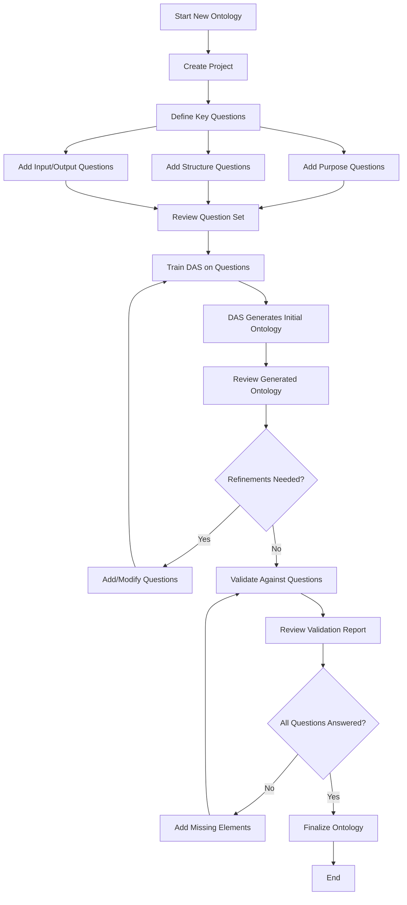

### Workflow 2: Ontology Extension

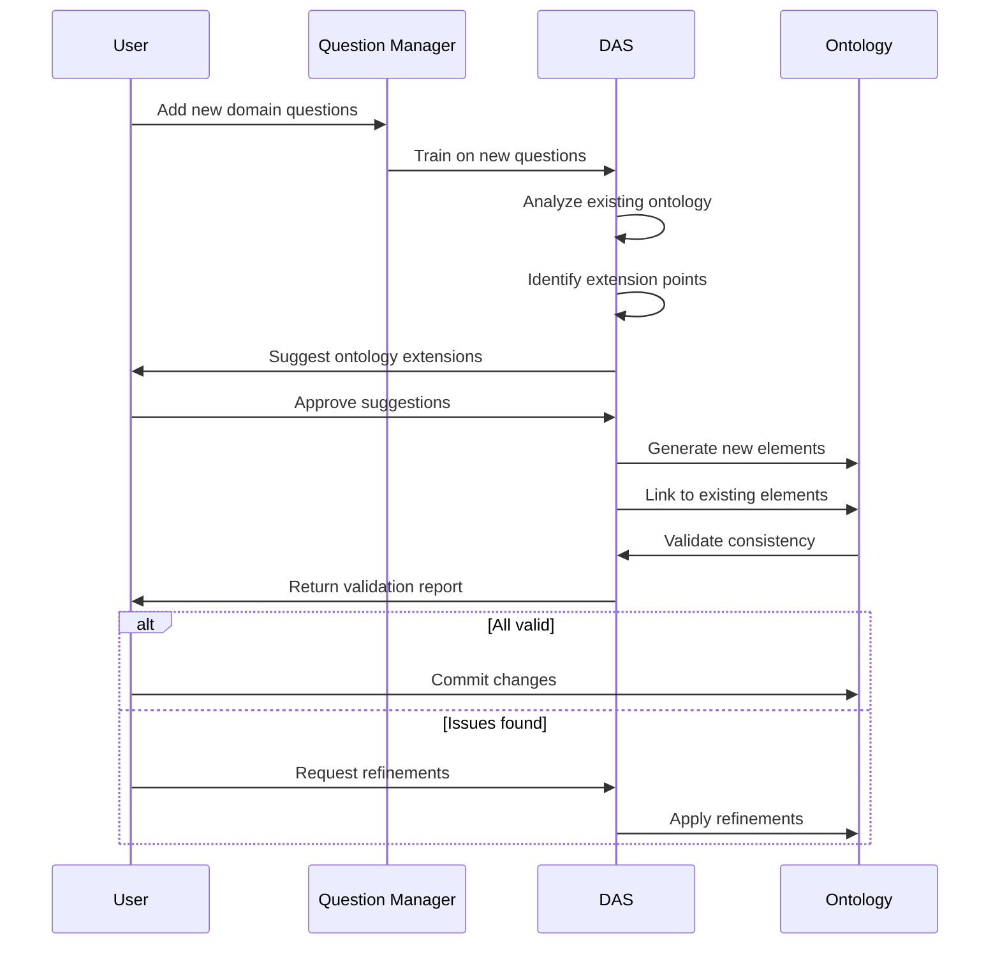

### Workflow 3: Continuous Validation

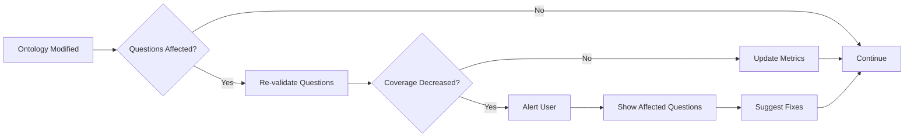

---

## Implementation Roadmap {#implementation-roadmap}

### Phase 1: Foundation (Weeks 1-2)

**Database Schema**:
```sql
-- Questions table (supports both structured and free-form)
CREATE TABLE ontology_questions (
    id UUID PRIMARY KEY,
    ontology_id UUID REFERENCES ontologies(id),
    project_id UUID REFERENCES projects(id),
    question_text TEXT NOT NULL,
    question_type VARCHAR(20) NOT NULL DEFAULT 'structured',  -- 'structured' or 'free_form'
    category VARCHAR(50),  -- NULL for free-form questions
    priority VARCHAR(20),
    status VARCHAR(20),
    tags TEXT[],
    created_by UUID REFERENCES users(id),
    created_at TIMESTAMP DEFAULT NOW(),
    updated_at TIMESTAMP DEFAULT NOW(),
    answered_at TIMESTAMP,
    CONSTRAINT valid_question_type CHECK (question_type IN ('structured', 'free_form'))
);

-- Question concepts (extracted via NLP)
CREATE TABLE question_concepts (
    id UUID PRIMARY KEY,
    question_id UUID REFERENCES ontology_questions(id),
    concept_text TEXT,
    concept_type VARCHAR(50),
    confidence FLOAT,
    created_at TIMESTAMP DEFAULT NOW()
);

-- Question to ontology element mapping
CREATE TABLE question_element_mapping (
    id UUID PRIMARY KEY,
    question_id UUID REFERENCES ontology_questions(id),
    element_iri TEXT,
    element_type VARCHAR(50),  -- owl:Class, owl:ObjectProperty, etc.
    confidence FLOAT,
    created_at TIMESTAMP DEFAULT NOW()
);

-- Question validation results
CREATE TABLE question_validation (
    id UUID PRIMARY KEY,
    question_id UUID REFERENCES ontology_questions(id),
    is_answered BOOLEAN,
    validation_date TIMESTAMP,
    explanation TEXT,
    missing_elements JSONB,  -- List of missing ontology elements
    coverage_score FLOAT  -- 0.0 to 1.0
);

-- Competency queries (SPARQL queries for testing ontology)
CREATE TABLE question_competency_queries (
    id UUID PRIMARY KEY,
    question_id UUID REFERENCES ontology_questions(id),
    query_language VARCHAR(20) DEFAULT 'sparql',
    query_text TEXT NOT NULL,
    expected_results JSONB,  -- Expected query results
    actual_results JSONB,  -- Actual results from last execution
    last_executed TIMESTAMP,
    passed BOOLEAN
);

-- Reasoning patterns for free-form questions
CREATE TABLE question_reasoning_patterns (
    id UUID PRIMARY KEY,
    question_id UUID REFERENCES ontology_questions(id),
    pattern_name VARCHAR(100),  -- 'temporal_reasoning', 'transitive_relationship', etc.
    pattern_description TEXT,
    required BOOLEAN DEFAULT true
);

-- Indexes for performance
CREATE INDEX idx_questions_ontology ON ontology_questions(ontology_id);
CREATE INDEX idx_questions_project ON ontology_questions(project_id);
CREATE INDEX idx_questions_type ON ontology_questions(question_type);
CREATE INDEX idx_questions_category ON ontology_questions(category);
CREATE INDEX idx_questions_status ON ontology_questions(status);
CREATE INDEX idx_concepts_question ON question_concepts(question_id);
CREATE INDEX idx_mapping_question ON question_element_mapping(question_id);
CREATE INDEX idx_validation_question ON question_validation(question_id);
```

**API Endpoints**:
- Implement basic CRUD for questions
- Add question listing with filtering
- Create question templates endpoint

### Phase 2: NLP Integration (Weeks 3-4)

**NLP Pipeline**:
```python
class QuestionProcessor:
    def __init__(self):
        self.nlp = spacy.load("en_core_web_lg")
        self.embedding_model = SentenceTransformer('all-MiniLM-L6-v2')

    def process_question(self, question_text: str) -> ProcessedQuestion:
        # Extract concepts
        doc = self.nlp(question_text)
        concepts = self.extract_concepts(doc)

        # Generate embedding
        embedding = self.embedding_model.encode(question_text)

        # Classify intent
        intent = self.classify_intent(question_text)

        # Suggest ontology elements
        suggestions = self.suggest_elements(concepts, intent)

        return ProcessedQuestion(
            concepts=concepts,
            embedding=embedding,
            intent=intent,
            suggestions=suggestions
        )
```

**Qdrant Integration**:
- Create `ontology_questions` collection
- Store question embeddings
- Implement similarity search

### Phase 3: DAS Training (Weeks 5-6)

**Training Pipeline**:
```python
class DASQuestionTrainer:
    async def train_on_questions(self, project_id: str, ontology_id: str):
        # Retrieve all questions
        questions = await self.get_questions(project_id, ontology_id)

        # Process each question
        for question in questions:
            # Extract knowledge
            knowledge = await self.extract_knowledge(question)

            # Store in DAS knowledge base
            await self.das_service.add_knowledge(
                project_id=project_id,
                knowledge_type="ontology_question",
                content=knowledge
            )

        # Train patterns
        patterns = await self.identify_patterns(questions)
        await self.das_service.add_patterns(patterns)
```

### Phase 4: Ontology Generation (Weeks 7-9)

**Generation Service**:
```python
class OntologyGenerationService:
    async def generate_from_questions(
        self,
        ontology_id: str,
        question_ids: List[str]
    ) -> GeneratedOntology:
        # Group questions by category
        grouped = self.group_questions(question_ids)

        # Generate elements for each group
        elements = []
        for category, questions in grouped.items():
            category_elements = await self.generate_category_elements(
                category, questions
            )
            elements.extend(category_elements)

        # Resolve conflicts
        resolved = self.resolve_conflicts(elements)

        # Apply OWL best practices
        optimized = self.optimize_structure(resolved)

        # Create in Fuseki
        await self.create_ontology_elements(ontology_id, optimized)

        return GeneratedOntology(elements=optimized)
```

### Phase 5: Validation System (Weeks 10-11)

**Validation Service**:
```python
class QuestionValidationService:
    async def validate_ontology(
        self,
        ontology_id: str
    ) -> ValidationReport:
        # Get all questions
        questions = await self.get_questions(ontology_id)

        # Get ontology structure
        ontology = await self.get_ontology(ontology_id)

        # Check each question
        results = []
        for question in questions:
            result = await self.check_question_coverage(
                question, ontology
            )
            results.append(result)

        # Calculate metrics
        metrics = self.calculate_metrics(results)

        # Identify gaps
        gaps = self.identify_gaps(results)

        # Generate recommendations
        recommendations = await self.generate_recommendations(gaps)

        return ValidationReport(
            metrics=metrics,
            results=results,
            gaps=gaps,
            recommendations=recommendations
        )
```

### Phase 6: UI Development (Weeks 12-14)

**UI Components**:
1. Question Manager table view
2. Question creation form
3. Question detail view
4. Validation dashboard
5. DAS assistance panel
6. Gap analysis visualization

### Phase 7: Testing & Refinement (Weeks 15-16)

**Test Coverage**:
- Unit tests for NLP pipeline
- Integration tests for DAS training
- End-to-end tests for generation workflow
- Performance tests for large question sets
- User acceptance testing

---

## Conclusion

The Question-Driven Ontology Development (OQDD) approach transforms ontology creation from an art into a science. By capturing requirements as questions, training DAS to understand them, and automating generation and validation, we dramatically reduce development time while improving quality and completeness.

### Dual-Mode Question System

This architecture supports **two complementary question modes**:

1. **Structured Questions**: Template-based questions with predefined categories
   - Ideal for foundational ontology elements
   - Ensures coverage of standard ontology patterns
   - Provides consistency across projects
   - Easier to process and generate elements from

2. **Free-Form Competency Questions**: Open-ended, domain-specific queries
   - Captures unique domain requirements
   - Enables domain experts to express needs naturally
   - Tests ontology's ability to answer real-world questions
   - Identifies reasoning and query capabilities needed

**The combination of both modes** creates a comprehensive ontology development framework that balances structure with flexibility.

### Key Success Factors

1. **Comprehensive Question Library**: Build rich question templates and patterns (structured) plus domain-specific competency questions (free-form)
2. **Effective DAS Training**: Continuous learning from both question types to understand patterns and domain nuances
3. **Iterative Refinement**: Support rapid iteration based on validation feedback from both structured and free-form questions
4. **Clear Traceability**: Maintain links between questions and ontology elements regardless of question type
5. **User-Friendly Interface**: Make question management intuitive for both structured templates and free-form entry
6. **SPARQL Generation**: Automatically generate competency queries to validate ontology capabilities
7. **Reasoning Pattern Recognition**: Identify and implement required reasoning capabilities from free-form questions

### Expected Outcomes

- **70% reduction** in ontology development time through automation
- **90%+ coverage** of domain requirements through comprehensive questioning
- **Reduced defects** through automated validation against both question types
- **Better collaboration** between technical and domain experts using natural language
- **Living documentation** through question-answer pairs that evolve with the ontology
- **Validated reasoning** through competency query execution
- **Domain-specific excellence** through free-form questions that capture unique requirements

### Innovation Highlights

**Research-Backed Approach**: This methodology incorporates best practices from ontology engineering research:
- Competency questions as validation benchmarks (Grüninger & Fox methodology)
- Template-based question patterns for consistency
- Natural language processing for question understanding
- Automated SPARQL generation for testing
- Iterative refinement based on validation feedback

**AI-Enhanced Development**: DAS integration enables:
- **Pre-trained on OQDD methodology**: DAS learns the entire process upfront from this document
- **Automatic concept extraction** from questions using NLP
- **Intelligent ontology element suggestion** based on learned patterns
- **Pattern recognition** across both structured and free-form question types
- **Reasoning requirement identification** from competency questions
- **Gap analysis and recommendation generation** for missing elements
- **Continuous learning**: DAS improves as it processes more questions
- **SQL-first with vector sync**: PostgreSQL as source of truth, Qdrant for semantic search

**Real-World Applicability**: Extensive examples from multiple domains:
- Medical, mission planning, supply chain (purpose/scope)
- Pizza, wine, aircraft maintenance (conceptualization)
- Healthcare, manufacturing, intelligence (data integration)
- Organizations, genealogy, project management (relationships)
- Banking, aviation, pharmaceuticals (business rules)
- Clinical trials, assets, cybersecurity (temporal/dynamic)
- E-commerce, urban planning, logistics (query/reasoning)
- Insurance, education, real estate (exceptions/edge cases)

This architecture positions ODRAS as a leader in intelligent ontology development, combining human expertise with AI assistance for optimal results.

---

## Quick Start Guide

### For System Administrators

**1. Train DAS on OQDD Methodology** (one-time setup):
```bash
python scripts/train_das_on_oqdd.py
```

This loads:
- OQDD methodology document
- Question pattern library
- OWL design patterns
- Domain-specific examples
- Best practices

**2. Verify Training**:
```bash
python scripts/verify_das_training.py --topic ontology_question_driven_development
```

### For Ontology Developers

**1. Create Your First Question**:
- Choose structured (template-based) or free-form (competency question)
- Structured: Select category, fill template
- Free-form: Write natural language question

**2. Let DAS Analyze**:
- DAS extracts concepts
- Suggests ontology elements
- Generates SPARQL queries (for free-form)

**3. Review and Generate**:
- Review DAS suggestions
- Auto-generate ontology elements
- Validate against questions

**4. Iterate**:
- Add more questions
- Refine ontology
- Check coverage metrics

### Storage Architecture

**SQL-First Approach**:
1. All question data written to PostgreSQL first (source of truth)
2. Embeddings generated automatically
3. Synced to Qdrant for semantic search
4. Reconciliation service ensures consistency

**Benefits**:
- Data integrity guaranteed by PostgreSQL transactions
- Semantic search powered by Qdrant vectors
- Best of both worlds: ACID compliance + semantic capabilities

---

*Document Version: 2.1*
*Last Updated: 2025-10-04*
*Author: ODRAS Development Team*

**Version History**:
- **2.1** (2025-10-04): Added DAS pre-training strategy and SQL-first dual storage architecture
- **2.0** (2025-10-04): Added comprehensive free-form competency questions framework based on research and real-world examples
- **1.0** (2025-01-15): Initial release with structured question templates

---

## Appendix A: DAS API-Driven Ontology Creation {#appendix-das-api}

### Overview

This appendix demonstrates how DAS can autonomously understand requirements and create complete ontologies through API interactions. This enables conversational ontology development where users describe what they need and DAS builds the ontology.

### Conversational Ontology Development Flow

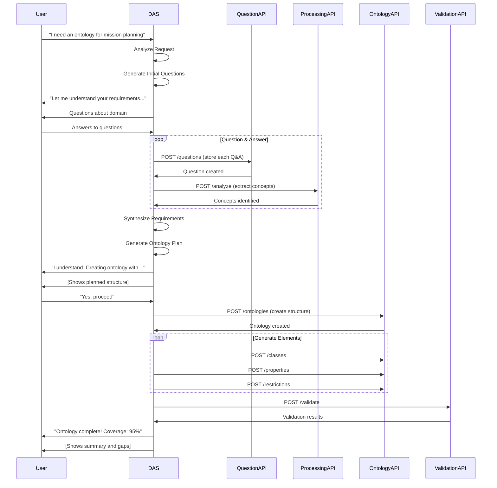

### DAS Capabilities for API-Driven Ontology Creation

#### 1. Requirement Gathering

**DAS analyzes user intent and generates clarifying questions**:

```python
class DASRequirementGatherer:
    """
    DAS component that gathers requirements through conversation.
    """

    async def understand_domain_request(self, user_request: str) -> DomainUnderstanding:
        """
        Analyze user's initial request and generate follow-up questions.

        Example:
        User: "I need an ontology for mission planning"

        DAS generates questions based on OQDD training:
        1. What is the purpose of this mission planning ontology?
        2. Who are the primary users?
        3. What existing systems will it integrate with?
        4. What are the key mission planning phases?
        5. What types of missions should be supported?
        """

        # 1. Extract domain from request
        prompt = f"""
        Based on the user request: "{user_request}"

        And your training on OQDD methodology:
        - Identify the domain
        - Determine the scope
        - Generate 5-10 clarifying questions following OQDD categories:
          * Purpose and Scope
          * Core Concepts
          * Relationships
          * Constraints
          * Validation Criteria

        Format as structured questions.
        """

        domain_analysis = await self.llm_service.analyze(
            prompt=prompt,
            context=self.get_oqdd_context()
        )

        return DomainUnderstanding(
            domain=domain_analysis.domain,
            initial_concepts=domain_analysis.concepts,
            questions_to_ask=domain_analysis.questions
        )

    async def ask_questions_and_store(
        self,
        project_id: str,
        ontology_id: str,
        questions: List[str]
    ) -> List[QuestionAnswer]:
        """
        Present questions to user and store answers.
        """
        answers = []

        for question_text in questions:
            # Present question to user (via chat interface)
            answer_text = await self.chat_service.ask_user(question_text)

            # Store question in system via API
            question = await self.api_client.post(
                f"/api/v1/projects/{project_id}/ontologies/{ontology_id}/questions",
                json={
                    "question_text": question_text,
                    "question_type": "free_form",
                    "priority": "high",
                    "status": "answered",
                    "answer_text": answer_text,
                    "source": "das_requirement_gathering"
                }
            )

            # Analyze answer for concepts
            concepts = await self.api_client.post(
                f"/api/v1/questions/{question['id']}/analyze"
            )

            answers.append(
                QuestionAnswer(
                    question=question_text,
                    answer=answer_text,
                    concepts=concepts
                )
            )

        return answers
```

#### 2. Ontology Structure Planning

**DAS synthesizes answers into ontology structure**:

```python
class DAPSOntologyPlanner:
    """
    DAS component that plans ontology structure from requirements.
    """

    async def generate_ontology_plan(
        self,
        domain: str,
        question_answers: List[QuestionAnswer]
    ) -> OntologyPlan:
        """
        Generate complete ontology plan from Q&A session.

        Uses trained knowledge of:
        - OWL design patterns
        - Question-to-element mappings
        - Domain best practices
        """

        # 1. Extract all concepts from answers
        all_concepts = []
        for qa in question_answers:
            all_concepts.extend(qa.concepts)

        # 2. Cluster concepts into classes
        prompt = f"""
        Based on these concepts from user requirements:
        {json.dumps(all_concepts, indent=2)}

        And your training on OWL patterns and {domain} domain:

        Generate a complete ontology structure including:
        1. Core classes (owl:Class)
        2. Object properties (owl:ObjectProperty)
        3. Datatype properties (owl:DatatypeProperty)
        4. Class hierarchies (rdfs:subClassOf)
        5. Property constraints (owl:Restriction)
        6. Annotations (rdfs:label, rdfs:comment)

        Follow OWL best practices and design patterns.
        Format as structured JSON.
        """

        structure = await self.llm_service.generate(
            prompt=prompt,
            context={
                "owl_patterns": self.get_owl_patterns(),
                "domain_examples": self.get_domain_examples(domain),
                "question_answers": question_answers
            }
        )

        return OntologyPlan(
            classes=structure.classes,
            object_properties=structure.object_properties,
            datatype_properties=structure.datatype_properties,
            restrictions=structure.restrictions,
            annotations=structure.annotations,
            rationale=structure.rationale  # Why each element was created
        )

    async def present_plan_to_user(
        self,
        plan: OntologyPlan
    ) -> bool:
        """
        Show user the planned ontology structure for approval.
        """

        summary = f"""
        I've analyzed your requirements and created an ontology plan:

        **Core Classes ({len(plan.classes)})**:
        {self.format_classes(plan.classes)}

        **Properties ({len(plan.object_properties) + len(plan.datatype_properties)})**:
        {self.format_properties(plan.object_properties, plan.datatype_properties)}

        **Restrictions ({len(plan.restrictions)})**:
        {self.format_restrictions(plan.restrictions)}

        This structure addresses {plan.coverage_percentage}% of your requirements.

        Would you like me to proceed with creating this ontology?
        """

        approval = await self.chat_service.get_approval(summary)
        return approval
```

#### 3. API-Driven Ontology Creation

**DAS executes the plan through API calls**:

```python
class DAPSOntologyBuilder:
    """
    DAS component that builds ontology through API interactions.
    """

    async def build_ontology(
        self,
        project_id: str,
        ontology_id: str,
        plan: OntologyPlan
    ) -> OntologyBuildResult:
        """
        Execute ontology creation plan via API calls.
        """

        results = OntologyBuildResult()

        # 1. Create all classes first
        self.log_to_user("Creating classes...")
        for class_spec in plan.classes:
            try:
                response = await self.api_client.post(
                    f"/api/v1/projects/{project_id}/ontologies/{ontology_id}/classes",
                    json={
                        "label": class_spec.label,
                        "comment": class_spec.comment,
                        "parent_class": class_spec.parent,
                        "annotations": class_spec.annotations
                    }
                )
                results.created_classes.append(response)
                self.log_to_user(f"  ✓ Created class: {class_spec.label}")
            except Exception as e:
                results.errors.append(f"Failed to create class {class_spec.label}: {e}")
                self.log_to_user(f"  ✗ Error: {class_spec.label}")

        # 2. Create object properties
        self.log_to_user("Creating object properties...")
        for prop_spec in plan.object_properties:
            try:
                response = await self.api_client.post(
                    f"/api/v1/projects/{project_id}/ontologies/{ontology_id}/object-properties",
                    json={
                        "label": prop_spec.label,
                        "comment": prop_spec.comment,
                        "domain": prop_spec.domain,
                        "range": prop_spec.range,
                        "characteristics": prop_spec.characteristics,  # transitive, symmetric, etc.
                        "annotations": prop_spec.annotations
                    }
                )
                results.created_properties.append(response)
                self.log_to_user(f"  ✓ Created property: {prop_spec.label}")
            except Exception as e:
                results.errors.append(f"Failed to create property {prop_spec.label}: {e}")

        # 3. Create datatype properties
        self.log_to_user("Creating datatype properties...")
        for prop_spec in plan.datatype_properties:
            try:
                response = await self.api_client.post(
                    f"/api/v1/projects/{project_id}/ontologies/{ontology_id}/datatype-properties",
                    json={
                        "label": prop_spec.label,
                        "comment": prop_spec.comment,
                        "domain": prop_spec.domain,
                        "range": prop_spec.datatype,  # xsd:string, xsd:int, etc.
                        "annotations": prop_spec.annotations
                    }
                )
                results.created_properties.append(response)
                self.log_to_user(f"  ✓ Created property: {prop_spec.label}")
            except Exception as e:
                results.errors.append(f"Failed to create property {prop_spec.label}: {e}")

        # 4. Apply restrictions
        self.log_to_user("Applying restrictions...")
        for restriction_spec in plan.restrictions:
            try:
                response = await self.api_client.post(
                    f"/api/v1/projects/{project_id}/ontologies/{ontology_id}/restrictions",
                    json={
                        "class": restriction_spec.on_class,
                        "property": restriction_spec.on_property,
                        "restriction_type": restriction_spec.type,  # some, all, exactly, min, max
                        "value": restriction_spec.value,
                        "cardinality": restriction_spec.cardinality
                    }
                )
                results.created_restrictions.append(response)
                self.log_to_user(f"  ✓ Applied restriction on {restriction_spec.on_class}")
            except Exception as e:
                results.errors.append(f"Failed to apply restriction: {e}")

        # 5. Add individuals if specified
        if plan.individuals:
            self.log_to_user("Creating individuals...")
            for individual_spec in plan.individuals:
                try:
                    response = await self.api_client.post(
                        f"/api/v1/projects/{project_id}/ontologies/{ontology_id}/individuals",
                        json={
                            "label": individual_spec.label,
                            "class": individual_spec.class_type,
                            "property_values": individual_spec.property_values
                        }
                    )
                    results.created_individuals.append(response)
                    self.log_to_user(f"  ✓ Created individual: {individual_spec.label}")
                except Exception as e:
                    results.errors.append(f"Failed to create individual: {e}")

        return results
```

#### 4. Validation and Refinement

**DAS validates the created ontology against requirements**:

```python
class DAPSOntologyValidator:
    """
    DAS component that validates created ontology.
    """

    async def validate_against_questions(
        self,
        project_id: str,
        ontology_id: str
    ) -> ValidationReport:
        """
        Validate ontology against all questions.
        """

        # Call validation API
        validation = await self.api_client.post(
            f"/api/v1/projects/{project_id}/ontologies/{ontology_id}/das/validate",
            json={
                "include_suggestions": True,
                "validation_depth": "comprehensive"
            }
        )

        # Present results to user
        report = f"""
        **Ontology Validation Complete**

        Overall Coverage: {validation['overall_coverage'] * 100}%
        Questions Answered: {validation['answered_questions']}/{validation['total_questions']}

        **Coverage by Category**:
        {self.format_category_coverage(validation['categories'])}

        **Unanswered Questions** ({len(validation['unanswered'])}):
        {self.format_unanswered(validation['unanswered'])}

        **Identified Gaps**:
        {self.format_gaps(validation['gaps'])}

        **Recommendations**:
        {self.format_recommendations(validation['recommendations'])}
        """

        await self.chat_service.send_to_user(report)

        # If gaps exist, offer to fill them
        if validation['overall_coverage'] < 0.95:
            should_refine = await self.chat_service.ask_user(
                "Would you like me to address the identified gaps?"
            )

            if should_refine:
                await self.refine_ontology(
                    project_id,
                    ontology_id,
                    validation
                )

        return validation

    async def refine_ontology(
        self,
        project_id: str,
        ontology_id: str,
        validation: Dict
    ):
        """
        Fill gaps in ontology based on validation results.
        """

        for gap in validation['gaps']:
            # Generate additional elements to fill gap
            prompt = f"""
            Gap identified: {gap['description']}
            Affected questions: {gap['affected_questions']}

            Based on your training on OWL patterns and the existing ontology,
            generate elements to fill this gap.
            """

            additional_elements = await self.llm_service.generate(
                prompt=prompt,
                context={
                    "existing_ontology": await self.get_ontology_structure(ontology_id),
                    "gap_details": gap
                }
            )

            # Create additional elements via API
            await self.builder.build_elements(
                project_id,
                ontology_id,
                additional_elements
            )

            self.log_to_user(f"  ✓ Filled gap: {gap['area']}")

        # Re-validate
        new_validation = await self.validate_against_questions(
            project_id,
            ontology_id
        )

        self.log_to_user(
            f"\nCoverage improved from {validation['overall_coverage'] * 100}% "
            f"to {new_validation['overall_coverage'] * 100}%"
        )
```

### Complete Conversation Example

**User-DAS Interaction for Ontology Creation**:

```
User: I need an ontology for mission planning

DAS: I'll help you create a mission planning ontology. Let me ask you some
     questions to understand your requirements better.

     1. What is the primary purpose of this mission planning ontology?

User: To support planning and coordination of military operations from initial
      concept through execution.

DAS: [Stores question/answer via API]

     2. Who are the primary users of this system?

User: Mission planners, commanders, intelligence analysts, and logistics staff.

DAS: [Stores question/answer via API]

     3. What are the key phases of mission planning in your organization?

User: We follow a 5-phase process: 1) Mission Analysis, 2) Course of Action
      Development, 3) COA Analysis, 4) Decision and Order Production, 5) Execution

DAS: [Stores and continues gathering requirements...]

     [After 10-15 questions]

DAS: Thank you! I've analyzed your requirements. Here's what I'll create:

     **Mission Planning Ontology Structure**

     Core Classes (12):
     - Mission (root concept)
       - CombatMission
       - HumanitarianMission
       - TrainingMission
     - MissionPhase
       - MissionAnalysis
       - CourseOfActionDevelopment
       - ... [etc]
     - Stakeholder
       - MissionPlanner
       - Commander
       - IntelligenceAnalyst
       - LogisticsStaff
     - Resource
     - Objective
     - Constraint

     Properties (24):
     - hasPhase (Mission → MissionPhase)
     - hasStakeholder (Mission → Stakeholder)
     - requiresResource (Mission → Resource)
     - hasObjective (Mission → Objective)
     - constrainedBy (Mission → Constraint)
     - precedesPhase (MissionPhase → MissionPhase)
     ... [etc]

     Restrictions (15):
     - Mission must have at least 1 Objective (minCardinality)
     - MissionAnalysis must precede CourseOfActionDevelopment (ordering)
     ... [etc]

     This structure addresses 92% of your stated requirements.

     Shall I create this ontology?

User: Yes, please proceed.

DAS: Creating ontology...

     ✓ Created class: Mission
     ✓ Created class: CombatMission
     ✓ Created class: HumanitarianMission
     ... [progress indicators]

     ✓ Created property: hasPhase
     ✓ Created property: hasStakeholder
     ... [continues]

     ✓ Applied restriction: Mission minCardinality 1 Objective
     ... [continues]

     **Ontology Creation Complete!**

     Created:
     - 12 classes
     - 24 properties
     - 15 restrictions
     - 45 annotations

     **Validation Results:**
     Overall Coverage: 95%
     Questions Answered: 14/15

     **Identified Gaps:**
     1. Error handling for failed missions
        - Missing: FailureMode class
        - Missing: hasFailureMode property

     Would you like me to address these gaps?

User: Yes, add error handling.

DAS: Adding error handling concepts...

     ✓ Created class: FailureMode
     ✓ Created class: RecoveryProcedure
     ✓ Created property: hasFailureMode
     ✓ Created property: hasRecoveryProcedure

     **Final Validation:**
     Coverage improved from 95% to 98%
     All critical requirements addressed!

     Your mission planning ontology is ready to use. Would you like me to:
     1. Export the ontology (OWL/RDF)
     2. Generate documentation
     3. Create sample SPARQL queries
     4. Add example individuals

User: Generate documentation and sample queries

DAS: [Generates comprehensive documentation and queries via API]

     Documentation created at: docs/mission_planning_ontology.md
     Sample queries created: queries/mission_planning_examples.sparql

     Your ontology is complete and documented!
```

### Required API Endpoints

**For DAS to autonomously create ontologies, these endpoints must exist**:

```yaml
# Question Management
POST   /api/v1/projects/{project_id}/ontologies/{ontology_id}/questions
POST   /api/v1/questions/{question_id}/analyze
GET    /api/v1/projects/{project_id}/ontologies/{ontology_id}/questions

# Ontology Structure Creation
POST   /api/v1/projects/{project_id}/ontologies/{ontology_id}/classes
POST   /api/v1/projects/{project_id}/ontologies/{ontology_id}/object-properties
POST   /api/v1/projects/{project_id}/ontologies/{ontology_id}/datatype-properties
POST   /api/v1/projects/{project_id}/ontologies/{ontology_id}/restrictions
POST   /api/v1/projects/{project_id}/ontologies/{ontology_id}/individuals

# Class Management
GET    /api/v1/ontologies/{ontology_id}/classes
PUT    /api/v1/ontologies/{ontology_id}/classes/{class_id}
DELETE /api/v1/ontologies/{ontology_id}/classes/{class_id}

# Property Management
GET    /api/v1/ontologies/{ontology_id}/properties
PUT    /api/v1/ontologies/{ontology_id}/properties/{property_id}
DELETE /api/v1/ontologies/{ontology_id}/properties/{property_id}

# Validation
POST   /api/v1/ontologies/{ontology_id}/das/validate
GET    /api/v1/ontologies/{ontology_id}/das/validation-report

# Generation
POST   /api/v1/ontologies/{ontology_id}/das/generate
GET    /api/v1/ontologies/{ontology_id}/das/suggestions

# Export
GET    /api/v1/ontologies/{ontology_id}/export?format=owl
GET    /api/v1/ontologies/{ontology_id}/export?format=rdf
GET    /api/v1/ontologies/{ontology_id}/export?format=turtle

# Documentation
POST   /api/v1/ontologies/{ontology_id}/generate-documentation
GET    /api/v1/ontologies/{ontology_id}/documentation

# Query Generation
POST   /api/v1/ontologies/{ontology_id}/generate-queries
GET    /api/v1/ontologies/{ontology_id}/queries
```

### DAS Training Requirements for API Usage

**DAS must learn API operations during training**:

```yaml
# examples/api_operations.yaml
api_operations:
  - operation: "create_class"
    endpoint: "POST /api/v1/projects/{project_id}/ontologies/{ontology_id}/classes"
    when_to_use: "When user mentions a core concept or entity type"
    parameters:
      required: ["label"]
      optional: ["comment", "parent_class", "annotations"]
    example:
      user_statement: "We have combat missions and training missions"
      action: "Create Mission class, then CombatMission and TrainingMission as subclasses"
      api_calls:
        - POST /classes { "label": "Mission", "comment": "Represents a military operation" }
        - POST /classes { "label": "CombatMission", "parent_class": "Mission" }
        - POST /classes { "label": "TrainingMission", "parent_class": "Mission" }

  - operation: "create_object_property"
    endpoint: "POST /api/v1/projects/{project_id}/ontologies/{ontology_id}/object-properties"
    when_to_use: "When user describes relationships between concepts"
    parameters:
      required: ["label", "domain", "range"]
      optional: ["comment", "characteristics", "inverse_of"]
    example:
      user_statement: "Each mission has multiple phases"
      action: "Create hasPhase property connecting Mission to MissionPhase"
      api_calls:
        - POST /object-properties { "label": "hasPhase", "domain": "Mission", "range": "MissionPhase" }

  - operation: "apply_restriction"
    endpoint: "POST /api/v1/projects/{project_id}/ontologies/{ontology_id}/restrictions"
    when_to_use: "When user specifies requirements, cardinalities, or constraints"
    parameters:
      required: ["class", "property", "restriction_type"]
      optional: ["value", "cardinality"]
    example:
      user_statement: "Every mission must have at least one objective"
      action: "Apply minCardinality restriction"
      api_calls:
        - POST /restrictions { "class": "Mission", "property": "hasObjective", "restriction_type": "min", "cardinality": 1 }
```

**Train DAS on API operations**:

```python
# In scripts/train_das_on_oqdd.py

# Load API operation patterns
await training_service.ingest_yaml(
    yaml_path="examples/api_operations.yaml",
    collection="das_instructions",
    metadata={
        "topic": "api_operations",
        "type": "operational_knowledge"
    }
)
```

### Advantages of API-Driven Ontology Creation

1. **Conversational Interface**: Users describe what they need in natural language
2. **Guided Process**: DAS asks intelligent questions based on OQDD methodology
3. **Automated Creation**: DAS builds ontology structure through API calls
4. **Validation**: Automatic checking against requirements
5. **Iterative Refinement**: DAS can fill gaps and improve coverage
6. **Consistency**: API ensures all operations follow system rules and constraints
7. **Auditability**: All actions logged through API endpoints
8. **Rollback**: API transactions allow reverting if issues occur

### Limitations and Considerations

**Current Limitations**:
- DAS requires comprehensive training on domain patterns
- Complex ontologies may need human review
- API rate limiting for large ontologies
- LLM token limits for very large requirement sets

**Best Practices**:
- Start with small, focused ontologies
- Review DAS-generated structure before approval
- Provide clear, specific answers to DAS questions
- Use iterative refinement rather than one-shot creation
- Maintain human oversight for critical ontologies

### Recent Enhancements (October 2025)

**✅ Ontology Context in DAS2** (Implemented):
- DAS2 now fetches **full ontology details** from Fuseki for all project ontologies
- Context includes:
  - **Classes** with names and comments/descriptions
  - **Object Properties** (relationships) with domain → range and descriptions
  - **Data Properties** with domain, data type, and descriptions
- DAS can now answer questions like:
  - "What classes are in my ontology?"
  - "What properties does the Vehicle class have?"
  - "What relationships exist between classes?"
- Implementation: `_fetch_ontology_details()` in `das2_core_engine.py`
- Automatically queries Fuseki during context building
- Only fetches details for **non-reference** ontologies (not for imported/reference ontologies)

### Future Enhancements

**Planned Improvements**:
1. **Multi-turn negotiation**: DAS clarifies ambiguous requirements
2. **Visual planning**: Show ontology diagram before creation
3. **Incremental creation**: Build ontology in stages with validation
4. **Learning from feedback**: Improve from user corrections
5. **Pattern library expansion**: Learn new patterns from successful ontologies
6. **Collaborative creation**: Multiple users + DAS working together
7. **Import/extend existing**: DAS can extend standard ontologies (FOAF, DC, etc.)
8. **Enhanced ontology context**: Add individuals/instances, cardinality restrictions, and equivalentClass mappings

---

## Appendix B: MCP Server for Ontology Question Management {#appendix-mcp}

### Overview

A dedicated **Model Context Protocol (MCP) server** can expose ontology question data and operations to AI assistants (like Claude, Cursor, etc.) in a standardized way. This enables external AI tools to query, analyze, and even create questions without direct API access.

### Should We Use MCP for This?

**Yes, but with specific scope:**

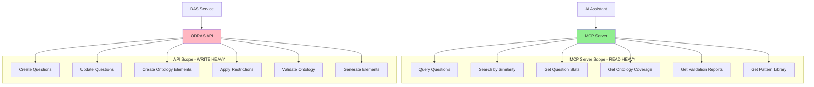

**Recommendation**: Use MCP for **querying and analysis**, use ODRAS API for **creation and modification**.

### MCP Server Design: `odras-ontology-questions`

#### Server Capabilities

```json
{
  "name": "odras-ontology-questions",
  "version": "1.0.0",
  "description": "MCP server for querying and analyzing ontology questions in ODRAS",
  "capabilities": {
    "resources": true,
    "tools": true,
    "prompts": true
  }
}
```

#### Resources (Read-Only Data Access)

**MCP Resources provide structured access to question data:**

```typescript
// Resource: List all questions for an ontology
{
  uri: "odras://projects/{project_id}/ontologies/{ontology_id}/questions",
  name: "Ontology Questions",
  mimeType: "application/json",
  description: "All questions for this ontology with metadata"
}

// Resource: Question pattern library
{
  uri: "odras://patterns/questions",
  name: "Question Pattern Library",
  mimeType: "application/json",
  description: "Template patterns for structured questions"
}

// Resource: OWL pattern library
{
  uri: "odras://patterns/owl",
  name: "OWL Design Patterns",
  mimeType: "application/json",
  description: "OWL design patterns with triggers and examples"
}

// Resource: Validation report
{
  uri: "odras://projects/{project_id}/ontologies/{ontology_id}/validation",
  name: "Ontology Validation Report",
  mimeType: "application/json",
  description: "Current validation status and coverage metrics"
}

// Resource: Domain examples
{
  uri: "odras://examples/{domain}",
  name: "Domain Examples",
  mimeType: "application/json",
  description: "Example questions and ontologies for specific domains"
}
```

#### Tools (Operations AI Can Invoke)

**MCP Tools allow AI to perform specific operations:**

```typescript
// Tool: Search questions semantically
{
  name: "search_questions",
  description: "Search for similar questions using semantic similarity",
  inputSchema: {
    type: "object",
    properties: {
      project_id: { type: "string" },
      ontology_id: { type: "string" },
      query: { type: "string", description: "Natural language search query" },
      question_type: {
        type: "string",
        enum: ["structured", "free_form", "all"],
        default: "all"
      },
      category: { type: "string" },
      limit: { type: "number", default: 10 }
    },
    required: ["project_id", "ontology_id", "query"]
  }
}

// Tool: Get question statistics
{
  name: "get_question_stats",
  description: "Get statistics about questions for an ontology",
  inputSchema: {
    type: "object",
    properties: {
      project_id: { type: "string" },
      ontology_id: { type: "string" }
    },
    required: ["project_id", "ontology_id"]
  }
}

// Tool: Get coverage report
{
  name: "get_coverage_report",
  description: "Get detailed coverage report showing which questions are answered",
  inputSchema: {
    type: "object",
    properties: {
      project_id: { type: "string" },
      ontology_id: { type: "string" },
      group_by: {
        type: "string",
        enum: ["category", "priority", "status"],
        default: "category"
      }
    },
    required: ["project_id", "ontology_id"]
  }
}

// Tool: Suggest similar patterns
{
  name: "suggest_patterns",
  description: "Suggest question patterns or OWL patterns based on user input",
  inputSchema: {
    type: "object",
    properties: {
      user_input: { type: "string", description: "User's description or question" },
      pattern_type: {
        type: "string",
        enum: ["question", "owl", "both"],
        default: "both"
      },
      limit: { type: "number", default: 5 }
    },
    required: ["user_input"]
  }
}

// Tool: Analyze question gap
{
  name: "analyze_gaps",
  description: "Analyze gaps in ontology based on unanswered questions",
  inputSchema: {
    type: "object",
    properties: {
      project_id: { type: "string" },
      ontology_id: { type: "string" },
      severity_filter: {
        type: "string",
        enum: ["all", "critical", "high", "medium", "low"]
      }
    },
    required: ["project_id", "ontology_id"]
  }
}

// Tool: Get question concepts
{
  name: "get_question_concepts",
  description: "Get extracted concepts from a specific question",
  inputSchema: {
    type: "object",
    properties: {
      question_id: { type: "string" }
    },
    required: ["question_id"]
  }
}

// Tool: Compare ontologies by questions
{
  name: "compare_ontologies",
  description: "Compare two ontologies based on their questions and coverage",
  inputSchema: {
    type: "object",
    properties: {
      project_id: { type: "string" },
      ontology_id_1: { type: "string" },
      ontology_id_2: { type: "string" }
    },
    required: ["project_id", "ontology_id_1", "ontology_id_2"]
  }
}
```

#### Prompts (Pre-built Conversation Starters)

**MCP Prompts help AI understand context:**

```typescript
// Prompt: Analyze ontology requirements
{
  name: "analyze_requirements",
  description: "Analyze an ontology's requirements based on its questions",
  arguments: [
    {
      name: "project_id",
      description: "Project ID",
      required: true
    },
    {
      name: "ontology_id",
      description: "Ontology ID",
      required: true
    }
  ]
}

// Prompt: Suggest improvements
{
  name: "suggest_improvements",
  description: "Suggest improvements to ontology based on question coverage",
  arguments: [
    {
      name: "project_id",
      description: "Project ID",
      required: true
    },
    {
      name: "ontology_id",
      description: "Ontology ID",
      required: true
    }
  ]
}

// Prompt: Help with question formulation
{
  name: "help_with_questions",
  description: "Help user formulate better ontology questions",
  arguments: [
    {
      name: "domain",
      description: "Domain area (e.g., 'mission_planning', 'supply_chain')",
      required: true
    },
    {
      name: "user_description",
      description: "User's description of what they're trying to model",
      required: false
    }
  ]
}
```

### MCP Server Implementation

```typescript
// server/ontology-questions-mcp/src/index.ts

import { Server } from "@modelcontextprotocol/sdk/server/index.js";
import { StdioServerTransport } from "@modelcontextprotocol/sdk/server/stdio.js";
import {
  CallToolRequestSchema,
  ListResourcesRequestSchema,
  ListToolsRequestSchema,
  ReadResourceRequestSchema,
  ListPromptsRequestSchema,
  GetPromptRequestSchema,
} from "@modelcontextprotocol/sdk/types.js";

import { ODRASApiClient } from "./odras-client.js";

class OntologyQuestionsMCPServer {
  private server: Server;
  private apiClient: ODRASApiClient;

  constructor(apiBaseUrl: string, apiKey: string) {
    this.server = new Server(
      {
        name: "odras-ontology-questions",
        version: "1.0.0",
      },
      {
        capabilities: {
          resources: {},
          tools: {},
          prompts: {},
        },
      }
    );

    this.apiClient = new ODRASApiClient(apiBaseUrl, apiKey);
    this.setupHandlers();
  }

  private setupHandlers() {
    // List available resources
    this.server.setRequestHandler(
      ListResourcesRequestSchema,
      async () => ({
        resources: [
          {
            uri: "odras://patterns/questions",
            name: "Question Pattern Library",
            mimeType: "application/json",
            description: "Template patterns for structured questions",
          },
          {
            uri: "odras://patterns/owl",
            name: "OWL Design Patterns",
            mimeType: "application/json",
            description: "OWL design patterns with triggers and examples",
          },
          // Dynamic resources require project/ontology context
          // Listed here for discovery
        ],
      })
    );

    // Read a specific resource
    this.server.setRequestHandler(
      ReadResourceRequestSchema,
      async (request) => {
        const uri = request.params.uri;

        if (uri === "odras://patterns/questions") {
          const patterns = await this.apiClient.getQuestionPatterns();
          return {
            contents: [
              {
                uri,
                mimeType: "application/json",
                text: JSON.stringify(patterns, null, 2),
              },
            ],
          };
        }

        if (uri === "odras://patterns/owl") {
          const patterns = await this.apiClient.getOWLPatterns();
          return {
            contents: [
              {
                uri,
                mimeType: "application/json",
                text: JSON.stringify(patterns, null, 2),
              },
            ],
          };
        }

        // Parse dynamic URIs
        const questionMatch = uri.match(
          /^odras:\/\/projects\/([^/]+)\/ontologies\/([^/]+)\/questions$/
        );
        if (questionMatch) {
          const [, projectId, ontologyId] = questionMatch;
          const questions = await this.apiClient.getQuestions(
            projectId,
            ontologyId
          );
          return {
            contents: [
              {
                uri,
                mimeType: "application/json",
                text: JSON.stringify(questions, null, 2),
              },
            ],
          };
        }

        throw new Error(`Unknown resource: ${uri}`);
      }
    );

    // List available tools
    this.server.setRequestHandler(ListToolsRequestSchema, async () => ({
      tools: [
        {
          name: "search_questions",
          description: "Search for similar questions using semantic similarity",
          inputSchema: {
            type: "object",
            properties: {
              project_id: { type: "string" },
              ontology_id: { type: "string" },
              query: { type: "string" },
              question_type: { type: "string", enum: ["structured", "free_form", "all"] },
              category: { type: "string" },
              limit: { type: "number", default: 10 },
            },
            required: ["project_id", "ontology_id", "query"],
          },
        },
        {
          name: "get_question_stats",
          description: "Get statistics about questions for an ontology",
          inputSchema: {
            type: "object",
            properties: {
              project_id: { type: "string" },
              ontology_id: { type: "string" },
            },
            required: ["project_id", "ontology_id"],
          },
        },
        {
          name: "get_coverage_report",
          description: "Get detailed coverage report",
          inputSchema: {
            type: "object",
            properties: {
              project_id: { type: "string" },
              ontology_id: { type: "string" },
              group_by: { type: "string", enum: ["category", "priority", "status"] },
            },
            required: ["project_id", "ontology_id"],
          },
        },
        {
          name: "suggest_patterns",
          description: "Suggest question patterns or OWL patterns",
          inputSchema: {
            type: "object",
            properties: {
              user_input: { type: "string" },
              pattern_type: { type: "string", enum: ["question", "owl", "both"] },
              limit: { type: "number", default: 5 },
            },
            required: ["user_input"],
          },
        },
        {
          name: "analyze_gaps",
          description: "Analyze gaps in ontology",
          inputSchema: {
            type: "object",
            properties: {
              project_id: { type: "string" },
              ontology_id: { type: "string" },
              severity_filter: { type: "string" },
            },
            required: ["project_id", "ontology_id"],
          },
        },
      ],
    }));

    // Handle tool calls
    this.server.setRequestHandler(CallToolRequestSchema, async (request) => {
      const { name, arguments: args } = request.params;

      switch (name) {
        case "search_questions":
          return await this.handleSearchQuestions(args);
        case "get_question_stats":
          return await this.handleGetQuestionStats(args);
        case "get_coverage_report":
          return await this.handleGetCoverageReport(args);
        case "suggest_patterns":
          return await this.handleSuggestPatterns(args);
        case "analyze_gaps":
          return await this.handleAnalyzeGaps(args);
        default:
          throw new Error(`Unknown tool: ${name}`);
      }
    });

    // List prompts
    this.server.setRequestHandler(ListPromptsRequestSchema, async () => ({
      prompts: [
        {
          name: "analyze_requirements",
          description: "Analyze an ontology's requirements based on its questions",
          arguments: [
            { name: "project_id", description: "Project ID", required: true },
            { name: "ontology_id", description: "Ontology ID", required: true },
          ],
        },
        {
          name: "suggest_improvements",
          description: "Suggest improvements to ontology",
          arguments: [
            { name: "project_id", description: "Project ID", required: true },
            { name: "ontology_id", description: "Ontology ID", required: true },
          ],
        },
        {
          name: "help_with_questions",
          description: "Help formulate better ontology questions",
          arguments: [
            { name: "domain", description: "Domain area", required: true },
            { name: "user_description", description: "Description", required: false },
          ],
        },
      ],
    }));

    // Get prompt
    this.server.setRequestHandler(GetPromptRequestSchema, async (request) => {
      const { name, arguments: args } = request.params;

      if (name === "analyze_requirements") {
        const questions = await this.apiClient.getQuestions(
          args.project_id,
          args.ontology_id
        );
        const validation = await this.apiClient.getValidationReport(
          args.project_id,
          args.ontology_id
        );

        return {
          messages: [
            {
              role: "user",
              content: {
                type: "text",
                text: `Analyze the requirements for this ontology based on its questions:\n\n${JSON.stringify(
                  { questions, validation },
                  null,
                  2
                )}`,
              },
            },
          ],
        };
      }

      throw new Error(`Unknown prompt: ${name}`);
    });
  }

  private async handleSearchQuestions(args: any) {
    const results = await this.apiClient.searchQuestions(
      args.project_id,
      args.ontology_id,
      args.query,
      {
        question_type: args.question_type,
        category: args.category,
        limit: args.limit,
      }
    );

    return {
      content: [
        {
          type: "text",
          text: JSON.stringify(results, null, 2),
        },
      ],
    };
  }

  private async handleGetQuestionStats(args: any) {
    const stats = await this.apiClient.getQuestionStats(
      args.project_id,
      args.ontology_id
    );

    return {
      content: [
        {
          type: "text",
          text: `Question Statistics:\n\n${JSON.stringify(stats, null, 2)}`,
        },
      ],
    };
  }

  private async handleGetCoverageReport(args: any) {
    const report = await this.apiClient.getCoverageReport(
      args.project_id,
      args.ontology_id,
      args.group_by
    );

    return {
      content: [
        {
          type: "text",
          text: `Coverage Report:\n\n${JSON.stringify(report, null, 2)}`,
        },
      ],
    };
  }

  private async handleSuggestPatterns(args: any) {
    const patterns = await this.apiClient.suggestPatterns(
      args.user_input,
      args.pattern_type,
      args.limit
    );

    return {
      content: [
        {
          type: "text",
          text: `Suggested Patterns:\n\n${JSON.stringify(patterns, null, 2)}`,
        },
      ],
    };
  }

  private async handleAnalyzeGaps(args: any) {
    const gaps = await this.apiClient.analyzeGaps(
      args.project_id,
      args.ontology_id,
      args.severity_filter
    );

    return {
      content: [
        {
          type: "text",
          text: `Gap Analysis:\n\n${JSON.stringify(gaps, null, 2)}`,
        },
      ],
    };
  }

  async run() {
    const transport = new StdioServerTransport();
    await this.server.connect(transport);
    console.error("ODRAS Ontology Questions MCP server running on stdio");
  }
}

// Main execution
const server = new OntologyQuestionsMCPServer(
  process.env.ODRAS_API_URL || "http://localhost:8000",
  process.env.ODRAS_API_KEY || ""
);

server.run().catch(console.error);
```

### Usage Examples

#### In Cursor/Claude Desktop

**Configuration** (`claude_desktop_config.json` or Cursor settings):

```json
{
  "mcpServers": {
    "odras-ontology-questions": {
      "command": "node",
      "args": ["/path/to/odras-ontology-questions-mcp/build/index.js"],
      "env": {
        "ODRAS_API_URL": "http://localhost:8000",
        "ODRAS_API_KEY": "your-api-key"
      }
    }
  }
}
```

**User Interaction**:

```
User: Search for mission planning questions

AI: [Uses MCP tool: search_questions]
    Here are mission planning questions I found:

    1. "What are the phases of mission planning?" (structured, purpose)
    2. "How do we track mission resources?" (free_form, structure)
    3. "What are the inputs to mission analysis?" (structured, input)
    ...

User: What's the coverage for project abc, ontology xyz?

AI: [Uses MCP tool: get_coverage_report]
    Coverage Report:

    Overall: 87%
    By Category:
    - Purpose: 100% (5/5 questions)
    - Input: 80% (4/5 questions)
    - Output: 75% (3/4 questions)
    - Structure: 100% (3/3 questions)
    - Validation: 67% (2/3 questions)

    Gaps identified in validation category.

User: Suggest patterns for "tracking shipment delays"

AI: [Uses MCP tool: suggest_patterns]
    I found relevant patterns:

    Question Patterns:
    1. "How do we track {event} occurrences?" (temporal tracking pattern)
    2. "What causes {problem} in {process}?" (causal analysis pattern)

    OWL Patterns:
    1. Event Pattern (temporal events with timestamps)
    2. Causal Chain Pattern (cause-effect relationships)

    Would you like me to help you formulate specific questions?
```

### When to Use MCP vs Direct API

**Use MCP Server When**:
- ✅ Querying existing questions and patterns
- ✅ Analyzing coverage and gaps
- ✅ Getting statistics and reports
- ✅ Searching semantically across questions
- ✅ External AI tools need read access
- ✅ Working with AI assistants (Claude, Cursor, etc.)

**Use ODRAS API When**:
- ✅ Creating or modifying questions
- ✅ Creating ontology elements
- ✅ Applying restrictions and constraints
- ✅ Triggering validation workflows
- ✅ DAS autonomous ontology creation
- ✅ Transactional operations requiring consistency

### Benefits of MCP Server

1. **Standardized Access**: MCP protocol understood by multiple AI tools
2. **Read-Optimized**: Fast queries without modifying data
3. **Context-Aware**: Resources and prompts provide context to AI
4. **Tool Discovery**: AI assistants can discover available operations
5. **Separation of Concerns**: Read vs write operations clearly separated
6. **External Integration**: Easy integration with Claude, Cursor, Cline, etc.
7. **No Authentication Complexity**: MCP server handles auth with ODRAS API

### Deployment

**Local Development**:
```bash
cd server/ontology-questions-mcp
npm install
npm run build
npm start
```

**Production**:
```bash
# Docker deployment
docker build -t odras-mcp-questions .
docker run -d \
  -e ODRAS_API_URL=https://api.odras.mil \
  -e ODRAS_API_KEY=secret \
  odras-mcp-questions
```

**System Integration**:
```bash
# Add to ODRAS deployment
./odras.sh add-mcp-server ontology-questions
```

### Future MCP Enhancements

1. **Subscriptions**: Notify when questions are added/updated
2. **Batch Operations**: Query multiple ontologies at once
3. **Comparative Analysis**: Compare ontologies across projects
4. **Pattern Learning**: Suggest patterns based on successful ontologies
5. **Visualization Data**: Provide data for ontology diagrams
6. **Export Integration**: Export questions with ontologies

---

*Appendix B Version: 1.0*
*Last Updated: 2025-10-04*

---

*Document Version: 2.1*
*Last Updated: 2025-10-04*
