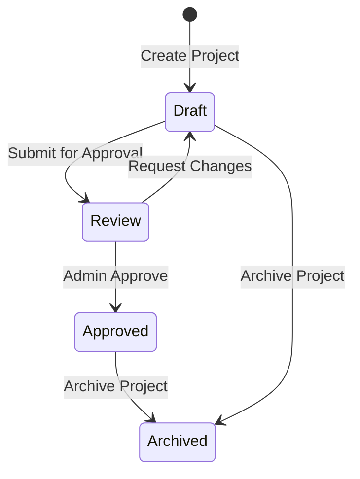

# ODRAS MVP Updates - Week 2 Enhancement Plan

This document outlines the proposed enhancements to the ODRAS MVP based on research and architectural considerations for improved project isolation, data management, and workflow controls.

## 🎯 Executive Summary

The proposed enhancements focus on:
1. **Single Ontology per Project** - Enforce project sandbox model with admin-released importable ontologies
2. **Data Manager Workbench** - New component for managing data properties and external data connections  
3. **Project-Scoped Resources** - Strengthen isolation with admin approval workflows
4. **LLM Playground Enhancement** - Consolidate RAG capabilities for better experimentation
5. **Project Approval Workflow** - Streamline global resource sharing through project-level approval

## 📊 Current State Analysis

### Existing Architecture
- **Ontology Management**: Currently allows multiple ontologies per project via `ontologies_registry`
- **Resource Scoping**: Knowledge assets have `is_public` flag, files have project scoping
- **Admin Controls**: Individual resource approval (knowledge assets, files)
- **RAG Interface**: Embedded in knowledge workbench, not optimized for experimentation

### Key Gaps Identified
1. No enforcement of single ontology per project
2. Data properties not actively integrated with external data sources
3. Fragmented approval process for making resources global
4. RAG experimentation limited by current UI placement
5. No formal project approval workflow

## 🏗️ Proposed Enhancements

### 1. Single Ontology per Project Model

#### Rationale
- Creates focused project sandboxes
- Simplifies ontology management and versioning
- Clearer separation between development and released ontologies

#### Implementation Plan

**Database Schema Changes:**
```sql
-- Modify projects table to include base ontology reference
ALTER TABLE public.projects 
ADD COLUMN base_ontology_id UUID REFERENCES public.ontologies(ontology_id),
ADD COLUMN ontology_graph_iri TEXT UNIQUE;

-- Create ontologies table for better management
CREATE TABLE IF NOT EXISTS public.ontologies (
    ontology_id UUID PRIMARY KEY DEFAULT uuid_generate_v4(),
    graph_iri TEXT UNIQUE NOT NULL,
    name VARCHAR(255) NOT NULL,
    namespace TEXT NOT NULL,
    version VARCHAR(50) DEFAULT '1.0.0',
    status VARCHAR(50) DEFAULT 'draft', -- draft, review, released
    is_importable BOOLEAN DEFAULT FALSE,
    released_at TIMESTAMP WITH TIME ZONE,
    released_by UUID REFERENCES public.users(user_id),
    created_at TIMESTAMP WITH TIME ZONE DEFAULT NOW(),
    updated_at TIMESTAMP WITH TIME ZONE DEFAULT NOW()
);

-- Track imported ontologies per project
CREATE TABLE IF NOT EXISTS public.project_ontology_imports (
    project_id UUID REFERENCES public.projects(project_id) ON DELETE CASCADE,
    imported_ontology_id UUID REFERENCES public.ontologies(ontology_id),
    import_date TIMESTAMP WITH TIME ZONE DEFAULT NOW(),
    PRIMARY KEY (project_id, imported_ontology_id)
);
```

**API Changes:**
- `POST /api/projects` - Modified to create default ontology graph
- `GET /api/ontologies/importable` - List admin-released ontologies
- `POST /api/projects/{id}/imports` - Import released ontology
- `POST /api/admin/ontologies/{id}/release` - Admin release workflow

**Workbench UI Updates:**
- Remove multi-ontology selector
- Add "Import Released Ontology" action in tree
- Show imported ontologies as read-only overlays
- Display ontology status badges (draft/review/released)

### 2. Data Manager Workbench

#### Concept
A new workbench for managing the connection between ontology data properties and external data sources, enabling live data integration with semantic models.

#### Core Features

**Data Property Detection:**
- Monitor project ontology for data property additions
- Auto-create data pipe configurations for new properties
- Maintain property-to-source mappings

**Data Pipe Types:**
1. **Database Connections**
   - SQL databases (PostgreSQL, MySQL, SQLite)
   - NoSQL stores (MongoDB, Redis)
   - Time-series databases (InfluxDB, TimescaleDB)

2. **API Integrations**
   - REST APIs with authentication
   - GraphQL endpoints
   - WebSocket streams

3. **File-Based Sources**
   - CSV/Excel files
   - JSON/XML documents
   - CAD model metadata

4. **Ontology Data Sources**
   - Published ontology instances
   - Cross-project data sharing (with permissions)

**Data Model:**
```sql
CREATE TABLE IF NOT EXISTS public.data_pipes (
    pipe_id UUID PRIMARY KEY DEFAULT uuid_generate_v4(),
    project_id UUID REFERENCES public.projects(project_id) ON DELETE CASCADE,
    ontology_property_iri TEXT NOT NULL,
    pipe_name VARCHAR(255) NOT NULL,
    pipe_type VARCHAR(50) NOT NULL, -- database, api, file, ontology
    source_config JSONB NOT NULL, -- connection details, credentials reference
    mapping_config JSONB NOT NULL, -- field mappings, transformations
    refresh_schedule VARCHAR(50), -- cron expression or 'manual'
    last_sync_at TIMESTAMP WITH TIME ZONE,
    last_sync_status VARCHAR(50),
    is_active BOOLEAN DEFAULT TRUE,
    created_at TIMESTAMP WITH TIME ZONE DEFAULT NOW(),
    updated_at TIMESTAMP WITH TIME ZONE DEFAULT NOW()
);

CREATE TABLE IF NOT EXISTS public.data_pipe_executions (
    execution_id UUID PRIMARY KEY DEFAULT uuid_generate_v4(),
    pipe_id UUID REFERENCES public.data_pipes(pipe_id) ON DELETE CASCADE,
    started_at TIMESTAMP WITH TIME ZONE DEFAULT NOW(),
    completed_at TIMESTAMP WITH TIME ZONE,
    status VARCHAR(50) NOT NULL, -- running, success, failed
    records_processed INTEGER DEFAULT 0,
    error_message TEXT,
    execution_log JSONB
);
```

**MVP Scope (Limited):**
- Basic UI for viewing detected data properties
- Manual data pipe creation for database sources
- Simple field mapping interface
- Test connection functionality
- Manual sync execution
- View sync history and status

**Future Enhancements:**
- Advanced transformation rules
- Real-time data streaming
- Data quality monitoring
- Automated sync scheduling
- Complex JOIN operations

### 3. Project-Scoped Resources & Admin Approval

#### Enhanced Project Isolation

**Principle:** All resources are project-specific by default, becoming global only through explicit admin action.

**Resource Types:**
- Ontologies (base + imported)
- Documents/Files
- Knowledge Assets
- Data Pipes
- LLM Agents/Prompts

**Implementation:**

```sql
-- Add project approval table
CREATE TABLE IF NOT EXISTS public.project_approvals (
    approval_id UUID PRIMARY KEY DEFAULT uuid_generate_v4(),
    project_id UUID REFERENCES public.projects(project_id),
    requested_by UUID REFERENCES public.users(user_id),
    requested_at TIMESTAMP WITH TIME ZONE DEFAULT NOW(),
    reviewed_by UUID REFERENCES public.users(user_id),
    reviewed_at TIMESTAMP WITH TIME ZONE,
    status VARCHAR(50) DEFAULT 'pending', -- pending, approved, rejected
    approval_type VARCHAR(50) NOT NULL, -- full_project, specific_resources
    resource_list JSONB, -- if specific_resources
    review_notes TEXT,
    approval_metadata JSONB -- quality scores, compliance checks
);

-- Add global resource tracking
ALTER TABLE public.files ADD COLUMN made_global_via_project UUID REFERENCES public.projects(project_id);
ALTER TABLE public.knowledge_assets ADD COLUMN made_global_via_project UUID REFERENCES public.projects(project_id);
```

**Approval Workflows:**

1. **Individual Resource Approval** (Current)
   - Admin manually reviews and approves each resource
   - Suitable for high-value, selective sharing

2. **Project-Level Approval** (New)
   - Submit entire project for review
   - Quality gates and automated checks
   - Batch approval of all project resources
   - Resources tagged with source project

**Quality Gates for Project Approval:**
- Ontology validation (SHACL compliance)
- Documentation completeness (>80% coverage)
- Knowledge asset quality scores (>0.7 average)
- No conflicting global resources
- Passing test cases (if defined)

### 4. LLM Playground Integration

#### Relocate Knowledge RAG Interface

**Current State:** RAG query interface embedded in knowledge detail view

**Proposed State:** Consolidated in LLM Playground for unified experimentation

**Benefits:**
- Test different LLM models (OpenAI, Ollama) in one place
- Compare responses across models
- Experiment with prompt engineering
- Create and test LLM agents
- Access both project and global knowledge

**Implementation:**

```typescript
// LLM Playground Components
interface PlaygroundConfig {
    context: {
        knowledge_scope: 'project' | 'global' | 'both';
        project_ids?: string[];
        document_types?: string[];
        include_ontology: boolean;
    };
    model: {
        provider: 'openai' | 'ollama' | 'anthropic';
        model_name: string;
        temperature: number;
        max_tokens: number;
    };
    agents?: LLMAgent[];
}

interface LLMAgent {
    agent_id: string;
    name: string;
    role: string;
    system_prompt: string;
    tools?: string[]; // available functions
    constraints?: string[];
}
```

**UI Features:**
- Split-panel interface (query + response)
- Model selector with settings
- Context scope controls
- Query history with versioning
- Response comparison view
- Agent builder interface
- Prompt template library
- Export conversations

**Agent Management:**
```sql
CREATE TABLE IF NOT EXISTS public.llm_agents (
    agent_id UUID PRIMARY KEY DEFAULT uuid_generate_v4(),
    project_id UUID REFERENCES public.projects(project_id),
    name VARCHAR(255) NOT NULL,
    description TEXT,
    role VARCHAR(100),
    system_prompt TEXT NOT NULL,
    model_config JSONB NOT NULL,
    tools JSONB DEFAULT '[]',
    is_global BOOLEAN DEFAULT FALSE,
    created_by UUID REFERENCES public.users(user_id),
    created_at TIMESTAMP WITH TIME ZONE DEFAULT NOW(),
    updated_at TIMESTAMP WITH TIME ZONE DEFAULT NOW()
);
```

### 5. Enhanced Project Workflow Controls

#### Project Lifecycle Management

**States:**
1. **Draft** - Active development, all resources private
2. **Review** - Submitted for approval, read-only
3. **Approved** - Resources available globally
4. **Archived** - Historical reference only

**Workflow Implementation:**



**API Endpoints:**
- `POST /api/projects/{id}/submit-review` - Submit project for approval
- `POST /api/admin/projects/{id}/review` - Admin review action
- `GET /api/projects/{id}/approval-status` - Check approval status
- `POST /api/projects/{id}/archive` - Archive project

## 📋 Implementation Plan

### Week 2 Sprint Plan

#### Sprint 1: Single Ontology per Project (Days 1-2)
- [ ] **SO-1**: Database schema updates for single ontology enforcement
- [ ] **SO-2**: Modify project creation to include base ontology
- [ ] **SO-3**: Update ontology workbench to work with single project ontology
- [ ] **SO-4**: Implement ontology release workflow (API)
- [ ] **SO-5**: Add import functionality for released ontologies
- [ ] **SO-6**: Update UI to show ontology status and imports

#### Sprint 2: Data Manager Workbench Foundation (Days 2-3)
- [ ] **DM-1**: Create database schema for data pipes
- [ ] **DM-2**: Implement data property detection service
- [ ] **DM-3**: Basic Data Manager UI route and layout
- [ ] **DM-4**: Database connection configuration UI
- [ ] **DM-5**: Simple mapping interface (property to column)
- [ ] **DM-6**: Test connection and manual sync functionality

#### Sprint 3: Project Approval Workflow (Days 3-4)
- [ ] **PA-1**: Create project approval database schema
- [ ] **PA-2**: Implement quality gate checks (automated)
- [ ] **PA-3**: Project submission API endpoints
- [ ] **PA-4**: Admin review interface
- [ ] **PA-5**: Batch resource promotion logic
- [ ] **PA-6**: Project state management and transitions

#### Sprint 4: LLM Playground Enhancement (Days 4-5)
- [ ] **LP-1**: Move RAG query interface to LLM Playground
- [ ] **LP-2**: Implement model selection and comparison
- [ ] **LP-3**: Add context scope controls (project/global)
- [ ] **LP-4**: Create agent builder interface
- [ ] **LP-5**: Implement prompt template management
- [ ] **LP-6**: Add conversation export functionality

#### Sprint 5: Integration and Testing (Day 5)
- [ ] **IT-1**: Integration testing across all new components
- [ ] **IT-2**: Update documentation and user guides
- [ ] **IT-3**: Migration scripts for existing data
- [ ] **IT-4**: Performance optimization
- [ ] **IT-5**: Security audit of new features

## 🎯 Acceptance Criteria

### Single Ontology per Project
- [ ] Each project has exactly one base ontology
- [ ] Imported ontologies are read-only and properly overlaid
- [ ] Admin can release ontologies for import by other projects
- [ ] Clear visual distinction between base and imported ontologies

### Data Manager Workbench
- [ ] Data properties automatically detected from ontology
- [ ] Can create database connections and test them
- [ ] Simple mapping interface functional
- [ ] Manual sync executes successfully
- [ ] Sync history and status visible

### Project Approval
- [ ] Projects can be submitted for approval
- [ ] Quality gates run automatically
- [ ] Admin can approve/reject with notes
- [ ] Approved resources become globally accessible
- [ ] Clear audit trail of approvals

### LLM Playground
- [ ] RAG queries work in playground
- [ ] Can switch between models
- [ ] Context scope controls functional
- [ ] Query history maintained
- [ ] Agents can be created and tested

## 🚧 Risk Mitigation

### Technical Risks
1. **Data Pipeline Complexity** - Start with simple database sources only
2. **Performance Impact** - Implement caching and lazy loading
3. **Migration Complexity** - Provide backwards compatibility mode

### Process Risks
1. **User Adoption** - Provide clear migration guides
2. **Approval Bottlenecks** - Implement automated quality checks
3. **Data Security** - Encrypt credentials, audit all access

## 📚 References and Best Practices

### Ontology Data Management
- **Semantic Web Best Practices**: Separation of TBox (schema) and ABox (instances)
- **Data Property Patterns**: Use rdfs:range for data types, maintain cardinality constraints
- **External Data Integration**: Maintain provenance, versioning, and update timestamps

### Project Isolation Patterns
- **Multi-tenancy**: Logical isolation with shared infrastructure
- **Resource Namespacing**: Use project IDs in all resource identifiers
- **Cross-project Sharing**: Explicit permissions and audit trails

### LLM Integration
- **Context Windows**: Optimize chunk selection for token limits
- **Model Comparison**: Standardize prompts for fair comparison
- **Agent Design**: Clear roles, constrained actions, testable outcomes

---

*This enhancement plan builds upon the successful ODRAS Phase 1 implementation to create a more structured, governed system for ontology-driven requirements analysis and knowledge management.*
