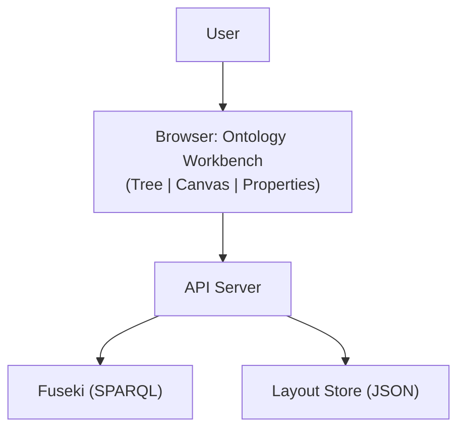
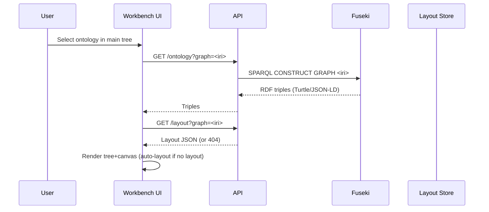

# Ontology Workbench MVP

This document outlines a minimal, robust plan for an ontology workbench that follows ontological best practices while keeping the user experience simple for an MVP.

## Goals and scope (MVP)
- Edit a single base ontology at a time (ignore external upper ontologies for now).
- Source of truth in Fuseki (named graph per ontology).
- Visual editing in a browser (tree + canvas + properties), then save back to Fuseki.
- Store diagram layout separately from OWL/RDF triples.
- Keep imports/read-only overlays for a later iteration.

## High-level architecture


- Fuseki: stores ontology triples. One named graph per editable ontology (e.g., GRAPH <http://odras.local/onto/my-ontology>). 
- Layout Store: stores UI-only layout JSON (node positions, zoom/pan). For MVP, a simple REST endpoint; can be backed by Fuseki in a separate layout graph or a file store.
- Workbench UI: 
  - Tree shows classes/properties for the active ontology only.
  - Canvas presents nodes/edges derived from ontology.
  - Properties panel edits labels, domains/ranges, types, etc.

## Data model
- Ontology triples (RDF/OWL) in Fuseki named graph: GRAPH <baseOntologyIRI> { … }.
  - owl:Class (or rdfs:Class)
  - owl:ObjectProperty
  - owl:DatatypeProperty
  - rdfs:label, rdfs:domain, rdfs:range
- Layout JSON (separate from ontology):
```json
{
  "graphIri": "http://odras.local/onto/my-ontology",
  "nodes": [
    { "iri": "http://odras.local/onto/my-ontology#Order", "x": 320, "y": 180 },
    { "iri": "http://odras.local/onto/my-ontology#Customer", "x": 120, "y": 220 }
  ],
  "edges": [
    { "iri": "http://odras.local/onto/my-ontology#placedBy" }
  ],
  "zoom": 1.0,
  "pan": { "x": 0, "y": 0 }
}
```

Rationale: never mingle UI-only layout into the ontology graph; keep separation of concerns and enable clean SPARQL operations on the ontology.

## Loading flow


## Editing model (MVP)
- One active ontology loaded (base ontology only). Imports postponed for simplicity.
- Visual mapping:
  - Node: owl:Class
  - Edge: owl:ObjectProperty (label = rdfs:label or local name)
  - Data property: either as an edge annotation or a node+edge to the class (MVP can render a small node labeled with the property and an edge from the class)
- Properties panel edits:
  - Class: rdfs:label (and optionally rdfs:subClassOf)
  - Object property: rdfs:label, rdfs:domain, rdfs:range
  - Data property: rdfs:label, rdfs:domain, rdfs:range (to a literal type later)
- IRI minting: generate in the base namespace (e.g., <http://odras.local/onto/{project}#Name>) and ensure uniqueness.

## Interaction and editing UX (no popups)
Design for direct manipulation and uninterrupted flow. Avoid modal prompts/popups for core creation and editing actions.

- Creation (no popups):
  - Drag from palette to canvas to create a class or data property. Node appears under cursor; immediately selected.
  - Connect classes using edge-handles to create an object property. Edge appears; its label is editable in place.
- In-place rename (nodes/edges):
  - Click (or F2/double-click) on a node label or edge label to enter inline edit mode.
  - Show a small inline text input aligned with the label. Commit: Enter/blur. Cancel: Escape.
  - Update rdfs:label and regenerate local names (optional) while preserving IRIs (or propose IRI remap with confirmation later).
- Selection and deletion:
  - Click to select; Shift-click to multi-select; marquee select via drag on empty canvas (optional later).
  - Delete/Backspace to remove selected elements. No confirmation modal; provide Undo.
- Properties panel (non-modal):
  - Selecting any element populates the properties panel for structured edits (domain/range, types, custom attributes). Inline edits and panel edits stay in sync.
- Keyboard shortcuts (MVP set):
  - Delete/Backspace: delete selection
  - Ctrl/Cmd+S: Save ontology + layout
  - Ctrl/Cmd+Z / Ctrl/Cmd+Shift+Z: Undo/Redo (at least recent operations in-memory)
  - Esc: cancel inline edit; clear selection if not editing
- Direct manipulation:
  - Drag nodes to reposition (no prompts). Snap-to-grid optional.
  - Pan with space+drag or middle mouse; zoom with wheel (with Ctrl/Cmd).
  - Auto-layout button for quick arrangement; preserves manual positions unless re-run.
- Feedback and affordances:
  - Hover hints/tooltips are fine; avoid blocking modals.
  - Dirty indicator (unsaved changes) in toolbar; guard on navigation.

Rationale: Direct, inline editing minimizes cognitive load and respects Fitts’s Law; keyboard support is expected in editors; Undo is safer than confirmation modals.

## Conceptualization loop (single pass MVP)
Populate the ontology with candidate individuals per requirement, and mirror into a property graph.

```mermaid
sequenceDiagram
  participant UI as Workbench UI
  participant API as API
  participant V as Vector Store
  participant LLM as LLM
  participant F as Fuseki (RDF)
  participant N as Neo4j (Property Graph)

  UI->>API: Start conceptualization (project, baseOntologyIRI)
  API->>F: Get extracted requirements (RDF or JSON)
  API->>V: Retrieve relevant knowledge chunks per requirement
  API->>LLM: Prompt(requirement + retrieved knowledge + ontology schema)
  LLM-->>API: Candidate individuals + relations (+confidence)
  API->>F: Upsert individuals (owl:NamedIndividual) and object/data properties
  API->>N: Upsert nodes/edges (mirror): labels/types/props; link to requirement
  API-->>UI: Summary (created/updated, warnings, confidences)
```

Data conventions (MVP):
- Each requirement R becomes/links to an RDF node (e.g., `odras:Requirement` with IRI `...#R-001`).
- For each candidate entity E: create `E` as `owl:NamedIndividual` of a base class (e.g., `:Component`, `:Process`), with
  - `rdfs:label` (from LLM), optional `odras:confidence` (xsd:decimal), `odras:derivedFrom` -> requirement IRI.
  - Relations between new/existing individuals via base object properties.
- Property-graph mirror (Neo4j): node keys = RDF IRI; node label = class local name; edge type = object property local name; properties include `label`, `confidence`, `requirementId`.
- Idempotent upsert by IRI; never duplicate individuals if IRIs match.

Notes:
- Keep the loop single-pass (no iterative refinement) for MVP; show a review summary with confidences.
- Do not modify imported ontologies; only instantiate in the active base ontology graph.

## Requirements and knowledge ingestion (RAG)
Process both Requirements and Knowledge documents; use Knowledge as a priori context during review.

Pipeline (MVP):
- Parse & chunk (pdf/docx/md): preserve source, project, section headers.
- Embed to vector store with metadata: { projectId, docType: requirements|knowledge, docId, section, page }.
- During requirement review and conceptualization, retrieve K relevant knowledge chunks; inject into prompts with citations.
- Persist extracted requirements as structured items and optionally as RDF (e.g., `odras:Requirement`).

Prompts should:
- Include ontology schema summary (classes/properties) and any key value lists.
- Include top-k knowledge chunks (with citation ids) and the requirement text.
- Ask for typed individuals, relations, confidences, and clear failure modes (unknown/needs SME).

## LLM Playground – interactions area (context-first)
Support exploration with project context before creating artifacts (white paper, concept architecture, gap analysis).

Features (MVP):
- Context selectors: Requirements (pick subset), Knowledge (scoped filters), Ontology (classes/individuals).
- Chat transcript with citations; ability to pin relevant messages.
- Actions: “Add as individual” (creates RDF individual), “Link to requirement”, “Save snippet to Knowledge”.
- Artifact seeds: collect pinned messages into a draft; persist as project artifact.

Non-goals (MVP):
- Full workflow orchestration; we’ll keep a simple chat + actions.

## Integration readiness (BPMN/DAS awareness)
- Provide an API hook to trigger conceptualization and to report results (future BPMN task integration).
- Emit lightweight events (started/completed) with counts and warnings for testing.
- Keep module boundaries: ingestion, review (LLM+RAG), conceptualization writer (RDF+Neo4j), UI.

## Save flow
```mermaid
sequenceDiagram
  participant UI as Workbench UI
  participant API as API
  participant F as Fuseki
  participant L as Layout Store

  UI->>API: PUT /ontology?graph=<iri> (triples)
  API->>F: SPARQL UPDATE (DROP GRAPH <iri>; INSERT DATA { GRAPH <iri> { ... } })
  F-->>API: 200 OK
  UI->>API: PUT /layout?graph=<iri> (layout JSON)
  L-->>API: 200 OK
```

### Minimal SPARQL
- Load:
```sparql
CONSTRUCT { ?s ?p ?o }
WHERE { GRAPH <http://odras.local/onto/my-ontology> { ?s ?p ?o } }
```
- Save (simple replacement):
```sparql
DROP GRAPH <http://odras.local/onto/my-ontology> ;
INSERT DATA {
  GRAPH <http://odras.local/onto/my-ontology> {
    # … serialized triples (Turtle) …
  }
}
```

Notes: For MVP, full replacement is acceptable. Later, adopt diff-based updates or versioning.

## Imports (later iteration)
- Represent imports as separate named graphs; load as read-only overlays.
- Toggle visibility on canvas; distinct style.
- Edits only affect the base graph; never merge imported triples into the base.

## UI/UX best practices
- Single-edit context: one active base ontology at a time.
- Three synchronized panels:
  - Tree: classes (and optionally properties) of the active base ontology only.
  - Canvas: graph view with direct manipulation (add class, connect, delete, auto-layout).
  - Properties: edit selected class/property; show model-level metadata when background is selected.
- Clear save semantics: Save writes both triples and layout; Revert reloads from Fuseki and layout store.
- Dirty indicator and navigation guard when unsaved changes exist.

## Validation & safety (MVP)
- Ensure unique IRIs upon create/rename.
- Basic integrity checks: object property must have domain and range set before save (or warn and allow save with TODO markers).
- Optionally, run SHACL validation later.

## Versioning (later)
- Option A: write to GRAPH <iri>/<timestamp> and update a pointer triple to “current”.
- Option B: store versions in a companion metadata graph.

## API sketch
- GET /ontology?graph=<iri> → 200 { triples: Turtle/JSON-LD }
- PUT /ontology?graph=<iri> (body: Turtle/JSON-LD) → 200
- GET /layout?graph=<iri> → 200 JSON or 404
- PUT /layout?graph=<iri> (body: JSON) → 200

## Ontology discovery & registry (MVP)
Source the main ontology tree from Fuseki, not placeholders.

- Discovery (baseline): list named graphs that contain an `owl:Ontology` declaration.
- Registry (recommended): maintain a small metadata graph to categorize Base vs Imports.

Discovery query:
```sparql
SELECT DISTINCT ?graph ?ontology ?label WHERE {
  GRAPH ?graph {
    ?ontology a owl:Ontology .
    OPTIONAL { ?ontology rdfs:label ?label }
  }
}
```

Fallback (any non-empty named graph):
```sparql
SELECT DISTINCT ?graph WHERE { GRAPH ?graph { ?s ?p ?o } }
```

Registry graph (example): `GRAPH <http://odras.local/meta/ontologies>`
```turtle
@prefix odras: <http://odras.local/ns#> .

[] odras:graphIri <http://odras.local/onto/{project}/systems> ;
   odras:projectId "{project}" ;
   odras:role "base" ;              # base | import
   odras:label "Systems Ontology" .
```

New endpoints:
- GET /ontologies?project=<id> → 200 [{ graphIri, label, role: base|import|unknown, tripleCount? }]
- PUT /ontologies/registry (body: entries) → 200 (set base/import per project)

## Implementation checklist
- Load active base ontology from the main tree into the workbench.
- Map triples → elements (classes → nodes, object properties → edges, data properties → small nodes/edges).
- Serialize elements → triples on save.
- Persist and load layout JSON per ontology IRI.
- Enforce IRI minting and label editing.
- Postpone imports; keep UI hooks for future read-only overlays.
 - Inline rename for nodes/edges (click/F2 → input → Enter/Esc).
 - Edge creation via drag handles; label editable in place (no prompts).
 - Keyboard: Delete removes selection; Ctrl/Cmd+S saves; basic Undo/Redo in-memory.
 - Palette drag-and-drop creation; immediate selection; no popups.
 - Keep editing non-modal; use properties panel for structured fields (domain/range).

## Why this is simple and safe (MVP)
- Clear separation: ontology vs. layout.
- Easy rollback: re-load from Fuseki.
- Minimal surface area: one ontology at a time; no heavy import logic yet.
- Straightforward API contract and SPARQL operations.

## MVP TODO checklist (Ontology Workbench)

- [x] OW-0: Wire workbench route and selection
  - [x] Create `Ontology Workbench` route/page and mount under the existing layout
  - [x] Read the active ontology IRI from the project-scoped tree/selection
  - [x] Show empty state with selected IRI

- [ ] OW-0.5: Ontology discovery and registry
  - [x] API: GET `/ontologies?project=<id>` lists named graphs with `owl:Ontology` (+label)
  - [ ] API: optional registry in meta graph to tag `role=base|import`
  - [x] UI: populate main ontology tree from discovery results
  - [x] UI: allow selecting base ontology and imports from discovered list
  - [x] Persist selection per project

- [ ] OW-1: API contracts and adapters
  - [ ] Implement/finalize `GET /ontology?graph=<iri>` (SPARQL CONSTRUCT passthrough)
  - [ ] Implement/finalize `PUT /ontology?graph=<iri>` (DROP+INSERT DATA)
  - [ ] Implement `GET/PUT /layout?graph=<iri>` (JSON store; 404 allowed on GET)
  - [ ] Create a thin client `ontologyApi` and `layoutApi` with error handling and timeouts

- [ ] OW-2: RDF parsing and mapping
  - [ ] Parse Turtle/JSON-LD into in-memory model for classes, object props, datatype props
  - [ ] Map classes → nodes; object props → edges; data props → mini-nodes/edges
  - [ ] Derive display labels from `rdfs:label` or local name fallback

- [x] OW-3: Canvas (Cytoscape) baseline
  - [x] Initialize Cytoscape with base styles and grid/snap options
  - [x] Render nodes/edges from the mapped model (MVP placeholders; mapping pending)
  - [x] Support pan/zoom; fit-to-view; auto-layout action

- [ ] OW-4: Layout persistence
  - [ ] On load: fetch layout JSON; apply positions/zoom/pan; fallback to auto-layout if 404
  - [ ] On save: persist node positions + zoom/pan via `PUT /layout?graph=<iri>`

- [x] OW-5: Direct manipulation editing
  - [x] Palette: drag-to-create Class and Data Property (node appears under cursor, selected)
  - [x] Edge handles: connect classes to create Object Property (edge appears, selected)
  - [x] Inline rename (nodes/edges): double-click/F2 to edit; Enter/Esc to commit/cancel
  - [x] Keyboard: Delete removes selection (and toolbar Delete)
  - [x] Drag to reposition; selection/multiselect via shift-click

- [ ] OW-6: Properties panel
  - [ ] Bind selection to panel; show/edit `rdfs:label`, `rdfs:domain`, `rdfs:range`, `rdf:type`, `attrs(JSON)`
  - [ ] Keep inline edits and panel fields in sync
  - [ ] Background (no selection): show model metadata summary

- [ ] OW-7: IRI minting and validation
  - [ ] Generate new IRIs in base namespace `<base#Name>`; ensure uniqueness
  - [ ] Validate domain/range completeness on object/data properties (warn if missing)

- [ ] OW-8: Serialization and save flow
  - [ ] Serialize UI model → RDF triples (Turtle/JSON-LD)
  - [x] Serialize UI model → RDF triples (Turtle/JSON-LD)
  - [ ] Save: `PUT /ontology?graph=<iri>` (DROP+INSERT DATA)
  - [ ] Save layout JSON
  - [ ] Dirty indicator and navigation guard for unsaved changes

- [ ] OW-9: Undo/redo and UX polish
  - [ ] In-memory undo/redo for recent operations
  - [ ] Hover hints/tooltips; error toasts; non-blocking warnings
  - [ ] Basic performance check on 500+ elements

- [ ] OW-10: Tests and acceptance
  - [ ] Unit tests for RDF map/serialize round-trip
  - [ ] Contract tests against Fuseki for load/save
  - [ ] UI smoke test: create/rename/connect/save/reload cycle
  - [ ] Acceptance criteria checklist below passes

- Notes 
    - [] add importable ontology from a URL ir URI 

- [ ] OW-0.6: Ontology functionality
  - [x] API: create/delete/rename ontologies
    - [x] Create: POST `/ontologies` (project, name) → mint graph IRI `http://odras.local/onto/{project}/{name}`; write `owl:Ontology` + `rdfs:label`
    - [x] Delete: DELETE `/ontologies?graph=<iri>` (drop named graph)
    - [x] Rename: PUT `/ontologies/label?graph=<iri>` (update `rdfs:label` only for MVP; do not change IRI)
  - [x] UI: main tree
    - [x] Add new empty ontology from tree header (plus button; derives IRI from display label); selects it
    - [x] Delete ontology: select in tree and press Delete key (implemented)
    - [x] Rename ontology: double-click label in tree → inline edit
  - [x] UI: canvas interactions (no popups)
    - [x] Drag Class/Data Property to canvas creates element with default name (selected)
    - [x] Inline rename on node/edge label when selected
    - [x] Create Object Property by selecting start→end (edgehandles or click-connect); default label; editable inline
  - [x] Local persistence per ontology: cache canvas state per graph IRI while switching
  - [ ] Save & layout
    - [ ] Save writes triples to selected ontology graph and preserves layout (positions, zoom/pan) per graph IRI

### Acceptance criteria (MVP)
- Load/render from a Fuseki named graph and apply stored layout (or auto-layout if absent).
- Create classes, datatype/object properties via direct manipulation; rename inline.
- Edit labels/domain/range/types in the properties panel; changes reflect immediately.
- Save writes both triples (DROP+INSERT) and layout JSON; reload reproduces the view.
- IRI minting uses base namespace and guarantees uniqueness; integrity warnings shown.
- Keyboard shortcuts work; undo/redo available for recent steps; dirty indicator present.
