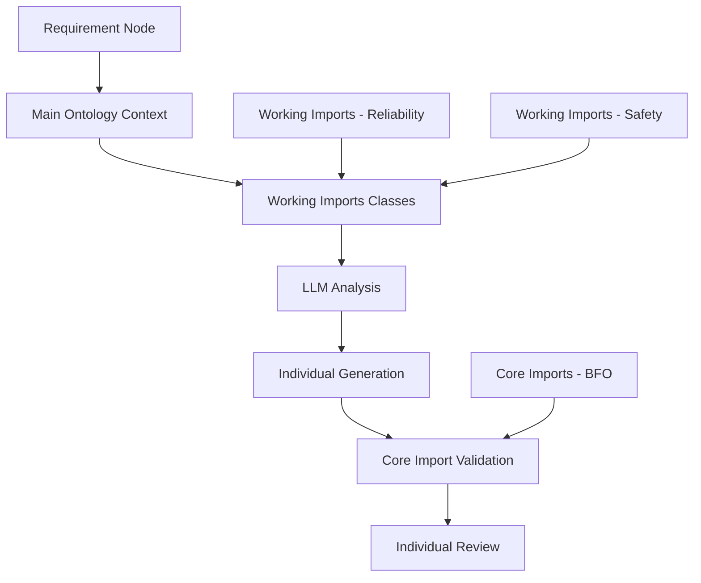
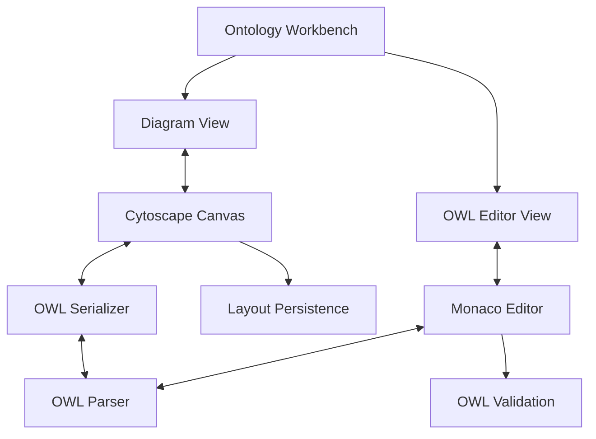
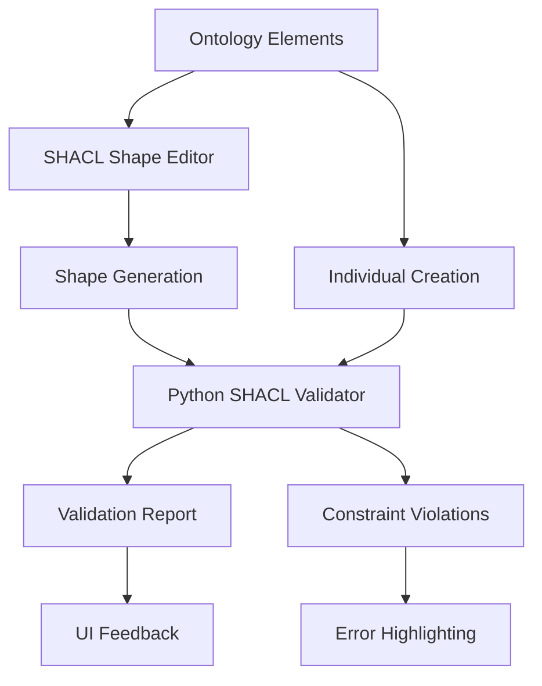
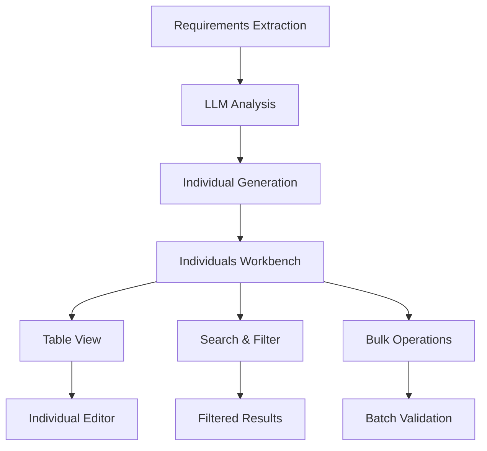
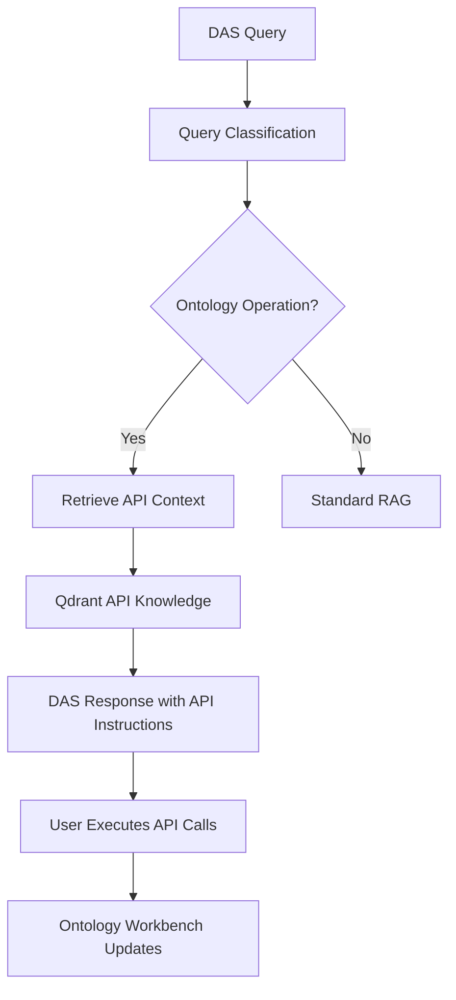

# Ontology Workbench Post-MVP Development Plan

**Version**: 1.0  
**Date**: 2025-09-10  
**Status**: Planning Phase  

## Executive Summary

With the Ontology Workbench MVP successfully completed, this document outlines the next phase of development focusing on advanced ontology management, SHACL validation, individual/instance management, and Digital Assistant System (DAS) integration.

## MVP Achievements Summary

### ✅ Completed Core Features
- **Visual Ontology Editor**: Cytoscape-based canvas with direct manipulation
- **Import Management**: External ontology imports with read-only protection
- **Rich Metadata**: Comprehensive tracking with Dublin Core annotations
- **Named Views**: Save/restore complete canvas configurations with toggle functionality
- **Advanced UI**: Professional interface with visibility controls and tree-canvas synchronization

### ✅ Technical Implementation
- **Full CRUD Operations**: Create, read, update, delete ontologies
- **Layout Persistence**: Server-synchronized positioning and zoom states
- **Properties Management**: Template-based attribute editing with validation
- **Note System**: 7 note types with visual indicators and automatic metadata
- **Professional UX**: SVG icons, accessibility support, keyboard navigation

## Ontology Architecture for LLM Integration

### Project Ontology Hierarchy
**Understanding**: Projects use hierarchical ontology structure for requirement-driven individual generation

```
Project Ontologies:
├── Main Ontology (primary for LLM interaction) ⭐
├── Additional Project Ontologies (secondary)
└── Imports:
    ├── Core Imports (above) - BFO, foundational ontologies
    │   └── Purpose: Structure, validation, location - NOT for individuals
    └── Working Imports (below) - Reliability, Safety, Domain-specific
        └── Purpose: Templates for individual/instance creation
```

### LLM Integration Context
**Requirement Node Processing**:
- **Input**: Requirement text + Main Ontology + Working Imports
- **Output**: Component/Process/Interface/Function individuals
- **Validation**: Against Core Import constraints (BFO, etc.)
- **Attribution**: Link individuals back to source requirements

### Main Ontology Selection
**Need**: Projects with multiple ontologies require main ontology designation
- **Purpose**: Main ontology + working imports provide LLM context
- **Implementation**: Add main ontology selector in project settings
- **Impact**: Ensures consistent LLM analysis across requirements

## Post-MVP Development Phases

### Phase 0: Server-Side State Management (High Priority)

#### 0.1 Named Views Server Storage
**Current Issue**: Named views stored in localStorage cause synchronization and duplication issues
**Solution**: Move named views to PostgreSQL for proper persistence and sharing

**Database Schema**:
```sql
-- Named views table
CREATE TABLE IF NOT EXISTS ontology_named_views (
    id UUID PRIMARY KEY DEFAULT gen_random_uuid(),
    project_id UUID NOT NULL REFERENCES projects(project_id),
    ontology_iri VARCHAR(500) NOT NULL,
    name VARCHAR(255) NOT NULL,
    creator VARCHAR(255) NOT NULL,
    created_date TIMESTAMP DEFAULT CURRENT_TIMESTAMP,
    
    -- View configuration
    zoom DECIMAL(10,6) NOT NULL,
    pan_x DECIMAL(10,6) NOT NULL,
    pan_y DECIMAL(10,6) NOT NULL,
    
    -- Visibility states (JSON)
    visibility_state JSONB NOT NULL,
    element_visibility JSONB NOT NULL,
    collapsed_imports JSONB NOT NULL,
    visible_imports JSONB NOT NULL,
    
    UNIQUE(project_id, ontology_iri, name)
);

-- Index for performance
CREATE INDEX idx_named_views_project_ontology 
ON ontology_named_views(project_id, ontology_iri);
```

**API Endpoints**:
```python
# New endpoints for named views
@app.get("/api/ontology/named-views")
async def get_named_views(project_id: str, ontology_iri: str):
    """Get all named views for an ontology"""

@app.post("/api/ontology/named-views")  
async def create_named_view(body: NamedViewRequest):
    """Create new named view"""

@app.put("/api/ontology/named-views/{view_id}")
async def update_named_view(view_id: str, body: NamedViewRequest):
    """Update named view (rename)"""

@app.delete("/api/ontology/named-views/{view_id}")
async def delete_named_view(view_id: str):
    """Delete named view"""
```

#### 0.2 Import Configuration Server Storage  
**Current Issue**: Import settings stored in localStorage cause duplication and sync issues
**Solution**: Move import configurations to PostgreSQL

**Database Schema**:
```sql
-- Ontology imports configuration table
CREATE TABLE IF NOT EXISTS ontology_import_configs (
    id UUID PRIMARY KEY DEFAULT gen_random_uuid(),
    project_id UUID NOT NULL REFERENCES projects(project_id),
    base_ontology_iri VARCHAR(500) NOT NULL,
    import_ontology_iri VARCHAR(500) NOT NULL,
    
    -- Import classification
    import_type VARCHAR(50) NOT NULL CHECK (import_type IN ('core', 'working')),
    -- core: BFO, foundational (for validation only)
    -- working: Domain ontologies (for individual creation)
    
    -- Import state
    is_visible BOOLEAN DEFAULT true,
    is_collapsed BOOLEAN DEFAULT false,
    
    -- Layout positions for imported elements (JSON)
    element_positions JSONB,
    
    -- Metadata
    creator VARCHAR(255) NOT NULL,
    created_date TIMESTAMP DEFAULT CURRENT_TIMESTAMP,
    
    UNIQUE(project_id, base_ontology_iri, import_ontology_iri)
);

-- Index for performance  
CREATE INDEX idx_import_configs_base_ontology
ON ontology_import_configs(project_id, base_ontology_iri);
```

**Benefits**:
- **No Duplication**: Single source of truth for import configurations
- **Cross-Device Sync**: Import settings sync across different browsers/devices
- **Team Collaboration**: Shared import configurations for project teams
- **Audit Trail**: Track who added/removed imports and when
- **Performance**: Faster loading without localStorage parsing

#### 0.3 Server-Side API Migration
**Implementation Strategy**:
```javascript
// Migrate from localStorage to server API
async function migrateNamedViewsToServer() {
  const projects = await getProjects();
  
  for (const project of projects) {
    const ontologies = await getProjectOntologies(project.id);
    
    for (const ontology of ontologies) {
      // Get localStorage named views
      const localViews = loadNamedViews(ontology.iri);
      
      // Upload to server
      for (const view of localViews) {
        await createNamedViewOnServer(project.id, ontology.iri, view);
      }
      
      // Clear localStorage after successful migration
      localStorage.removeItem(namedViewsKey(ontology.iri));
    }
  }
}
```

### Phase 1: Ontology Architecture Enhancement (Immediate Priority)

#### 0.1 Import Classification System
**Action**: Classify imports as Core (above) vs Working (below)
- **Core Imports (above)**: BFO, foundational ontologies for structure/validation
- **Working Imports (below)**: Domain ontologies for individual creation templates
- **Implementation**: Add import type classification to import management
- **UI Enhancement**: Visual distinction in tree (above/below main ontology)

#### 0.2 Main Ontology Selection
**Action**: Add main ontology designation for projects with multiple ontologies
```javascript
// Project settings for main ontology
const projectOntologyConfig = {
  mainOntologyIri: "http://org/project/ontologies/systems", // Primary for LLM
  additionalOntologies: [], // Secondary ontologies
  coreImports: [], // Above - for validation (BFO, etc.)
  workingImports: [] // Below - for individual creation
};
```

**Features**:
- **Main Ontology Selector**: UI to designate primary ontology per project
- **Import Classification**: Mark imports as core vs working
- **LLM Context Builder**: Combine main ontology + working imports for LLM analysis
- **Visual Hierarchy**: Tree shows above/below relationship to main ontology

#### 0.3 Requirement-Ontology Integration
**Purpose**: Connect requirement nodes to ontology-driven individual generation
```javascript
// Requirement processing context
const requirementContext = {
  requirementId: "req_001",
  requirementText: "The system shall have a navigation component...",
  ontologyContext: {
    mainOntology: "systems_ontology",
    workingImports: ["reliability_ontology", "safety_ontology"],
    availableClasses: ["Component", "Process", "Interface", "Function"]
  }
};
```

### Phase 1: OWL Code Editor Integration (High Priority)

#### 1.1 Dual-Mode Editing System
**Goal**: Enable users to switch between visual diagram and OWL text editing

**Implementation**:
```javascript
// Add OWL editor tab to ontology workbench
const owlEditor = {
  mode: 'diagram', // 'diagram' | 'owl'
  editor: null, // CodeMirror or Monaco editor instance
  syncInProgress: false
};

// Bidirectional synchronization
function syncDiagramToOWL() {
  const owlCode = serializeCanvasToTurtle();
  owlEditor.editor.setValue(owlCode);
}

function syncOWLToDiagram() {
  const owlCode = owlEditor.editor.getValue();
  const parsedData = parseOWLToCanvasData(owlCode);
  updateCanvasFromOWL(parsedData);
}
```

**Features**:
- **Toggle View**: Switch between diagram and OWL code editor
- **Real-time Sync**: Changes in diagram update OWL code and vice versa
- **Syntax Highlighting**: OWL/Turtle syntax highlighting with error detection
- **Validation**: OWL syntax validation with error reporting
- **Split View**: Optional side-by-side diagram and code view

**Technical Requirements**:
- **OWL Parser**: JavaScript OWL/Turtle parser (use existing or implement)
- **Code Editor**: Monaco Editor or CodeMirror for syntax highlighting
- **Synchronization**: Conflict resolution when both sides are edited
- **Validation**: Real-time OWL syntax checking

#### 1.2 OWL Export/Import
**Features**:
- **Export**: Download OWL files in multiple formats (Turtle, RDF/XML, JSON-LD)
- **Import**: Upload OWL files to create new ontologies
- **Format Conversion**: Support multiple OWL serialization formats
- **Validation**: Pre-import OWL validation and conflict checking

### Phase 2: SHACL Constraints and Validation (High Priority)

#### 2.1 SHACL Shape Editor
**Goal**: Visual editor for creating SHACL constraints

**Implementation**:
```javascript
// Add SHACL shapes to ontology model
const shaclShapes = {
  nodeShapes: [], // sh:NodeShape definitions
  propertyShapes: [], // sh:PropertyShape definitions
  validationReports: [] // Validation results
};

// SHACL shape templates
const shaclTemplates = {
  classShape: {
    type: 'NodeShape',
    targetClass: null,
    properties: []
  },
  propertyConstraints: {
    datatype: ['xsd:string', 'xsd:integer', 'xsd:decimal', 'xsd:boolean'],
    cardinality: ['minCount', 'maxCount', 'exactCount'],
    valueConstraints: ['minValue', 'maxValue', 'pattern', 'in']
  }
};
```

**Features**:
- **Shape Templates**: Pre-built SHACL shape patterns for common constraints
- **Visual Constraint Editor**: GUI for defining constraints on classes and properties
- **Unit Validation**: Integration with QUDT for unit checking
- **Multiplicity Constraints**: Min/max cardinality validation
- **Value Bounding**: Numeric range and pattern validation
- **Custom Constraints**: SPARQL-based custom validation rules

#### 2.2 SHACL Validation Engine
**Backend Integration**:
```python
# New file: backend/services/shacl_validator.py
from pyshacl import validate
from rdflib import Graph

class SHACLValidator:
    def validate_ontology(self, ontology_graph: str, shapes_graph: str):
        """Validate ontology instances against SHACL shapes"""
        
    def validate_individuals(self, individuals_graph: str, shapes_graph: str):
        """Validate specific individuals against constraints"""
        
    def generate_validation_report(self, results):
        """Generate human-readable validation report"""
```

**Features**:
- **Real-time Validation**: Validate as users create/edit ontology elements
- **Batch Validation**: Validate all individuals against current shapes
- **Validation Reports**: Detailed reports with error locations and suggestions
- **Constraint Checking**: Unit checks, multiplicity, value bounds, custom rules

#### 2.3 Python OWL Integration
**Libraries to Consider**:
- **owlready2**: Python OWL ontology manipulation
- **rdflib**: RDF graph operations and SPARQL
- **pyshacl**: SHACL validation engine
- **pint**: Unit conversion and validation

### Phase 3: Individual/Instance Management (High Priority)

#### 3.1 Individual Management Architecture
**Challenge**: Managing hundreds of extracted requirement individuals

**Option A: Integrated Tree View**
```javascript
// Extend ontology tree with individuals section
const individualsTree = {
  groupBy: 'class', // Group individuals by their class
  filters: {
    class: null,
    creator: null,
    dateRange: null,
    searchText: null
  },
  pagination: {
    pageSize: 50,
    currentPage: 1
  }
};
```

**Option B: Separate Individuals Tab**
```javascript
// New workbench tab for individual management
const individualsWorkbench = {
  view: 'table', // 'table' | 'cards' | 'graph'
  filters: {
    class: [],
    requirements: [],
    confidence: [0.0, 1.0],
    creator: null
  },
  search: {
    text: '',
    fields: ['label', 'description', 'requirement_id']
  }
};
```

**Recommended Approach**: **Option B - Separate Individuals Tab**
- **Rationale**: Hundreds of individuals would overwhelm the tree view
- **Benefits**: Dedicated space for filtering, searching, and bulk operations
- **Features**: Table view with sorting, filtering, search, and bulk actions

#### 3.2 Individual Management Features
**Core Functionality**:
- **Table View**: Sortable, filterable table with individual details
- **Search**: Full-text search across individual properties
- **Filtering**: Filter by class, creator, confidence, requirement source
- **Bulk Operations**: Select multiple individuals for bulk actions
- **Graph View**: Optional graph visualization of individual relationships

**Individual Lifecycle**:
```javascript
// Individual data structure
const individual = {
  id: "req_001_component_001",
  iri: "http://org/project/ontologies/name#Component_001",
  type: "Component",
  label: "Primary Navigation System",
  description: "Main navigation system for vessel guidance",
  confidence: 0.85,
  source_requirement: "req_001",
  creator: "admin",
  created_date: "2025-09-10",
  properties: {
    hasName: "Primary Navigation System",
    hasSerialNumber: "NAV-001-PRI",
    hasMass: {
      numericValue: 45.5,
      unit: "kg"
    }
  }
};
```

#### 3.3 LLM Integration for Individual Creation
**Workflow**:
1. **Requirement Analysis**: Extract entities from requirement text
2. **Ontology Mapping**: Map extracted entities to ontology classes
3. **Individual Creation**: Create individuals with confidence scores
4. **Validation**: Validate against SHACL constraints
5. **Review**: Present for SME review and approval

### Phase 4: Digital Assistant System (DAS) Integration (Medium Priority)

#### 4.1 DAS-Ontology API Integration
**Goal**: Enable DAS to create and manage ontology objects through API

**API Design**:
```python
# New file: backend/api/das_ontology.py
@router.post("/api/das/ontology/create-class")
async def das_create_class(body: DASClassRequest):
    """DAS endpoint for creating ontology classes"""

@router.post("/api/das/ontology/create-individual")  
async def das_create_individual(body: DASIndividualRequest):
    """DAS endpoint for creating individuals"""

@router.post("/api/das/ontology/validate")
async def das_validate_ontology(body: DASValidationRequest):
    """DAS endpoint for SHACL validation"""
```

**DAS Request Models**:
```python
class DASClassRequest(BaseModel):
    ontology_iri: str
    class_name: str
    label: str
    description: Optional[str]
    parent_class: Optional[str]
    properties: Optional[Dict[str, Any]]

class DASIndividualRequest(BaseModel):
    ontology_iri: str
    class_iri: str
    individual_name: str
    properties: Dict[str, Any]
    confidence: Optional[float]
    source_requirement: Optional[str]
```

#### 4.2 DAS Knowledge Base for API Instructions
**Implementation Strategy**:
```python
# DAS API knowledge base in Qdrant
das_api_knowledge = {
    "ontology_operations": {
        "create_class": {
            "description": "Create new ontology class",
            "endpoint": "POST /api/das/ontology/create-class",
            "parameters": {...},
            "examples": [...]
        },
        "create_individual": {
            "description": "Create ontology individual/instance", 
            "endpoint": "POST /api/das/ontology/create-individual",
            "parameters": {...},
            "examples": [...]
        }
    }
};
```

**Knowledge Base Structure**:
- **API Documentation**: Complete API reference with examples
- **Ontology Patterns**: Common ontology modeling patterns
- **SHACL Examples**: Constraint definition examples
- **Validation Guides**: How to validate individuals and handle errors
- **Best Practices**: Ontology development guidelines

#### 4.3 DAS-RAG Integration Check
**Implementation**:
```python
# Add ontology API check to RAG system
def check_for_ontology_requests(user_query: str) -> bool:
    """Check if user query involves ontology operations"""
    ontology_keywords = [
        "create class", "add individual", "ontology", 
        "validate constraints", "SHACL", "create component"
    ]
    return any(keyword in user_query.lower() for keyword in ontology_keywords)

def get_ontology_api_context(query: str) -> List[str]:
    """Retrieve relevant API documentation from knowledge base"""
    # Query Qdrant for relevant ontology API instructions
    # Return as context for DAS response
```

**Features**:
- **Query Classification**: Detect when user wants ontology operations
- **Context Retrieval**: Get relevant API documentation from knowledge base
- **Action Guidance**: Provide step-by-step API usage instructions
- **Error Handling**: Guide users through common API errors and solutions

## Requirement-Driven Individual Generation

### LLM-Ontology Integration Architecture
**Core Concept**: Requirements drive individual generation using structured ontology hierarchy

**Processing Pipeline**:


### Individual Generation Strategy
**Key Principles**:
1. **Main Ontology**: Provides primary context for LLM analysis
2. **Working Imports**: Provide class templates for individual creation
3. **Core Imports**: Provide validation constraints (not individual templates)
4. **Requirement Attribution**: All individuals link back to source requirements

**Individual Data Structure**:
```javascript
const generatedIndividual = {
  // Core identification
  id: "req_001_component_nav_001",
  iri: "http://org/project/ontologies/systems#NavigationComponent_001",
  
  // Classification
  type: "Component", // From working import
  classSource: "reliability_ontology", // Which working import provided the class
  
  // Content
  label: "Primary Navigation System",
  description: "Main navigation system for vessel guidance",
  
  // Requirement linkage
  sourceRequirement: "req_001",
  requirementText: "The system shall provide navigation...",
  confidence: 0.85, // LLM confidence in this individual
  
  // Validation
  validationStatus: "passed", // Against core import constraints
  validationDetails: { /* SHACL results */ },
  
  // Relationships (inferred from requirement)
  relationships: [
    {
      predicate: "realizes", 
      target: "navigation_function_001",
      confidence: 0.9,
      source: "llm_inference"
    }
  ]
};
```

## Implementation Roadmap

### Sprint 1: OWL Code Editor (2 weeks)
- [ ] Add OWL text editor tab to workbench
- [ ] Implement diagram-to-OWL serialization
- [ ] Implement OWL-to-diagram parsing
- [ ] Add bidirectional synchronization
- [ ] OWL syntax validation and error reporting

### Sprint 2: SHACL Foundation (2 weeks)  
- [ ] Add SHACL shape data model
- [ ] Implement basic constraint templates
- [ ] Create SHACL shape editor UI
- [ ] Backend SHACL validation service
- [ ] Integration with Python OWL libraries

### Sprint 3: Individual Management (2 weeks)
- [ ] Design individuals workbench tab
- [ ] Implement individual table view with filtering
- [ ] Add individual creation and editing
- [ ] Bulk operations for individuals
- [ ] Individual-ontology relationship management

### Sprint 4: DAS Integration (2 weeks)
- [ ] Design DAS-ontology API endpoints
- [ ] Create DAS knowledge base for API instructions
- [ ] Implement RAG integration check
- [ ] Add DAS API documentation to Qdrant
- [ ] Test end-to-end DAS-ontology workflows

## Technical Architecture

### OWL Editor Integration


### SHACL Validation Pipeline


### Individual Management System


### DAS Integration Architecture


## Detailed Implementation Plans

### 1. OWL Code Editor Integration

#### 1.1 Editor Setup
```html
<!-- Add to ontology workbench -->
<div class="owl-editor-container">
  <div class="editor-tabs">
    <button id="diagramTab" class="tab active">Diagram</button>
    <button id="owlTab" class="tab">OWL Code</button>
  </div>
  <div id="diagramView" class="editor-view">
    <!-- Existing Cytoscape canvas -->
  </div>
  <div id="owlView" class="editor-view hidden">
    <div id="owlCodeEditor"></div>
  </div>
</div>
```

#### 1.2 Synchronization Strategy
**Diagram → OWL**:
- Trigger on: Element creation, deletion, property changes
- Method: Serialize Cytoscape data to Turtle format
- Validation: Ensure valid OWL syntax before updating editor

**OWL → Diagram**:
- Trigger on: OWL editor change (debounced)
- Method: Parse OWL/Turtle to extract classes, properties, individuals
- Layout: Preserve existing layout, auto-layout new elements

#### 1.3 Conflict Resolution
- **Last Edit Wins**: Track which editor was last modified
- **Change Detection**: Compare timestamps and content hashes
- **User Confirmation**: Prompt user when conflicts detected
- **Backup**: Maintain undo history for both modes

### 2. SHACL Constraints and Validation

#### 2.1 Constraint Types to Support
**Basic Constraints**:
- **Cardinality**: minCount, maxCount, exactCount
- **Datatype**: xsd:string, xsd:integer, xsd:decimal, xsd:boolean, xsd:dateTime
- **Value Constraints**: minValue, maxValue, minLength, maxLength
- **Pattern Matching**: Regular expressions for string validation
- **Enumeration**: Closed lists of allowed values

**Advanced Constraints**:
- **Unit Validation**: QUDT-based unit checking
- **Cross-Property**: Constraints involving multiple properties
- **Conditional**: If-then constraint logic
- **Custom SPARQL**: User-defined SPARQL constraint queries

#### 2.2 Validation Integration
**Real-time Validation**:
```javascript
// Validate as users create individuals
async function validateIndividual(individual) {
  const response = await fetch('/api/shacl/validate', {
    method: 'POST',
    headers: { 'Content-Type': 'application/json' },
    body: JSON.stringify({
      ontology_iri: activeOntologyIri,
      individual_data: individual,
      shapes_iri: `${activeOntologyIri}/shapes`
    })
  });
  
  const report = await response.json();
  displayValidationResults(report);
}
```

**Batch Validation**:
- **Validate All**: Check all individuals against current constraints
- **Validation Reports**: Detailed reports with error locations
- **Fix Suggestions**: Automated suggestions for constraint violations
- **Export Reports**: CSV/JSON export of validation results

### 3. Individual/Instance Management

#### 3.1 Individuals Workbench Design
**Tab Structure**:
```html
<section id="wb-individuals" class="workbench">
  <div class="individuals-toolbar">
    <div class="view-controls">
      <button class="btn" data-view="table">Table</button>
      <button class="btn" data-view="cards">Cards</button>
      <button class="btn" data-view="graph">Graph</button>
    </div>
    <div class="filter-controls">
      <select id="classFilter">Classes</select>
      <input id="searchIndividuals" placeholder="Search...">
      <button class="btn" id="bulkActions">Bulk Actions</button>
    </div>
  </div>
  
  <div class="individuals-content">
    <div id="individualsTable" class="view-panel">
      <!-- Sortable table with individual data -->
    </div>
    <div id="individualsCards" class="view-panel hidden">
      <!-- Card layout for individuals -->
    </div>
    <div id="individualsGraph" class="view-panel hidden">
      <!-- Graph visualization of individuals -->
    </div>
  </div>
</section>
```

#### 3.2 Individual Data Management
**Data Structure**:
```javascript
const individual = {
  // Core identification
  id: "req_001_component_001",
  iri: "http://org/project/ontologies/name#Component_001",
  type: "Component", // Class type
  
  // Basic properties
  label: "Primary Navigation System",
  description: "Main navigation system for vessel guidance",
  
  // Extraction metadata
  confidence: 0.85,
  source_requirement: "req_001",
  extraction_method: "llm_analysis",
  
  // Ontology properties
  properties: {
    hasName: "Primary Navigation System",
    hasSerialNumber: "NAV-001-PRI",
    hasMass: {
      numericValue: 45.5,
      unit: "kg",
      quantityKind: "Mass"
    }
  },
  
  // Provenance
  creator: "admin",
  created_date: "2025-09-10",
  last_modified_by: "admin",
  last_modified_date: "2025-09-10",
  
  // Relationships
  relationships: [
    {
      predicate: "realizes",
      target: "function_001",
      confidence: 0.9
    }
  ]
};
```

#### 3.3 Bulk Operations
**Features Needed**:
- **Bulk Validation**: Validate selected individuals against SHACL
- **Bulk Export**: Export individuals to various formats
- **Bulk Classification**: Change class assignments
- **Bulk Property Updates**: Update common properties
- **Bulk Deletion**: Remove individuals with confirmation

### 4. Digital Assistant System (DAS) Integration

#### 4.1 DAS API Knowledge Base Structure
**Qdrant Collection**: `das_ontology_api_knowledge`

**Knowledge Documents**:
```json
{
  "id": "create_ontology_class",
  "title": "Create Ontology Class",
  "content": "To create a new class in an ontology, use POST /api/das/ontology/create-class with parameters: ontology_iri (required), class_name (required), label (optional), description (optional), parent_class (optional)",
  "category": "ontology_operations",
  "examples": [
    {
      "description": "Create a Component class",
      "request": {
        "ontology_iri": "http://org/project/ontologies/systems",
        "class_name": "Component", 
        "label": "System Component",
        "description": "A physical or logical component of a system"
      }
    }
  ],
  "related_operations": ["create_individual", "add_property"],
  "metadata": {
    "last_updated": "2025-09-10",
    "version": "1.0"
  }
}
```

#### 4.2 DAS Integration Points
**Query Processing**:
```python
# Add to RAG system
def process_ontology_query(query: str, context: Dict):
    """Process ontology-related DAS queries"""
    
    # 1. Detect ontology operations
    if is_ontology_operation(query):
        # 2. Retrieve relevant API documentation
        api_docs = retrieve_ontology_api_docs(query)
        
        # 3. Generate response with API instructions
        response = generate_ontology_api_response(query, api_docs, context)
        
        # 4. Include executable code examples
        response.code_examples = generate_api_examples(query, context)
        
        return response
    
    return standard_rag_response(query, context)
```

**API Documentation Categories**:
- **Class Management**: Create, modify, delete ontology classes
- **Property Management**: Object and data property operations  
- **Individual Management**: Create, validate, query individuals
- **Import Operations**: Add, remove, manage imported ontologies
- **Validation Operations**: SHACL validation and constraint checking
- **Query Operations**: SPARQL queries and data retrieval

#### 4.3 DAS Workflow Integration
**Requirement Processing Workflow**:
1. **DAS receives requirement** text from user
2. **DAS queries ontology API knowledge** for relevant operations
3. **DAS generates API calls** to create individuals and relationships
4. **DAS validates created individuals** against SHACL constraints
5. **DAS reports results** back to user with confidence scores
6. **User reviews and approves** in Individuals workbench

## Risk Assessment and Mitigation

### High Risk Items
1. **OWL Synchronization Complexity**
   - **Risk**: Bidirectional sync between diagram and code
   - **Mitigation**: Implement robust conflict detection and user guidance

2. **Performance with Large Individual Sets**
   - **Risk**: Hundreds of individuals may impact UI performance
   - **Mitigation**: Implement pagination, virtual scrolling, and efficient filtering

3. **SHACL Validation Performance**
   - **Risk**: Complex constraints may slow down real-time validation
   - **Mitigation**: Asynchronous validation with progress indicators

### Medium Risk Items
1. **DAS API Complexity**
   - **Risk**: Complex API surface area for DAS to understand
   - **Mitigation**: Comprehensive knowledge base with clear examples

2. **Python Library Integration**
   - **Risk**: Dependency management and version conflicts
   - **Mitigation**: Careful library selection and testing

## Success Criteria

### Phase 1 Success (OWL Editor)
- [ ] Users can switch seamlessly between diagram and OWL code
- [ ] Changes in either mode sync automatically to the other
- [ ] OWL syntax validation prevents invalid code
- [ ] Export/import OWL files in multiple formats

### Phase 2 Success (SHACL)
- [ ] Visual SHACL constraint editor integrated
- [ ] Real-time validation of individuals against constraints
- [ ] Comprehensive validation reports with actionable feedback
- [ ] Unit checking and engineering constraint support

### Phase 3 Success (Individuals)
- [ ] Dedicated individuals management interface
- [ ] Efficient handling of hundreds of individuals
- [ ] Advanced search and filtering capabilities
- [ ] Bulk operations for individual management

### Phase 4 Success (DAS Integration)
- [ ] DAS can create ontology objects through API
- [ ] Comprehensive API knowledge base in Qdrant
- [ ] RAG system detects and handles ontology requests
- [ ] End-to-end requirement-to-individual workflow

## Next Steps

### Immediate (Next Session)
1. **OWL Editor**: Begin implementation of text editor integration
2. **SHACL Research**: Investigate Python SHACL libraries and integration options
3. **Individual Design**: Create detailed mockups for individuals workbench

### Short-term (1-2 weeks)
1. **OWL Editor**: Complete bidirectional synchronization
2. **SHACL Prototype**: Basic constraint editor and validation
3. **DAS Planning**: Detailed API design and knowledge base structure

### Medium-term (1-2 months)
1. **Full SHACL Implementation**: Complete constraint system
2. **Individuals Workbench**: Production-ready individual management
3. **DAS Integration**: Full API integration with knowledge base

---

**Priority**: High - These features will transform the ontology workbench from an MVP to a production-ready ontology development environment.

**Estimated Effort**:
- Phase 1 (OWL Editor): 3-4 weeks
- Phase 2 (SHACL): 4-5 weeks  
- Phase 3 (Individuals): 3-4 weeks
- Phase 4 (DAS Integration): 2-3 weeks

**Dependencies**: 
- Completed MVP (✅ Done)
- Python environment setup for OWL/SHACL libraries
- DAS system architecture (in development)
- Qdrant knowledge base infrastructure (✅ Available)
