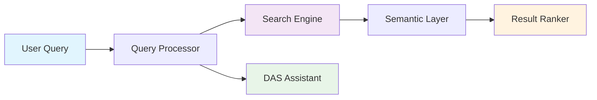

# Advanced Project Artifact Management for ODRAS: Research and Implementation Strategy

## Abstract

This research paper explores the integration of advanced project artifact management capabilities into the ODRAS (Ontology-Driven Research and Analysis System) platform. As ODRAS evolves to support comprehensive research workflows, including white paper generation, data analysis with tools like JupyterLab, and cross-project collaboration, there is a critical need for robust artifact storage, search, and reuse mechanisms. This paper analyzes current best practices, technical approaches, and provides concrete recommendations for implementing a semantic, graph-based artifact management system that leverages ODRAS's existing knowledge graph infrastructure.

## 1. Introduction

### 1.1 Current ODRAS Capabilities
ODRAS currently provides:
- Knowledge graph-based ontology management using Fuseki and Neo4j
- Vector-based search and retrieval using Qdrant
- DAS (Dialogue Analysis System) for conversational AI assistance
- Project thread management for conversation tracking
- BPMN workflow orchestration via Camunda

### 1.2 Vision for Enhanced Capabilities
The envisioned enhancement includes:
- Integration of JupyterLab for data analysis and computational notebooks
- White paper and document generation workflows
- Cross-project artifact search and reuse
- Semantic referencing system for research artifacts
- DAS-powered intelligent artifact discovery and suggestion

## 2. Literature Review and Best Practices

### 2.1 Research Artifact Management Systems

Current academic and industry practices demonstrate several key approaches:

**Graph-Based Artifact Storage**: Research indicates that graph databases provide natural representation of relationships between research artifacts, enabling complex queries and efficient retrieval of interconnected items (ArXiv:2008.04884). This aligns perfectly with ODRAS's existing graph infrastructure.

**Automated Traceability Systems**: Modern systems employ machine learning techniques to maintain links between artifacts as projects evolve. The TRAIL approach utilizes classifiers trained on existing traceability data to predict and update links between artifacts (ArXiv:1807.06684).

**Semantic Search and Retrieval**: Advanced search systems implement semantic techniques including Latent Semantic Indexing (LSI) and BERT-based models to understand context and meaning, improving search accuracy beyond keyword matching (ArXiv:2102.04411).

### 2.2 JupyterLab Integration Best Practices

Industry research reveals key patterns for JupyterLab integration:

**Environment Management**: Conda-based environment management ensures consistency across projects while supporting both system-wide and project-specific configurations.

**Version Control Integration**: Tools like `nbdime` address the challenges of versioning JSON-structured notebooks, enabling effective collaboration and change tracking.

**Documentation Standards**: Markdown-enhanced notebooks with comprehensive documentation improve clarity and facilitate long-term maintenance.

### 2.3 Collaborative Research Platforms

Successful platforms demonstrate:

**Modular Component Architecture**: Decomposing research projects into reusable components with unified APIs and metadata descriptions facilitates portable workflows (ArXiv:2011.01149).

**Real-time Collaboration**: Modern platforms support simultaneous multi-user editing with conflict resolution and change synchronization.

**Provenance Tracking**: Comprehensive provenance systems track the lineage of data transformations and analysis steps, supporting reproducibility and validation.

## 3. Technical Architecture Analysis

### 3.1 Artifact Storage Approaches

#### 3.1.1 Knowledge Graph Decomposition
Research artifacts can be decomposed into RDF triples using several strategies:

**Document Structure Triples**:
```turtle
:WhitePaper_123 a :ResearchDocument ;
    :hasSection :Section_1, :Section_2 ;
    :hasAuthor :User_JDoe ;
    :createdAt "2024-01-15T10:30:00Z"^^xsd:dateTime ;
    :belongsToProject :Project_ADT_Analysis .

:Section_1 a :DocumentSection ;
    :hasTitle "Literature Review" ;
    :hasContent "..." ;
    :hasOrder 1 .
```

**Jupyter Notebook Triples**:
```turtle
:Notebook_456 a :JupyterNotebook ;
    :hasCell :Cell_1, :Cell_2, :Cell_3 ;
    :hasKernel "python3" ;
    :lastModified "2024-01-15T14:22:00Z"^^xsd:dateTime .

:Cell_1 a :CodeCell ;
    :hasSource "import pandas as pd\ndf = pd.read_csv('data.csv')" ;
    :hasOutput :Output_1 ;
    :executionCount 1 .

:Output_1 a :NotebookOutput ;
    :hasType "display_data" ;
    :hasData :Graph_789 .
```

**Analytical Results Triples**:
```turtle
:Graph_789 a :DataVisualization ;
    :hasType "scatter_plot" ;
    :hasXAxis :Variable_Age ;
    :hasYAxis :Variable_Income ;
    :generatedBy :Analysis_101 ;
    :hasImageData :ImageFile_789 .

:Analysis_101 a :DataAnalysis ;
    :usedDataset :Dataset_Corporate_Survey ;
    :appliedMethod :CorrelationAnalysis ;
    :producedResult :Graph_789, :StatisticalSummary_102 .
```

#### 3.1.2 Provenance Integration
Utilizing PROV-O ontology for comprehensive provenance tracking:

```turtle
:Analysis_101 a prov:Activity ;
    prov:used :Dataset_Corporate_Survey ;
    prov:wasAssociatedWith :User_JDoe ;
    prov:generated :Graph_789 ;
    prov:startedAtTime "2024-01-15T09:00:00Z"^^xsd:dateTime .

:Graph_789 prov:wasDerivedFrom :Dataset_Corporate_Survey ;
    prov:wasGeneratedBy :Analysis_101 .
```

### 3.2 Search and Discovery Architecture

#### 3.2.1 Multi-Modal Search System



#### 3.2.2 Search Index Structure
```json
{
  "artifact_id": "graph_789",
  "type": "data_visualization",
  "content_embedding": [0.123, -0.456, ...],
  "metadata": {
    "title": "Age vs Income Correlation",
    "created_by": "jdoe",
    "project": "corporate_analysis",
    "tags": ["correlation", "demographics", "survey"],
    "variables": ["age", "income"],
    "method": "scatter_plot"
  },
  "relationships": {
    "derived_from": ["dataset_corporate_survey"],
    "generated_by": ["analysis_101"],
    "referenced_in": ["whitepaper_123"]
  }
}
```

### 3.3 Reference System Architecture

#### 3.3.1 Command Processing Pipeline

```mermaid
flowchart LR
    UserInput["/reference external_data_1"] --> CommandParser[Command Parser]
    CommandParser -->|"Extracts: command=reference, target=external_data_1"| ArtifactResolver[Artifact Resolver]
    ArtifactResolver -->|"Queries: Knowledge Graph + Search Index"| ContextBuilder[Context Builder]
    ContextBuilder -->|"Builds: Citation metadata, access permissions"| ContentInjector[Content Injector]
    ContentInjector -->|"Inserts: Reference with metadata into document"| Result[Final Document]

    style UserInput fill:#e3f2fd
    style CommandParser fill:#f1f8e9
    style ArtifactResolver fill:#fff3e0
    style ContextBuilder fill:#fce4ec
    style ContentInjector fill:#e8f5e8
    style Result fill:#f3e5f5
```



#### 3.3.2 Reference Resolution Logic
```python
class ArtifactResolver:
    def resolve_reference(self, reference_id: str, context: dict) -> ArtifactReference:
        # 1. Query knowledge graph for artifact metadata
        artifact_data = self.kg_query(f"""
            SELECT ?artifact ?type ?title ?creator ?project WHERE {{
                ?artifact :hasId "{reference_id}" ;
                         a ?type ;
                         :hasTitle ?title ;
                         :createdBy ?creator ;
                         :belongsToProject ?project .
            }}
        """)

        # 2. Check access permissions
        permissions = self.check_access(artifact_data, context.user)

        # 3. Retrieve content based on type
        content = self.get_content(artifact_data, permissions)

        # 4. Build citation metadata
        citation = self.build_citation(artifact_data, context.document)

        return ArtifactReference(artifact_data, content, citation, permissions)
```

## 4. Implementation Recommendations

### 4.1 Phase 1: Foundation Infrastructure

#### 4.1.1 Extend ODRAS Knowledge Graph Schema
```turtle
# Core artifact ontology
:Artifact a owl:Class ;
    rdfs:label "Research Artifact" ;
    rdfs:comment "Base class for all research artifacts in ODRAS" .

:Document rdfs:subClassOf :Artifact .
:JupyterNotebook rdfs:subClassOf :Artifact .
:DataVisualization rdfs:subClassOf :Artifact .
:Dataset rdfs:subClassOf :Artifact .
:AnalyticalResult rdfs:subClassOf :Artifact .

# Provenance properties
:derivedFrom a owl:ObjectProperty ;
    rdfs:domain :Artifact ;
    rdfs:range :Artifact .

:generatedBy a owl:ObjectProperty ;
    rdfs:domain :Artifact ;
    rdfs:range :Analysis .

# Metadata properties
:hasTag a owl:DatatypeProperty ;
    rdfs:domain :Artifact ;
    rdfs:range xsd:string .

:hasAccessLevel a owl:DatatypeProperty ;
    rdfs:domain :Artifact ;
    rdfs:range xsd:string .
```

#### 4.1.2 Artifact Storage Service
```python
class ArtifactStorageService:
    def __init__(self, minio_client, fuseki_client, qdrant_client):
        self.minio = minio_client      # File storage
        self.fuseki = fuseki_client    # Metadata & relationships
        self.qdrant = qdrant_client    # Vector search

    async def store_artifact(self, artifact: Artifact) -> str:
        # 1. Store binary content in Minio
        content_uri = await self.minio.put_object(
            bucket="artifacts",
            object_name=f"{artifact.project}/{artifact.id}",
            data=artifact.content
        )

        # 2. Extract and store metadata in Fuseki
        await self.fuseki.update(f"""
            INSERT DATA {{
                :{artifact.id} a :{artifact.type} ;
                    :hasTitle "{artifact.title}" ;
                    :createdBy :{artifact.creator} ;
                    :belongsToProject :{artifact.project} ;
                    :hasContentUri "{content_uri}" ;
                    :createdAt "{artifact.created_at}"^^xsd:dateTime .
            }}
        """)

        # 3. Generate and store embeddings in Qdrant
        embedding = await self.generate_embedding(artifact.content)
        await self.qdrant.upsert(
            collection_name="artifact_embeddings",
            points=[{
                "id": artifact.id,
                "vector": embedding,
                "payload": {
                    "type": artifact.type,
                    "project": artifact.project,
                    "tags": artifact.tags
                }
            }]
        )

        return artifact.id
```

### 4.2 Phase 2: JupyterLab Integration

#### 4.2.1 JupyterLab Extension Architecture
```typescript
// ODRAS JupyterLab Extension
export class ODRASExtension implements JupyterFrontEndPlugin<void> {
    id = 'odras:artifact-manager';

    activate(app: JupyterFrontEnd) {
        // Add artifact search panel
        const searchWidget = new ArtifactSearchWidget();
        app.shell.add(searchWidget, 'left');

        // Add reference insertion command
        app.commands.addCommand('odras:insert-reference', {
            label: 'Insert ODRAS Reference',
            execute: async (args) => {
                const reference = await this.showReferenceDialog();
                if (reference) {
                    this.insertReference(reference);
                }
            }
        });

        // Add notebook save hook
        app.serviceManager.contents.fileChanged.connect((sender, change) => {
            if (change.type === 'save' && change.newValue.path.endsWith('.ipynb')) {
                this.saveNotebookToODRAS(change.newValue);
            }
        });
    }
}
```

#### 4.2.2 Notebook Decomposition Service
```python
class NotebookDecomposer:
    def decompose_notebook(self, notebook_path: str, project_id: str) -> List[RDFTriple]:
        with open(notebook_path) as f:
            notebook = json.load(f)

        triples = []
        notebook_uri = f":{project_id}_notebook_{uuid4()}"

        # Notebook metadata
        triples.extend([
            (notebook_uri, "a", ":JupyterNotebook"),
            (notebook_uri, ":belongsToProject", f":{project_id}"),
            (notebook_uri, ":hasKernel", f'"{notebook["metadata"]["kernelspec"]["name"]}"'),
        ])

        # Process cells
        for i, cell in enumerate(notebook["cells"]):
            cell_uri = f"{notebook_uri}_cell_{i}"
            triples.append((notebook_uri, ":hasCell", cell_uri))

            if cell["cell_type"] == "code":
                triples.extend(self.process_code_cell(cell_uri, cell, i))
            elif cell["cell_type"] == "markdown":
                triples.extend(self.process_markdown_cell(cell_uri, cell, i))

        return triples

    def process_code_cell(self, cell_uri: str, cell: dict, index: int) -> List[RDFTriple]:
        triples = [
            (cell_uri, "a", ":CodeCell"),
            (cell_uri, ":hasOrder", str(index)),
            (cell_uri, ":hasSource", f'"{cell["source"]}"'),
        ]

        # Process outputs if present
        if "outputs" in cell:
            for j, output in enumerate(cell["outputs"]):
                output_uri = f"{cell_uri}_output_{j}"
                triples.append((cell_uri, ":hasOutput", output_uri))
                triples.extend(self.process_output(output_uri, output))

        return triples
```

### 4.3 Phase 3: Intelligent Search and DAS Integration

#### 4.3.1 DAS Artifact Assistant
```python
class DASArtifactAssistant:
    def __init__(self, artifact_service, search_service):
        self.artifact_service = artifact_service
        self.search_service = search_service

    async def suggest_relevant_artifacts(self, context: ConversationContext) -> List[Artifact]:
        """Proactively suggest relevant artifacts based on conversation context"""

        # Extract key concepts from conversation
        concepts = await self.extract_concepts(context.messages)

        # Search for related artifacts
        candidates = []
        for concept in concepts:
            results = await self.search_service.semantic_search(
                query=concept,
                filters={"accessible_by": context.user_id},
                limit=5
            )
            candidates.extend(results)

        # Rank by relevance and novelty
        ranked_artifacts = await self.rank_artifacts(candidates, context)

        return ranked_artifacts[:3]  # Top 3 suggestions

    async def process_reference_request(self, request: str, context: ConversationContext) -> str:
        """Process natural language requests for artifact references"""

        # Parse request using NLP
        parsed = await self.nlp_parser.parse(request)

        if parsed.intent == "search_artifact":
            # Search for artifacts matching criteria
            results = await self.search_service.search(
                query=parsed.query,
                artifact_types=parsed.types,
                projects=parsed.projects,
                user_id=context.user_id
            )

            if len(results) == 1:
                return await self.format_reference(results[0])
            elif len(results) > 1:
                return await self.present_options(results)
            else:
                return "No matching artifacts found. Would you like me to suggest similar artifacts?"

        elif parsed.intent == "insert_artifact":
            artifact = await self.artifact_service.get(parsed.artifact_id)
            return await self.generate_insertion_code(artifact, parsed.insertion_type)
```

#### 4.3.2 Advanced Search Capabilities
```python
class SemanticSearchService:
    def __init__(self, qdrant_client, fuseki_client):
        self.qdrant = qdrant_client
        self.fuseki = fuseki_client
        self.embedder = SentenceTransformer('all-MiniLM-L6-v2')

    async def hybrid_search(self, query: str, filters: dict = None) -> List[SearchResult]:
        """Combine vector search with graph traversal"""

        # 1. Vector similarity search
        query_embedding = self.embedder.encode(query)
        vector_results = await self.qdrant.search(
            collection_name="artifact_embeddings",
            query_vector=query_embedding,
            limit=50,
            score_threshold=0.7
        )

        # 2. Graph-based expansion
        expanded_results = []
        for result in vector_results:
            # Find related artifacts through graph relationships
            related = await self.fuseki.query(f"""
                SELECT ?related ?relation ?title WHERE {{
                    :{result.id} ?relation ?related .
                    ?related :hasTitle ?title .
                    FILTER(?relation IN (:derivedFrom, :generatedBy, :referencedIn))
                }}
            """)
            expanded_results.extend(related)

        # 3. Apply filters and rank
        filtered_results = self.apply_filters(expanded_results, filters)
        ranked_results = self.rank_results(filtered_results, query)

        return ranked_results

    async def contextual_search(self, query: str, current_project: str) -> List[SearchResult]:
        """Search with project context weighting"""

        base_results = await self.hybrid_search(query)

        # Weight results by project relationship
        weighted_results = []
        for result in base_results:
            weight = 1.0

            # Same project gets higher weight
            if result.project == current_project:
                weight *= 2.0

            # Recently referenced artifacts get higher weight
            if result.last_referenced and (datetime.now() - result.last_referenced).days < 30:
                weight *= 1.5

            # Frequently used artifacts get higher weight
            weight *= (1.0 + result.usage_count * 0.1)

            result.score *= weight
            weighted_results.append(result)

        return sorted(weighted_results, key=lambda x: x.score, reverse=True)
```

## 5. Integration with Existing ODRAS Architecture

### 5.1 Database Integration
The artifact management system seamlessly integrates with ODRAS's existing infrastructure:

- **Fuseki**: Stores artifact metadata, relationships, and provenance information
- **Neo4j**: Maintains complex relationship graphs for advanced traversal queries
- **Qdrant**: Provides vector-based semantic search capabilities
- **MinIO**: Stores actual artifact content (notebooks, documents, visualizations)
- **PostgreSQL**: Manages user permissions and access control

### 5.2 BPMN Workflow Integration
Artifact management operations are implemented as BPMN workflows:

```xml
<bpmn:process id="StoreArtifactProcess" isExecutable="true">
  <bpmn:startEvent id="StartEvent_StoreArtifact"/>
  <bpmn:serviceTask id="ValidateArtifact" name="Validate Artifact">
    <bpmn:extensionElements>
      <zeebe:taskDefinition type="validateArtifact"/>
    </bpmn:extensionElements>
  </bpmn:serviceTask>
  <bpmn:serviceTask id="ExtractMetadata" name="Extract Metadata">
    <bpmn:extensionElements>
      <zeebe:taskDefinition type="extractMetadata"/>
    </bpmn:extensionElements>
  </bpmn:serviceTask>
  <bpmn:serviceTask id="GenerateEmbedding" name="Generate Embedding">
    <bpmn:extensionElements>
      <zeebe:taskDefinition type="generateEmbedding"/>
    </bpmn:extensionElements>
  </bpmn:serviceTask>
  <bpmn:serviceTask id="StoreContent" name="Store in MinIO">
    <bpmn:extensionElements>
      <zeebe:taskDefinition type="storeInMinio"/>
    </bpmn:extensionElements>
  </bpmn:serviceTask>
  <bpmn:serviceTask id="UpdateKnowledgeGraph" name="Update Knowledge Graph">
    <bpmn:extensionElements>
      <zeebe:taskDefinition type="updateKnowledgeGraph"/>
    </bpmn:extensionElements>
  </bpmn:serviceTask>
  <bpmn:endEvent id="EndEvent_ArtifactStored"/>
</bpmn:process>
```

### 5.3 DAS Enhancement
DAS receives new capabilities for artifact management:

```python
class DASArtifactCapabilities:
    COMMANDS = {
        "find_artifacts": "Search for project artifacts using natural language",
        "suggest_references": "Suggest relevant artifacts for current context",
        "insert_reference": "Insert a reference to an existing artifact",
        "create_citation": "Generate proper academic citations for artifacts",
        "track_usage": "Track artifact usage and dependencies",
        "check_permissions": "Verify access permissions for artifacts"
    }

    async def handle_artifact_query(self, query: str, context: dict) -> str:
        """Process artifact-related queries from users"""
        intent = await self.classify_intent(query)

        if intent == "search":
            results = await self.search_artifacts(query, context)
            return self.format_search_results(results)
        elif intent == "reference":
            reference = await self.create_reference(query, context)
            return f"Reference created: {reference}"
        elif intent == "suggest":
            suggestions = await self.suggest_artifacts(context)
            return self.format_suggestions(suggestions)
```

## 6. Security and Access Control

### 6.1 Permission Model
```turtle
# Access control ontology
:AccessPolicy a owl:Class .
:User a owl:Class .
:UserGroup a owl:Class .
:Permission a owl:Class .

:hasPermission a owl:ObjectProperty ;
    rdfs:domain :User ;
    rdfs:range :Permission .

:canRead a :Permission .
:canWrite a :Permission .
:canReference a :Permission .
:canShare a :Permission .

# Example permissions
:User_JDoe :hasPermission [
    a :canRead ;
    :applies_to :Project_ADT_Analysis
] .
```

### 6.2 Privacy and Compliance
- All artifact access is logged for audit purposes
- Personal data in artifacts is automatically detected and flagged
- GDPR compliance through data minimization and right to erasure
- Project-level access controls prevent unauthorized cross-project access

## 7. Performance Considerations

### 7.1 Scalability Architecture
- **Horizontal scaling**: Distribute artifact storage across multiple MinIO clusters
- **Caching layer**: Redis-based caching for frequently accessed metadata
- **Search optimization**: Periodic reindexing and embedding updates
- **Load balancing**: Multiple search service instances for high availability

### 7.2 Storage Optimization
- **Deduplication**: Content-addressable storage prevents duplicate artifacts
- **Compression**: Automatic compression for large notebooks and documents
- **Archiving**: Cold storage for infrequently accessed artifacts
- **Cleanup**: Automated removal of orphaned or expired artifacts

## 8. Evaluation Metrics

### 8.1 System Performance Metrics
- **Search Latency**: <100ms for simple queries, <500ms for complex searches
- **Storage Efficiency**: >90% deduplication ratio for similar artifacts
- **Availability**: 99.9% uptime for artifact access services
- **Throughput**: Support for 1000+ concurrent artifact operations

### 8.2 User Experience Metrics
- **Search Precision**: >85% relevant results in top 10 search results
- **Reference Accuracy**: >95% successful reference resolution
- **Discovery Rate**: Users find relevant artifacts in <3 search attempts
- **Adoption Rate**: >80% of projects use artifact referencing features

## 9. Implementation Timeline

### Phase 1 (Months 1-2): Foundation
- Extend knowledge graph schema for artifacts
- Implement basic artifact storage service
- Create MinIO integration for content storage
- Develop initial search capabilities

### Phase 2 (Months 3-4): JupyterLab Integration
- Develop JupyterLab extension for ODRAS
- Implement notebook decomposition service
- Create artifact extraction workflows
- Build basic reference insertion system

### Phase 3 (Months 5-6): Advanced Features
- Integrate DAS with artifact management
- Implement semantic search and discovery
- Add provenance tracking and visualization
- Create advanced permission system

### Phase 4 (Months 7-8): Optimization
- Performance tuning and scalability improvements
- Advanced analytics and usage tracking
- Cross-project collaboration features
- User interface refinements

## 10. Conclusion

The integration of advanced artifact management capabilities into ODRAS represents a significant evolution toward a comprehensive research platform. By leveraging existing knowledge graph infrastructure and semantic technologies, ODRAS can provide researchers with powerful tools for artifact discovery, reuse, and collaboration.

The proposed architecture addresses key challenges in research artifact management while maintaining compatibility with ODRAS's existing systems. The phased implementation approach allows for iterative development and user feedback integration.

Key benefits of this approach include:

1. **Semantic Integration**: Artifacts are not just stored but understood in context
2. **Intelligent Discovery**: DAS-powered recommendations improve research efficiency
3. **Reproducible Research**: Comprehensive provenance tracking supports scientific rigor
4. **Cross-Project Collaboration**: Shared artifact libraries foster knowledge reuse
5. **Scalable Architecture**: Graph-based storage scales with organizational growth

This research provides a roadmap for transforming ODRAS into a next-generation research platform that combines the power of knowledge graphs with modern collaborative tools, positioning it as a leader in ontology-driven research environments.

## References

1. ArXiv:2008.04884 - "Graph-based storage and querying for research data management"
2. ArXiv:1807.06684 - "Automated traceability recovery in software engineering"
3. ArXiv:2102.04411 - "BERT-based traceability link recovery for software artifacts"
4. ArXiv:2011.01149 - "Modular workflow composition for computational research"
5. ArXiv:2312.16854 - "Transitive traceability links in software requirements"
6. Taylor-Amarel.com - "Collaborative data analysis with Jupyter notebooks and Git"
7. TowardsDataScience.com - "Managing JupyterLab-based data science projects"
8. TheGlobalPresence.com - "JupyterLab: The ultimate guide to interactive Python"
9. EvolvingDev.com - "Mastering Jupyter notebooks: A comprehensive guide"
10. Restack.io - "Collaborative agile methodologies and environments"
