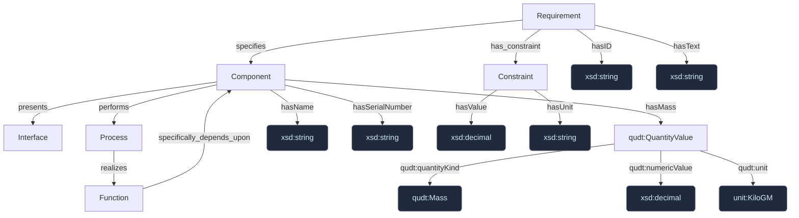
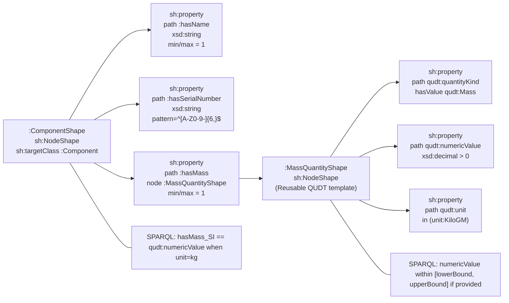

Absolutely—here are two **Mermaid** diagrams you can paste straight into your builder to show (1) the ontology with a few **data properties** added, and (2) how the **SHACL shapes** hang together (including a reusable mass-quantity template).

---

## 1) Ontology + data properties



**What’s shown:**

* Your original object graph (Requirement → Constraint, etc.).
* New **data properties**:

  * `Requirement`: `hasID`, `hasText`
  * `Component`: `hasName`, `hasSerialNumber`
  * `Constraint`: `hasValue`, `hasUnit`
  * `Component` → `hasMass` → `qudt:QuantityValue` with `qudt:numericValue` and `qudt:unit` (engineering-grade units)

---

## 2) SHACL shapes (class shape + nested quantity template)



**What’s shown:**

* `:ComponentShape` validates Components:

  * `hasName` (string, exactly 1)
  * `hasSerialNumber` (string with pattern)
  * `hasMass` (exactly 1) and **delegates** to a reusable `:MassQuantityShape`
* `:MassQuantityShape` validates the QUDT quantity:

  * `qudt:quantityKind = qudt:Mass`
  * `qudt:numericValue` is a positive decimal
  * `qudt:unit ∈ { unit:KiloGM }` (enforce SI kg)
* Two optional **SPARQL** constraints (handy for engineering):

  * Literal shortcut `hasMass_SI` equals the QUDT numeric value (when unit=kg)
  * numericValue within tolerance bounds if you store `lowerBound`/`upperBound`

---

### (Optional) Matching SHACL (copy-paste TTl if you want to generate from your builder)

```turtle
@prefix :      <https://example.org/onto#> .
@prefix sh:    <http://www.w3.org/ns/shacl#> .
@prefix qudt:  <http://qudt.org/schema/qudt/> .
@prefix unit:  <http://qudt.org/vocab/unit/> .
@prefix xsd:   <http://www.w3.org/2001/XMLSchema#> .

:ComponentShape a sh:NodeShape ;
  sh:targetClass :Component ;
  sh:property [
    sh:path :hasName ;
    sh:datatype xsd:string ;
    sh:minCount 1 ; sh:maxCount 1 ;
    sh:message "Component must have exactly one hasName (xsd:string)."
  ] ;
  sh:property [
    sh:path :hasSerialNumber ;
    sh:datatype xsd:string ;
    sh:pattern "^[A-Z0-9\\-]{6,}$" ;
    sh:message "Serial number must be 6+ chars (A-Z,0-9,-)."
  ] ;
  sh:property [
    sh:path :hasMass ;
    sh:minCount 1 ; sh:maxCount 1 ;
    sh:node :MassQuantityShape ;
    sh:message "Component must have exactly one hasMass (QUDT QuantityValue)."
  ] .

:MassQuantityShape a sh:NodeShape ;
  sh:property [
    sh:path qudt:quantityKind ;
    sh:hasValue qudt:Mass ;
    sh:message "QuantityValue must have qudt:quantityKind qudt:Mass."
  ] ;
  sh:property [
    sh:path qudt:numericValue ;
    sh:datatype xsd:decimal ;
    sh:minExclusive 0 ;
    sh:message "Mass numericValue must be > 0 (xsd:decimal)."
  ] ;
  sh:property [
    sh:path qudt:unit ;
    sh:in ( unit:KiloGM ) ;
    sh:minCount 1 ;
    sh:message "Mass unit must be unit:KiloGM (SI kg)."
  ] .

# Optional SPARQL checks
:MassSICheck a sh:NodeShape ;
  sh:targetClass :Component ;
  sh:sparql [
    sh:message "hasMass_SI must equal qudt:numericValue when unit=kg." ;
    sh:select """
      PREFIX qudt: <http://qudt.org/schema/qudt/>
      PREFIX unit: <http://qudt.org/vocab/unit/>
      SELECT ?this WHERE {
        ?this :hasMass_SI ?si ;
              :hasMass ?qv .
        ?qv   qudt:numericValue ?v ;
              qudt:unit unit:KiloGM .
        FILTER(?si != ?v)
      }
    """
  ] .

:MassWithinBounds a sh:NodeShape ;
  sh:targetObjectsOf :hasMass ;
  sh:sparql [
    sh:message "numericValue must be within [lowerBound, upperBound] if provided." ;
    sh:select """
      PREFIX qudt: <http://qudt.org/schema/qudt/>
      SELECT $this WHERE {
        $this qudt:numericValue ?v .
        OPTIONAL { $this :lowerBound ?lo . }
        OPTIONAL { $this :upperBound ?hi . }
        FILTER( (BOUND(?lo) && ?v < ?lo) || (BOUND(?hi) && ?v > ?hi) )
      }
    """
  ] .
```

