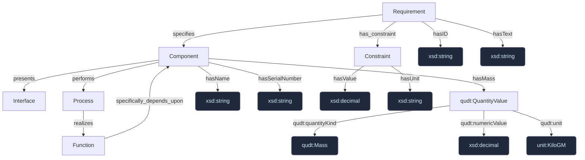
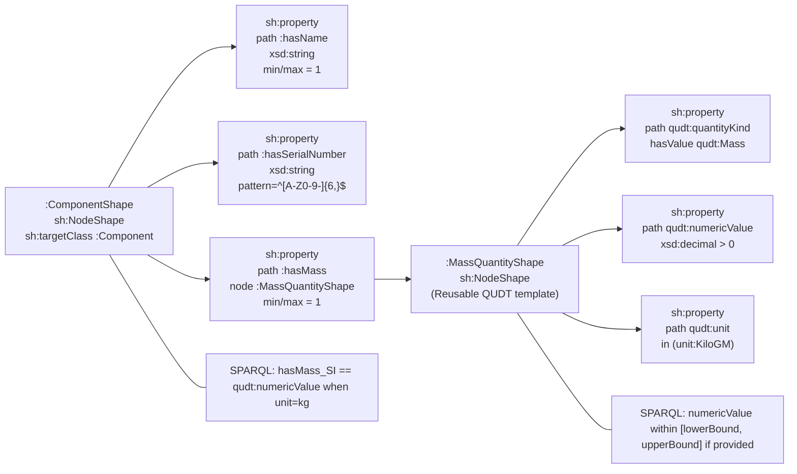

```mermaid
graph TD
  %% ====== Classes ======
  R[Requirement]
  C[Component]
  I[Interface]
  P[Process]
  F[Function]
  K[Constraint]
  QV[qudt:QuantityValue]

  %% ====== Object properties ======
  R -- has_constraint --> K
  R -- specifies --> C
  C -- presents --> I
  C -- performs --> P
  P -- realizes --> F
  F -- specifically_depends_upon --> C
  C -- hasMass --> QV

  %% ====== Data properties on core classes ======
  R -- hasID --> R_id["xsd:string"]
  R -- hasText --> R_txt["xsd:string"]

  C -- hasName --> C_name["xsd:string"]
  C -- hasSerialNumber --> C_sn["xsd:string"]

  K -- hasValue --> K_val["xsd:decimal"]
  K -- hasUnit --> K_unit["xsd:string"]

  %% ====== QUDT quantity value details ======
  QV -- qudt:quantityKind --> QV_kind["qudt:Mass"]
  QV -- qudt:numericValue --> QV_val["xsd:decimal"]
  QV -- qudt:unit --> QV_unit["unit:KiloGM"]

  %% Styling for "literal" leaves
  classDef lit fill:#1f2b3a,stroke:#88a,stroke-width:1px,color:#cfe9ff,rx:6,ry:6;
  class R_id,R_txt,C_name,C_sn,K_val,K_unit,QV_kind,QV_val,QV_unit lit;
```
---

```mermaid
flowchart LR
  %% ====== NodeShapes ======
  SComp[":ComponentShape<br>sh:NodeShape<br>sh:targetClass :Component"]
  SMass[":MassQuantityShape<br>sh:NodeShape<br>(Reusable QUDT template)"]

  %% ====== PropertyShapes attached to ComponentShape ======
  SComp_Name["sh:property\npath :hasName\nxsd:string\nmin/max = 1"]
  SComp_SN["sh:property\npath :hasSerialNumber\nxsd:string\npattern=^[A-Z0-9-]{6,}$"]
  SComp_Mass["sh:property\npath :hasMass\nnode :MassQuantityShape\nmin/max = 1"]

  %% ====== PropertyShapes inside MassQuantityShape ======
  SMass_QK["sh:property\npath qudt:quantityKind\nhasValue qudt:Mass"]
  SMass_NV["sh:property\npath qudt:numericValue\nxsd:decimal > 0"]
  SMass_U["sh:property\npath qudt:unit\nin (unit:KiloGM)"]

  %% ====== Wiring ======
  SComp --> SComp_Name
  SComp --> SComp_SN
  SComp --> SComp_Mass
  SComp_Mass --> SMass

  SMass --> SMass_QK
  SMass --> SMass_NV
  SMass --> SMass_U

  %% ====== Optional cross-field SPARQL checks (examples) ======
  SP1["SPARQL: hasMass_SI == qudt:numericValue when unit=kg"]
  SP2["SPARQL: numericValue within [lowerBound, upperBound] if provided"]

  SComp --- SP1
  SMass --- SP2
```