# ODRAS Presentation - October 16, 2025

## Slide 1: How We Got Here - The Genesis of ODRAS

### The Problem: Traditional Approach Wasn't Working
**WIRR Program Context**: Investigating weapons integration optimizations for next-gen Navy/Marine air vehicle (V-22 successor)

**What I Observed**:
- Discussions with airframers → updating PowerPoint slides → repeat
- **Ineffectual for a program of this gravity**: designing a new air vehicle
- **No systematic requirements capture**: just talking about capabilities from CDD (Capability Development Document)
- **FLRAA baseline discussions**: but no structured analysis or traceability
- **Knowledge loss**: tribal knowledge evaporating between meetings

### The Breakthrough: June 2024
**"There has to be a better way..."**

**Background**:
- Working with LLMs for data analysis and knowledge extraction
- Studying ontology-based communication with AI systems
- SysMLv2 → semantic-based notation → led to ontology exploration
- Serendipitous discovery of Barry Smith's Systems Engineering Ontology work (Buffalo)

**ReqFlow Experiment**:
- Extracted **435 requirements** from FLRAA CDD
- Asked LLM: *"What might we need to do this?"*
- Used early **BSEO_v1 ontology** (started as a "JSON file I dreamed up")
- **Conceptualized ~2,500 classes** automatically
- *"I didn't know this was an ontology at the time... lucky I guess"*

### The Evolution: From ReqFlow to ODRAS
**What ReqFlow Proved**: LLMs + Ontologies + Requirements = System Conceptualization at Scale

**WIRR as the Test Bed**:
- **Decision**: Build a tool to utilize LLMs for data capture, analysis, knowledge, and conceptualization
- **Goal**: Replace PowerPoint engineering with structured, traceable, AI-powered analysis
- **Result**: ODRAS (Ontology-Driven Requirements Analysis System)

**The DADMS Lesson** (Deloitte Contribution):
- Deloitte provided SysML model for Decision Analysis Data Model (DADMS)
- **My reaction**: *"What do I do with this? Print it out and check it off as I go?"*
- **Insight**: Models must be **instantiable and executable**, not just diagrams
- **Solution**: Integrated **BPMN workflows** into ODRAS for executable process models

### The Vision: Engineering with Intelligence
**From PowerPoint to Platform**:
- Systematic requirements extraction and analysis
- Ontology-driven conceptualization with DAS (Digital Assistance System)
- Executable workflows, not static diagrams
- Knowledge capture and institutional memory
- Traceable decision-making from requirements to concepts

**ODRAS Today**: What started as a June 2024 experiment is now a comprehensive platform supporting WIRR and beyond.

---

## Slide 1a: How We Got Here - Executive Summary

### The Problem
- **WIRR Program**: Next-gen Navy/Marine air vehicle (V-22 successor) weapons integration
- **Traditional Approach**: Airframer discussions → PowerPoint updates → repeat
- **Gap**: No systematic requirements capture, no traceability, knowledge loss

### The Breakthrough (June 2024)
- **ReqFlow Experiment**: Extracted 435 requirements from FLRAA CDD
- **AI + Ontology**: LLM-powered conceptualization using BSEO_v1
- **Result**: ~2,500 system classes generated automatically

### The Evolution
- **From PowerPoint to Platform**: WIRR became test bed for ODRAS
- **Executable Models**: Integrated BPMN workflows (not just static diagrams)
- **AI-Powered Analysis**: DAS (Digital Assistance System) for requirements and conceptualization

### The Result
**ODRAS**: Ontology-Driven Requirements Analysis System
- Systematic requirements extraction and analysis
- AI-assisted conceptualization and knowledge capture
- Traceable decision-making from requirements to concepts
- Institutional memory preservation

---

## Slide 2: ODRAS Introduction
**ODRAS: Ontology-Driven Requirements Analysis System**

- **Purpose**: Comprehensive requirements analysis and system conceptualization platform
- **Focus**: Weapons Integration Risk Reduction (WIRR) effort
- **Mission**: Extract, analyze, and conceptualize requirements from FLRAA and Marine Appendix
- **Outcome**: Generate system concepts, components, and interfaces for Marine aviation variant

---

## Slide 2: WIRR Application - FLRAA Marine Variant Analysis
**What is ODRAS for WIRR?**

### Requirements Extraction
- **FLRAA Base Requirements**: Army variant baseline
- **Marine Appendix**: Additional requirements for Marine aviation operations
- **Result**: Different aircraft configuration to support Marine-specific needs

### DAS-Powered Conceptualization Process
- **Base Ontology**: BSEO_v1 foundation
- **Domain Expansion**: Aerospace-specific ontology extensions
- **DAS Analysis**: AI-driven requirement analysis and concept generation
- **Output**: Components, interfaces, processes, and functions needed for Marine variant

### Key Benefits
- Systematic requirements analysis
- AI-assisted conceptualization via DAS
- Ontology-driven system design
- Traceability from requirements to system concepts

---

## Slide 3: Airframer Engagement Tracking
**Pre-Milestone A Discussions**

### Airframer Partners
- **Bell** - Helicopter systems expertise
- **Boeing** - Fixed-wing and rotorcraft experience
- **Lockheed Martin (LMCO)** - Advanced systems integration
- **Leonardo Aerospace** - European rotorcraft capabilities

### Tracking Framework
- **Requirements Mapping**: Which airframer meets which requirement
- **Concept Phase Analysis**: How each partner addresses Marine variant needs
- **Knowledge Capture**: Tribal knowledge, assumptions, and lessons learned
- **Decision Support**: Data-driven partner evaluation

### ODRAS Role
- Centralized knowledge repository
- Requirements traceability matrix
- Collaborative analysis platform

---

## Slide 4: Future Phase - Trade Studies Foundation
**Building for Next Phase**

### Current WIRR Outputs
- **Vocabulary**: Standardized terminology for Marine aviation requirements
- **Ontology**: Expanded BSEO with Marine-specific concepts
- **Definitions**: Clear, traceable requirement definitions

### Trade Studies Preparation
- **Baseline Concepts**: System architectures from current analysis
- **Performance Metrics**: Quantifiable requirements for comparison
- **Risk Assessment**: Identified technical and integration risks
- **Cost Models**: Framework for life-cycle cost analysis

### ODRAS Evolution
- **Enhanced Analytics**: Trade study support tools
- **Simulation Integration**: Performance modeling capabilities
- **Decision Support**: Multi-criteria analysis frameworks

---

## Slide 5: DAS - The AI Assistant for ODRAS
**DAS: Design Analysis System**

### Current DAS Capabilities
- **Requirements Analysis**: AI-powered requirement interpretation and validation
- **Conceptualization**: Generate system components, interfaces, and functions
- **Ontology Integration**: Leverage BSEO and domain ontologies for analysis
- **Knowledge Retrieval**: RAG-powered access to project knowledge base
- **Conversational Interface**: Natural language interaction with system data

### DAS in WIRR Workflow
- **Document Analysis**: Process FLRAA and Marine Appendix requirements
- **Concept Generation**: Create Marine variant system concepts
- **Airframer Evaluation**: Analyze partner capabilities against requirements
- **Decision Support**: Provide rationale and recommendations

### DAS Growth Roadmap
- **Enhanced Reasoning**: Multi-step analysis and synthesis capabilities
- **Simulation Integration**: Connect to performance modeling tools
- **Collaborative Analysis**: Multi-user DAS sessions for team analysis
- **Automated Reporting**: Generate analysis reports and recommendations
- **Trade Study Support**: Multi-criteria decision analysis assistance

---

## Slide 6: Current and Planned Workbenches
**ODRAS Workbench Ecosystem**

### Current Workbenches
- **Ontology Workbench**: BSEO management and expansion
- **Requirements Workbench**: FLRAA/Marine Appendix analysis
- **Conceptualizer Workbench**: System architecture generation
- **Knowledge Workbench**: Document and knowledge management
- **Files Workbench**: Document storage and organization
- **Analysis Lab**: Data analysis and visualization
- **Project Workbench**: Project management and tracking
- **Admin Workbench**: System administration
- **Event Manager**: System event tracking and audit
- **DAS Chat Interface**: AI assistant integration

### Planned Workbenches
- **Trade Studies Workbench**: Multi-criteria analysis and comparison
- **Simulation Workbench**: Performance modeling and validation
- **Collaboration Workbench**: Multi-user real-time collaboration
- **Reporting Workbench**: Automated report generation
- **Integration Workbench**: External system connectivity
- **Advanced DAS Workbench**: Enhanced AI analysis capabilities

---

## Slide 7: ODRAS Architecture Overview
**System Architecture with DAS Integration**

### Core Components
- **User Interface**: Web portal with workbench-based navigation
- **ODRAS Core**: Ontology engine, knowledge RAG, requirements processor
- **DAS AI Assistant**: LLM-powered analysis and conceptualization
- **Data Layer**: PostgreSQL, Neo4j, Qdrant vectors, Fuseki RDF

### Key Features
- **Project Isolation**: Secure, isolated project cells
- **Knowledge Processing**: Document ingestion, chunking, embedding generation
- **Ontology Management**: Multi-layer ontology with import/export capabilities
- **AI-Powered Analysis**: DAS-driven system concept generation and analysis

### Integration Points
- **DAS Integration**: AI assistant for analysis and conceptualization
- **External Systems**: API connectivity for data exchange
- **Export Capabilities**: Cameo, Excel, and other format support

---

## Slide 8: WIRR Workflow in ODRAS with DAS
**End-to-End Process**

```mermaid
%%{init: {'theme':'base', 'themeVariables': { 'fontSize':'12px'}}}%%
flowchart LR
    subgraph PHASE1["Phase 1: Requirements Ingestion"]
        DOC["📄 FLRAA/Marine<br/>Documents"]
        EXT["Text Extraction"]
        REQ_ID["Requirements<br/>Identification"]
        ONT_MAP["Ontology<br/>Mapping"]
        
        DOC --> EXT
        EXT --> REQ_ID
        REQ_ID --> ONT_MAP
    end
    
    subgraph PHASE2["Phase 2: DAS-Powered Conceptualization"]
        DAS_ANAL["DAS Analysis"]
        SYS_GEN["System Generation"]
        ARCH_DEV["Architecture<br/>Development"]
        VAL["Validation"]
        
        DAS_ANAL --> SYS_GEN
        SYS_GEN --> ARCH_DEV
        ARCH_DEV --> VAL
    end
    
    subgraph PHASE3["Phase 3: Knowledge Management"]
        AIRF_TRACK["Airframer<br/>Tracking"]
        DEC_LOG["Decision<br/>Logging"]
        KNOW_BASE["Knowledge<br/>Base"]
        TRACE["Traceability"]
        
        AIRF_TRACK --> DEC_LOG
        DEC_LOG --> KNOW_BASE
        KNOW_BASE --> TRACE
    end
    
    ONT_MAP --> DAS_ANAL
    VAL --> AIRF_TRACK
    
    style PHASE1 fill:#e3f2fd,stroke:#1976d2,stroke-width:2px
    style PHASE2 fill:#fff3e0,stroke:#f57c00,stroke-width:2px
    style PHASE3 fill:#e8f5e9,stroke:#388e3c,stroke-width:2px
```

### Phase 1: Requirements Ingestion
1. **Document Upload**: FLRAA and Marine Appendix documents
2. **Text Extraction**: Automated content extraction and parsing
3. **Requirements Identification**: AI-assisted requirement discovery
4. **Ontology Mapping**: Link requirements to BSEO concepts

### Phase 2: DAS-Powered Conceptualization
1. **DAS Analysis**: AI-driven requirement analysis and interpretation
2. **System Generation**: Component, interface, and function identification
3. **Architecture Development**: System-level concept creation
4. **Validation**: Cross-reference with airframer capabilities

### Phase 3: Knowledge Management
1. **Airframer Tracking**: Partner engagement and capability mapping
2. **Decision Logging**: Assumptions, decisions, and rationale capture
3. **Knowledge Base**: Centralized repository for tribal knowledge
4. **Traceability**: Full requirements-to-concept traceability

---

## Slide 9: DAS Evolution and Future Capabilities
**DAS Growth Roadmap**

### Current DAS Capabilities
- **Requirements Analysis**: AI-powered requirement interpretation and validation
- **Concept Generation**: Generate system components, interfaces, and functions
- **Ontology Integration**: Leverage BSEO and domain ontologies for analysis
- **Knowledge Retrieval**: RAG-powered access to project knowledge base
- **Conversational Interface**: Natural language interaction with system data

### Near-term DAS Evolution (6 months)
- **Enhanced Reasoning**: Multi-step analysis and synthesis capabilities
- **Simulation Integration**: Connect to performance modeling tools
- **Collaborative Analysis**: Multi-user DAS sessions for team analysis
- **Automated Reporting**: Generate analysis reports and recommendations

### Future DAS Capabilities (12+ months)
- **Trade Study Support**: Multi-criteria decision analysis assistance
- **Predictive Modeling**: Forecast system performance and risks
- **Automated Decision Support**: AI-driven recommendation engine
- **Advanced Analytics**: Complex system behavior analysis

---

## Slide 10: Benefits and Outcomes
**WIRR Success Metrics**

### Immediate Benefits
- **Systematic Analysis**: Structured approach to complex requirements
- **AI-Powered Insights**: DAS-driven analysis and recommendations
- **Knowledge Preservation**: Capture of tribal knowledge and assumptions
- **Partner Coordination**: Centralized tracking of airframer capabilities
- **Decision Support**: Data-driven partner evaluation

### Long-term Value
- **Trade Studies Foundation**: Prepared vocabulary, ontology, and definitions
- **Reusable Framework**: Methodology applicable to future programs
- **Knowledge Asset**: Institutional knowledge preservation
- **Risk Reduction**: Early identification of integration challenges
- **AI-Enhanced Analysis**: Continuously improving DAS capabilities

### ODRAS Growth
- **Expanded Capabilities**: Enhanced workbenches and features
- **Domain Expertise**: Aerospace-specific ontology and processes
- **Proven Methodology**: Validated approach for complex system analysis
- **AI Integration**: DAS as core component of analysis workflow

---

## Slide 11: Next Steps and Timeline
**WIRR Roadmap with DAS Evolution**

### Immediate (Next 30 Days)
- Complete FLRAA requirements extraction
- Finalize Marine Appendix analysis
- Initiate airframer engagement tracking
- Expand BSEO ontology for Marine concepts
- Enhance DAS reasoning capabilities

### Short-term (Next 90 Days)
- Complete conceptualization phase
- Finalize airframer capability mapping
- Develop trade studies framework
- Prepare transition to next phase
- Implement DAS simulation integration

### Long-term (Next 6 Months)
- Implement trade studies workbench
- Integrate simulation capabilities
- Develop automated reporting
- Expand collaboration features
- Deploy advanced DAS analytics

---

## Slide 12: Questions and Discussion
**Open Discussion**

### Key Topics
- **WIRR Progress**: Current status and challenges
- **DAS Capabilities**: AI assistant features and roadmap
- **Airframer Engagement**: Partner coordination strategies
- **ODRAS Capabilities**: Feature requests and enhancements
- **Trade Studies**: Preparation and requirements
- **Future Phases**: Long-term vision and roadmap

### Contact Information
- **Project Lead**: [Name]
- **Technical Lead**: [Name]
- **DAS Development**: [Contact Information]
- **ODRAS Support**: [Contact Information]

**Thank you for your attention and participation in the WIRR effort.**
