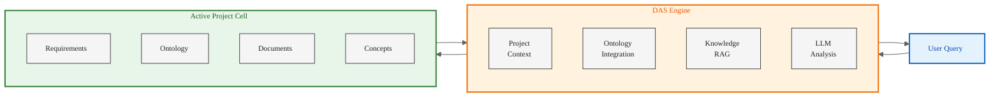
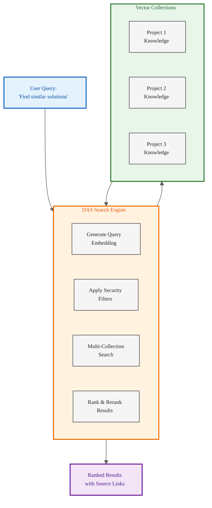

# DAS - Digital Assistance System
**AI-Powered Project Intelligence for ODRAS**

---

## What is DAS?

**DAS (Digital Assistance System)** is an intelligent AI assistant integrated into ODRAS that provides context-aware support for requirements analysis, system conceptualization, and knowledge retrieval. Unlike generic AI assistants, DAS is deeply integrated with your project data, ontologies, and domain knowledge.

### Core Capabilities
- **Natural Language Interface**: Ask questions about requirements, ontologies, components, and system designs
- **Requirement Analysis**: Interpret and validate requirements, identify conflicts and gaps
- **Concept Generation**: Create system components, interfaces, and functions from requirements
- **Knowledge Retrieval**: RAG-powered access to project documents, tribal knowledge, and vendor data
- **Decision Support**: Provide rationale and recommendations based on project context

---

## Project-Aware Intelligence

DAS operates within **Project Cells** - isolated environments that maintain complete separation between projects while enabling cross-project learning.

### How Project Awareness Works



### Project Context Assembly

When you ask DAS a question, it automatically:
1. **Identifies Your Active Project**: Knows which project you're working on
2. **Loads Project Ontology**: Understands project-specific terminology and relationships
3. **Accesses Project Knowledge**: Retrieves relevant documents, requirements, and concepts
4. **Applies Project Rules**: Uses project-specific constraints and preferences
5. **Maintains Thread Context**: Remembers your conversation history within the project

**Example Query**: "What components are needed to satisfy the Marine avionics requirements?"

DAS Response:
- Searches only the FLRAA Marine project
- Uses the aerospace ontology vocabulary
- References Marine Appendix requirements
- Suggests components based on BSEO concepts
- Links to relevant vendor capabilities

---

## Per-Project Training & Customization

DAS learns and adapts to each project's unique characteristics and domain.

### Training Mechanisms

**1. Domain Ontology Loading**
- Project-specific ontology (e.g., BSEO + Aerospace extensions)
- Custom terminology and definitions
- Domain-specific relationships and constraints

**2. Document Ingestion**
- Requirements documents (FLRAA, Marine Appendix)
- Technical specifications
- Vendor documentation
- Design decisions and rationale
- Meeting notes and tribal knowledge

**3. Conversation Learning**
- DAS conversations stored in `project_threads` collection
- Learns from user corrections and feedback
- Improves suggestions based on project history
- Captures decision rationale and context

**4. Custom Instructions**
- Project-specific DAS behavior rules
- Preferred analysis methodologies
- Domain-specific guidelines
- Output format preferences

### Training Data Isolation

Each project maintains separate:
- **Vector Embeddings**: Project-specific knowledge chunks in Qdrant
- **Conversation Threads**: Project thread history in PostgreSQL
- **Ontology Context**: Project RDF store in Fuseki
- **Component Library**: Project concepts in Neo4j

**Result**: DAS becomes a domain expert for each project without cross-contamination

---

## Domain Knowledge Architecture

DAS integrates domain knowledge at multiple levels to provide comprehensive understanding.

### Knowledge Layers

**Foundation Layer (BSEO)**
- Base systems engineering concepts
- Universal relationships (hasComponent, performsFunction, satisfiesRequirement)
- Standard engineering terminology

**Domain Layer**
- Aerospace: aircraft systems, avionics, propulsion, structures
- Defense: weapons systems, C4ISR, mission systems
- Automotive: ADAS, powertrain, vehicle architecture
- Energy: power systems, distribution, renewable integration

**Project Layer**
- Project-specific components and interfaces
- Requirements and constraints
- Vendor capabilities and solutions
- Design decisions and assumptions

### Multi-Collection RAG Strategy

DAS searches across specialized vector collections:

| Collection | Purpose | Embedding Size |
|------------|---------|----------------|
| **knowledge_chunks** | Fast retrieval of document chunks | 384-dim |
| **knowledge_large** | Deep semantic search with OpenAI | 1536-dim |
| **odras_requirements** | Requirements-specific search | 384-dim |
| **das_instructions** | DAS behavior and guidelines | 384-dim |
| **project_threads** | Conversation history and context | 384-dim |

### Namespace Management

DAS intelligently manages ontology namespaces to ensure clean, consistent IRIs (Internationalized Resource Identifiers) across projects and domains.

**Key Principles**:
- **Program & Project Specific**: IRIs use program and project segments (e.g., `http://usn/adt/SE/core`), not user-specific segments
- **Lowercase Atomic Prefixes**: All prefixes are lowercase, no spaces, no special characters, no numbers
- **Combinable Prefixes**: Single-level atomic prefixes (e.g., `industry`, `lockheed`) combined in namespaces (`industry/lockheed`)
- **Managed Prefix Registry**: Custom prefixes pushed to centralized registry with metadata
- **Equivalence Linking**: Use `owl:equivalentClass` to link imported ontology classes to base classes

**Example Namespace Structure**:
```
http://usn/adt/SE/core#Component           # Base BSEO class
http://usn/adt/FLRAA/marine#MarineComponent # Project-specific extension
http://industry/boeing/systems#Payload      # Vendor ontology
```

DAS ensures namespace consistency when generating concepts, linking requirements, and reasoning across ontologies.

---

## Cross-Domain & Cross-Project Search

DAS can identify similar patterns, solutions, and knowledge across projects while maintaining security boundaries.

### "Like" Node Discovery

**Similarity Search Capabilities**:

**1. Similar Projects**
- "Find projects with similar requirements to FLRAA Marine"
- Compares requirement embeddings across projects
- Returns projects with highest semantic similarity
- **Security**: Only searches projects user has access to

**2. Similar Knowledge**
- "Show me documents about shipboard operations from other projects"
- Searches knowledge chunks across accessible projects
- Ranks by relevance and similarity
- Links to source documents and projects

**3. Similar Concepts**
- "What other projects have addressed corrosion protection?"
- Searches concept graphs in Neo4j
- Identifies analogous components and solutions
- Shows how other projects solved similar problems

**4. Similar Requirements**
- "Find requirements similar to REQ-MARINE-001 in other projects"
- Vector similarity search across requirement embeddings
- Highlights common patterns and approaches
- Identifies reusable solutions

**5. Similar Decisions**
- "How have other projects handled vendor selection for avionics?"
- Searches thread history and decision logs
- Extracts decision rationale and outcomes
- Provides lessons learned

### Cross-Domain Search Architecture



### Example Cross-Project Query

**Query**: "Show me how other projects have addressed payload integration challenges"

**DAS Process**:
1. **Embed Query**: Convert to 384-dim and 1536-dim vectors
2. **Apply Filters**: Check user permissions for project access
3. **Search Collections**: Query knowledge_chunks, project_threads, odras_requirements
4. **Find Matches**: 
   - Project Alpha: Weapons payload integration document (85% similarity)
   - Project Bravo: Thread discussing payload mounting solutions (82% similarity)
   - Project Charlie: Requirement for 2000 lbs payload capacity (78% similarity)
5. **Rerank**: Use cross-encoder for final relevance scoring
6. **Present Results**: Show top 10 with project names, context, and links

**User Benefit**: Learn from institutional knowledge across all projects without manually searching each one

---

## Key Benefits

### For Individual Users
- **Faster Analysis**: Instant answers instead of hours searching documents
- **Better Decisions**: Access to relevant knowledge and similar solutions
- **Reduced Errors**: AI catches inconsistencies and gaps
- **Knowledge Transfer**: Learn from past projects and domain experts

### For Teams
- **Consistent Approach**: Same ontology and terminology across team
- **Shared Understanding**: DAS provides common reference point
- **Captured Rationale**: Decision history preserved in threads
- **Onboarding**: New team members get up to speed quickly

### For Organizations
- **Institutional Knowledge**: Tribal knowledge captured and searchable
- **Reusable Solutions**: Find and adapt solutions from other projects
- **Risk Reduction**: Learn from past successes and failures
- **Compliance**: Complete audit trail of analysis and decisions

---

## Technical Architecture

### Integration Points
- **LLM**: OpenAI GPT-4 for analysis and generation
- **Embeddings**: sentence-transformers (384-dim) + OpenAI (1536-dim)
- **Vector Store**: Qdrant for similarity search
- **Graph Database**: Neo4j for concept relationships
- **RDF Store**: Fuseki for ontology reasoning
- **Relational DB**: PostgreSQL for threads and metadata

### Security & Isolation
- **Project Cells**: Complete data isolation between projects
- **Role-Based Access**: User permissions control DAS access
- **Thread Isolation**: Conversations stay within project context
- **Audit Trail**: All DAS queries and responses logged
- **Data Encryption**: At rest and in transit

---

## Use Cases

### Requirements Analysis
**Query**: "Analyze requirement REQ-001 for completeness and consistency"
- Checks against ontology concepts
- Identifies missing information
- Flags conflicts with other requirements
- Suggests improvements

### Concept Generation
**Query**: "Generate system components needed for Marine variant shipboard operations"
- Uses BSEO and aerospace ontology
- Creates component individuals
- Defines interfaces
- Links to requirements

### Vendor Evaluation
**Query**: "Compare vendor capabilities against our avionics requirements"
- Retrieves vendor documentation
- Matches to requirements
- Highlights gaps and strengths
- Provides recommendation rationale

### Knowledge Discovery
**Query**: "Find all documents discussing corrosion protection"
- Searches current project
- Optionally searches other accessible projects
- Returns ranked results with context
- Links to original sources

### Decision Support
**Query**: "What are the pros and cons of using MIL-STD-1553 vs. proprietary bus?"
- Retrieves relevant technical knowledge
- Provides balanced analysis
- References similar decisions in other projects
- Suggests factors to consider

---

## Future Enhancements

### Enhanced Reasoning (6 months)
- Multi-step chain-of-thought analysis
- Simulation integration for performance prediction
- Automated trade study support

### Collaborative Intelligence (12 months)
- Multi-user DAS sessions
- Shared analysis workspaces
- Team decision workflows

### Predictive Analytics (18 months)
- Risk forecasting based on historical data
- Cost and schedule prediction
- Technology maturity assessment

---

## Getting Started with DAS

1. **Create Your Project**: Set up project cell in ODRAS
2. **Load Domain Knowledge**: Upload requirements, specifications, and documents
3. **Import Ontology**: Load BSEO and domain-specific ontologies
4. **Start Asking**: DAS is ready to assist with analysis and conceptualization
5. **Refine Over Time**: DAS improves as you use it and provide feedback

### Example First Session

```
You: "What requirements do we have for Marine operations?"

DAS: "I found 23 requirements in the Marine Appendix related to shipboard 
operations. The key categories are:
- Corrosion resistance (5 requirements)
- Folding mechanisms (3 requirements)  
- Salt water environment (4 requirements)
- Carrier operations (11 requirements)

Would you like me to list them or focus on a specific category?"

You: "Focus on carrier operations"

DAS: "The 11 carrier operations requirements cover:
1. Arrested landing capability (REQ-MAR-011)
2. Catapult launch compatibility (REQ-MAR-012)
3. Deck handling procedures (REQ-MAR-013)
...

These requirements will need components like reinforced landing gear, 
carrier-compatible avionics, and specialized training systems. Would you 
like me to generate preliminary system concepts?"
```

---

## Summary

**DAS transforms ODRAS from a data repository into an intelligent analysis partner**

✓ **Project-Aware**: Understands your project context automatically  
✓ **Trainable**: Learns from your documents, ontologies, and decisions  
✓ **Domain-Intelligent**: Leverages specialized knowledge for your field  
✓ **Cross-Project**: Finds similar solutions across your organization  
✓ **Secure**: Maintains project isolation with role-based access  
✓ **Auditable**: Complete trail of analysis and recommendations  

**DAS makes every engineer an expert by providing instant access to institutional knowledge and AI-powered analysis.**

---

**Contact**: For more information about DAS and ODRAS, contact the ODRAS team.

**Version**: 1.0 | **Date**: October 16, 2025

---

## Summary Slide 1: DAS - Your AI Partner for Systems Engineering

### What is DAS?
**Digital Assistance System** - An intelligent AI assistant deeply integrated with ODRAS that provides context-aware support for requirements analysis, system conceptualization, and knowledge retrieval.

### Key Capabilities
✓ **Project-Aware Intelligence**: Automatically understands your active project context  
✓ **Trainable per Project**: Learns from your documents, ontologies, and decisions  
✓ **Domain-Intelligent**: Leverages BSEO and specialized knowledge for your field  
✓ **Cross-Project Search**: Finds similar solutions across your organization  
✓ **Natural Language Interface**: Ask questions in plain English, get expert answers  

### How DAS Works
1. **Understands Context**: Loads project ontology, requirements, and knowledge automatically
2. **Retrieves Knowledge**: RAG-powered search across 5 specialized vector collections
3. **Analyzes with AI**: GPT-4 powered analysis using project-specific context
4. **Generates Concepts**: Creates system components, interfaces, and functions
5. **Learns & Adapts**: Improves from your conversations and feedback

### DAS Benefits
- **Faster Analysis**: Instant answers instead of hours searching documents
- **Better Decisions**: Access to relevant knowledge and similar solutions from other projects
- **Reduced Errors**: AI catches inconsistencies and gaps humans might miss
- **Knowledge Transfer**: Learn from past projects and domain experts
- **Complete Traceability**: Full audit trail of analysis and recommendations

**DAS makes every engineer an expert by providing instant access to institutional knowledge and AI-powered analysis.**

---

## Summary Slide 2: DAS Technical Architecture & Future

### Technical Foundation

**Multi-Collection RAG Strategy**
- `knowledge_chunks` (384-dim): Fast document retrieval
- `knowledge_large` (1536-dim): Deep semantic search with OpenAI
- `odras_requirements` (384-dim): Requirements-specific search
- `das_instructions` (384-dim): DAS behavior guidelines
- `project_threads` (384-dim): Conversation history and context

**Security & Isolation**
- Complete project cell separation with secure boundaries
- Role-based access control - users only see authorized projects
- Full audit trail of all DAS queries and responses
- Data encryption at rest and in transit

**Integration Points**
- **LLM**: OpenAI GPT-4 for analysis and generation
- **Vector Store**: Qdrant for similarity search across projects
- **Graph Database**: Neo4j for concept relationships
- **RDF Store**: Fuseki for ontology reasoning
- **Relational DB**: PostgreSQL for threads and metadata

### Cross-Project "Like" Node Discovery

**Find Similar Patterns Across Projects**
- Similar projects with related requirements
- Similar knowledge about specific topics
- Similar concepts and solutions
- Similar requirements patterns
- Similar decision rationale and lessons learned

**Security**: Only searches projects user has permission to access

### DAS Evolution Roadmap

**Current Capabilities**
- Requirements analysis and validation
- Concept generation from requirements
- Knowledge retrieval with RAG
- Conversational interface

**Near-Term (6 months)**
- Enhanced multi-step reasoning
- Simulation tool integration
- Collaborative analysis sessions
- Automated report generation

**Future (12+ months)**
- Trade study support with multi-criteria analysis
- Predictive modeling for system performance
- Automated decision support engine
- Learning & adaptation from user feedback

### Success Metrics for DAS

**Productivity**
- 80% reduction in document search time
- 60% faster requirements analysis
- 50% fewer requirement conflicts discovered late

**Quality**
- 95% requirement traceability coverage
- 85% user satisfaction with DAS recommendations
- 70% reduction in rework from missed requirements

**Knowledge**
- 100% of decisions documented with rationale
- Institutional knowledge preserved and searchable
- Cross-project learning enables reuse

---

**DAS: Transforming Systems Engineering with AI-Powered Intelligence**
