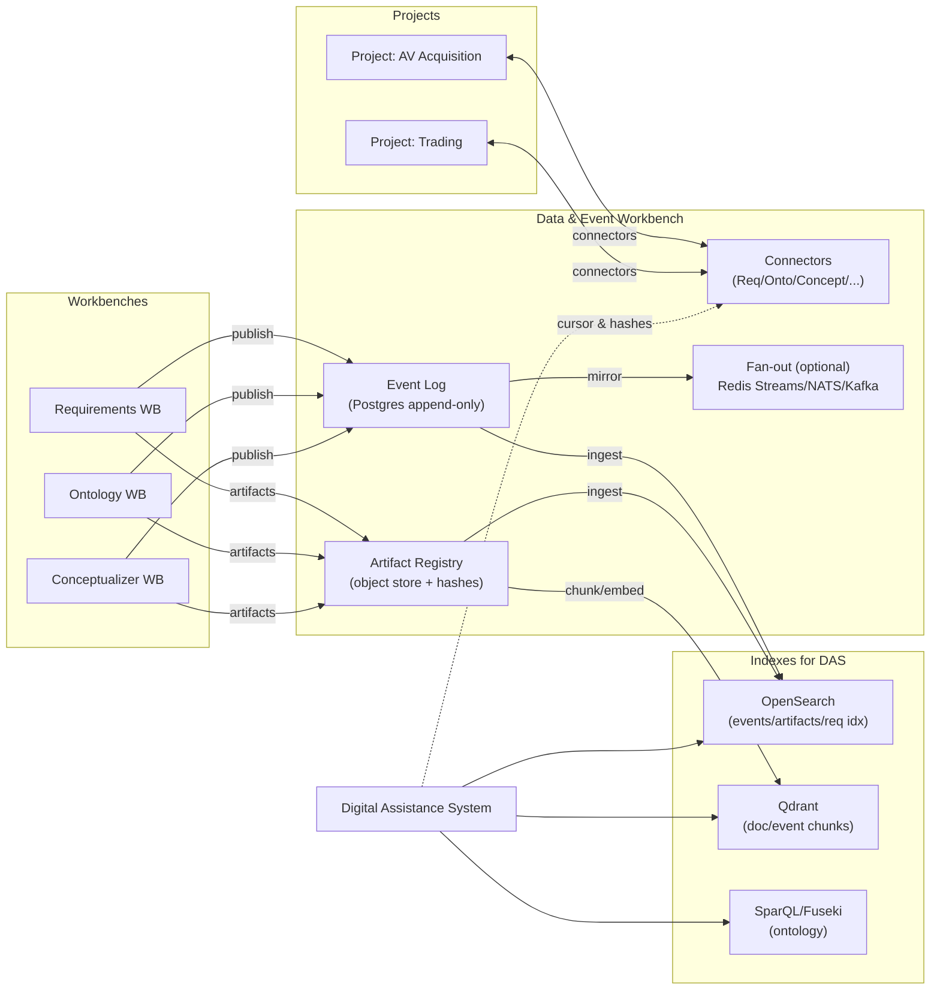

# ODRAS Data & Event Architecture for Decoupled Workbenches, Projects, and DAS

**Concise White Paper (v0.1)**

## 1. Objective

Define a pragmatic, scalable architecture that:

* Decouples **workbenches** (Requirements, Ontology, Conceptualizer, etc.) and **projects** via **publish → subscribe** boundaries.
* Centralizes **contracts**, **events**, and **artifacts** in a **Data & Event Workbench (DMW)**.
* Enables the **Digital Assistance System (DAS)** to retrieve small, high-signal context bundles using hybrid search (keyword, vector, and graph) without blowing token budgets.

## 2. Design Principles

1. **Single source of truth for change**: append-only **event log** (Postgres).
2. **Publish immutables**: cross-WB consumption uses **versioned, content-addressed artifacts**; no foreign table reads.
3. **Connector boundary**: projects and WBs interact through **stable, versioned connectors**, not DB joins.
4. **Replayability**: any consumer can rebuild state from **(events + artifacts)** deterministically.
5. **Hybrid retrieval for DAS**: BM25/OpenSearch + Qdrant (vectors) + SPARQL (ontology) → **≤ 8–12 KB** evidence packs.
6. **Governance**: changes to intents, schemas, and event types are **“add by RFC only”**; changes to baselined items use **ECRs**.

## 3. High-Level Architecture

## 4. Data & Event Workbench (DMW)

### 4.1 Event Log (authoritative)

* Table: `project_event(cursor BIGSERIAL PK, project_id, event_id UUID UNIQUE, event_type, schema_ver, payload JSONB, links JSONB, producer JSONB, created_at)`.
* **Exactly-once** for consumers via `(project_id, event_id)` de-dup + ordered `cursor`.
* **No dependence** on real-time systems for correctness.

### 4.2 Fan-out (optional, for UX/workers)

* Default: **Redis Streams** per project (`proj:{id}`) carrying `{cursor,event_type}`.
* Upgrade triggers → **NATS JetStream** (routing/ACL) or **Kafka/Redpanda** (throughput/retention).
* Outage path: consumers reconcile via **Postgres replay**.

### 4.3 Artifact Registry

* **Content-addressed** artifacts with `{hash, version, meta, lineage}`.
* Publishing emits `artifact.created|versioned` events with pointers to hashes.

### 4.4 Connectors (immutable contracts)

* **RequirementsConnector**: `list_published`, `get_set(as_of)`
* **OntologyConnector**: `get_structure(as_of)`, `list_individuals(since_cursor)`
* **ConceptConnector**: `list_configs`, `get_config(as_of)`
* **Artifact API**: `publish/get`
* **Rules**: no cross-WB writes; reads are **published views** only; `as_of`/`since_cursor` supported.

## 5. Pub/Sub Pattern

* **Producers** (WBs) write local state → append **one canonical event** → publish artifacts when needed.
* **Consumers** (projects, DAS indexer, UI) subscribe via Redis/NATS/Kafka **for speed**, but **truth = Postgres**.
* **Projects pull**, never directly read peers’ tables; imports are **copies with lineage**.

## 6. DAS Integration (search-first, token-aware)

### 6.1 Indexes

* **OpenSearch**: `events_v1`, `artifacts_v1`, `requirements_v1` with analyzers, facets, and filters.
* **Qdrant**: `doc_chunks_v1`, `event_snippets_v1` (500–800 token chunks, overlap 15–20%).
* **SPARQL**: structural queries over ontology/individuals.

### 6.2 Ingestion

* Event triggers (`req.published`, `onto.*`, `artifact.*`) → resolve artifact → render text → index to OS → chunk/embed to Qdrant → generate short **delta summaries** for recency queries.
* Idempotency keys: `(artifact_hash, chunk_idx)`.

### 6.3 Intent Detection (no hard-coding)

* **Schema-constrained JSON** classifier (small LLM). Intents (initial set):

  * `requirements_lookup`, `artifact_lookup`, `delta_change`, `ontology_structure`, `semantic_explain`, `project_admin`, `other`.
* Output includes `confidence`, optional filters (`project_id`, capability, ids), and `time_window`.
* **Routing**: confidence ≥ 0.7 → single route; 0.4–0.7 → dual-route and fuse; < 0.4 → one-line clarifier.

### 6.4 Context Packs

* Merge BM25 + vector hits (RRF), dedupe by hash, **cap total to ≤ 8–12 KB**.
* Always include citations: `{store, id, offset/hash, cursor}`.
* DAS responses are built from **packs**, never raw dumps.

## 7. Governance: RFCs vs ECRs

* **RFC (Request for Comments)**: pre-implementation design record for **intents**, **schemas**, **event types**, **connector contracts**, **data products**.
* **ECR (Engineering Change Request)**: controlled modification to **baselined** items (versions, migrations).
* Workflow: RFC (design/why) → implement behind flag → validate → ECR to change baseline.

## 8. Security & Ops

* **RBAC** roles: `publish`, `consume`, `build_product`.
* DMW runs server-side with service accounts; UIs and services cannot bypass connectors.
* Nightly **replay tests** (rebuild representative products and compare hashes).
* **Schema registry** with compatibility checks in CI; fail builds on breaking diffs.
* **Kill switches** on new intents/routes; feature flags for rollouts.

## 9. Example Flows

### 9.1 Conceptualizer consumes Requirements

1. Requirements WB publishes `ReqSet@v12` → `artifact.versioned` + `req.published`.
2. Conceptualizer asks DMW: `RequirementsConnector.get_set(project, set_id, as_of=cursor)`; composes configuration locally.
3. Conceptualizer publishes `Config@v3` (artifact + event). No tables crossed.

### 9.2 DAS answers “What changed since last review?”

1. Intent = `delta_change` with `since_cursor=C`.
2. OpenSearch query `events_v1` filtered by `project_id` and `cursor>C`; fetch delta summaries from Qdrant.
3. Build ≤ 10 KB pack with linked artifact hashes; return citations.

## 10. Benefits

* **Strong decoupling**: no foreign table reads.
* **Reproducibility**: event+artifact replay restores state exactly.
* **Scalable retrieval** for DAS: hybrid search prevents prompt overload.
* **Governed evolution**: RFC/ECR keeps contracts stable and auditable.

---

## 11. Gaps & Future Work

### A. Event & Schema Governance

* **Gap**: No formal **schema registry** implemented.

  * **Action**: Stand up a registry (JSON-Schema/Avro), enforce write-time validation; add CI compat tests.

### B. Snapshot/Compaction Strategy

* **Gap**: Long replays may grow costly.

  * **Action**: Periodic **compaction artifacts** (snapshots) for heavy domains; document retention policy.

### C. Connector Coverage

* **Gap**: Only core connectors defined.

  * **Action**: Add **Issue/Test/Risk** connectors (read-only) to support risk assessments and verification traces.

### D. Multi-Tenant Routing/ACLs

* **Gap**: Fine-grained subject routing not specified.

  * **Action**: If tenancy/routing needs grow, graduate fan-out to **NATS JetStream** (subjects, durable consumers) or **Kafka**.

### E. DAS Telemetry & Learning

* **Gap**: No **online intent calibration** or success labeling loop.

  * **Action**: Log `{intent, confidence, outcome}`; nightly train a lightweight classifier to shadow the LLM; auto-tune thresholds.

### F. Token-Budget Enforcement

* **Gap**: Hard limits defined but not enforced in code.

  * **Action**: Enforce pack size in `/pack/build`; reject oversize with an automatic summarization pass.

### G. Observability

* **Gap**: End-to-end **trace IDs** from event → index → pack → answer not specified.

  * **Action**: Propagate a **correlation ID** across all steps; add dashboards for cursor lag, index freshness, pack sizes.

### H. Backfill & Dual-Write Migration

* **Gap**: No standard runbook for migrating fan-out tech.

  * **Action**: Document **dual-write/dual-read** procedure, parity checks by cursor/hash, and cut-over criteria.

### I. Performance Thresholds

* **Gap**: No quantified SLOs.

  * **Action**: Define SLOs (e.g., P50 pack build < 300 ms, index freshness < 5 s, replay ≤ 30 min per 1M events), and alerting.

---

## 12. Minimal Rollout Plan

1. **Phase A (Now)**: DMW integrated (events + artifacts + connectors). Postgres authoritative; Redis Streams optional. CI rules to block cross-WB imports.
2. **Phase B**: Indexer off `project_event` → OpenSearch & Qdrant; DAS router + intent classifier + `/pack/build`.
3. **Phase C**: Schema registry + compatibility CI; nightly replay tests; compaction artifacts for heavy domains.
4. **Phase D**: Add risk/issue/test connectors; telemetry + shadow classifier; refine DAS prompts and thresholds.
5. **Phase E (If needed)**: Split Event Workbench (NATS/Kafka), keep APIs stable; dual-write migration and parity validation.

---

## 13. Conclusion

This architecture keeps ODRAS modular and auditable: **workbenches publish**, **projects and DAS consume via connectors**, and **events/artifacts** provide reproducibility. The hybrid retrieval substrate gives DAS precision and recall without exceeding prompt limits. Governance via **RFC for design** and **ECR for baselined changes** ensures controlled evolution. The listed gaps form the next engineering backlog.
