# ODRAS Architecture Diagrams for Slides

## 1. Overall Architecture

## 2. Project Cell Architecture

## 3. Knowledge Processing Pipeline

```mermaid
%%{init: {'theme':'base', 'themeVariables': { 'fontSize':'14px'}}}%%
flowchart LR
    DOC2["📄 Document"] --> EXT["Extract<br/>Text"]
    EXT --> CHUNK["Chunk<br/>Content"]
    CHUNK --> EMB["Generate<br/>Embeddings"]
    EMB --> QDRANT["Store in<br/>Qdrant"]
    
    QDRANT --> RAG["RAG<br/>Search"]
    QUERY["User<br/>Query"] --> RAG
    RAG --> AI["LLM<br/>Response"]
    
    style DOC2 fill:#e8eaf6,stroke:#3f51b5,stroke-width:2px
    style QDRANT fill:#e0f2f1,stroke:#00897b,stroke-width:2px
    style AI fill:#fce4ec,stroke:#c2185b,stroke-width:2px
```

## 4. Ontology Management

## 5. Conceptualization Process

