# ODRAS Security Architecture - Single Slide

```mermaid
%%{init: {'theme':'base', 'themeVariables': { 'fontSize':'16px'}}}%%
flowchart LR
    subgraph PROD[" "]
    direction TB
        PROD_LABEL["<b>PRODUCTION</b><br/>(Hardened)"]
        P1[("Project A<br/>CUI")]
        P2[("Project B<br/>Secret")]
        P3[("Project C<br/>CUI")]
        PROD_LABEL ~~~ P1
        P1 ~~~ P2
        P2 ~~~ P3
    end
    
    DIODE{{"Data Diode<br/>🔒 One-Way<br/>👤 Approved<br/>🧹 Sanitized"}}
    
    subgraph SAND[" "]
    direction TB
        SAND_LABEL["<b>SANDBOX</b><br/>(Gray)"]
        TEST["🧪 DAS Learning<br/>📊 Impact Testing<br/>🔬 Experiments"]
        SAND_LABEL ~~~ TEST
    end
    
    PROD ==>|"Sanitized<br/>Data Only"| DIODE
    DIODE ==>|"Test Data"| SAND
    SAND -.->|"Learned<br/>Patterns"| PROD
    
    style PROD fill:#e8f4f8,stroke:#0288d1,stroke-width:3px,color:#000
    style PROD_LABEL fill:#e8f4f8,stroke:none,color:#01579b
    style P1 fill:#fff3e0,stroke:#f57c00,stroke-width:2px,color:#000
    style P2 fill:#fce4ec,stroke:#c2185b,stroke-width:2px,color:#000
    style P3 fill:#fff3e0,stroke:#f57c00,stroke-width:2px,color:#000
    style DIODE fill:#ffebee,stroke:#d32f2f,stroke-width:3px,color:#000
    style SAND fill:#e8f5e9,stroke:#388e3c,stroke-width:3px,color:#000
    style SAND_LABEL fill:#e8f5e9,stroke:none,color:#1b5e20
    style TEST fill:#f1f8e9,stroke:#689f38,stroke-width:2px,color:#000
```

## Key Points

**Production (Hardened)**
- Container-per-project isolation
- No cross-project data access
- DAS supervised mode (approval required)
- Compliance: FedRAMP High, NIST 800-171, DoD IL4/IL5

**Data Diode**
- One-way flow only (Production → Sandbox)
- Human approval required
- Automatic PII removal and anonymization
- Complete audit trail (7-year retention)

**Sandbox (Gray)**
- Safe testing with sanitized data
- DAS learns patterns across projects
- Blast radius analysis before production
- No production risk

**Security Standards**
- NIST 800-53 (AC-4, SC-7, SC-28, SI-4)
- NIST 800-171 (3.1.1, 3.3.1, 3.13.11, 3.13.16)
- DFARS 7012 compliance
- FIPS 140-2 encryption
