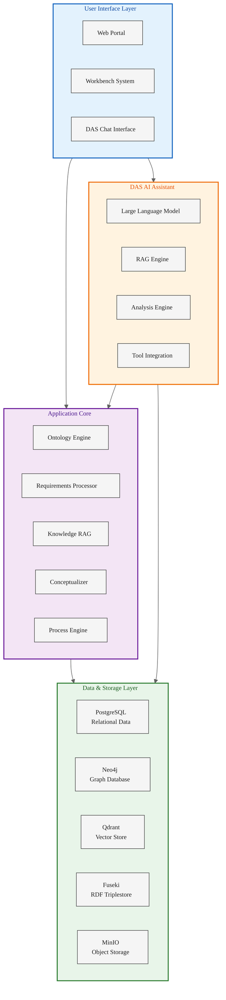
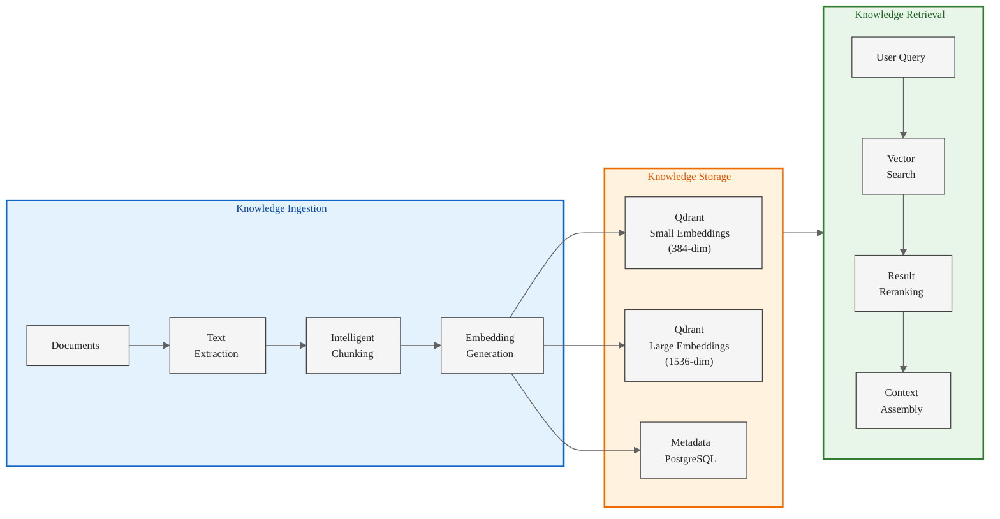
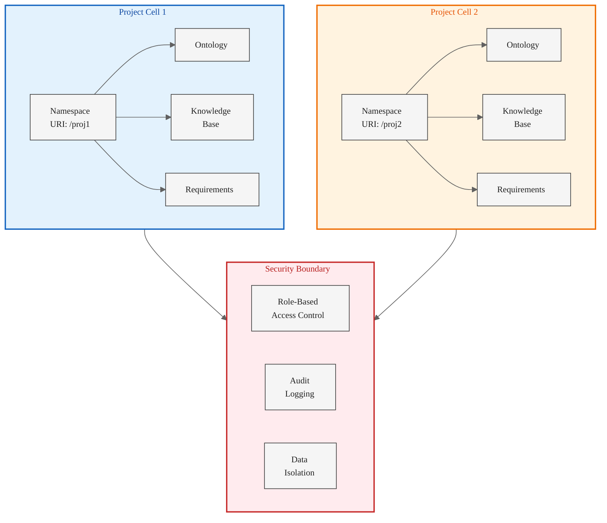
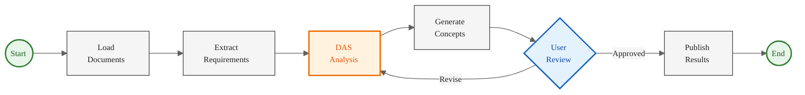

# ODRAS Tool Overview - Comprehensive Platform Presentation

## Slide 1: Introduction to ODRAS
**Ontology-Driven Requirements Analysis System**

### What is ODRAS?
- **Comprehensive Platform**: Integrated environment for requirements analysis, system conceptualization, and knowledge management
- **AI-Powered**: DAS (Design Analysis System) provides intelligent assistance throughout the analysis lifecycle
- **Ontology-Driven**: BSEO (Base Systems Engineering Ontology) foundation ensures consistent terminology and relationships
- **Project-Centric**: Isolated project cells maintain security boundaries and organization

### Core Value Proposition
- **Transform Requirements into Concepts**: Extract requirements from documents, analyze with AI, generate system architectures
- **Knowledge Management**: Centralized repository with RAG-powered retrieval and analysis
- **Process Automation**: BPMN workflows orchestrate complex analysis tasks
- **Collaborative Environment**: Multi-user platform with role-based access and audit trails

---

## Slide 2: ODRAS Architecture
**Modern Microservices Platform**



### Technology Stack
- **Frontend**: Vanilla JavaScript with modern ES6+ features
- **Backend**: FastAPI (Python) with asyncio for high performance
- **Databases**: PostgreSQL, Neo4j, Qdrant, Fuseki, Redis
- **Storage**: MinIO S3-compatible object storage
- **AI/ML**: OpenAI API, sentence-transformers, custom embeddings
- **Process Engine**: Camunda BPMN for workflow orchestration

---

## Slide 3: Current ODRAS Workbenches
**Comprehensive Capability Suite**

### Analysis & Design Workbenches
1. **Requirements Workbench**: Document ingestion, requirement extraction, ontology mapping, traceability
2. **Ontology Workbench**: Ontology import/export, class management, property definitions, reasoning
3. **Conceptualizer Workbench**: System architecture visualization, component generation, interface mapping
4. **Knowledge Workbench**: Document management, RAG processing, knowledge base queries

### Data & Project Management Workbenches
5. **Files Workbench**: Document upload, organization, metadata management
6. **Project Workbench**: Project settings, team management, resource allocation
7. **Graph Workbench**: Neo4j graph visualization and queries
8. **Analysis Lab**: Data analysis, visualization, statistical tools

### System & Administration Workbenches
9. **Process Workbench**: BPMN workflow design and management
10. **Thread Manager Workbench**: DAS conversation threads, context management
11. **Admin Workbench**: User management, system configuration, role assignments
12. **Event Manager Workbench**: System events, audit logs, activity tracking
13. **Settings Workbench**: User preferences, system settings
14. **Playground Workbench**: Testing and experimentation environment
15. **RAG Workbench**: RAG configuration and testing

---

## Slide 4: Planned ODRAS Workbenches
**Future Capability Expansion**

### Decision & Analysis Workbenches
1. **Trade Studies Workbench**: Multi-criteria decision analysis, alternatives comparison, sensitivity analysis
2. **Context Management Workbench**: Persona definitions, context assembly, prompt templates
3. **Artifact Management Workbench**: Document generation, version control, artifact linking

### Collaboration & Documentation Workbenches
4. **Agent Assistant & Documentation Workbench**: AI-assisted document writing, artifact embedding, export formats
5. **Collaboration Workbench**: Multi-user real-time editing, commenting, review workflows
6. **Reporting Workbench**: Automated report generation, custom templates, scheduled reports

### Advanced Analysis Workbenches
7. **Simulation Workbench**: Performance modeling, system simulation, scenario analysis
8. **Tool Integration Workbench**: External tool connections, API management, schema validation
9. **Task Execution Manager Workbench**: Task monitoring, efficacy analysis, performance optimization

### Process & Workflow Workbenches
10. **Process Task Orchestration Workbench**: Task routing, execution monitoring, error handling
11. **Decision Thread Analytics Workbench**: Thread similarity analysis, pattern recognition, recommendation generation
12. **Pipeline Management Workbench**: Multi-stage analysis pipelines, data flow visualization

---

## Slide 5: DAS - The Intelligent Core
**Design Analysis System**

```mermaid
%%{init: {'theme':'base', 'themeVariables': { 'fontSize':'13px', 'primaryColor':'#f5f5f5', 'primaryTextColor':'#212121', 'primaryBorderColor':'#424242', 'lineColor':'#616161', 'fontFamily':'Segoe UI, Arial, sans-serif'}}}%%
flowchart TD
    subgraph CURRENT["Current DAS Capabilities"]
        REQ_ANAL["Requirements<br/>Analysis"]
        CONCEPT["Concept<br/>Generation"]
        ONT_INT["Ontology<br/>Integration"]
        RAG["Knowledge<br/>Retrieval"]
        CHAT["Conversational<br/>Interface"]
    end
    
    subgraph NEAR["Near-term (6 months)"]
        ENH_REASON["Enhanced<br/>Reasoning"]
        SIM_INT["Simulation<br/>Integration"]
        COLLAB["Collaborative<br/>Analysis"]
        AUTO_REP["Automated<br/>Reporting"]
        TOOL_CALL["Advanced Tool<br/>Calling"]
    end
    
    subgraph FUTURE["Future (12+ months)"]
        TRADE_SUP["Trade Study<br/>Support"]
        MULTI_CRIT["Multi-criteria<br/>Analysis"]
        PRED_MOD["Predictive<br/>Modeling"]
        AUTO_DEC["Automated Decision<br/>Support"]
        LEARN["Learning &<br/>Adaptation"]
    end
    
    CURRENT --> NEAR
    NEAR --> FUTURE
    
    style CURRENT fill:#e8f5e9,stroke:#2e7d32,stroke-width:2px,color:#1b5e20
    style NEAR fill:#fff3e0,stroke:#ef6c00,stroke-width:2px,color:#e65100
    style FUTURE fill:#e3f2fd,stroke:#1565c0,stroke-width:2px,color:#0d47a1
```



### DAS Capabilities Today
- **Natural Language Interface**: Ask questions about requirements, ontologies, or system data
- **Requirement Analysis**: Interpret and validate requirements from documents
- **Concept Generation**: Create system components, interfaces, and functions from requirements
- **Knowledge Retrieval**: RAG-powered access to project knowledge base
- **Ontology Integration**: Leverage BSEO and domain ontologies for consistent analysis

### DAS Evolution Path
- **Enhanced Reasoning**: Multi-step analysis with chain-of-thought reasoning
- **Tool Integration**: Call external analysis tools and simulations
- **Collaborative Sessions**: Multi-user DAS interactions with shared context
- **Predictive Analytics**: Forecast system performance and identify risks
- **Learning & Adaptation**: Improve analysis quality based on user feedback

---

## Slide 6: Key Concepts - Ontology-Driven Analysis
**Foundation of ODRAS Approach**

### Base Systems Engineering Ontology (BSEO)
- **Foundation Classes**: System, Component, Interface, Function, Requirement, Constraint
- **Relationships**: hasComponent, performsFunction, satisfiesRequirement, constrainedBy
- **Layered Architecture**: Foundation → Domain → Project-specific ontologies
- **Standards Integration**: SysML, DoDAF, UAF alignment

### Ontology-Driven Benefits
1. **Consistent Terminology**: Shared vocabulary across projects and teams
2. **Automated Reasoning**: Infer relationships and identify inconsistencies
3. **Traceability**: Track requirements through design and implementation
4. **Reusability**: Import domain ontologies and extend for project needs
5. **Validation**: Check completeness and correctness of system designs

### Domain Ontology Expansion
- **Aerospace**: Aircraft systems, avionics, propulsion, structures
- **Defense**: Weapons systems, C4ISR, mission systems
- **Automotive**: Powertrain, ADAS, vehicle architecture
- **Energy**: Power systems, distribution, renewable integration

---

## Slide 7: Key Concepts - RAG-Powered Knowledge
**Retrieval-Augmented Generation Architecture**



### Multi-Collection Strategy
- **knowledge_chunks**: Small embeddings (384-dim) for fast retrieval
- **knowledge_large**: OpenAI embeddings (1536-dim) for semantic depth
- **odras_requirements**: Requirements-specific collection
- **das_instructions**: DAS behavior and guidelines
- **project_threads**: Conversation context and history

### Advanced RAG Features
- **Chunking Strategies**: Semantic chunking, overlap control, metadata preservation
- **Hybrid Search**: Vector similarity + keyword matching + metadata filtering
- **Context Windows**: Dynamic context assembly based on query and token limits
- **Reranking**: Improve relevance with cross-encoder models

---

## Slide 8: Key Concepts - Project Cells
**Isolation and Organization**

### Project Cell Architecture


### Project Cell Benefits
- **Security**: Complete isolation between projects with separate namespaces
- **Organization**: Group related requirements, ontologies, and knowledge
- **Scalability**: Independent scaling per project based on demand
- **Collaboration**: Team-based access control and permissions
- **Versioning**: Track changes and maintain project history

---

## Slide 9: Key Concepts - BPMN Process Automation
**Workflow Orchestration for Complex Analysis**

### Why BPMN for Analysis?
- **Visual Design**: Graphical workflow creation instead of hard-coded pipelines
- **Flexibility**: Easy modification without code changes
- **Orchestration**: Coordinate multiple services and tools
- **Human-in-Loop**: User tasks for review and decision points
- **Audit Trail**: Complete execution history and compliance tracking

### ODRAS BPMN Patterns


### Common Analysis Workflows
- **Requirements Extraction Pipeline**: Document → Text → Requirements → Validation
- **Conceptualization Workflow**: Requirements → DAS Analysis → Concepts → Review → Export
- **Knowledge Processing**: Upload → Chunk → Embed → Index → Verify
- **Trade Study Process**: Define Alternatives → Analyze → Compare → Recommend → Document

---

## Slide 10: Integration Capabilities
**Connecting ODRAS to Your Ecosystem**

### Import Capabilities
- **Documents**: PDF, Word, Excel, Markdown, Text
- **Ontologies**: OWL, RDF/XML, Turtle, JSON-LD
- **Requirements**: ReqIF, Excel templates, CSV
- **Models**: Cameo/MagicDraw exports, SysML XML
- **Data**: JSON, CSV, database connections

### Export Capabilities
- **System Models**: Cameo/MagicDraw import format
- **Documents**: PDF, Word, Excel, Markdown
- **Ontologies**: OWL, RDF/XML, Turtle, JSON-LD
- **Requirements**: ReqIF, Excel, CSV
- **Reports**: Custom templates, automated generation
- **Data**: JSON, CSV, REST API access

### API Integration
- **RESTful APIs**: Full system access for external tools
- **Webhooks**: Event-driven notifications
- **GraphQL**: Flexible data queries
- **BPMN Service Tasks**: Call external services from workflows
- **Tool Integration**: Schema-based tool execution

---

## Slide 11: Use Cases & Applications
**ODRAS Across Domains**

### Aerospace & Defense
- **Requirements Analysis**: Extract and analyze system requirements from specifications
- **System Conceptualization**: Generate preliminary architectures from requirements
- **Trade Studies**: Compare design alternatives with multi-criteria analysis
- **Compliance Tracking**: Ensure requirements meet regulatory standards

### Automotive & Transportation
- **ADAS Development**: Analyze requirements for autonomous driving systems
- **Powertrain Design**: Conceptualize hybrid and electric propulsion systems
- **Safety Analysis**: Track safety requirements through design and validation
- **Standards Compliance**: Ensure ISO 26262 and other standards adherence

### Energy & Infrastructure
- **Smart Grid Design**: Analyze requirements for grid modernization
- **Renewable Integration**: Conceptualize energy storage and distribution systems
- **Regulatory Compliance**: Track requirements for environmental and safety regulations
- **Asset Management**: Knowledge management for infrastructure maintenance

### Software & Systems Engineering
- **Requirements Engineering**: Capture, analyze, and trace software requirements
- **Architecture Design**: Generate system architectures from functional requirements
- **API Design**: Conceptualize interface definitions and data flows
- **Technical Documentation**: Generate and maintain system documentation

---

## Slide 12: Deployment Options
**Flexible Installation Models**

### On-Premises Deployment
- **Complete Control**: Full data sovereignty and security
- **Custom Configuration**: Tailored to organizational needs
- **Air-Gapped**: Isolated networks for classified work
- **Performance**: Dedicated resources for optimal performance

### Cloud Deployment
- **Scalability**: Auto-scaling based on demand
- **High Availability**: Multi-region redundancy
- **Managed Services**: Reduced operational overhead
- **Cost Efficiency**: Pay-as-you-go pricing

### Hybrid Deployment
- **Sensitive Data On-Prem**: Critical data stays internal
- **Compute in Cloud**: Leverage cloud AI/ML capabilities
- **Flexible Workload**: Route tasks based on security and performance needs

### Quick Setup Script
```bash
# Clone repository
git clone https://github.com/your-org/ODRAS.git
cd ODRAS

# Run installation
./install.sh

# Initialize databases
./odras.sh init-db

# Start services
./odras.sh start

# Access at http://localhost:8000
```

---

## Slide 13: Security & Compliance
**Enterprise-Grade Protection**

### Authentication & Authorization
- **Multi-Factor Authentication**: Support for TOTP, hardware tokens, biometric
- **SSO Integration**: SAML, OAuth2, LDAP/Active Directory
- **Role-Based Access Control**: Fine-grained permissions per workbench
- **Project-Level Isolation**: Complete separation between projects
- **CAC/PIV Support**: Common Access Card integration for DoD environments

### Data Protection
- **Encryption at Rest**: AES-256 for all stored data
- **Encryption in Transit**: TLS 1.3 for all communications
- **Key Management**: FIPS 140-2 compliant key storage and rotation
- **Data Residency**: Control where data is stored geographically
- **Secure Enclaves**: Hardware security module (HSM) integration

### Federal & Industry Compliance Standards
- **NIST SP 800-53**: Security and privacy controls for federal information systems
- **NIST SP 800-171**: Protecting Controlled Unclassified Information (CUI)
- **FedRAMP**: Preparing for Moderate baseline authorization
- **CMMC Level 2**: Cybersecurity Maturity Model Certification for defense contractors
- **ISO 27001**: Information security management system certification
- **SOC 2 Type II**: Service organization controls for security and availability
- **ITAR Compliance**: International Traffic in Arms Regulations readiness
- **GDPR**: General Data Protection Regulation for EU data

### Audit & Compliance Features
- **Complete Audit Trail**: Every action logged with user, timestamp, details
- **Event Manager**: Real-time monitoring and alerts
- **Compliance Reports**: Automated generation for auditors
- **Data Retention**: Configurable policies meeting regulatory requirements
- **Chain of Custody**: Full traceability for all data and decisions

### Network Security
- **Firewall Integration**: Support for enterprise firewalls and DMZ deployment
- **VPN Access**: Secure remote connectivity with multi-factor authentication
- **API Security**: Rate limiting, authentication, input validation, DDoS protection
- **Vulnerability Scanning**: Regular security assessments and penetration testing
- **Intrusion Detection**: Integration with SIEM systems
- **Air-Gapped Deployment**: Support for classified and isolated networks

---

## Slide 14: Performance & Scalability
**Built for Enterprise Scale**

### Current Performance Metrics
- **Document Processing**: 100+ pages/minute
- **Requirement Extraction**: 500+ requirements/minute
- **Vector Search**: <100ms for 10M+ vectors
- **Concurrent Users**: 50+ users per instance
- **Knowledge Base Size**: Millions of chunks per project

### Scalability Approach
- **Horizontal Scaling**: Add instances for increased capacity
- **Database Partitioning**: Project-based data distribution
- **Caching Strategy**: Redis for frequently accessed data
- **Queue Management**: Celery for background task processing
- **Load Balancing**: Distribute requests across instances

### Optimization Features
- **Lazy Loading**: Load data only when needed
- **Incremental Updates**: Process only changes, not full datasets
- **Batch Processing**: Group operations for efficiency
- **Smart Caching**: Intelligent cache invalidation
- **Connection Pooling**: Efficient database connection management

---

## Slide 15: Development Roadmap
**ODRAS Evolution**

### Q1 2026 - Enhanced Analysis
- **Trade Studies Workbench**: Multi-criteria decision analysis
- **Advanced DAS Reasoning**: Chain-of-thought and multi-step analysis
- **Simulation Integration**: Connect to external modeling tools
- **Enhanced Reporting**: Automated report generation with templates

### Q2 2026 - Collaboration & Integration
- **Real-time Collaboration**: Multi-user editing and commenting
- **Context Management Workbench**: Persona and prompt management
- **Tool Integration Framework**: Schema-based external tool calls
- **Enhanced Export**: Direct Cameo/MagicDraw integration

### Q3 2026 - Intelligence & Automation
- **Task Execution Manager**: Efficacy tracking and optimization
- **Process Task Orchestration**: Enhanced workflow automation
- **Predictive Analytics**: Forecast project outcomes and risks
- **Learning & Adaptation**: Improve DAS based on usage patterns

### Q4 2026 - Enterprise Features
- **Advanced Security**: Hardware security module integration
- **Multi-Tenancy**: Support for multiple organizations
- **Advanced Analytics**: Business intelligence dashboards
- **Marketplace**: Plugin and extension ecosystem

---

## Slide 16: Measuring ODRAS Effectiveness
**What We Will Measure in WIRR and Future Projects**

### Phase 1: Foundation Building (Metrics)
**Capture Requirements, Ontologies, and Concepts**
- **Requirements Extraction Rate**: Number of requirements extracted per document per hour
- **Ontology Mapping Coverage**: Percentage of requirements mapped to ontology concepts
- **Conceptualization Speed**: Time from requirements to initial system concept generation
- **Individual Instance Count**: Number of conceptualized individuals (components, interfaces, functions)
- **Traceability Coverage**: Percentage of concepts traceable to source requirements

### Phase 2: Analysis & Knowledge Integration (Metrics)
**Tabularization and Knowledge Capture**
- **Tabularizer Effectiveness**: Complex table generation speed and accuracy
- **Knowledge Capture Volume**: Local, tribal, and vendor knowledge items captured per project
- **Concept-Knowledge Linkage**: Percentage of concepts with supporting knowledge artifacts
- **Vendor Capability Mapping**: Number of vendor capabilities mapped to requirements/concepts
- **Knowledge Query Response Time**: Speed of retrieving relevant knowledge for analysis

### Phase 3: Vendor Evaluation & Gap Analysis (Metrics)
**Compare Capabilities, Assess TRL, Identify Gaps**
- **Vendor Coverage Analysis**: Percentage of requirements/concepts addressed by each vendor
- **TRL Assessment Accuracy**: Technology Readiness Level evaluation completeness
- **Gap Identification Rate**: Number of capability gaps identified per concept
- **Tech Program Needs**: Quantity and priority of identified technology development needs
- **Comparison Table Complexity**: Number of criteria in multi-vendor comparison matrices

### Process Efficiency Metrics
**Overall System Effectiveness**
- **End-to-End Cycle Time**: Days from requirements upload to gap analysis completion
- **Rework Reduction**: Percentage reduction in analysis iterations
- **Team Productivity**: Analysis throughput per engineer vs. manual methods
- **Decision Quality**: Number of issues caught early vs. late in process
- **Audit Trail Completeness**: Percentage of decisions with full supporting documentation

### Success Criteria for WIRR
- **Complete requirements extraction** from FLRAA and Marine Appendix
- **Generate comprehensive system concepts** with ontology-mapped individuals
- **Build detailed comparison tables** across 4 airframers (Bell, Boeing, LMCO, Leonardo)
- **Assess vendor TRL** for all critical system concepts
- **Identify capability gaps** and establish technology program roadmap
- **Capture tribal knowledge** from pre-Milestone A discussions
- **Deliver traceable analysis** for trade study foundation

---

## Slide 17: Getting Started with ODRAS
**Your Journey Begins**

### Evaluation Phase (Week 1-2)
1. **Setup Demo Environment**: Deploy ODRAS on test infrastructure
2. **Import Sample Project**: Load example requirements and ontologies
3. **Explore Workbenches**: Familiarize team with core capabilities
4. **Run Analysis Workflow**: Execute end-to-end requirement to concept flow

### Pilot Project (Month 1-2)
1. **Select Pilot Project**: Choose representative project for trial
2. **Data Migration**: Import existing requirements and documents
3. **Ontology Configuration**: Customize or import domain ontologies
4. **Team Training**: Hands-on training for core team members
5. **Pilot Execution**: Run project through ODRAS workflows

### Production Rollout (Month 3-6)
1. **Infrastructure Setup**: Deploy production environment
2. **Security Configuration**: Integrate with enterprise security
3. **Project Migration**: Move projects from pilot to production
4. **Team Onboarding**: Train broader organization
5. **Process Integration**: Incorporate ODRAS into standard workflows

### Ongoing Support
- **Technical Support**: Dedicated support team for issues
- **Regular Updates**: Quarterly feature releases
- **Training Resources**: Videos, documentation, workshops
- **Community Forum**: User community for best practices

---

## Slide 18: Summary & Call to Action
**Transform Your Requirements Analysis**

### ODRAS Key Advantages
✓ **AI-Powered Analysis**: DAS provides intelligent assistance throughout lifecycle
✓ **Ontology-Driven**: Consistent terminology and automated reasoning
✓ **Comprehensive Platform**: 15+ workbenches for complete analysis workflow
✓ **Knowledge Management**: RAG-powered retrieval and searchable repository
✓ **Process Automation**: BPMN workflows for repeatable analysis
✓ **Enterprise-Ready**: Security, scalability, and compliance built-in

### Next Steps
1. **Schedule Demo**: See ODRAS in action with your data
2. **Technical Workshop**: Deep dive into architecture and capabilities
3. **Proof of Concept**: 30-day evaluation with pilot project
4. **Custom Proposal**: Tailored deployment and pricing

### Contact Information
- **Website**: www.odras.io
- **Email**: info@odras.io
- **Phone**: [Contact Number]
- **Documentation**: docs.odras.io
- **GitHub**: github.com/your-org/ODRAS

**Transform requirements into reality with ODRAS**
