# Ontology-Driven Requirements Analysis Workflow

## Overview
**A Comprehensive Process for System Conceptualization and Technology Development**

This document describes the end-to-end workflow that ODRAS uses to transform requirements documents into actionable technology programs. The process is fundamentally driven by ontological models, ensuring consistency, traceability, and semantic richness throughout the analysis lifecycle.

---

## Table of Contents
1. [Ontology Development](#1-ontology-development)
2. [Requirements Ingestion](#2-requirements-ingestion)
3. [Conceptualizing Ontological Individuals](#3-conceptualizing-ontological-individuals)
4. [Tabularization](#4-tabularization)
5. [Knowledge & Capability Capture](#5-knowledge--capability-capture)
6. [TRL Evaluation](#6-trl-evaluation)
7. [Gap Analysis](#7-gap-analysis)
8. [Technology Program Development](#8-technology-program-development)
9. [Complete Workflow Diagram](#9-complete-workflow-diagram)

---

## 1. Ontology Development

### Foundation: Base Systems Engineering Ontology (BSEO)

The BSEO provides the foundational vocabulary for systems engineering analysis. It establishes the core classes and relationships that enable semantic reasoning across all phases of the workflow.

**Core BSEO Classes:**
- **System**: Top-level entity representing a complete system
- **Component**: Physical or logical parts that compose systems
- **Function**: Capabilities or behaviors performed by systems/components
- **Interface**: Connections and interactions between components
- **Requirement**: Specifications that systems must satisfy
- **Constraint**: Limitations on system design or operation
- **Process**: Sequential activities or workflows
- **Stakeholder**: Entities with interests in the system

**Key Relationships:**
- `hasComponent`: System to Component aggregation
- `performsFunction`: Component to Function realization
- `satisfiesRequirement`: Component/Function to Requirement traceability
- `connectsTo`: Interface relationships between components
- `constrainedBy`: Limitations applied to components or functions

### Domain Ontology Expansion

BSEO is extended with domain-specific ontologies to capture specialized knowledge:

**Aerospace Domain Example:**
- Aircraft systems (propulsion, avionics, structures)
- Flight control systems
- Mission systems
- Support equipment

**Weapons Integration Domain Example:**
- Weapons systems and subsystems
- Launch mechanisms
- Targeting systems
- Safety interlocks

### Ontology Hierarchy

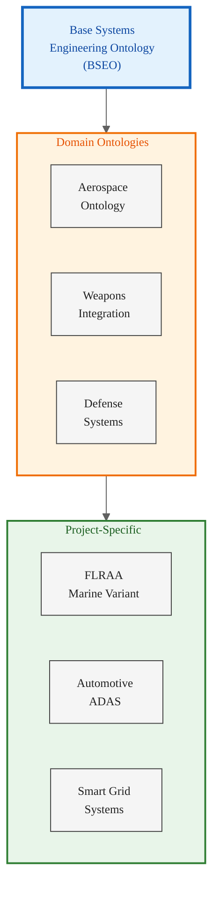

### Ontology Development Process

1. **Foundation Selection**: Start with BSEO v1 or appropriate base ontology
2. **Domain Analysis**: Identify domain-specific concepts needed
3. **Class Definition**: Define new classes that extend BSEO base classes
4. **Property Definition**: Establish relationships and data properties
5. **Constraint Specification**: Define cardinality, domain, and range constraints
6. **Validation**: Check consistency using reasoners (HermiT, Pellet)
7. **Documentation**: Annotate with definitions, examples, and rationale
8. **Version Control**: Track ontology versions in Fuseki RDF store

### Visual Reference: BSEO Connection to Mission

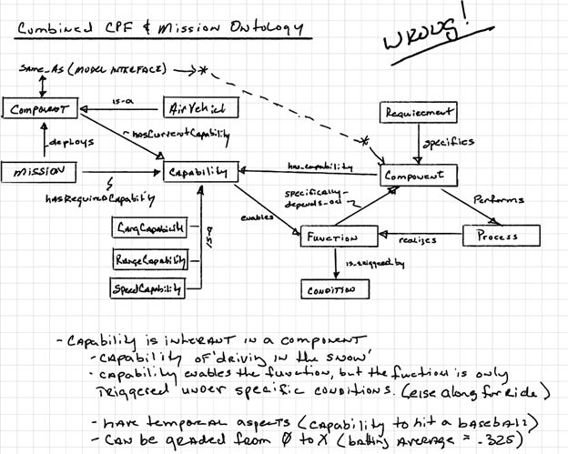

*This diagram shows how BSEO connects foundational concepts to mission-level objectives, providing semantic grounding for requirements analysis.*

---

## 2. Requirements Ingestion

### Document Upload and Processing

Requirements documents (PDF, Word, Excel) are uploaded into ODRAS and processed through an automated pipeline:

**Processing Steps:**
1. **Text Extraction**: Extract raw text from documents
2. **Structure Detection**: Identify sections, paragraphs, tables
3. **Requirement Identification**: Use pattern matching and NLP to identify requirement statements
4. **Metadata Capture**: Extract requirement IDs, priorities, verification methods
5. **Chunking**: Break documents into semantically meaningful chunks
6. **Embedding Generation**: Create vector embeddings for semantic search

### Requirement Parsing

ODRAS uses multiple strategies to identify and extract requirements:

- **Pattern-based**: "shall", "must", "will" keyword detection
- **ML-based**: Trained models to identify requirement-like statements
- **Table extraction**: Parse requirements from structured tables
- **Cross-reference resolution**: Link related requirements and references

### Ontology Mapping

Each identified requirement is mapped to BSEO concepts:

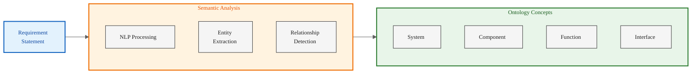

### Example: FLRAA Marine Requirement

**Original Requirement:**
> "The aircraft shall be capable of carrying a weapons payload of 2,000 lbs externally mounted."

**Ontology Mapping:**
- **System**: Aircraft
- **Component**: External weapons mount
- **Function**: Carry weapons payload
- **Constraint**: Maximum weight = 2,000 lbs
- **Requirement Type**: Performance requirement

---

## 3. Conceptualizing Ontological Individuals

### DAS-Powered Concept Generation

Once requirements are mapped to ontology classes, DAS (Design Analysis System) generates specific **individuals** (instances) that satisfy those requirements.

**Conceptualization Process:**

1. **Requirement Analysis**: DAS analyzes requirement statement
2. **Ontology Query**: Retrieve relevant ontology classes and properties
3. **Concept Generation**: Create individuals that instantiate ontology classes
4. **Relationship Establishment**: Define connections between individuals
5. **Validation**: Check consistency with ontology constraints

### Types of Individuals Generated

**1. System Components**
- Airframe structures
- Propulsion systems
- Avionics packages
- Mission systems

**2. Functions**
- Navigation capabilities
- Weapons delivery
- Communication functions
- Sensor operations

**3. Interfaces**
- Electrical interfaces
- Mechanical interfaces
- Data interfaces
- Software APIs

**4. Processes**
- Operational procedures
- Maintenance workflows
- Safety protocols

### Visual Reference: BSEO v1 Ontology Structure

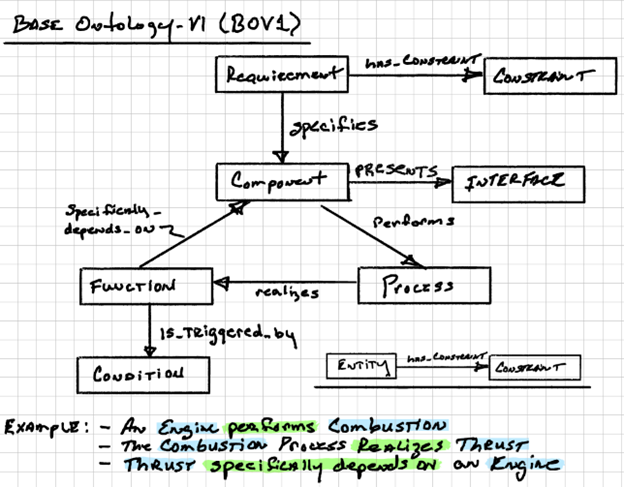

*The BSEO v1 ontology showing the class hierarchy and fundamental relationships used in conceptualization.*

### Example Conceptualization Output

**Requirement:** "Aircraft shall have Marine-specific avionics for shipboard operations"

**Generated Individuals:**
- `MarineAvionicsPackage_001` (instance of Component)
  - `hasFunction`: `ShipboardCommunication`
  - `hasFunction`: `CarrierLandingAssist`
  - `hasInterface`: `NavalDataBus_MIL-STD-1553`
  - `satisfiesRequirement`: `REQ_MARINE_AVIONICS_001`

### Expansion Ontologies

The BSEO can be expanded with specialized ontologies for deeper analysis:

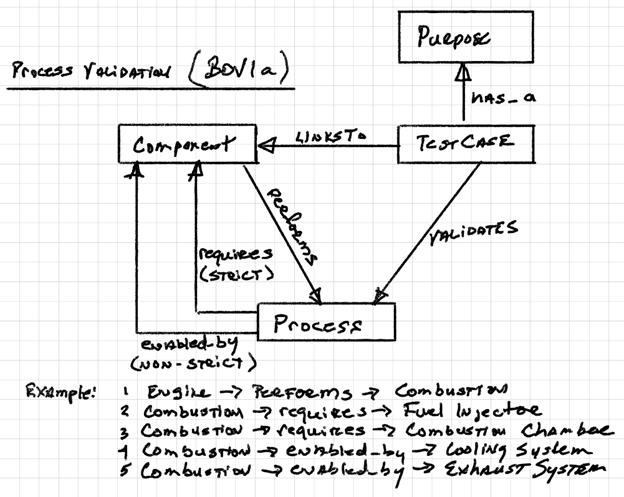

*BSEO Expansion showing additional concept domains for specialized analysis.*

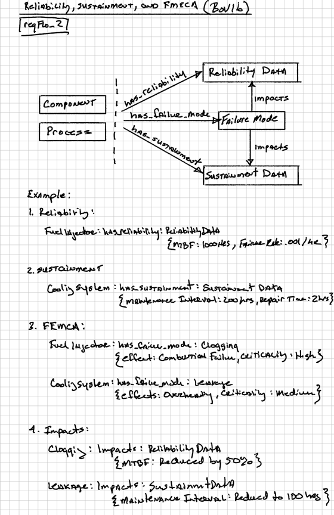

*Further ontology expansion demonstrating multi-domain integration capabilities.*

---

## 4. Tabularization

### The Tabularizer Workbench

The Tabularizer is a critical new workbench that transforms ontological individuals into structured, analyzable tables. It bridges the gap between semantic models and traditional engineering analysis.

**Key Capabilities:**
- **Multi-dimensional Tables**: Create complex comparison matrices
- **Dynamic Columns**: Add/remove analysis dimensions on demand
- **Hierarchical Views**: Drill down from systems to components
- **Cross-referencing**: Link related concepts across tables
- **Export**: Generate Excel, CSV, or database exports

### Table Types

**1. Component Breakdown Tables**
- List all conceptualized components
- Columns: Component ID, Name, Type, Parent System, Functions

**2. Requirements Traceability Matrix**
- Map requirements to components and functions
- Columns: Req ID, Description, Component, Function, Verification Method

**3. Interface Control Document (ICD)**
- Document all interfaces between components
- Columns: Interface ID, Source Component, Target Component, Interface Type, Protocol

**4. Vendor Capability Matrix**
- Compare vendor offerings against requirements
- Columns: Requirement, Vendor A, Vendor B, Vendor C, Vendor D

### Visual Reference: Capabilities Matrix

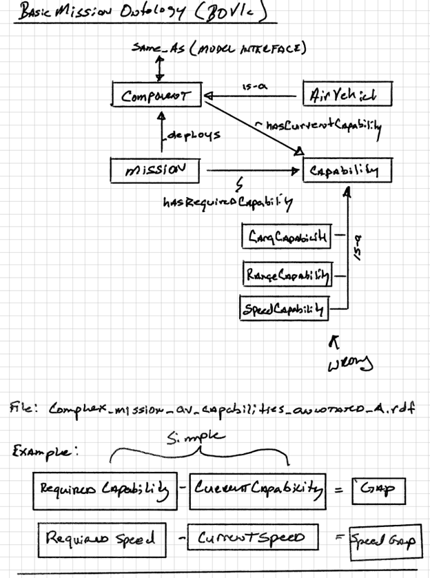

*Example capabilities table showing how vendor capabilities map to system requirements.*

### Tabularization Process

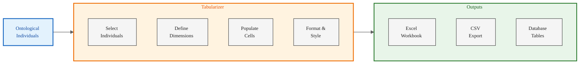

### Example: FLRAA Marine Variant Comparison Table

| Requirement | Bell | Boeing | LMCO | Leonardo | Notes |
|------------|------|--------|------|----------|-------|
| Max Payload 2000 lbs | ✓ 2100 lbs | ✓ 2200 lbs | ✓ 2000 lbs | ✗ 1800 lbs | Leonardo under spec |
| Shipboard Ops | ✓ Full | ✓ Full | ✓ Full | ✓ Full | All compliant |
| Corrosion Resistance | ✓ Excellent | ✓ Good | ✓ Excellent | ✓ Good | Marine environment |
| Avionics Package | ✓ MIL-STD-1553 | ✓ MIL-STD-1553 | ✓ MIL-STD-1553 | ✓ Custom | Leonardo proprietary |

---

## 5. Knowledge & Capability Capture

### Three Knowledge Sources

**1. Local Knowledge**
- Internal engineering documentation
- Previous program experiences
- Institutional expertise
- Lessons learned databases

**2. Tribal Knowledge**
- Subject matter expert insights
- Undocumented best practices
- Engineering judgment
- Historical context

**3. Vendor Knowledge**
- Vendor capability statements
- Technical datasheets
- Previous performance data
- Qualification test results

### Knowledge Capture Process

**Object-Centric Approach:**
Knowledge is captured and linked directly to ontological individuals (objects).

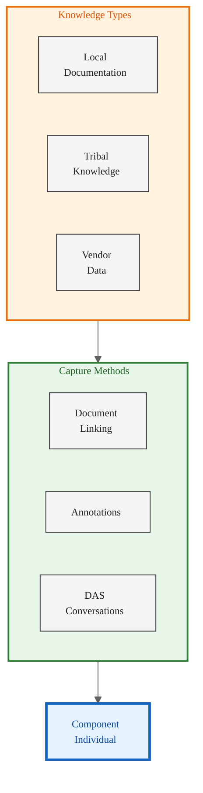

### Knowledge Integration

**For Each Component/Function/Interface:**
- **Documents**: Link relevant engineering documents
- **Notes**: Add engineering notes and observations
- **Vendor Data**: Attach vendor specifications and test data
- **Discussion Threads**: Capture DAS conversation threads
- **Assumptions**: Document key assumptions and constraints

### Visual Reference: Parameters and Attributes

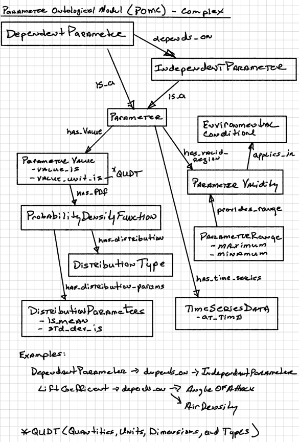

*Parameter tracking interface showing how technical specifications are captured and linked to ontological objects.*

### RAG-Powered Knowledge Retrieval

All captured knowledge is embedded and stored in Qdrant vector collections, enabling:
- **Semantic Search**: Find relevant knowledge by meaning
- **Context Assembly**: Provide DAS with relevant context for analysis
- **Cross-Project Learning**: Discover similar solutions from other projects
- **Gap Identification**: Identify missing knowledge or data

---

## 6. TRL Evaluation

### Technology Readiness Level Assessment

For each conceptualized component or function, ODRAS facilitates Technology Readiness Level (TRL) evaluation.

**TRL Scale (1-9):**
1. Basic principles observed
2. Technology concept formulated
3. Experimental proof of concept
4. Technology validated in lab
5. Technology validated in relevant environment
6. Technology demonstrated in relevant environment
7. System prototype demonstration in operational environment
8. System complete and qualified
9. Actual system proven in operational environment

### TRL Evaluation Process

**For Each Vendor/Component:**

1. **Evidence Collection**: Gather test data, certifications, operational history
2. **Assessment Criteria**: Define what constitutes each TRL level for this component
3. **Scoring**: Assign TRL based on available evidence
4. **Documentation**: Record rationale and supporting evidence
5. **Risk Identification**: Flag low-TRL components as potential risks

### Visual Reference: Technology Program Structure

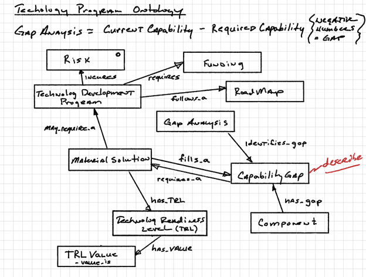

*Technology program roadmap showing how TRL evaluations feed into program planning.*

### TRL Matrix Example

| Component | Bell TRL | Boeing TRL | LMCO TRL | Leonardo TRL | Risk Level |
|-----------|----------|------------|----------|--------------|------------|
| Weapons Mount | 8 | 9 | 8 | 6 | Medium |
| Marine Avionics | 7 | 8 | 9 | 5 | High |
| Corrosion Protection | 9 | 8 | 9 | 7 | Low |
| Folding Rotor System | 6 | 7 | 6 | 4 | High |

### TRL-Based Decision Making

Low TRL scores trigger:
- **Technology Development Programs**: Investment in maturing technology
- **Risk Mitigation Plans**: Backup approaches or alternative vendors
- **Testing Requirements**: Additional qualification testing needed
- **Schedule Impacts**: Account for maturation time in program schedule

---

## 7. Gap Analysis

### Identifying Capability Gaps

Gap analysis compares requirements against available vendor capabilities and technology maturity.

**Gap Types:**

**1. Performance Gaps**
- Vendor capability doesn't meet requirement threshold
- Example: Payload capacity 1800 lbs vs. required 2000 lbs

**2. Technology Gaps**
- Required technology not sufficiently mature
- Example: Advanced composite structure at TRL 4, need TRL 7

**3. Interface Gaps**
- Incompatible interfaces between components
- Example: Vendor uses proprietary bus vs. required MIL-STD-1553

**4. Schedule Gaps**
- Technology won't mature in time for program milestones
- Example: New avionics package available in 2028, need 2026

**5. Cost Gaps**
- Vendor solution exceeds cost constraints
- Example: Solution costs $5M vs. budget of $3M

### Gap Analysis Workflow

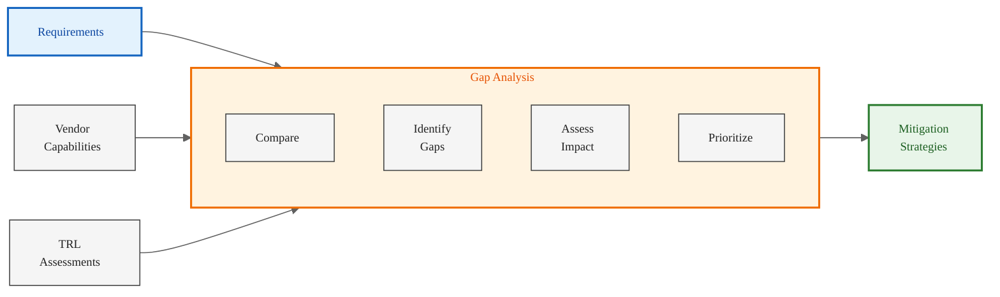

### Gap Prioritization

Gaps are prioritized based on:
- **Mission Impact**: How critical is this capability to mission success?
- **Risk**: Probability and consequence of gap not being closed
- **Cost**: Investment required to close the gap
- **Schedule**: Time required to develop or procure solution

### Gap Mitigation Strategies

**1. Technology Development**
- Invest in maturing technology to required TRL
- Partner with vendor on development program

**2. Requirements Refinement**
- Adjust requirement to match available capability
- Trade performance for cost/schedule/risk

**3. Alternative Approaches**
- Identify alternative vendors or technologies
- Consider COTS (Commercial Off-The-Shelf) solutions

**4. System Redesign**
- Modify system architecture to work around gap
- Distribute function across multiple components

**5. Accept Risk**
- Document risk and develop contingency plans
- Monitor throughout program lifecycle

---

## 8. Technology Program Development

### From Gaps to Programs

Identified gaps that cannot be mitigated through other means become technology development programs.

**Program Types:**

**1. Technology Maturation Programs**
- Goal: Advance TRL from current level to required level
- Activities: Lab testing, prototyping, field trials

**2. Integration Programs**
- Goal: Develop interfaces between incompatible systems
- Activities: Adapter development, protocol translation, middleware

**3. Qualification Programs**
- Goal: Certify technology for operational use
- Activities: Environmental testing, qualification testing, certification

**4. Demonstration Programs**
- Goal: Prove technology viability in relevant environment
- Activities: Prototype development, operational demonstrations

### Program Planning

**For Each Technology Program:**

1. **Objectives**: Clear, measurable goals
2. **Scope**: Specific work to be performed
3. **Schedule**: Milestones and delivery dates
4. **Budget**: Cost estimates and funding sources
5. **Team**: Organizational responsibilities
6. **Risks**: Technical, schedule, cost risks
7. **Success Criteria**: How will we know when we're done?

### Visual Reference: Project Hierarchy

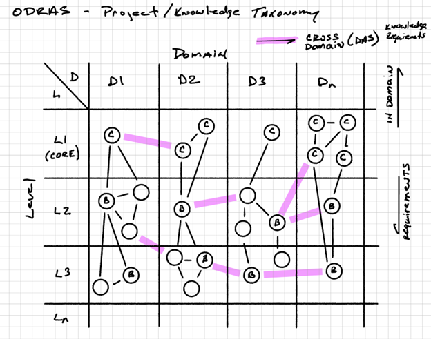

*Project hierarchy showing how technology programs fit into overall program structure.*

### Technology Program Tracking

ODRAS maintains traceability from:
- **Gap** → **Technology Program** → **Component** → **Requirement**

This ensures that all development efforts directly support requirement satisfaction.

### Program Portfolio Management

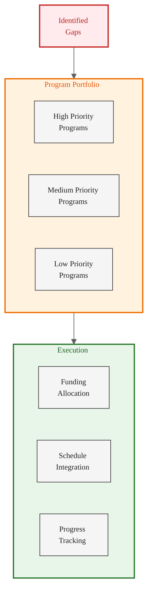

---

## 9. Complete Workflow Diagram

### End-to-End Process

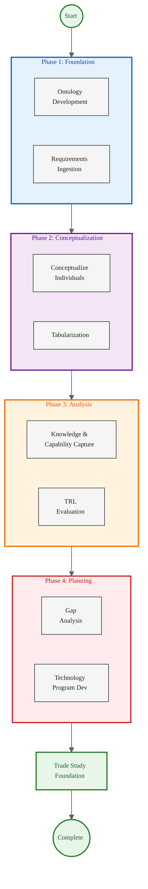

### Workflow Characteristics

**Ontology-Driven**
- Every step is grounded in semantic models
- Relationships are explicitly defined and traceable
- Reasoning can identify inconsistencies and conflicts

**AI-Enhanced**
- DAS assists in concept generation
- Natural language queries provide instant insights
- Pattern recognition identifies gaps and risks

**Collaborative**
- Multiple users work on same project
- DAS conversations capture rationale
- Knowledge shared across team

**Traceable**
- Full lineage from requirement to technology program
- Audit trail of all decisions and analyses
- Exportable for external review

**Iterative**
- Process can repeat as requirements evolve
- New vendors can be added for re-evaluation
- Technology programs update TRL assessments

---

## 10. Benefits of Ontology-Driven Workflow

### Semantic Consistency

- **Common Vocabulary**: All stakeholders use same terms with same meanings
- **Automated Reasoning**: Detect conflicts and inconsistencies
- **Cross-Domain Integration**: Bridge multiple engineering disciplines

### Traceability

- **Requirements to Programs**: Complete lineage
- **Decision Rationale**: Capture why choices were made
- **Impact Analysis**: Understand effects of changes

### Reusability

- **Ontology Libraries**: Reuse ontologies across projects
- **Component Catalogs**: Build libraries of proven designs
- **Best Practices**: Codify engineering knowledge

### Automation

- **Concept Generation**: DAS creates initial designs
- **Table Population**: Auto-generate comparison matrices
- **Report Generation**: Automated documentation

### Scalability

- **Large Programs**: Handle thousands of requirements
- **Multiple Vendors**: Compare many alternatives
- **Complex Systems**: Manage system-of-systems hierarchies

---

## 11. WIRR Application Example

### FLRAA Marine Variant Analysis

**Project Overview:**
Analyze FLRAA (Future Long Range Assault Aircraft) requirements and Marine Appendix to develop Marine aviation variant concepts.

**Ontology Foundation:**
- BSEO v1 base
- Aerospace domain extension
- Rotorcraft-specific classes
- Marine operations vocabulary

**Requirements Ingestion:**
- FLRAA baseline specification (500+ requirements)
- Marine Appendix (150+ additional requirements)
- Regulatory requirements (FAA, Navy)

**Conceptualization:**
- 50+ major components identified
- 200+ functions catalogued
- 100+ interfaces defined
- 4 vendor solutions conceptualized

**Tabularization:**
- Requirements traceability matrix (500 rows × 10 columns)
- Vendor comparison matrix (4 vendors × 50 requirements)
- Interface control document (100 interfaces)
- Component breakdown structure (hierarchical)

**Knowledge Capture:**
- Bell: 25 technical documents, 10 DAS conversations
- Boeing: 30 technical documents, 12 DAS conversations
- LMCO: 28 technical documents, 11 DAS conversations
- Leonardo: 20 technical documents, 8 DAS conversations

**TRL Assessment:**
- 15 components identified as low TRL (<6)
- 8 high-risk areas requiring technology development
- 3 components at TRL 9 (mature, proven)

**Gap Analysis:**
- 12 performance gaps identified
- 8 technology maturity gaps
- 5 interface compatibility issues
- 3 schedule conflicts

**Technology Programs:**
- Folding rotor mechanism (TRL 5→7)
- Marine corrosion protection (TRL 6→8)
- Integrated avionics suite (TRL 5→7)
- Shipboard operations package (TRL 4→6)

**Outcome:**
Foundation established for trade study phase with complete traceability, vendor comparison data, and technology development roadmap.

---

## 12. Visual Summary

### Project Cell Architecture

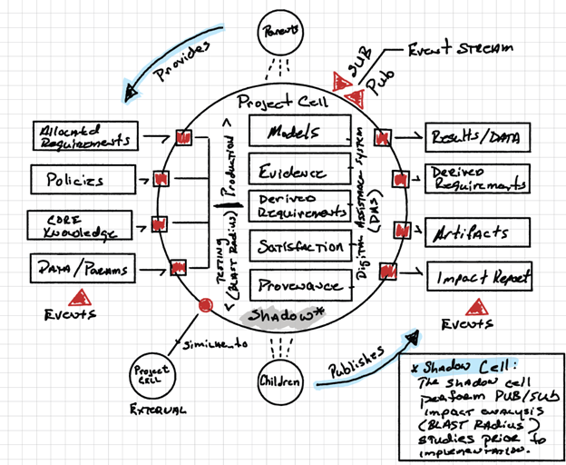

*Project cell showing how all workflow elements are organized within isolated project boundaries.*

---

## 13. Conclusion

The ontology-driven workflow in ODRAS provides a rigorous, systematic approach to transforming requirements into actionable technology programs. By grounding every step in semantic models, the process ensures:

- **Consistency** across large, complex programs
- **Traceability** from requirements to technology development
- **Collaboration** through shared vocabulary and models
- **Intelligence** via AI-assisted analysis and reasoning
- **Reusability** of knowledge across projects and programs

This workflow is applicable to any domain where complex systems must be analyzed, designed, and developed with full traceability and rigorous engineering discipline.

---

## References

- Base Systems Engineering Ontology (BSEO) v1 Specification
- ISO 15288: Systems and Software Engineering
- NASA Systems Engineering Handbook (NASA/SP-2007-6105)
- DoD Architecture Framework (DoDAF) v2.02
- Technology Readiness Assessment Guidelines (DoD, NASA)
- INCOSE Systems Engineering Handbook v4

