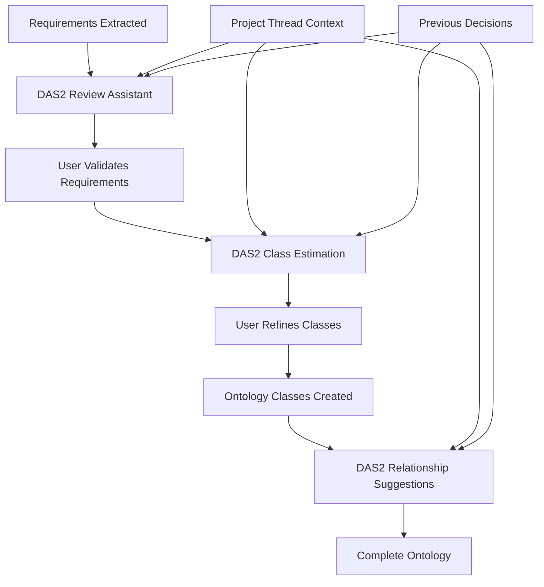

# DAS2 Implementation Success & Future Roadmap

## Executive Summary

DAS2 represents a complete architectural pivot from complex "intelligent" processing to a simple, effective approach: **collect all context → send to LLM → return response with sources**. This document details the successful DAS2 implementation, why the original DAS failed, and the roadmap for requirements review and ontology estimation workflows.

## What DAS2 Does (Successfully)

### Core Architecture - Dead Simple
```
User Message → DAS2 API → Collect Project Context → Collect RAG Context →
Build Complete Prompt → Send to LLM → Return Response + Sources
```

### Key Components

#### 1. `backend/services/das2_core_engine.py`
**Purpose**: Core processing engine that collects ALL context and sends to LLM

**What it does**:
- Gets project thread context (conversation history, events, goals, workbench)
- Gets RAG context (knowledge chunks + sources from uploaded documents)
- Builds ONE comprehensive prompt with everything
- Calls LLM directly via HTTP (no complex infrastructure)
- Returns natural response with sources intact

**Critical Method**: `process_message()` - Single entry point, no branching logic

#### 2. `backend/api/das2.py`
**Purpose**: Simple API endpoints with minimal complexity

**Endpoints**:
- `POST /api/das2/chat` - Main chat interface
- `GET /api/das2/project/{project_id}/thread` - Thread discovery
- `GET /api/das2/project/{project_id}/history` - Conversation history

**Key Features**:
- Direct response models (no complex transformations)
- Proper 404 handling for missing threads
- Sources returned to frontend for display

#### 3. `backend/services/middleware_to_das2_bridge.py`
**Purpose**: Simple event capture without complex processing

**Features**:
- Only captures events if project thread exists (no spurious creation)
- Simple event type mapping
- Minimal error handling

#### 4. Frontend Updates (`frontend/app.html`)
**Changes**:
- All DAS API calls updated from `/api/das/` to `/api/das2/`
- Simplified error handling for missing features
- Fixed JavaScript syntax errors

## Why Original DAS Failed

### Architecture Problems

#### 1. **Complex Intelligence Layers**
```
Original: Message → Intent Analysis → Contextual Resolution → Query Enhancement →
         Contextual Generation → Project Suggestions → Response

DAS2:     Message → Collect Context → Send to LLM → Response
```

**Problem**: Hard-coded "intelligence" that added complexity without value

#### 2. **Multiple Thread Systems**
- **Legacy DAS threading** (Redis-based, memory cache)
- **ProjectThreadManager system** (Qdrant vector store)
- **Incompatible lookups** causing "thread not found" errors

**Solution**: DAS2 uses only ProjectThreadManager system consistently

#### 3. **LLMTeam API Mismatch**
- **LLMTeam designed for requirements analysis** with schemas and personas
- **DAS tried to force conversational responses** through requirements analysis API
- **API calls failed** with "no attribute 'generate_response'" errors

**Solution**: DAS2 calls LLM directly via HTTP (OpenAI-compatible API)

#### 4. **Exception Handling Issues**
- **Generic exception handlers** catching HTTPExceptions and re-throwing as 500s
- **Proper 404 responses** getting masked as generic errors
- **Frontend couldn't distinguish** between different error types

**Solution**: DAS2 lets HTTPExceptions pass through properly

### Technical Failures

#### 1. **Context Not Reaching LLM**
```
Original: Context collected → Lost in intelligence layers → LLM gets partial context
DAS2:     Context collected → Sent directly to LLM → Full context preserved
```

#### 2. **RAG Sources Not Displayed**
```
Original: RAG returns sources → Complex processing → Sources lost → No references shown
DAS2:     RAG returns sources → Direct passthrough → Sources displayed properly
```

#### 3. **Conversation Memory Broken**
```
Original: History exists → Intelligence layer decides how to use → Often ignored
DAS2:     History exists → Sent directly to LLM → LLM decides how to reference
```

## DAS2 Success Factors

### 1. **Single Context Path**
- All context (conversation, project, RAG) collected once
- Sent to LLM in single prompt
- No branching logic or "intelligent" decisions

### 2. **Direct LLM Integration**
- HTTP calls directly to OpenAI-compatible endpoints
- No complex infrastructure dependencies
- Reliable, debuggable communication

### 3. **Preserved Event System**
- All project intelligence and event capture maintained
- Events only captured for existing threads (no spurious creation)
- Full project context awareness retained

### 4. **Clean Error Handling**
- Proper HTTP status codes
- Clear user messages
- No masking of legitimate errors

## Current Status - Production Ready

### ✅ **Working Features**
- **Project thread creation** - Only when projects are created
- **Conversation memory** - "What did I ask?" works correctly
- **Knowledge integration** - RAG sources displayed with document titles
- **Event capture** - Full project intelligence preserved
- **No spurious creation** - Clean thread management

### ✅ **Verified Through Testing**
- Created test projects with `das_service` account
- Verified conversation flow and memory
- Confirmed source/reference display
- Validated no spurious thread creation
- All debug logging working

## Next Steps - Requirements Review & Ontology Estimation

### Phase 1: Requirements Collection Integration

#### 1.1 DAS2 + Requirements Workflow
**Objective**: Use DAS2 to guide users through requirements review and validation

**Implementation Plan**:
```python
# New DAS2 capabilities for requirements
@router.post("/requirements/review")
async def review_requirements_with_das2(
    project_id: str,
    requirements_list: List[Dict],
    user: dict = Depends(get_user)
):
    """
    Use DAS2 to help users review and validate extracted requirements
    DAS2 provides context-aware guidance based on project history
    """
    # Get project context via DAS2
    # Present requirements with DAS2 assistance
    # Capture review decisions in project thread
```

#### 1.2 Requirements Context Integration
**Approach**:
- **Requirements become part of project context** sent to DAS2
- **DAS2 can reference previous requirements** when reviewing new ones
- **Project thread captures all requirements decisions** for consistency

### Phase 2: Ontology Class Estimation

#### 2.1 DAS2-Guided Ontology Development
**Workflow**:
1. **Requirements reviewed** → DAS2 suggests potential ontology classes
2. **User validates suggestions** → DAS2 captures decisions in project context
3. **Ontology classes created** → DAS2 maintains class relationships in project thread
4. **Iterative refinement** → DAS2 references previous decisions

**Implementation**:
```python
# DAS2 ontology assistance
@router.post("/ontology/estimate-classes")
async def estimate_ontology_classes_with_das2(
    project_id: str,
    requirements: List[Dict],
    existing_ontology: Optional[Dict] = None,
    user: dict = Depends(get_user)
):
    """
    Use DAS2 to estimate ontology classes from requirements
    Leverages full project context and previous ontology decisions
    """
    # Build context: requirements + project history + existing ontology
    # Send to DAS2 for class suggestions
    # Return suggestions with rationale based on project context
```

#### 2.2 Context-Aware Class Suggestions
**DAS2 Advantages**:
- **Remembers previous ontology decisions** from conversation history
- **References similar requirements** from project events
- **Considers existing classes** from active ontologies
- **Maintains consistency** across ontology development sessions

### Phase 3: Integrated Requirements-to-Ontology Pipeline

#### 3.1 Complete Workflow Integration


#### 3.2 DAS2 Prompting Strategy for Ontology Work
**Context Structure**:
```
PROJECT CONTEXT:
- Current workbench: ontology
- Project goals: [User-defined goals]
- Active ontologies: [Existing classes and relationships]

CONVERSATION HISTORY:
- Previous ontology decisions
- User preferences and validation patterns
- Rejected suggestions and rationale

REQUIREMENTS CONTEXT:
- Current requirements being processed
- Previously processed requirements
- Validation status and user feedback

KNOWLEDGE BASE:
- Domain-specific ontology patterns
- Best practices from uploaded documents
- Reference ontologies and standards

USER QUESTION: "What ontology classes should I create for these requirements?"
```

### Phase 4: Advanced Context Utilization

#### 4.1 Cross-Project Learning
**Future Enhancement**: DAS2 can reference patterns from other projects
- **Similar requirements** across projects
- **Proven ontology patterns** that worked well
- **Common validation decisions** from project threads

#### 4.2 Domain-Specific Assistance
**Approach**: DAS2 becomes domain-aware through project context
- **Engineering projects** → Reference engineering ontologies
- **Business projects** → Reference business process ontologies
- **Research projects** → Reference research methodology ontologies

## Technical Implementation Guidelines

### DAS2 Extension Principles

#### 1. **Maintain Simplicity**
- **NO complex intelligence layers**
- **ALL context to LLM** - let LLM decide what to use
- **Direct response processing** - minimal transformations

#### 2. **Context First**
- **Project thread context** drives all responses
- **Conversation history** provides continuity
- **Project events** maintain decision context
- **RAG knowledge** provides domain expertise

#### 3. **Consistent Architecture**
```python
# DAS2 Pattern for new features
async def new_das2_feature(project_id, user_input, context):
    # 1. Get project thread
    project_thread = await get_project_thread_by_project_id(project_id)

    # 2. Get relevant knowledge via RAG
    knowledge = await rag_service.query_knowledge_base(user_input, project_id)

    # 3. Build complete context
    full_context = build_context(project_thread, knowledge, user_input)

    # 4. Send to LLM
    response = await call_llm_directly(full_context)

    # 5. Save to project thread
    await save_interaction(project_thread, user_input, response)

    # 6. Return with sources
    return response_with_sources(response, knowledge.sources)
```

## Database Schema Considerations

### Project Thread Storage
**Current**: Uses Qdrant vector store via ProjectThreadManager
**Status**: ✅ Working correctly - no changes needed

**Key Collections**:
- `project_threads` - Thread storage and search
- `knowledge_chunks` - Document knowledge for RAG
- `requirements` - PostgreSQL table for requirements data

### Requirements Integration Schema
**Proposed Extensions**:
```sql
-- Link requirements to project threads for DAS2 context
ALTER TABLE requirements ADD COLUMN project_thread_id UUID;
ALTER TABLE requirements ADD COLUMN reviewed_via_das BOOLEAN DEFAULT FALSE;
ALTER TABLE requirements ADD COLUMN das_context JSONB; -- DAS2 suggestions and rationale

-- Track ontology decisions in project context
CREATE TABLE ontology_decisions (
    id UUID PRIMARY KEY,
    project_id UUID REFERENCES projects(project_id),
    project_thread_id UUID,
    decision_type VARCHAR(50), -- 'class_created', 'relationship_added', 'validation_completed'
    decision_data JSONB,
    das_rationale TEXT, -- DAS2's reasoning for the suggestion
    user_validation BOOLEAN,
    created_at TIMESTAMP DEFAULT NOW()
);
```

## Performance Considerations

### DAS2 Optimizations

#### 1. **Context Size Management**
- **Conversation history**: Last 10 entries (configurable)
- **Project events**: Last 5 entries (configurable)
- **RAG chunks**: Max 5 chunks (configurable)
- **Total prompt size**: ~4K tokens (well within LLM limits)

#### 2. **Caching Strategy**
- **Project threads**: Cached in memory after first load
- **RAG responses**: No caching (always fresh knowledge)
- **LLM responses**: No caching (context-dependent)

#### 3. **Scaling Considerations**
- **Stateless design**: Each request independent
- **Database-backed**: Survives service restarts
- **Async processing**: Non-blocking operations

## Testing Strategy

### Current Testing Approach
**Test with `das_service` account** per user requirements:
- Username: `das_service`
- Password: `das_service_2024!`

### Test Scenarios for Future Development

#### 1. **Requirements Review Testing**
```python
# Test script template
def test_requirements_review():
    # 1. Create project (thread created automatically)
    # 2. Upload requirements document
    # 3. Extract requirements via BPMN workflow
    # 4. Use DAS2 to review requirements
    # 5. Validate DAS2 maintains context across review session
    # 6. Verify requirements decisions saved to project thread
```

#### 2. **Ontology Estimation Testing**
```python
def test_ontology_estimation():
    # 1. Start with validated requirements
    # 2. Use DAS2 to suggest ontology classes
    # 3. User validates/refines suggestions
    # 4. Verify DAS2 remembers decisions for next iteration
    # 5. Test cross-requirement consistency suggestions
```

## Migration Status

### ✅ **Completed Migration**
- **DAS1 disabled** in `backend/main.py`
- **DAS2 active** with all endpoints functional
- **Frontend updated** to use DAS2 APIs
- **Project thread creation** preserved and working
- **Event system intact** - no functionality lost

### 🧹 **Clean Architecture**
- **3 new files created**:
  - `backend/services/das2_core_engine.py`
  - `backend/api/das2.py`
  - `backend/services/middleware_to_das2_bridge.py`
- **1 file updated**: `backend/main.py` (router changes)
- **1 file updated**: `frontend/app.html` (endpoint changes)

### 📋 **Maintained Functionality**
- **Project thread management** - Same system, same data
- **Event capture** - All project intelligence preserved
- **Knowledge search** - RAG service unchanged
- **User authentication** - Same auth system
- **Project creation** - Same flow, creates threads properly

## Future Development Roadmap

### Milestone 1: Requirements Review Integration (Next 2-4 weeks)

#### 1.1 **DAS2 Requirements Assistant**
**Objective**: Use DAS2 to guide requirements validation and refinement

**Technical Implementation**:
```python
# New endpoint for requirements review
@router.post("/api/das2/requirements/review")
async def review_requirements_with_das2(
    project_id: str,
    requirements_batch: List[Dict],
    review_context: Optional[Dict] = None,
    user: dict = Depends(get_user)
):
    """
    Use DAS2 to help review extracted requirements
    Provides context-aware suggestions based on project history
    """

    # Build requirements context
    requirements_context = {
        "current_requirements": requirements_batch,
        "review_session_type": review_context.get("session_type", "initial"),
        "focus_areas": review_context.get("focus_areas", []),
        "previous_validation_patterns": get_validation_patterns(project_id)
    }

    # DAS2 processing with requirements context
    das2_response = await das2_engine.process_message(
        project_id=project_id,
        message=f"Please help me review these {len(requirements_batch)} requirements. Focus on completeness, clarity, and consistency with previous requirements.",
        user_id=user["user_id"],
        additional_context=requirements_context
    )

    return {
        "review_guidance": das2_response.message,
        "suggested_actions": extract_action_items(das2_response.message),
        "requirements_with_context": requirements_batch,
        "sources": das2_response.sources
    }
```

#### 1.2 **Requirements Context Integration**
**Database Updates**:
```sql
-- Add DAS2 context to requirements
ALTER TABLE requirements ADD COLUMN das2_review_context JSONB;
ALTER TABLE requirements ADD COLUMN das2_suggestions TEXT;
ALTER TABLE requirements ADD COLUMN user_validation_status VARCHAR(50);

-- Index for efficient DAS2 queries
CREATE INDEX idx_requirements_das2_review ON requirements(project_id, das2_review_context);
```

**Project Thread Context Extension**:
- **Requirements decisions** added to conversation history
- **Validation patterns** captured in project events
- **Domain preferences** learned and applied to future reviews

### Milestone 2: Ontology Class Estimation (4-6 weeks)

#### 2.1 **DAS2 Ontology Assistant**
**Objective**: Use DAS2 to suggest ontology classes from validated requirements

**Core Functionality**:
```python
@router.post("/api/das2/ontology/estimate-classes")
async def estimate_classes_with_das2(
    project_id: str,
    validated_requirements: List[Dict],
    existing_ontology: Optional[Dict] = None,
    estimation_context: Optional[Dict] = None,
    user: dict = Depends(get_user)
):
    """
    Use DAS2 to estimate ontology classes from requirements
    Leverages full project context and ontology development history
    """

    # Build ontology estimation context
    ontology_context = {
        "validated_requirements": validated_requirements,
        "existing_classes": existing_ontology.get("classes", []) if existing_ontology else [],
        "existing_relationships": existing_ontology.get("relationships", []) if existing_ontology else [],
        "domain_focus": estimation_context.get("domain", "general"),
        "abstraction_level": estimation_context.get("level", "medium"),
        "previous_ontology_decisions": get_ontology_decisions(project_id)
    }

    # DAS2 class estimation
    estimation_prompt = f"""Based on these {len(validated_requirements)} validated requirements and the project context, suggest appropriate ontology classes. Consider:

    1. What are the main entities/concepts in these requirements?
    2. What classes already exist that could be reused or extended?
    3. What new classes are needed?
    4. How do these classes relate to each other?
    5. What properties should each class have?

    Focus on practical, implementable classes that directly support the requirements."""

    das2_response = await das2_engine.process_message(
        project_id=project_id,
        message=estimation_prompt,
        user_id=user["user_id"],
        additional_context=ontology_context
    )

    # Parse DAS2 suggestions into structured format
    class_suggestions = parse_class_suggestions(das2_response.message)

    return {
        "suggested_classes": class_suggestions,
        "rationale": das2_response.message,
        "confidence": estimate_confidence(class_suggestions),
        "next_steps": generate_next_steps(class_suggestions),
        "sources": das2_response.sources
    }
```

#### 2.2 **Ontology Context Preservation**
**Project Thread Integration**:
- **Class creation decisions** captured in conversation history
- **Rationale and alternatives** preserved for future reference
- **Cross-requirement patterns** identified and reused
- **Domain knowledge** accumulated across ontology sessions

### Milestone 3: Advanced DAS2 Capabilities (6-8 weeks)

#### 3.1 **Cross-Project Ontology Assistance**
**Objective**: DAS2 references successful patterns from other projects

**Implementation Strategy**:
- **Project cascade integration** - DAS2 accesses parent project ontologies
- **Pattern recognition** - DAS2 identifies successful class structures
- **Best practice guidance** - DAS2 suggests proven approaches

#### 3.2 **Automated Class Relationship Suggestions**
**Approach**: DAS2 suggests relationships between classes based on requirements

**Technical Flow**:
1. **Classes created** → DAS2 analyzes requirements for relationships
2. **Relationship patterns identified** → DAS2 suggests connections
3. **User validates relationships** → DAS2 learns from decisions
4. **Ontology completed** → DAS2 provides completeness assessment

## DAS2 Configuration & Deployment

### Production Configuration
**Required Settings**:
```python
# LLM Configuration for DAS2
llm_provider: str = "openai"  # or "ollama"
llm_model: str = "gpt-4o-mini"  # or local model
openai_api_key: Optional[str] = None  # Required for OpenAI
ollama_url: str = "http://localhost:11434"  # Required for Ollama

# DAS2 Performance Settings
das2_max_conversation_history: int = 10
das2_max_project_events: int = 5
das2_max_rag_chunks: int = 5
das2_llm_timeout: int = 30
das2_temperature: float = 0.7
das2_max_tokens: int = 1000
```

### Monitoring & Observability
**Debug Logging**:
- `DAS2_DEBUG` logs for execution tracing
- `DAS2_PROMPT` logs for LLM input monitoring
- `DAS2_RESPONSE` logs for LLM output tracking

**Performance Metrics**:
- Response time per DAS2 interaction
- Context size and LLM token usage
- Success rate of context collection
- User satisfaction with responses

## Success Criteria & KPIs

### Technical Success Metrics
- **Response time < 3 seconds** for typical DAS2 interactions
- **Context completeness > 95%** (all available context included)
- **Conversation continuity > 90%** (references previous interactions)
- **Source accuracy 100%** (correct document titles and references)

### User Experience Metrics
- **Requirements review efficiency** - Time to validate requirements
- **Ontology development speed** - Time to create validated classes
- **Decision consistency** - Reduced contradictory decisions
- **User satisfaction** - Preference for DAS2 vs manual processes

### Project Impact Metrics
- **Ontology quality** - Completeness and consistency scores
- **Requirements traceability** - Clear links from requirements to classes
- **Knowledge reuse** - Successful pattern application across projects
- **Development velocity** - Faster ontology development cycles

## Conclusion

DAS2 represents a successful architectural pivot from complex "intelligence" to simple effectiveness. By collecting all available context and letting the LLM decide how to use it, we've created a reliable, maintainable system that provides genuine value to users.

The foundation is now in place for advanced requirements review and ontology estimation workflows that leverage the full power of project context, conversation memory, and domain knowledge through a simple, predictable interface.

**Key Success Factor**: Trusting the LLM to handle complexity while keeping the system architecture simple and reliable.

---

**Document Created**: September 23, 2025
**Status**: DAS2 Production Ready
**Next Phase**: Requirements Review Integration
**Maintainer**: ODRAS Development Team
