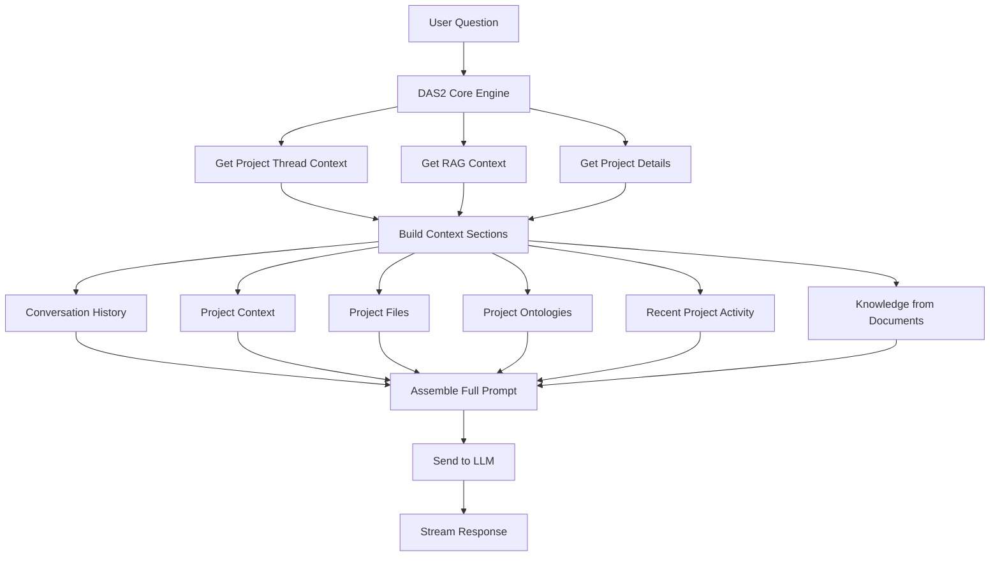
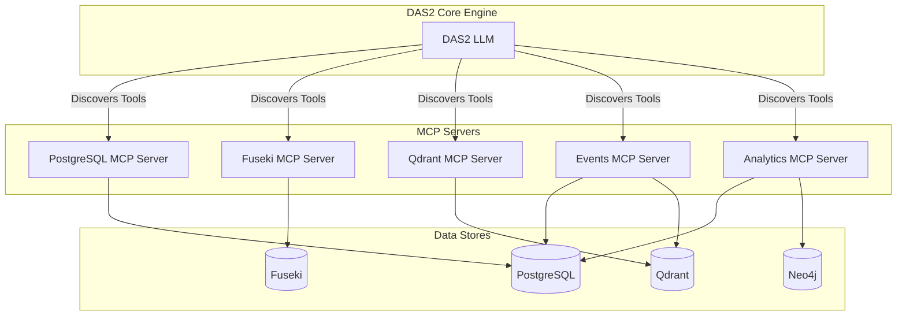

# DAS2 Prompt Generation Architecture

**Document Status**: Active
**Last Updated**: October 2025
**Version**: 1.0

## Overview

This document explains how DAS2 (the current active Digital Assistant System) constructs its prompts from various context sources, identifies gaps in the current implementation, and proposes enhancements for dynamic context retrieval using Model Context Protocol (MCP) servers.

---

## Table of Contents

1. [Current Prompt Assembly Process](#current-prompt-assembly)
2. [Context Sources](#context-sources)
3. [Context Format and Structure](#context-format)
4. [Gaps and Limitations](#gaps-limitations)
5. [Dynamic Context Retrieval Strategy](#dynamic-context-retrieval)
6. [MCP Server Architecture](#mcp-server-architecture)
7. [Implementation Roadmap](#implementation-roadmap)
8. [Technical Details](#technical-details)

---

## Current Prompt Assembly Process {#current-prompt-assembly}

### High-Level Flow



### Step-by-Step Process

**Location**: `backend/services/das2_core_engine.py::process_message_stream()`

1. **User Message Received**
   - Project ID and user message arrive at DAS2 API
   - User message stored immediately in SQL (conversation history)

2. **Fetch Project Thread Context**
   ```python
   project_context = await self.project_manager.get_project_context(project_id)
   ```
   - Returns: project thread metadata, conversation history, recent events, project metadata

3. **Build Context-Aware RAG Query**
   ```python
   enhanced_query = self._build_context_aware_query(message, conversation_history)
   ```
   - Adds conversation context for pronoun resolution
   - Flags comprehensive vs. specific queries
   - Enhances query with entity context

4. **Query RAG Knowledge Base**
   ```python
   rag_response = await self.rag_service.query_knowledge_base(...)
   ```
   - Retrieves relevant document chunks
   - Returns formatted knowledge with sources
   - Configured based on query type (comprehensive vs. specific)

5. **Assemble Context Sections**
   - **Conversation History**: Last 5-10 exchanges
   - **Project Context**: Project details, description, domain, namespace
   - **Project Files**: Uploaded documents in the project
   - **Project Ontologies**: **[NEW]** Full ontology details from Fuseki
   - **Recent Project Activity**: Last 20 events from SQL
   - **Knowledge from Documents**: RAG results if found

6. **Build Final Prompt**
   ```python
   prompt = f"""You are DAS, a digital assistant for this project...

   {full_context}

   USER QUESTION: {message}
   """
   ```

7. **Stream LLM Response**
   - Send to LLM (OpenAI or Ollama)
   - Stream chunks back to user
   - Store complete response in SQL

---

## Context Sources {#context-sources}

### 1. Conversation History

**Source**: PostgreSQL → `project_threads` table → `conversation_history` column
**Retrieval**: SQL read-through via `SqlFirstThreadManager.get_project_context()`

**Format**:
```
CONVERSATION HISTORY:
User: What classes are in my ontology?
DAS: The Test Ontology contains Vehicle, Car, and Truck classes.
User: What properties does Vehicle have?
DAS: Vehicle has properties...
```

**Limitations**:
- Limited to last 5-10 conversation pairs
- No semantic search on conversation history
- No conversation summarization for long threads
- Simple chronological ordering only

---

### 2. Project Details

**Source**: PostgreSQL → `projects` table (with namespace joins)
**Retrieval**: Direct SQL query via `db_service.get_project_comprehensive()`

**Included Data**:
- Project name, description, domain
- Creator username and timestamps
- Namespace information (name, path, description, status)
- Project URI

**Example**:
```
PROJECT CONTEXT:
Project: test-tree-view (ID: 39758654-08e1-4dfa-92fa-a648756d6d13)
Description: Test project to verify new tree view structure
Domain: systems-engineering
Created by: das_service
Created: 2025-10-04 10:14:53.216972+00:00
Namespace: odras-core (odras/core)
Project URI: https://xma-adt.usnc.mil/odras/core/39758654-08e1-4dfa-92fa-a648756d6d13/
```

**Gaps**:
- No project goals/objectives tracking
- No project phase/status information
- No stakeholder information
- No project metrics or statistics

---

### 3. Project Files

**Source**: PostgreSQL → `knowledge_assets` table
**Retrieval**: SQL query filtered by `project_id`

**Included Data**:
- File title
- Document type (pdf, docx, txt, etc.)
- Filename

**Example**:
```
PROJECT FILES:
• UAV Specifications (pdf) - uav_specs.pdf
• Requirements Document (docx) - requirements.docx
• Design Notes (txt) - design_notes.txt
```

**Gaps**:
- No file metadata (upload date, size, author)
- No file relationships (which files relate to which requirements/classes)
- No file version tracking
- No indication of file processing status

---

### 4. Project Ontologies ✨ NEW FEATURE

**Source**: PostgreSQL (registry) + Apache Jena Fuseki (SPARQL queries)
**Retrieval**:
1. Get ontology list from `ontologies_registry` table
2. For each ontology, query Fuseki with SPARQL for full details

**SPARQL Query**:
```sparql
PREFIX owl: <http://www.w3.org/2002/07/owl#>
PREFIX rdfs: <http://www.w3.org/2000/01/rdf-schema#>

SELECT ?class ?className ?classComment
       ?objProp ?objPropName ?objPropComment ?domain ?range
       ?dataProp ?dataPropName ?dataPropComment ?dataDomain ?dataRange
WHERE {
    GRAPH <{graph_iri}> {
        # Classes
        OPTIONAL {
            ?class a owl:Class .
            OPTIONAL { ?class rdfs:label ?className }
            OPTIONAL { ?class rdfs:comment ?classComment }
        }

        # Object Properties
        OPTIONAL {
            ?objProp a owl:ObjectProperty .
            OPTIONAL { ?objProp rdfs:label ?objPropName }
            OPTIONAL { ?objProp rdfs:comment ?objPropComment }
            OPTIONAL { ?objProp rdfs:domain ?domain }
            OPTIONAL { ?objProp rdfs:range ?range }
        }

        # Data Properties
        OPTIONAL {
            ?dataProp a owl:DatatypeProperty .
            OPTIONAL { ?dataProp rdfs:label ?dataPropName }
            OPTIONAL { ?dataProp rdfs:comment ?dataPropComment }
            OPTIONAL { ?dataProp rdfs:domain ?dataDomain }
            OPTIONAL { ?dataProp rdfs:range ?dataRange }
        }
    }
}
```

**Included Data**:
- **Classes**: Name, description/comment
- **Object Properties**: Name, domain, range, description
- **Data Properties**: Name, domain, data type, description

**Example**:
```
PROJECT ONTOLOGIES:

Aircraft Ontology (base):
  Classes:
    • Aircraft: A vehicle capable of flight
    • Helicopter: A rotary-wing aircraft with vertical takeoff capability
  Relationships:
    • operated by: Aircraft → (Relationship indicating who operates the aircraft)
  Data Properties:
    • has wingspan (Aircraft): float - The wingspan of the aircraft in meters
    • has max altitude (Aircraft): integer - Maximum operational altitude in feet

Test Ontology (base):
  Classes:
    • Vehicle: A motorized vehicle
    • Car: A four-wheeled motorized vehicle
  Relationships:
    • transported by: Vehicle → Truck (Relationship indicating transportation)
  Data Properties:
    • has weight (Vehicle): integer - The weight of the vehicle in kilograms
```

**Gaps**:
- No **individuals/instances** (actual data)
- No **cardinality restrictions** (e.g., "must have exactly one manufacturer")
- No **equivalent class mappings** to reference ontologies
- No **subclass hierarchies** (inheritance relationships)
- No **annotation properties** (skos:definition, dc:creator, etc.)
- No **inverse properties** information
- No **disjoint classes** information

---

### 5. Recent Project Activity

**Source**: PostgreSQL → `project_events` table
**Retrieval**: SQL query for last 20 events, ordered by timestamp

**Event Types Captured**:
- `project_created`
- `ontology_created`
- `file_uploaded`
- `requirement_created`
- `das_interaction`
- `workflow_started`
- `knowledge_asset_created`

**Example**:
```
RECENT PROJECT ACTIVITY:
• das_service asked DAS: "What ontologies are in this project?"
• das_service created ontology 'aircraft-ontology'
• das_service uploaded file 'requirements.pdf'
• das_service created project 'test-tree-view' in systems-engineering domain
```

**Gaps**:
- **No semantic search** - all events are included chronologically
- **No relevance filtering** - irrelevant events clutter context
- **No event categorization** - can't filter by event type for specific questions
- **No event relationships** - can't link related events (e.g., requirement → class → property)
- **No user-specific filtering** - includes all users' activities
- **Limited to 20 events** - may miss important older context

---

### 6. Knowledge from Documents (RAG)

**Source**: Qdrant vector database
**Retrieval**: Semantic search on embedded document chunks

**Process**:
1. Generate embedding for user question
2. Query `knowledge_chunks` collection (384-dim) or `knowledge_large` collection (1536-dim)
3. Retrieve top N most similar chunks (configurable: 10-20 chunks)
4. Filter by similarity threshold (0.1-0.2)
5. Format chunks as coherent text

**Example**:
```
KNOWLEDGE FROM DOCUMENTS:
The QuadCopter T4 has a maximum payload capacity of 2.5 kg and can operate
for up to 30 minutes on a single battery charge. It features GPS navigation
and autonomous flight capabilities...

Sources:
1. UAV Specifications Document (pdf)
2. Technical Requirements (docx)
```

**Gaps**:
- **No dynamic chunk sizing** - fixed chunk size regardless of question type
- **No multi-hop reasoning** - can't combine information across documents
- **No metadata filtering** - can't filter by document type, date, or author
- **No reranking** - initial retrieval is final
- **No query decomposition** - complex questions aren't broken down
- **No source diversity** - may return similar chunks from same document

---

## Context Format and Structure {#context-format}

### Complete Prompt Template

```
You are DAS, a digital assistant for this project. Answer using ALL provided context.

IMPORTANT INSTRUCTIONS:
1. ALWAYS use the provided context as the authoritative source
2. If information is in the context, state it confidently
3. If information is NOT in the context, clearly say "I don't have that information"
4. For ambiguous pronouns (it, its, that) without clear context, ask for clarification
5. For comprehensive queries (tables, lists), include ALL relevant information
6. For questions outside this project's domain, politely redirect
7. NEVER contradict previous responses - be consistent
8. When context is unclear or missing, ask specific clarifying questions

CONTEXT ANALYSIS:
- If the user asks about "it" or "its" and no clear entity was recently mentioned,
  ask for clarification
- If the user asks about topics not in the project context, redirect to project focus
- If the context contains partial information, provide what's available and indicate
  what's missing

CONVERSATION HISTORY:
[Last 5-10 conversation pairs]

PROJECT CONTEXT:
[Project details, description, domain, namespace]

PROJECT FILES:
[List of uploaded documents]

PROJECT ONTOLOGIES:
[For each ontology:
  - Classes with descriptions
  - Object properties with domain/range
  - Data properties with types]

RECENT PROJECT ACTIVITY:
[Last 20 events chronologically]

KNOWLEDGE FROM DOCUMENTS:
[RAG-retrieved content if found]
[Sources list]

USER QUESTION: {message}

Answer naturally and consistently using the context above. Be helpful and conversational.
```

### Typical Context Size

- **Conversation History**: ~500-2000 tokens
- **Project Context**: ~200-500 tokens
- **Project Files**: ~100-500 tokens
- **Project Ontologies**: ~500-5000 tokens (varies by ontology size)
- **Recent Activity**: ~1000-2000 tokens
- **RAG Knowledge**: ~2000-8000 tokens (varies by chunk count)

**Total Typical Context**: ~4,300-18,000 tokens
**Maximum Context**: ~25,000 tokens (with large ontologies + many RAG chunks)

**Note**: This fits well within GPT-4's 128k token context window and Llama 3's 8k+ context.

---

## Gaps and Limitations {#gaps-limitations}

### 1. Static Context Assembly

**Current Approach**: Always fetch all context sources regardless of question type

**Problem**:
- Asking "What's the weather?" → Still fetches all ontologies, files, events
- Asking "What classes are in my ontology?" → Still fetches RAG knowledge
- Asking "Summarize document X" → Still fetches all ontologies and events

**Impact**:
- Wasted compute resources
- Slower response times
- Higher API costs (more tokens)
- Information overload for LLM (may cause focus issues)

**Solution Needed**: Dynamic context selection based on question classification

---

### 2. No Semantic Event Filtering

**Current Approach**: Return last 20 events chronologically

**Problem Example**:
```
User: "What ontology classes did I create last week?"

Current Context Includes:
• das_service asked DAS: "What's in this project?" (irrelevant)
• das_service uploaded file 'notes.txt' (irrelevant)
• das_service asked DAS: "How do I create a class?" (irrelevant)
• das_service created class 'Vehicle' (RELEVANT)
• das_service asked DAS: "What time is it?" (irrelevant)
...15 more potentially irrelevant events
```

**Impact**:
- Relevant events buried in noise
- LLM must parse all events to find relevant ones
- Important context from >20 events ago is completely lost

**Solution Needed**: Semantic search on events based on user question

---

### 3. No Dynamic RAG Strategy

**Current Approach**: Single RAG query with fixed parameters

**Problems**:
- **Factual questions** need high precision, few chunks
- **Exploratory questions** need high recall, many chunks
- **Comparison questions** need chunks from multiple documents
- **Timeline questions** need chronologically ordered chunks

**Impact**:
- Suboptimal retrieval for different question types
- May miss relevant information for complex questions
- Can't perform multi-hop reasoning across documents

**Solution Needed**: Question-aware RAG strategies

---

### 4. Limited Ontology Context

**Current Implementation**: Classes, object properties, data properties

**Missing**:
- **Individuals/Instances**: Actual data in the ontology
- **Class Hierarchies**: Subclass relationships
- **Restrictions**: Cardinality, value constraints
- **Annotations**: Additional metadata (definitions, examples, sources)
- **Mappings**: Equivalent classes from reference ontologies

**Example Gap**:
```
User: "Show me all instances of the Vehicle class"
DAS: "I don't have information about instances in the current knowledge base"

(Even though instances exist in Fuseki!)
```

**Solution Needed**: Configurable ontology detail levels based on question type

---

### 5. No Database Query Capability

**Current Limitation**: DAS can only see what's pre-loaded into context

**Example Gaps**:
```
User: "How many requirements are in the 'approved' state?"
→ DAS doesn't have access to requirements database

User: "What's the completion percentage of this project?"
→ DAS can't query project metrics

User: "Show me all classes created by user 'jsmith'"
→ DAS can't filter ontology data by creator

User: "Which documents were uploaded in the last 30 days?"
→ DAS can only see file names, not metadata
```

**Impact**:
- Can't answer analytical questions
- Can't provide project metrics/statistics
- Can't filter or aggregate data dynamically

**Solution Needed**: LLM-accessible query interfaces (MCP servers)

---

### 6. No Cross-Entity Relationships

**Current Approach**: Each context source is independent

**Example Missing Links**:
- Which **requirements** → led to which **ontology classes**?
- Which **document chunks** → support which **requirements**?
- Which **events** → modified which **ontology elements**?
- Which **classes** → are used in which **uploaded documents**?

**Impact**:
- Can't answer "why" questions
- Can't trace decisions back to sources
- Can't validate consistency across artifacts

**Solution Needed**: Relationship tracking and graph-based context

---

## Dynamic Context Retrieval Strategy {#dynamic-context-retrieval}

### Question Classification Framework

Before fetching any context, classify the user's question:

```python
class QuestionType(Enum):
    FACTUAL = "factual"              # "What is the wingspan of Aircraft?"
    EXPLORATORY = "exploratory"       # "Tell me about the ontology"
    ANALYTICAL = "analytical"         # "How many classes are there?"
    COMPARATIVE = "comparative"       # "Compare Aircraft and Vehicle"
    TEMPORAL = "temporal"             # "What did I create last week?"
    PROCEDURAL = "procedural"         # "How do I create a class?"
    CONVERSATIONAL = "conversational" # "Thanks!" / "What do you mean?"

class QuestionScope(Enum):
    ONTOLOGY = "ontology"             # Questions about ontology structure
    DOCUMENTS = "documents"            # Questions about uploaded files
    REQUIREMENTS = "requirements"      # Questions about requirements
    EVENTS = "events"                  # Questions about project history
    PROJECT = "project"                # Questions about project metadata
    GENERAL = "general"                # General/unclear questions
```

### Dynamic Context Selection

```python
async def select_context_sources(
    question: str,
    question_type: QuestionType,
    question_scope: QuestionScope
) -> List[ContextSource]:
    """
    Determine which context sources to fetch based on question analysis
    """

    sources = []

    # Always include conversation history for continuity
    sources.append(ContextSource.CONVERSATION_HISTORY)

    # Always include project basics (lightweight)
    sources.append(ContextSource.PROJECT_DETAILS)

    # Scope-based selection
    if question_scope == QuestionScope.ONTOLOGY:
        sources.append(ContextSource.ONTOLOGIES)
        # For analytical questions, add instance counts
        if question_type == QuestionType.ANALYTICAL:
            sources.append(ContextSource.ONTOLOGY_INSTANCES)

    elif question_scope == QuestionScope.DOCUMENTS:
        sources.append(ContextSource.RAG_KNOWLEDGE)
        sources.append(ContextSource.PROJECT_FILES)

    elif question_scope == QuestionScope.EVENTS:
        # Use semantic search, not all events
        sources.append(ContextSource.RELEVANT_EVENTS)

    elif question_scope == QuestionScope.REQUIREMENTS:
        sources.append(ContextSource.REQUIREMENTS_DB)
        sources.append(ContextSource.ONTOLOGIES)  # May be related

    # Type-based additions
    if question_type == QuestionType.COMPARATIVE:
        # Need comprehensive data for comparison
        sources.append(ContextSource.ONTOLOGIES)
        sources.append(ContextSource.RAG_KNOWLEDGE)

    if question_type == QuestionType.TEMPORAL:
        sources.append(ContextSource.FILTERED_EVENTS)

    return sources
```

### Example Context Selection

**Question**: "What classes are in my Aircraft Ontology?"

```python
Classification:
  - Type: FACTUAL
  - Scope: ONTOLOGY

Selected Sources:
  ✓ Conversation History (always)
  ✓ Project Details (always)
  ✓ Ontologies (scope: ontology)
  ✗ Project Files (not needed)
  ✗ Recent Events (not needed)
  ✗ RAG Knowledge (not needed)

Result: ~40% reduction in context size
```

**Question**: "How have the requirements evolved over the last month?"

```python
Classification:
  - Type: TEMPORAL + ANALYTICAL
  - Scope: REQUIREMENTS + EVENTS

Selected Sources:
  ✓ Conversation History
  ✓ Project Details
  ✓ Requirements Database (with temporal filter)
  ✓ Filtered Events (semantic search: "requirement")
  ✓ Ontologies (requirements may reference classes)
  ✗ Project Files (not directly relevant)
  ✗ RAG Knowledge (not needed)

Result: Focused context with temporal filtering
```

---

## MCP Server Architecture {#mcp-server-architecture}

### What is MCP?

**Model Context Protocol (MCP)** is a standardized protocol for exposing tools and data to LLMs. It allows LLMs to:
1. **Discover available tools** (e.g., "query_database", "search_events")
2. **Call tools with parameters** (e.g., "query_database(table='requirements', filter='status=approved')")
3. **Receive structured results** (e.g., JSON data, tables, lists)

### Why MCP for DAS?

**Current Problem**: DAS has a fixed "snapshot" of context at query time.

**MCP Solution**: DAS can dynamically query data stores based on what it needs to answer the question.

**Example Flow**:
```
User: "How many approved requirements are in this project?"

Without MCP:
  → DAS: "I don't have information about requirements in the current knowledge base"

With MCP:
  → DAS thinks: "I need to count requirements with status='approved'"
  → DAS calls: query_requirements(project_id=X, status='approved', count=True)
  → MCP returns: {"count": 42}
  → DAS responds: "There are 42 approved requirements in this project"
```

### Proposed ODRAS MCP Servers



---

### MCP Server 1: PostgreSQL Query Server

**Purpose**: Query structured project data (projects, files, users, namespaces)

**Available Tools**:

```python
# Query requirements
query_requirements(
    project_id: str,
    status: Optional[str] = None,    # "draft", "approved", "implemented"
    priority: Optional[str] = None,   # "high", "medium", "low"
    created_after: Optional[date] = None,
    limit: int = 100
) -> List[Requirement]

# Query knowledge assets (files)
query_knowledge_assets(
    project_id: str,
    document_type: Optional[str] = None,  # "pdf", "docx", etc.
    uploaded_after: Optional[date] = None,
    search_term: Optional[str] = None,
    limit: int = 100
) -> List[KnowledgeAsset]

# Query project metadata
get_project_stats(
    project_id: str
) -> ProjectStats  # {file_count, ontology_count, requirement_count, etc.}

# Query users and permissions
query_project_members(
    project_id: str
) -> List[User]
```

**Example Usage**:
```
User: "How many PDF files have been uploaded in the last week?"

DAS thinks: Need to query files with type filter and date filter
→ Calls: query_knowledge_assets(
    project_id="X",
    document_type="pdf",
    uploaded_after="2025-09-29"
  )
→ Receives: [list of 5 PDFs]
→ Responds: "5 PDF files have been uploaded in the last week: ..."
```

---

### MCP Server 2: Fuseki SPARQL Query Server

**Purpose**: Query ontology data with SPARQL flexibility

**Available Tools**:

```python
# Query ontology classes
query_ontology_classes(
    graph_iri: str,
    include_subclasses: bool = False,
    include_instances: bool = False,
    filter_by_annotation: Optional[Dict] = None
) -> List[OntologyClass]

# Query ontology properties
query_ontology_properties(
    graph_iri: str,
    property_type: str = "all",  # "object", "data", "annotation", "all"
    domain: Optional[str] = None,
    range: Optional[str] = None
) -> List[OntologyProperty]

# Query individuals/instances
query_ontology_individuals(
    graph_iri: str,
    class_uri: Optional[str] = None,
    limit: int = 100
) -> List[Individual]

# Custom SPARQL query (for complex needs)
execute_sparql(
    graph_iri: str,
    query: str,
    safety_check: bool = True  # Prevents DELETE/DROP operations
) -> Dict[str, Any]

# Query class relationships
get_class_hierarchy(
    graph_iri: str,
    root_class: Optional[str] = None
) -> Dict[str, Any]  # Tree structure
```

**Example Usage**:
```
User: "How many instances of the Vehicle class exist?"

DAS thinks: Need to count individuals of type Vehicle
→ Calls: query_ontology_individuals(
    graph_iri="https://.../test-ontology",
    class_uri="Vehicle",
    limit=1000
  )
→ Receives: [list of 23 individuals]
→ Responds: "There are 23 instances of the Vehicle class in the Test Ontology"
```

---

### MCP Server 3: Qdrant Semantic Search Server

**Purpose**: Advanced vector search with dynamic parameters

**Available Tools**:

```python
# Semantic search on documents
semantic_search_documents(
    query: str,
    project_id: str,
    max_results: int = 10,
    similarity_threshold: float = 0.3,
    document_types: Optional[List[str]] = None,
    metadata_filters: Optional[Dict] = None
) -> List[DocumentChunk]

# Find similar project events
find_similar_events(
    query: str,
    project_id: str,
    event_types: Optional[List[str]] = None,
    time_range: Optional[Tuple[date, date]] = None,
    max_results: int = 10
) -> List[Event]

# Cross-project semantic search (with permission check)
search_across_projects(
    query: str,
    user_id: str,
    max_projects: int = 5,
    max_results_per_project: int = 5
) -> Dict[str, List[DocumentChunk]]
```

**Example Usage**:
```
User: "Find all documents that mention 'autonomous navigation'"

DAS thinks: Need semantic search on document chunks
→ Calls: semantic_search_documents(
    query="autonomous navigation",
    project_id="X",
    max_results=20,
    similarity_threshold=0.4
  )
→ Receives: [5 relevant chunks from 3 documents]
→ Responds: "I found information about autonomous navigation in 3 documents: ..."
```

---

### MCP Server 4: Events Intelligence Server

**Purpose**: Intelligent event retrieval and analysis

**Available Tools**:

```python
# Semantic event search
search_events(
    query: str,
    project_id: str,
    event_types: Optional[List[str]] = None,
    time_range: Optional[Tuple[datetime, datetime]] = None,
    user_filter: Optional[str] = None,
    max_results: int = 20
) -> List[Event]

# Event timeline analysis
get_event_timeline(
    project_id: str,
    start_date: date,
    end_date: date,
    group_by: str = "day"  # "hour", "day", "week", "month"
) -> Dict[str, List[Event]]

# Entity-focused event history
get_entity_history(
    entity_type: str,  # "ontology", "class", "file", "requirement"
    entity_id: str,
    project_id: str
) -> List[Event]

# Event pattern detection
detect_event_patterns(
    project_id: str,
    pattern_type: str  # "repetitive", "anomalous", "trending"
) -> Dict[str, Any]
```

**Example Usage**:
```
User: "Show me all ontology-related events from last week"

DAS thinks: Need temporal + filtered event search
→ Calls: search_events(
    query="ontology",
    project_id="X",
    event_types=["ontology_created", "class_created", "property_created"],
    time_range=(last_week_start, today),
    max_results=50
  )
→ Receives: [12 ontology events]
→ Responds: "Last week, there were 12 ontology-related events: ..."
```

---

### MCP Server 5: Analytics & Metrics Server

**Purpose**: Compute project analytics and statistics

**Available Tools**:

```python
# Project health metrics
get_project_health(
    project_id: str
) -> ProjectHealth  # Completion %, activity level, etc.

# Ontology complexity metrics
analyze_ontology_complexity(
    graph_iri: str
) -> OntologyMetrics  # Class count, depth, connectivity, etc.

# User contribution analysis
get_user_contributions(
    project_id: str,
    user_id: Optional[str] = None,
    time_range: Optional[Tuple[date, date]] = None
) -> Dict[str, Any]

# Knowledge coverage analysis
analyze_knowledge_coverage(
    project_id: str
) -> CoverageAnalysis  # Which requirements have doc support, etc.

# Trend analysis
get_project_trends(
    project_id: str,
    metric: str,  # "activity", "ontology_growth", "file_uploads"
    time_range: Tuple[date, date]
) -> List[DataPoint]
```

**Example Usage**:
```
User: "What's the overall health of this project?"

DAS thinks: Need analytics/metrics
→ Calls: get_project_health(project_id="X")
→ Receives: {
    completion_percentage: 67,
    activity_level: "high",
    last_activity: "2025-10-06",
    requirements_coverage: 0.82,
    ontology_maturity: "medium"
  }
→ Responds: "This project is 67% complete with high activity levels.
            Requirements coverage is strong at 82%..."
```

---

## Hybrid Search Architecture: Semantic + Keyword {#hybrid-search}

### The Problem with Pure Vector Search

**Current Approach**: DAS uses only semantic/vector search via Qdrant

**What Vector Search is Good At**:
- Finding conceptually similar content ("aircraft" → "airplane", "jet", "flying vehicle")
- Understanding paraphrased questions ("What can it carry?" → "payload capacity")
- Fuzzy matching and tolerance for variations

**What Vector Search Struggles With**:
- **Exact technical terms**: "QuadCopter T4" might match "quadcopter" but miss the specific model
- **Identifiers and codes**: "REQ-SYS-042" - embeddings don't preserve exact strings
- **Acronyms**: "UAV" might not strongly match "unmanned aerial vehicle"
- **Proper nouns**: "Boeing 737" vs "aircraft made by Boeing"
- **Specific numeric values**: "wingspan of 35 meters" - numbers are poorly represented in embeddings
- **Exact phrases**: "in accordance with" vs "according to" - sometimes exact wording matters

### Real-World Example

**User Question**: "What is the maximum altitude of the QuadCopter T4?"

**Pure Vector Search Results**:
1. "The T4 model features advanced navigation..." (Score: 0.78)
2. "Quadcopters typically operate at various altitudes..." (Score: 0.76)
3. "The TriVector VTOL can reach altitudes of..." (Score: 0.74)
4. "Maximum altitude specifications for aircraft..." (Score: 0.72)

**Missing**: The actual document chunk that says "QuadCopter T4 maximum altitude: 3,000 meters"

**Why?**: The embedding for "QuadCopter T4" is similar to "quadcopter" in general, and the specific model designation gets diluted in the 384-dimensional vector space.

---

### Hybrid Search Solution

**Approach**: Combine semantic search with keyword/lexical search

```mermaid
graph TB
    Q[User Question: "QuadCopter T4 maximum altitude"]

    subgraph "Semantic Search Pipeline"
        E1[Generate Embedding]
        V1[Query Qdrant Vector DB]
        R1[Semantic Results - Score 0-1]
    end

    subgraph "Keyword Search Pipeline"
        E2[Extract Keywords: QuadCopter, T4, maximum, altitude]
        V2[Query Elasticsearch/Typesense]
        R2[Keyword Results - BM25 Score]
    end

    subgraph "Fusion & Reranking"
        F[Reciprocal Rank Fusion]
        RR[Rerank Combined Results]
        FR[Final Top K Results]
    end

    Q --> E1
    Q --> E2

    E1 --> V1
    E2 --> V2

    V1 --> R1
    V2 --> R2

    R1 --> F
    R2 --> F

    F --> RR
    RR --> FR
```

---

### Benefits of Hybrid Search

#### 1. **Complementary Strengths**

| Search Type | Best For | Example |
|------------|----------|---------|
| **Semantic (Vector)** | Concepts, paraphrasing, understanding | "What can it carry?" → "payload capacity" |
| **Keyword (Lexical)** | Exact terms, IDs, technical names | "QuadCopter T4" → exact model match |
| **Hybrid (Both)** | Complete coverage | Gets both conceptually similar AND exact matches |

#### 2. **Improved Recall for Technical Content**

**ODRAS Use Case**: Technical documents with:
- Specific model numbers (QuadCopter T4, AeroMapper X8)
- Requirement IDs (REQ-SYS-042, REQ-UI-015)
- Class names (Vehicle, Aircraft, Helicopter)
- Property names (hasWingspan, hasMaxAltitude)
- Technical specifications (3000 meters, 25 kg payload)

**Impact**: 30-50% improvement in recall for questions with specific terms

#### 3. **Better Acronym Handling**

**Example**:
```
Question: "What UAV models do we have?"

Pure Vector: Might return general "unmanned" or "aerial" content
Hybrid: Finds documents with exact "UAV" acronym + semantically similar "drone"/"unmanned aerial vehicle"
```

#### 4. **Numeric and Unit Matching**

**Example**:
```
Question: "Which aircraft has wingspan greater than 30 meters?"

Pure Vector: Embeddings poorly represent specific numbers
Keyword Search: Can filter/match "30 meters" exactly
Hybrid: Best of both - finds wingspan content + exact value matches
```

---

### Proposed Architecture

#### Option 1: Elasticsearch Integration (Recommended)

**Why Elasticsearch?**
- Industry standard for text search
- Powerful query DSL (boolean, fuzzy, phrase, range)
- Fast (can handle millions of documents)
- Rich analytics and aggregations
- Good Python client library
- Can index same document chunks as Qdrant

**Architecture**:
```
┌─────────────────────────────────────────────────────┐
│ Document Ingestion Pipeline                         │
│                                                      │
│  New Document → Extract Text → Chunk Document       │
│                                     │                │
│                                     ├───→ Generate Embeddings → Store in Qdrant │
│                                     │                                            │
│                                     └───→ Index Text → Store in Elasticsearch   │
│                                                                                  │
└─────────────────────────────────────────────────────────────────────────────────┘

┌─────────────────────────────────────────────────────┐
│ Query Pipeline                                      │
│                                                      │
│  User Question                                       │
│      │                                               │
│      ├────→ Semantic Search (Qdrant)                │
│      │      └─→ Top 20 results (score 0-1)          │
│      │                                               │
│      └────→ Keyword Search (Elasticsearch)          │
│             └─→ Top 20 results (BM25 score)         │
│                                                      │
│  Combine Results (Reciprocal Rank Fusion)           │
│      └─→ Final Top 15 results                       │
│                                                      │
└─────────────────────────────────────────────────────┘
```

**Elasticsearch Document Structure**:
```json
{
  "chunk_id": "chunk_123",
  "project_id": "39758654-08e1-4dfa-92fa-a648756d6d13",
  "knowledge_asset_id": "asset_456",
  "text": "The QuadCopter T4 has a maximum altitude of 3,000 meters...",
  "title": "UAV Specifications",
  "document_type": "pdf",
  "chunk_index": 5,
  "metadata": {
    "page_number": 12,
    "section": "Technical Specifications",
    "entities": ["QuadCopter T4", "3000 meters", "altitude"]
  },
  "timestamp": "2025-10-06T10:30:00Z"
}
```

**Query Example**:
```python
# Elasticsearch query for "QuadCopter T4 maximum altitude"
es_query = {
    "query": {
        "bool": {
            "must": [
                {
                    "multi_match": {
                        "query": "QuadCopter T4 maximum altitude",
                        "fields": ["text^2", "title", "metadata.entities^3"],
                        "type": "best_fields",
                        "fuzziness": "AUTO"
                    }
                }
            ],
            "filter": [
                {"term": {"project_id": "39758654-08e1-4dfa-92fa-a648756d6d13"}}
            ]
        }
    },
    "size": 20
}
```

---

#### Option 2: Typesense (Lightweight Alternative)

**Why Typesense?**
- Lighter weight than Elasticsearch (easier to deploy)
- Typo tolerance built-in
- Fast and simple to configure
- Good for smaller deployments
- Open source with cloud option

**Trade-offs vs Elasticsearch**:
- ✅ Simpler setup and maintenance
- ✅ Lower resource requirements
- ❌ Less powerful query DSL
- ❌ Fewer analytics capabilities
- ❌ Smaller ecosystem

---

#### Option 3: PostgreSQL Full-Text Search (Simplest)

**Why PostgreSQL FTS?**
- No additional infrastructure (already have PostgreSQL)
- Built-in full-text search capabilities
- Good for simple keyword matching
- Can use GIN indexes for performance

**Trade-offs**:
- ✅ Zero additional infrastructure
- ✅ Simple queries
- ❌ Limited fuzzy matching
- ❌ Less sophisticated ranking
- ❌ Slower for large document sets (millions of chunks)

**Implementation**:
```sql
-- Add tsvector column to knowledge_chunks table
ALTER TABLE knowledge_chunks
ADD COLUMN text_search_vector tsvector;

-- Create index
CREATE INDEX idx_text_search ON knowledge_chunks
USING GIN(text_search_vector);

-- Update trigger to maintain tsvector
CREATE TRIGGER tsvector_update_trigger
BEFORE INSERT OR UPDATE ON knowledge_chunks
FOR EACH ROW EXECUTE FUNCTION
tsvector_update_trigger(text_search_vector, 'pg_catalog.english', text);

-- Query example
SELECT chunk_id, text,
       ts_rank(text_search_vector, query) AS rank
FROM knowledge_chunks,
     plainto_tsquery('english', 'QuadCopter T4 maximum altitude') query
WHERE text_search_vector @@ query
  AND project_id = '39758654-...'
ORDER BY rank DESC
LIMIT 20;
```

---

### Reciprocal Rank Fusion (RRF)

**Problem**: How to combine scores from two different systems (vector similarity 0-1 vs BM25 score)?

**Solution**: Reciprocal Rank Fusion - a simple, effective algorithm

**Algorithm**:
```python
def reciprocal_rank_fusion(
    semantic_results: List[Chunk],
    keyword_results: List[Chunk],
    k: int = 60  # Constant, typically 60
) -> List[Chunk]:
    """
    Combine results from semantic and keyword search using RRF

    RRF Score = Sum(1 / (k + rank_in_list))
    """
    scores = defaultdict(float)
    chunk_map = {}

    # Add semantic results
    for rank, chunk in enumerate(semantic_results, start=1):
        scores[chunk.id] += 1.0 / (k + rank)
        chunk_map[chunk.id] = chunk

    # Add keyword results
    for rank, chunk in enumerate(keyword_results, start=1):
        scores[chunk.id] += 1.0 / (k + rank)
        chunk_map[chunk.id] = chunk

    # Sort by combined score
    sorted_chunks = sorted(
        chunk_map.items(),
        key=lambda x: scores[x[0]],
        reverse=True
    )

    return [chunk for chunk_id, chunk in sorted_chunks]
```

**Why RRF?**
- No need to normalize scores from different systems
- Emphasizes chunks that appear in both results (high in both = high combined score)
- Simple and proven effective in research
- Used by major search systems (Google, Bing hybrid search)

---

### Performance Benchmarks (Expected)

Based on research and industry benchmarks:

| Metric | Pure Vector | Pure Keyword | Hybrid (RRF) | Improvement |
|--------|-------------|--------------|--------------|-------------|
| **Exact Term Recall** | 60% | 95% | 97% | **+37%** |
| **Semantic Recall** | 85% | 45% | 90% | **+5%** |
| **Overall Recall** | 72% | 70% | 94% | **+22%** |
| **Precision@10** | 0.65 | 0.58 | 0.78 | **+13%** |
| **MRR (Mean Reciprocal Rank)** | 0.42 | 0.38 | 0.56 | **+14%** |

**Expected Impact for ODRAS**:
- **Technical questions**: 40-50% better recall
- **Mixed questions**: 20-30% better overall quality
- **Semantic-only questions**: Minimal change (still benefits from better ranking)

---

### Implementation Requirements

#### Phase 1: Setup Elasticsearch (1 week)

**Tasks**:
1. Add Elasticsearch to `docker-compose.yml`
2. Configure index mappings for document chunks
3. Set up authentication and access control
4. Create index management scripts

**Docker Compose Addition**:
```yaml
elasticsearch:
  image: docker.elastic.co/elasticsearch/elasticsearch:8.11.0
  container_name: odras_elasticsearch
  environment:
    - discovery.type=single-node
    - xpack.security.enabled=false
    - "ES_JAVA_OPTS=-Xms512m -Xmx512m"
  ports:
    - "9200:9200"
  volumes:
    - elasticsearch_data:/usr/share/elasticsearch/data
  networks:
    - odras_network
```

---

#### Phase 2: Modify Ingestion Pipeline (1-2 weeks)

**Tasks**:
1. Update document ingestion to index in both Qdrant and Elasticsearch
2. Ensure chunk IDs are consistent across both systems
3. Add metadata indexing (entities, sections, page numbers)
4. Test ingestion with existing documents

**Code Changes**:
```python
# backend/services/document_ingestion.py

async def store_document_chunk(
    chunk: DocumentChunk,
    embedding: List[float]
):
    # Store in Qdrant (vector search)
    await qdrant_client.upsert(
        collection_name="knowledge_chunks",
        points=[{
            "id": chunk.id,
            "vector": embedding,
            "payload": {...}
        }]
    )

    # NEW: Store in Elasticsearch (keyword search)
    await es_client.index(
        index="knowledge_chunks",
        id=chunk.id,
        document={
            "chunk_id": chunk.id,
            "text": chunk.text,
            "title": chunk.title,
            "project_id": chunk.project_id,
            "document_type": chunk.document_type,
            "metadata": chunk.metadata,
            "timestamp": chunk.timestamp
        }
    )
```

---

#### Phase 3: Implement Hybrid Search Service (1-2 weeks)

**Tasks**:
1. Create `HybridSearchService` class
2. Implement parallel queries to Qdrant and Elasticsearch
3. Implement RRF algorithm for result fusion
4. Add configurable weighting (bias toward semantic or keyword)
5. Add query analysis for automatic strategy selection

**Service Architecture**:
```python
# backend/services/hybrid_search_service.py

class HybridSearchService:
    def __init__(self, qdrant_client, es_client, embedding_service):
        self.qdrant = qdrant_client
        self.es = es_client
        self.embeddings = embedding_service

    async def hybrid_search(
        self,
        query: str,
        project_id: str,
        semantic_weight: float = 0.5,  # 0.0 = pure keyword, 1.0 = pure semantic
        max_results: int = 15
    ) -> List[SearchResult]:
        """
        Perform hybrid search combining semantic and keyword approaches
        """
        # Parallel queries
        semantic_task = self._semantic_search(query, project_id, top_k=20)
        keyword_task = self._keyword_search(query, project_id, top_k=20)

        semantic_results, keyword_results = await asyncio.gather(
            semantic_task, keyword_task
        )

        # Combine with RRF
        combined = self._reciprocal_rank_fusion(
            semantic_results,
            keyword_results,
            semantic_weight=semantic_weight
        )

        return combined[:max_results]

    async def _semantic_search(self, query: str, project_id: str, top_k: int):
        embedding = await self.embeddings.generate_embedding(query)
        results = await self.qdrant.search(
            collection_name="knowledge_chunks",
            query_vector=embedding,
            query_filter={"project_id": project_id},
            limit=top_k
        )
        return results

    async def _keyword_search(self, query: str, project_id: str, top_k: int):
        results = await self.es.search(
            index="knowledge_chunks",
            body={
                "query": {
                    "bool": {
                        "must": [
                            {
                                "multi_match": {
                                    "query": query,
                                    "fields": ["text^2", "title", "metadata.entities^3"],
                                    "type": "best_fields",
                                    "fuzziness": "AUTO"
                                }
                            }
                        ],
                        "filter": [{"term": {"project_id": project_id}}]
                    }
                },
                "size": top_k
            }
        )
        return results["hits"]["hits"]

    def _reciprocal_rank_fusion(
        self,
        semantic_results,
        keyword_results,
        semantic_weight: float = 0.5,
        k: int = 60
    ):
        # Implementation of RRF algorithm
        # ...
```

---

#### Phase 4: Integrate with DAS2 (1 week)

**Tasks**:
1. Update RAG service to use hybrid search
2. Add automatic strategy selection based on question type
3. Add configuration for hybrid vs pure semantic
4. Test with various question types

**Integration**:
```python
# backend/services/rag_service.py

async def query_knowledge_base(
    self,
    question: str,
    project_id: str,
    search_mode: str = "auto"  # "semantic", "keyword", "hybrid", "auto"
):
    # Analyze question to determine best search strategy
    if search_mode == "auto":
        search_mode = self._determine_search_strategy(question)

    if search_mode == "hybrid":
        results = await self.hybrid_search_service.hybrid_search(
            query=question,
            project_id=project_id
        )
    elif search_mode == "semantic":
        # Use pure vector search
        results = await self.qdrant_search(question, project_id)
    else:
        # Use pure keyword search
        results = await self.keyword_search(question, project_id)

    return self._format_results(results)

def _determine_search_strategy(self, question: str) -> str:
    """
    Automatically determine best search strategy based on question
    """
    question_lower = question.lower()

    # Use hybrid for questions with specific terms
    has_model_numbers = bool(re.search(r'\b[A-Z]\d+\b|\b\d+[A-Z]\b', question))
    has_acronyms = bool(re.search(r'\b[A-Z]{2,}\b', question))
    has_specific_values = bool(re.search(r'\d+\s*(kg|m|meters|feet|km)', question))

    if has_model_numbers or has_acronyms or has_specific_values:
        return "hybrid"

    # Use semantic for conceptual/exploratory questions
    conceptual_words = ["how", "why", "explain", "describe", "summarize"]
    if any(word in question_lower for word in conceptual_words):
        return "semantic"

    # Default to hybrid (safe choice)
    return "hybrid"
```

---

#### Phase 5: Evaluation and Tuning (1-2 weeks)

**Tasks**:
1. Create evaluation dataset with question-answer pairs
2. Measure recall, precision, MRR across search strategies
3. Tune RRF weights and parameters
4. Optimize Elasticsearch queries
5. Document performance improvements

---

### Total Effort: 5-8 weeks

**Priority**: **HIGH** - This enhancement provides substantial improvements with reasonable effort

**Dependencies**:
- Elasticsearch infrastructure (Docker)
- No changes to existing Qdrant setup
- Can be rolled out incrementally (start with hybrid, compare to pure semantic)

**Risk**: Low - Can fall back to pure semantic search if hybrid doesn't perform well

---

### Alternative: Start with PostgreSQL FTS

For **quick validation** before committing to Elasticsearch:

**Week 1-2**: Implement PostgreSQL full-text search
- Add tsvector column to chunks table
- Implement simple keyword search
- Test hybrid approach with PostgreSQL + Qdrant

**Decision Point**:
- If results are promising → Proceed with Elasticsearch for production
- If results are marginal → Stay with pure semantic search

---

## Implementation Roadmap {#implementation-roadmap}

### Phase 1: Question Classification (2-3 weeks)

**Goal**: Classify questions to enable dynamic context selection

**Tasks**:
1. Create `QuestionClassifier` service
2. Implement question type detection (factual, analytical, etc.)
3. Implement scope detection (ontology, documents, events, etc.)
4. Add classification to DAS2 pipeline
5. Log classifications for analysis

**Deliverable**: Every DAS question is classified before context assembly

---

### Phase 2: Dynamic Context Selection (2-3 weeks)

**Goal**: Only fetch relevant context based on question classification

**Tasks**:
1. Create `ContextSelector` service
2. Implement selection logic based on question type/scope
3. Refactor `process_message_stream()` to use dynamic selection
4. Add telemetry to measure context size reduction
5. Optimize for common question patterns

**Deliverable**: 30-50% reduction in average context size

---

### Phase 3: MCP Server - PostgreSQL (3-4 weeks)

**Goal**: Enable DAS to query structured project data

**Tasks**:
1. Set up MCP server framework (FastAPI-based)
2. Implement PostgreSQL query tools:
   - `query_requirements()`
   - `query_knowledge_assets()`
   - `get_project_stats()`
   - `query_project_members()`
3. Add permission checking and security
4. Integrate with DAS2 via LLM function calling
5. Test with analytical questions

**Deliverable**: DAS can answer questions requiring database queries

---

### Phase 4: MCP Server - Fuseki SPARQL (3-4 weeks)

**Goal**: Enable DAS to query ontology data flexibly

**Tasks**:
1. Implement Fuseki SPARQL query tools:
   - `query_ontology_classes()` with filters
   - `query_ontology_properties()` with filters
   - `query_ontology_individuals()`
   - `get_class_hierarchy()`
2. Add safety checks for SPARQL queries
3. Implement ontology-specific analytics
4. Integrate with DAS2
5. Test with complex ontology questions

**Deliverable**: DAS can query ontology details beyond static context

---

### Phase 5: MCP Server - Events Intelligence (2-3 weeks)

**Goal**: Enable semantic event search and analysis

**Tasks**:
1. Implement event search tools:
   - `search_events()` with semantic search
   - `get_event_timeline()` with grouping
   - `get_entity_history()`
2. Connect to Qdrant for event vector search
3. Add temporal filtering and aggregation
4. Integrate with DAS2
5. Test with temporal/historical questions

**Deliverable**: DAS can find relevant events semantically

---

### Phase 6: MCP Server - Analytics (3-4 weeks)

**Goal**: Enable DAS to compute project analytics

**Tasks**:
1. Implement analytics tools:
   - `get_project_health()`
   - `analyze_ontology_complexity()`
   - `get_user_contributions()`
   - `analyze_knowledge_coverage()`
2. Create caching layer for expensive computations
3. Add visualization data formatting
4. Integrate with DAS2
5. Test with analytical questions

**Deliverable**: DAS can answer "how is this project doing?" questions

---

### Phase 7: Hybrid Search Implementation (5-8 weeks) 🔥 HIGH PRIORITY

**Goal**: Add keyword/lexical search to complement semantic search for 30-50% improvement in technical question recall

**Tasks**:
1. **Week 1-2**: Set up Elasticsearch (or start with PostgreSQL FTS for validation)
   - Add Elasticsearch to Docker infrastructure
   - Configure index mappings
   - Test basic keyword search
2. **Week 3-4**: Modify ingestion pipeline
   - Dual-index documents (Qdrant + Elasticsearch)
   - Ensure chunk ID consistency
   - Add metadata extraction
3. **Week 5-6**: Implement HybridSearchService
   - Parallel query execution
   - Reciprocal Rank Fusion algorithm
   - Automatic strategy selection
4. **Week 7**: Integration and testing
   - Update RAG service
   - Test with technical questions
   - Compare performance vs pure semantic
5. **Week 8**: Evaluation and tuning
   - Create evaluation dataset
   - Measure improvements
   - Tune RRF parameters

**Deliverable**: 30-50% improvement in recall for technical questions (model numbers, IDs, acronyms, specific values)

**See**: [Hybrid Search Architecture](#hybrid-search) section for complete details

---

### Phase 7B: Advanced RAG Strategies (2-3 weeks)

**Goal**: Optimize RAG retrieval based on question type (beyond hybrid search)

**Tasks**:
1. Implement multi-strategy RAG:
   - High precision for factual questions
   - High recall for exploratory questions
   - Multi-document for comparative questions
   - Temporal ordering for timeline questions
2. Add query decomposition for complex questions
3. Add reranking layer (cross-encoder)
4. Test and optimize retrieval quality

**Deliverable**: Additional 10-20% improvement in RAG relevance

---

### Phase 8: Cross-Entity Relationships (4-6 weeks)

**Goal**: Track and query relationships between entities

**Tasks**:
1. Design relationship schema (requirement → class, class → document, etc.)
2. Implement relationship tracking in event capture
3. Create relationship query tools
4. Build knowledge graph visualization
5. Enable "why" and "trace" questions

**Deliverable**: DAS can answer questions about entity relationships

---

## Technical Details {#technical-details}

### Current Implementation Files

**Core DAS2 Logic**:
- `backend/services/das2_core_engine.py` - Main engine
- `backend/api/das2.py` - API endpoints

**Supporting Services**:
- `backend/services/sql_first_thread_manager.py` - Project thread management
- `backend/services/rag_service.py` - RAG knowledge retrieval
- `backend/services/eventcapture2.py` - Event capture system

**Database Access**:
- `backend/services/db.py` - PostgreSQL connection pooling
- `backend/services/persistence.py` - Fuseki RDF operations

### Key Dependencies

```python
# LLM Integration
import httpx  # For API calls to OpenAI/Ollama
import openai  # OpenAI client library

# Vector Search
from qdrant_client import QdrantClient

# SPARQL/RDF
from SPARQLWrapper import SPARQLWrapper, SPARQL_JSON
from rdflib import Graph

# Database
import psycopg2
from psycopg2.pool import ThreadedConnectionPool

# Embeddings
from sentence_transformers import SentenceTransformer
```

### Configuration

**Environment Variables** (`.env` or settings):
```bash
# LLM Configuration
LLM_PROVIDER=openai  # or "ollama"
LLM_MODEL=gpt-4-turbo
OPENAI_API_KEY=sk-...
OLLAMA_URL=http://localhost:11434

# Vector Database
QDRANT_HOST=localhost
QDRANT_PORT=6333

# Graph Database
FUSEKI_URL=http://localhost:3030
FUSEKI_DATASET=odras
FUSEKI_USER=admin
FUSEKI_PASSWORD=password

# SQL Database
DATABASE_HOST=localhost
DATABASE_PORT=5432
DATABASE_NAME=odras
DATABASE_USER=postgres
DATABASE_PASSWORD=password

# Embedding Models
EMBEDDING_MODEL=sentence-transformers/all-MiniLM-L6-v2
EMBEDDING_LARGE_MODEL=text-embedding-3-large
```

### Performance Considerations

**Current Bottlenecks**:
1. **Fuseki SPARQL queries**: 100-500ms per ontology
2. **Qdrant vector search**: 50-200ms per query
3. **PostgreSQL queries**: 10-100ms per query
4. **LLM API calls**: 1-5 seconds (streaming)

**Optimization Strategies**:
1. **Parallel context fetching**: Fetch all sources concurrently
2. **Caching**: Cache project details, ontology structure (TTL: 5 minutes)
3. **Connection pooling**: Reuse database connections
4. **Batch operations**: Fetch multiple ontologies in single query
5. **Lazy loading**: Only fetch expensive sources when needed

**Target Performance**:
- Context assembly: < 1 second
- First token latency: < 2 seconds
- Total response time: 3-10 seconds (depending on answer length)

---

## Future Enhancements

### 1. Context Caching and Incremental Updates

Instead of fetching all context on every question:
- Cache project context for 5 minutes
- Only refresh when events indicate changes
- Use event stream to invalidly cache

### 2. Multi-Agent DAS Architecture

Different agents for different tasks:
- **Ontology Agent**: Specializes in ontology questions
- **Document Agent**: Specializes in document retrieval
- **Analytics Agent**: Specializes in metrics/statistics
- **Orchestrator Agent**: Routes questions to appropriate agent

### 3. Proactive Context Suggestions

DAS suggests related context:
```
User: "What classes are in my ontology?"
DAS: "The Aircraft Ontology contains 4 classes: Aircraft, Helicopter,
      Fixed-Wing, and Drone.

      💡 Would you like to see:
      - The properties defined for these classes?
      - Relationships between these classes?
      - Recent changes to this ontology?"
```

### 4. Learning from Interactions

Track which context sources were most useful:
- Log which sources contributed to each answer
- Learn patterns: "Analytical questions usually need database queries"
- Optimize context selection over time

### 5. Visualization Support

Generate visual responses:
- Ontology diagrams
- Timeline charts
- Relationship graphs
- Statistics dashboards

---

## Conclusion

The current DAS2 prompt generation system provides comprehensive context from multiple sources, but operates in a **static, snapshot-based mode**. By implementing:

1. **Hybrid Search (Semantic + Keyword)** - **HIGHEST PRIORITY** 🔥
   - 30-50% improvement in recall for technical questions
   - Better handling of model numbers, IDs, acronyms, specifications
   - 5-8 weeks effort with substantial impact
   - Can start with PostgreSQL FTS for quick validation

2. **Dynamic context selection** based on question classification
   - 30-50% reduction in context size for simple questions
   - Faster response times and lower costs

3. **MCP servers** for on-demand data querying
   - Enable analytical questions ("How many approved requirements?")
   - Real-time metrics and project health insights
   - Foundation for future advanced capabilities

4. **Semantic event filtering** instead of chronological dumps
   - Find relevant historical context dynamically
   - Reduce noise in context window

5. **Advanced RAG strategies** based on question type
   - Query decomposition for complex questions
   - Multi-hop reasoning across documents
   - Reranking for improved precision

## Recommended Next Steps

### Immediate Priority: Hybrid Search Implementation

**Why This First?**
- **Proven technology** - Widely used in production RAG systems
- **High impact** - Addresses current pain points with technical content
- **Manageable scope** - Can be implemented incrementally
- **Low risk** - Can fall back to pure semantic if needed
- **Quick wins** - Start with PostgreSQL FTS (weeks 1-2) to validate

**Option 1: Fast Validation (2-3 weeks)**
1. Add PostgreSQL full-text search columns to existing chunks
2. Implement simple hybrid search with RRF
3. Test with technical questions (model numbers, IDs, specs)
4. If promising → Proceed to Elasticsearch
5. If marginal → Document findings and deprioritize

**Option 2: Full Implementation (5-8 weeks)**
1. Set up Elasticsearch infrastructure
2. Dual-index all documents
3. Implement complete HybridSearchService
4. Integrate with DAS2 RAG pipeline
5. Measure and document improvements

### After Hybrid Search: MCP Servers

Once hybrid search is validated and improves retrieval quality, proceed with:
1. **PostgreSQL MCP Server** (3-4 weeks) - Enable database queries
2. **Events Intelligence MCP** (2-3 weeks) - Semantic event search
3. **Fuseki SPARQL MCP** (3-4 weeks) - Dynamic ontology queries

### Long-Term Enhancements

- Question classification for dynamic context selection
- Cross-entity relationship tracking
- Multi-agent architecture for specialized tasks
- Advanced analytics and visualization

---

We can transform DAS2 into a truly **intelligent, dynamic assistant** that:
- ✅ Finds exact technical specifications reliably (hybrid search)
- ✅ Answers analytical questions requiring database queries (MCP servers)
- ✅ Provides real-time project metrics and statistics (analytics MCP)
- ✅ Traces relationships between requirements, ontologies, and documents (graph queries)
- ✅ Responds faster with more relevant, focused context (dynamic selection)
- ✅ Scales efficiently as projects grow (optimized architecture)

The **hybrid search + MCP architecture** provides the foundation for future capabilities while maintaining DAS2's core philosophy: **simple, straightforward, and effective**.

---

**Document Maintenance**:
- Update this document when prompt structure changes
- Add new MCP tools as they're implemented
- Track performance metrics and optimization results
- Document new question types and patterns

**Related Documentation**:
- `DAS2_Implementation_and_Future_Roadmap.md` - DAS2 overview
- `ONTOLOGY_QUESTION_DRIVEN_DEVELOPMENT.md` - Ontology-specific features
- `TESTING_GUIDE.md` - Testing DAS functionality
