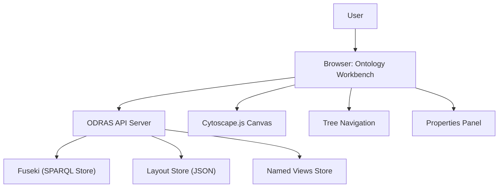

# Ontology Workbench Guide
*Complete Visual Ontology Editing System*

## 🎯 Overview

The ODRAS Ontology Workbench is a comprehensive visual ontology editing system that combines tree-based navigation, canvas-based diagramming, and property editing in a unified interface. It supports OWL/RDF ontologies with advanced features like Named Views, import management, and real-time collaboration.

## 🏗️ Architecture

### High-Level Architecture


### Core Components

#### **1. Visual Interface**
- **Tree View**: Hierarchical class and property navigation
- **Canvas View**: Interactive Cytoscape.js diagram editor
- **Properties Panel**: Detailed entity editing interface
- **Named Views**: State capture and restoration system

#### **2. Data Storage**
- **Fuseki SPARQL Store**: RDF/OWL triple storage (one named graph per ontology)
- **Layout Store**: UI-specific positioning and visualization data
- **Named Views Store**: Saved workspace states with metadata
- **Import Registry**: External ontology import tracking

#### **3. Backend Services**
- **Ontology Manager**: CRUD operations and validation
- **SPARQL Query Engine**: Efficient ontology querying
- **Import Resolution**: External ontology loading and linking
- **Equivalence Detection**: Cross-ontology class matching

## 🚀 Core Features

### **Visual Editing**

#### **Tree-Based Navigation**
- **Hierarchical Display**: Classes and properties in taxonomic structure
- **Search and Filter**: Quick entity location
- **Drag-and-Drop**: Easy relationship creation
- **Context Menus**: Right-click operations for editing

#### **Canvas-Based Diagramming**
- **Interactive Layout**: Drag, zoom, pan operations
- **Automatic Layouts**: Force-directed, hierarchical, circular layouts
- **Visual Styling**: Color-coded entity types and relationships
- **Selection Tools**: Multi-select, grouping, alignment tools

#### **Property Editing**
- **Entity Details**: Labels, comments, annotations
- **Relationship Management**: Domain, range, cardinality constraints
- **Type Assignment**: Class types, property characteristics
- **Validation**: Real-time constraint checking

### **Named Views System**

#### **State Capture**
- **Canvas State**: Position, zoom, element visibility
- **Tree State**: Expanded nodes, selected items
- **Filter State**: Active filters and search terms
- **Import State**: Visible imported ontologies

#### **View Management**
- **Create Views**: Save current workspace state with descriptive names
- **Switch Views**: Instantly restore saved configurations
- **Edit Views**: Rename, update, or delete saved views
- **Return to Original**: Reset to pre-view state

#### **Use Cases**
- **Presentation Views**: Clean layouts for demonstrations
- **Focus Views**: Hide irrelevant elements for specific tasks
- **Comparison Views**: Side-by-side ontology analysis
- **Teaching Views**: Progressive disclosure for education

### **Import Management**

#### **External Ontology Integration**
- **URL Import**: Load ontologies from web URLs
- **File Upload**: Import local OWL/RDF files
- **Registry Integration**: Access to common ontology libraries
- **Version Management**: Track imported ontology versions

#### **Import Visualization**
- **Collapsed View**: Imported ontologies as single nodes
- **Expanded View**: Full imported ontology structure
- **Equivalence Linking**: Automatic matching of equivalent classes
- **Overlay Control**: Show/hide imported elements

#### **Import Processing**
- **Namespace Resolution**: Proper URI handling for imports
- **Dependency Management**: Recursive import resolution
- **Conflict Detection**: Identify naming conflicts
- **Performance Optimization**: Lazy loading of large imports

## 🛠️ Implementation

### **Frontend Implementation**

#### **Technology Stack**
- **Cytoscape.js**: Canvas rendering and interaction
- **HTML/CSS/JavaScript**: Core web technologies
- **Local Storage**: Client-side state persistence
- **WebSocket**: Real-time collaboration (future)

#### **Key Components**
```javascript
// Core workbench functions
function loadOntology(ontologyId)
function saveOntology()
function createClass(className, parentClass)
function createProperty(propertyName, domain, range)
function applyNamedView(viewName)
function captureCurrentState()
```

### **Backend Implementation**

#### **API Endpoints**
```python
# Ontology CRUD
GET    /api/ontology/{id}           # Get ontology data
POST   /api/ontology               # Create new ontology
PUT    /api/ontology/{id}          # Update ontology
DELETE /api/ontology/{id}          # Delete ontology

# Entity Management
POST   /api/ontology/{id}/class    # Create class
PUT    /api/ontology/{id}/class/{class_id}  # Update class
DELETE /api/ontology/{id}/class/{class_id}  # Delete class

# Named Views
GET    /api/ontology/{id}/views    # List named views
POST   /api/ontology/{id}/views    # Create named view
PUT    /api/ontology/{id}/views/{view_id}   # Update view
DELETE /api/ontology/{id}/views/{view_id}   # Delete view

# Import Management
POST   /api/ontology/{id}/import   # Import external ontology
GET    /api/ontology/{id}/imports  # List imports
DELETE /api/ontology/{id}/import/{import_id}  # Remove import
```

#### **Data Models**
```python
class Ontology:
    id: str
    name: str
    base_iri: str
    description: str
    created_at: datetime
    updated_at: datetime
    layout_data: dict
    named_views: List[NamedView]

class NamedView:
    id: str
    name: str
    description: str
    canvas_state: dict
    tree_state: dict
    filter_state: dict
    created_at: datetime
```

### **SPARQL Integration**

#### **Ontology Storage**
```sparql
# Store ontology in named graph
GRAPH <http://odras.local/ontology/{ontology_id}> {
    <http://example.org/MyClass> a owl:Class ;
        rdfs:label "My Class" ;
        rdfs:comment "Example class description" .
}
```

#### **Query Patterns**
```sparql
# Get all classes in ontology
SELECT ?class ?label WHERE {
    GRAPH <{ontology_iri}> {
        ?class a owl:Class .
        OPTIONAL { ?class rdfs:label ?label }
    }
}

# Get class hierarchy
SELECT ?class ?parent WHERE {
    GRAPH <{ontology_iri}> {
        ?class rdfs:subClassOf ?parent .
    }
}
```

## 📋 User Workflows

### **Basic Ontology Creation**
1. **Create New Ontology**: Set name, IRI, description
2. **Add Root Classes**: Create top-level concepts
3. **Build Hierarchy**: Add subclasses and relationships
4. **Define Properties**: Create object and data properties
5. **Set Constraints**: Add domain, range, cardinality
6. **Save and Export**: Persist changes and export formats

### **Advanced Editing**
1. **Import External Ontologies**: Load reference ontologies
2. **Create Equivalence Links**: Match concepts across ontologies
3. **Use Named Views**: Create focused workspace configurations
4. **Collaborative Editing**: Share and co-edit ontologies
5. **Version Management**: Track changes and create versions

### **Analysis and Validation**
1. **Consistency Checking**: Validate ontology logic
2. **Completeness Analysis**: Identify missing concepts
3. **Impact Assessment**: Analyze change effects
4. **Export Options**: Generate multiple output formats

## 🔧 Configuration

### **Workbench Settings**
```javascript
// Default configuration
const WORKBENCH_CONFIG = {
    canvas: {
        layout: 'cose',
        animation: true,
        fit: true,
        padding: 50
    },
    tree: {
        expandDepth: 2,
        showProperties: true,
        sortAlphabetically: true
    },
    views: {
        autoSave: true,
        maxViews: 20,
        showThumbnails: true
    }
};
```

### **Performance Settings**
```python
# Backend configuration
ONTOLOGY_CACHE_SIZE = 100
MAX_IMPORT_DEPTH = 5
QUERY_TIMEOUT = 30
LAYOUT_CACHE_TTL = 3600
```

## 🧪 Testing

### **Frontend Testing**
- **Canvas Interactions**: Drag, select, zoom operations
- **Tree Navigation**: Expand, collapse, search functionality
- **Property Editing**: Form validation and submission
- **Named Views**: State capture and restoration

### **Backend Testing**
- **SPARQL Queries**: Query correctness and performance
- **API Endpoints**: CRUD operation validation
- **Import Processing**: External ontology handling
- **Data Integrity**: Consistency and constraint validation

### **Integration Testing**
- **End-to-End Workflows**: Complete ontology creation flows
- **Cross-Browser Testing**: Compatibility across browsers
- **Performance Testing**: Large ontology handling
- **Concurrent Editing**: Multi-user scenarios

## 🚀 Future Enhancements

### **Advanced Features**
- **OWL Code Editor**: Dual-mode editing (visual + code)
- **SHACL Constraints**: Advanced validation rules
- **Reasoning Integration**: Automatic inference
- **Version Control**: Git-like ontology versioning

### **Collaboration Features**
- **Real-time Editing**: WebSocket-based collaboration
- **Change Tracking**: Detailed edit history
- **Conflict Resolution**: Merge conflict handling
- **Role-based Permissions**: Fine-grained access control

### **Visualization Enhancements**
- **3D Visualization**: Three-dimensional ontology views
- **Custom Layouts**: User-defined layout algorithms
- **Interactive Legends**: Dynamic visual guides
- **Export Options**: High-quality image generation

---

*This guide consolidates all ontology workbench documentation and serves as the comprehensive reference for visual ontology editing in ODRAS.*
