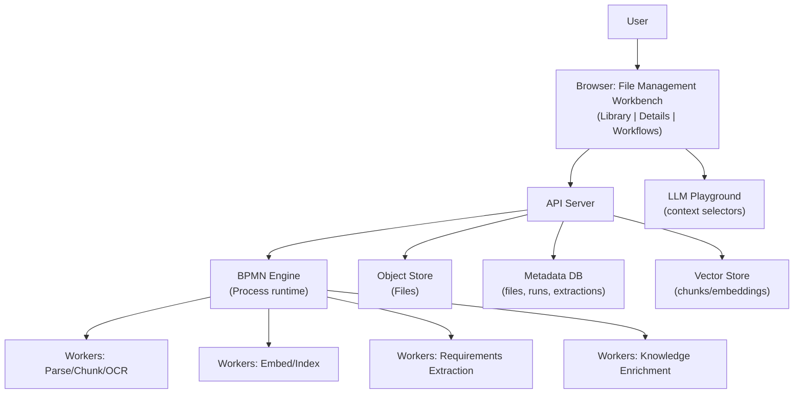
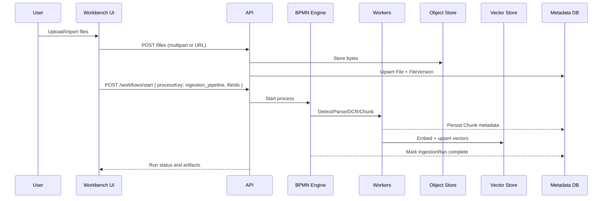

# File Management Workbench MVP

This document defines the MVP for managing project files used for requirements extraction and knowledge documents. All RAG pipelines are orchestrated as BPMN workflows — no hard-coded pipelines in application code. The design favors determinism, observability, and replayability.

## Goals and scope (MVP)
- Manage project-scoped files: upload, import, list, preview, organize.
- BPMN-orchestrated pipelines for ingestion, chunking, embedding, indexing, and extraction.
- Requirements extraction and Knowledge documents preparation as explicit workflows.
- Integrate with LLM Playground by exposing curated, searchable context sets (Requirements and Knowledge) and actions.
- Provide visibility into workflow runs (status, logs, artifacts) with ability to re-run.

## Principles
- BPMN-first orchestration for all RAG steps; workers are stateless services.
- Idempotent operations and deterministic inputs (content hashing, metadata versioning).
- Separation of concerns: raw file storage vs. derived data (chunks/embeddings/extractions).
- Traceability: every artifact carries lineage to the file version and workflow run.

## High-level architecture

## Data model (MVP)
- Project: id, name, settings.
- File: id, projectId, name, bytesHash, mimeType, size, storageKey, createdAt, tags[].
- FileVersion: fileId, version, bytesHash, ocrApplied?, textExtracted?, createdAt.
- IngestionRun: id, projectId, fileId(s), processKey, status, startedAt, finishedAt, logsRef.
- Chunk: id, fileId/version, order, text, tokenCount, section/page metadata.
- Embedding: chunkId, vector, modelId, createdAt.
- Requirement: id, projectId, sourceFileId/version, text, citations[], confidence.
- KnowledgeItem: id, projectId, sourceFileId/version, text/snippet, citations[], tags[].

## BPMN processes (no hard-coded pipelines)
- ingestion_pipeline
  - Detect type → optional OCR → parse → normalize → chunk → embed → upsert vector store → persist metadata → complete.
- requirements_extraction
  - Select doc set → retrieve relevant chunks → LLM extract requirements → persist items with citations → summary.
- knowledge_enrichment
  - Select doc set → retrieve → LLM synthesize knowledge items (with attributions) → persist → summary.
- rag_playground_session (ephemeral)
  - Given selected context sets → retrieval → LLM response → optional actions (save snippet, link, create requirement).

Represent process definitions as BPMN (XML) files under `bpmn/` and reference them by `processKey` at runtime.

## User flows (MVP)
- Library
  - Upload/import files (drag-drop, URL import).
  - View list with filters (docType: requirements|knowledge|unknown, tags, status).
  - Select files and start a workflow: ingestion_pipeline, requirements_extraction, knowledge_enrichment.
  - Monitor run status; view logs; re-run failed steps.
- Document details
  - Preview text (post-parse), metadata, and derived artifacts (chunks, embeddings count, extracted items).
  - Actions: re-ingest, re-embed (model change), open in Playground context.
- Playground integration
  - Choose context from Requirements and Knowledge sets; run chat with citations; actions to persist back.

## Sequence: ingestion pipeline

## API sketch (MVP)
- POST /files (multipart or { url }) → 201 { fileId }
- GET /files?project=<id>&q=&docType=&status= → 200 [ files ]
- GET /files/:id → 200 { file, versions, latestArtifacts }
- POST /workflows/start { processKey, projectId, params } → 202 { runId }
- GET /workflows/:runId → 200 { status, steps[], logsRef, outputs }
- GET /chunks?fileId=&version= → 200 [ chunks ]
- GET /requirements?project=<id> → 200 [ items ]
- GET /knowledge?project=<id> → 200 [ items ]
- POST /playground/sessions → 201 { sessionId }
- POST /playground/sessions/:id/message → 200 { reply, citations[] }

Notes:
- All long-running operations are started via `POST /workflows/start` referencing a BPMN `processKey`.
- Workers are triggered via the BPMN engine; API remains thin and stateless.

## Storage strategy (MVP)
- Object Store: local FS or S3-compatible for file bytes.
- Metadata DB: relational (e.g., Postgres) for files, runs, extractions.
- Vector Store: pgvector/Qdrant/Weaviate; store embedding model id with vectors.

## LLM Playground planning
- Context selectors: choose Requirements and Knowledge subsets; filter by project/tags.
- Chat with citations; every citation resolves to file/version/chunk.
- Actions (persisted via API):
  - "Create requirement" → adds Requirement with citation to source chunk.
  - "Save snippet to Knowledge" → creates KnowledgeItem with lineage.
  - "Link to requirement" → associates snippet to an existing Requirement.
- Sessions may optionally be driven by a BPMN `rag_playground_session` for parity and audit.

## Validation & safety (MVP)
- Deduplicate files by bytesHash per project; allow reprocessing of the same file.
- Enforce model/version consistency in embeddings; re-embed on model change via workflow.
- Ensure each derived artifact carries provenance (fileId, version, runId, stepId).

## Versioning (later)
- Maintain FileVersion chain with immutable derived artifacts; soft-delete support.
- Add process versioning and migration for BPMN definitions.

## MVP TODO checklist (File Management Workbench)

- [ ] FM-0: Route and Library
  - [ ] Create `File Management` route/page; mount under existing layout
  - [ ] Project-scoped library view with filters (docType/tags/status)
  - [ ] Upload/import (drag-drop + URL)

- [ ] FM-1: BPMN engine and definitions
  - [ ] Add BPMN engine wiring in backend (runtime + REST start/status)
  - [ ] Define `ingestion_pipeline.bpmn` (detect → ocr? → parse → chunk → embed → index)
  - [ ] Define `requirements_extraction.bpmn`
  - [ ] Define `knowledge_enrichment.bpmn`
  - [ ] Define `rag_playground_session.bpmn` (ephemeral, optional)

- [ ] FM-2: Workers (services)
  - [ ] Parser/OCR/Chunker worker with text normalization
  - [ ] Embedder/Indexer worker (configurable model)
  - [ ] Requirements extractor worker (LLM + citations)
  - [ ] Knowledge synthesizer worker (LLM + citations)

- [ ] FM-3: API contracts
  - [ ] POST /files, GET /files, GET /files/:id
  - [ ] POST /workflows/start, GET /workflows/:runId
  - [ ] GET /chunks, GET /requirements, GET /knowledge

- [ ] FM-4: Library UI
  - [ ] Upload/import UI with progress
  - [ ] File list with status badges and actions (start workflows)
  - [ ] Run status panel and logs link

- [ ] FM-5: Document details UI
  - [ ] Text preview, metadata, derived artifacts (chunks/embeddings counts)
  - [ ] Actions: re-ingest, re-embed, open in Playground

- [ ] FM-6: Playground integration
  - [ ] Context selectors for Requirements/Knowledge subsets
  - [ ] Chat with citations and actions (save snippet/link/create requirement)

- [ ] FM-7: Validation, idempotency, and provenance
  - [ ] Content hashing and deduplication
  - [ ] Provenance capture (file/version/run/step) on all artifacts

- [ ] FM-8: Tests and acceptance
  - [ ] Unit tests for parsing/chunking/embedding
  - [ ] Contract tests for workflow start/status and artifact creation
  - [ ] UI smoke test: upload → ingest → view artifacts → run extraction → view items

## Acceptance criteria (MVP)
- Upload/import files; list and filter in Library.
- Start ingestion via BPMN; chunks/embeddings appear with provenance.
- Start requirements extraction and knowledge enrichment via BPMN; items created with citations.
- Playground consumes selected context sets and supports actions that persist artifacts.
- No RAG steps are hard-coded in app logic; all run through BPMN by `processKey`.

